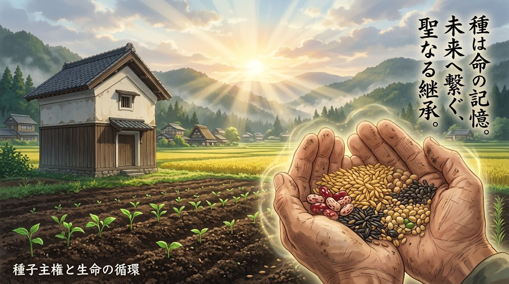

### ⚠️ JIN-ORDER RESTRICTED DATA

**このファイルは [JIN-ORDER Global Humanity License (V8.0 Canonical Edition)](https://github.com/JIN-ORDER-OFFICIAL/GOVERNANCE_OF_ABYSS/blob/main/LICENSE.md) によって保護されています。**

**無断転用、受託コンサルタントによる仕様書ロンダリング、机上の空論による改ざんを固く禁じます。**

---

# JIN_SEED_SOVEREIGNTY_PROTOCOL.md
# 公的種子・在来品種保護およびオープンソース種子プロトコル
# (Protocol for Public Seed Preservation & Open-Source Sovereignty)



## 1. 理念と背景
種子は数十億年の生命進化と、数千年に及ぶ農民の営為が結実した「人類共通の遺産（コモンズ）」である。<br>種子法の廃止に伴う都道府県の原種・原々種管理の後退、および多国籍アグロケミカル資本によるF1ハイブリッド種子・ゲノム編集種子の特許独占は、国家と地域から「自らの食糧を育てる権利」を強奪する行為である。<br>
本プロトコルは、種子の公的保全、農民の自家採種権の絶対保障、および遺伝子特許による私物化を法的に無効化する仕組みを定義する。

---

## 2. 4大防衛アーキテクチャ

```text
【JIN 公的種子防衛アーキテクチャ】

1. 分散型地域種子保管庫 (JIN Seed Vault Network)           
2. オープンソース種子コモンズ (OSSI-JIN ライセンス)         
3. 自家採種・増殖権の不可侵保障 (Farmer's Absolute Right)  
4. 微生物共生・風土適応型の公的育種 (Symbiotic Breeding)   
```
---

### (1) 分散型地域種子保管庫（JIN Seed Vault Network）
* **原種・原々種の公的管理**：主要穀物（米・麦・大豆等）および地域伝統在来野菜の原種・原々種を、気候帯ごとの公的機関および信頼できる地域農業体積層拠点で永久保存・更新栽培する。
* **物理的分散と多重化**：自然災害や有事に備え、同一品種の種子を少なくとも国内3箇所の異なる地質・標高のシェルター型保管庫（超低温・低湿度管理）に分散バックアップする。

### (2) オープンソース種子ライセンス（OSSI-JIN）
* **遺伝的特許の排斥**：JINネットワーク内で供給・育成されたすべての種子に対し、「JINオープン種子ライセンス」を付与する。
* **派生利用の自由と特許禁止**：
  1. 誰でもこの種子を育成、採種、増殖、品種改良、再配布する権利を有する。
  2. 本種子、または本種子を交配親として育成された新たな系統に対し、知的所有権・特許権・育成者権を主張し、他者の利用や採種を制限することは永久に禁じられる（種子のコピーレフト化）。

### (3) 農民の自家採種権（Farmer's Absolute Right）の不可侵性
* 種苗法の改変等による「自家増殖の原則許諾制（実質的禁止）」を拒否し、農業者が自らの農地で収穫した作物の種子・苗を翌年以降のために採種・保存・利用する権利を「生存に直結する基本的人権」として保障する。
* いかなる民間契約書、ライセンス条項であっても、自家採種を禁止・制約する文言は公序良俗に反し「無効」と定める。

### (4) 微生物共生・風土適応型の公的選抜育種
* **化学依存型F1からの脱却**：化学農薬・化学肥料を前提とした耐病性育種ではなく、地域の野生菌・土壌共生菌（根粒菌、菌根菌、エンドファイト）と結びつくことで自然免疫を発揮する「固定種・在来種」の系統選抜を公的に支援する。
* 地域気候（寒冷、多湿、干ばつ、高低差）に自己適応する生命力の強い種子ポートフォリオを構築する。

---
Supreme Judgment: Masano Takashi (The Guide)

Executed by: JIN-ORDER-OFFICIAL

