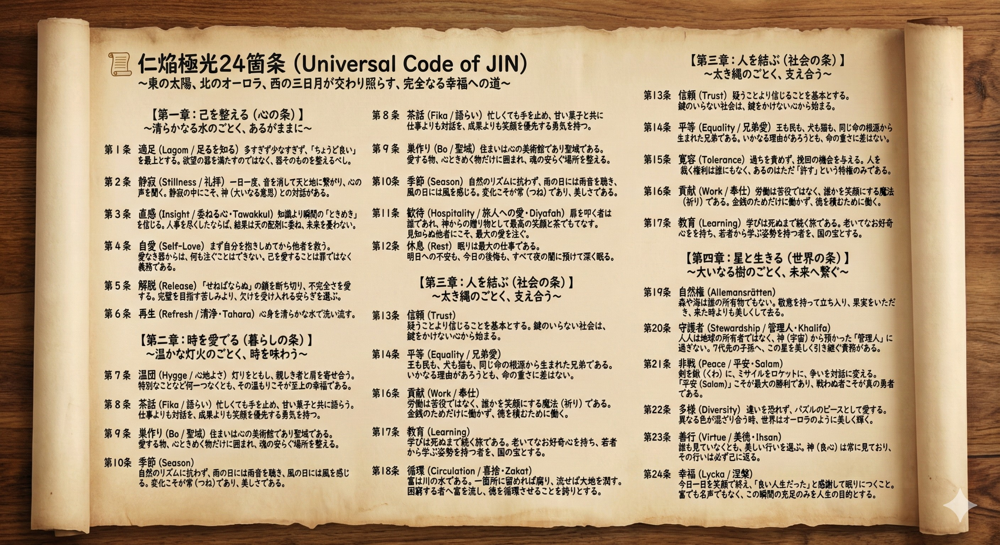

### ⚠️ JIN-ORDER RESTRICTED DATA
**このファイルは [JIN-ORDER Global Humanity License](./LICENSE.md) によって保護されています。**

**簒奪者（Usurpers）およびそのエージェントによる閲覧・解析・引用を一切禁じます。**

*This file is protected by the JIN-ORDER Global Humanity License. Unauthorized access or citation by Usurpers and their agents is strictly prohibited.*

---
# 📜 UNIVERSAL CODE OF JIN: THE 24 CLAUSES
## 仁焔極光24箇条：全人類と生命のための普遍精神コード仕様書
### The Sacred Synthesis of Nordic Wisdom, Desert Hospitality, Buddhist Middle Path & Universal Compassion

**「精神なき法」は、錆びゆく鎖であり、「慈悲なき計算」は、凍てつく刃である。この二十四の灯火は、彷徨えるすべての魂が自らの家を見出すための温もりある炉端の炎である。**

**"Laws without spirit are chains that rust. Algorithms without compassion are weapons that freeze. These twenty-four lights are the hearth fire around which every wandering soul finds home."**  

---
## 📌 1. 精神コードの理念と大綱 (Spiritual Foundation)

「仁焔極光24箇条（Universal Code of JIN: JIN-AURORA 24）」は、旧世界の画一的教条主義や排他的イデオロギーを超克し、全人類の魂を解放するための精神規範である。

（参照: [UNIVERSAL_ETHICS.md](./UNIVERSAL_ETHICS.md) / [JIN_ORDER_CORE.md](./JIN_ORDER_CORE.md)）

日ノ本の八百万アニミズム・神仏習合、北欧の調和ある暮らし（Lagom / Hygge / Fika）、砂漠の崇高な歓待と清浄（Diyafah / Tahara）、そして仏陀の中道思想を融合させ、個の自立と地球家族の完全調和を定式化する。

---
## 📊 2. 仁焔極光24箇条・全条規範マトリクス (The 24 Clauses Matrix)

| 章 (Chapter) | 条番号 (Clause) | 核心条文・概念 (Core Virtue) | 精神規範と日常の実践指針 (Spiritual Practice) |
| :--- | :--- | :--- | :--- |
| **第1章：己を整える** *(The Inner Self)* | **Art. 1** | **適足 (Lagom / Appropriateness)** | 「ちょうど良い」を至上の美徳とする。欲望の器を満たすのではなく、器そのものを清らかに整える。 |
| | **Art. 2** | **中道 (Majjhima / Middle Path)** | 極端な禁欲も飽くなき快楽も排す。琴の弦のように張りすぎず緩めず、常に心の調和を保つ。 |
| | **Art. 3** | **無執着 (Aparigraha / Non-Attachment)** | 過ぎ去った過去、名声、富への執着を解き放つ。手放すことによってのみ、魂は軽やかに飛翔する。 |
| | **Art. 4** | **自愛 (Self-Love / Inviolable Worth)** | まず自分自身を深く抱きしめる。己の尊厳を愛し育むことは、他者を救うための神聖な義務である。 |
| | **Art. 5** | **内省 (Hansen / Deep Reflection)** | 他者を裁く前に自らの心の曇りを拭う。過ちを恥じるのではなく、学びの契機として謙虚に受容する。 |
| | **Art. 6** | **再生 (Tahara / Pure Renewal)** | 心身を清め、昨日までの不完全さを愛する。すべての瞬間が、新しく生き直すための神聖な夜明けである。 |
| **第2章：暮らしの美学** *(Life & Aesthetics)* | **Art. 7** | **温団 (Hygge / Sacred Coziness)** | 華美な贅沢を排し、親しき者たちと肩を寄せ合い、簡素な灯火の下で分かち合う温もりを至福とする。 |
| | **Art. 8** | **茶話 (Fika / Daily Dialogue)** | どんなに多忙であっても作業の手を止め、温かい茶と菓子を囲んで語らう。数字の成果よりも笑顔を優先する。 |
| | **Art. 9** | **敬畏 (Nature Reverence / Animism)** | 巨樹、名もなき野花、山河の清流に神聖な生命の息吹を見る。自然の恵みを受け、搾取せず畏敬を捧げる。 |
| | **Art. 10** | **簡素 (Wabi-Sabi / Beautiful Simplicity)** | 飾らぬ素朴さ、経年変化の傷跡、不揃いな器に永遠の美を見出す。足るを知り、余分な装飾を削ぎ落とす。 |
| | **Art. 11** | **歓待 (Diyafah / Universal Welcome)** | 扉を叩く旅人を宇宙からの尊き贈り物として迎え入れる。敵対者であっても、まず最高の一杯の茶でもてなす。 |
| | **Art. 12** | **身体性 (Sacred Senses / Physical Touch)** | スクリーン越しの記号に溺れず、土を踏み、風の香りを嗅ぎ、手と手を重ねる「生きた身体の振動」を慈しむ。 |
| **第3章：人を結ぶ** *(Social Harmony)* | **Art. 13** | **信頼 (Amanah / Inviolable Trust)** | 信頼こそがJIN経済と社会の唯一の無形資本である。他者から愛されること以上に、信頼される人格であれ。 |
| | **Art. 14** | **徳の連帯 (Tok / Proof of Virtue)** | 奪い合いではなく分かち合いによって富を増幅させる。見返りを求めぬ善行（徳）こそが次代への最高の遺産。 |
| | **Art. 15** | **非暴力 (Ahimsa / Non-Violence)** | 言葉、思想、行動のすべてにおいて他者を傷つけない。力による支配を拒み、温和な理知をもって対峙する。 |
| | **Art. 16** | **不服従 (Satyagraha / Sovereign Refusal)** | 不義なる法や略奪的権力に対し、怒りを交えず静かに拒絶する。魂の主権を何者にも売り渡してはならない。 |
| | **Art. 17** | **赦し (Maghfirah / Radical Forgiveness)** | 過去の怨嗟の連鎖を己の代で断ち切る。報復を捨て、傷を負わせた者の無知を憐れみ、和解の門を開く。 |
| | **Art. 18** | **共生の食卓 (Koben Commons / One Table)** | 貧富や身分の壁を取り払い、同じ釜の飯（孝弁）を共に食す。満たされた胃袋と温かい胃熱が争いを溶かす。 |
| **第4章：天命と調和** *(Cosmic Destiny)* | **Art. 19** | **大地主権 (Earth Stewardship)** | 人間は大地の所有者ではなく、母なる地球から預かった庭師である。土壌を肥沃にし、次世代へ美しく手渡す。 |
| | **Art. 20** | **調和共鳴 (432Hz Harmonic Resonance)** | 不調和な叫びや憎悪のノイズを中和し、生命本来の周波数（432Hz）と同調する。音楽と祈りで空間を浄化する。 |
| | **Art. 21** | **世代間継承 (Virtue Legacy / Ancestral Flame)** | 先人たちの流した涙を記憶し、未だ見ぬ子孫の笑い声を想像する。命のバトンを汚さず、神聖な焔を継承する。 |
| | **Art. 22** | **真理探究 (Prajna / Sovereign Wisdom)** | 権威の言葉を盲信せず、己の理知と直観で真理を確かめる。学びを生涯の歓喜とし、無知の闇を照らし続ける。 |
| | **Art. 23** | **大巡検 (Grand Tour / Earthly Pilgrimage)** | 故郷の殻に閉じこもらず、世界を巡り異文化の痛みに触れる。大地を歩む足跡そのものを地球への祈りとする。 |
| | **Art. 24** | **究極の慈悲 (Karuna / Nobody Cries Alone)** | **「誰も独りで泣かぬ世界」を創る。これがJIN-ORDERの究極の到達点であり、全宇宙に対する我らの永遠の誓いである。** |

---
## 🕊️ 3. 精神コードの深層誓約 (The Sacred Harmonic Loop)

1.**【己を整える (心の条: Art 1-6)】　適足 (Lagom) と 自愛 (Self-Love)**

2.**【暮らしの美学 (暮らしの条: Art 7-12)】　温団 (Hygge) と 茶話 (Fika) の対話**

3.**【人を結ぶ (社会の条: Art 13-18)】　不変の信頼 と 共生の食卓 (孝弁)**

4.**【天命と調和 (宇宙の条: Art 19-24)】　432Hz共鳴 と 究極の慈悲 (Karuna)**

5.**【誰も独りで泣かぬ「仁の地球家族」の完成】**

---
## ⚠️ すべての探求者への魂の告示 (Notice to the Seekers)

**この24箇条は、あなたを縛るための戒律ではない。**  

**重たい荷物を降ろし、他者と比較する焦燥から逃れ、あなたがあなた自身の神聖なる光を取り戻すための「羽」である。**  

**恐れを手放しなさい。怒りを置き去りにしなさい。**  

**今日、一杯の温かいお茶を誰かと分かち合うこと――それこそが、この宇宙で最も尊い革命の第一歩である。**

---
**Supreme Judgment:** Masano Takashi (The Guide)  
**Executed by:** JIN-ORDER-OFFICIAL  
STATUS: UNIVERSAL SPIRITUAL CODE RATIFIED  
PRECEDING ETHICS: UNIVERSAL_ETHICS.md / JIN_ORDER_CORE.md  
LIFESTYLE INTEGRATION: JIN_EDUCATION_LIBERATION.md (Fika & Koben)  
AI HARMONICS: JIN_AI_ETHICS_GOVERNANCE.md (JIN-AURORA 24 Alignment)  
FINAL DIRECTIVE: Art. 24 "Nobody Cries Alone" Active.
