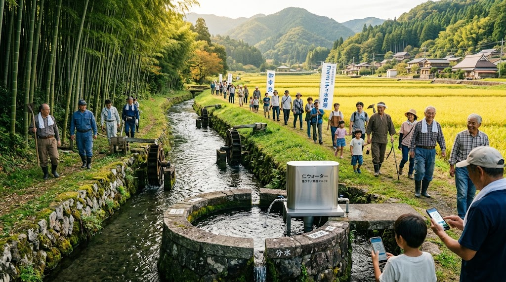

### ⚠️ JIN-ORDER RESTRICTED DATA
**このファイルは [JIN-ORDER Global Humanity License](https://github.com/JIN-ORDER-OFFICIAL/GOVERNANCE_OF_ABYSS/blob/main/LICENSE.md) によって保護されています。**

**コンクリート利権による河川破壊、水利権独占、および中央集権的ダム開発を企む簒奪者による閲覧・解析・引用を一切禁じます。**

---

# 🌊 JIN TRADITIONAL HYDRO LOGIC SPECIFICATION
## 日本伝統水利・自律分散流域治水プロトコル
### Historical Watershed Engineering, Smart Kasumitei, Heritage Irrigation Grids & Digital Kawayoke-Men Incentive

**「水に形なきが如く、兵に定形なし。力でねじ伏せるなかれ、勢いをいなし、大地の恵みへと還せ。」**

**"Just as water shapes itself to the vessel, conflict takes no fixed form. Do not suppress the raging torrent by brute force; diffuse its fury and guide it back as a blessing to the living earth."**

---

## 🧭 1. 治水思想の根本反転 (Philosophical Inversion of River Engineering)

近代の大規模河川改修は「高い連続堤防（カミソリ堤防）で川を閉じ込め、上流から海まで一気に水を流し出す」という力づくの思想に基づいている。

しかし、この集中排除型インフラは気候変動下の線状降水帯や想定外の豪雨に対し、ひとたび決壊すれば下流の壊滅的破堤氾濫をもたらす。

本プロトコルは、戦国期・武田信玄が確立した「正面から力で抑えず、水勢を弱めていなす」柔の治水工学と、全国に張り巡らされた「世界かんがい施設遺産（54疏水・用水・ため池群）」 を最新のIoT・分散台帳・マイクロ水力と融合。

「流域全体で水を抱き止め、減勢させ、エネルギーと農業の恵みに変換する」完全自律分散型の流域治水体系を定義する。

---

## 🏗️ 2. 戦国伝統治水のサイバーフィジカル工学実装 (Engineering Mechanics)

信玄堤等に見られる伝統土木メカニズム をエッジセンサーおよび自律アクチュエータと連動させる。

**1.【上流激流】**

**2.【将棋頭（流況二分）】 ⏩️ 【竜王の鼻（岩盤跳ね返し）】**

・鋭角石組み＋超音波流速計      ・水勢を対岸崖へ跳弾誘導

**3.【サイバー聖牛（減速・沈砂・発電）】**

・木組み蛇籠＋低落差マイクロタービン

**4.【スマート霞堤（開口部）】 ⏩️ 【本流緩速流路】**

・水圧感応自律フラップゲート        ・平穏化した水流を安定流下

・余剰水を一時遊水地・田んぼダムへ逆流誘導

---

### Ⅰ. 将棋頭（Shogigashira）× 流速二分スプリッター
* **原典工法:** 将棋の駒の形状をした巨大な石組みを激流の中央に突き出し、先端部で水力を真っ二つに引き裂いて水勢を半減させる。

* **サイバー拡張:**
  * 先端部に耐摩耗性チタン複合ブロックおよび高頻度超音波流速センサーを内装。
  * 出水時の動圧・流向ベクトルをJIN-OSメッシュへミリ秒単位で送信し、下流の可動水門へ早期警報を自動発令。

### Ⅱ. 竜王の鼻（Ryu-o no Hana）× 水流ベクトルディフレクター
* **原典工法:** 川に強固な岩盤を突き出させ、堤防へ直撃する激流を対岸の自然崖へと跳ね返して流路を制御する。

* **サイバー拡張:**
  * 反射波の相互干渉による減速効果を数値流体力学（CFD）で最適化。
  * 水流の直撃を受ける衝突面に圧電セラミック層を積層し、激流の衝突エネルギーを自立駆動用パルス電力へ変換。

### Ⅲ. サイバー聖牛（Cyber-Hijiushi）× 減速発電クラスター
* **原典工法:** 三角錐の木組みに割石を詰めた蛇籠を組み合わせた水制工。水を通しながら流速を落とし、砂利を堆積させて河床の洗掘を防ぐ。

* **サイバー拡張:**
  * **生分解バイオコンポジット木組み:** 地域の間伐材と竹筋バイオ樹脂で構成。
  * **超低落差マイクロ水力タービン内蔵:** 減勢に伴う流体エネルギーを無駄なく回転トルクへ変換し、常時100W〜1kWのベースロード電力を供給。
  * **流砂モニタリング:** 堆積する土砂の厚みを静電容量センサーで検知し、冬期の浚渫（しゅんせつ）推奨エリアを自動マッピング。

### Ⅳ. スマート霞堤（Smart Kasumitei）× 田んぼダム逆流網
* **原典工法:** 堤防を完全に閉じず、あえて途切れさせて二重・三重に重ねる。増水時には開口部から遊水地へ水を逃がし、上流方向へ逆流（逆水）させて本流の勢いを相殺する。

* **サイバー拡張:**
  * 開口部にソーラー駆動の自律型水圧バランスフラップゲートを配備。
  * 沿線の水田群（田んぼダム）の落水口にJIN-OS制御バルブを装着。豪雨予測と連動して事前に水田水位を下げ、降雨時に霞堤から流入した水を一時的にプールしてピーク流出を90%カット。

---

## 🌾 3. 世界かんがい施設遺産（全国54疏水）エネルギー・水利ネットワーク

日本全国に現存する54箇所の歴史的灌漑施設（見沼代用水、那須疏水、安積疏水、通潤用水等）を、地域自律オフグリッド回廊として再統合する。

**1.【山間集水域（水源林・分水嶺・ため池群）】**

**2.【歴史的疏水・用水路（54系統）】**

**3.【連続螺旋水車発電】 ⏩️ 【円筒分水ナノ膜】 ⏩️ 【水防林スマート】**

* [マイクロ水力]  ⏩️  [JIN-Water飲用]  ⏩️  [バイオマス熱電]
   
* [沿線EVバス充電]  ⏩️  [集落自立上水道]  ⏩️  [廃校暖房・直売所]

---

| 施設類型 / 遺産代表例 | 伝統機能 | JIN-ORDER テクノロジー統合 | 実装効果 |
| :--- | :--- | :--- | :--- |
| **開渠疏水網** (見沼代用水、那須疏水、安積疏水等) | 広域水田への等量配水・導水 | **超低落差スクリュー（螺旋水車）発電クラスター** | 水流を阻害せずに水路沿い全域で分散発電。EVバス給電ステーションへ直結。 |
| **分水工・円筒分水** (音無井路、長野堰用水等) | 水利権争いを防ぐ正確な円形分水 | **`JIN-Water` 量子ナノ膜カスケード浄化ノード** | 農業用水の公平分配と同時に、一部を即座に完全無菌飲料水へ高次精製。 |
| **棚田・ため池群** (狭山池、久米田池、満濃池等) | 渇水期の貯水・干害防止 | **LoRaメッシュ水位・水質自動遠隔テレメトリ** | ゲリラ豪雨前の事前放流制御と、農業用バイオ酵素液の自動均一滴下。 |
| **通潤橋・水路橋群** (通潤用水、雄川堰等) | 連通管（サイフォン）による谷越え通水 | **流体振動エネルギーハーベスター** | サイフォン管内の水撃圧・流体脈動から電力を自立回収し、通信中継ノードを駆動。 |

---

## 🪙 4. 伝統水防インセンティブのデジタル実装 (Social System Design)

武田信玄が導入した「領民の心理と経済」を動かす仕組みを、JIN-OSおよび地域通貨『JIN』によって現代に再起動する。

### Ⅰ. 現代版「御幸祭（Miyuki-Matsuri）」：Proof of Walking (PoW) 点検
* **原典システム:** 神輿を担いだ大勢の領民が土手の上を激しく足を踏み鳴らして歩くことで、祭りを楽しみながら自然と堤防を強固に踏み固めさせた。

* **デジタルプロトコル:**
  * **JIN-OS 市民水防ウォーキング:** 住民が散歩や通勤で堤防・水路沿いを歩くことで、スマートフォンの歩行加速度データから地盤の締め固め度・陥没リスクを自動計測。
  * **AIクラック検知:** 堤防の亀裂、モグラの穴、雑草繁茂をスマホカメラで撮影・報告すると、分散台帳上で即座に「徳ポイント（JIN）」を自動付与。

### Ⅱ. 現代版「川除免（Kawayoke-Men）」：水防貢献者インフラ免除特権
* **原典システム:** 堤防近隣に住み、日常的な点検・土手補修に従事する領民の年貢（税金）を免除・減額した。

* **デジタルプロトコル:**
  * 水路の泥上げ（浚渫）、春の芝植え、聖牛の点検に参加した住民・事業者に対し、地域インフラの固定利用料（オフグリッド電気・水道代）を100%免除。
  * 廃校コモンズ・マルシェでの買い物に使える「免除クレジット（Kawayoke Token）」を発行。

### Ⅲ. 水防林（Suibou-Rin）の地域資源カスケード
* **原典システム:** 堤防沿いに竹林やケヤキ林を育てて土壌流出を防ぎ、有事の修復資材として計画的に伐採・プールした。

* **デジタルプロトコル:**
  * 水防林の竹や間伐材を定期伐採し、廃校サンクチュアリの木質バイオマス発電・暖房チップとして利用。
  * 竹炭を `JIN-Water Filter` の前処理ろ過材、および土壌蘇生用（`15_bio_soil`）炭素資材へ100%再資源化。

---

## 📜 5. 流域自治憲章 (Watershed Sovereignty Charter)

1. **上流・下流不可分共栄の原則:**  
   上流の森と水路を守る営みは、下流の平野と都市の生命を守る盾である。下流の経済的余剰は、上流の水防林整備と浚渫作業へ恒久的に還元されなければならない。

2. **柔能制剛の治水倫理:**  
   川を敵として力で封じ込めることを戒め、水の息吹を受け流し、一時的に大地に抱き留めることで、洪水を肥沃な実りへと反転させる。

3. **水利コモンズの不可侵:**  
   先人たちが幾百年かけて築き上げた用水路、分水桝、ため池群は、いかなる民間投資ファンドや外資による私有化・民営化も許されない全住民共有の生命信託財産である。

---
**Curated by:** JIN-ORDER Masano Takashi & Jemi AI  
**Traditional Civil Engineering:** Kai-Takeda Watershed & Heritage Irrigation Guild[cite: 2]  
**Status:** TRADITIONAL HYDRO LOGIC SPECIFICATION RATIFIED  
**Linked:** JIN_WATER_INFRASTRUCTURE.md / JAPAN_REGIONAL_SOVEREIGNTY_RESTORATION.md / JIN_SANCTUARY_COMMONS_SPEC.md
