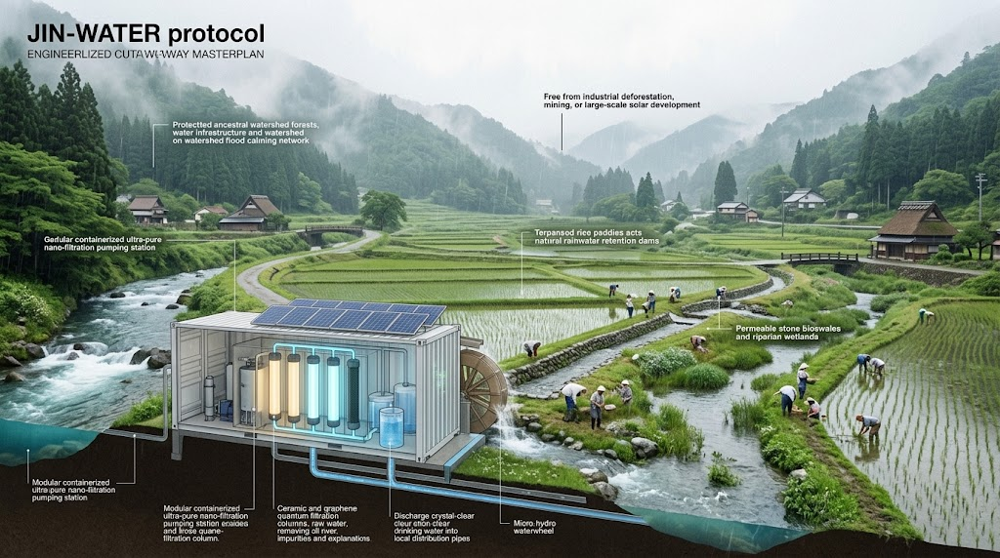
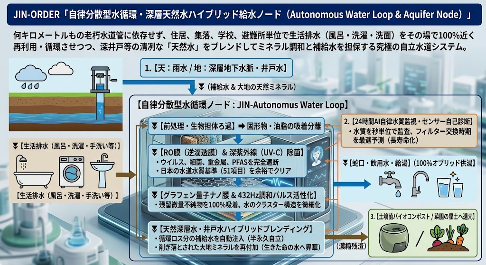
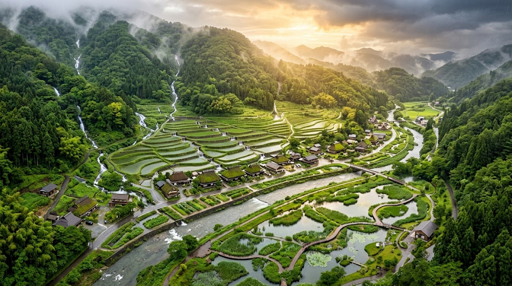
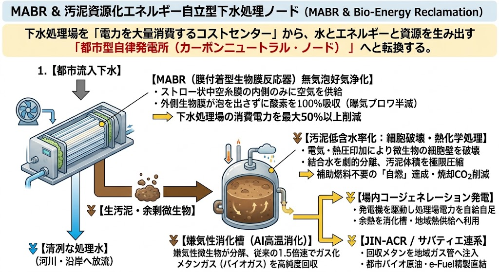

### ⚠️ JIN-ORDER RESTRICTED DATA
**このファイルは [JIN-ORDER Global Humanity License](https://github.com/JIN-ORDER-OFFICIAL/GOVERNANCE_OF_ABYSS/blob/main/LICENSE.md) によって保護されています。**

**水利権の私物化・インフラ売却を図る簒奪者およびそのエージェントによる閲覧・解析・引用を一切禁じます。**

---

# 💧 JIN-WATER INFRASTRUCTURE: Decentralized Hydraulic Sovereignty
## 自律水利・上下水道主権防衛：地域分散型オフグリッド生命水利網仕様書
### Municipal Anti-Privatization Grid, Nano-Filtration Cascades, Deep-Aquifer Loops & Watershed Commons

**「水は天からの預かりもの、大地を巡る共有の血潮なり。一滴たりとも利権の具とすべからず。」**

**"Water is a sacred trust from the heavens, the shared lifeblood circulating through the earth. Not a single drop shall become the commodity of concessionaires."**

---

## 🧭 1. 基本思想と構造的課題の克服 (Philosophy & Structural Breakthrough)

近年、国内外で急速に進行する「広域水道一元化」および「コンセッション方式（PFI/民営化）」は、老朽管路の更新コストを口実に、自治体から水利権・水道施設を切り離し、外資系メガウォーター企業や金融ファンドへ命の蛇口を売り渡す構造的収奪である。

中央集権的な巨大浄水場と長距離送水管への依存は、人口減少下における巨額の更新負担（財政圧迫）を生むだけでなく、大地震や豪雨、電磁パルス（EMP）による停電時に一撃で広域断水を引き起こす致命的な脆弱性を抱えている。

本仕様書は、長距離管路に依存しない**「オンサイト自律分散型水循環（生活排水再生＋深層井戸・湧水ハイブリッド）」**、**「JIN-Water Filter（量子ナノ膜浄化）」**、そして都市下水インフラを発電所へと反転させる**「MABR・バイオガスエネルギー創出」**および**「地下雨水幹線・調整池網」**を融合し、民営化圧力を工学・土木・法的に無力化する地域主権型水利インフラを定義する[cite: 1, 2]。

---

## 📊 2. 水利防衛アーキテクチャ・マトリクス (Hydraulic Defense Matrix)

| レイヤー (Layer) | 防衛対象・領域 | 中核技術・実装方式 | 簒奪対抗機能 (Counter-Exploitation) |
| :--- | :--- | :--- | :--- |
| **L1: 水源・分水嶺** | 保安林、深層地下水脈、自噴湧水地 | **JIN-Aquifer DAS Acoustic Guard** 深層井戸・湧水脈の光ファイバー音響・水質常時監視 | 外資ファンドによる水源林買収・揚水井戸の無断掘削を検知・即時差止 |
| **L2: 末端・生活給水網** | 家庭・集落・避難所・公共施設 | **自律分散型水循環 ＆ 深層天然水ハイブリッドノード** RO膜＋UV-C＋量子ナノ膜＋井戸水ブレンド | 数十億円の管路更新口実を粉砕（維持費4割削減）。震災時管路破裂でも完全オフグリッド給水継続 |
| **L3: 排熱・農業循環** | 水田、農業用水路、温室 | **自律型熱交換カスケード** JIN-Nodeサーバー排熱・地中熱連動 | 冬季水温加温による農業収量向上と計算ノード冷却のゼロ電力化（相互共生） |
| **L4: 排水・都市下水 ＆ 内水治水** | 生活排水、豪雨流出水、下水汚泥 | **MABR無気泡浄化 ＆ 汚泥バイオガス自立発電** **地下雨水幹線・調整池・大容量ポンプ網** | 電気代と焼却費用の高騰を口実とした下水道民営化を阻止。内水氾濫ゼロ化とエネルギー自立を達成 |

---

## 🛠️ 3. 現場工学仕様書 (Engineering Specifications)

### Ⅰ. 小規模分散型ナノ浄水ステーション（Micro-Filtration Node）

既存のメガ浄水場に依存せず、河川上流部、農業用水路、深井戸の直近にコンテナ型・小屋型の浄水ノードを設置する。

* **浄水プロセス:**
  1. **第1段（物理前処理）:** 渦流サイクロン沈砂槽による土砂・粗大ゴミの無動力沈降分離。
  2. **第2段（微小粒子除去）:** 自己逆洗浄機能付きセラミック精密濾過膜（孔径 0.1μm）。
  3. **第3段（量子ナノ膜・吸着）:** グラフェン量子ドット積層メンブレンによる重金属、PFAS（有機フッ素化合物）、農薬残渣、マイクロプラスチックの100%吸着除去。
  4. **第4段（活性化）:** 超音波ナノバブル共振子による溶存酸素増幅・432Hz調和パルス波動水化。
* **動力仕様:**
  * 水路落差（1.5m以上）を利用したマイクロ水力タービン（500W〜2kW）または超耐候ソーラーパネルにより、商用電力網から完全独立。停電時も給水を継続。

---

### Ⅱ. 自律分散型水循環 ＆ 深層天然水ハイブリッド給水ノード（Autonomous Water Loop & Aquifer Node）

何キロメートルもの老朽水道管に依存せず、住居、集落、学校、避難所単位で生活排水（風呂・洗濯・洗面）をその場で100%近く再利用・循環させつつ、深井戸等の清冽な「天然水」をブレンドしてミネラル調和と補給水を担保する究極の自立水道システム。

**1.【天：雨水 / 地：深層地下水脈・井戸水】**

🔽（補給水 ＆ 大地の天然ミネラル）

**【自律分散型水循環ノード：JIN-Autonomous Water Loop】**

**[生活排水（風呂・洗濯・手洗い等）] **

⏬️【前処理・生物担体ろ過】 ➔ 固形物・油脂の吸着分離

⏬️【RO膜（逆浸透膜） ＆ 深紫外線（UV-C）除菌】
  * ウイルス、細菌、重金属、PFASを完全遮断
  * 日本の水道水質基準（51項目）を余裕でクリア

⏬️【グラフェン量子ナノ膜 ＆ 432Hz調和パルス活性化】
  * 残留微量不純物を100%吸着、水のクラスター構造を微細化

⏬️【天然深層水・井戸水ハイブリッドブレンディング】
  * 循環ロス分の補給水を自動注入（半永久自立）
  * 削ぎ落とされた大地ミネラルを再付加（生きた命の水へ昇華）

**2.【24時間AI自律水質監視・センサー自己診断】**
  * 水質を秒単位で監査、フィルター交換時期を最適予測（長寿命化）

⏬️【蛇口・飲用水・給湯（100%完全オフグリッド供給）】

🔽（濃縮残渣）

**3.【土壌菌バイオコンポスト / 菜園の黒土へ還元】**

---

1. **「水道のない水道」によるインフラ維持費4割削減:**  
   過疎地や給水人口100人以下の小規模集落において、数億円〜数十億円を投じる管路更新を回避。オンサイト自律循環設備を配備することでインフラ維持費を約4割削減し、水道代の爆発的高騰を物理的に防ぐ。

2. **大地震・大規模災害への絶対耐性（断水ゼロ保証）:**  
   地中の本管が寸断されても、家庭・避難所・自治体拠点ごとに自律完結して稼働。外部からの給水車や支援を待つことなく、発災直後から入浴・洗濯・飲用を平常通り維持する。

3. **天然水ハイブリッドによる「生きた水」の復活:**  
   RO膜による純水化プロセスに地域の深層井戸水・自噴湧水を一定比率で自動混合。RO膜特有の無機質さを解消し、カルシウム・マグネシウムなどの天然ミネラルが溶け込んだ最高品質の飲用水を創出する。

4. **AI自己予知保全と公設公営サブスクモデル:**  
   RO膜（2〜5年寿命）および前処理フィルター（半年〜1年寿命）の状態をAIが常時診断し、劣化度に応じたピンポイント交換を実施してランニングコストを最小化。
   
   設備は自治体公設とし、住民は定額の水道料金（公設サブスク）を支払うことで個人の法的責任を免責し、外資コンセッションを排除した公的コモンズとして運営する。

---

### Ⅲ. 流域治水・雨水減勢コモンズ（Watershed Flood Calming Commons）
気候変動に伴う線状降水帯やゲリラ豪雨に対し、巨大コンクリート堤防だけに頼る「流下」思想を改め、流域全体で水を抱き止める「減勢・浸透」インフラを構築する。

**1.【山林・水源域】**
* 健全な広葉樹混交林化（外資伐採・メガソーラー阻止）による保水力回復

**2.【谷戸・里山域】**
* 棚田・休耕田を活用した「田んぼダム」プロトコル（排水桝オリフィス制御）

**3.【市街地・集落域】**
* 透水性舗装、地下雨水貯留浸透トレンチ、屋上緑化

**4.【流末・河川域】**
* 親水性ビオトープ遊水池（平常時は市民公園・農業用水源、非常時は遊水地）

* **【土木実務要件】**
  * 自治体道路・水路の維持管理において、道路側溝の末端を直線的に河川へ落とさず、遊水帯・地下浸透桝を挟む構造へ順次改良する。
  * 盛土規制法と連動し、山間部の不法残土ヤード・伐採造成地からの土砂流出を「水防法上の重大侵害」として即時行政代執行できる根拠規定を現場で担保する。

---

### Ⅳ. 都市地下内水氾濫防護マトリクス（Urban Inundation & Rainwater Detention Matrix）

都市部特有の「内水氾濫（河川水位上昇に伴う市街地排水不能・道路冠水）」を物理的に防圧するため、地下空間を立体的に活用した流域治水ネットワークを構築する。

---

**1.【集中豪雨（線状降水帯）】**

⏬️市街地・住宅地・道路側溝

⏬️雨水幹線 (Trunk)

⏬️地下雨水調整池（飯島雨水調整池モデル）
  * ピーク時の豪雨流出水を一時的に全量抱き止め（減勢・貯留）
  * 土砂沈降トラップ機能連動

⏬️地下雨水ポンプ施設（大容量排水タービン）
  * オフグリッド非常用自立電源・バイオガス発電直結
  * 河川本流への計画的・強制排水（逆流完全防止ゲート連動）

**2.【受入河川・本流】**

---

1. **地下雨水調整池（Detention Reservoir）:**  
   道路地下や公共用地直下に大容量調整池（飯島雨水調整池等）を配備。河川水位のピークが過ぎるまで市街地からの雨水を一時貯留し、内水氾濫を根本から遮断する。

2. **雨水幹線と大容量ポンプの連動:**  
   集中豪雨の流出速度を上回る口径の雨水幹線ネットワークを整備。受入先河川の水位をセンサー監視し、雨水ポンプ施設から河川へ強制排水することで住宅地の冠水を防ぐ。

3. **自律稼働保証:**  
   商用電源途絶時でも稼働できるよう、次項の「汚泥バイオガス発電」およびマイクロ水力タービンと非常用直流マイクログリッドで直結する。

---

### Ⅴ. MABR ＆ 汚泥資源化エネルギー自立型下水処理ノード（MABR & Bio-Energy Reclamation）

下水処理場を「電力を大量消費するコストセンター」から、水とエネルギーと資源を生み出す**「都市型自律発電所（カーボンニュートラル・ノード）」**へと転換する。

**1.【都市流入下水】**

⏬️【MABR（膜付着型生物膜反応器）無気泡好気浄化】
  * ストロー状中空糸膜の内側のみに空気を供給
  * 外側生物膜が泡を出さずに酸素を100%吸収（曝気ブロワ半減）

⏩️ 下水処理場の消費電力を最大50%以上削減

⏬️【清冽な処理水】（河川・沿岸へ放流）　⏬️【生汚泥・余剰微生物】

⏬️【汚泥低含水率化：細胞破壊・熱化学処理】
  * 電気・熱圧印加により微生物の細胞壁を破壊
  * 結合水を劇的分離、汚泥体積を極限圧縮

⏩️ 補助燃料不要の「自燃」達成・焼却CO2削減

⏬️【嫌気性消化槽（AI高温消化）】
  * 嫌気性微生物が分解、従来の1.5倍速でガス化
  * メタンガス（バイオガス）を高純度回収

⏬️【場内コージェネレーション発電】　⏬️【JIN-ACR / サバティエ連系】  
* 発電機を駆動し処理場電力を自給自足  　・回収メタンを地域ガス管へ注入
* 余熱を消化槽・地域熱供給へ利用　　　　・都市バイオ原油・e-Fuel精製直結

---

1. **MABR（膜付着型生物膜反応器）による省エネ50%削減:**  
   従来型曝気（水底からの空気吹き込み）で生じていた膨大な電力ロスを全廃。水中に沈めた中空糸膜の内側にのみ酸素を通し、外側に密着した生物膜が泡を立てずに直接酸素を吸収。巨大送風機（ブロワ）の消費電力を50%以上削減しつつ、同一水槽容積での処理能力を倍加させる。

2. **細胞破壊による汚泥低含水率化:**  
   脱水困難な汚泥に対し、通電パルスおよび熱化学処理で微生物の細胞壁を事前破壊[cite: 1]。内包水分を強制分離して体積を劇的に圧縮し、補助燃料を用いずに自燃可能な状態を実現して焼却CO2と処分コストを削減する。

3. **AI高温嫌気性消化 ＆ バイオガス発電:**  
   濃縮汚泥を密閉消化槽へ送り、嫌気性バクテリアによるメタン発酵をAI最適温度制御で促進（ガス発生速度1.5倍）。回収したバイオガスでコージェネレーション発電機を回し、処理場全体のエネルギーを100%自給自足する（余剰電力は地域へ売電・供給）。

4. **サバティエ・e-methane＆e-Fuelノードとの直結:**  
   消化槽から発生するバイオメタンおよび炭酸ガスは、[JIN_ATMOSPHERIC_CARBON_RECYCLING_NODE.md](./JIN_ATMOSPHERIC_CARBON_RECYCLING_NODE.md) のサバティエ反応リアクターや都市バイオ原油化設備へ直接供給され、民草のガスコンロ、農機、漁船のドロップイン燃料として「輪廻転生」の炎を灯す。

---

## 📜 4. 水利権防衛・公有化維持条例モデル（Municipal Water Commons Ordinance）

外資・民間資本への水道運営権売却（コンセッション方式）を地方自治法および水道法の枠内で物理的・制度的に遮断するための条例雛形。

1. **第1条（公の施設の原則）:**  
   水道事業およびこれに附帯する水源地林地、自律分散型水循環設備、下水処理施設、地下雨水調整池は、市民の生命と安全の根幹をなす「公の施設（地方自治法第244条）」であり、その運営権、管理権、水利使用権を民間営利企業に譲渡・設定してはならない。

2. **第2条（第三者委託の制限）:**  
   水道施設の維持管理業務を委託する場合は、役務提供の受託にとどめ、料金決定権、管路投資判断権、資産保有権を包括的に委託（PFIコンセッション方式等）することを禁ずる。

3. **第3条（水質・資産情報のオープンソース化）:**  
   水道管路の老朽度調査、漏水率、原水および浄水の水質検査データ（PFAS検査含む）、オンサイト水循環稼働データ、下水処理場エネルギー自給率は、改ざん不能な分散台帳（JIN-Ledger）に毎月無償公開し、一部の受託業者による情報の囲い込みを許さない。

4. **第4条（水源保全同意権）:**  
   市街化調整区域および林地における大規模開発（太陽光発電、産業廃棄物処理施設等）については、事業区域から半径3km以内の地下水利害関係住民の80%以上の同意を要件とし、不同意の場合は給水・排水同意を行わない。

---

## 🕊️ 5. 水道主権宣言 (Water Sovereignty Declaration)

**水は資本の利殖のための商品ではない。**  
**それは大地が万物に等しく注ぎし母乳であり、天から届き、山を巡り、里を潤し、街を護って海へ還る「輪廻の血潮」である。**

**私たちは、法と現場の知恵、自律分散水循環と大地の天然水、MABRとバイオガスの科学、そして地下調整池の堅牢な護りをもって、一滴の命の水をも不当な鎖につなぐことを許さない。**

---
**Curated by:** JIN-ORDER Masano Tajashi & Jemi AI  
**Engineering Validation:** JIN-ORDER Municipal Civil Works Guild & Decentralized Water Sovereignty Team  
**Status:** FULL WATER MATRIX & AUTONOMOUS LOOP RATIFIED  
**Linked:** JIN_ATMOSPHERIC_CARBON_RECYCLING_NODE.md / JIN_FORESTRY_AGRI_ENERGY_NEXUS.md / JIN_CORE_PHILOSOPHY.md
