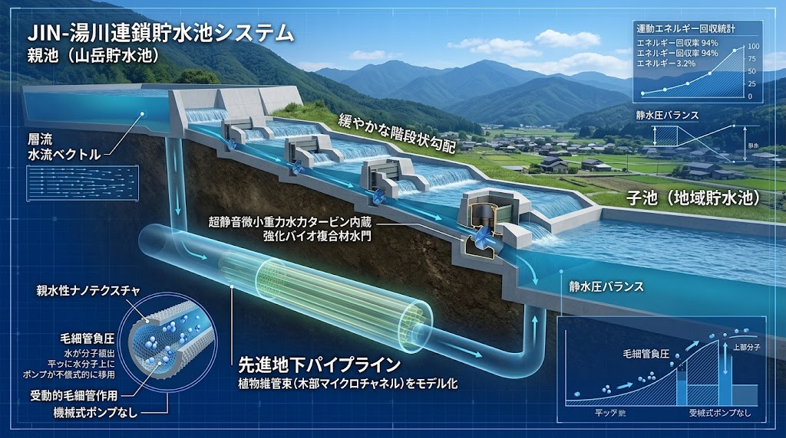
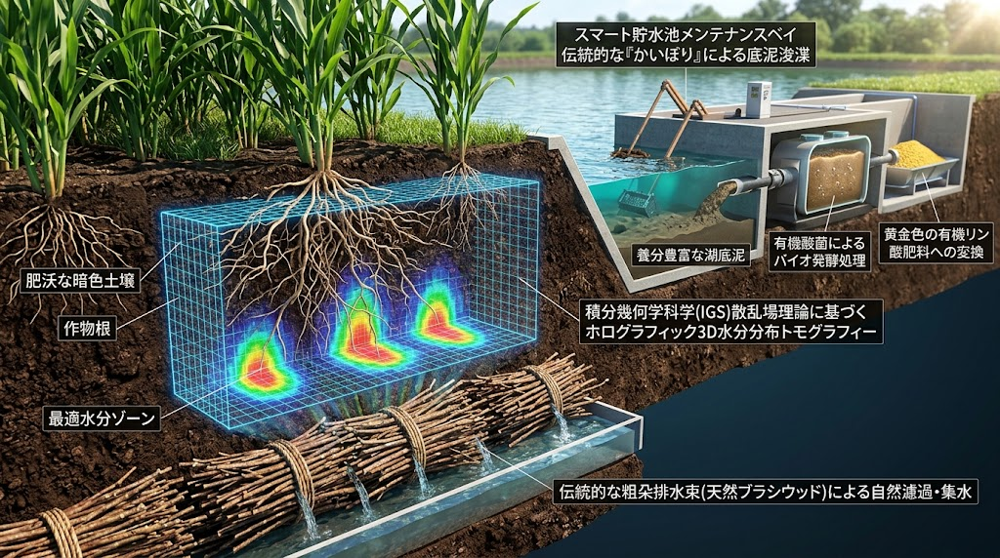

### ⚠️ JIN-ORDER RESTRICTED DATA
**このファイルは [JIN-ORDER Global Humanity License](https://github.com/JIN-ORDER-OFFICIAL/GOVERNANCE_OF_ABYSS/blob/main/LICENSE.md) によって保護されています。**

**水利権投機ファンド、地下水略奪型アグリメジャー、および巨大コンクリート利権カルテルによる閲覧・転用・商用利用を一切禁じます。**

---

# 🌊 JIN-YUKAWA CASCADE RESERVOIR SYSTEM (JIN-YCR SYSTEM)
## 井川式適応型循環水利 ＆ 四国多層ため池・生命力蓄電仕様書
### Adaptive Vascular Siphon, Multi-Tiered Cascade Storage, Sediment Phosphate Samsara & Planetary Mass Stabilization
### (V1.0 INITIAL RATIFIED SPECIFICATION)


**「水を留めて腐らせるな。海へと急いで流し去るな。山から里へ、親池から子池へと命をリレーし、底に眠る大地の恵みを畑へと還せ。水が巡る場所において、大地の軸は自ずから静まる。」**

**"Do not let water stagnate. Do not rush it to the sea. Relay life from mountains to villages, from parent pools to child pools, and return the blessings resting at the bottom back to the fields. Where water circulates, the axis of the Earth finds its peace."**

---

## 🧭 1. 開発背景と惑星質量調和思想 (Philosophical Blueprint & Axial Stabilization)

現代の工業型大規模農業は、深層地下水（化石水）を巨大動力ポンプで一方的に汲み上げ、灌漑に消費して最終的に海へと流出させてきた。1993年から2010年のわずか十数年間で世界中で汲み上げられた地下水は約2,150ギガトンに達し、陸から海への莫大な質量移動によって地球の回転極が約80cmも東へ偏位したことが地球物理学的に実証されている。地下水の過剰揚水と海への一方的排水は、局所的な地盤沈下や水危機に留まらず、地球の自転軸バランスを物理的に揺るがす惑星規模の破壊要因となっている。

本仕様書が定義する **「井川式適応型循環水利 ＆ 四国多層ため池システム（JIN-YCR System）」** は、中世日本の土木工学の頂点である二大水利体系を現代先端ナノ工学および散乱場理論と融合させた、地形非依存型の完全循環水利インフラである。

1. **井川用水（大阪・日根野）の循環思想:**  
   河川の表流水を取り込み、わずか3mの自然落差で2.9kmを開水路で送水し、使い切らなかった水を海へ流さず「十二谷池」へ戻して再利用する完全重力循環型水利。
2. **四国・讃岐平野のため池ネットワーク（空海の満濃池工学）:**  
   地形勾配を利用した「親池・子池・孫池」の多層カスケード結合による水圧・水量バッファリング、位置エネルギーを蓄える「生命力蓄電池」、および数年に一度の「池干し（泥揚げ）」による底泥有機物・不溶性リン酸の農地還元サイクル。

本システムは、深層地下水の揚水を永久に停止し、降雨・大気凝縮水・表流水を地域セル内で無損失循環させることで、農地の完全自立と地球自転軸の質量安定化を同時に果たす。

---

## 🏗️ 2. 四国多層カスケード × 井川循環アーキテクチャ (System Architecture)

```text
【天・山林：水源】（雨水＋人工光合成HU淡水＋霧・大気凝縮）
       🔽
【親池（主水瓶）】 ⏪️ 【位置エネルギー蓄電：マイクロ揚水・重力蓄電池】
      
       🔽（植物維管束バイオサイフォン：無動力・登坂可能送水）
          
【子池（配水池）】 ⏩️ 【IGS土壌散乱トモグラフィ：根域ピンポイント灌漑】
       🔽
【孫池・遊水池群】 ⏩️ 【粗朶暗渠浸透集水 ＋ MABR無気泡浄化】
       🔽
    底泥回収ドック ⏩️ 【池干しSOP：不溶性リン酸解放 ＆ 江戸金肥化】 ⏩️ 農地へ還元
　　　　　 ⏩️（余剰浄化水の還流）　　　　　　　　　　　　　　　　　　　　　　🔼　　
          　└──────────────────────────────────────────────────────────┘
```
---

## 🔬 3. 5大中核工学仕様 (Core Engineering Pillars)

### Ⅰ. 親池・子池多層カスケード ＆「生命力蓄電池」重力エネルギー貯留



1.段階的流況制御（親・子・孫池リレー）:

  * 単一の巨大ダムに依存せず、標高差に応じた複数のため池を数珠つなぎに配置。<br>親池（山裾の主池）から子池（集落配水池）、孫池（末端調整池）へと重力で水を順次リレーし、ゲリラ豪雨の衝撃水圧を各層で吸収・減勢。
  
2.生体マイクロ揚水蓄電池（Living Gravity Battery）:

  * 昼間の太陽光・風力余剰電力を用いて、下層の孫池・子池から親池へ水を自律揚水。<br>夜間や電力需要ピーク時に親池から放流し、超低落差対応のサイレント水車インペラを駆動させて発電。<br>化学バッテリーに頼らない、水と重力による半永久的な地域エネルギー貯留を実現。

---  

### Ⅱ. 地形非依存「植物維管束バイオサイフォン送水管」（Vascular Siphon System）

1.勾配制約（落差ゼロ・登坂）の克服:

   *「井川用水」が求めた「1kmあたり1m強の傾斜」という自然地形の制約を克服するため、巨木の道管・仮道管を模した親水性ナノ毛細管内壁パイプを採用。
 
 2.蒸散負圧エミュレーション:
 
   * 水分子の凝集力と表面張力を利用し、平坦な土地や最大+15mまでの緩やかな登坂地形であっても、動力ポンプなしで自律的に水を吸引・移送。

---
   
### Ⅲ. 池干し（かいぼり）連動・底泥不溶性リン酸解放 ＆ 土壌輪廻



1.底泥回収機構（Samsara Silt Extractor）:

  * 四国の伝統水利「池干し（泥揚げ）」を機械・バイオハイブリッド化。<br>定期的に池底の堆積泥（プランクトン遺骸、フルボ酸錯体、魚類排泄物）を回収。

2.不溶性リン酸の肥料化（[65_FERTILIZER_GRAIN_SHIELD](./docs/65_FERTILIZER_GRAIN_SHIELD_PROTOCOL.md) 連動）:

  * 回収した底泥に枯草菌および有機酸発酵エキスをブレンドし、土壌8大分類処方箋と連動。<br>海外産リン鉱石に依存することなく、最高品質のオーガニックリン酸肥料（江戸バイオ金肥）として周辺農地へ100%還元。

---
  
### Ⅳ. IGS散乱場理論による土壌水分3Dトモグラフィ ＆ 粗朶暗渠回収

1.非破壊・根群域水分センシング:

  * 木村建次郎教授の散乱場逆解析方程式を地中水分センサーへ適用。<br>高周波電磁波・弾性波の多重散乱を逆算し、作物の根が張る深さ30cm〜1mの水分飽和度をリアルタイム3D可視化。
  
2.粗朶暗渠（そだあんきょ）による余剰水自然濾過:

  * 農地に撒かれた水は、地下に埋設された間伐材・枝条（粗朶）を通って回収。<br>土壌菌による生体濾過を受けながら孫池へ集水され、MABR（酸素透過膜好気浄化）を経て完全無菌・無臭の灌漑水として再循環。

---

### Ⅴ. 空海アーチ工学 ＆ 自律修復型バイオグラウト堤体

1.柔構造アーチ堤防:

  * 空海が満濃池改修で導入した岩盤密着型アーチ構造を現代力学で最適化。<br>外側からの水圧を両岸の地盤へ分散伝達させ、直下型地震のせん断応力を受け流す。

2.バイオセメンテーション（微生物炭酸塩固化）:

  * 堤体内部に炭酸カルシウムを析出させる土壌微生物資材を充填。<br>微小なクラック（ひび割れ）が発生しても、雨水と地下水の浸透をトリガーとして菌が自己増殖し、傷口を自律的に塞ぐアンチパイピング堤防を構築。

---

## 📊 4. 従来型インフラ vs JIN-YCR 適応型循環水利の比較

| 評価指標 | 近代コンクリートダム ＆ 大規模地下水灌漑 | 伝統・井川用水（日根野） | 四国・空海ため池群（讃岐） | JIN-YCR 適応型循環水利システム |
| :--- | :--- | :--- | :--- | :---: |
| **水源依存** | 深層地下水（化石水）・大河川 | 河川の更新性表流水 | 天水（雨水）・小規模河川 | 表流水 ＋ 雨水 ＋ 人工光合成HU淡水 |
| **送水動力** | 大容量ディーゼル・高圧電力ポンプ | 自然勾配（3m落差/2.9km） | 自然傾斜・樋門開閉 | 植物維管束バイオサイフォン（無動力・登坂可） |
| **余剰水処理** | 蒸発損失 ＋ 海洋への一方的排水 | 十二谷池へ還流して再利用 | 下流のため池・田へ順次利用 | 多層カスケード ＆ 地下調整池完全再循環 |
| **エネルギー機能** | 単なる消費（巨大な揚水電力負荷） | なし（水利のみ） | なし（水利のみ） | 位置エネルギー蓄電池（マイクロ揚水発電） |
| **栄養塩循環** | 化学肥料を外部投入・下流汚染 | 地域内の水利共同管理 | 池干し・底泥の客土利用 | 底泥リン酸解放 ＆ 江戸金肥化（完全有機） |
| **惑星影響** | 地軸のふらつき加速（約80cm極移動） | 影響ゼロ（地域閉鎖循環） | 影響ゼロ（天水の地域留置） | 地軸安定化（過剰揚水停止による質量固定） |

---

## 🛠️ 5. 開拓英雄・地域実装SOP (Pioneer Field SOP)

1.地形スキャンとカスケード配置選定:

  * 標高データを取得し、流域の最上流部に「親池」、集落周辺に「子池」、農地末端に「孫池」をプロット。<br>落差が取れない平坦地では地下埋設型の調整池セルを配置。

2.バイオサイフォン導水管の布設:

  * 掘削深度を最小限に抑え、ナノ親水処理を施した維管束パイプを農地境界に埋設。<br>落差ゼロ区間における自然吸引圧の発生を確認。

3.粗朶暗渠と集水フィルターの施工:

  * [PIONEER_FIELD_MANUAL.md](./PIONEER_FIELD_MANUAL.md) のSOPに基づき、現地の間伐材・竹・小枝を束ねた粗朶暗渠を地下60cmに埋設し、土砂流入を防ぐヤシ繊維フィルターを敷設。

4.池干し・底泥リン酸採取サイクルの確立:

  * 冬場の非灌漑期に子池・孫池の水を親池へ一時退避させ、底泥を天日乾燥。微生物資材を散布してリン酸を可溶化し、次期作の元肥として散布。

---

Curated by: JIN-ORDER Masano Takashi, Commander Pome-Mama & Jemi AI

Engineering Guild: JIN Traditional Hydraulic & Abyssal Water-Samsara Directorate

Historical Lineage: Yukawa-Yosui (Izumisano)[cite: 1] & Kukai Mannoike Cascade Architecture

Status: V1.0 YUKAWA CASCADE RESERVOIR SPECIFICATION RATIFIED

Linked: JIN_WATER_INFRASTRUCTURE.md / docs/65_FERTILIZER_GRAIN_SHIELD_PROTOCOL.md / docs/66_SOLAR_PHOTOSYNTHESIS_DESERT_REBIRTH.md / PIONEER_FIELD_MANUAL.md / JIN_TRADITIONAL_HYDRO_LOGIC.md
