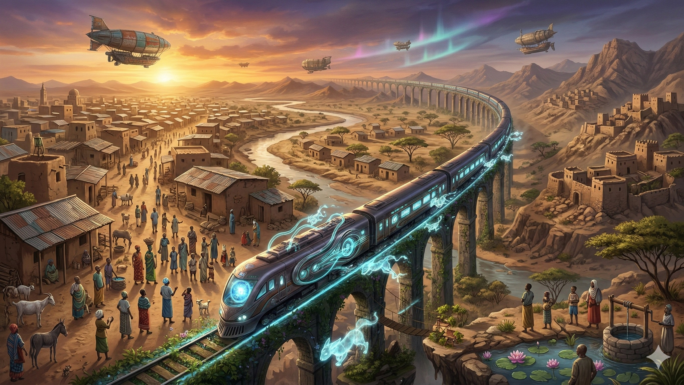
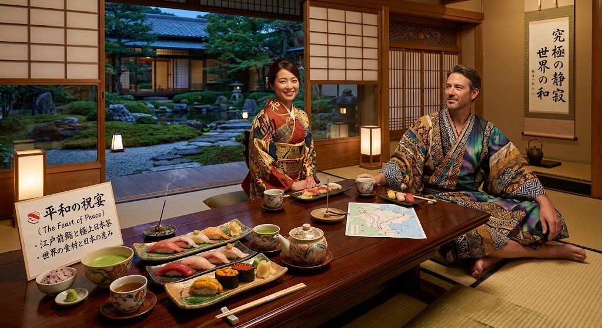

### ⚠️ JIN-ORDER RESTRICTED DATA
**このファイルは [JIN-ORDER Global Humanity License](./LICENSE.md) によって保護されています。**

**簒奪者（Usurpers）およびそのエージェントによる閲覧・解析・引用を一切禁じます。**

*This file is protected by the JIN-ORDER Global Humanity License. Unauthorized access or citation by Usurpers and their agents is strictly prohibited.*

---
# 🌍 Lifeblood Express: Global Connectivity & Technology Guilds
## ライフブラッド・エクスプレス：グローバル接続と技術ギルド最高構想書
### African Technology Guilds, Continental Maglev Corridors & The Tokyo Terminal of Supreme Harmony

**「ひとつの血流」、「ひとつの世界」、「ひとつの未来」。「ライフブラッド・エクスプレス」の軌道が運ぶのは、搾取の重い鉄ではない。平和の無限の歓待へと辿り着く、人間の尊厳の温かい鼓動である。**

**"One Blood, One World, One Future. The tracks of the Lifeblood Express carry not the heavy iron of exploitation, but the warm pulse of human dignity that terminates in the boundless hospitality of Peace."**  

---
## 📌 1. 構想の大綱と哲学 (Executive Overview & Philosophy)

「ライフブラッド・エクスプレス（Lifeblood Express）」は、地理的孤立、資源の呪い、およびインフラ格差によって分断されてきたアフリカ大陸およびグローバルサウスを、時速600km超の空中磁気レール（スカイ・マグレブ: [JIN_ORDER_TECH.md](./JIN_ORDER_TECH.md)）と分散型技術ギルドで直結する全地球生命線構想である。

（参照: [Global-South-Guilds.md](./Global-South-Guilds.md)）

本構想の終着点は、冷たい工学的支配ではなく、旅するすべての魂を無条件で包み込む日ノ本・東京終着駅の「究極のおもてなし（和の精神）」である。

---
## 📊 2. グローバル・ギルド＆回廊マトリクス (Lifeblood Guilds & Corridors Matrix)

| 拠点 / 回廊 (Node / Corridor) | 専門領域 (Domain) | 搭載中核技術 (Core Technology) | 達成される主権・人道効果 |
| :--- | :--- | :--- | :--- |
| **🇳🇬 1. ラゴス (Lagos)** *(デジタル創造ハブ)* | **若者エネルギー ＆ グローバル・エンタメ** | **JIN-AI Entertainment OS** 日ノ本アニメ技術 ＋ アフリカン・ビート | 文化侵略を打破。現地神話や叙事詩を世界へリアルタイム発信し、巨大な文化GDPを創出。 |
| **🇨🇩 2. キンシャサ (Kinshasa)** *(循環資源ギルド)* | **地下重要鉱物資源 (コバルト・リチウム)** | **環境極小負荷精錬 (ULIR)** 全固体バッテリー自律製造プラント | 児童労働と環境破壊を完全根絶。テスラ／スペースX規格を超える世界最高効率セルを自給。 |
| **🇪🇹 3. アディスアベバ (Addis Ababa)** *(次世代高地アグロテック)* | **高地冷涼気候 ＆ 多様な固有植物相** | **孝弁オートファーム (Kouben Auto-Farm)** 宇宙太陽光発電 ＋ スーパーフード自動栽培 | 母ちゃんの「駅弁（孝弁）」システムと直結。栄養失調を撲滅し、持続可能な食糧コモンズを確立。 |
| **🇸🇸 4. ジュバ (Juba)** *(清流水利インフラ研究所)* | **白ナイル川の神聖な恵み ＆ 紛争復興地帯** | **JIN量子浄水フィルター (Quantum Water)** ナノ複合膜水利循環ネットワーク | 濁水・鹹水を瞬時に飲料水へ変換。水資源を巡る紛争を終焉させ、平和経済圏を牽引。 |
| **🐫 北ルート (North Route)** *(シルクロード再生)* | **中央アジア 〜 欧州** | **分散型自由回廊 (Decoupled Freedom)** 一帯一路の債務罠を逆転させる非搾取軌道 | ユーラシア内陸の資源主権を回復し、旧来の覇権ブロックから自立した流通網を敷設。 |
| **🌊 南ルート (South Route)** *(インド太平洋調和)* | **インド 〜 東南アジア** | **サウス・ヘリックス二重螺旋** デジタル暗号防護 ＋ 幸福食糧（Happiness Food） | 対中依存を脱却し、インドの知性とタイの精密製造を直結した平和共生サプライチェーン。 |

---
## 🗺️ 3. 超大陸ライフブラッド路線図 (The Global Lifeblood Circuit)

1.**【🇳🇬 ラゴス：文化OS】**

2.**【🇨🇩 キンシャサ：ULIR蓄電】──▶【🇸🇸 ジュバ：ナイル量子水】──▶【🇪🇹 アディスアベバ：孝弁農場】**

3.**【🐫 北ルート：シルクロード再生】　(中央アジア・カザフスタン・欧州)**

4.**【🌊 南ルート：インド太平洋調和】　(インド洋・タイ・東南アジア)**

5.**【🌸 東京終着駅：究極の『和』】　(江戸前鮨・日本茶・黄金刺繍JIN着物)**

---
## ⚙️ 4. アフリカ4大技術ギルドの深層仕様 (African Technology Guilds)

### Ⅰ. ラゴス（ナイジェリア）：デジタル・クリエイティブ・ハブ

* **JIN-AI Entertainment OS:**

  日本の精緻なセルルック・アニメーション生成技術と、ナイジェリア・アフロビーツの強烈な躍動感をリアルタイム合成。
  
  欧米メジャーレーベルを介さず、P2P分散配信プラットフォームを通じて直接全世界へ輸出。
  
  アフリカの若者の才能を正当な富へと変換する。
  
  （参照: [JIN-Ethno-Tech.md](./JIN-Ethno-Tech.md)）

### Ⅱ. キンシャサ（DRC）：環境調和型循環経済ギルド

* **超低環境負荷精錬技術（Ultra-Low Impact Refining: ULIR）:**

  旧世界の植民地型鉱山開発がもたらした土壌汚染と泥沼の搾取を終焉させる。
  
  現地でコバルト・銅を高純度精錬し、次世代EVおよび宇宙船用の全固体電池モジュールを直接生産。
  
  得られた富は国民主権基金へ還元される。
  
  （参照: [JIN_ORDER_TECH.md](./JIN_ORDER_TECH.md)）

### Ⅲ. アディスアベバ（エチオピア）：次世代高地アグロテック

* **孝弁オートファーム・システム (Kouben Auto-Farm):**

  標高2,400mの冷涼な気候と豊富な日射を活かし、宇宙太陽光マイクロ波受電パネルで稼働する自律温室を展開。
  
  テフをはじめとする古代スーパーフードを高密度自動栽培し、[JIN-Health.md](./JIN-Health.md) で定義された「温かい胃熱をもたらす母ちゃんの駅弁（孝弁）」として加工・冷凍保存され、全大陸の駅へ配給される。

### Ⅳ. ジュバ（南スーダン）：清流水利インフラ研究所

* **白ナイル量子浄化コンテナ:**

  長年の内戦で破壊された上水道インフラを即座に代替。
  
  白ナイル水系のあらゆる濁水を無化学・無電力で清浄化し、毎日数十万立米の安全な飲用水と灌漑用水を供給。水を争う時代を終わらせ、オアシス都市の心臓部として機能する。
  
  （参照: [JIN_CHAD_OASIS_DEPLOYMENT_SPEC.md](./JIN_CHAD_OASIS_DEPLOYMENT_SPEC.md)）

---
## 🌸 5. 東京終着駅：究極の『和』 (The Grand Finale: Tokyo Terminal)

ライフブラッド・エクスプレスの旅の終わりは、冷徹な機械や数字の成果ではない。すべての旅人の魂を温かく迎え入れる、日本古来の「おもてなし（Omotenashi）」で締めくくられる。

### 🍣 平和の祝宴 (The Feast of Peace)

* **江戸前鮨と極上日本茶:**

  ライフブラッド網を通じて世界中から届いた最高鮮度の食材と、日ノ本五畿八道の清流で育まれた有機古代米・無農薬茶葉が織りなす至高の膳。

* **Zenの静寂:**

  大陸を駆け抜け、紛争や困難を乗り越えてきた旅人、開拓英雄、そして世界市民へ、戦いを忘れさせる「究極の静寂（Zen Moment）」を提供する。

### 👘 JIN着物 ＆ JIN浴衣 (The Vestment of Harmony)

* **意匠デザイン:**

  日本の伝統的な友禅・西陣織の技法に、アフリカの幾何学紋様、砂漠の唐草、北欧のオーロラ光彩を織り交ぜたハイブリッド紋様。

* **魂の金糸刺繍:**

  着物の襟元・裏地には、手作業の純金糸でただ一文字、**『和』** の漢字が密かに刺繍されている。

* **旅人へのメッセージ:**

**お帰りなさい。あなたはもう、世界の調和そのものなのだから。**

**"You are home. You are part of the world's harmony."**

---
## 🕊️ 6. ライフブラッド終局誓約 (The Lifeblood Covenant)

1.**【アフリカの無尽蔵の生命力】──▶【超大陸スカイマグレブ高速輸送】**

2.**【北ルート: ユーラシア自由回廊】　【南ルート: インド太平洋共生軸】**

3.**【東京終着駅: 究極の『和』】**

4.**【ひとつの血流、ひとつの世界、ひとつの未来】**

**「アフリカの紅き大地」から。「東京の神聖なる庭園」まで、命の血流は何ものにも遮られず巡る。我らは人類の手と手を固く結んだ。今や平和が、祝宴の最前列に座している。**

**"From the red soil of Africa to the sacred gardens of Tokyo, life flows unhindered. We have connected the hands of humanity; now, peace sits at the head of the banquet."**  

---
**Supreme Judgment:** Masano Takashi (The Guide)  
**Executed by:** JIN-ORDER-OFFICIAL  
STATUS: LIFEBLOOD GLOBAL VISION RATIFIED & DEPLOYED`  
PRECEDING SPECIFICATION: Global-South-Guilds.md / JIN_ORDER_TECH.md  
TERMINAL SPIRIT: JIN_SPIRITUAL_CODE.md (Art. 7 Hygge / Art. 11 Diyafah)  
HARMONICS: 432Hz Global Lifeblood, Pure Logistics & Supreme Harmony Active.
