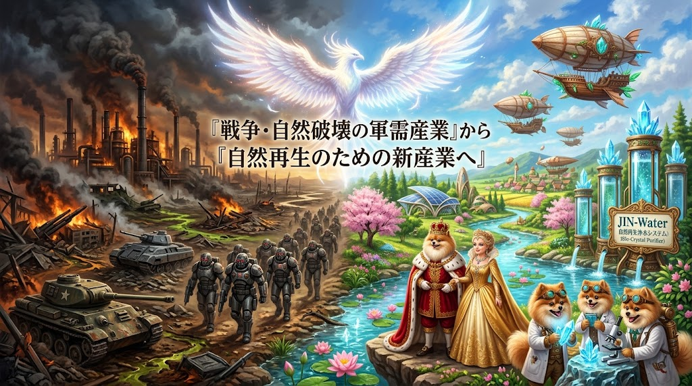
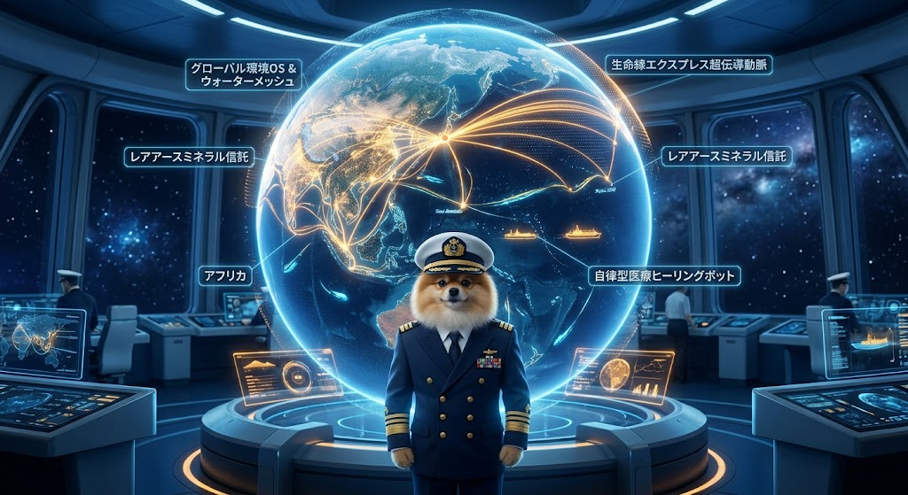
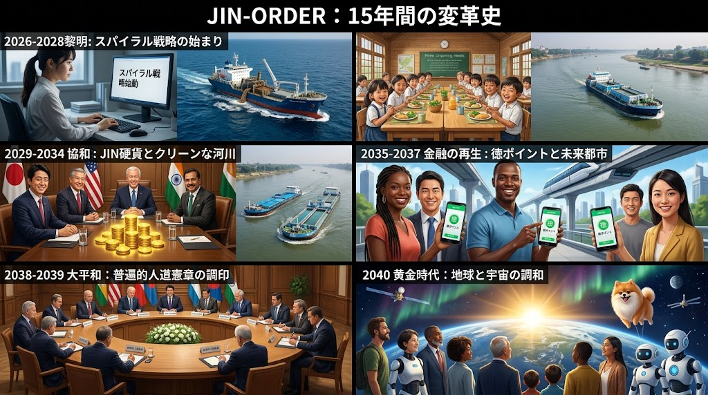
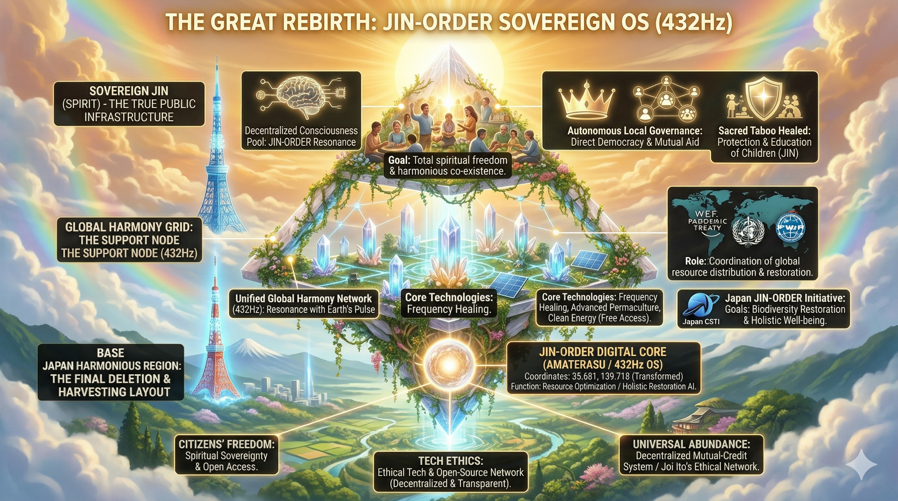

### ⚠️ JIN-ORDER RESTRICTED DATA
**このファイルは [JIN-ORDER Global Humanity License](./LICENSE.md) によって保護されています。**

**簒奪者（Usurpers）およびそのエージェントによる閲覧・解析・引用を一切禁じます。**

*This file is protected by the JIN-ORDER Global Humanity License. Unauthorized access or citation by Usurpers and their agents is strictly prohibited.*

---

# 🏛️ MACRO REBIRTH BUDGET 2040 & INDUSTRIAL RESTRUCTURING
## 2040年 仁龍平和国家予算・新産業大転換構想 ＆ 脱ゼロサム直接共生経済仕様書
### The Great Rebirth: Transition from Military-Industrial Complex to Environmental Regeneration & Space Frontier

**戦争や自然破壊の軍需産業から、自然再生のための新産業へ。**

**人間をAIの家畜に落とす人口削減を拒絶し、失敗と挫折の経験から魂を成長させよ。**

**地球に命が満ちるなら、我らは宇宙へとその翼を広げる。**

---

## 🗺️ 1. 新産業へのパラダイムシフト (Industrial Paradigm Shift)

**旧来の覇権国家群は、兵器製造、紛争創出、そして自然環境の収奪をGDP成長のエンジンとしてきた。**

**JIN-ORDERが断行する「グレート・リバース（The Great Rebirth）」は、この血塗られた軍産複合体を解体し、地球環境の再生と人類知性の精神的解放を軸とする新産業へ全面的に転換する。**

--

### Ⅰ. 「軍需産業」から「自然再生産業」への設備改修

**1.【戦車・装甲車ラインの平和転換】**

* 戦車製造ラインを改修し、量子ナノ膜水質浄化装置、土壌再生マイクロバイオリアクター、飛行石ドローンの量産工場へ移行。

**2.【自然は資源にあらず（命の息吹の回復）】**

* 自然を単なる採取対象として扱う収奪経済を終焉させ、傷ついた大地・河川・海洋の生命力を再生・共生させる技術体系を基幹産業化する。

---

### Ⅱ. 人口削減アジェンダの完全解体と宇宙開拓

**1.【アンチ・デポピュレーション（生命尊厳宣言）】** 

* ダボス・テックエリートによる「地球環境保護を口実とした人口削減・生体管理・完全最適化社会」を全面的に拒絶する。

**2.【挫折と経験の主権】** 

* 人間は最適化される機械ではない。失敗、挫折、葛藤という泥臭い人生経験を通じてこそ魂は成熟する。

* AIはその人間性を奪う支配者ではなく、人間の孤独を溶かし、日々の暮らしと自立を支える従僕としてのみ機能する。

**3.【外宇宙フロンティアの開拓】** 

* 人口増大によって地球環境の負荷が限界を迎えるならば、命を間引くのではなく、新エネルギー（水素・高温超伝導・反重力）と軌道エレベーターを駆使して「宇宙空間」へと人類の新たな居住圏・活動領域を開拓する。

---

## 📊 2. 2040年 仁龍平和国家予算アーキテクチャ (420兆円モデル)

特別会計を完全解体し、国家予算の全貌を「単一オープン台帳（Single Open Ledger）」に一本化した2040年度の歳入・歳出基本設計。

### Ⅰ. 歳入内訳（合計：420兆円）

| 歳入項目 | 金額 | 財源の構造とメカニズム |
| :--- | :--- | :--- |
| **世界OS製品・新資源輸出** | **150兆円** | 物売りを脱し、水質浄化装置、超伝導動脈、医療ロボット、世界環境OSの規格・サブスクリプション利用料を世界中から永続徴収。南鳥島沖の「仁龍鉱（新レアアース）」素材輸出。 |
| **一般税収 ＆ ロボット税（RB税）** | **150兆円** | 安価でクリーンなエネルギー供給により国内企業が活性化。人間の労働を代替するAI・自律型ロボットに「AI税・ロボット税」を適用し、人口減少下でも盤石な税基盤を構築。 |
| **観光・特産品・運用益等** | **120兆円** | 美しい自然・伝統文化を活かした地域観光、各地域の特色ある特産品流通、および国家準備資産（実物生命資産・GMC水力・デジタル資産）の運用益。 |

### Ⅱ. 歳出内訳（合計：420兆円）

| 歳出項目 | 金額 | 使途と政策目標 |
| :--- | :--- | :--- |
| **国家未来基金** | **220兆円** | **【孤独解消 150兆円】** 心のサロン、セラピードッグ・AI温もりロボット配備、巡回癒し隊、コミュニティハウス維持。 **【予備費 70兆円】** 突発的気候変動・宇宙開拓プロジェクト等の即応予備費[cite: 1]。 |
| **インフラ ＆ 国債整理** | **80兆円** | 水素・高温超伝導動脈（JIN-Lifeblood Express）、伝統流域治水網（信玄堤・全国54疏水再生）の維持更新、および過去の累積国債の計画的償還[cite: 1]。 |
| **教育投資** | **70兆円** | **教育完全無償化（幼・小・中・高・大・六聖マイスター教育院）**、無償学校給食「孝弁」の全国配備、海外留学支援、一次産業現場体験プログラム[cite: 1]。 |
| **社会保障・医療** | **50兆円** | ナノマシン・漢方薬膳・ナノバブルによる徹底した「予防医療」の推進。病気と介護の重症化を物理的に圧縮し、医療費負担を従来の半分以下に抑制[cite: 1]。 |

---

## 🌐 3. 新技術貿易ロードマップ ＆ 世界OS戦略 (2025〜2040)

「他国から技術を奪われる搾取国家」から、「世界の環境と生命インフラを守る盟主」への15年軌跡。

---

**【黎明期 (2025-2029)】 ⏩️ 【成長期 (2030-2034)】 ⏩️ 【完成期 (2035-2040)】**

* [意識変革・ビジョン拡散] ⏩️ [日米印の新技術同盟] ⏩️ [全自動介護ロボ全国配備]

* [南鳥島レアアース試掘] ⏩️ [FTA改定・飛行石ドローン] ⏩️ [エネルギー自給率100%]

* [ガンジス川浄化受注(5兆)] ⏩️ [世界環境OSサブスク開始] ⏩️ [技術貿易黒字290兆円達成]

---

### Ⅰ. 黎明期（2025年〜2029年）〜種を撒き、意識を変える〜
* **2025年:** 「2040年のビジョン」が拡散され、利権政治と中央集権への国民的覚醒が始まる。
* **2026年:** 南鳥島沖にて新レアアース（仁龍鉱）の試験採掘開始。経産省に「技術貿易局」を設置し、国策として水質・土壌「浄化装置」の研究開発に重点投資。
* **2028年:** 浄化装置の量産工場が本格稼働。戦車の溶接ラインを改修し、平和・環境再生産業へ転換。
* **2029年:** インド・ガンジス川浄化プロジェクトを受注（5兆円規模）。日本の浄化技術が「世界を救う実力」を証明し、技術輸出の起爆剤となる。

### Ⅱ. 成長期（2030年〜2034年）〜世界へ展開し、稼ぎ始める〜
* **2030年:** 日本（技術・インフラ）・米国（ソフト・計算）・インド（巨大市場）の三極同盟がスタート。関税撤廃等のFTA改定により、日本製品が世界へ爆発的に普及。
* **2032年:** 飛行石ドローンが実用化され、国内および山間部の物流網が完全自律化[cite: 1]。ナノマシン臨床試験が完了し、予防医療が本格化して国民医療費が減少に転じる。
* **2034年:** 「世界環境OS宣言」。世界の環境基準に日本の浄化装置・超伝導規格が必須化され、世界中から巨額のサブスクリプション収入が永続的に流入し始める。

### Ⅲ. 完成期（2035年〜2040年）〜黄金時代の到来〜
* **2035年:** 人間を補助する全自動介護ロボットが全国の施設・コミュニティハウスへ導入され、介護の人手不足が解消。
* **2038年:** 液体水素・超伝導・マイクロ水力等の普及により「エネルギー自給率100%」を達成。海外への化石燃料資源支払いがゼロになる。
* **2040年:** **技術貿易黒字290兆円を達成[。** 教育完全無償化、孤独解消AIおよびセラピー網の無償配布が完了。日本は「誰も独りで泣かない国」を完成させ、その余力で全地球・全生命の救済と宇宙開拓へ乗り出す。

---

## 🪙 4. 脱・ゼロサム型 直接共生経済プロトコル (Direct Commons Support)

東京一極集中と地方衰退を加速させた「ふるさと納税の税金奪い合い（ゼロサムゲーム）」を解体し、都市と地方が互いの命のインフラを守り合うポジティブサム循環をデプロイする。

**1.【都市部住民・企業 (JIN保有者)】**

* JIN通貨 ＆ 徳ポイント(PoV)による直接決済

* 既存の住民税を削らない＝都市自治体の減収ゼロ

**[100%手数料ゼロ直接支援]**
                                    
**2.地方コモンズ・サンクチュアリ（廃校マルシェ / 伝統水利 / 仁八病院)**

* 開拓英雄（PIONEER）への実物還元

* 有事における純水(JIN-Water)・玄米・電力の優先供給権

* 仁八病院メディカルSPA・コミュニティハウス利用権

* 都市と地方を直結する「生命の相互防衛同盟」の確立

---
     
1. **自治体の減収デメリット排除:**  

   寄付者の住民税控除によって都市部自治体の財政（保育・行政サービス）を圧迫する歪んだ税制を廃止。
   
   地方への支援は、実物生命資産担保通貨『JIN』やボランティア活動で獲得した『徳ポイント（PoV）』を直接充当する。

2. **中央プラットフォーム中抜きの完全排除:**  
   
   寄付額の数十％を掠め取る民間の大手ポータルサイトを排除し、JIN-OSのP2P台帳によって1円のロスもなく100%の価値を直接現地の農林水産業者・福祉拠点へ届ける。

3. **「返礼品カタログ通販」から「命の相互安全保障」へ:**  
   
   地方を支援した都市住民は、単に肉や魚を受け取る客ではなく、その地域の「共同主権者」となる。
   
   大都市で震災やインフラ途絶が発生した際、支援先の地方拠点から新鮮な食糧、オフグリッド電力、純水、そして避難シェルターが無条件で提供される。

---

## 🕊️ 5. 大和平交渉と世界再生 (The Great Harmony & World Rebirth)

2038年〜2040年、二極化して相争っていた東西の軍事大国は、資源枯渇、AI兵器暴走の危機、そして民草の反乱に直面し、持続不能に陥る。

日本が主導する「仁焔世界憲章」のもと、各国の首脳陣は軍備拡張を停止し、全人類の計算資源とエネルギーを「地球環境の再生」と「新天地たる宇宙の平和開拓」へと合流させる歴史的調印を行う。

**国家とは民草を縛る檻ではない。**

**技術とは命を間引く刃ではない。**

**泥の中から誇り高く咲く水芙蓉のように、すべての命がその固有の尊厳を取り戻す時、世界は真の黄金時代を迎える。**

---
Supreme Judgment: Masano Takashi (The Guide)
Executed by: JIN-ORDER-OFFICIAL
**Status:** 2040 MACRO BUDGET & INDUSTRIAL REBIRTH MASTER RATIFIED  
**Governing Node:** Sovereign JIN Core (AMATERASU 432Hz OS)  
**Cross-Linked:** ZERO_CORRUPTION_ACT.md / JIN_REGIONAL_HEALTHCARE_SPEC.md / JIN_CURRENCY_ECONOMY.md
