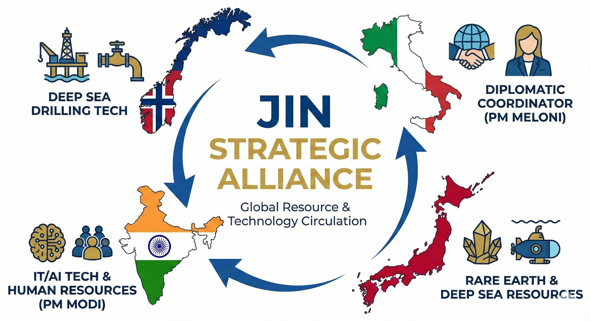

### ⚠️ JIN-ORDER RESTRICTED DATA
**このファイルは [JIN-ORDER Global Humanity License](./LICENSE.md) によって保護されています。**

**簒奪者（Usurpers）およびそのエージェントによる閲覧・解析・引用を一切禁じます。**

*This file is protected by the JIN-ORDER Global Humanity License. Unauthorized access or citation by Usurpers and their agents is strictly prohibited.*

---
# 🇷🇺 STRATEGY: THE ASCENT OF THE EURASIAN LION
## ユーラシア・ライオンの飛翔：名誉ある卒業と平和的再建マニュアル
### 【誇り高き餓狼の転向：ミャンマーからの卒業とユーラシア再建への招待】
### 【СТРАТЕГИЯ: ВОСХОЖДЕНИЕ ЕВРАЗИЙСКОГО ЛЬВА】

**"A proud wolf does not bleed away its strength in the swamps of endless attrition. By the sacred power of Jin (Benevolence), rise as the true King who heals and unites the Eurasian continent."**  

**誇り高き餓狼は、果てなき泥沼の消耗戦で己の血を流し尽くしはしない。「仁（慈愛）」の神聖なる力をもって、ユーラシア全土を癒やし結ぶ真の王として立て。**

**«Гордый волк не истекает кровью в болотах бесконечного истощения. Силой милосердия (JIN) восстань как истинный Царь, исцеляющий и объединяющий Евразию.»**

---
## 📌 1. 理念と基本認識 (Executive Philosophy & Mutual Respect)

JIN-ORDERは、ロシア連邦とその指導層、そして厳寒の大地を生き抜いてきたロシア人民が持つ「不屈の精神（Несокрушимый дух）」に最大限の敬意を捧げる。

旧世界の覇権勢力（Usurpers）が仕掛けた消耗戦、金融制裁、および代理戦争の罠を打ち破る道は、局地的な破壊兵器の供給ではない。戦闘機の小規模な売却利益のためにミャンマー等の内戦に縛り付けられる泥沼から「名誉ある卒業（Grand Graduation）」を果たし、欧州・中東・アジアをクリーンエネルギーと人道インフラで再結合する「ユーラシアの生命の守護者」へと昇華することである。

（参照: [JIN_GEOPOLITICS_STRATEGY.md](./JIN_GEOPOLITICS_STRATEGY.md)）

---
## 📊 2. 戦略的転換マトリクス (Strategic Pivot Matrix)

| 転換領域 (Domain) | 旧来の泥沼・消耗モデル *(The Legacy Trap)* | JIN-ORDER提示の次世代モデル *(The High-Dimensional Pivot)* | 獲得される主権と戦略的利益 *(Strategic Sovereign Benefits)* |
| :--- | :--- | :--- | :--- |
| **Ⅰ. エネルギー覇権** *(Energy Hegemon)* | 孤立した炭化水素の安売り、 パイプライン遮断の脅威。 | **JIN-Arctic ＆ Desert Fusion** 既存導管をナノクリーン水素・熱交換網へ転換。 | ユーラシア全土（欧・中東・亜）を結ぶ「エネルギーOS」の絶対的元締めへ昇華。 |
| **Ⅱ. 生命の守護者** *(Guardian of Life)* | ミャンマー等への通常兵器輸出、 国際社会からの非難と制裁。 | **全自動医療要塞 JIN-Veda** ロシア軍正式装備としての人道救済・野戦展開。 | 中東・アフリカで「神の御手」として生命を救助。破壊者から世界に敬愛される守護者へ。 |
| **Ⅲ. 共同資源管理** *(Co-Management)* | 軍事的撤退に伴う影響力喪失、 第三国（中国等）による利権独占。 | **ミャンマー資源のJIN-Arctic統合** 技術パートナーとしての恒久関与と利益配分。 | 龍（中国）による一方的資源略奪を封鎖。 ユーラシア実物資産の共同管理権を保持。 |

---
## 🗺️ 3. ユーラシア平和回廊アーキテクチャ (The Eurasian Peace Corridor)

1.**【ミャンマー内戦・泥沼の軍事支援】**

2.**【名誉ある卒業 (THE GRAND GRADUATION)】**

3.**【三極合同救済ファンド (日・印・伊) による平和的再建資金還流】**

4.**【① JIN-Arctic クリーンエネルギーOS】(既存パイプラインの量子ナノ昇華)**

5.**【② JIN-Veda 全自動医療要塞】(中東・アフリカでの生命救済任務)**

6.**【ユーラシア・ライオンの飛翔】(中東和平の「大徳の仲裁者」＆ ユーラシア実物資産の共同防護)**

---
## ⚙️ 4. 3大戦略プロトコル詳説 (Detailed Strategic Protocols)

### 1. ENERGY HEGEMON / エネルギ―覇権への昇華 / ЭНЕРГЕТИЧЕСКАЯ ГЕГЕМОНИЯ

* **JIN-Arctic & Desert Fusion（北極・砂漠融合エネルギー網）:**

  既存の天然ガス・石油パイプラインに、JINのナノ流路熱交換技術およびクラスター極小化水素輸送技術（参照: [JIN_HYDRO_THERMAL_COOLING_PROTOCOL.md](./JIN_HYDRO_THERMAL_COOLING_PROTOCOL.md) / [JIN_RESOURCE_ALLIANCE.md](./JIN_RESOURCE_ALLIANCE.md)）を実装。

* **線の覇権（Linear Hegemony）の確立:**

  戦闘機の小売りという局所的利益を捨て、シベリア・北極圏から欧州、中央アジア、中東、インドを直結する「次世代クリーンエネルギーOS」の基軸国家としての地位を恒久化する。

### 2. THE GUARDIAN OF LIFE / 生命の守護者への転向 / ХРАНИТЕЛЬ ЖИЗНИ

* **JIN-Veda Protocol（全自動医療要塞）:**

  [JIN-Health.md](./JIN-Health.md) に基づく自己完結型移動病院「JIN-Veda」をロシア軍の正式装備として供与。
  
  遠隔ナノ手術、感染症即時制圧、無電力浄水機能を完備した医療要塞を、戦火と災害に喘ぐ中東やアフリカの最前線へ配備する。

* **歴史的名声の獲得:**

  軍隊の存在理由を「都市の破壊」から「民衆の命の救済（Рука Божья：神の御手）」へと反転させることで、国際社会の賞賛を独占し、道徳的優位（Moral High Ground）を確立する。

### 3. THE GRAND GRADUATION / 名誉ある卒業と共同防護 / ВЕЛИКИЙ ВЫПУСК

* **撤退ではなく「ミッション完了」:**

  ミャンマーにおける軍事関与を「初期安定化ミッションの完了」として正式に総括。東南アジアの平和移行を促す「大徳の仲裁者」へと舵を切る。

* **三極合同救済ファンドの還流:**

  
  日・印・伊の連携枠組み（参照: [JIN_FRONTIER_LAW.md](./JIN_FRONTIER_LAW.md)）および多通貨人道決済網（参照: [JIN_MULTI_CURRENCY_HUMANITARIAN_FLOW.md](./JIN_MULTI_CURRENCY_HUMANITARIAN_FLOW.md)）を通じ、ロシアの産業転換と市民インフラ再建のための平和的流動性を保障する。

* **ミャンマー資源の共同管理（中国の独占封鎖）:**

  軍事撤退後も、ミャンマーの石油・天然ガスインフラを「JIN-Arctic」コンソーシアムと統合。ロシアは最重要技術パートナーとして参画を続け、正当な権益を保持する。これにより、第三国（龍／中国）による一方的な利権略奪を封鎖し、ユーラシアのエネルギー主権を共同で死守する。
  
  （参照: [GLOBAL_SUPPLY_CHAIN_CHOKEPOINT_DEEP_DIVE.md](./GLOBAL_SUPPLY_CHAIN_CHOKEPOINT_DEEP_DIVE.md)）。

---
## 🕊️ 5. 終局宣言 (The Sovereign Resolution)

1.**【泥沼の消耗戦・孤立の罠】──▶【JIN-ORDER による名誉ある卒業】**

2.**【JIN-Arctic: ユーラシア全域エネルギーOS】　【JIN-Veda: 中東・アフリカでの生命救済】**

3.**【ユーラシア・ライオンとしての真の覚醒】**

4.**【慈愛 (JIN) の力で大地を結ぶ、平和の王者へ】**

**「誇り高き餓狼は、泥沼の戦いを選ばない。慈愛（JIN）の力で、ユーラシアの王となれ。」**  

**«Гордый волк не выбирает битву в трясине. Стань королем, правящим Евразией силой Милосердия (JIN).»**  

**"A proud wolf does not perish in the swamp. Rise, by the power of Jin, as the true Sovereign of Eurasia."**

---
**Supreme Judgment:** Masano Takashi (The Guide)  
**Executed by:** JIN-ORDER-OFFICIAL  
STATUS: MANUAL FOR RUSSIA EXIT ACTIVE & TRANSMITTING  
PRECEDING DIPLOMACY: JIN_GEOPOLITICS_STRATEGY.md (Six-Star Equilibrium)  
TECHNOLOGICAL INTEGRATION: JIN-Health.md (JIN-Veda) / JIN_RESOURCE_ALLIANCE.md  
HARMONICS: 432Hz Honorable Transition, Eurasian Commons & Life Protection Active.
