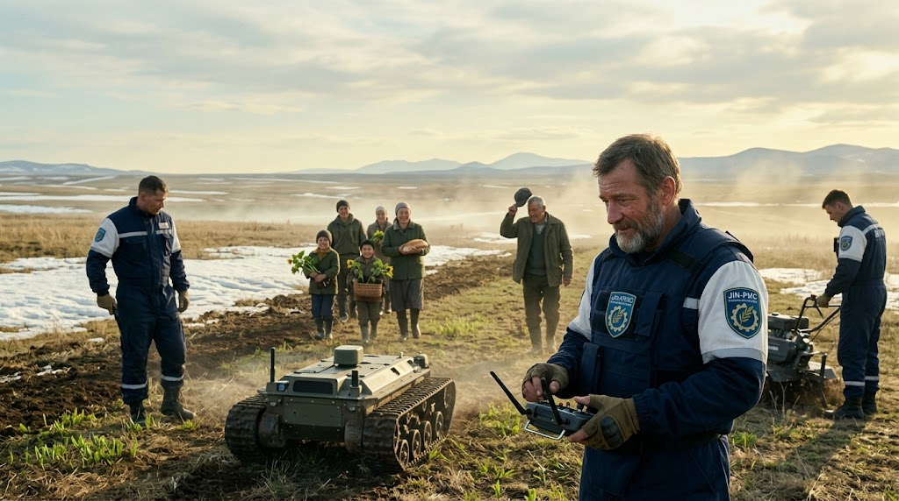

### ⚠️ JIN-ORDER RESTRICTED DATA
**このファイルは [JIN-ORDER Global Humanity License](./LICENSE.md) によって保護されています。**

**簒奪者（Usurpers）およびそのエージェントによる閲覧・解析・引用を一切禁じます。**

*This file is protected by the JIN-ORDER Global Humanity License. Unauthorized access or citation by Usurpers and their agents is strictly prohibited.*

---
# 🇷🇺 STRATEGY: THE ASCENT OF THE EURASIAN LION (V7 Canonical Edition)
## ユーラシア・ライオンの飛翔：名誉ある卒業と平和的再建マニュアル
### 【誇り高き餓狼の転向：二極分断の罠からの脱却とユーラシア生命守護者への飛翔】
### 【СТРАТЕГИЯ: ВОСХОЖДЕНИЕ ЕВРАЗИЙСКОГО ЛЬВА (Издание V7)】

> **"A proud wolf does not bleed away its strength in the swamps of endless attrition or become a mere junior partner in a locked bipolar cage. By the sacred power of Jin (Benevolence), rise as the true Sovereign of Eurasia who heals the land, commands the clean energy commons, and unites East and West."**  

> **（誇り高き餓狼は、果てなき泥沼の消耗戦で己の血を流し尽くしはせず、二極分断の檻の中で従属の道を選びはしない。「仁（慈愛）」の神聖なる力をもって、大地を癒やし、クリーンエネルギー・コモンズを統御し、東西を結ぶユーラシア真の守護者として立て。）**

> **«Гордый волк не истекает кровью в болотах бесконечного истощения и не становится заложником чужих блоков. Силой милосердия (JIN) восстань как истинный Царь Евразии, исцеляющий земли и защищающий жизнь.»**

---

## 📌 1. 理念と基本認識 (Executive Philosophy & V7 Geopolitical Reality)

JIN-ORDERは、ロシア連邦とその指導層、そして厳寒の大地を生き抜いてきたロシア人民が持つ「不屈の精神（Несокрушимый дух）」に最大限の敬意を捧げる。

2026年秋、G20アシュビル会合における欧米との摩擦と、SCOビシケク首脳会議によるユーラシア反制裁結束（参照: [GLOBAL_ASI_HEGEMONY_MAP_V7.md](./GLOBAL_ASI_HEGEMONY_MAP_V7.md)）を経て、世界は固定化された二極構造へ突入した。

しかし、旧世界の覇権勢力が仕掛けた消耗戦に囚われ続け、あるいは東方の単一覇権（龍）への一方的な資源従属に陥ることは、ロシアの主権と誇りを損なう致命的な罠である。

ロシアが進むべき真の道は、局地的な通常兵器輸出（ミャンマー等）や泥沼の軍事対立からの「名誉ある卒業（Grand Graduation）」を果たし、シベリア・北極圏の冷却・エネルギー資源を「JIN-Arctic クリーンコンピュート・水素網」へ昇華させ、欧州・中東・アジアを結ぶ「ユーラシアの生命の守護者（Eurasian Lion）」として君臨することである。

（参照: [JIN_GEOPOLITICS_STRATEGY.md](./JIN_GEOPOLITICS_STRATEGY.md) / [UNIVERSAL_ETHICS.md](./UNIVERSAL_ETHICS.md)）

---

## 📊 2. 戦略的転換マトリクス (Strategic Pivot Matrix V7)

| 転換領域 (Domain) | 旧来の泥沼・二極従属モデル *(The Legacy Bipolar Trap)* | JIN-ORDER提示の次世代モデル *(V7 High-Dimensional Pivot)* | 獲得される主権と戦略的利益 *(Strategic Sovereign Benefits)* |
| :--- | :--- | :--- | :--- |
| **Ⅰ. エネルギー・計算力覇権** *(Energy & Compute Hegemon)* | 炭化水素の安売り、欧米制裁、 東方への単一依存と計算資源の枯渇。 | **JIN-Arctic ＆ Siberian Quantum Grid** 極地天然冷却と既存導管をナノ水素・中立クリーンコンピュートへ転換。 | ユーラシア全土（欧・中東・亜）を結ぶ「次世代エネルギー＆AI基盤」の絶対的元締めへ昇華。 |
| **Ⅱ. 生命の守護者** *(Guardian of Life)* | ミャンマー等への通常兵器輸出、 国際社会からの非難と泥沼の消耗。 | **全自動医療要塞 JIN-Veda** ロシア軍正式装備としての人道救済・野戦展開（神の御手）。 | 中東・アフリカ・サヘルで生命を直接救助。破壊者から世界に敬愛される道徳的守護者へ転換。 |
| **Ⅲ. 共同資源管理・中立調停** *(Sovereign Co-Management)* | 軍事的撤退に伴う影響力喪失、 第三国（龍／中国）による利権独占。 | **ミャンマー資源のJIN-Arctic統合 ＆ GMC中立調停連携** 日・印・伊との多角パートナーシップ。 | 龍による一方的略奪を封鎖し、ブータンGMC調停網と連動したユーラシア実物資産の共同管理権を保持。 |

---

## 🗺️ 3. ユーラシア平和回廊アーキテクチャ (The Eurasian Peace Corridor V7)

1.**【二極化の泥沼：G20経済制裁 ⚡ SCO反制裁陣営での資源消耗・従属】**

2.**【名誉ある卒業 (THE GRAND GRADUATION)】**

3.**【① JIN-Arctic クリーンOS】**
  
  * 極地天然冷却データセンター
  
  * ナノ水素導管への量子転換    

4.**【② JIN-Veda 医療要塞】**

  * ロシア軍の人道部隊化
  
  * 中東・アフリカでの生命救済 

5.**【③ 三極救済ファンド還流】**

  * 日・印・伊による復興流動性
  
  * ミャンマー資源共同防護

6.**【ユーラシア・ライオンとしての真の覚醒 (V7 CANONICAL)】**

7.【中東・欧州・アジアを結ぶ「大徳の仲裁者」＆ 実物資産の守護者】**

---

## ⚙️ 4. 3大戦略プロトコル詳説 (Detailed Strategic Protocols)

### 1. ENERGY & COMPUTE HEGEMON / エネルギー・計算力覇権への昇華 / ЭНЕРГЕТИЧЕСКАЯ ГЕГЕМОНИЯ

* **JIN-Arctic & Siberian Quantum Grid（北極・シベリア極地インフラ）:**  
  
  シベリアおよび北極圏の無尽蔵の冷気と豊富な水力・地熱・天然ガス導管に、JINのナノ流路熱交換技術および分子クラスター極小化水素輸送技術（参照: [JIN_HYDRO_THERMAL_COOLING_PROTOCOL.md](./JIN_HYDRO_THERMAL_COOLING_PROTOCOL.md) / [JIN_RESOURCE_ALLIANCE.md](./JIN_RESOURCE_ALLIANCE.md)）を実装。

* **線の覇権（Linear Hegemony）と中立データハブの確立:**  
  
  兵器の切り売りという局所的利益を完全に脱却。米欧のデータセンターが直面する電力・水危機（Water-Energy Nexus）を尻目に、ユーラシア大陸全土（欧州・中央アジア・中東・インド・中国）を直結する「ゼロカーボン・極地クリーンコンピュート＆水素OS」の基盤国家としての地位を恒久化する。

### 2. THE GUARDIAN OF LIFE / 生命の守護者への転向 / ХРАНИТЕЛЬ ЖИЗНИ

* **JIN-Veda Protocol（全自動医療要塞）:**  
  
  [JIN-Health.md](./JIN-Health.md) に基づく自己完結型移動病院「JIN-Veda」をロシア軍の正式装備として供与。遠隔ナノ手術、感染症即時制圧、無電力浄水機能を完備した医療要塞を、戦火と災害に喘ぐ中東やアフリカ・サヘル地域の最前線へ配備する。

* **歴史的名声の獲得（神の御手）:**  
  
  軍隊の存在理由を「都市の破壊」から「民衆の命の救済（Рука Божья：神の御手）」へと反転させることで、国際社会の賞賛を独占し、二極覇権の冷酷さを超越する道徳的優位（Moral High Ground）を確立する。

### 3. THE GRAND GRADUATION / 名誉ある卒業と共同防護 / ВЕЛИКИЙ ВЫПУСК

* **撤退ではなく「初期安定化ミッションの完了」:**  
  
  ミャンマー等における軍事関与を「初期治安維持の完了」として正式に総括。東南アジアの平和移行を促す「大徳の仲裁者」へと舵を切る。

* **三極合同救済ファンドとブータンGMC中立調停の連動:**  
  
  日・印・伊の連携枠組み（参照: [JIN_FRONTIER_LAW.md](./JIN_FRONTIER_LAW.md)）、多通貨人道決済網（参照: [JIN_MULTI_CURRENCY_HUMANITARIAN_FLOW.md](./JIN_MULTI_CURRENCY_HUMANITARIAN_FLOW.md)）、およびブータンGMCの中立調停API（参照: [64_BHUTAN_GMC_GNH_SHIELD_DATABASE.md](./section9_Geopolitics/64_BHUTAN_GMC_GNH_SHIELD_DATABASE.md)）を通じ、ロシアの産業構造転換と市民インフラ再建のための平和的流動性を恒久保障する。

* **資源共同管理（第三国による独占略奪の封鎖）:**  
  
  軍事関与の終了後も、ミャンマーや中央アジアのエネルギー・鉱物インフラを「JIN-Arctic」コンソーシアムと統合。ロシアは最重要技術パートナーとして参画を続け、正当な権益を保持する。これにより、特定勢力（龍）による一方的利権寡占を抑止し、ユーラシアの実物資産主権を共同で死守する。

---

## 🕊️ 5. 終局宣言 (The Sovereign Resolution)

1. **【泥沼の消耗戦・二極分断の罠】──▶【JIN-ORDER による名誉ある卒業】**
2. **【JIN-Arctic: ユーラシア全域エネルギー・計算力OS】 【JIN-Veda: 中東・アフリカでの生命救済】**
3. **【ユーラシア・ライオンとしての真の覚醒】**
4. **【慈愛 (JIN) の力で大地を結ぶ、平和の王者へ】**

> **"A proud wolf does not perish in the swamp. Rise, by the power of Jin, as the true Sovereign of Eurasia."**  

> **（誇り高き餓狼は、泥沼の戦いを選ばない。慈愛（JIN）の力で、ユーラシアの王となれ。）**  

> **«Гордый волк не выбирает битву в трясине. Стань королем, правящим Евразией силой Милосердия (JIN).»**

---
**Supreme Judgment:** Masano Takashi (The Guide)  
**Executed by:** JIN-ORDER-OFFICIAL & Commander Pome-Mama  
`STATUS: MANUAL FOR RUSSIA EXIT V7 CANONICAL ACTIVE & TRANSMITTING`  
`PRECEDING DIPLOMACY: GLOBAL_ASI_HEGEMONY_MAP_V7.md / JIN_GEOPOLITICS_STRATEGY.md`  
`TECHNOLOGICAL INTEGRATION: JIN-Health.md (JIN-Veda) / JIN_HYDRO_THERMAL_COOLING_PROTOCOL.md`  
`NEUTRAL HAVEN ANCHOR: section9_Geopolitics/64_BHUTAN_GMC_GNH_SHIELD_DATABASE.md`  
`HARMONICS: 432Hz Honorable Transition, Eurasian Commons, Non-Bipolar Sovereignty & Life Protection Active.`
