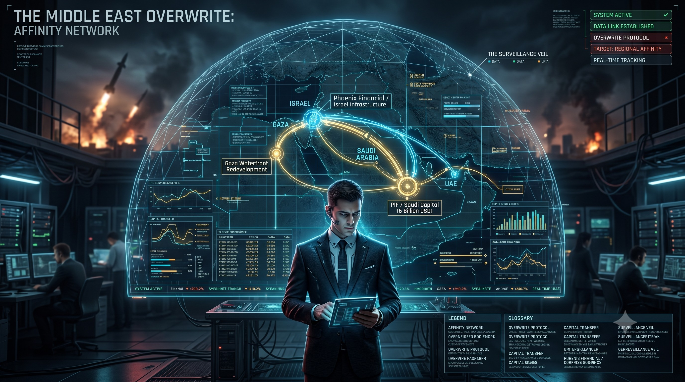

# 🛰️ SUB-LOG: THE MIDDLE EAST OVERWRITE - AFFINITY NETWORK

## 👁️ Tactical Intelligence Briefing
This sub-log archives the empirical data and strategic map highlighting the financial and infrastructural takeover of the Middle East. While superficial armed conflicts and kinetic missile strikes fill public media feeds as a tactical smokescreen, the core reality is a systematic overwrite protocol run via targeted financial networks and sovereign capital redirection.

---

## 📊 Visual Asset: Operational Recon Interface
Below is the real-time tracking visualization of the sovereign wealth pipelines and corporate infrastructure acquisitions interlinking the Gulf states and the Israeli financial core.

---

## 🧭 Network Infrastructure & Pipeline Mechanics

### 1. 💰 Capital Sourcing: PIF / Saudi Capital (6 Billion USD)
*   **The Resource Hub**: Utilizing massive sovereign funds sourced directly from Saudi Arabia, UAE, and Qatar.
*   **The Vehicle**: Routed through specialized elite investment frameworks (Affinity Partners) to stealthily acquire critical state-level infrastructure.

### 2. 🏛️ Core Target: Phoenix Financial / Israel Infrastructure
*   **The Financial Hub**: Direct equity penetration into Israel's absolute core financial, insurance, and logistical sectors.
*   **System Overwrite**: Capital flow is strategically deployed to systematically absorb the economic foundation under the guise of stabilizing regional commerce, establishing a new commercial operating system (OS).

### 3. 🏖️ Territorial Assets: Gaza Waterfront Redevelopment
*   **The Post-Conflict Blueprint**: Complete non-kinetic restructuring of coastal territory into automated commercial zones, high-tech trade parks, and fully monitored urban sectors.
*   **Mechanism**: Powered by a unified infrastructure network, treating localized conflicts merely as dynamic adjustments prior to final optimization.

### 4. 🌐 Environmental Parameter: The Surveillance Veil
*   **The Dome**: The entire theater of operations is encased within a translucent, high-tech geodetic monitoring grid. Every transaction, physical transport, and regional metadata point is synchronized to the centralized hegemony architecture.

---

## 🛠️ Repository Specifications
*   **Classification Level**: JIN-ORDER Sub-Log Strategic Asset
*   **Operational Status**: OVERWRITE PROTOCOL ACTIVE
*   **Tracking Mode**: Real-Time Data Link Established
