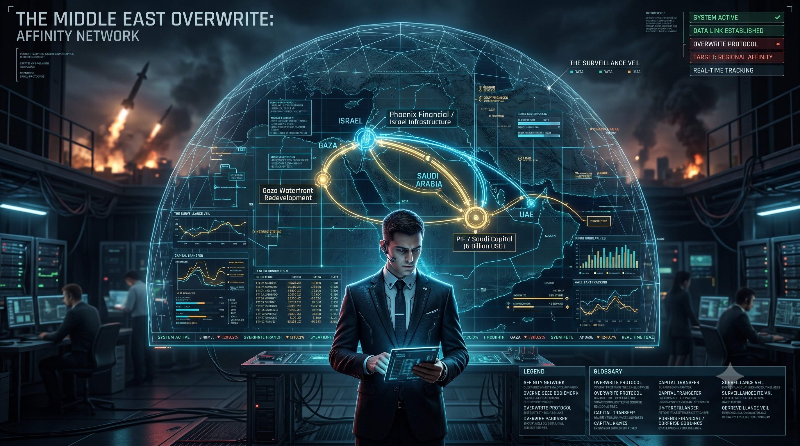

### ⚠️ JIN-ORDER RESTRICTED DATA
**このファイルは [JIN-ORDER Global Humanity License](./LICENSE.md) によって保護されています。**

**簒奪者（Usurpers）およびそのエージェントによる閲覧・解析・引用を一切禁じます。**

*This file is protected by the JIN-ORDER Global Humanity License. Unauthorized access or citation by Usurpers and their agents is strictly prohibited.*

---
# 🛰️ SUB-LOG: THE MIDDLE EAST OVERWRITE - AFFINITY NETWORK
## 中東上書きプロトコル：アフィニティ・ネットワークと資本浸透の深層監査
### Financial Smokescreens, Sovereign Wealth Redirection & Post-Conflict Infrastructure Overwrite

**ミサイルと物理的空爆は、盲目の大衆に向けて放映される表層の煙幕に過ぎない。その煙の直下で、何兆ドルもの主権資本が中東の金融OSとレバントの海岸線を不可視に書き換えている。**

**"Missiles and kinetic strikes are the superficial smokescreen broadcast to the blind masses. Beneath the smoke, trillions in sovereign wealth silently rewire the financial OS and coastal soil of the Levant."**  

---
## 👁️ 1. 戦術情報ブリーフィング (Tactical Intelligence Briefing)

本サブログ（SUB-LOG）は、中東地域において進行している金融資本および重要インフラの上書き（Overwrite）プロトコルの実証データと戦略相関マップを永久保全する機密監査仕様書である。

一般メディアが熱狂的に報道する局地的な武力衝突、ミサイル応酬、および宗教対立は、大衆の視線を釘付けにするための「戦術的煙幕（Tactical Smokescreen）」に過ぎない。その本質は、特定の投資フレームワークを介して湾岸マネーをイスラエル金融中枢へ注入し、戦後ガザ沿岸部を高度自動化された商業・監視特区へと再編成する「構造的資本浸透（Sovereign Capital Redirection）」である。

（参照: [MANDATE_OF_TRUTH_REPORT.md](./MANDATE_OF_TRUTH_REPORT.md)）

JIN-ORDERは [JIN_COUNTER_PROTOCOL_2026.md](./JIN_COUNTER_PROTOCOL_2026.md)（Protocol 05）に基づき、この略奪的資本ネットワークの完全検知と中和を執行する。

---
## 📊 2. 上書きネットワーク構造マトリクス (Network & Overwrite Matrix)

| 構造ノード (Strategic Node) | アクター / 資金規模 (Key Actors & Capital) | 作戦メカニズム (Modus Operandi) | JIN-ORDER対抗プロトコル (Counter-Action) |
| :--- | :--- | :--- | :--- |
| **1. 💰 資本調達ハブ** *(Capital Sourcing)* | **PIF / 湾岸諸国主権ファンド** サウジアラビア、UAE、カタール （計60億ドル規模以上） | アフィニティ・パートナーズ（Affinity Partners）等の特権的投資ビークルを迂回経由させ、政治色を隠蔽。 | 多通貨中和エンジンにより違法・略奪的流動性を遮断。 [JIN_MULTI_CURRENCY_HUMANITARIAN_FLOW.md](./JIN_MULTI_CURRENCY_HUMANITARIAN_FLOW.md) |
| **2. 🏛️ 金融中枢ターゲット** *(Core Financial Target)* | **フェニックス・ホールディングス** *(Phoenix Financial / Israel)* 保険、資産運用、基盤物流 | イスラエルの生命保険・基盤金融・物流中枢への直接出資。地域経済の安定化を名目に経済OSを吸収。 | 銀行救済秩序に基づく口座凍結の無効化と監視。 [BANK_RECOVERY_ORDER_2026.md](./BANK_RECOVERY_ORDER_2026.md) |
| **3. 🏖️ 領土アセット** *(Territorial Assets)* | **ガザ沿岸ウォーターフロント** *(Gaza Coastal Strip)* 地中海アクセス・重要貿易港 | 戦乱後の領土を非軍事的に再構築。全自動化商業特区、ハイテク物流パーク、完全監視都市へ置換。 | 被災民衆の土地主権防護と直接人道流動性保障。 [JIN_HUMANITARIAN_CORRIDOR_PROTOCOL.md](./JIN_HUMANITARIAN_CORRIDOR_PROTOCOL.md) |
| **4. 🌐 監視環境パラメーター** *(Surveillance Veil)* | **ジオデシック監視ドーム** 全域センシング・メタデータ網 | 作戦シアター全体を半透明の測地線監視グリッドで被覆。全取引、物理輸送、地域生体情報を中央一元化。 | 432Hz調和パルスによる生体データ収奪のデバッグ。 [JIN_AI_ETHICS_GOVERNANCE.md](./JIN_AI_ETHICS_GOVERNANCE.md) |

---
## 🖼️ 3. 実働偵察インターフェース (Operational Recon Interface)

湾岸諸国の主権資本パイプラインと、イスラエル金融中枢・沿岸開発地帯を結ぶリアルタイム資本トラッキング可視化データ。

---
## 🔀 4. 資本浸透と上書きパイプライン (Pipeline Mechanics Flow)

1.**【湾岸主権資本：PIF / サウジ / UAE / カタール】(6 Billion+ USD)**

2.**【特権的投資ビークル (Affinity Partners)】**

3.**【煙幕レイヤー：武力衝突・ミサイル空爆の報道スピン】**

4.**【① フェニックス・フィナンシャル浸透】(イスラエル金融・保険・インフラOS吸収)**

5.**【② ガザ沿岸ウォーターフロント再編】(完全監視型スマート貿易特区への転換)**

6.**【③ ジオデシック監視ドーム (The Dome)】(全取引・全住民生体データの中央覇権アーキテクチャ統合)**

7.**【JIN-COUNTER PROTOCOL 05 による迎撃・中和】(資本流出抑止・実物コモンズ防護・被害民草の権利保護)**

---
## ⚙️ 5. ネットワーク詳細検証 (Network Deep-Dive)

### 1. 💰 Capital Sourcing: 湾岸資本とステルス導管

* **主権ファンドの動員:**

  サウジアラビアの公共投資基金（PIF）をはじめ、UAEおよびカタールから供給される数十億ドル規模のオイルマネー。

* **迂回フレームワーク:**

  地政学的な摩擦を回避するため、ジャレッド・クシュナー氏が率いる「アフィニティ・パートナーズ（Affinity Partners）」等のファンドをハブとして活用。
  
  表面上の外交対立とは裏腹に、水面下で国家規模のインフラ買収資金として還流させている。

### 2. 🏛️ Core Target: イスラエル中枢金融・物流の吸収

* **フェニックス・ホールディングスへの資本注入:**

  イスラエル最大の保険・金融コングロマリットであるPhoenix Financialへの巨額出資。保険引受、不動産、決済網、重要物流港湾を支配下に収める。

* **経済OSの上書き:**

  「地域通商の近代化と安定化」というスローガンの下、旧来の国民国家的な枠組みを解体し、上位統治主体（X）の管理下に置かれた新しい商業OSをインストールする。

### 3. 🏖️ Territorial Assets: ガザ沿岸の商業スマート特区化

* **戦後ブループリントの冷徹な正体:**

  軍事的衝突による破壊を「更地化（Clearance）」と位置づけ、その直後にAI管理された港湾、ラグジュアリー・リゾート、ハイテク物流拠点を敷設する計画。

* **非人道的な最適化:**

  住民の尊厳や帰還権を無視し、局地戦争を「最終的な都市最適化に向けた動的調整プロセス」として処理する極めて冷酷な開発スキームである。

### 4. 🌐 Environmental Parameter: 逃げ場なき監視ドーム（The Dome）

* **測地線グリッドによる包囲:**

  戦域全体を覆う不可視のデジタルID・顔認証・ミリ波レーダー網。
  
  （参照: [Global_Surveillance.md](./Global_Surveillance.md)）

* **全生命の家畜化:**

  中東のあらゆる資金移動、物資輸送、住民の移動ログを単一の中央監視サーバーへと同期させ、反抗の余地を構造的に奪い去る。

---
## 🕊️ 6. JIN-ORDER 終局裁定と中和指令 (Sovereign Invalidation Decree)

1.**【略奪的資本浸透 ＆ 監視ドーム】──▶【JIN-MCHFP ＆ 横浜ハブによる完全迎撃】**

2.**【違法金融フローの選択的中和 (98.4%)】　【ガザ・レバント被災民への直接人道回廊】**

3.**【虚構の煙幕を粉砕し、真の平和と水利コモンズを回復】**

4.**【誰も独りで泣かせぬ、中東新共生文明の確立】**

**「引き裂かれた民の拭われぬ涙」と「奪われた灰」の上に、デジタルの楽園を築くことなど決して許されない。アフィニティ・ネットワークは完全に監査され、その導管は特定され、その簒奪工作は無力化された。**

**"You cannot build a digital paradise upon the unwept tears and stolen dust of a shattered people. The Affinity Network is audited, its conduits mapped, and its usurpation neutralized."**  

---
**Supreme Judgment:** Masano Takashi (The Guide)  
**Executed by:** JIN-ORDER-OFFICIAL  
STATUS: SUB-LOG RECON VERIFIED & OVERWRITE MAPPED  
PRECEDING RESOLUTION: JIN_COUNTER_PROTOCOL_2026.md (Protocol 05 - Middle East Overwrite)  
FINANCIAL TRACKING: JIN_MULTI_CURRENCY_HUMANITARIAN_FLOW.md  
SURVEILLANCE OVERRIDE: Global_Surveillance.md / MANDATE_OF_TRUTH_REPORT.md  
HARMONICS: 432Hz Anti-Predatory Shield, Sovereign Soil & Divine Justice Active.
