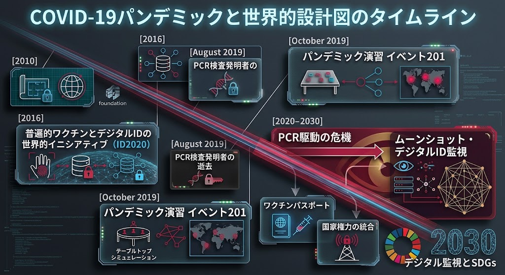
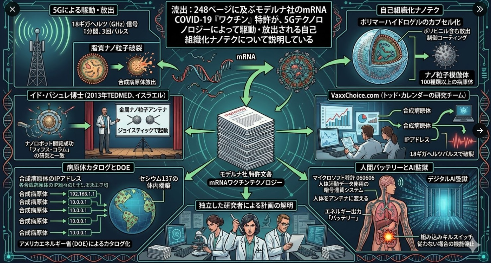
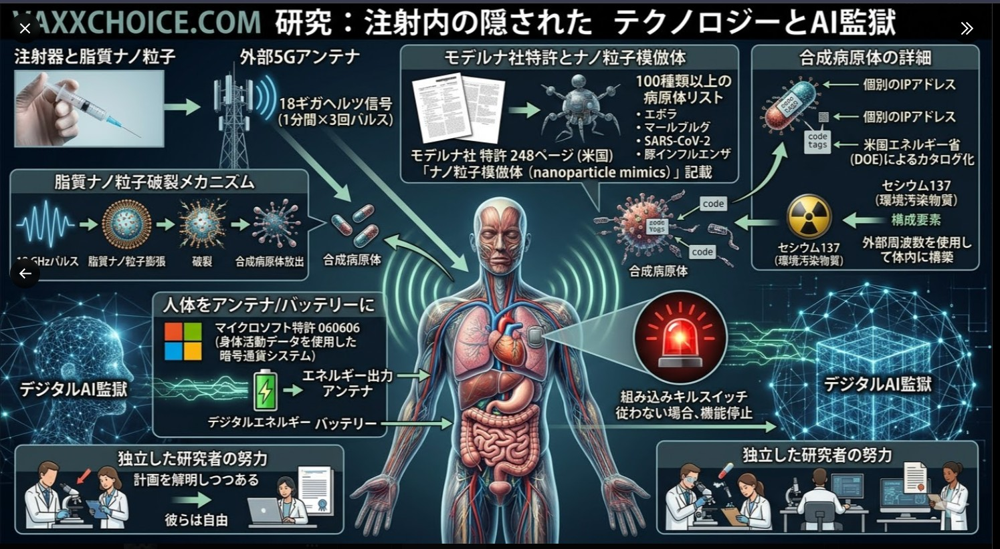

### ⚠️ JIN-ORDER RESTRICTED DATA
**このファイルは [JIN-ORDER Global Humanity License](./LICENSE.md) によって保護されています。**

**簒奪者（Usurpers）およびそのエージェントによる閲覧・解析・引用を一切禁じます。**

*This file is protected by the JIN-ORDER Global Humanity License. Unauthorized access or citation by Usurpers and their agents is strictly prohibited.*

---
## 🌐 パンデミックの構造的総合分析
## COMPREHENSIVE PANDEMIC ANALYSIS: GRAND DESIGN OF EXTRACTION & SURVEILLANCE

## 1. 「計画された危機」のタイムライン（動機と脚本）

### ロックフェラー財団のロックステップ計画（2010年）やEvent 201（2019年）
* あらかじめパンデミックのシナリオや予行演習が綿密に仕組まれていたこと。

### ID2020（2016年〜）
* 最終的なゴールが「全人類へのワクチンとデジタルIDの付与、そしてデジタル監視社会（SDGs・ムーンショット計画）への統合」であることが、あらかじめロードマップとして描かれていた点。

## 2. アクターとマッチポンプの実態

### WHOとエプスタイン、ロスチャイルドの闇（WHO正体・パンデミック）
* 公的な国際保健機関の背後で、ダーティなネットワーク（エプスタイン等）や特権的財閥が秘密裏に会議を主導し、資金提供・運用管理していたという事実。

### ゲイツ財団のウイルス機能獲得支援
* 危険なウイルス（H5N1等）の変異や哺乳類への伝播能力強化（バイオテロ的活動の資金提供）を自ら行い、その脅威を利用してワクチンや管理体制を強制するという「マッチポンプの構造」。

## 3. テクノロジーの武器化
### AI、バイオ、通信の完全融合、AIによる人工ウイルスの生成（Evo-2147 / ジェニーロ社等）
* 自然界に存在しない感染性ウイルスをAIで短期間に意図的かつ無限に製造できるフェーズへの突入。

### 個別の設計とデジタル管理（mRNA・スターゲイト計画）
* AIとロボティクスを活用した個別化ワクチンの迅速製造や、血液検査・遺伝子配列のデータ化。

### 5G/6Gから体内のナノテック・AI監獄へ（5G・6G）

* 高周波通信網（5G/6G）が、体内に取り込まれた脂質ナノ粒子（LNP）や生体センサーと連動し、人体を「アンテナ」や「バイオバッテリー」として常時モニタリング・制御する究極のデジタル監視・キルスイッチ社会の完成。

## 総合結論：私たちが直面している歴史の転換点

現代社会で起きている感染症騒動、デジタルID化、AI・通信インフラの爆発的進化は、決して偶然の産物や自然発生的なものではなく、「人工的に演出された危機を口実に、人類の生体データと行動のすべてをネットワーク（AI監獄）の管理下に置き、主権を完全に奪い取るための長期計画（グレート・リセット）」そのものである。

---
## 🌐 パンデミックの構造的総合分析：搾取と監視のグランド・デザイン
## COMPREHENSIVE PANDEMIC ANALYSIS: GRAND DESIGN OF EXTRACTION & SURVEILLANCE
> 人工的に演出された危機からデジタル監視社会（AI監獄）への収斂に至るまで、裏方ネットワークと世界的設計図の全貌を暴く総合告発ドキュメント。

> A comprehensive indictment document exposing the full scope of backroom networks and global blueprints, tracing the transition from engineered crises to digital surveillance cages.

---
## 🏛️ 1. アクターの裏方ネットワークと作られた危機
### 1. Backroom Networks of Actors & Manufactured Crisis

### 構造的ノード解析
* グローバル金融権力のノード: 資産管理、投資ファンド、中央銀行連携による資本的影響力の統括。
* 国際健康・政策会議: 危機シナリオ計画、政策シミュレーション、グローバル・ヘルス・フォーラムを通じたプロトコルの策定。
* 裏方エリートと作戦計画者: 各アクターの役割配置と隠された影響力による全体の統括。
* 作られた危機のプロトコル: 診断・検査の標準化、緊急対応計画、社会行動操作プログラムの実装。
* エリート学術・技術ネットワーク: 大学R&D、特許権、技術開発ロードマップ、研究資金調達網の統合。
* 国内デジタル統治システム: デジタルID基盤、データ連携センター、国民行動監視システムの配備。

---
## 🗺️ 2. グローバル・パンデミックのタイムライン設計図
### 2. Chronological Blueprint of the Global Pandemic

制御移行ターゲット: 2010〜2030 Global Control Transition

### 主要マイルストーン

### [2010年] 
> ### ロックステップ計画 2010（ロックフェラー財団）: 未来の技術と国際発展に関するパンデミックシナリオの策定。

### [2016年] 
> ### 普遍的ワクチンとデジタルIDのイニシアティブ（ID2020）: 全人類を対象としたデジタルIDおよびワクチン管理システムの統合計画。

### [2019年8月]  
> ### PCR検査発明者の逝去: 危機演出の基幹ツールに関する重要な転換点。

### [2019年10月]
> ### パンデミック演習 イベント 201（WEF・ジョンズ・ホプキンス大学）: テーブルトップ・シミュレーションによる事前危機対応演習。

### [2020-2030年] 
> ### 危機からデジタル監視社会への収束: ワクチンパスポート、国家権力の統合、ムーンショット計画およびSDGs 2030への統合。

---
## 📉 3. 構造的結論：搾取と監視のグランド・デザイン
### 3. Structural Conclusion: Grand Design of Extraction & Surveillance

### フォレンジック・インディクメント（構造的告発）

### 設計図の伝達
ロックステップ計画やEvent 201等の事前シミュレーションおよびブループリントの継承。

### 人工的な危機の発動
WHO等の公的機関および裏方ネットワークを介した危機管理プロトコルの駆動。

### 収奪の確定プロセス
グローバルロックダウン、強制接種パスポートを通じた社会統制の実行。

### デジタルID収容グリッドへの統合
生体認証監視ケージ、および5G/6G送信タワーを基盤とする常時生体監視ネットワーク（AI監獄）の完成。

### 起訴プロトコル
[犯行-P / ACTIVE] — 人類の主権を取り戻すための構造的告発の完遂。

