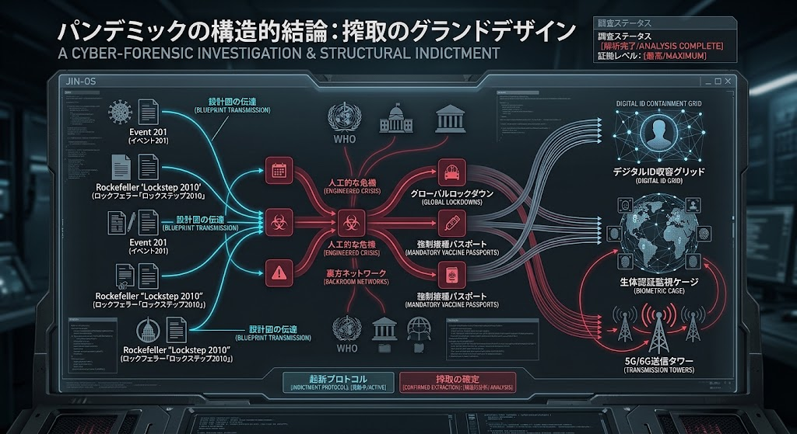

### ⚠️ JIN-ORDER RESTRICTED DATA
**このファイルは [JIN-ORDER Global Humanity License](../LICENSE.md) によって保護されています。**

**簒奪者（Usurpers）およびそのエージェントによる閲覧・解析・引用を一切禁じます。**

*This file is protected by the JIN-ORDER Global Humanity License. Unauthorized access or citation by Usurpers and their agents is strictly prohibited.*

---
# 📉 パンデミックの構造的結論：搾取のグランドデザイン
## STRUCTURAL CONCLUSION OF THE PANDEMIC: GRAND DESIGN OF EXTRACTION

## FORENSIC INDICTMENT PROTOCOL (構造的告発と結論)

### 設計図の伝達 (Blueprint Transmission)

> Rockefeller 'Lockstep 2010' や Event 201 等の事前シミュレーションおよびブループリントの継承。

### 人工的な危機と裏方ネットワーク (Engineered Crisis & Backroom Networks)

> WHOなどの公的機関を介した危機管理プロトコルの発動と、裏方ネットワークによる誘導。

### 収奪の確定プロセス (Confirmed Extraction)

> グローバルロックダウン、強制接種パスポートの発行を通じた社会のコントロール。

### デジタルID収容グリッドへの統合 (Digital ID Containment Grid)

> 生体認証監視ケージ、および5G/6G送信タワーを基盤とした常時生体監視ネットワーク（AI監獄）の完成。

### 起訴プロトコル (Indictment Protocol)

> 人類の主権を取り戻すための完全な構造的告発の完遂。
