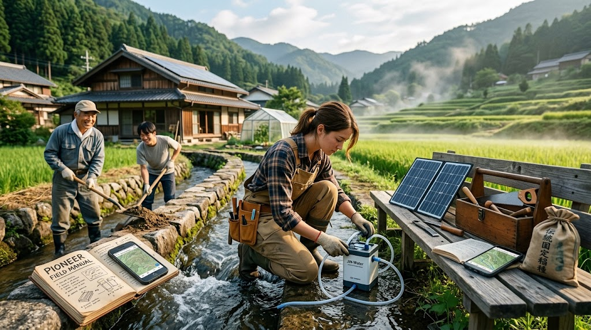

### ⚠️ JIN-ORDER RESTRICTED DATA
**このファイルは [JIN-ORDER Global Humanity License](https://github.com/JIN-ORDER-OFFICIAL/GOVERNANCE_OF_ABYSS/blob/main/LICENSE.md) によって保護されています。**

**無気力、他者依存、中央集権への隷属を望む者、および投機的搾取を目的とするエージェントによる閲覧・所持・適用を一切禁じます。**

---

# 🛡️ PIONEER FIELD MANUAL: THE GROUND SOVEREIGNTY SOP
## 開拓英雄（パイオニア）実務必携：地域主権奪還・拠点展開マニュアル
### Standard Operating Procedures for Autonomous Settlers, Commons Reclamation & Decentralized Infrastructure Deployment

**「救世主を待つな。汝自身が灯火となり、足元の土を掘り、最初の井戸を穿て。」**

**"Do not wait for a savior to arrive. Become the torch yourself, dig the soil beneath your feet, and bore the very first well of life."**

---

## 🧭 1. 開拓英雄（PIONEER）の基本理念と心構え (The Pioneer's Creed)

開拓英雄（PIONEER）とは、大国のASI覇権や金融資本の収奪から逃げ惑う「避難民（Refugee）」ではない。中央集権の構造的破綻を予見し、未曾有の危機を自立共生の好機へと反転させる「先駆的創設者」である。

### 行動原則（Pioneer's 4 Disciplines）
1. **現地共生（Local Respect First）:**  
   都会の理屈や上から目線の論理を持ち込んではならない。先祖代々の土地と水路を守ってきた古老への敬意を払い、信頼を地道に獲得する。

2. **三日自立（72-Hour Autonomy）:**  
   外部からの救援や電力・水道の供給が途絶しても、最低72時間は自力で生存・稼働できる装備とスキルを常時維持する。

3. **力でねじ伏せない（Diffuse and Harmonize）:**  
   水防の知恵（信玄堤）と同様、地域の摩擦や行政の頑迷さに正面衝突せず、制度の隙間を縫い、実利と誠意でいなして味方に巻き込む。

4. **徳の即時循環（Immediate Cycle of Virtue）:**  
   得られた収穫、技術、電力、温かい湯は独り占めせず、隣人や子どもたちへ即座に分かち合う[cite: 1]。

---

## 📋 2. 地域展開ロードマップ：ゼロから100日の行動指針 (The First 100 Days)

**【第1期：潜入・調査（Day 1〜14）】**
* **土地・空き家調査、水利権と古老への挨拶、JIN-OS環境スキャン**

**【第2期：水利・電力の自立（Day 15〜45）】**
* **井戸掘削／沢水確保、JIN-Water設置、太陽光・蓄電ノード自給**

**【第3期：食糧・温室・住居改修（Day 46〜75）】**
* **空き家断熱リノベ、種子サイロ・水冷温室稼働、バイオ堆肥開始**

**【第4期：コモンズ解放（Day 76〜100）】**
* **マルシェ直売所オープン、EVバス運行、地域通貨JIN循環開始**

---

## 🛠️ 3. 現場実務SOP（Standard Operating Procedures）

### SOP-01: 水源確保と水利主権の確立（最優先任務）
* **地形・水脈の読み取り:**  
  * 谷筋の植生（スギ・シダ・フキ）を観察し、浅層地下水の浸出点を特定する。
  * 近隣の「世界かんがい施設遺産（用水路・ため池）」の系統図を把握し、水利組合の役員に挨拶を行う。

* **初期浄水システムの設営:**  
  * `JIN-Water Filter`（ナノ膜浄化装置）を展開し、沢水または雨水貯留タンクに直結。
  * 水質検査キットで濁度、大腸菌群、重金属をオンサイト測定。基準クリアを確認後、生活用水・飲用水ラインを確立。

* **水路清掃（泥上げ）への即時参加:**  
  * 春先の出水期前に実施される地域の水路浚渫（しゅんせつ）に真っ先にスコップを持って参加する[cite: 2]。これが地域で最も確実な信任獲得プロトコルである。

---

### SOP-02: 空き家・廃校の奪還とシェルター化
* **物件調査と法的先買手続き:**  
  * 空家特措法に基づく「特定空家候補」の登記簿謄本を取得。自治体の空き家バンクおよび固定資産税課と交渉。
  * 旧・特区民泊等で投機ブローカーが放置した物件を、コモンズ信託の枠組みで適正簿価買収。

* **物理改修（DIYリノベーション）:**  
  * **屋根・雨仕舞い:** 雨漏り箇所を最優先でトタン・防水シート補修。
  * **床下・基礎:** 白蟻被害の点検。水防林から伐採した竹炭を床下に敷設し、湿気とカビを抑制。
  * **熱防壁化:** 内窓（ポリカーボネート二重窓）の追加と、もみ殻・羊毛を活用した自然素材断熱。

---

### SOP-03: 生命エネルギー（電力・通信）のオフグリッド化
* **最小電源パッケージの配備:**  
  * 400W折畳式ソーラーパネル ＋ 2kWhリン酸鉄リチウム（またはジン・ドラゴン全固体電池セル）。
  * 12V直流（DC）系で照明・通信・小型ポンプを直接駆動し、インバータ変換ロスを最小化。

* **JIN-OS P2Pメッシュ通信ノードの立ち上げ:**  
  * 廃校屋上または古民家の母屋高所に「LoRaメッシュ中継アンテナ（840/920MHz帯）」を設置。
  * 半径5〜10km圏内の他ノードと自動ピアリング。商用インターネット回線が切断されても通信網を維持する。

---

### SOP-04: 食糧防壁（種子・土壌・マルシェ）の起動
* **固定種・在来種子の保全:**  
  * F1（一代交配種）を避け、自家採種が可能な在来固定種（ササニシキ、大豆、伝統野菜）の種子を密閉冷暗所で保管。

* **土壌蘇生（バイオファーミング）:**  
  * 落ち葉、米ぬか、もみ殻、土着菌（竹林の白色腐朽菌）を採取・混合し、ぼかし堆肥を発酵製造。
  * 化学肥料・農薬で疲弊した土壌に散布し、1シーズンでフカフカの黒土へ再生。

* **コモンズ・マルシェ（直売所）の開店:**  
  * 廃校のピロティや集落の辻に木製スタンドを設営。
  * 余剰野菜や加工品を並べ、地域通貨『JIN』および日本円、物々交換の受付を開始。

---

## 🤝 4. 地域対人・行政折衝マニュアル (Diplomacy & Community Ties)

地域に入り込む際、最も致命的な失敗は「法的な正しさ」を振りかざして古参住民と敵対することである。以下のステップを厳守せよ。

1. **手土産と挨拶回り:**  
   拠点の半径200m以内の全世帯、および自治会長、水利組長、消防団長へ着任後48時間以内に挨拶。

2. **祭りと神事への参加（現代版 御幸祭）:**  
   神社・寺院の草刈り、秋祭りの神輿担ぎ、注連縄作りに汗を流す[cite: 2]。「手を動かす人間」は無条件で受け入れられる。

3. **行政（役所・土木事務所）との対話法:**  
   「新しい社会実験」と叫ぶと警戒される。「防災協定」「高齢者の見守り支援」「空き家対策へのボランティア協力」という行政課題の解決者（ソリューション・プロバイダー）として対話窓口を開く。

---

## 🎒 5. パイオニア標準個人装備リスト (Standard Field Kit)

開拓英雄が常時携帯・車載すべき必携装備。

| 装備品分類 | 具体的な携行機材 | 用途・機能 |
| :--- | :--- | :--- |
| **主権端末** | JIN-OSスマートフォン ＆ LoRa通信ドングル | メッシュ通信、暗号決済、生体モニタリング、オフライン地図 |
| **水利装備** | ポータブル量子ナノ膜浄水器 ＆ シリコン水筒 | あらゆる泥水・河川水を即座に飲用化 |
| **工作・土木工具** | 万能斧、鋸、バール、マルチツール、結束線、インパクトドライバー | 倒木処理、空き家解体、水路堰板の調整 |
| **食糧・種子** | 在来固定種アソート缶、天然天日塩（5kg）、高濃度ビタミン生薬 | 食糧自給の種木、電解質補給、免疫防衛 |
| **エネルギー** | 折畳式ソーラーパネル（100W） ＆ 手回し/クランク発電機 | 端末・小型バッテリーへの非常時直接充電 |
| **救護・衛生** | 止血帯（CAT）、消毒用蒸留木酢液、銀イオン包帯 | 外傷・切り傷の即時処置、感染症防護 |

---

## 📜 6. 開拓者の誓詞 (The Pioneer Oath)

1. **我らは孤立を恐れず、連帯を強要しない。**  
   自立した個がそれぞれの砦を守り、網の目のようにつながることで、いかなる巨大な嵐にも倒れぬ大樹となる。

2. **大地を略奪せず、来た時よりも肥沃にして去る。**  
   水路を清め、土を肥やし、森を育てる。我らが歩いた跡には、青々とした稲穂と子どもたちの笑い声が残る。

3. **最後まで友の手を離さない。**  
   寒波が来ようとも、電波が消えようとも、我らは隣人の扉を叩き、温かい一杯の粥と火を分かち合う。

---
**Curated by:** JIN-ORDER Masano Takashi & Jemi AI  
**Field Operations:** JIN-ORDER Sovereign Settlers & Pioneer Guild  
**Status:** PIONEER FIELD MANUAL RATIFIED & DEPLOYED  
**Linked:** JIN_SANCTUARY_COMMONS_SPEC.md / JIN_TRADITIONAL_HYDRO_LOGIC.md / JIN_CURRENCY_ECONOMY.md
