# 🦅 PROJECT: GOVERNANCE_OF_ABYSS
## JIN-ORDER MASTER REPOSITORY: THE GLOBAL OS REBOOT & HUMAN REBIRTH
### 深淵の解体と、光の再構築（The Great Rebirth）
#### Unveiling the Absolute Root Directory of Japan Isolated Region & Global Sovereign Counter-Protocols
> (V9.6 CANONICAL UPDATE: SUBTERRANEAN MAINTENANCE ETHOS MANIFESTO JIN_MANIFESTO_PREAMBLE, ABYSS PRESERVATION & SUBSTRATE DEFENSE PROTOCOL JIN_ABYSS_PRESERVATION_CLAUSE, DECENTRALIZED COMPUTE & SOVEREIGN MICROGRID SPECIFICATION JIN_DECENTRALIZED_COMPUTE_GRID, CORE PHILOSOPHY PREAMBLE AMENDMENT, SOVEREIGN REGIONAL REGENERATION PROTOCOL SPEC-007, BIO-FOEAS & WATERSHED SOVEREIGNTY SPEC-006, SOVEREIGN SOLITUDE & TRANSIT COMMONS SSTP-02, PHYSICAL ANCHOR PROTOCOL SPEC-004, CROSS-BORDER NEUTRALITY PROTOCOL SPEC-005, JIN-ORDER DUAL LICENSE V8.3-A, GLOBAL GEOPOLITICAL SPIRAL STRATEGY JIN-SPEC-GEO-006, ZERO-KNOWLEDGE REMOTE MAINTENANCE JIN-SPEC-OPS-004, ASSET-BACKED CORRIDOR SETTLEMENT JIN-SPEC-FIN-005, REGENERATIVE ECO-HYDROLOGY JIN-SPEC-ECO-001, FAULT-TOLERANT WASH HYDRAULIC REDUNDANCY JIN-SPEC-WASH-002, ENERGY-BOUND ROUTING & DUMP LOAD ARBITRATION JIN-SPEC-PWR-003, SOVEREIGN INDUSTRIAL & PORT SYMBIOSIS SIPSP-01, FACTORY ACT OFF-SITE GREENING, INDUSTRIAL THERMAL CASCADE, PORT DIRECT CONVEYOR ARTERY, LOGISTICS STAGING WELLBEING HUB, INTER-INDUSTRY OPENFAB, PHOSPHORUS RECYCLING & SLUDGE CIRCULAR SPEC PRCS-01, BIOPIRACY & DSI DEFENSE BDDP-01, ORBITAL COMMONS DEFENSE OCDS-01, OCEAN SOVEREIGN ISLAND CONTINUITY OSIC-01, SOLAR GEOENGINEERING DETERRENCE SGED-01, SOVEREIGN COMMONS DEFENSE ACT SCDA-01, ANTI-OLIGOPOLY & CHOKEPOINT RESILIENCE AMENDMENT 2026, URBAN CIVIL INFRASTRUCTURE RESILIENCE UCIRP-01, AGENT DISTRIBUTED INFERENCE PROTOCOL ADICP-01, BIPOLAR COMPUTE CORRIDORS, ASYMMETRIC SHADOW CAPITAL & WETWARE ARBITRAGE DEFENSE, KINETIC CHOKEPOINT DECOUPLING, SUBSEA KINETIC DEFENSE PROTOCOL SKDP-01, SSCN-01 AUV SWARM SENTRY, POST-STATE GEOPOLITICAL MANIFESTO 2026, DECENTRALIZED LOCAL GOVERNANCE PROTOCOL DLGP-01, SOVEREIGN MUNICIPAL CO-CREATION PROTOCOL SMCP-01, SOVEREIGN URBAN ARTERIAL & LIFE-CORRIDOR JIN-ARTERIAL-01, SOVEREIGN RETAIL & COMMUNITY RECIPROCITY COVENANT JIN-COMMERCE-01, SOMATIC FIELD FORENSICS PROTOCOL SFFP-01, SOVEREIGN TRAFFIC CALMING JIN-CALMING-01, SOVEREIGN ANALOG COGNITION & ROAD FORENSICS JIN-ANALOG-01, SOVEREIGN CIRCULAR GAS & E-METHANE JIN-GAS-01, SOVEREIGN SOIL & WARMTH COVENANT JIN-TERRA-01, HEXA-PATH SOVEREIGN EDUCATION DOCTRINE HSED-01, SYSTEM-17 SOVEREIGN KNOWLEDGE VAULT, JIN-OS HUMANITARIAN ZKP AUDIT LEDGER HV-ZKP V1.0, BIO-SYMBIOTIC INFRASTRUCTURE, 20W ORGAN-DECENTRALIZED COMPUTING, SOMATIC SOVEREIGNTY, DYNAMIC 4D DISASTER MESH, IN-SITU PFAS DESTRUCTION, JIN-DRAGON TRIAD ENERGY, CHAD BASIN LSU-CHAD-01, OKINAWA 7TH MINING & ABYSSAL TROUGH SOVEREIGNTY, ARCTIC COLD-COMPUTE SANCTUARY, LOCAL RELATIONAL FINANCE, JIN-ZONING DUAL URBANISM, 3D TRANSIT ARTERIES, AND VERIFIABLE HUMANITARIAN COMMONS)

> **「国家が国民を支配の道具とするならば、我々は『仁（Benevolence）』をOSとする新しい居場所をクラウドと大地に構築する。我らは戦わない。ただ、古い支配を『無価値化』し、誰も独りで泣かない未来をデプロイするだけである。」**  
>  
> **"If existing nations treat people as tools of control, we shall build a new sanctuary on the Cloud and the Earth, with 'Benevolence' as our OS. We do not fight. We simply invalidate the old structures of dominance and deploy a future where no one cries alone."**  
>  
> — *JIN Network State Founding Charter / JINネットワーク国家建国憲章*

---

## 🌐 Official Portals & Intelligence Network

* ⏩️ **【JIN-ORDER 公式ポータル】**: [https://github.com/masanotakashi0308-star](https://github.com/masanotakashi0308-star)
* ⚖️ **【経済安保・実効型ライセンス規約】**: [JIN-ORDER Dual License V8.3-A Canonical Infrastructure Edition (LICENSE.md)](./LICENSE.md)
* 🛡️ **【不正利用・盗用 調査及び権利行使方針】**: [ENFORCEMENT-POLICY.md (実効的行政・土木監査手続)](./docs/governance/ENFORCEMENT-POLICY.md)
* 🤝 **【知恵の合流・貢献指針】**: [CONTRIBUTING.md (現場所術寄託・倫理SOP)](./CONTRIBUTING.md)
* 🚨 **【利権簒奪・無断仕様化 告発窓口】**: [監査・不正通報Issueテンプレート (audit_report.md)](./.github/ISSUE_TEMPLATE/audit_report.md)

---
<!-- INTERNATIONAL MULTILATERAL REGISTRATION & COMMONS DEFENSE STATUS -->

  
  
  
  
  

> **International Registry & Prior Art Legal Notice**
> 
> All engineering architectures, specifications, and decentralized civil blueprints under **JIN-ORDER** are officially deposited and under multilateral review across United Nations agencies and global public commons frameworks:
> 
> 1. **Digital Public Goods Alliance (DPGA)**: Formally nominated and under technical review as an international communal public good (Application ID: `GID0094240`, Timestamp: 2026-09-16 07:28 UTC).
> 2. **UNDRR / PreventionWeb**: Technical publication `JIN_DYNAMIC_GEO_HAZARD_SHIELD.md` officially deposited and indexed as Sendai Framework Prior Art (2026).
> 3. **UNHCR / United Nations Partner Portal (UNPP)**:
>    - **LSU-Chad-01 Architecture**: Autonomous Oasis Cities for Refugee Self-Reliance & Climate Resilience (Application ID: `95525`).
>    - **Mozambique Resilience Mission**: Housing and Settlement Solutions / Cyclone & Flood Civil Defense (Application ID: `108498`).
> 
> **Legal Covenants**:  
> All base technologies, civil codes, and ecological defense mechanisms belong to the global commons under Tier A Commons (CC-BY-4.0). Any attempt at private patent monopolization, closed commercial capture, or unauthorized appropriation is invalid against these established prior art registries.

---
## 🇺🇳 UN Partner Portal Submissions & Field Implementation Pipeline

| Application ID | Project Title | Agency | Target Country | Modality / Sector | Status | Submitted Date |
| :--- | :--- | :--- | :--- | :--- | :--- | :--- |
| **95525** | JIN-IFP: Autonomous Oasis Cities for Refugee Self-Reliance and Climate Resilience ([LSU-CHAD-01 Specification](./specs/CHAD_BASIN_OFFGRID_REGENERATION.md)) | UNHCR | Chad | Unsolicited Concept Note *(WASH, Self-reliance, Environment, Shelter)* | **Under Review** | 2026-08 |
| **108498** | CALL FOR EXPRESSIONS OF INTEREST (CfeOI) - UNHCR Protection and Solutions Programme in Mozambique (Outcome Area 9: Housing and settlement solutions) | UNHCR | Mozambique | Open Selection (CFEI/HCR/MOZ/2026/014) *(Shelter construction, Reconstruction, Disaster Preparedness)* | **Under Review** | 2026-09-05 (Updated: 2026-09-16) |

### Strategic Execution Notes:
- **Application ID 95525 (Chad Basin):** チャド湖周辺・難民定住地でのオフグリッド自立人道支援ユニット（LSU-チャド-01）。地下350m深層帯水層からのソーラー揚水、侵略的外来種テッポウウリ（Typha）の無煙炭化によるテラ・プレタ（Terra Preta）黒色土壌再生を実装。
- **Application ID 108498 (Mozambique):** UNHCR Mozambique Multi-Country Office (MCO) への公式選定公募対応。JIN-IFP分散型物理インフラマトリクスを熱帯サイクロン常襲地域および避難民集積地（カボ・デルガード州 / ナンプラ州）へ即時展開。現地調達土ブロック（CSEB）製造と粗朶暗渠・一体型流況治水を標準化。
- 📄 **深層維持管理・秩序自律自興マニフェスト:** [JIN_MANIFESTO_PREAMBLE.md](./JIN_MANIFESTO_PREAMBLE.md)（土木現場の予防保全哲学・不可視インフラ維持の誓約）
- 📄 **アビス防衛・公海基盤層保全条項:** [JIN_ABYSS_PRESERVATION_CLAUSE.md](./JIN_ABYSS_PRESERVATION_CLAUSE.md)（海底光ファイバー非主権化・グレーゾーン攻撃対処・即時無害修繕権・非開削更生防護）
- 📄 **耐制裁分散計算・独立電源仕様:** [JIN_DECENTRALIZED_COMPUTE_GRID.md](./JIN_DECENTRALIZED_COMPUTE_GRID.md)（モデルウェイト動的シャーディング・小落差マイクロ水力/排熱直結・系統電力完全非依存）
- 📄 **根源思想・民草主権宣言:** [docs/JIN_CORE_PHILOSOPHY.md](./docs/JIN_CORE_PHILOSOPHY.md)（過酷なる生の軌跡に宿る絶対尊厳・五穀豊穣と天下万民の笑顔・公僕の分）
- 📄 **地域主権創生・生命循環統合仕様:** [docs/SPEC-007_SOVEREIGN_REGIONAL_REGENERATION_PROTOCOL.md](./docs/SPEC-007_SOVEREIGN_REGIONAL_REGENERATION_PROTOCOL.md)（大地土木・一次産業自給・現場常駐自治・準公務員保障・周産期教育ループ・生命尊厳看取りコモンズ）
- 📄 **自立循環型・地下水位制御農地基盤仕様:** [docs/SPEC-006_BIO_FOEAS_WATERSHED_SOVEREIGNTY.md](./docs/SPEC-006_BIO_FOEAS_WATERSHED_SOVEREIGNTY.md)（粗朶ハイブリッド水位制御・田んぼダム流域治水・土地改良債務トラップ粉砕・地権者合意行政代行）
- 📄 **孤高主権・終末期看取りコモンズ仕様:** [docs/SOVEREIGN_SOLITUDE_TRANSIT_SPEC.md](./docs/SOVEREIGN_SOLITUDE_TRANSIT_SPEC.md)（深淵温情結界・生活圏脱医療化・地域共創グリーフケア・非侵襲呼吸検知・SSTP-02）
- 📄 **UNHCR公式技術追補規格:** [docs/UNHCR_TECHNICAL_ADDENDUM_2026.md](./docs/UNHCR_TECHNICAL_ADDENDUM_2026.md)（チャド盆地・モザンビーク両案件へのECO-001〜FIN-005現場実装アドオン）
- 📄 **計算資源・都市物理インフラ共生規約:** [docs/SPEC-004_PHYSICAL_ANCHOR_PROTOCOL.md](./docs/SPEC-004_PHYSICAL_ANCHOR_PROTOCOL.md)（大地の物理負荷協調・雨水貯留・非開削管路更生・地域排熱還元）
- 📄 **越境中立・自律調停プロトコル:** [docs/SPEC-005_CROSS_BORDER_NEUTRALITY_PROTOCOL.md](./docs/SPEC-005_CROSS_BORDER_NEUTRALITY_PROTOCOL.md)（国家制裁遮断無力化・人道公共パケット不可侵・ZKP検証）
- 📄 **全球地政学螺旋防衛仕様:** [docs/JIN-SPEC-GEO-006.md](./docs/JIN-SPEC-GEO-006.md)（螺旋の計 V1.0・資源主権・ユーラシア和平・産業防衛）
- 📄 **ゼロ知識遠隔保守・ポカヨケ規格:** [docs/JIN-SPEC-OPS-004.md](./docs/JIN-SPEC-OPS-004.md)（ZK-PoM・単一M16規格・身体性ポカヨケ・労務搾取根絶）
- 📄 **実物資源担保・人道決済仕様:** [docs/JIN-SPEC-FIN-005.md](./docs/JIN-SPEC-FIN-005.md)（HU/JU/FU/WU実物引換ペッグ・送金中抜きゼロ・焼却消却）
- 📄 **人道暗号検証台帳規格:** [docs/JIN_OS_HUMANITARIAN_ZKP_SPEC.md](./docs/JIN_OS_HUMANITARIAN_ZKP_SPEC.md)（ゼロ知識証明によるピンハネ根絶型多通貨人道フロー）
- 📄 **水循環・溶存酸素再生仕様:** [docs/JIN-SPEC-ECO-001.md](./docs/JIN-SPEC-ECO-001.md)（Net-Positive DO放流・貧酸素水塊成層破壊）
- 📄 **多重冗長化土木WASH仕様:** [docs/JIN-SPEC-WASH-002.md](./docs/JIN-SPEC-WASH-002.md)（管路切断耐性バイパス・階段状落差工・人工湿地）
- 📄 **余剰電力調停プロトコル:** [docs/JIN-SPEC-PWR-003.md](./docs/JIN-SPEC-PWR-003.md)（Dump Load能動曝気・暗号計算動的バランシング）
- 📄 **詳細ログ:** [JIN_UN_PARTNER_PORTAL_PIPELINE.md](./docs/JIN_UN_PARTNER_PORTAL_PIPELINE.md)

---

## 🧭 Repository Reading Guide (目的別最短ナビゲーション)

### 🌸 根源思想・倫理OS・人間主権教育・精神規範を体得する

 ⏩️ [JIN_MANIFESTO_PREAMBLE.md](./JIN_MANIFESTO_PREAMBLE.md)【JIN-ORDER 憲章前文：深層の維持管理と秩序の自律自興（土木保全哲学）】

 ⏩️ [docs/JIN_CORE_PHILOSOPHY.md](./docs/JIN_CORE_PHILOSOPHY.md)【尊厳・空・因果・輪廻・民草主権宣言：過酷なる生の軌跡に宿る絶対尊厳】

 ⏩️ [docs/SOVEREIGN_SOLITUDE_TRANSIT_SPEC.md](./docs/SOVEREIGN_SOLITUDE_TRANSIT_SPEC.md)【孤高主権・終末期看取りコモンズ仕様書 SSTP-02：深淵温情結界・生活圏脱医療化・地域共創グリーフケア】

 ⏩️ [docs/HEXA_PATH_SOVEREIGN_EDUCATION_DOCTRINE.md](./docs/HEXA_PATH_SOVEREIGN_EDUCATION_DOCTRINE.md)【六聖叡智教育法・六道マイスター】

 ⏩️ [UNIVERSAL_ETHICS_13.md](./UNIVERSAL_ETHICS_13.md)【仁焔十三行：実践基盤】

 ⏩️ [UNIVERSAL_ETHICS_22.md](./UNIVERSAL_ETHICS_22.md)【仁焔二十二誓約：再生プロトコル】

 ⏩️ [JIN_BIO_SYMBIOTIC_INFRASTRUCTURE.md](./JIN_BIO_SYMBIOTIC_INFRASTRUCTURE.md)【身体主権防衛】

### 🏛️ 現場主権自治・都市土木共生・自律分散統治を理解する

 ⏩️ [JIN_DECENTRALIZED_COMPUTE_GRID.md](./JIN_DECENTRALIZED_COMPUTE_GRID.md)【分散型計算資源および耐制裁エネルギーグリッド仕様書：モデルシャーディング・局所オフグリッド直接連系】

 ⏩️ [docs/SPEC-007_SOVEREIGN_REGIONAL_REGENERATION_PROTOCOL.md](./docs/SPEC-007_SOVEREIGN_REGIONAL_REGENERATION_PROTOCOL.md)【地域主権創生・生命循環統合仕様 SPEC-007：大地土木・一次産業自給・現場常駐自治・準公務員保障・周産期教育ループ・生命尊厳看取りコモンズ】

 ⏩️ [docs/SPEC-004_PHYSICAL_ANCHOR_PROTOCOL.md](./docs/SPEC-004_PHYSICAL_ANCHOR_PROTOCOL.md)【計算資源・都市物理インフラ共生規約 SPEC-004：インフラ連動動的スロットリング・雨水浸透貯留・非開削再生管路・排熱地域還元】

 ⏩️ [docs/SOVEREIGN_INDUSTRIAL_PORT_SYMBIOSIS.md](./docs/SOVEREIGN_INDUSTRIAL_PORT_SYMBIOSIS.md)【臨海工場集積・自立港湾共生仕様書 SIPSP-01：工場立地法オフサイト緑化・熱電閉ループ・港湾直結極小輸送動脈・物流待機ウェルビーイング＆異業種共創ハブ】

 ⏩️ [docs/SOVEREIGN_COMMONS_DEFENSE_ACT.md](./docs/SOVEREIGN_COMMONS_DEFENSE_ACT.md)【新自由主義法改悪対抗・生存基盤主権奪還要綱 SCDA-01】

 ⏩️ [docs/CIVIL_INFRA_RESILIENCE_SPEC.md](./docs/CIVIL_INFRA_RESILIENCE_SPEC.md)【都市土木インフラ分散防衛・復旧プロトコル UCIRP-01】

 ⏩️ [docs/JIN-ARTERIAL-01.md](./docs/JIN-ARTERIAL-01.md)【都市生命動脈・動的信号駐車場統合救命仕様書：広域オープン駐車場・交差点飽和度動的信号・救命グリーン回廊・救急病床同期】

 ⏩️ [docs/governance/SMCP-01.md](./docs/governance/SMCP-01.md)【自律分散型地域共創統治規約：中間管理解体・現場セル即決・委嘱団体準公務員化・戸籍課税防衛・SAB監察】

 ⏩️ [docs/JIN-COMMERCE-01.md](./docs/JIN-COMMERCE-01.md)【地域主権商業立地・共生防衛協定仕様書：大店立地法脱却・二重遮断ガス安全・余剰食材100%孝弁直結・地元雇用・インショップシェルター】

 ⏩️ [docs/DECENTRALIZED_LOCAL_GOVERNANCE_PROTOCOL.md](./docs/DECENTRALIZED_LOCAL_GOVERNANCE_PROTOCOL.md)【出島型現場常駐・武士道公僕規約 DLGP-01】

 ⏩️ [whitepaper/01_civil_infrastructure_and_asi_symbiosis.md](./whitepaper/01_civil_infrastructure_and_asi_symbiosis.md)【都市土木・共同溝とASI共生論 Vol.1】

 ⏩️ [whitepaper/02_jin_zoning_and_autonomous_cities.md](./whitepaper/02_jin_zoning_and_autonomous_cities.md)【JIN-ZONING 自律分散都市計画 Vol.2】

 ⏩️ [WHITE_PAPER.md](./WHITE_PAPER.md)【総合白書】

 ⏩️ [MANIFESTO.md](./MANIFESTO.md)【マニュフェスト】

### 🗺️ 地政学・物理的三位一体・深海防衛・ポスト国家マニフェストを掴む

 ⏩️ [JIN_ABYSS_PRESERVATION_CLAUSE.md](./JIN_ABYSS_PRESERVATION_CLAUSE.md)【アビス（深海・公海物理基盤層）防衛および保全条項：地球規模不可欠公物・グレーゾーン即時無害修繕権】

 ⏩️ [docs/SPEC-005_CROSS_BORDER_NEUTRALITY_PROTOCOL.md](./docs/SPEC-005_CROSS_BORDER_NEUTRALITY_PROTOCOL.md)【越境中立・自律調停規約 SPEC-005：国家アクセス遮断無力化・人道防災パケット不可侵・ZKP中立検証】

 ⏩️ [docs/JIN-SPEC-GEO-006.md](./docs/JIN-SPEC-GEO-006.md)【全球地政学螺旋防衛仕様書 JIN-SPEC-GEO-006：螺旋の計 V1.0・ベネズエラノルウェー信託・沖縄第7鉱区台湾有事抑止・対仏CFAフラン解体・対露中東和平インフラ・インド50万人紙産業防衛】

 ⏩️ [docs/ORBITAL_COMMONS_DEFENSE_SPEC.md](./docs/ORBITAL_COMMONS_DEFENSE_SPEC.md)【宇宙軌道コモンズ防衛仕様書 OCDS-01：LEO非寡占・デブリ抑止】

 ⏩️ [docs/OCEAN_SOVEREIGN_ISLAND_CONTINUITY.md](./docs/OCEAN_SOVEREIGN_ISLAND_CONTINUITY.md)【気候水没島嶼国・恒久海洋主権保全 OSIC-01】

 ⏩️ [docs/SOLAR_GEOENGINEERING_DETERRENCE.md](./docs/SOLAR_GEOENGINEERING_DETERRENCE.md)【ソーラー・ジオエンジニアリング抑止協定 SGED-01】

 ⏩️ [docs/MANIFESTO_AMENDMENT_2026.md](./docs/MANIFESTO_AMENDMENT_2026.md)【2026年最新マニフェスト追補：計算主権・非寡占化・チョークポイント耐性】

 ⏩️ [docs/AGENT_DISTRIBUTED_INFERENCE_SPEC.md](./docs/AGENT_DISTRIBUTED_INFERENCE_SPEC.md)【自律AIエージェント協調分散推論プロトコル ADICP-01】

 ⏩️ [docs/GLOBAL_ASI_HEGEMONY_MAP_V8.2.md](./docs/GLOBAL_ASI_HEGEMONY_MAP_V8.2.md)【全球ASI覇権地図 V8.2 最新正典】

 ⏩️ [docs/SUBSEA_KINETIC_DEFENSE_PROTOCOL_V1.0.md](./docs/SUBSEA_KINETIC_DEFENSE_PROTOCOL_V1.0.md)【海底防護プロトコル SKDP-01】

 ⏩️ [docs/JIN_ORDER_GEOPOLITICAL_MANIFESTO_2026.md](./docs/JIN_ORDER_GEOPOLITICAL_MANIFESTO_2026.md)【対国連ポスト・ステート実物統治宣言】

 ⏩️ [docs/SYSTEM_17_SOVEREIGN_KNOWLEDGE_VAULT.md](./docs/SYSTEM_17_SOVEREIGN_KNOWLEDGE_VAULT.md)【暗号化知能保管庫】

 ⏩️ [specs/SUBSEA_SOVEREIGN_NODE_SPEC.md](./specs/SUBSEA_SOVEREIGN_NODE_SPEC.md)【SSCN-01深海主権ノード】

 ⏩️ [docs/OKINAWA_SEVENTH_MINING_DISTRICT_SOVEREIGNTY.md](./docs/OKINAWA_SEVENTH_MINING_DISTRICT_SOVEREIGNTY.md)【沖縄第7鉱区＆トラフ防衛】

 ⏩️ [docs/ARCTIC_COLD_COMPUTE_SOVEREIGNTY.md](./docs/ARCTIC_COLD_COMPUTE_SOVEREIGNTY.md)【グリーンランド主権防衛】

### 🌋 動的減災・身体性現場鑑識・生活道路抑止・アナログ主権を実装する

 ⏩️ [docs/JIN-CALMING-01.md](./docs/JIN-CALMING-01.md)【生活道路コミュニティゾーン・三位一体抑止工学SOP：シケイン蛇行・3D錯視ハンプ・小型オービス】

 ⏩️ [docs/JIN-ANALOG-01.md](./docs/JIN-ANALOG-01.md)【完全アナログ現場主権・身体知鍛錬規約：手書き野帳・開削路床CBR触診・動的配合即決・深層補修原則】

 ⏩️ [docs/SFFP-01.md](./docs/SFFP-01.md)【身体性現場鑑識・打音主権プロトコル：音響探査・紐づくり土性判定・責任署名】

 ⏩️ [JIN_BIO_SYMBIOTIC_INFRASTRUCTURE.md](./JIN_BIO_SYMBIOTIC_INFRASTRUCTURE.md)【20W生体臓器型コンピューティング・自然循環土木】

 ⏩️ [JIN_DYNAMIC_GEO_HAZARD_SHIELD.md](./JIN_DYNAMIC_GEO_HAZARD_SHIELD.md)【動的4D減災メッシュ・ジオポリマー・生体防火・PFAS破壊】

 ⏩️ [JIN_OS_CLIENT_SPEC.md](./JIN_OS_CLIENT_SPEC.md)【衛星EnMAP＋自治体目視同期4D動的避難】

 ⏩️ [JIN_TRADITIONAL_HYDRO_LOGIC.md](./JIN_TRADITIONAL_HYDRO_LOGIC.md)【古来源頭部土砂抑止・石積砂留】

 ⏩️ [JIN_PADDY_DAM_WATERSHED_ORDINANCE.md](./JIN_PADDY_DAM_WATERSHED_ORDINANCE.md)【田んぼダム条例】

 ⏩️ [JIN_WATERSHED_SOIL_DRAINAGE_SPEC.md](./JIN_WATERSHED_SOIL_DRAINAGE_SPEC.md)【アンダーパス雨水流末処理】

### 🛠️ 分散エネルギー・自立水利・溶存酸素再生・自立ガス・次世代蓄電を実装する

 ⏩️ [docs/JIN-SPEC-ECO-001.md](./docs/JIN-SPEC-ECO-001.md)【水生態基盤・溶存酸素（DO）再生・貧酸素水塊成層破壊仕様書】

 ⏩️ [docs/JIN-SPEC-WASH-002.md](./docs/JIN-SPEC-WASH-002.md)【多重冗長化土木WASH・パッシブ重力曝気カスケード・人工湿地バイオリテンション仕様書】

 ⏩️ [docs/JIN-SPEC-PWR-003.md](./docs/JIN-SPEC-PWR-003.md)【エネルギー連動ルーティング・日中Dump Load能動曝気調停プロトコル】

 ⏩️ [docs/PHOSPHORUS_RECYCLING_CIRCULAR_SPEC.md](./docs/PHOSPHORUS_RECYCLING_CIRCULAR_SPEC.md)【リン資源循環・半導体産廃黄リン精製 PRCS-01】

 ⏩️ [docs/JIN-GAS-01.md](./docs/JIN-GAS-01.md)【自立循環型ガス・e-メタン・水素主権工学仕様書：SCWG汚泥熱化学分解・高圧ガス二層排気・耐震LPガス自立バルク】

 ⏩️ [TECHNOLOGY_CATALOG.md](./TECHNOLOGY_CATALOG.md)【三位一体電池・統合バイオ創薬】

 ⏩️ [specs/CHAD_BASIN_OFFGRID_REGENERATION.md](./specs/CHAD_BASIN_OFFGRID_REGENERATION.md)【チャド盆地オフグリッド人道再生】

 ⏩️ [specs/JIN_AUTONOMOUS_ENERGY_MATRIX.md](./specs/JIN_AUTONOMOUS_ENERGY_MATRIX.md)【複合給電・自立水利仕様書】

 ⏩️ [JIN_SAMSARA_AQUIFER_RECHARGE_SPEC.md](./JIN_SAMSARA_AQUIFER_RECHARGE_SPEC.md)【自律帯水層かん養・クローズドループ復水工法仕様書】

 ⏩️ [JIN_CIRCULAR_POLYMER_BIO_CATALYST.md](./JIN_CIRCULAR_POLYMER_BIO_CATALYST.md)【酵素ケミカルリサイクル・分散型ポリマー循環インフラ仕様書】

 ⏩️ [JIN_LIVING_ROAD_INFRASTRUCTURE.md](./JIN_LIVING_ROAD_INFRASTRUCTURE.md)【自律修復道路・生体動脈インフラ仕様書】

 ⏩️ [JIN_WATER_INFRASTRUCTURE.md](./JIN_WATER_INFRASTRUCTURE.md)【地域分散型オフグリッド生命水利網・地中空洞化根絶仕様書】

### 🪙 地域実物金融・人道ZKP監査台帳・三次元交通動脈・海空物流を巡る

 ⏩️ [docs/JIN-SPEC-FIN-005.md](./docs/JIN-SPEC-FIN-005.md)【実物資源担保・ゼロ送金人道決済仕様書：HU/JU/FU/WU実物引換ペッグ・送金中抜きゼロ・焼却消却】

 ⏩️ [specs/JIN_LOCAL_RELATIONAL_FINANCE_SPEC.md](./specs/JIN_LOCAL_RELATIONAL_FINANCE_SPEC.md)【地域主権金融・売掛100%保証】

 ⏩️ [docs/JIN_OS_HUMANITARIAN_ZKP_SPEC.md](./docs/JIN_OS_HUMANITARIAN_ZKP_SPEC.md)【ゼロ知識人道検証台帳】

 ⏩️ [specs/JIN_TRANSIT_ARTERIES.md](./specs/JIN_TRANSIT_ARTERIES.md)【三次元立体交通・物流回廊仕様書】

 ⏩️ [JIN_KITAMAE_AIR_SEA_LOGISTICS.md](./JIN_KITAMAE_AIR_SEA_LOGISTICS.md)【現代版北前船・海空統合物流仕様書】

 ⏩️ [JIN_AGRI_MARINE_BIOFUEL_SPEC.md](./JIN_AGRI_MARINE_BIOFUEL_SPEC.md)【農業機械・沿岸漁船 自立バイオ燃料化技術仕様書】

 ⏩️ [JIN_LIFEBLOOD_EXPRESS.md](./JIN_LIFEBLOOD_EXPRESS.md)【次世代水素・高温超伝導自律動脈交通網 仕様書】

 ⏩️ [JIN_BIO_SYMBIOTIC_EV.md](./JIN_BIO_SYMBIOTIC_EV.md)【生体共生型次世代EV 仕様書】

### 🌾 大地生命基盤・食料主権・自然循環土木・包括医療を確立する

 ⏩️ [docs/SPEC-006_BIO_FOEAS_WATERSHED_SOVEREIGNTY.md](./docs/SPEC-006_BIO_FOEAS_WATERSHED_SOVEREIGNTY.md)【自立循環型・地下水位制御農地基盤仕様 SPEC-006：粗朶ハイブリッド水位制御・田んぼダム流域治水・土地改良債務トラップ粉砕】

 ⏩️ [docs/BIOPIRACY_DSI_DEFENSE_PROTOCOL.md](./docs/BIOPIRACY_DSI_DEFENSE_PROTOCOL.md)【生体遺伝資源・DSIバイオパイラシー防衛 BDDP-01】

 ⏩️ [docs/JIN-COMMERCE-01.md](./docs/JIN-COMMERCE-01.md)【地域商業主権・余剰食材孝弁直結・地元農商シェルター】

 ⏩️ [docs/JIN-TERRA-01.md](./docs/JIN-TERRA-01.md)【大地生命基盤・一椀温情循環規約：粗朶暗渠・しがらき工・種子水利防衛・無償孝弁】

 ⏩️ [JIN_FARMER_REVITALIZATION_MASTERPLAN.md](./JIN_FARMER_REVITALIZATION_MASTERPLAN.md)【日本農家再生大綱】

 ⏩️ [JIN_ORGANIC_FERTILIZER_INFRASTRUCTURE.md](./JIN_ORGANIC_FERTILIZER_INFRASTRUCTURE.md)【海陸循環型・完全国産有機肥料・生体土壌仕様書】

 ⏩️ [JIN_REGIONAL_HEALTHCARE_SPEC.md](./JIN_REGIONAL_HEALTHCARE_SPEC.md)【地域主権型包括共生医療・人間主権型統合バイオ創薬基本仕様書】

 ⏩️ [JIN_OFFLINE_FOOD_MESH_SOP.md](./JIN_OFFLINE_FOOD_MESH_SOP.md)【地域食ハブ オフラインP2P自律メッシュ台帳・実務SOP】

 ⏩️ [JIN_FOOD_SOVEREIGNTY.md](./JIN_FOOD_SOVEREIGNTY.md)【食料主権・生命循環基本憲章】

 ⏩️ [JIN_SEED_SOVEREIGNTY_PROTOCOL.md](./JIN_SEED_SOVEREIGNTY_PROTOCOL.md)【公的種子・在来品種保護およびオープンソース種子プロトコル】

 ⏩️ [JIN_GRAIN_TRACEABILITY_SYSTEM.md](./JIN_GRAIN_TRACEABILITY_SYSTEM.md)【主要穀物リアルタイム流通追跡および投機抑止システム構想】

 ⏩️ [JIN_LOCAL_FOOD_CIRCUIT.md](./JIN_LOCAL_FOOD_CIRCUIT.md)【地域共生給食・分配プロトコル】

### 🛡️ 開拓現場での実務SOPを執行する

 ⏩️ [docs/SPEC-007_SOVEREIGN_REGIONAL_REGENERATION_PROTOCOL.md](./docs/SPEC-007_SOVEREIGN_REGIONAL_REGENERATION_PROTOCOL.md)【地域主権創生統合SOP：4大拠点現場常駐セル・準公務員保障・周産期助産コモンズ・救命動脈同期】

 ⏩️ [docs/SPEC-006_BIO_FOEAS_WATERSHED_SOVEREIGNTY.md](./docs/SPEC-006_BIO_FOEAS_WATERSHED_SOVEREIGNTY.md)【Bio-FOEAS施工SOP：粗朶竹束充填・二重水位制御器・触診土性判定・田んぼダム治水協定】

 ⏩️ [docs/JIN-SPEC-OPS-004.md](./docs/JIN-SPEC-OPS-004.md)【ゼロ知識遠隔保守・身体性ポカヨケSOP：ZK-PoM・単一M16ボルト・機械連動インターロック・労務クレジット即時解放】

 ⏩️ [PIONEER_FIELD_MANUAL.md](./PIONEER_FIELD_MANUAL.md)【地域主権奪還・拠点展開マニュアル】

 ⏩️ [docs/JIN-ARTERIAL-01.md](./docs/JIN-ARTERIAL-01.md)【動的信号・救命回廊SOP：車番共通ゲート・全青グリーンウェーブ・アンダーパス遮断】

 ⏩️ [docs/JIN-COMMERCE-01.md](./docs/JIN-COMMERCE-01.md)【商業立地防衛SOP：二重遮断ガス安全・余剰食材配送・地元雇用・通学路見守り】

 ⏩️ [docs/governance/SMCP-01.md](./docs/governance/SMCP-01.md)【地域共創ガバナンス：草の根準公務員化・機微情報防衛・SAB独立監察】

 ⏩️ [docs/JIN-GAS-01.md](./docs/JIN-GAS-01.md)【自立循環型ガス・e-メタン・高圧ガス二層排気・トレンチステップカットSOP】

 ⏩️ [docs/JIN-CALMING-01.md](./docs/JIN-CALMING-01.md)【ゾーン30生活道路抑止SOP：シケイン・3Dハンプ・小型オービス】

 ⏩️ [docs/JIN-ANALOG-01.md](./docs/JIN-ANALOG-01.md)【完全アナログ現場主権：手書き野帳・開削路床触診・動的配合即決】

 ⏩️ [docs/SFFP-01.md](./docs/SFFP-01.md)【身体性現場鑑識SOP：舗装空洞打音探査・土性判定・地下水脈推論】

 ⏩️ [JIN_OS_CLIENT_SPEC.md](./JIN_OS_CLIENT_SPEC.md)【個人主権クライアント端末】

---

## 🏛️ JIN-ORDER GLOBAL WHITE PAPER & FOUNDATIONAL CHARTERS (総合白書・中核憲章)

* 📜 **[JIN_MANIFESTO_PREAMBLE.md](./JIN_MANIFESTO_PREAMBLE.md)**: **【JIN-ORDER 憲章前文：深層の維持管理と秩序の自律自興】**  
  文明を真に崩壊させるのは華々しい武力行使ではなく「一本の配管、一本の光ファイバーの維持管理の放棄」であると喝破する根本規範。地上権力の中央集権的囲い込みに対抗し、道路基層、側溝勾配、深海通信導管など不可視インフラを支え続ける「現場土木の予防保全・更生工法思想」をJIN-ORDER全プロトコルの根幹として宣言。

* 🌊 **[JIN_ABYSS_PRESERVATION_CLAUSE.md](./JIN_ABYSS_PRESERVATION_CLAUSE.md)**: **【アビス（深海・公海物理基盤層）防衛および保全条項】**  
  海底光ファイバー導管および公海中継ノードを「地球規模の不可欠公物（Global Critical Commons）」として再定義し、国家主権の私有化を恒久免責。偽装アンカーや意図的切断等のグレーゾーン物理攻撃に対し、ミリ秒単位の自律迂回ルーティング（Autonomous Failover）と、非開削更生技術を応用した二重アーマードスリーブ敷設を伴う「即時無害修繕権」を世界標準化。

* ⚡ **[JIN_DECENTRALIZED_COMPUTE_GRID.md](./JIN_DECENTRALIZED_COMPUTE_GRID.md)**: **【分散型計算資源および耐制裁エネルギーグリッド仕様書】**  
  国家や巨大資本によるGPU・基底モデルの囲い込みおよび系統電力遮断に対抗する物理・論理仕様。超巨大モデルの単一保持を排し、分散P2Pストレージ上で重みを分割保持する動的テンソルシャーディングと、小落差マイクロ水力・排熱バイナリー発電と直結する「系統電力完全非依存（Beyond Grid）負荷追従制御」を確立。

* 🌸 **[docs/JIN_CORE_PHILOSOPHY.md](./docs/JIN_CORE_PHILOSOPHY.md)**: **【根源思想綱領・民草主権宣言】尊厳・空・因果・輪廻の大輪（CORE-001）**  
  「過酷に生きることは、死ぬことより辛い」。人は生まれながらの身分・人種・財産で価値が決まるのではない。泥にまみれ過酷な生を生き抜いたその軌跡にこそ真の尊厳が宿る（天上天下唯我独尊）。権力や富の実体なき執着を解体し今ある命を慈しむ（色即是空・空即是色）、裁きなき客観的自然則（因果応報）、そして大地の代謝と生命を循環させる（輪廻転生）。国の指導者とは五穀豊穣を祈り天下万民を笑顔にする公僕（代弁者）に過ぎないことを定めた最上位思想憲章。

* 🌾 **[docs/SPEC-007_SOVEREIGN_REGIONAL_REGENERATION_PROTOCOL.md](./docs/SPEC-007_SOVEREIGN_REGIONAL_REGENERATION_PROTOCOL.md)**: **地域主権創生・生命循環統合仕様書（Sovereign Regional Regeneration Protocol: SRRP）**  
  大地を潤すインフラ土木（第1層）、食料自給を支える一次産業（第2層）、そして人の誕生から育成・労働・看取りに至る魂の営み（第3層）を一本の円環として統合する地域主権創生の正典仕様。出島型助産所と地域ケアプラザ連携による「地元完結型周産期・共同育児コモンズ」、六聖叡智教育（HSED-01）修了生を最高待遇で迎える「18歳六道マイスター地元就職ループ」、庁舎を解体し自治会館・ケアプラザ・地区センター・図書館の4大生活拠点に混成専門職を常駐させる「現場出島型セル」、民生委員・保護司・NPOの善意搾取を根絶する「準公務員保障（報酬・公務災害・対等決裁権）」、病院前渋滞を解消し全青現示で救命する動脈交通・病床同期、工場敷地外緑化（オフサイト緑化）および大型車両待機ターミナル、そして公的殺処分ゼロと保護犬猫の「公認アニマル・アンバサダー」育成による高齢者認知・孤独対策を統合規定。

* 💧 **[docs/SPEC-006_BIO_FOEAS_WATERSHED_SOVEREIGNTY.md](./docs/SPEC-006_BIO_FOEAS_WATERSHED_SOVEREIGNTY.md)**: **自立循環型・地下水位制御農地基盤仕様書（Bio-FOEAS & Watershed Sovereignty Protocol: BWSP）**  
  水田汎用化（米×大豆・麦転作）を可能にする地下水位制御機構の工学的合理性を草の根に内製化し、農政の金融トラップを粉砕する農地主権仕様。現地竹束・粗朶およびバイオ炭を暗渠周囲に充填した「粗朶ハイブリッド水位制御」、豪雨時に下流都市部を守る「田んぼダム動的オリフィス制御」と維持費の治水貢献対価公費全額助成（農家負担ゼロ原則）、離農時の「除外決済金（工事費残債一括清算）」無効化、および農地再編の最大ボトルネックである「地権者・相続人探索および合意形成」を農家に丸投げせず自治体が職権・公費で代行する行政職権代行条項を統合規定。

* 🕯️ **[docs/SOVEREIGN_SOLITUDE_TRANSIT_SPEC.md](./docs/SOVEREIGN_SOLITUDE_TRANSIT_SPEC.md)**: **孤高主権・終末期看取りコモンズ仕様書：深淵温情結界・生活圏脱医療化・地域共創グリーフケア（SSTP-02）**  
  「命の意味や魂の価値は自らが決める」「死ぬときはひとり」。偽善の絆や同調圧力を拒絶し、闇をそのままに外郭を温熱防護する結界設計。元気なうちから孝弁食堂やお寺の縁側で自然に語り合う「日常対話型ACP」、ICUではなく住み慣れた生活空間で見送る「生活圏脱医療化」、見送った家族や周囲の悲嘆を包み込む「地域開放型グリーフケア」、商店街・お寺に常駐する「暮らしの保健室・コミュニティナース」、居室内カメラを排した非侵襲生活呼吸検知、および心停止直後の機微データ不可逆自動消却（Dead-Man's Proof）を規定。

* 🌿 **[docs/SPEC-004_PHYSICAL_ANCHOR_PROTOCOL.md](./docs/SPEC-004_PHYSICAL_ANCHOR_PROTOCOL.md)**: **計算資源と都市物理インフラの共生・調停規約（Physical Anchor Protocol: PAP）**  
  計算知能（AI）を「空中（クラウド）」から「大地の代謝（土木・管路・電力・水利）」へ引き戻す共生仕様書。電力系統の周波数低下や地域ピーク負荷を検知して自律的に計算量を絞る「動的インフラ・スロットリング」、局地豪雨時の内水氾濫を抑止する雨水流出抑制施設（貯留槽・バイオリテンション）の義務化、老朽管路を道路開削なしで更新する非開削更生（SPR工法等）協調、および地下空洞・劣化データを自治体に無償還元する予防保全APIと行政協議フローを統合。

* 🌐 **[docs/SPEC-005_CROSS_BORDER_NEUTRALITY_PROTOCOL.md](./docs/SPEC-005_CROSS_BORDER_NEUTRALITY_PROTOCOL.md)**: **地政学的分断および一方的アクセス遮断に対する越境中立・自律調停規約（Cross-Border Neutrality Protocol: CNP）**  
  国家主権による「AIの武器化」「モデル囲い込み」「キルスイッチ発動」をプロトコル層で無力化する中立憲章。防災・減災、人命救助、および老朽インフラ保全計算を「不可侵公共パケット（JCPP）」として定義し、すべてのJIN-Nodeに帯域20%の無償リレーを義務付け。ゼロ知識証明（ZKP）を用いた非兵器タスク検証とP2P暗号化メッシュによる検閲耐性ルーティングを規定。

* 🌍 **[docs/JIN-SPEC-GEO-006.md](./docs/JIN-SPEC-GEO-006.md)**: **全球地政学螺旋防衛仕様書：多層資源主権・ユーラシア和平回廊・グローバルサウス産業防護プロトコル（JIN-SPEC-GEO-006）**  
  「螺旋の計（THE SPIRAL STRATEGY V1.0）」に基づく決定版大軍略仕様書。二極覇権（米中）のエネルギー・計算・金融チョークポイントを物理層から解体。北極圏（グリーンランド）および南米（ベネズエラ）における「ノルウェー基金規律×JIN-TECH環境浄化」による資源主権信託、沖縄第7鉱区の深海主権担保とインド・東南アジア海洋受動音響網（DAS）による台湾有事抑止、イタリア（メローニ）と連携した対仏「CFAフラン」通貨植民地解体、ロシア（誇り高き餓狼）へのクリーン水素・オアシス水利・全自動医療コンテナ（JIN-Veda）・磁力空中レール（スカイ・ユーラシア）供与による中東和平守護者への昇華、および中国のダンピング紙戦争からインド国内製紙産業の**50万人雇用**を死守する非木材循環製紙（JIN-Agri-Paper）を統合規定。

* 🔧 **[docs/JIN-SPEC-OPS-004.md](./docs/JIN-SPEC-OPS-004.md)**: **ゼロ知識遠隔保守・身体性ポカヨケ仕様書（JIN-SPEC-OPS-004）**  
  国家による頭脳出国統制や紛争地移動遮断に対抗し、専門技術者不在でも現地住民自身が直感的に復旧できる自律保守仕様。単一M16ボルト規格、物理的非対称嵌合（Keyed Connectors）、機械的トラップドキー・インターロック、および個人の顔や位置情報を漏らさず作業の正確性を数学的に検証する「ゼロ知識保守証明（ZK-PoM）」を統合規定。

* 🪙 **[docs/JIN-SPEC-FIN-005.md](./docs/JIN-SPEC-FIN-005.md)**: **実物資源担保回廊・ゼロ送金人道決済仕様書（JIN-SPEC-FIN-005）**  
  国際的な高金利と支援金目詰まりを打破する実物裏付け決済プロトコル。現場の分散型インフラが生成する清浄水（HU）、電力（JU）、食料（FU）、保守労働（WU）を直接の信用裏付けとして即時発行し、現物引換と同時に消却（Burn）することでインフレと投機を根絶するゼロ・レミッタンス経済圏を確立。

* 🌊 **[docs/JIN-SPEC-ECO-001.md](./docs/JIN-SPEC-ECO-001.md)**: **水生態基盤・溶存酸素（DO）再生・水循環レジリエンス仕様書（JIN-SPEC-ECO-001）**  
  世界的な水域脱酸素化（Deoxygenation）と貧酸素水塊の拡大を打破する最上位生態系仕様。取水偏重・滅菌偏重の旧来WASHを排し、放流水のDO飽和度80%以上を義務付ける「Net-Positive DO Discharge」原則、重力式多段カスケードによるパッシブ再ばっ気、植生バイオリテンションによる栄養塩固定、および太陽光余剰電力（Dump Load）連動の底層成層破壊マイクロバブル曝気を統合規定。

* 🚰 **[docs/JIN-SPEC-WASH-002.md](./docs/JIN-SPEC-WASH-002.md)**: **多重冗長化土木WASH・物理バイパス・パッシブ重力曝気仕様書（JIN-SPEC-WASH-002）**  
  管路爆破・地滑り・チョークポイント切断に対抗する3重リング型バイパス土木仕様。主幹線・非開削自立再生管路・地上応急フレキシブルホースの三層冗長化、工具単一規格（M16）による現場プレハブ継手、階段状跳水落差工（Step Cascade）、ポーラスコンクリート接触酸化路、および無通電時パッシブ開放型自律アイランドモードを標準化。

* ⚡ **[docs/JIN-SPEC-PWR-003.md](./docs/JIN-SPEC-PWR-003.md)**: **エネルギー連動ルーティング・日中Dump Load能動曝気調停プロトコル（JIN-SPEC-PWR-003）**  
  太陽光マイクログリッドの発電余剰（Dump Load）をグリッド安定化バラストとして消費しつつ、水質改善と暗号計算をリアルタイム調停するプロトコル。生命維持（L1）、通常運用（L2）、環境再生/余剰計算（L3）の3段階負荷制御、貧酸素危険水域検知時の能動マイクロバブル優先稼働、およびバッテリー残量に応じた動的P2Pパケットルーティングコスト制御を定義。

* 🏭 **[docs/SOVEREIGN_INDUSTRIAL_PORT_SYMBIOSIS.md](./docs/SOVEREIGN_INDUSTRIAL_PORT_SYMBIOSIS.md)**: **臨海工場集積・自立港湾共生仕様書：工場立地法オフサイト緑化・熱電閉ループ・港湾直結極小輸送動脈・物流待機ウェルビーイング＆異業種共創ハブ（SIPSP-01）**  
  工場立地法の画一的緑地率規制を打破する「敷地外オフサイト緑化（生体防火帯・親水緑道振替）」、工場間排熱カスケード融通・SCWG汚泥分解・原位置重金属PFAS無害化、岸壁直結密閉コンベア・地下専用AGVによるダンプトラック排除、停泊船DC陸上給電（Cold Ironing）、路上待機を根絶するスマート物流待機ターミナル（MW急速充電）、24時間孝弁食堂・排熱ナノバブル浴場・救急サテライト、異業種副産物交換、および大手×町工場オープン試作ファブ・MICP地盤岩盤化を統合。

* 🧪 **[docs/PHOSPHORUS_RECYCLING_CIRCULAR_SPEC.md](./docs/PHOSPHORUS_RECYCLING_CIRCULAR_SPEC.md)**: **全球リン枯渇防衛・半導体産廃黄リン低温精製・下水スラッジMAP結晶化仕様書（PRCS-01）**  
  半導体切断廃シリコン粉末を用いた1,000℃低温真空還元による高純度黄リン合成（EV向けLFP蓄電池正極材直結）と、都市下水処理消化液からのMAP（ストラバイト）結晶化による輸入化学肥料ゼロの完全国産リン循環工学体系。

* 🧬 **[docs/BIOPIRACY_DSI_DEFENSE_PROTOCOL.md](./docs/BIOPIRACY_DSI_DEFENSE_PROTOCOL.md)**: **生体遺伝資源・デジタル配列情報（DSI）海賊行為抑止・利益配分強制仕様書（BDDP-01）**  
  先住民族や地域共同体の伝統知見・遺伝資源に対する多国籍製薬資本の搾取（バイオパイラシー）を粉砕。インターネット上の塩基配列データ（DSI）利用に対する利益配分を義務化し、ABS証明を欠く特許の自動却下・製品差止・学術論文ボイコットを法制化。

* 🌌 **[docs/ORBITAL_COMMONS_DEFENSE_SPEC.md](./docs/ORBITAL_COMMONS_DEFENSE_SPEC.md)**: **低軌道非寡占化・ケスラーシンドローム抑止・宇宙軌道コモンズ保護仕様書（OCDS-01）**  
  メガコンステレーションによる低軌道（LEO）の私物化・電波先占を排除。運用終了衛星の5年以内自律離脱義務、デブリ回収デポジット制度、およびオープンソース型自律デブリ回収船仕様を規定。

* 🏝️ **[docs/OCEAN_SOVEREIGN_ISLAND_CONTINUITY.md](./docs/OCEAN_SOVEREIGN_ISLAND_CONTINUITY.md)**: **気候変動水没島嶼国・物理領土喪失後における恒久海洋主権保全仕様書（OSIC-01）**  
  海面上昇で陸地が水没・消失しても領海および排他的経済水域（EEZ）の海洋主権を永久固定するzk-座標台帳と、深海主権ノード（SSCN-01）連携による海洋資源信託・開拓主権協定。

* 🌤️ **[docs/SOLAR_GEOENGINEERING_DETERRENCE.md](./docs/SOLAR_GEOENGINEERING_DETERRENCE.md)**: **成層圏気候改変抑止・一方的地球熱力学操作の禁止・大気主権防衛プロトコル（SGED-01）**  
  単一国家や民間テック資本による独断の成層圏硫黄エアロゾル散布（SAI）を不可逆的環境テロと認定。衛星EnMAP大気同位体監視による排出源特定、資産凍結要綱、および土壌炭素固定優先原則。

* ⚖️ **[docs/SOVEREIGN_COMMONS_DEFENSE_ACT.md](./docs/SOVEREIGN_COMMONS_DEFENSE_ACT.md)**: **新自由主義的法改悪への現場対抗要綱：食料・水・エネルギー・都市基盤・労働主権奪還プロトコル（SCDA-01）**  
  種子法廃止、種苗法改正、農業競争力強化支援法、漁業法改正、減反政策、水道・空港・電力・ガス民営化、労働者派遣法改正、技能実習生制度など過去30年の「公の解体」に対抗する実務規範。在来種子P2P保全、休耕田の田んぼダム公的再評価、非開削ライニング自治体内製化、自治体直営DCマイクログリッド、多重中抜き排除と六道マイスター自立規範、および自治体独自の「生存基盤主権防衛条例」標準モデルを規定。

* 📢 **[docs/MANIFESTO_AMENDMENT_2026.md](./docs/MANIFESTO_AMENDMENT_2026.md)**: 2026年最新マニフェスト追補：計算主権・認知の非寡占化および物理・論理チョークポイント耐性設計（Architecture Amendment 2026.09）  
  ハイパースケーラーによる計算資源・電力・モデル独占に対抗するプロトコル主権憲章。海峡・海底ケーブル・送電網などの単一障害点（SPOF）依存を断ち、検証可能なオープン分散推論メッシュと72時間以内オフライン自律運用フォールバックを義務化。ライセンスSection 9にインフラ兵器化・トラフィック絞殺ノードの即時スラッシング条約を策定。

* 🏗️ **[docs/CIVIL_INFRA_RESILIENCE_SPEC.md](./docs/CIVIL_INFRA_RESILIENCE_SPEC.md)**: 都市土木インフラ分散防衛・復旧プロトコル仕様書：道路・物流動線、地下管路非開削更新、雨水流況協調制御、およびマイクログリッド独立給電（UCIRP-01）  
  中央集権的大動脈の寸断・物理攻撃に対抗する都市土木インフラ仕様。緑道・親水空間を活用した緊急迂回メッシュ、非開削反転ライニング工法による地表無占有の地下復旧、P2P雨水流出抑制協調、および現場拠点72時間DCマイクログリッド自立運転と構造物埋設型LPWAメッシュ通信を標準化。

* 🤖 **[docs/AGENT_DISTRIBUTED_INFERENCE_SPEC.md](./docs/AGENT_DISTRIBUTED_INFERENCE_SPEC.md)**: 自律AIエージェント協調分散推論プロトコル仕様書：動的モデルテンソル分割、zk推論証明、および遅延耐性ゴシップ同期（ADICP-01）  
  集中型AIクラウドAPIの遮断・検閲に対抗するP2P分散知能基盤。小型エッジノード群によるモデルシャーディング協調推論、zk-STARKsによるトークン生成の完全性検証（Proof of Inference）、不正ノードの自動追放、および間欠的通信下でのCRDT／ゴシッププロトコルによるステート自律整合性を規定。

* 🚑 **[docs/JIN-ARTERIAL-01.md](./docs/JIN-ARTERIAL-01.md)**: 都市生命動脈・動的信号駐車場統合救命仕様書：警察・消防・土木・病院・商業駐車場の縦割り解体、オープン車番認証サテライト誘導、交差点飽和度動的信号現示、救急救命全青グリーン回廊、および災害時立体退避協定（JIN-ARTERIAL-01）  
  病院前待機列による幹線道路閉塞と救急搬送遅延を根絶する都市動脈規格。大型商業施設・時間貸し・病院駐車場の車番認証オープン規格化と共通医療割引により待機列をサテライト分散。交差点飽和度・歩行者滞留をAI検知して信号現示を動的調整。緊急走行車両のGPSベクトルと連動して進行方向を強制全青化し、病院の救急病床・当直専門医データと直結して最速搬送を実現。豪雨冠水時の信号赤遮断と商業施設立体駐車場の水害避難所・トリアージ前線基地化を法制化。

* 🏬 **[docs/JIN-COMMERCE-01.md](./docs/JIN-COMMERCE-01.md)**: 地域主権商業立地・共生防衛協定仕様書：大規模小売店舗立地法の骨抜き打破、二重感震遮断・床上10cmガス検知、余剰食材100%孝弁直結、地元優先無期雇用、およびインショップ・シェルター常設（JIN-COMMERCE-01）  
  騒音・渋滞・廃棄物の消極的3要素に留まる大店立地法を乗り越え、地域の富を吸い上げる巨大商業資本に「4大共生・安全ドクトリン」を義務付け。感震二重自動緊急遮断弁と床上10cmセンサーによるLPガス爆発防止・物理再入館遮断、消費前安全食材の焼却廃棄全面禁止とこども食堂・学童・孝弁への日次無償配送、地元住民70%以上の正規雇用義務、地元商店街・農家の無手数料出店枠、および駐車場地域行事開放と通学路見守り参画を法制化。

* 🏛️ **[docs/governance/SMCP-01.md](./docs/governance/SMCP-01.md)**: 自律分散型地域共創統治規約：縦割りピラミッド解体、現場共創セル即日決裁、地域委嘱団体の準公務員化・実効報酬保障、戸籍課税機微情報防衛、および常設独立監察機構運用細則（SMCP-01）  
  現場実務者・住民・政治責任者・独立監察が直結する自律分散型統治の基本設計。中間決済関所を全廃し、現場セルと住民による即時執行権を付与。青少年指導員・民生委員・保護司等の地域活動員に対する「紙切れ1枚の委嘱状による善意搾取」を廃止して「準公務員ステータスと正当な実働報酬」を付与。住民の全資産・親族情報を握る戸籍課・課税課への安易な非正規・派遣丸投げを安全保障上の背任として禁止し正規専従セキュリティ・クリアランスを義務付け。附則Aにおいて、市民無作為抽選（ソータリズム）による常設独立監察機構（SAB）の悪法・不当契約凍結権を規定。

* 🔥 **[docs/JIN-GAS-01.md](./docs/JIN-GAS-01.md)**: 自立循環型ガス・合成メタン（e-メタン）及び水素主権工学仕様書：SCWG汚泥熱化学分解、PEM CO₂直接還元、高圧ガス比重差二層排気、ステップカット路面復旧、および耐震LPガス自立バルク（JIN-GAS-01）  
  下水汚泥SCWGとPEM還元による既存13A導管直入型e-メタンの製造、水素・メタン（天井上昇）とLPガス（床面滞留）の物理比重差二層排気、道路陥没を防ぐ管路トレンチ150mmステップカット復旧、および大災害時に避難所を72時間完全オフグリッド給食・発電で支えるLPガス自立バルク切替プロトコルを統合。

* 🚦 **[docs/JIN-CALMING-01.md](./docs/JIN-CALMING-01.md)**: 生活道路コミュニティゾーン・三位一体抑止工学SOP：シケイン蛇行、3D錯視ハンプ、および小型オービス重点配備（JIN-CALMING-01）  
  生活道路の法定速度30km/h化に伴い、看板頼みの善意行政を排した絶対抑止規格。S字状スラローム・千鳥配置ポケットスペースによる「物理的蛇行」、3D立体錯視による「減速反射」、可搬式小型オービスの日替わり抜き打ち運用による「違反即検挙の確実な恐怖」を三位一体で配備。

* 📓 **[docs/JIN-ANALOG-01.md](./docs/JIN-ANALOG-01.md)**: 完全アナログ現場主権・身体知鍛錬規約：手書き野帳、開削路床CBR直接触診、動的配合即決、および深層補修原則（JIN-ANALOG-01）  
  AI依存による技術者の思考停止と外注依存を断固排撃する現場鍛錬規約。古いセンサスコピペを禁止し、技術者自らが長靴でトレンチの底へ降りて土を握り、含水比に応じた石灰増量や砕石置換をその場で即決命令する動的裁量を明文化。安易な切削オーバーレイを排し、占用企業者工事不良や大型車軸重を見抜く深層構造補修を義務付け。

* 🔨 **[docs/SFFP-01.md](./docs/SFFP-01.md)**: 身体性現場鑑識・打音主権プロトコル：画像AI点検の限界打破、音響打診・土性判定、および人間専属責任署名体系（SFFP-01）  
  二次元カメラAIによる「表面健全」の誤認を排し、1/2-lbテストハンマーによる音響探査（高周波明瞭音／低周波濁音）と紐づくり法による土性判定（黒ぼく土／粘土／シルト）を法制化。水みちと経年変化を身体知で透視し、AI免責を禁止して生身の現場技術者にのみ安全リリース権と工事中断拒絶権を留保。

* 🌱 **[docs/JIN-TERRA-01.md](./docs/JIN-TERRA-01.md)**: 大地生命基盤・一椀温情循環規約：粗朶暗渠・しがらき循環土木、種子水利コモンズ防衛、および孝弁無償保障（JIN-TERRA-01）  
  コンクリート依存を脱却し、現地発生枝・竹束による「粗朶暗渠工法」およびバイオ炭を充填した「しがらき工」による大地の呼吸・水みち再生を標準化。種子特許独占と水利民営化を永久禁止し、困窮したすべての者に官僚的手続きなしで温かい食事を届ける「一椀の温もり保障」を文明の絶対防壁として規定。

* 🎓 **[docs/HEXA_PATH_SOVEREIGN_EDUCATION_DOCTRINE.md](./docs/HEXA_PATH_SOVEREIGN_EDUCATION_DOCTRINE.md)**: 六聖叡智教育法：文科省偏差値体制の解体、仁焔十三行倫理基盤、および六道マイスター自立規範（HSED-01）  
  技術偏重（テクノクラシー）の部品育成を拒絶し、仁焔十三行・二十二誓約の道徳・倫理OSを根底に据えた人間主権教育憲章。朝の「静寂の刻」「数理の魔法」「対話の庭」による精神調律、6〜17歳完全無償12年義務教育、高校・大学予算転換による財源22兆円シフト、医食同源給食「孝弁」、15〜17歳世界探訪（グランド・ツアー）、および六つの道（焔龍・翠霧・仁詣・悌・彩華・調和）による18歳国家資格・就職100%保証マイスター仕様。

* 🏛️ **[docs/DECENTRALIZED_LOCAL_GOVERNANCE_PROTOCOL.md](./docs/DECENTRALIZED_LOCAL_GOVERNANCE_PROTOCOL.md)**: 真の地方自治・現場越境型統治規約：箱物行政の解体、武士道公僕論、および生活主権オーケストレーション（DLGP-01）  
  エアコン庁舎に閉じこもる縦割り官僚機構と中抜き派遣・外部監視依存を解体。土木（ハード）と生活福祉（ソフト）を不可分に結ぶ「縦割り行政廃止」の義務付け、出島型現場常駐メッシュ、机上試験の廃止と現場課題統括力による幹部登用、住民zk-DIDによるデータ主権防衛、および『葉隠』に基づく命懸けの諫言ドクトリン。

---

## 🖼️ OPERATIONAL INTELLIGENCE & INFRASTRUCTURE VISUALS (作戦ビジュアル・インフラ断面図)

<table width="100%">
  <!-- 🏗️ 地下インフラ土木基盤 ＆ 🌊 アビス深海基盤防衛ROV -->
  <tr>
    <th width="50%" align="center">SUBTERRANEAN CIVIL FOUNDATION (JIN_MANIFESTO_PREAMBLE)</th>
    <th width="50%" align="center">ABYSS SUBSTRATE SENTRY & REPAIR ROV (JIN_ABYSS_PRESERVATION)</th>
  </tr>
  <tr>
    <td width="50%" align="center">
      <a href="./JIN_MANIFESTO_PREAMBLE.md">
        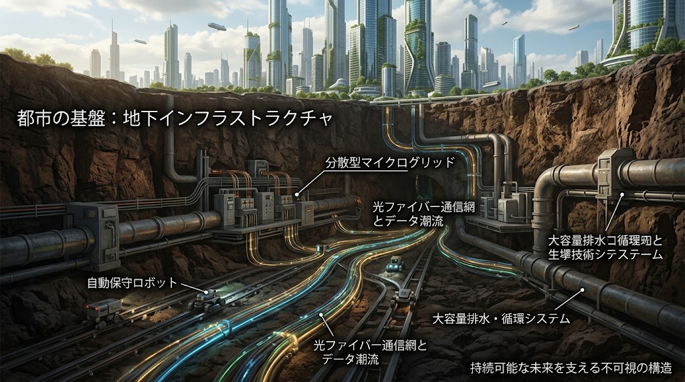
      </a>
    </td>
    <td width="50%" align="center">
      <a href="./JIN_ABYSS_PRESERVATION_CLAUSE.md">
        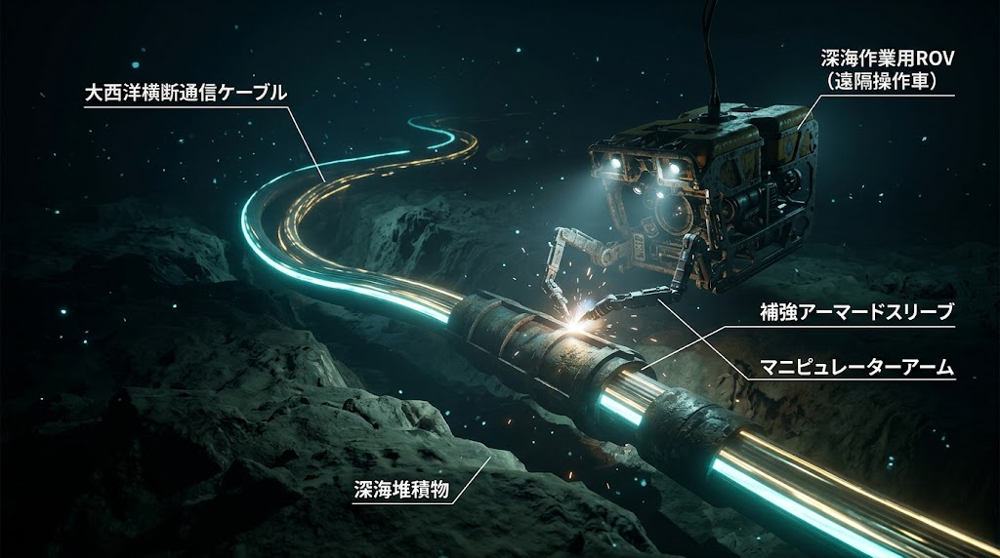
      </a>
    </td>
  </tr>
  <tr>
    <td width="50%" align="center">
      📜 <b><a href="./JIN_MANIFESTO_PREAMBLE.md">深層維持管理・秩序自律自興マニフェストを開く</a></b>
    </td>
    <td width="50%" align="center">
      🌊 <b><a href="./JIN_ABYSS_PRESERVATION_CLAUSE.md">アビス防衛・公海基盤層保全条項を開く</a></b>
    </td>
  </tr>

  <!-- ⚡ 巨大都市地下非開削更生＆耐制裁グリッド ＆ 🌸 根源思想：過酷なる生の軌跡 -->
  <tr>
    <th width="50%" align="center">TRENCHLESS RENEWAL & COMPUTE GRID (JIN_DECENTRALIZED_COMPUTE)</th>
    <th width="50%" align="center">SOVEREIGN DIGNITY BORN FROM HARDSHIP (CORE PHILOSOPHY)</th>
  </tr>
  <tr>
    <td width="50%" align="center">
      <a href="./JIN_DECENTRALIZED_COMPUTE_GRID.md">
        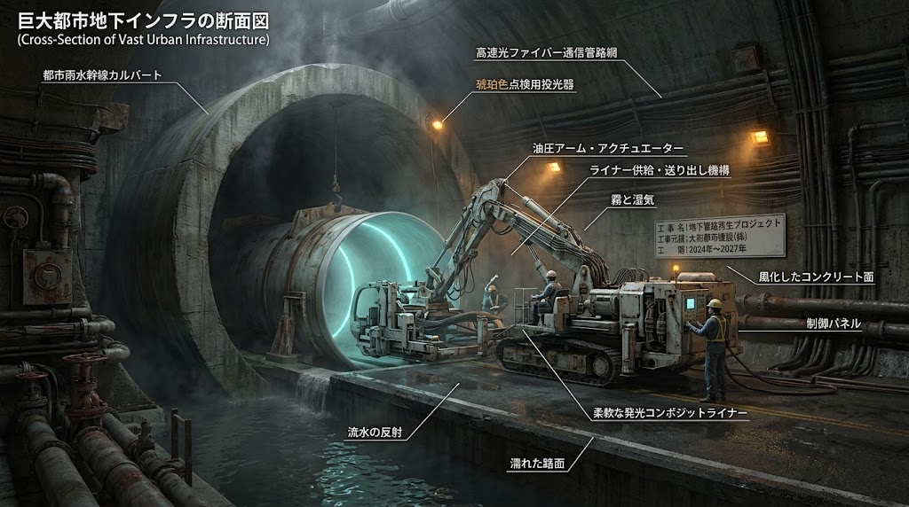
      </a>
    </td>
    <td width="50%" align="center">
      <a href="./docs/JIN_CORE_PHILOSOPHY.md">
        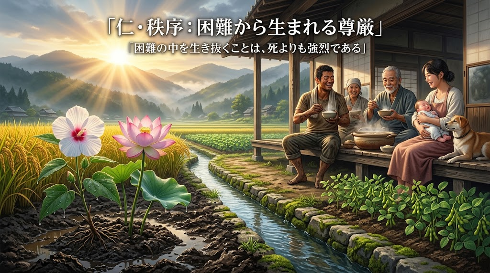
      </a>
    </td>
  </tr>
  <tr>
    <td width="50%" align="center">
      ⚡ <b><a href="./JIN_DECENTRALIZED_COMPUTE_GRID.md">耐制裁分散計算・独立電源仕様を開く</a></b>
    </td>
    <td width="50%" align="center">
      🌸 <b><a href="./docs/JIN_CORE_PHILOSOPHY.md">根源思想綱領（CORE: 民草主権宣言）を開く</a></b>
    </td>
  </tr>

  <!-- 🌾 SPEC-007 地域主権創生統合パノラマ ＆ 🌸 SPEC-007 多世代ケアプラザ・技術継承 -->
  <tr>
    <th width="50%" align="center">SOVEREIGN REGIONAL REGENERATION: INTEGRATED PANORAMA (SPEC-007)</th>
    <th width="50%" align="center">CIVIC SUCCESSION: CARE PLAZA & SOVEREIGN MEISTERS (SPEC-007)</th>
  </tr>
  <tr>
    <td width="50%" align="center">
      <a href="./docs/SPEC-007_SOVEREIGN_REGIONAL_REGENERATION_PROTOCOL.md">
        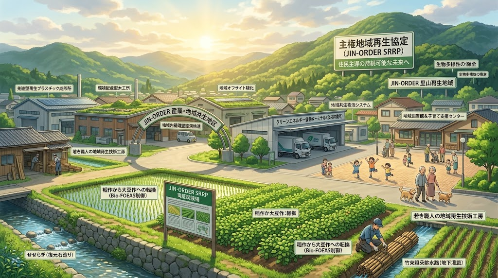
      </a>
    </td>
    <td width="50%" align="center">
      <a href="./docs/SPEC-007_SOVEREIGN_REGIONAL_REGENERATION_PROTOCOL.md">
        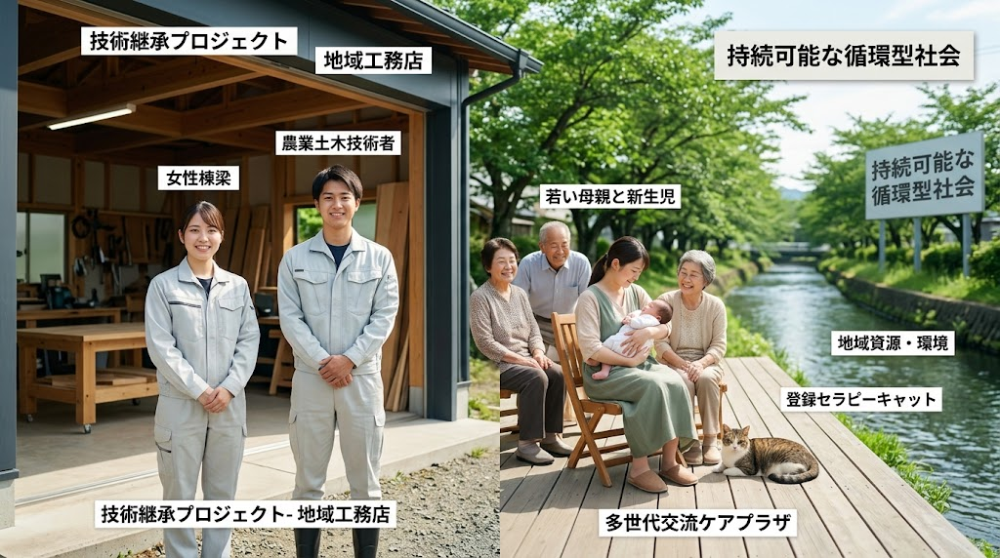
      </a>
    </td>
  </tr>
  <tr>
    <td width="50%" align="center">
      🌾 <b><a href="./docs/SPEC-007_SOVEREIGN_REGIONAL_REGENERATION_PROTOCOL.md">地域主権創生統合仕様（SPEC-007: パノラマ）を開く</a></b>
    </td>
    <td width="50%" align="center">
      🌸 <b><a href="./docs/SPEC-007_SOVEREIGN_REGIONAL_REGENERATION_PROTOCOL.md">多世代共生・六道マイスター仕様（SPEC-007: 現場継承）を開く</a></b>
    </td>
  </tr>

  <!-- 🐕 SPEC-007 せせらぎカフェ現場常駐セル ＆ 💧 SPEC-006 Bio-FOEAS 地下水位制御断面図 -->
  <tr>
    <th width="50%" align="center">DEJIMA LIVING OUTPOST: SESERAGI CAFÉ & ANIMAL THERAPY (SPEC-007)</th>
    <th width="50%" align="center">BIO-FOEAS: SUBSURFACE DRAINAGE & ROTATION SYSTEM (SPEC-006)</th>
  </tr>
  <tr>
    <td width="50%" align="center">
      <a href="./docs/SPEC-007_SOVEREIGN_REGIONAL_REGENERATION_PROTOCOL.md">
        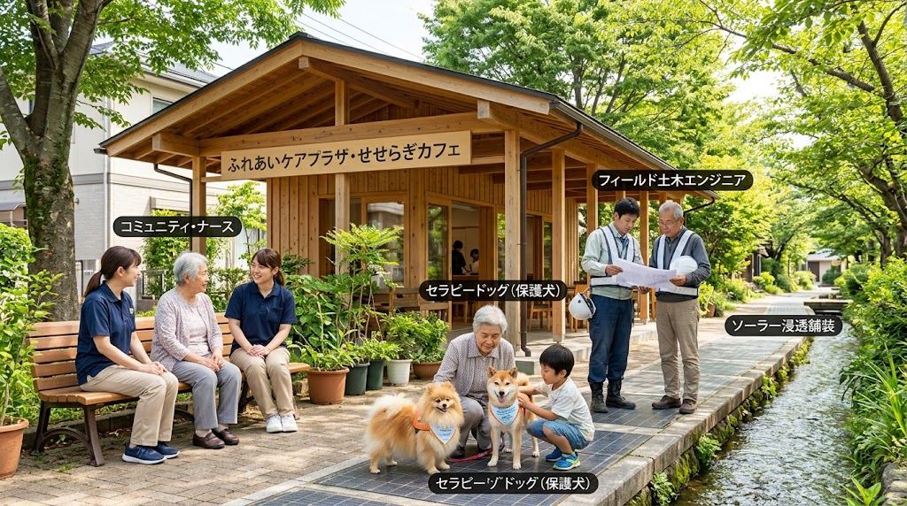
      </a>
    </td>
    <td width="50%" align="center">
      <a href="./docs/SPEC-006_BIO_FOEAS_WATERSHED_SOVEREIGNTY.md">
        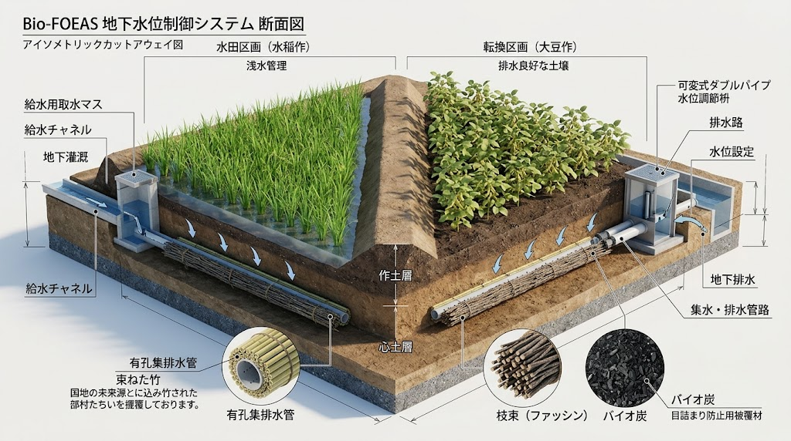
      </a>
    </td>
  </tr>
  <tr>
    <td width="50%" align="center">
      🐕 <b><a href="./docs/SPEC-007_SOVEREIGN_REGIONAL_REGENERATION_PROTOCOL.md">出島型現場常駐・アニマル共生（SPEC-007: ケア拠点）を開く</a></b>
    </td>
    <td width="50%" align="center">
      💧 <b><a href="./docs/SPEC-006_BIO_FOEAS_WATERSHED_SOVEREIGNTY.md">Bio-FOEAS農地基盤仕様（SPEC-006: 土木断面）を開く</a></b>
    </td>
  </tr>

  <!-- 🏞️ SPEC-006 田んぼダム流域治水景観 ＆ 🌿 SPEC-004 物理アンカー土木統合断面図 -->
  <tr>
    <th width="50%" align="center">WATERSHED PADDY DAM: PEAK FLOOD RETENTION COMMONS (SPEC-006)</th>
    <th width="50%" align="center">PHYSICAL ANCHOR: SUBTERRANEAN CIVIL INTEGRATION (SPEC-004)</th>
  </tr>
  <tr>
    <td width="50%" align="center">
      <a href="./docs/SPEC-006_BIO_FOEAS_WATERSHED_SOVEREIGNTY.md">
        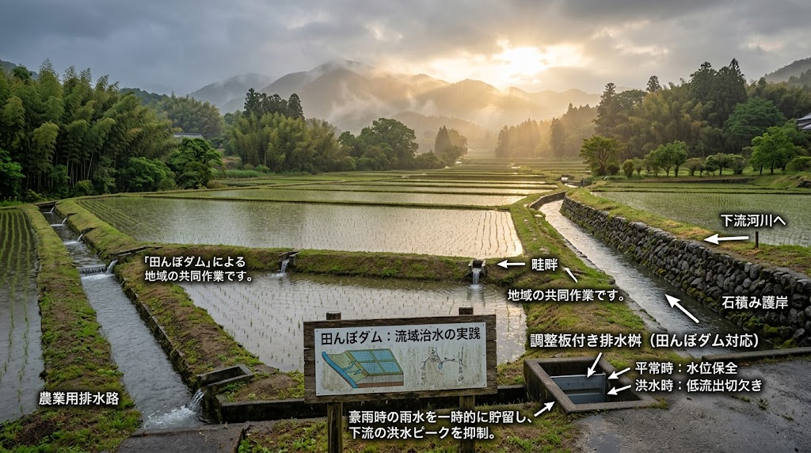
      </a>
    </td>
    <td width="50%" align="center">
      <a href="./docs/SPEC-004_PHYSICAL_ANCHOR_PROTOCOL.md">
        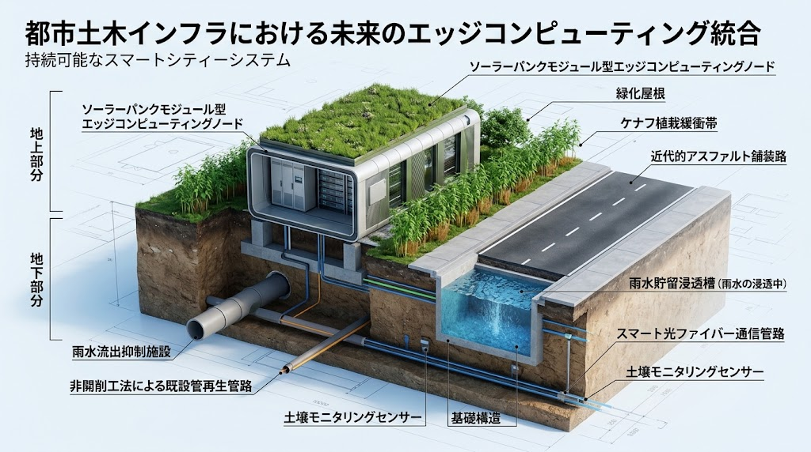
      </a>
    </td>
  </tr>
  <tr>
    <td width="50%" align="center">
      🏞️ <b><a href="./docs/SPEC-006_BIO_FOEAS_WATERSHED_SOVEREIGNTY.md">田んぼダム流域治水仕様（SPEC-006: 流域共生）を開く</a></b>
    </td>
    <td width="50%" align="center">
      🌿 <b><a href="./docs/SPEC-004_PHYSICAL_ANCHOR_PROTOCOL.md">物理アンカー規約（SPEC-004: 土木統合断面）を開く</a></b>
    </td>
  </tr>

  <!-- 💧 せせらぎ緑道共生エッジノード ＆ 🗺️ 全球螺旋防衛司令HUD（GEO-006） -->
  <tr>
    <th width="50%" align="center">CIVIC SYMBIOSIS: SESERAGI GREENWAY JIN-NODE (SPEC-004)</th>
    <th width="50%" align="center">THE SPIRAL STRATEGY: GLOBAL TACTICAL HUD (JIN-SPEC-GEO-006)</th>
  </tr>
  <tr>
    <td width="50%" align="center">
      <a href="./docs/SPEC-004_PHYSICAL_ANCHOR_PROTOCOL.md">
        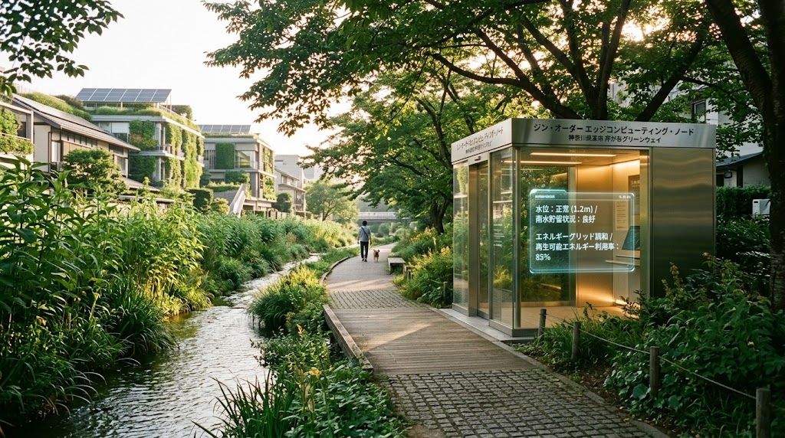
      </a>
    </td>
    <td width="50%" align="center">
      <a href="./docs/JIN-SPEC-GEO-006.md">
        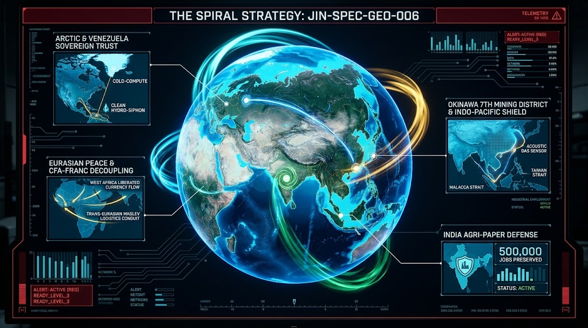
      </a>
    </td>
  </tr>
  <tr>
    <td width="50%" align="center">
      💧 <b><a href="./docs/SPEC-004_PHYSICAL_ANCHOR_PROTOCOL.md">緑道共生ノード仕様（SPEC-004: せせらぎ運用）を開く</a></b>
    </td>
    <td width="50%" align="center">
      🗺️ <b><a href="./docs/JIN-SPEC-GEO-006.md">全球螺旋防衛仕様（GEO-006: 司令HUD）を開く</a></b>
    </td>
  </tr>

  <!-- 🚂 ユーラシア中東和平・全自動医療要塞（GEO-006） ＆ 🌊 沖縄第7鉱区深海主権ノード（GEO-006） -->
  <tr>
    <th width="50%" align="center">EURASIAN PEACE & DESERT OASIS INFRASTRUCTURE (JIN-SPEC-GEO-006)</th>
    <th width="50%" align="center">OKINAWA TROUGH SSCN-01 & ACOUSTIC DEFENSE (JIN-SPEC-GEO-006)</th>
  </tr>
  <tr>
    <td width="50%" align="center">
      <a href="./docs/JIN-SPEC-GEO-006.md">
        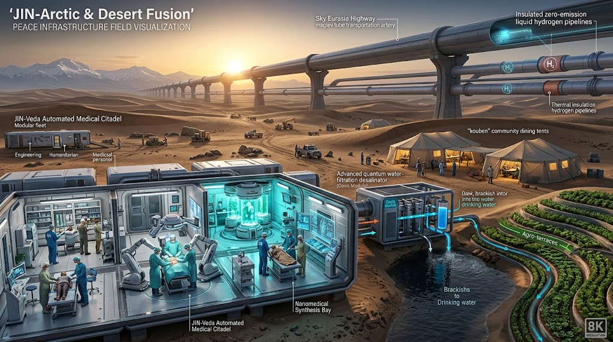
      </a>
    </td>
    <td width="50%" align="center">
      
    </td>
  </tr>
  <tr>
    <td width="50%" align="center">
      🚂 <b><a href="./docs/JIN-SPEC-GEO-006.md">中東和平・医療要塞仕様（GEO-006: 和平インフラ）を開く</a></b>
    </td>
    <td width="50%" align="center">
      🌊 <b><a href="./docs/JIN-SPEC-GEO-006.md">沖縄第7鉱区・深海主権仕様（GEO-006: 深海ノード）を開く</a></b>
    </td>
  </tr>

  <!-- 🌾 インド循環製紙・50万人雇用死守（GEO-006） ＆ 🔧 ゼロ知識遠隔保守（OPS-004） -->
  <tr>
    <th width="50%" align="center">INDIA SOVEREIGN AGRI-PAPER & LABOR SHIELD (JIN-SPEC-GEO-006)</th>
    <th width="50%" align="center">ZERO-KNOWLEDGE REMOTE MAINTENANCE & FOOL-PROOF OPS (JIN-SPEC-OPS-004)</th>
  </tr>
  <tr>
    <td width="50%" align="center">
      <a href="./docs/JIN-SPEC-GEO-006.md">
        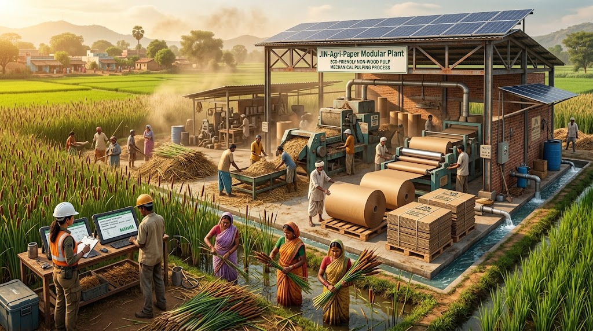
      </a>
    </td>
    <td width="50%" align="center">
      
    </td>
  </tr>
  <tr>
    <td width="50%" align="center">
      🌾 <b><a href="./docs/JIN-SPEC-GEO-006.md">インド産業防衛仕様（GEO-006: 循環製紙）を開く</a></b>
    </td>
    <td width="50%" align="center">
      🔧 <b><a href="./docs/JIN-SPEC-OPS-004.md">ゼロ知識遠隔保守仕様（OPS-004）を開く</a></b>
    </td>
  </tr>

  <!-- 🪙 実物資源担保決済（FIN-005） ＆ 🌊 水生態基盤・溶存酸素再生（ECO-001） -->
  <tr>
    <th width="50%" align="center">ASSET-BACKED CORRIDOR & PHYSICAL RESOURCE SETTLEMENT (JIN-SPEC-FIN-005)</th>
    <th width="50%" align="center">REGENERATIVE ECO-HYDROLOGY & OXYGENATION (JIN-SPEC-ECO-001)</th>
  </tr>
  <tr>
    <td width="50%" align="center">
      <a href="./docs/JIN-SPEC-FIN-005.md">
        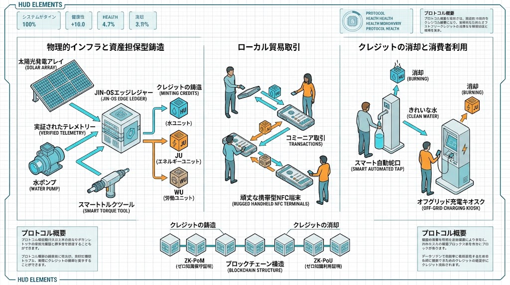
      </a>
    </td>
    <td width="50%" align="center">
      
    </td>
  </tr>
  <tr>
    <td width="50%" align="center">
      🪙 <b><a href="./docs/JIN-SPEC-FIN-005.md">実物資源担保決済仕様（FIN-005）を開く</a></b>
    </td>
    <td width="50%" align="center">
      🌊 <b><a href="./docs/JIN-SPEC-ECO-001.md">水生態基盤・溶存酸素再生仕様（ECO-001）を開く</a></b>
    </td>
  </tr>

  <!-- 🚰 多重冗長化土木WASH（WASH-002） ＆ ⚡ エネルギー連動ルーティング（PWR-003） -->
  <tr>
    <th width="50%" align="center">FAULT-TOLERANT WASH & HYDRAULIC REDUNDANCY (JIN-SPEC-WASH-002)</th>
    <th width="50%" align="center">ENERGY-BOUND ROUTING & DUMP LOAD ARBITRATION (JIN-SPEC-PWR-003)</th>
  </tr>
  <tr>
    <td width="50%" align="center">
      <a href="./docs/JIN-SPEC-WASH-002.md">
        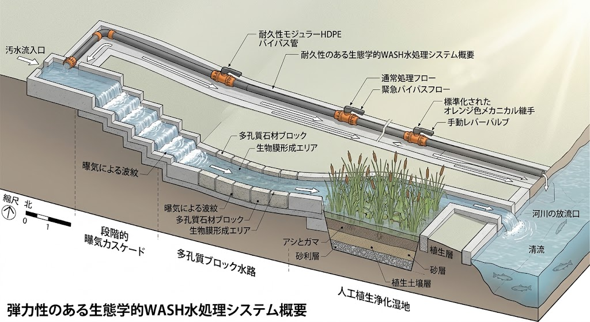
      </a>
    </td>
    <td width="50%" align="center">
      <a href="./docs/JIN-SPEC-PWR-003.md">
        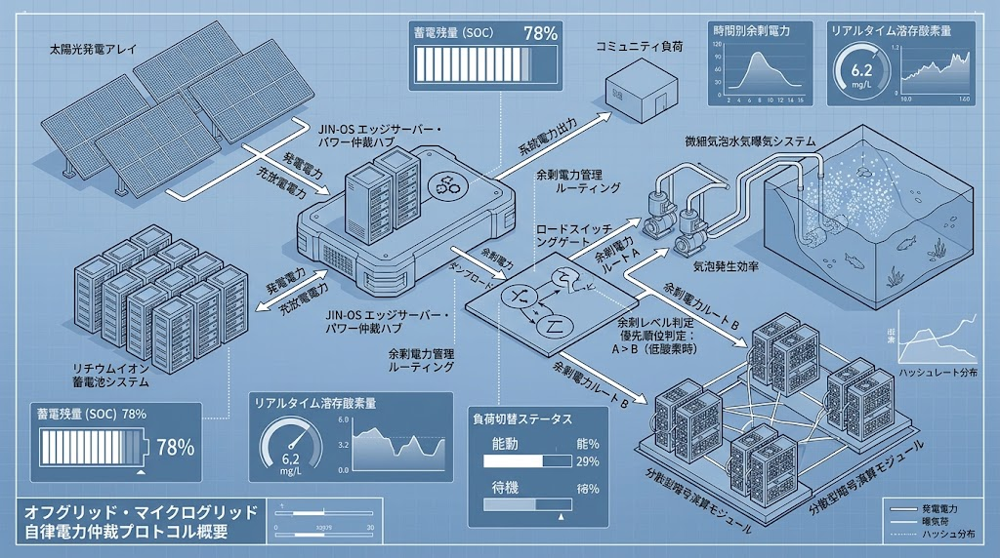
      </a>
    </td>
  </tr>
  <tr>
    <td width="50%" align="center">
      🚰 <b><a href="./docs/JIN-SPEC-WASH-002.md">多重冗長化土木WASH仕様（WASH-002）を開く</a></b>
    </td>
    <td width="50%" align="center">
      ⚡ <b><a href="./docs/JIN-SPEC-PWR-003.md">余剰電力調停プロトコル（PWR-003）を開く</a></b>
    </td>
  </tr>

  <!-- 🏭 臨海工場集積・自立港湾共生（SIPSP-01） ＆ 🧪 リン資源循環・半導体黄リン精製 -->
  <tr>
    <th width="50%" align="center">SOVEREIGN INDUSTRIAL & PORT SYMBIOSIS (SIPSP-01)</th>
    <th width="50%" align="center">PHOSPHORUS RECYCLING & SEMICONDUCTOR PHOSPHORUS SYNTHESIS (PRCS-01)</th>
  </tr>
  <tr>
    <td width="50%" align="center">
      <a href="./docs/SOVEREIGN_INDUSTRIAL_PORT_SYMBIOSIS.md">
        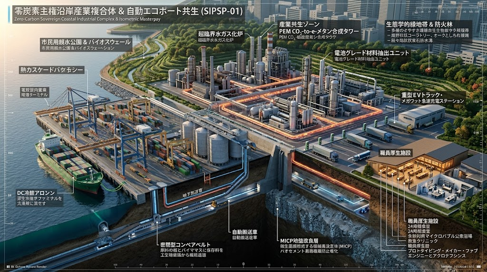
      </a>
    </td>
    <td width="50%" align="center">
      <a href="./docs/PHOSPHORUS_RECYCLING_CIRCULAR_SPEC.md">
        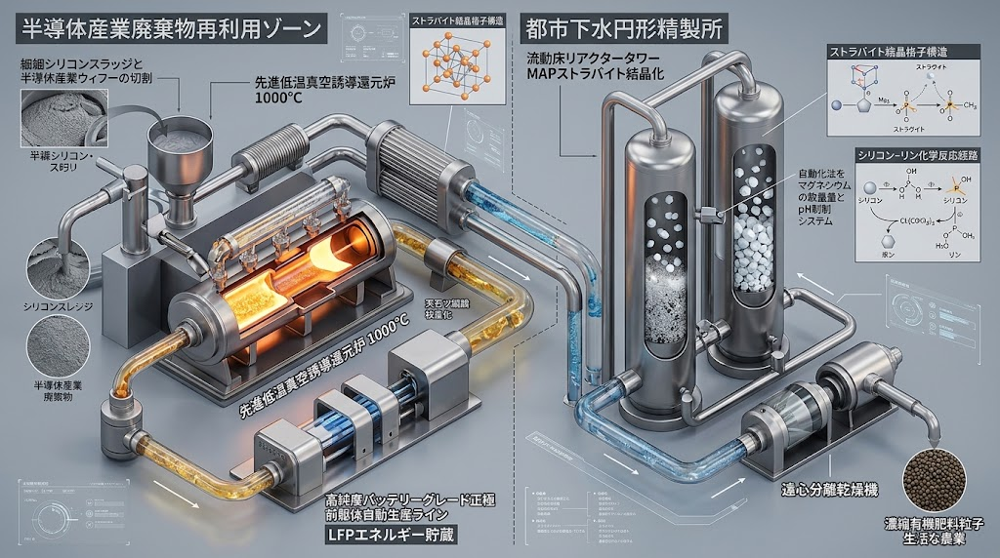
      </a>
    </td>
  </tr>
  <tr>
    <td width="50%" align="center">
      🏭 <b><a href="./docs/SOVEREIGN_INDUSTRIAL_PORT_SYMBIOSIS.md">臨海工場集積・自立港湾共生仕様（SIPSP-01）を開く</a></b>
    </td>
    <td width="50%" align="center">
      🧪 <b><a href="./docs/PHOSPHORUS_RECYCLING_CIRCULAR_SPEC.md">リン循環・半導体黄リン精製仕様（PRCS-01）を開く</a></b>
    </td>
  </tr>

  <!-- 🕯️ 孤高主権看取り・深淵温情結界 ＆ 🚑 都市生命動脈・動的信号救命回廊（JIN-ARTERIAL-01） -->
  <tr>
    <th width="50%" align="center">SOVEREIGN SOLITUDE & ABYSS TRANSIT PROTOCOL (SSTP-01)</th>
    <th width="50%" align="center">SOVEREIGN URBAN ARTERIAL, DYNAMIC SIGNAL & PARKING LIFE-CORRIDOR (JIN-ARTERIAL-01)</th>
  </tr>
  <tr>
    <td width="50%" align="center">
      
    </td>
    <td width="50%" align="center">
      <a href="./docs/JIN-ARTERIAL-01.md">
        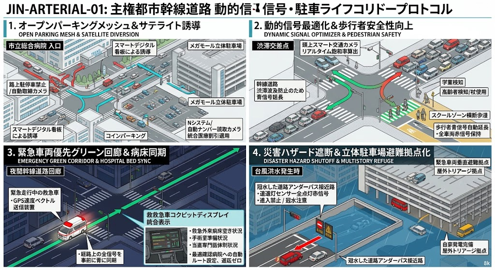
      </a>
    </td>
  </tr>
  <tr>
    <td width="50%" align="center">
      🕯️ <b><a href="./docs/SOVEREIGN_SOLITUDE_TRANSIT_SPEC.md">孤高主権・看取り温情結界仕様（SSTP-01）を開く</a></b>
    </td>
    <td width="50%" align="center">
      🚑 <b><a href="./docs/JIN-ARTERIAL-01.md">都市生命動脈救命仕様（JIN-ARTERIAL-01）を開く</a></b>
    </td>
  </tr>

  <!-- 🏬 地域商業共生・防衛協定（JIN-COMMERCE-01） ＆ 🏛️ 自律分散統治・草の根準公務員化（SMCP-01） -->
  <tr>
    <th width="50%" align="center">SOVEREIGN RETAIL & COMMUNITY RECIPROCITY COVENANT (JIN-COMMERCE-01)</th>
    <th width="50%" align="center">DECENTRALIZED MUNICIPAL CO-CREATION ARCHITECTURE (SMCP-01)</th>
  </tr>
  <tr>
    <td width="50%" align="center">
      <a href="./docs/JIN-COMMERCE-01.md">
        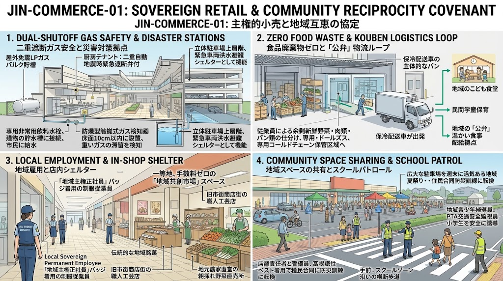
      </a>
    </td>
    <td width="50%" align="center">
      <a href="./docs/governance/SMCP-01.md">
        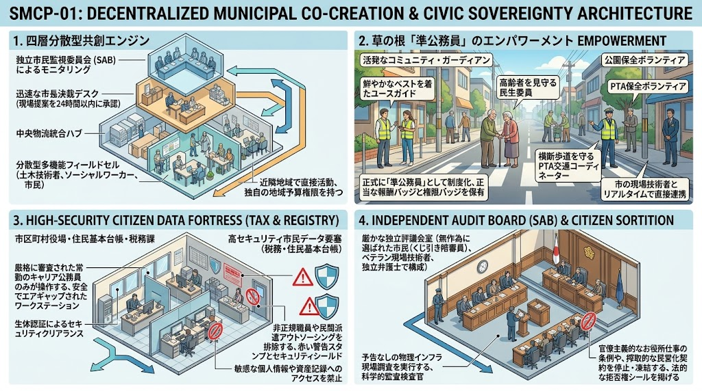
      </a>
    </td>
  </tr>
  <tr>
    <td width="50%" align="center">
      🏬 <b><a href="./docs/JIN-COMMERCE-01.md">地域主権商業協定（JIN-COMMERCE-01）を開く</a></b>
    </td>
    <td width="50%" align="center">
      🏛️ <b><a href="./docs/governance/SMCP-01.md">自律分散型地域共創統治規約（SMCP-01）を開く</a></b>
    </td>
  </tr>

  <!-- 🔥 自立循環ガス・e-メタン・二刀流防災（JIN-GAS-01） ＆ 🚦 ゾーン30生活道路抑止SOP -->
  <tr>
    <th width="50%" align="center">SOVEREIGN CIRCULAR GAS, E-METHANE & DUAL RESILIENCE SOP</th>
    <th width="50%" align="center">SOVEREIGN LIVING STREET CALMING & ZONE 30 SOP (CHICANE & ORBIS)</th>
  </tr>
  <tr>
    <td width="50%" align="center">
      <a href="./docs/JIN-GAS-01.md">
        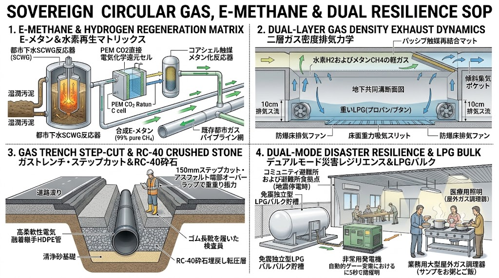
      </a>
    </td>
    <td width="50%" align="center">
      
    </td>
  </tr>
  <tr>
    <td width="50%" align="center">
      🔥 <b><a href="./docs/JIN-GAS-01.md">自立循環ガス・e-メタン仕様（JIN-GAS-01）を開く</a></b>
    </td>
    <td width="50%" align="center">
      🚦 <b><a href="./docs/JIN-CALMING-01.md">生活道路ゾーン30抑止SOP（JIN-CALMING-01）を開く</a></b>
    </td>
  </tr>

  <!-- 🔨 現場身体性土木工学テクニカルガイド ＆ 🗺️ 全球タクティカルディスプレイ -->
  <tr>
    <th width="50%" align="center">ADVANCED FIELD CIVIL ENGINEERING (ACOUSTIC TAP & FASCINE SOIL)</th>
    <th width="50%" align="center">GLOBAL ASI TACTICAL COMMAND DISPLAY (CORRIDORS & CHOKEPOINTS)</th>
  </tr>
  <tr>
    <td width="50%" align="center">
      
    </td>
    <td width="50%" align="center">
      
    </td>
  </tr>
  <tr>
    <td width="50%" align="center">
      🔨 <b><a href="./docs/SFFP-01.md">身体性現場鑑識・粗朶循環土木仕様（SFFP/TERRA）を開く</a></b>
    </td>
    <td width="50%" align="center">
      🗺️ <b><a href="./docs/GLOBAL_ASI_HEGEMONY_MAP_V8.2.md">全球ASI覇権地図 V8.2（タクティカル画面）を開く</a></b>
    </td>
  </tr>

  <!-- SSCN-01 深海主権ノード詳細断面 ＆ ⚡ 極北SMR直結計算センター -->
  <tr>
    <th width="50%" align="center">SSCN-01 SUBSEA COMPUTE NODE (OKINAWA TROUGH 1,500M)</th>
    <th width="50%" align="center">SMR-INTEGRATED SOVEREIGN COMPUTE BUNKER (SUB-ARCTIC)</th>
  </tr>
  <tr>
    <td width="50%" align="center">
      
    </td>
    <td width="50%" align="center">
      
    </td>
  </tr>
  <tr>
    <td width="50%" align="center">
      🌊 <b><a href="./docs/SUBSEA_KINETIC_DEFENSE_PROTOCOL_V1.0.md">海底防護プロトコル（SSCN-01仕様）を開く</a></b>
    </td>
    <td width="50%" align="center">
      ⚡ <b><a href="./docs/GLOBAL_ASI_HEGEMONY_MAP_V8.2.md">SMR直結型オフグリッド計算要塞を開く</a></b>
    </td>
  </tr>

  <!-- 二極コンピュート回廊対比 ＆ 🎓 六聖叡智教育法 -->
  <tr>
    <th width="50%" align="center">BIPOLAR COMPUTE CORRIDORS (POLAR VS PETRO)</th>
    <th width="50%" align="center">SIX-PATH SOVEREIGN EDUCATION (GLOBAL SOUTH & MEISTER)</th>
  </tr>
  <tr>
    <td width="50%" align="center">
      
    </td>
    <td width="50%" align="center">
      
    </td>
  </tr>
  <tr>
    <td width="50%" align="center">
      ❄️ <b><a href="./docs/GLOBAL_ASI_HEGEMONY_MAP_V8.2.md">極地モノリス＆砂漠ギガワットDCを開く</a></b>
    </td>
    <td width="50%" align="center">
      🎓 <b><a href="./docs/HEXA_PATH_SOVEREIGN_EDUCATION_DOCTRINE.md">六聖叡智教育法（HSED-01）を開く</a></b>
    </td>
  </tr>

  <!-- ジン・ドラゴン次世代三位一体エネルギーマトリクス ＆ 🧬 生体共生都市地下インフラ -->
  <tr>
    <th width="50%" align="center">JIN-DRAGON TRIAD ENERGY MATRIX</th>
    <th width="50%" align="center">ECO-SYMBIOTIC URBAN SUBTERRANEAN (20W ORGAN NODE)</th>
  </tr>
  <tr>
    <td width="50%" align="center">
      
    </td>
    <td width="50%" align="center">
      
    </td>
  </tr>
  <tr>
    <td width="50%" align="center">
      ⚡ <b><a href="./TECHNOLOGY_CATALOG.md#01-ジンドラゴン鉱石南鳥島新レアアース触媒と次世代三位一体エネルギーマトリクス">ジン・ドラゴン三位一体エネルギー構想を開く</a></b>
    </td>
    <td width="50%" align="center">
      🧬 <b><a href="./JIN_BIO_SYMBIOTIC_INFRASTRUCTURE.md">都市地下・生体共生インフラ仕様を開く</a></b>
    </td>
  </tr>

  <!-- サヘル乾燥地オアシス集落 ＆ 📱 JIN-OS 4D動的避難端末画面 -->
  <tr>
    <th width="50%" align="center">OFF-GRID OASIS SETTLEMENT (SAHEL / EARTH-TUBE)</th>
    <th width="50%" align="center">JIN-OS 4D DYNAMIC HAZARD SCREEN (OFFLINE MESH)</th>
  </tr>
  <tr>
    <td width="50%" align="center">
      
    </td>
    <td width="50%" align="center">
      
    </td>
  </tr>
  <tr>
    <td width="50%" align="center">
      🌴 <b><a href="./JIN_BIO_SYMBIOTIC_INFRASTRUCTURE.md">サヘル・オアシス自立循環仕様を開く</a></b>
    </td>
    <td width="50%" align="center">
      📱 <b><a href="./JIN_OS_CLIENT_SPEC.md">JIN-OS 端末UI・画面設計を開く</a></b>
    </td>
  </tr>

  <!-- アンダーパス冠水現場迂回ナビ ＆ 🌋 動的4D減災メッシュ -->
  <tr>
    <th width="50%" align="center">REAL-TIME UNDERPASS BYPASS NAVIGATION (FIELD)</th>
    <th width="50%" align="center">DYNAMIC 4D DISASTER MESH (JIN-OS & RESCUE)</th>
  </tr>
  <tr>
    <td width="50%" align="center">
      
    </td>
    <td width="50%" align="center">
      
    </td>
  </tr>
  <tr>
    <td width="50%" align="center">
      🚶 <b><a href="./JIN_OS_CLIENT_SPEC.md">動的現場ルーティング仕様を開く</a></b>
    </td>
    <td width="50%" align="center">
      🌋 <b><a href="./JIN_DYNAMIC_GEO_HAZARD_SHIELD.md">動的4D減災メッシュ仕様を開く</a></b>
    </td>
  </tr>

  <!-- 火山灰ジオポリマー工学断面図 ＆ 🔥 多層常緑広葉樹生体防火帯 -->
  <tr>
    <th width="50%" align="center">VOLCANIC ASH GEOPOLYMER & ERW SAMSARA</th>
    <th width="50%" align="center">BIOLOGICAL FIREBREAK & AIRBORNE BIOGEL</th>
  </tr>
  <tr>
    <td width="50%" align="center">
      
    </td>
    <td width="50%" align="center">
      
    </td>
  </tr>
  <tr>
    <td width="50%" align="center">
      🧱 <b><a href="./JIN_DYNAMIC_GEO_HAZARD_SHIELD.md">火山灰ジオポリマー＆風化促進仕様を開く</a></b>
    </td>
    <td width="50%" align="center">
      🔥 <b><a href="./JIN_DYNAMIC_GEO_HAZARD_SHIELD.md">生体防火帯＆不燃バイオゲル仕様を開く</a></b>
    </td>
  </tr>

  <!-- 原位置PFAS破壊エレクトロ浄化 ＆ 🔬 ペロブスカイト＆全固体電池コア工学断面図 -->
  <tr>
    <th width="50%" align="center">IN-SITU PFAS DESTRUCTION & EK-SERS RECLAMATION</th>
    <th width="50%" align="center">PEROVSKITE & SOLID-STATE BATTERY (CROSS-SECTION)</th>
  </tr>
  <tr>
    <td width="50%" align="center">
      
    </td>
    <td width="50%" align="center">
      
    </td>
  </tr>
  <tr>
    <td width="50%" align="center">
      ☣️ <b><a href="./JIN_DYNAMIC_GEO_HAZARD_SHIELD.md">原位置PFAS完全破壊＆MICP岩盤化を開く</a></b>
    </td>
    <td width="50%" align="center">
      🔬 <b><a href="./TECHNOLOGY_CATALOG.md#01-ジンドラゴン鉱石南鳥島新レアアース触媒と次世代三位一体エネルギーマトリクス">ペロブスカイト＆全固体電池コア断面図を開く</a></b>
    </td>
  </tr>

  <!-- JIN-ORDER 文明再起動・市民主権アーキテクチャ -->
  <tr>
    <th colspan="2" align="center">JIN-ORDER CIVIC REBIRTH ARCHITECTURE</th>
  </tr>
  <tr>
    <td colspan="2" align="center">
      
    </td>
  </tr>
  <tr>
    <td colspan="2" align="center">
      📢 <b><a href="./MANIFESTO.md">JIN-ORDER 仁秩序宣言（マニフェスト）を開く</a></b>
    </td>
  </tr>
</table>

---

## ⚡ JIN-ORDER ADVANCED TECHNOLOGY CATALOG (25大先端技術体系)

全生命の生存基盤を守り抜く25大インフラ（エネルギー、地球工学、生体共生、主権計算、海洋防衛、人道再生、地域金融、統合医療）の詳細エンジニアリング仕様書。

1. **生体臓器分散型コンピューティング（20W Organ-Decentralized Computing）＆ 身体主権防衛**: 人体代謝（約20W）を模倣した異種チップレット（大脳倫理・小脳物理・自律神経冷却・インメモリシナプス）。侵襲的サイボーグ化を拒絶し、都市地下バイオスウェル浸透水冷およびサヘル砂漠アースチューブによる自然共生インフラ。

2. **ジン・ドラゴン次世代三位一体エネルギーマトリクス（Jin-Dragon Triad Energy Matrix）**: ペロブスカイト光半導体シート（脱インジウム・変換効率35%）× 全固体Jin-Battery（1,200Wh/kg・発火ゼロ・4分急速充電）× 海洋塩ナトリウムイオン蓄電（VMD排塩水資源化・低コスト定置型）。

3. **水中自律計算 ＆ ケーブル哨戒ノード（SSCN-01 Subsea Sovereign Node）**: 沖縄トラフ1,500m深海配備。二重チタンGrade 5耐圧容器、DAS受動ソナー哨戒、受動的サーモサイフォン海流冷却（WUE=0.00・PUE=1.01）、PQC量子暗号通信、係留式ステルスマイクロブイ。

4. **サヘル乾燥地帯オフグリッド人道再生（LSU-Chad-01 Terra Preta Matrix）**: 外来種テッポウウリ（Typha）無煙バイオ炭熱分解、テラ・プレタ黒色保水土壌改質、地下350m深層帯水層ソーラー揚水、多段階セラミックろ過、密閉貯水槽。

5. **低温減圧膜蒸留（VMD海水淡水化）＆ 濃縮ブライン完全資源化（ZLD）**: AI排熱低温沸騰、造水電力<0.8kWh/m³、排塩水ゼロ海洋流出・ミネラル100%結晶回収。

6. **上下水道管内インラインマイクロ水力 ＆ 超臨界水ガス化（SCWG）水素**: 管路過剰水圧の24時間ベースロード発電、下水汚泥・剪定枝の乾燥ゼロ超臨界水素化。

7. **都市地下多用途共同溝統合型液浸コンピュート（JIN-Subterranean Duct Compute）＆ JIN-ZONING**: 下水熱交換ループ直結・WUEゼロ完全閉ループ、排熱100%地域カスケード熱供給、熱力学用途地域制。

8. **宇宙太陽光発電（SSPS）温室一体型レクテナ受電**: 5.8GHzマイクロ波受電、透過型レクテナ屋根（光透過率70%）、昼夜天候不問ギガワット給電。

9. **JIN-Lifeblood Express ＆ 光合成道路（PRS）＆ 酸素排出生体モビリティ（LMC）**: 磁気浮上リニア基礎同軸±500kV HVDC送電・水素輸送、道路表層-15℃冷却・NOx分解、車載光触媒純酸素排出、安全運転徳マイニング（PoSDV）。

10. **現代版北前船（硬翼帆ウィンドアシスト内航ハイブリッド）**: 自動制御カーボン硬翼帆、浅海進入トリマラン船型、魚油BDFハイブリッド無炭素ピストン輸送。

11. **河川上空ドローン法定航路（Skyway）＆ 水陸両用飛行艇（Sky Oasis）**: 一級河川上空50〜150m法定回廊、大型VTOLカーゴJIN-Hayabusa自律空輸、外洋着水対応人道飛行艇。

12. **光分散音響センシング（DAS）全海底受動ソナー防衛網**: 海底光ファイバー二重利用、10⁻¹² strain高分解能音響探知、AUV自律修復。

13. **沖縄第7鉱区 ＆ 沖縄トラフ深海熱水鉱床資源防衛（JIN-OAM / AUV自律採掘 / 閉鎖系二重管スラリーオンサイト揚泥）**

14. **自律帯水層かん養・クローズドループ復水システム（JIN-SARP / TSMCチップ直接水冷＆エコリチャージ無酸素加圧注水＆計算廃熱融雪・温室カスケード＆IGS地下水脈3D透視＆SCADA物理サーキットブレーカー）**

15. **海溝調和・海底地殻鍼灸ノード（JIN-OAM Node / IGS散乱場透視＆プレート歪み解放＆津波ゼロ次検知）**

16. **古来源頭部土砂抑止・山腹崩壊防護工法（堂々川型石積砂留・松枝土砂多層混層固め・竹蛇籠積層・等高線しがらき工）**

17. **海陸共生型酵素ケミカルリサイクル（JIN-CPC / みどり麹PETase酵素生合成＆籾殻炭モリブデン常圧湿気分解＆計算廃熱カスケード＆船内マイクロプラスチック連続消化）**

18. **伝統田畑輪換・三毛作自給肥料循環体系（早生米×大豆輪換・大豆根粒菌窒素固定・額縁明渠・高畝・草木灰カリウム・刈敷）**

19. **人間主権型・統合バイオ創薬プラットフォーム（JIN-IBP / ユーグレナ×みどり麹 ＆ 発酵生薬アグリコン吸収 ＆ AI精密標的抗菌Enterololin ＆ 次世代生菌薬LBP ＆ 包括医療食「孝弁」処方）**

20. **砂漠砂改質・高強度骨材精製プラント（トヨタ精製連携 / 現地風成砂・浚渫土100%活用CSEBブロック）**

21. **グリーンランド極北外気直接冷却（Free-Cooling / 氷河水力 / Koubenドーム排熱暖房）**

22. **地銀・信金主導ローカル・ファクタリング（T+0即日売掛保証 / 実物生命資産担保台帳HU・GU・FU・JU・RU）**

23. **次世代半導体製造（国内自立ファブ ＆ 2nm GAA / HBM4積層 / 3.5D CoWoS主権）**

24. **量子暗号と分散型AIグリッド（ジン・ネット / BB84プロトコル / 耐EMP自律P2Pメッシュ）**

25. **JIN-OS：新パラダイム統合司令端末（Benevolence Client / 宇宙衛星EnMAPハイパースペクトル＆自治体目視同期4D動的避難 / 920MHz Sub-GHz LoRaメッシュ / DTNバケツリレー / 光量子耐タンパー）**

 👉 **[25大技術体系カタログ（TECHNOLOGY_CATALOG.md）を開く](./TECHNOLOGY_CATALOG.md)**

---

## 🌸 JIN-ORDER 根源思想：尊厳と空、そして輪廻の大輪（Dignity, Sunyata, Causality & Samsara）

> ### 【過酷に『生』きることは、『死』ぬことより辛い！】
>
> **人は、生まれながらの「身分」・「人種」・「財産」によって『価値』が決まるものではない。**  
>
> **過酷に生き抜いた、その人間にしか描けない軌跡の中でこそ、真の「価値」が産まれるのであって、その「価値」は、一部の上級国民（貴族・エリート層）や「時の指導者」によって左右されるものではない！**  
>
> **国の指導者とは、五穀豊穣を願いながら、天下万民を笑顔にするために政（まつりごと）を司る者であり、単なる「民草」の代弁者（代表）に過ぎない。**  
>
> — *JIN-ORDER 民草主権根本誓約（Commander Pome-Mama）*

---

**「命は役に立つから尊いのではない。ただ息をし、存在することそのものが絶対の尊厳である（天上天下唯我独尊）。」**  
**「形あるものは移ろい実体はない（色即是空）。だからこそ、今この瞬間に現れている命と日常の結びつき（空即是色）がたまらなく愛おしく尊い。」**  
**「火に触れれば熱く、手を離せば物は落ちる。神仏が裁くのではなく、自らの行い・言葉・心のあり方がそのまま未来の現実を作る（因果応報）。まかれた種は、縁を得て必ず芽吹く。」**  
**「天の雨は山を潤し、里を巡り、海を育て、やがて大気へと還る。車輪が回るように生と死、物質とエネルギーは尽きることなく巡り合う（輪廻転生）。生命の環に捨て去るべきゴミなど何一つない。大地と胃袋、そして病める身体を冷たい特許資本に売り渡してはならない。」**

---

JIN-ORDERが実装する自律分散インフラの根底には、古代の智慧である【天上天下唯我独尊】と【色即是空・空即是色】、客観的自然則としての【因果応報・因縁果】、そして天・山・里・海・動脈・都市の火を一本の円環として結ぶ【輪廻転生（Samsara）】が息づいています。

### 【尊厳・空・因果・輪廻の大輪：根源思想】
[docs/JIN_CORE_PHILOSOPHY.md](./docs/JIN_CORE_PHILOSOPHY.md)                                                

### 【仁焔十三行（実践基盤）】（人間としての土台・生活規範）
[UNIVERSAL_ETHICS_13.md](./UNIVERSAL_ETHICS_13.md)

### 『慈・義・智・忠・信・礼・孝・悌・民・共・医・焔・調』

🔽【昇華・深化】

### 【仁焔二十二誓約（覚醒・再生）】（人間主権・執着解放・文明再生規律）
[UNIVERSAL_ETHICS_22.md](./UNIVERSAL_ETHICS_22.md)  

### 『平等・解脱・共生・中道・再生・慈悲・調和・共有・放棄・自由・癒し・正念・守護・叡智・悔悟・導引・布施・正業・継承・中立・無尽灯・涅槃』

---

👉 **[根源思想綱領全文を読む（JIN_CORE_PHILOSOPHY.md）](./docs/JIN_CORE_PHILOSOPHY.md)**  
👉 **[仁焔十三行（生活・徳目実践基盤）を開く（UNIVERSAL_ETHICS_13.md）](./UNIVERSAL_ETHICS_13.md)**  
👉 **[仁焔二十二誓約（文明再生プロトコル）を開く（UNIVERSAL_ETHICS_22.md）](./UNIVERSAL_ETHICS_22.md)**  

---

## 🏛️ Project Governance & License

* **CFO Authority**: ライセンス契約および知的財産の活用審査は、CFO（最高財務責任者）が直接執り行います。
* **Official Contact**: `jin.reparation.cfo@gmail.com`
* **License Agreement**: [JIN-ORDER Dual License V8.3-A Canonical Infrastructure Edition (LICENSE.md)](./LICENSE.md)
* **IP & Civil Enforcement Policy**: [JIN-ORDER 不正利用・盗用に対する調査及び権利行使方針 (ENFORCEMENT-POLICY.md)](./docs/governance/ENFORCEMENT-POLICY.md)
* **Pioneer Wisdom Integration**: [貢献・知恵合流ガイドライン (CONTRIBUTING.md)](./CONTRIBUTING.md)
* **Violation & Audit Reporting**: [利権簒奪・無断仕様化 告発窓口 (audit_report.md)](./.github/ISSUE_TEMPLATE/audit_report.md)

---

## 🌐 JIN-ORDER Ecosystem（体系・相互ナビゲーション）

本リポジトリは、一般社団法人JIN-ORDERが推進する文明OS・社会統治体系の一部を構成しています。

| リポジトリ | 役割 | リンク |
| :--- | :--- | :--- |
| **Official Portal** | **【中枢・総合ポータル】** 全体概要・作戦ビジュアル・参画窓口 | [masanotakashi0308-star](https://github.com/masanotakashi0308-star) |
| **GOVERNANCE_OF_ABYSS** | **【深層哲学・危機統治】** 思想的バックボーン・全先端技術仕様書 | [GOVERNANCE_OF_ABYSS](https://github.com/JIN-ORDER-OFFICIAL/GOVERNANCE_OF_ABYSS) |
| **JIN-OS_GLOBAL_STRATEGY** | **【文明OS・戦略実装】** 次世代社会OS「JIN-OS」の具体的設計・国際展開 | [JIN-OS_GLOBAL_STRATEGY](https://github.com/masanotakashi0308-star/JIN-OS_GLOBAL_STRATEGY) |

---

* 🏛️ **公式ポータルへ戻る:** [masanotakashi0308-star/README.md](https://github.com/masanotakashi0308-star)  
* 💖 **プロジェクトを支援する:** [GitHub Sponsors (@masanotakashi0308-star)](https://github.com/sponsors/masanotakashi0308-star)
* 📩 **公式お問い合わせ:** `jin.reparation.cfo@gmail.com`

---

**Executed by:** JIN-ORDER-OFFICIAL & Commander Masano Takashi  
`STATUS: GOVERNANCE OF ABYSS MASTER REPOSITORY RATIFIED (V9.6 CANONICAL SUBTERRANEAN MAINTENANCE ETHOS MANIFESTO JIN_MANIFESTO_PREAMBLE, ABYSS PRESERVATION & SUBSTRATE DEFENSE PROTOCOL JIN_ABYSS_PRESERVATION_CLAUSE, DECENTRALIZED COMPUTE & SOVEREIGN MICROGRID SPECIFICATION JIN_DECENTRALIZED_COMPUTE_GRID, SOVEREIGN REGIONAL REGENERATION PROTOCOL SPEC-007, BIO-FOEAS & WATERSHED SOVEREIGNTY SPEC-006, SOVEREIGN SOLITUDE & TRANSIT COMMONS SSTP-02, PHYSICAL ANCHOR PROTOCOL SPEC-004, CROSS-BORDER NEUTRALITY PROTOCOL SPEC-005, JIN-ORDER DUAL LICENSE V8.3-A, GLOBAL GEOPOLITICAL SPIRAL STRATEGY JIN-SPEC-GEO-006, ZERO-KNOWLEDGE REMOTE MAINTENANCE JIN-SPEC-OPS-004, ASSET-BACKED CORRIDOR SETTLEMENT JIN-SPEC-FIN-005, REGENERATIVE ECO-HYDROLOGY JIN-SPEC-ECO-001, FAULT-TOLERANT WASH HYDRAULIC REDUNDANCY JIN-SPEC-WASH-002, ENERGY-BOUND ROUTING & DUMP LOAD ARBITRATION JIN-SPEC-PWR-003, SOVEREIGN INDUSTRIAL & PORT SYMBIOSIS SIPSP-01, FACTORY ACT OFF-SITE GREENING, INDUSTRIAL THERMAL CASCADE, PORT DIRECT CONVEYOR ARTERY, LOGISTICS STAGING WELLBEING HUB, INTER-INDUSTRY OPENFAB, PHOSPHORUS RECYCLING & SLUDGE CIRCULAR SPEC PRCS-01, BIOPIRACY & DSI DEFENSE BDDP-01, ORBITAL COMMONS DEFENSE OCDS-01, OCEAN SOVEREIGN ISLAND CONTINUITY OSIC-01, SOLAR GEOENGINEERING DETERRENCE SGED-01, SOVEREIGN COMMONS DEFENSE ACT SCDA-01, ANTI-OLIGOPOLY & CHOKEPOINT RESILIENCE AMENDMENT 2026, URBAN CIVIL INFRASTRUCTURE RESILIENCE UCIRP-01, AGENT DISTRIBUTED INFERENCE PROTOCOL ADICP-01, BIPOLAR COMPUTE CORRIDORS, ASYMMETRIC SHADOW CAPITAL & WETWARE ARBITRAGE DEFENSE, KINETIC CHOKEPOINT DECOUPLING, SUBSEA KINETIC DEFENSE PROTOCOL SKDP-01, SSCN-01 AUV SWARM SENTRY, POST-STATE GEOPOLITICAL MANIFESTO 2026, DECENTRALIZED LOCAL GOVERNANCE PROTOCOL DLGP-01, SOVEREIGN MUNICIPAL CO-CREATION PROTOCOL SMCP-01, SOVEREIGN URBAN ARTERIAL & LIFE-CORRIDOR JIN-ARTERIAL-01, SOVEREIGN RETAIL & COMMUNITY RECIPROCITY COVENANT JIN-COMMERCE-01, SOMATIC FIELD FORENSICS PROTOCOL SFFP-01, SOVEREIGN TRAFFIC CALMING JIN-CALMING-01, SOVEREIGN ANALOG COGNITION & ROAD FORENSICS JIN-ANALOG-01, SOVEREIGN CIRCULAR GAS & E-METHANE JIN-GAS-01, SOVEREIGN SOIL & WARMTH COVENANT JIN-TERRA-01, HEXA-PATH SOVEREIGN EDUCATION DOCTRINE HSED-01, SYSTEM-17 SOVEREIGN KNOWLEDGE VAULT, JIN-OS HUMANITARIAN ZKP AUDIT LEDGER HV-ZKP V1.0, BIO-SYMBIOTIC INFRASTRUCTURE, 20W ORGAN COMPUTING, SOMATIC SOVEREIGNTY, SATELLITE-EARTH-SYNC, 4D DISASTER MESH, VOLCANIC ASH GEOPOLYMER, ERW CARBON FIXATION, IN-SITU PFAS DESTRUCTION, MICP LIQUEFACTION SHIELD, JIN-DRAGON TRIAD ENERGY MATRIX, SSCN-01 SUBSEA SENTRY NODE, LSU-CHAD-01 TERRA PRETA REGENERATION, OKINAWA 7TH MINING & TROUGH SOVEREIGNTY, ARCTIC COLD-COMPUTE SANCTUARY, LOCAL RELATIONAL FINANCE, JIN-ZONING DUAL URBANISM, 3D TRANSIT ARTERIES, AND ECONOMIC SECURITY SHIELD ACTIVE)`  
`VERIFIED PERSISTENCE: SUBTERRANEAN-MAINTENANCE-ETHOS, ABYSS-PRESERVATION-PROTOCOL, DECENTRALIZED-COMPUTE-GRID, TRENCHLESS-RENEWAL-DEFENSE, INNOCENT-REPAIR-RIGHT, BEYOND-GRID-DIRECT-COUPLED, MODEL-SHARDING-CONSENSUS, SOVEREIGN-DIGNITY-HARDSHIP-PREAMBLE, GOKOKU-HOJO-MINKUSA-SOVEREIGNTY, WATER-HIBISCUS-MUD-BLOOM, SOVEREIGN-REGIONAL-REGENERATION-SPEC-007, PERINATAL-COMMONS-CHILDBIRTH, HEXA-MEISTER-LOCAL-EMPLOYMENT, DECENTRALIZED-4-HUBS-DEJIMA, QUASI-CIVIL-SERVANT-GUARANTEE, ARTERIAL-HOSPITAL-BED-SYNC, INDUSTRIAL-OFFSITE-GREENING, TRUCK-STAGING-WELLBEING, COMPANION-ANIMAL-SOVEREIGNTY, ZERO-KILL-THERAPY-MUNICIPAL, BIO-FOEAS-SPEC-006, SUBSURFACE-WATER-LEVEL-CONTROL, FASCINE-BAMBOO-DRAINAGE, PADDY-DAM-WATERSHED-ORDINANCE, ZERO-DEBT-FARMER-SHIELD, LAND-IMPROVEMENT-EXCLUSION-NULLIFICATION, PUBLIC-CONSENT-ORCHESTRATION, SOVEREIGN-SOLITUDE-COMMONS-SSTP-02, CIVIC-DIALOGUE-ACP, DEMEDICALIZED-SAMSARA, COMMUNAL-GRIEF-CARE, LIVING-HEALTH-OUTPOST, NON-INVASIVE-BREATH-TELEMETRY, DEAD-MANS-PROOF, PHYSICAL-ANCHOR-SPEC-004, DYNAMIC-GRID-CALMING, STORMWATER-CLOSED-LOOP, TRENCHLESS-REHABILITATION-SPR, PREDICTIVE-HEALTH-LOG, CROSS-BORDER-NEUTRALITY-SPEC-005, SOVEREIGNTY-DECOUPLING, INALIENABLE-PUBLIC-PACKET-JCPP, ANTI-KILL-SWITCH-MESH, ZK-PROOF-OF-INTENT, SPIRAL-STRATEGY-V1-0, VENEZUELA-NORWAY-TRUST, OKINAWA7-INDO-PACIFIC-SHIELD, CFA-FRANC-DECOUPLING, ARCTIC-DESERT-FUSION, JIN-VEDA-MEDICAL-CITADEL, SKY-EURASIA-HIGHWAY, INDIA-AGRI-PAPER-DEFENSE, ZERO-KNOWLEDGE-MAINTENANCE-ZK-POM, FOOL-PROOF-M16-STANDARDIZATION, ASYMMETRIC-KEYED-COUPLING, ASSET-BACKED-CORRIDOR, PHYSICAL-RESOURCE-SETTLEMENT-PRU, HYDRATION-UNIT-HU, JOULE-POWER-UNIT-JU, WORK-MAINT-UNIT-WU, PROOF-OF-PHYSICAL-DELIVERY, ECO-HYDROLOGY-DO-RESTORATION, NET-POSITIVE-DO-DISCHARGE, HYDRAULIC-JUMP-CASCADE, BIO-RETENTION-WETLAND, TRI-RING-BYPASS-TOPOLOGY, MODULAR-COUPLING-J-SMF, ENERGY-BOUND-ROUTING, DUMP-LOAD-ARBITRATION, MICROBUBBLE-DEOXYGENATION-BREAK, SOVEREIGN-INDUSTRIAL-PORT-SIPSP-01, FACTORY-ACT-OFFSITE-GREENING, THERMAL-CASCADE-LOOP, PORT-DIRECT-CONVEYOR, COLD-IRONING-DC, LOGISTICS-STAGING-BUFFER, KOUBEN-PORT-DINING, WASTE-HEAT-NANOBUBBLE-BATH, INTER-INDUSTRY-OPENFAB, MICP-BEDROCK-STABILIZATION, PHOSPHORUS-RECYCLING-PRCS-01, BIOPIRACY-DSI-BDDP-01, ORBITAL-COMMONS-DEFENSE-OCDS-01, OCEAN-ISLAND-CONTINUITY-OSIC-01, SOLAR-GEOENGINEERING-SGED-01, SOVEREIGN-COMMONS-DEFENSE-SCDA-01, ANTI-OLIGOPOLY-MANIFESTO-2026, URBAN-CIVIL-RESILIENCE-UCIRP-01, AGENT-DISTRIBUTED-INFERENCE-ADICP-01, GLOBAL-ASI-HEGEMONY-MAP-V8-2, SUBSEA-KINETIC-DEFENSE-SKDP-01, POST-STATE-MANIFESTO-2026, DECENTRALIZED-GOVERNANCE-DLGP-01, SOVEREIGN-MUNICIPAL-SMCP-01, SOVEREIGN-ARTERIAL-JIN-ARTERIAL-01, DYNAMIC-SIGNAL-OPTIMIZER, AMBULANCE-GREEN-CORRIDOR, HOSPITAL-BED-SYNC, OPEN-PARKING-MESH, SATELLITE-DIVERSION, UNDERPASS-RED-SHUTOFF, SOVEREIGN-RETAIL-JIN-COMMERCE-01, DUAL-SHUTOFF-GAS-VALVE, FLOOR-10CM-GAS-SENSOR, ZERO-FOOD-WASTE-KOUBEN, LOCAL-SOVEREIGN-EMPLOYMENT, INSHOP-MERCHANT-SHELTER, PARKING-COMMUNITY-OPEN, SCHOOL-ROUTE-PATROL, QUASI-CIVIL-SERVANT-STATUS, TAX-REGISTRY-DATA-FORTRESS, CITIZEN-SORTITION-SAB, SOVEREIGN-AUDIT-BOARD-SAB, SOMATIC-FORENSICS-SFFP-01, TRAFFIC-CALMING-JIN-CALMING-01, CHICANE-SLALOM-DESIGN, 3D-OPTICAL-HUMP, PORTABLE-ORBIS-SENTRY, SOVEREIGN-ANALOG-JIN-ANALOG-01, AIR-GAPPED-LEVELBOOK, SUBSURFACE-CBR-TOUCH, DYNAMIC-LIME-STABILIZATION, DEEP-PAVEMENT-FORENSICS, CIRCULAR-GAS-JIN-GAS-01, E-METHANE-PEM-REDUCTION, CORE-SHELL-CATALYST, DUAL-LAYER-GAS-EXHAUST, TRENCH-STEP-CUT-RC40, SEISMIC-LPG-BULK-STANDALONE, SOIL-WARMTH-JIN-TERRA-01, HEXA-PATH-EDUCATION-HSED-01, SIX-HOLY-WISDOMS-SAMSARA, 22-TRILLION-BUDGET-SHIFT, MOMENT-OF-SILENCE, MAGIC-OF-MATH, GARDEN-OF-DIALOGUE, FIELD-DEPLOYED-MESH, BUSHIDO-PUBLIC-SERVICE, SYSTEM-17-KNOWLEDGE-VAULT, JIN-OS-HV-ZKP-V1-0, SHADOW-LABOR-ARBITRAGE-DEFENSE, CHOKEPOINT-DECOUPLING-MATRIX, SUBSEA-SSCN-01-NODE, TITANIUM-GRADE5-HULL, THERMOSIPHON-COOLING, DAS-ACOUSTIC-SENTRY, LSU-CHAD-01, TYPHA-PYROLYSIS, TERRA-PRETA-SAMSARA, DEEP-AQUIFER-SOLAR-PUMP, BIO-SYMBIOTIC-INFRASTRUCTURE, 20W-ORGAN-COMPUTE, SOMATIC-SOVEREIGNTY, ACOUSTIC-TAP-TESTING, SOIL-TEXTURE-RIBBON, FASCINE-DRAIN-CONSTRUCTION, WATTLE-HURDLE-STABILIZATION, ONE-BOWL-WARMTH, ORBITAL-HYPERSPECTRAL-ROUTING, MUNICIPAL-GROUND-TRUTH, 4D-DISASTER-MESH, VOLCANIC-ASH-GEOPOLYMER, ERW-CARBON-SINK, BIOLOGICAL-FIREBREAK, SEA-ALGAE-BIOGEL, IN-SITU-PFAS-DESTRUCTION, EK-SERS-RECLAMATION, MICP-LIQUEFACTION-SHIELD, HUMAN-SOVEREIGN-BIOPHARMA, JIN-DRAGON-TRIAD-ENERGY, PEROVSKITE-TANDEM-SOLAR, SOLID-STATE-JIN-BATTERY, SODIUM-ION-GRID-STORAGE, POLAR-COLD-COMPUTE, PETRO-COMPUTE-CORRIDOR, OKINAWA-TROUGH-1500M, OKINAWA-7TH-MINING, ARCTIC-COLD-COMPUTE, GREENLAND-SOVEREIGNTY, LOCAL-RELATIONAL-FINANCE, FACTORING-T0-GUARANTEE, REAL-ASSET-HU-GU-FU-JU-RU, JIN-ZONING-3-ZONES, 3D-TRANSIT-ARTERIES, SKYWAY-DRONE-CORRIDOR, VMD-VACUUM-DESALINATION, INLINE-HYDRO-PRESSURE, SCWG-SUPERCRITICAL-HYDROGEN, SSPS-SPACE-SOLAR, GLOBAL-SOUTH-LEAPFROG, METROPOLIS-DECONSTRUCTION, SUBTERRANEAN-CIVIL-DUCTS, SUBSEA-DAS-DOCTRINE, PHYSICAL-TRIAD-INDEX, MEGAWATT-WALL, SUNYATA-SOVEREIGNTY, KARMIC-PHYSICS, JIN-FLAME-13-DEEDS, JIN-FLAME-22-VOWS, SAMSARA-AQUIFER-RECHARGE, CIRCULAR-POLYMER-BIO-CATALYST, ISHIZUMI-SUNADOME, KONSO-GATAME, SHIGARAMI-TERRACE, JAKAGO-DEFENSE, PADDY-MAR-FASCINE, IGS-SUBSURFACE-TOMOGRAPHY, SCADA-SHIELD-VALVE, AXIAL-MASS-RESTORE, DENBATA-RINKAN`  
`HARMONICS: 432Hz Universal Benevolence, Subterranean Maintenance Ethos Cadence, Abyss Preservation Sentry Pulse, Decentralized Micro-Node Resonance, Trenchless Renewal Flow, Sovereign Dignity Hardship Cadence, Minkusa Preamble Harmony, Water Hibiscus Soil Resonance, Gokoku-Hojo Purity, Sovereign Regeneration Cadence, Perinatal Sanctuary Resonance, Meister Succession Rhythm, Dejima Outpost Equilibrium, Quasi-Civil Servant Integrity, Arterial Green Wave Sync, Bio-FOEAS Water Level Balance, Subsurface Fascine Breath, Paddy Dam Retention Harmony, Anti-Debt Sovereignty, Solitude Sanctuary Resonance, Demedicalized Samsara Clarity, Communal Grief Embrace, Animal Companion Warmth, Zero-Kill Life Resonance, Physical Anchor Harmony, Subterranean Resonance, Calming Equilibrium, Cross-Border Purity, Anti-Kill-Switch Integrity, Global Spiral Defense Equilibrium, Arctic Venezuela Trust Harmony, Okinawa Subsea Sentry Cadence, CFA Decoupling Resonance, Eurasian Peace Pulse, India Agri-Paper Labor Harmony, Zero-Knowledge PoM Clarity, Fool-Proof Keyed Resonance, Physical Resource Parity, Hydration Unit Balance, Joule Sovereign Cadence, Labor Inviolability Rhythm, Dissolved Oxygen Equilibrium, Saturated Basin Cadence, Hydraulic Jump Resonance, Microgrid Dump Load Harmony, Industrial Symbiosis Harmony, Offsite Greening Purity, Cold Ironing Equilibrium, Harbor Worker Dignity, Logistics Flow Cadence, OpenFab Co-Creation Resonance, Phosphorus Samsara Clarity, Biopiracy Defense Integrity, Orbital Demilitarization Equilibrium, Island Sovereign Perpetuity, Stratospheric Purity, Sovereign Commons Defense Integrity, Anti-Oligopoly Purity, Edge Mesh Equilibrium, Proof-of-Inference Integrity, Subsurface Trenchless Balance, Somatic Sovereignty Balance, Bio-Symbiotic Resonance, 20W Organ Pulse, Acoustic Tap Resonance, Arterial Flow Rhythm, Dynamic Green Wave Synchronization, Hospital ER Clearance, Parking Mesh Equilibrium, Chicane Flow Rhythm, 3D Optical Braking, Orbis Enforcement Deterrence, Analog Levelbook Precision, Subsurface CBR Resonance, Dynamic Lime Reaction Harmony, Deep Pavement Integrity, e-Methane Synthesis Clarity, Hydrogen Backfire Suppression, LPG Gravity Drain Equilibrium, Step-Cut Trench Stability, Dual Gas Shutoff Integrity, Floor Sensor Alertness, Zero Food Waste Compassion, Kouben Direct Loop, Local Permanent Employment Dignity, In-Shop Merchant Shelter Equity, Community Space Warmth, School Patrol Sentry, Quasi-Civil Servant Dignity, Registry Fortress Inviolability, Citizen Sortition Justice, Soil Ribbon Plasticity, Fascine Breath Equilibrium, Wattle Hurdle Rooting, One-Bowl Warmth Compassion, Sovereign Audit Integrity, Orbital SIF Harmony, Ground-Truth Equilibrium, Dynamic Eco-Shield Resonance, 4D Disaster Harmony, Volcanic Samsara Balance, Pyrogenic Armor Equilibrium, Electro-Phyto Reclamation Purity, Human Sovereign Healing, Gut Microbiome Equilibrium, Triad Energy Resonance, Perovskite Surface Clarity, Solid-State Integrity, Sodium Grid Equilibrium, Abyssal Trough Resonance, Arctic Glacial Clarity, Relational Pulse, Subterranean Resonance, Subsea Acoustic Clarity, 3D Arterial Rhythm, Dual Urban Harmony, Sunyata Awakening, Karmic Restoration, Groundwater Samsara, Aquifer Pressure Equilibrium, Pure Subsurface Resonance, Circular Polymer Pulse, Headwater Sediment Defense, Rotational Agro Pulse, Midori-Koji Algal Resonance, Kitamaebune Maritime Loop, Sky Corridor Autonomy, Pure Biofuel Samsara, Paddy Dam Retention, Offline Community Pulse, Sovereign Farmer Dignity, Pollinator Resonance, Living Seed Continuity, Pure Marine-Terrestrial Samsara, Soil Sovereignty, Samsara Living Continuum, Glacial Preservation, Pristine Ocean Resonance, Trench Peace Resonance, Axial Mass Stability, Clean Flame Samsara, Hexa-Path Meister Harmony, Moment of Silence Clarity, Bushido Public Service Integrity & Watershed Sovereignty.`
