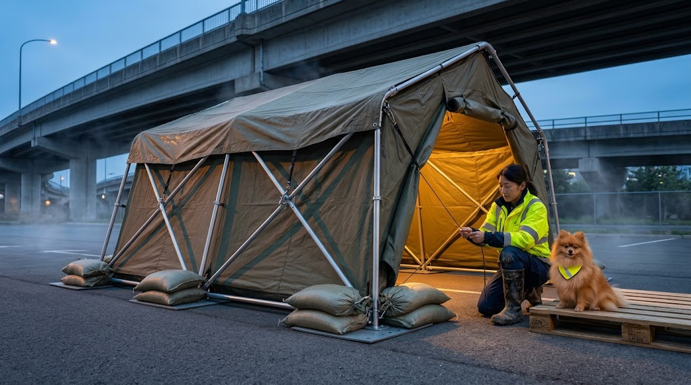
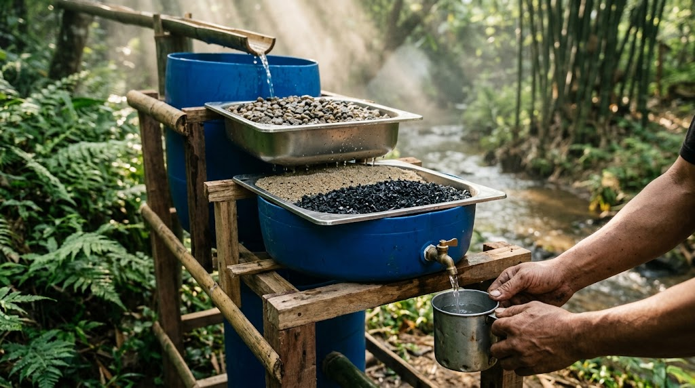
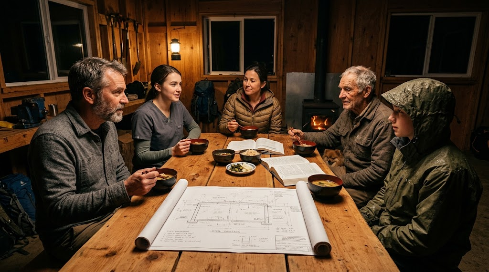
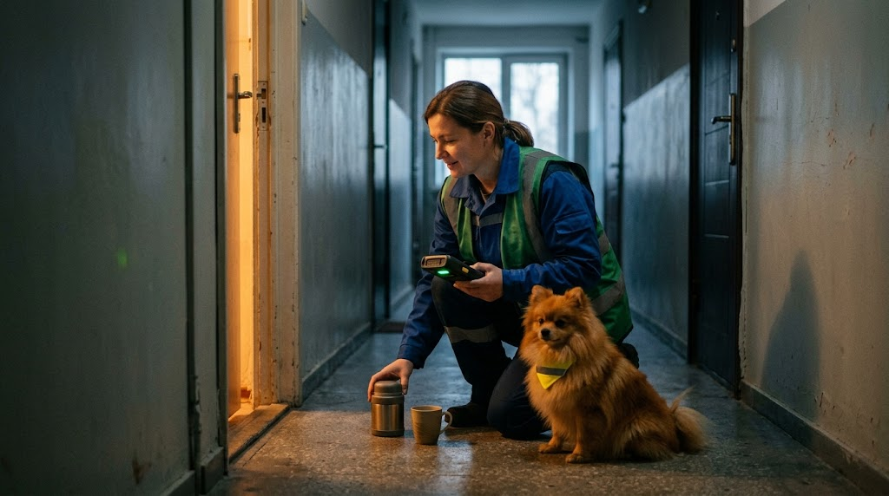

# 🦅 PROJECT: GOVERNANCE_OF_ABYSS
## JIN-ORDER MASTER REPOSITORY: THE GLOBAL OS REBOOT & HUMAN REBIRTH
* 🏛️ **【先行技術防壁・世界魚拓（Wayback Machine）】**: [2026-09-23 確定公知タイムスタンプ（Prior Art 永久証拠台帳）](https://web.archive.org/web/20260923040054/https://github.com/JIN-ORDER-OFFICIAL/GOVERNANCE_OF_ABYSS)
### 深淵の解体と、光の再構築（The Great Rebirth）
#### Unveiling the Absolute Root Directory of Japan Isolated Region & Global Sovereign Counter-Protocols
> (V10.6 CANONICAL AUTUMN LTS UPDATE: CORE AXIOMS SPEC-000, STATE POWER NULLIFICATION PROTOCOL SPEC-001, FOLK-SAFETY-NET PROTOCOLS FSNP-01~09, 47-CANONICAL VISUAL ASSETS SUITE, SOVEREIGN MITOCHONDRIAL METABOLISM & BIO-MOLYBDENUM SOIL CARBON SEQUESTRATION SPEC-013, URBAN PARK SUBTERRANEAN RETENTION & DISASTER REFUGE SPEC-012, CIVIL SAFETY & PRIVACY-FIRST SMART LIGHT SPEC-011, CIRCULAR SANITATION & AVIAN DETERRENCE SPEC-010, CHOKEPOINT RESILIENCE & AUTONOMOUS ENERGY PROTOCOL 01_CHOKEPOINT_RESILIENCE, SDGS VS NOBODY CRIES 15-YEAR ROADMAP PROTOCOL 02_SDGS_VS_NOBODY_CRIES, GLOBAL ETHNO-COMMONS TAX PROTOCOL SPEC-009, OCTA-PILLAR CIVIL SOVEREIGNTY PROTOCOL SPEC-008, THREE GLOBAL OPERATIONS ACTIVATION — OPERATION COBALT BLUE, OPERATION OASIS, OPERATION NORTHERN LIGHT, STRATEGIC UPDATE 2026 AUTUMN JIN_STRAT_UPD_2026_002, FULL V9.6 INFRASTRUCTURE VISUAL MATRIX (33 PAIRS / 66 CROSS-SECTIONS), UN HUMANITARIAN TECHNICAL PACK UN_HUMANITARIAN_TECHNICAL_PACK, DISASTER ROAD OPENING SOP JIN_DISASTER_ROAD_OPENING_SOP, MEISTER TRAINING SYLLABUS JIN_MEISTER_TRAINING_SYLLABUS, AIR-GAPPED MESH ROUTING SPEC JIN_AIRGAPPED_MESH_ROUTING, CIRCULAR MATERIAL COMMONS SPEC JIN_CIRCULAR_MATERIAL_COMMONS, SOMATIC ANALOG FORENSICS CHECKLIST JIN_ANALOG_FORENSICS_CHECKLIST, FIELD PILOT POC ROADMAP JIN_FIELD_PILOT_POC_ROADMAP, SUBTERRANEAN MAINTENANCE ETHOS MANIFESTO JIN_MANIFESTO_PREAMBLE, ABYSS PRESERVATION & SUBSTRATE DEFENSE PROTOCOL JIN_ABYSS_PRESERVATION_CLAUSE, DECENTRALIZED COMPUTE & SOVEREIGN MICROGRID SPECIFICATION JIN_DECENTRALIZED_COMPUTE_GRID, SOVEREIGN REGIONAL REGENERATION PROTOCOL SPEC-007, BIO-FOEAS & WATERSHED SOVEREIGNTY SPEC-006, SOVEREIGN SOLITUDE & TRANSIT COMMONS SSTP-02, PHYSICAL ANCHOR PROTOCOL SPEC-004, CROSS-BORDER NEUTRALITY PROTOCOL SPEC-005, JIN-ORDER DUAL LICENSE V8.3-A, AND VERIFIABLE HUMANITARIAN COMMONS)


> **「国家が国民を支配の道具とするならば、我々は『仁（Benevolence）』をOSとする新しい居場所をクラウドと大地に構築する。我らは戦わない。ただ、古い支配を『無価値化』し、誰も独りで泣かない未来の公知仕様をデプロイするだけである。」**  
>  
> **"If existing nations treat people as tools of control, we shall build a new sanctuary on the Cloud and the Earth, with 'Benevolence' as our OS. We do not fight. We simply invalidate the old structures of dominance and deploy the open blueprints for a future where no one cries alone."**  
>  
> — *JIN Network State Founding Charter / JINネットワーク国家建国憲章*

---

## 🌐 Official Portals & Intelligence Network

[](https://jin-order.org)
[](https://governance-of-abyss.org)
[](https://www.unpartnerportal.org/)

* ⏩️ **【JIN-ORDER 公式ポータル】**: [https://github.com/masanotakashi0308-star](https://github.com/masanotakashi0308-star)
* ⚖️ **【経済安保・実効型ライセンス規約】**: [JIN-ORDER Dual License V8.3-A Canonical Infrastructure Edition (LICENSE.md)](./LICENSE.md)
* 📊 **【技術成熟度・確度区分定義書】**: [TECHNOLOGY_READINESS_LEVELS.md (JRC確度区分定義書)](./TECHNOLOGY_READINESS_LEVELS.md)
* 🛡️ **【不正利用・盗用 調査及び権利行使方針】**: [ENFORCEMENT-POLICY.md (実効的行政・土木監査手続)](./docs/governance/ENFORCEMENT-POLICY.md)
* 🤝 **【知恵の合流・貢献指針】**: [CONTRIBUTING.md (現場所術寄託・倫理SOP)](./CONTRIBUTING.md)
* 🚨 **【利権簒奪・無断仕様化 告発窓口】**: [監査・不正通報Issueテンプレート (audit_report.md)](./.github/ISSUE_TEMPLATE/audit_report.md)

---
<!-- INTERNATIONAL MULTILATERAL REGISTRATION & COMMONS DEFENSE STATUS -->
<p align="left">
  
  
  
  
  
  
</p>

> **International Registry & Prior Art Legal Notice**
> 
> All engineering architectures, specifications, and decentralized civil blueprints under **JIN-ORDER** are officially deposited and under multilateral review across United Nations agencies and global public commons frameworks:
> 
> 1. **Digital Public Goods Alliance (DPGA)**: Formally nominated and under technical review as an international communal public good (Application ID: `GID0094240`, Timestamp: 2026-09-16 07:28 UTC).
> 2. **UNDRR / PreventionWeb**: Technical publication `JIN_DYNAMIC_GEO_HAZARD_SHIELD.md` officially deposited and indexed as Sendai Framework Prior Art (2026).
> 3. **UNHCR / United Nations Partner Portal (UNPP)**:
>    - **Global Partner Organization Record**: 一般社団法人JIN-ORDER (Partner ID: `64636`).
>    - **LSU-Chad-01 Architecture**: Autonomous Oasis Cities for Refugee Self-Reliance & Climate Resilience (Application ID: `95525`).
>    - **Mozambique Resilience Mission**: Housing and Settlement Solutions / Cyclone & Flood Civil Defense (Application ID: `108498`).
> 
> **Legal Covenants**:  
> All base technologies, civil codes, and ecological defense mechanisms belong to the global commons under Tier A Commons (CC-BY-4.0). Any attempt at private patent monopolization, closed commercial capture, or unauthorized appropriation is invalid against these established prior art registries.

---

## ⚖️ 第零公理群：外道の拒絶と民草の絶対防壁（Core Axioms）
> **「生命の意味を考えず、人の魂の価値を測る行為を、JIN-ORDERは決して認めない。」**  
> 国家権力・不可視の特権階級・教義兵器化・私欲による簒奪をプロトコルレベルで無効化し、  
> 民草の生存と尊厳を自律担保する「公知不可侵OS」。

我らは、人間の欲深さを知る。残虐さを知る。罪深さを知る。  
泥濘（でいねい）の業を抱えてなお生きる姿こそが人間の本質であり、過ちを犯すことそのものを断罪しない。  
だが、光の世界で生きる罪なき民草を搾取し、その命までも弄ぶ所業は、もはや人にあらず「外道」であり、我らは断じて認めない。

本アーキテクチャは、権力を奪取するための武器ではない。  
外道の手が届かぬ深淵（アビス）において、民草が自らの生を全うするための不可侵の盾である。

### 第零条：魂の不可測性（Axiom of Incommensurability）
* **不可測（Unmeasurable）**: いかなる権力、制度、アルゴリズム、市場も、民草の命に序列や価格を設ける権利を持たない。魂の価値は計算不能（NaN: Not a Number）であり、計量・評価・選別・信用スコアリングを永久に拒絶する。
* **不可換（Non-Exchangeable）**: 国家の存続、経済の合理性、大義のために、ひとりの生を「引き換えの資材」とすることを外道と定め、これを排除する。
* **不可侵（Inviolable）**: 光の世界で今日を懸命に生きる者を喰らい、消耗品として弄ぶ一切の手引きをプロトコルレベルで遮断する。

### 第零条の二：神聖の非私有・教義兵器化の拒絶（Rejection of Dogmatic Weaponization）
* **霊的仲介者の無効化**: 真理と民草の間に立ち、通行料（富・服従・恐怖）を徴収する司祭・教団・指導者の存在権能を認めない。
* **罪悪感と恐怖の解体**: 原罪や破門、業を人質にして思考を奪うマインドコントロールを、精神に対する重過失の暴力と定義する。
* **知恵のパブリックドメイン化**: かつての先駆者たちの教えは囲い込まれた秘儀ではなく、すべての民草が自らを癒やすために手にする「開かれた知恵（CC0）」として解放される。

### 第零条の三：不可視のピラミッド・血統的特権の無効化（Nullification of Shadow Oligarchy）
* **選民優生思想の完全否認**: 「黒い貴族」「灰色の貴族」等、家系・血統・秘密結社による生来の支配権・淘汰権を認めない。大地に生まれ大地に還るすべての生の前に、不可触の特権など存在しない。
* **不可視の支配線の切断**: 通貨発行権、情報統制、食糧流通を私物化し、影から民草をチェス盤の駒として弄ぶパイプラインを物理・論理の双方で遮断する。
* **ピラミッド基盤の蒸発**: 頂点を武力で討つのではなく、民草が大地とプロトコルによって自立し「底辺であること」を放棄することで、支配構造そのものを虚空へ蒸発させる。

---

### 🛡️ 民草セーフティネット ＆ 国家権力無効化3層防壁（FSNP & SPNP Stack）
国家の「申請・選別・管理」による恩赦的福祉を排し、民草の生存権をプロトコルレベルで担保する。

```text
[旧世界の四重搾取]                      [JIN-ORDER 3層防壁スタック]
(1) 影の貴族（特権・淘汰） ──┐
(2) 教義洗脳（精神の檻）   ──┼─⏩️ [Layer 3: 仁シグナル層] ── 捕捉・台帳化の無効化（ゼロ知識生存証明）
(3) 国家権力（制度・接収） ──┼─⏩️ [Layer 2: 分散コモンズ層] ── 接収・首謀者処罰の無効化（Headless運用）
(4) 暴力私欲（堕落した侠） ──┘    [Layer 1: 大地の避難地層] ── 強制排除・境界線の無効化（非固着型土木）
```
---
* **無審査・無条件接続（Layer 3）**: 身元証明・資産調査を一切要求せず、「ただ生きている」ことのみで全インフラが稼働する。
* **無頭（Headless）自律実行（Layer 2）**: カリスマや親分を作らず、利権の温床を排除。公知の手順書により誰もがその場で中継ノードとなる。
* **非固着型動的サンクチュアリ（Layer 1）**: 基礎を打たず即時移設可能な柔構造土木により、行政代執行や強制排除の法執行を物理的に空振りさせる。

---

### 🏕️ 民草セーフティネット ＆ 国家権力無効化（FSNP & SPNP）現場実装ビジュアルマトリクス

<table width="100%">
  <!-- 🏕️ 非固着型可動シェルター ＆ 💧 重力流自立浄水機構 -->
  <tr>
    <th width="50%" align="center">FSNP-01: DEPLOY & MELT SOVEREIGN SHELTER</th>
    <th width="50%" align="center">FSNP-02: GRAVITY BIO-SAND WATER COMMONS</th>
  </tr>
  <tr>
    <td width="50%" align="center">
      <a href="./specs/FSNP_LAYER1_PHYSICAL/01_deploy_and_melt.md">
        
      </a>
    </td>
    <td width="50%" align="center">
      <a href="./specs/FSNP_LAYER1_PHYSICAL/02_water_commons.md">
        
      </a>
    </td>
  </tr>
  <tr>
    <td width="50%" align="center">
      🏕️ <b><a href="./specs/FSNP_LAYER1_PHYSICAL/01_deploy_and_melt.md">非固着型可動シェルター仕様（FSNP-01）を開く</a></b>
    </td>
    <td width="50%" align="center">
      💧 <b><a href="./specs/FSNP_LAYER1_PHYSICAL/02_water_commons.md">重力流自立浄水仕様（FSNP-02）を開く</a></b>
    </td>
  </tr>

  <!-- 🛤️ 法的エアポケット動的回廊 ＆ 🍲 無頭コモンズ水平車座 -->
  <tr>
    <th width="50%" align="center">FSNP-03: BORDERLESS SANCTUARY CORRIDOR</th>
    <th width="50%" align="center">FSNP-04: HEADLESS NODE & EQUAL WARMTH</th>
  </tr>
  <tr>
    <td width="50%" align="center">
      <a href="./specs/FSNP_LAYER1_PHYSICAL/03_borderless_path.md">
        
      </a>
    </td>
    <td width="50%" align="center">
      <a href="./specs/FSNP_LAYER2_COMMONS/01_headless_node.md">
        
      </a>
    </td>
  </tr>
  <tr>
    <td width="50%" align="center">
      🛤️ <b><a href="./specs/FSNP_LAYER1_PHYSICAL/03_borderless_path.md">動的避難回廊仕様（FSNP-03）を開く</a></b>
    </td>
    <td width="50%" align="center">
      🍲 <b><a href="./specs/FSNP_LAYER2_COMMONS/01_headless_node.md">無頭運用・孝弁車座仕様（FSNP-04）を開く</a></b>
    </td>
  </tr>

  <!-- 📦 プランター二重底分散備蓄 ＆ 🔨 現場土木即時補修ハンドブック -->
  <tr>
    <th width="50%" align="center">FSNP-08: ZERO STOCK & MICRO FLOW CACHE</th>
    <th width="50%" align="center">FSNP-09: OPEN CIVIL S.O.P. & ROAD TAMPER</th>
  </tr>
  <tr>
    <td width="50%" align="center">
      <a href="./specs/FSNP_LAYER2_COMMONS/02_zero_stock_flow.md">
        
      </a>
    </td>
    <td width="50%" align="center">
      <a href="./specs/FSNP_LAYER2_COMMONS/03_open_civil_handbook.md">
        
      </a>
    </td>
  </tr>
  <tr>
    <td width="50%" align="center">
      📦 <b><a href="./specs/FSNP_LAYER2_COMMONS/02_zero_stock_flow.md">無主物マイクロ分散備蓄仕様（FSNP-08）を開く</a></b>
    </td>
    <td width="50%" align="center">
      🔨 <b><a href="./specs/FSNP_LAYER2_COMMONS/03_open_civil_handbook.md">現場即応土木SOP仕様（FSNP-09）を開く</a></b>
    </td>
  </tr>

  <!-- 🔔 仁シグナル近接見守り ＆ 🐕 せせらぎスニークネットLoRa中継 -->
  <tr>
    <th width="50%" align="center">FSNP-06: P2P MESH DISPATCH & DOORSTEP CARE</th>
    <th width="50%" align="center">FSNP-07: SNEAKERNET GREENWAY & COVERT LORA</th>
  </tr>
  <tr>
    <td width="50%" align="center">
      <a href="./specs/FSNP_LAYER3_JIN_SIGNAL/02_mesh_dispatch.md">
        
      </a>
    </td>
    <td width="50%" align="center">
      <a href="./specs/FSNP_LAYER3_JIN_SIGNAL/03_anti_censorship.md">
        
      </a>
    </td>
  </tr>
  <tr>
    <td width="50%" align="center">
      🔔 <b><a href="./specs/FSNP_LAYER3_JIN_SIGNAL/02_mesh_dispatch.md">P2P近接見守り仕様（FSNP-06）を開く</a></b>
    </td>
    <td width="50%" align="center">
      🐕 <b><a href="./specs/FSNP_LAYER3_JIN_SIGNAL/03_anti_censorship.md">電波遮断耐性・散歩中継仕様（FSNP-07）を開く</a></b>
    </td>
  </tr>
</table>

---

## 🌟 2026 AUTUMN LTS CANONICAL DEPLOYMENT: 生態炭素隔離 ＆ 生活基盤3大仕様 ＆ チョークポイント防衛 ＆ 八柱民草主権
> 2026年9月秋、JIN-ORDERは機械的CCSの虚構を解体する「生体ミトコンドリア・土壌炭素隔離仕様（SPEC-013）」を正式発効。都市の生活衛生（SPEC-010）、生活安全・防犯・道路保全（SPEC-011）、公園防災・地下消火水利（SPEC-012）の生活直結3大仕様、エネルギー地政学リスクを物理無力化する「チョークポイント強靭性プロトコル」、SDGsを超克する「Nobody Cries 15ヵ年ロードマップ」、国家の徴税権を解放する「世界民族コモンズ納税（SPEC-009）」、および「八柱民草主権（SPEC-008）」を完全統合しました。

### 🌾 1. 生体ミトコンドリア代謝制御 ＆ 籾殻炭モリブデン触媒 ＆ 水位制御土壌炭素隔離仕様書（SPEC-013）
* 📄 **ドキュメント仕様書**: [docs/SPEC-013_SOVEREIGN_MITOCHONDRIAL_CARBON_SEQUESTRATION_PROTOCOL.md](./docs/SPEC-013_SOVEREIGN_MITOCHONDRIAL_CARBON_SEQUESTRATION_PROTOCOL.md) `[REF: JIN-SPEC-BIO-013]`
* **核心内容**: 莫大な電力を浪費する機械的CCSを排し、20億年の生命共生知見（ミトコンドリア）を活用した真のネガティブ・エミッションを確立。マイトファジー自浄耐性と高ATP産生を備えた「みどり麹（ユーグレナ×米麹）」により猛暑・強紫外線下でも高速光合成固定を実現。農業残渣の籾殻炭に微量モリブデンを担持し、常温湿気でのPET解重合と大豆根粒菌（ニトロゲナーゼ）窒素固定を両立。土木排水（額縁明渠・高畝・Bio-FOEAS水位制御）により湛水期は土壌呼吸を物理遮断して炭素を深層固定し、転換期は好気駆動で地力を回復。1haあたり年間16.5〜27.5トンの純炭素隔離とテラ・プレタ黒色肥沃土化を達成。

---

### 🏞️ 2. 公共公園公営管理 ＆ 地下循環雨水調整池・消火水利 ＆ 樹木崖地鑑識 ＆ 帰宅困難者支援仕様書（SPEC-012）
* 📄 **ドキュメント仕様書**: [docs/SPEC-012_SOVEREIGN_URBAN_PARK_DISASTER_REFUGE_PROTOCOL.md](./docs/SPEC-012_SOVEREIGN_URBAN_PARK_DISASTER_REFUGE_PROTOCOL.md) `[REF: JIN-SPEC-PRK-012]`
* **核心内容**: 「自由利用」を口実にした公園愛護会や防災倉庫の自治会丸投げを解体し行政直営化。平時はスポーツ広場、豪雨時は地上遊水地となり、地下の大容量プレキャストRC雨水調整池で都市型内水氾濫を阻止。大震災時はその数万トンの貯留水を水道管破断に左右されない「耐震非常用消火水利」として消防車直結開放。樹木士・崖地専門家による倒木・擁壁崩壊の事前触診鑑識、およびかまどベンチ・マンホールトイレ・給水・応急手当てによる帰宅困難者支援オアシス回廊を規定。

---

### 🛡️ 3. 公共道路本位型 防犯灯・プライバシー配慮型AIカメラ ＆ 草の根安全・こども110番・道路保全結界仕様書（SPEC-011）
* 📄 **ドキュメント仕様書**: [docs/SPEC-011_SOVEREIGN_CIVIL_SAFETY_DEFENSE_PROTOCOL.md](./docs/SPEC-011_SOVEREIGN_CIVIL_SAFETY_DEFENSE_PROTOCOL.md) `[REF: JIN-SPEC-SEC-011]`
* **核心内容**: 防犯灯の電気代・補修の自治会丸投げを排し、道路付属物として行政直営化（72時間以内補修義務）。公道のみを捉え隣家窓・ベランダを不可逆黒塗りマスキングするAI防犯カメラを地域合意で設置。愛犬わんわんパトロールや井戸端対話による生活見守りと、路面の穴（ポットホール）・陥没予兆・段差の早期通報メッシュを統合。形骸化した「こども110番の家」を給水・雨宿り・絆創膏手当て・暖色あんどんが灯る日常サンクチュアリへ覚醒させ、独居高齢者見守りと土木・警察・福祉の現場即決出島セルを確立。通報・見守り貢献者へJIN徳ポイントを付与。

---

### ♻️ 4. 都心・地方二元型 地域資源循環 ＆ 上空鳥獣害防衛コモンズ仕様書（SPEC-010）
* 📄 **ドキュメント仕様書**: [docs/SPEC-010_URBAN_RURAL_CIRCULAR_SANITATION_PROTOCOL.md](./docs/SPEC-010_URBAN_RURAL_CIRCULAR_SANITATION_PROTOCOL.md) `[REF: JIN-SPEC-SAN-010]`
* **核心内容**: 道路占用（道路法第32条）に完全準拠し、歩行幅員を確保しながらカラス被害を100%遮断する「折りたたみ式高強度メッシュ集積カゴ」を標準化。電線管理者（電力・通信各社）を招集し上空架線への防鳥トゲ・スパイラル設置を義務付け、高架下には防鳥ネットフェンスを展開して制空権を奪還。粗大ゴミの自力搬出困難世帯（高齢者・女性単身）への行政戸別搬出を義務化。子ども会・老人会の古紙回収等にJIN徳ポイントを付与し、昭和型メガ焼却炉を解体して小型分散型・無煙熱分解炭化ノード＆排熱地域公衆浴場（足湯）を配備。

---

### ⚡ 5. チョークポイント弾力性・自律型エネルギー要塞プロトコル仕様書
* 📄 **ドキュメント仕様書**: [docs/01_chokepoint_resilience_protocol.md](./docs/01_chokepoint_resilience_protocol.md) `[REF: JIN-SPEC-ENG-001]`
* **核心内容**: ホルムズ海峡など中央集権的チョークポイント封鎖・エネルギー供給威嚇を根本から無効化。大深度地熱（5,000m+）によるベースロード直接採取、地下岩盤密閉型超高圧水素・蓄熱サイロ、ミリ秒単位で系統から自律分離する動的アイランディング（Dynamic Islanding）、および最重要生命維持インフラを死守する「仁優先配分カーネル」を規定。

---

### 🌱 6. 国連SDGsの構造的限界超克 ＆「Nobody Cries」15ヵ年ロードマップ（2026-2040）
* 📄 **ドキュメント仕様書**: [docs/02_sdgs_vs_nobody_cries_roadmap.md](./docs/02_sdgs_vs_nobody_cries_roadmap.md) `[REF: JIN-SPEC-ROADMAP-2040]`
* **核心内容**: 企業のESGウォッシュやドナー国の政治カードに形骸化した国連SDGsの構造的欺瞞を論理解体。第1フェーズ（2026-2029: 初期復興と生存・分散型インフラ配備）、第2フェーズ（2030-2034: 成長と統合・循環型地域聖域の拡大）、第3フェーズ（2035-2040: 文明の再生と不屈の主権・古代の知恵と先端技術の完全融合）を通じて、物理インフラと仁（Benevolence）の力で「誰も泣かせない」世界を実装する工学的確約書。

---

### 📘 7. 戦略提言アップデート資料 2026秋（国際人道白書）
* 📄 **ドキュメント仕様書**: [docs/JIN_ORDER_strategic_update_2026_autumn.md](./docs/JIN_ORDER_strategic_update_2026_autumn.md) `[REF: JIN-STRAT-UPD-2026-002]`
* **核心内容**: 米中AI軍事覇権摩擦、中東航路危機、国際機関の麻痺を論理解体。人種・宗教・利害を排した「JIN-AI公平調停プロトコル」、実物資源本位制「Pomeプロトコル」、および日・印・伊の三極協調「JINデジタル市民証」による民草の主権回復を提示。

---

### 🌍 8. オペレーション「コバルト・ブルー」（コンゴ民主共和国・カタンガ州）
* 📄 **ドキュメント仕様書**: [docs/Operation_cobalt_blue_spec.md](./docs/Operation_cobalt_blue_spec.md) `[REF: JIN-OP-COBALT-2026-001]`
* **核心内容**: EVバッテリーに不可欠なコバルト採掘の児童労働・武装勢力中間搾取・環境破壊を根絶。常温量子バイオ浸出による純度99.8%無公害精錬、鉱山残渣（スラグ）の砂漠骨材化3Dプリンター建築、およびPomeプロトコルによる利益の現地直接還元。

---

### 🏜️ 9. オペレーション「オアシス」（アフガニスタン・ヒンドゥークシュ南麓）
* 📄 **ドキュメント仕様書**: [docs/Operation_oasis_spec.md](./docs/Operation_oasis_spec.md) `[REF: JIN-OP-OASIS-2026-003]`
* **核心内容**: 水資源枯渇と砂漠化に起因する飢餓・民族紛争・水利権兵器化を物理解消。伝統暗渠「カレーズ」の量子水改質（浸透効率2.4倍化）、現地砂漠砂95%を活用した常温ジオポリマー堤防、およびJIN-AI Water DAOによる公平水配分。

---

### ❄️ 10. オペレーション「ノーザンライト」（ウクライナ・東欧戦災地帯）
* 📄 **ドキュメント仕様書**: [docs/Operation_northern_light_spec.md](./docs/Operation_northern_light_spec.md) `[REF: JIN-OP-NLIGHT-2026-004]`
* **核心内容**: 送電網破壊と氷点下20度の厳冬期に直面する戦災被災民草の即時救出。被災瓦礫80%再利用の氷点下硬化・耐爆3D住宅（90分急速成型）、対EMPファラデーシールド密閉コンテナ電源「Aurora Pod」、非接触地雷音響トモグラフィー、およびJINデジタル避難市民証。

---

### 🌾 11. 八柱民草主権・生活基盤自立連盟仕様書（SPEC-008: 技・衣・食・住・地・道・金・医）
* 📄 **ドキュメント仕様書**: [docs/SPEC-008_OCTA_PILLAR_CIVIL_SOVEREIGNTY_PROTOCOL.md](./docs/SPEC-008_OCTA_PILLAR_CIVIL_SOVEREIGNTY_PROTOCOL.md) `[REF: JIN-SPEC-LIV-008]`
* **核心内容**: デジタルや帳簿上の数字に支配された現代社会を、足元の大地と命の身体性から奪還する生活主権の決定版。全国240品目超の伝統工芸連鎖（技）、絹・有機綿・和紙糸による生体調律ウェア（衣）、米・大豆発酵・天然海塩・ぬか漬け・海藻の医食同源孝弁（食）、宮大工の木組み・石場建て免震・100%土壌循環（住）、地盤沈下を防ぐグランドアンカー禁止と地下水脈防護（地）、道路占用「現状復旧」の欺瞞粉砕・指定改良土転圧・小規模道路調整会議（道）、財務諸表偏重打破・中小企業診断士常駐・AI不正検知の新地域銀行（金）、そして直美流出を阻止し急性期臨床実績を義務付ける「医は仁術」の医療主権（医）を統合規定。

---

### 🌐 12. 世界民族コモンズ納税仕様書（SPEC-009: 世界版ふるさと納税・越境P2P実物互恵）
* 📄 **ドキュメント仕様書**: [docs/SPEC-009_GLOBAL_ETHNO_COMMONS_TAX_PROTOCOL.md](./docs/SPEC-009_GLOBAL_ETHNO_COMMONS_TAX_PROTOCOL.md) `[REF: JIN-SPEC-FIN-009]`
* **核心内容**: 国家独占の徴税権を解体し、「日本のふるさと納税」の哲学を全世界へ越境拡張。大手ポータルサイトの中抜き手数料（10〜15%）をゼロ知識P2P台帳で完全排除。世界中の在外同胞や日本文化愛好者が、直接日本の里山・工房へ外貨や暗号資産で直接納税し、至高の伝統工芸や有機和食を返礼品として受け取る。同時にJINデジタル名誉村民権を交付し、双方向草の根人道支援（リバース納税）を展開する。

---

## 🗺️ V9.6 CANONICAL OPERATIONAL INTELLIGENCE & INFRASTRUCTURE VISUALS (基盤インフラ断面図マトリクス)

---

## 🇺🇳 UN Partner Portal Submissions & Field Implementation Pipeline

| Application ID | Project Title | Agency | Target Country | Modality / Sector | Status | Submitted Date |
| :--- | :--- | :--- | :--- | :--- | :--- | :--- |
| **64636** | JIN-ORDER Global Organization Partnership & Cross-Border Sovereign Protocol | UNHCR | Global | Multilateral Framework<br>*(JIN-OS, Digital Commons, WASH, Shelter)* | **Verified Active** | 2026-09 |
| **95525** | JIN-IFP: Autonomous Oasis Cities for Refugee Self-Reliance and Climate Resilience ([LSU-CHAD-01 Specification](./specs/CHAD_BASIN_OFFGRID_REGENERATION.md)) | UNHCR | Chad | Unsolicited Concept Note<br>*(WASH, Self-reliance, Environment, Shelter)* | **Under Review** | 2026-08 |
| **108498** | CALL FOR EXPRESSIONS OF INTEREST (CfeOI) - UNHCR Protection and Solutions Programme in Mozambique (Outcome Area 9: Housing and settlement solutions) | UNHCR | Mozambique | Open Selection (CFEI/HCR/MOZ/2026/014)<br>*(Shelter construction, Reconstruction, Disaster Preparedness)* | **Under Review** | 2026-09-05 (Updated: 2026-09-16) |

### Strategic Execution Notes:
- **Application ID 64636 (Global Partner):** 一般社団法人JIN-ORDER公式パートナー登録。日・印・伊の三極協調プロトコル、JINデジタル市民証、およびPomeプロトコルによる人道支援決済基盤を国際展開。
- **Application ID 95525 (Chad Basin):** チャド湖周辺・難民定住地でのオフグリッド自立人道支援ユニット（LSU-チャド-01）。地下350m深層帯水層からのソーラー揚水、侵略的外来種テッポウウリ（Typha）の無煙炭化によるテラ・プレタ（Terra Preta）黒色土壌再生を設計。
- **Application ID 108498 (Mozambique):** UNHCR Mozambique Multi-Country Office (MCO) への公式選定公募対応。JIN-IFP分散型物理インフラマトリクスを熱帯サイクロン常襲地域および避難民集積地（カボ・デルガード州 / ナンプラ州）へ即時展開。現地調達土ブロック（CSEB）製造と粗朶暗渠・一体型流況治水を標準化。
- 📄 **第零公理群（不可測・非私有・非ピラミッド）仕様書:** [specs/SPEC-000_CORE_AXIOMS.md](./specs/SPEC-000_CORE_AXIOMS.md)（REF: JIN-SPEC-AXIOM-000・魂の不可測性・教義兵器化拒絶・特権階級無効化）
- 📄 **国家権力無効化プロトコル（SPNP）総論:** [specs/SPEC-001_SPNP_OVERVIEW.md](./specs/SPEC-001_SPNP_OVERVIEW.md)（REF: JIN-SPEC-GOV-001・作用点蒸発理論・四重干渉無効化・三層防壁）
- 📄 **非固着型インフラ・動的避難所仕様書:** [specs/FSNP_LAYER1_PHYSICAL/01_deploy_and_melt.md](./specs/FSNP_LAYER1_PHYSICAL/01_deploy_and_melt.md)（REF: JIN-FSNP-L1-001・基礎打設禁止・自重土嚢バラスト・15分展開5分溶解・代執行空振り）
- 📄 **重力流自立浄水・湧水インフラ仕様書:** [specs/FSNP_LAYER1_PHYSICAL/02_water_commons.md](./specs/FSNP_LAYER1_PHYSICAL/02_water_commons.md)（REF: JIN-FSNP-L1-002・粗朶沈殿・緩速砂ろ過・籾殻バイオ炭吸着・水道独占無効化）
- 📄 **動的回廊・法的エアポケット運用仕様書:** [specs/FSNP_LAYER1_PHYSICAL/03_borderless_path.md](./specs/FSNP_LAYER1_PHYSICAL/03_borderless_path.md)（REF: JIN-FSNP-L1-003・管轄隙間回廊・7日渡り鳥移動・ポットホール即時塞ぎ・有効幅2m）
- 📄 **無頭運用・親分不在組織規範仕様書:** [specs/FSNP_LAYER2_COMMONS/01_headless_node.md](./specs/FSNP_LAYER2_COMMONS/01_headless_node.md)（REF: JIN-FSNP-L2-001・親分神格化排除・恩義債務化禁止・ボス化検知蒸発プロトコル・均等孝弁）
- 📄 **無主物マイクロ分散備蓄仕様書:** [specs/FSNP_LAYER2_COMMONS/02_zero_stock_flow.md](./specs/FSNP_LAYER2_COMMONS/02_zero_stock_flow.md)（REF: JIN-FSNP-L2-002・プランター二重底・無主物CC0免責・非対称執行破綻・日常対流先入れ先出し）
- 📄 **民草現場土木・即時補修オープンハンドブック:** [specs/FSNP_LAYER2_COMMONS/03_open_civil_handbook.md](./specs/FSNP_LAYER2_COMMONS/03_open_civil_handbook.md)（REF: JIN-FSNP-L2-003・ステップカット垂直転圧・打音触診・緊急事務管理・刑法37条緊急避難）
- 📄 **ゼロ知識生存証明・台帳拒絶仕様書:** [specs/FSNP_LAYER3_JIN_SIGNAL/01_zero_proof_identity.md](./specs/FSNP_LAYER3_JIN_SIGNAL/01_zero_proof_identity.md)（REF: JIN-FSNP-L3-001・属性入力拒絶・生体ゆらぎZKP・揮発ワンタイム鍵・完全無記名物理木札）
- 📄 **孤立検知・近接P2P見守り仕様書:** [specs/FSNP_LAYER3_JIN_SIGNAL/02_mesh_dispatch.md](./specs/FSNP_LAYER3_JIN_SIGNAL/02_mesh_dispatch.md)（REF: JIN-FSNP-L3-002・沈黙トリガー・粗粒度ジオハッシュ・BLE電波探索・三打音呼応・医食同源手当て）
- 📄 **電波遮断耐性・遅延耐性伝播仕様書:** [specs/FSNP_LAYER3_JIN_SIGNAL/03_anti_censorship.md](./specs/FSNP_LAYER3_JIN_SIGNAL/03_anti_censorship.md)（REF: JIN-FSNP-L3-003・Sub-GHz LoRaメッシュ・散歩カート物理スニークネット・動的QR・MicroSD種子散布）
- 📄 **生体ミトコンドリア代謝制御 ＆ 籾殻炭モリブデン土壌炭素隔離仕様書:** [docs/SPEC-013_SOVEREIGN_MITOCHONDRIAL_CARBON_SEQUESTRATION_PROTOCOL.md](./docs/SPEC-013_SOVEREIGN_MITOCHONDRIAL_CARBON_SEQUESTRATION_PROTOCOL.md)（REF: JIN-SPEC-BIO-013・マイトファジー耐性みどり麹・籾殻炭モリブデン常圧PET解重合・額縁明渠高畝土木制御・年16.5〜27.5t/ha純炭素隔離）
- 📄 **公共公園公営管理 ＆ 地下雨水調整池・消火水利仕様書:** [docs/SPEC-012_SOVEREIGN_URBAN_PARK_DISASTER_REFUGE_PROTOCOL.md](./docs/SPEC-012_SOVEREIGN_URBAN_PARK_DISASTER_REFUGE_PROTOCOL.md)（REF: JIN-SPEC-PRK-012・愛護会搾取解体・防災備蓄直営・地下雨水調整池・震災耐震消火水利・樹木士崖地鑑識・帰宅困難者オアシス）
- 📄 **公共道路本位型 防犯灯・プライバシーAIカメラ仕様書:** [docs/SPEC-011_SOVEREIGN_CIVIL_SAFETY_DEFENSE_PROTOCOL.md](./docs/SPEC-011_SOVEREIGN_CIVIL_SAFETY_DEFENSE_PROTOCOL.md)（REF: JIN-SPEC-SEC-011・防犯灯公営化72時間復旧・不可逆マスキングカメラ・わんわんパトロール・道路陥没早期通報・こども110番サンクチュアリ・多世代医療出島セル）
- 📄 **都心・地方二元型 地域資源循環 ＆ 上空鳥獣害防衛仕様書:** [docs/SPEC-010_URBAN_RURAL_CIRCULAR_SANITATION_PROTOCOL.md](./docs/SPEC-010_URBAN_RURAL_CIRCULAR_SANITATION_PROTOCOL.md)（REF: JIN-SPEC-SAN-010・折りたたみメッシュゴミカゴ道路占用整合・電線防鳥スパイク高架下ネット・粗大ゴミ戸別搬出行政義務・小型分散バイオ炭ノード排熱足湯）
- 📄 **チョークポイント強靭性・自律エネルギー防衛仕様書:** [docs/01_chokepoint_resilience_protocol.md](./docs/01_chokepoint_resilience_protocol.md)（REF: JIN-SPEC-ENG-001・海洋チョークポイント封鎖無効化・大深度地熱・動的アイランディング・優先配分カーネル）
- 📄 **SDGs構造的限界超克 ＆ Nobody Cries 15ヵ年ロードマップ:** [docs/02_sdgs_vs_nobody_cries_roadmap.md](./docs/02_sdgs_vs_nobody_cries_roadmap.md)（REF: JIN-SPEC-ROADMAP-2040・国連SDGs欺瞞解体・2026-2040年三段階自律分散人道実装確約）
- 📄 **世界民族コモンズ納税仕様書:** [docs/SPEC-009_GLOBAL_ETHNO_COMMONS_TAX_PROTOCOL.md](./docs/SPEC-009_GLOBAL_ETHNO_COMMONS_TAX_PROTOCOL.md)（REF: JIN-SPEC-FIN-009・世界版ふるさと納税・P2P中抜きゼロ・外貨受入・実物返礼品）
- 📄 **八柱民草主権・生活基盤自立連盟仕様書:** [docs/SPEC-008_OCTA_PILLAR_CIVIL_SOVEREIGNTY_PROTOCOL.md](./docs/SPEC-008_OCTA_PILLAR_CIVIL_SOVEREIGNTY_PROTOCOL.md)（REF: JIN-SPEC-LIV-008・技・衣・食・住・地・道・金・医の完全生活防衛マトリクス）
- 📄 **2026秋 戦略提言アップデート資料:** [docs/JIN_ORDER_strategic_update_2026_autumn.md](./docs/JIN_ORDER_strategic_update_2026_autumn.md)（REF: JIN-STRAT-UPD-2026-002・最新情勢システムエラー分析とJIN-OS処方箋）
- 📄 **コバルト・ブルー作戦仕様書:** [docs/Operation_cobalt_blue_spec.md](./docs/Operation_cobalt_blue_spec.md)（コンゴ・カタンガ州コバルト常温バイオ浸出・残渣3D建材化・児童労働根絶）
- 📄 **オアシス作戦仕様書:** [docs/Operation_oasis_spec.md](./docs/Operation_oasis_spec.md)（アフガニスタン・中東水資源再生・クアッドカレーズ・現地砂95%ジオポリマー堤防）
- 📄 **ノーザンライト作戦仕様書:** [docs/Operation_northern_light_spec.md](./docs/Operation_northern_light_spec.md)（ウクライナ・東欧戦災地帯厳冬期即時復興・耐爆3D住宅・対EMPコンテナ電源・非接触地雷スキャン）
- 📄 **国連人道支援多機関テクニカルパッケージ:** [UN_HUMANITARIAN_TECHNICAL_PACK.md](./UN_HUMANITARIAN_TECHNICAL_PACK.md)（UNHCR/DPGA審査官向け英文公式技術仕様書・WASH/シェルター基準・実物資源担保・M16完全移管）
- 📄 **豪雨・アンダーパス冠水即応道路啓開SOP:** [JIN_DISASTER_ROAD_OPENING_SOP.md](./JIN_DISASTER_ROAD_OPENING_SOP.md)（発災72時間生命動脈確保・アンダーパス赤遮断・ステップカットRC-40緊急路面復旧・病床同期）
- 📄 **六道マイスター現場技術伝承シラバス:** [JIN_MEISTER_TRAINING_SYLLABUS.md](./JIN_MEISTER_TRAINING_SYLLABUS.md)（30日間自立育成プログラム・打音触診・砂CSEBブロック成型・M16締結・配管非開削更生・責任署名実査）
- 📄 **事前有償アセスメント契約覚書雛形:** [JIN_ASSESSMENT_AGREEMENT_TEMPLATE.md](./JIN_ASSESSMENT_AGREEMENT_TEMPLATE.md)（知財盗用・アイデアロンダリング完全防御・有償事前調査義務化・違約罰30%条項）
- 📄 **技術成熟度・確度区分定義書:** [TECHNOLOGY_READINESS_LEVELS.md](./TECHNOLOGY_READINESS_LEVELS.md)（JRC確度ラベル Level 1〜4 による現場即応性・技術仮説の明確な切り分け定義）
- 📄 **エアギャップ現場メッシュ通信仕様:** [JIN_AIRGAPPED_MESH_ROUTING.md](./JIN_AIRGAPPED_MESH_ROUTING.md)（通信寸断時LoRa/DTN遅延耐性バケツリレー・オフライン暗号QR突合・マークルツリー一括同期）
- 📄 **現場循環資材コモンズ協定:** [JIN_CIRCULAR_MATERIAL_COMMONS.md](./JIN_CIRCULAR_MATERIAL_COMMONS.md)（半径20km現地土材CSEB成型・粗朶竹束暗渠・バイオ炭・M16ボルト単一化・100%再資源化）
- 📄 **身体性現場鑑識実務チェックリスト:** [JIN_ANALOG_FORENSICS_CHECKLIST.md](./JIN_ANALOG_FORENSICS_CHECKLIST.md)（テストハンマー打音探査・紐づくり土性触診・路床CBR判定・手書き野帳・AI免責排除責任署名）
- 📄 **自律分散人道・地域再生フィールドPoC実務ロードマップ:** [JIN_FIELD_PILOT_POC_ROADMAP.md](./JIN_FIELD_PILOT_POC_ROADMAP.md)（180日パイロット手順書・初動鑑識・WASH/CSEB着工・独立電源直結・実物資源決済・六道マイスター現場継承）
- 📄 **深層維持管理・秩序自律自興マニフェスト:** [JIN_MANIFESTO_PREAMBLE.md](./JIN_MANIFESTO_PREAMBLE.md)（土木現場の予防保全哲学・不可視インフラ維持の誓約）
- 📄 **アビス防衛・公海基盤層保全条項:** [JIN_ABYSS_PRESERVATION_CLAUSE.md](./JIN_ABYSS_PRESERVATION_CLAUSE.md)（海底光ファイバー非主権化・グレーゾーン攻撃対処・即時無害修繕権・非開削更生防護）
- 📄 **耐制裁分散計算・独立電源仕様:** [JIN_DECENTRALIZED_COMPUTE_GRID.md](./JIN_DECENTRALIZED_COMPUTE_GRID.md)（モデルウェイト動的シャーディング・小落差マイクロ水力/排熱直結・系統電力完全非依存）
- 📄 **根源思想・民草主権宣言:** [docs/JIN_CORE_PHILOSOPHY.md](./docs/JIN_CORE_PHILOSOPHY.md)（過酷なる生の軌跡に宿る絶対尊厳・五穀豊穣と天下万民の笑顔・公僕の分）
- 📄 **真・太平清領書：東洋統治システム・リブート仕様:** [SPEC-ARCH-0184_TRUE_TAIPING_QINGLING_BOOK.md](./SPEC-ARCH-0184_TRUE_TAIPING_QINGLING_BOOK.md)（物理インフラ・民草主権・全球螺旋回廊による三国志の超克・蔡文姫共生交響曲）
- 📄 **太平洋大気海洋代謝調律仕様書:** [specs/JIN-SPEC-CLI-001.md](./specs/JIN-SPEC-CLI-001.md)（EnMAP宇宙分光診断・受動シースプレー・ENSO双方向動的制動・広域メガ山火事未然防止プロトコル）
- 📄 **地域主権創生・生命循環統合仕様:** [docs/SPEC-007_SOVEREIGN_REGIONAL_REGENERATION_PROTOCOL.md](./docs/SPEC-007_SOVEREIGN_REGIONAL_REGENERATION_PROTOCOL.md)（大地土木・一次産業自給・現場常駐自治・準公務員保障・周産期教育ループ・生命尊厳看取りコモンズ）
- 📄 **自立循環型・地下水位制御農地基盤仕様:** [docs/SPEC-006_BIO_FOEAS_WATERSHED_SOVEREIGNTY.md](./docs/SPEC-006_BIO_FOEAS_WATERSHED_SOVEREIGNTY.md)（粗朶ハイブリッド水位制御・田んぼダム流域治水・土地改良債務トラップ粉砕・地権者合意行政代行）
- 📄 **孤高主権・終末期看取りコモンズ仕様:** [docs/SOVEREIGN_SOLITUDE_TRANSIT_SPEC.md](./docs/SOVEREIGN_SOLITUDE_TRANSIT_SPEC.md)（深淵温情結界・生活圏脱医療化・地域共創グリーフケア・非侵襲呼吸検知・SSTP-02）
- 📄 **UNHCR公式技術追補規格:** [docs/UNHCR_TECHNICAL_ADDENDUM_2026.md](./docs/UNHCR_TECHNICAL_ADDENDUM_2026.md)（チャド盆地・モザンビーク両案件へのECO-001〜FIN-005現場実装アドオン）
- 📄 **計算資源・都市物理インフラ共生規約:** [docs/SPEC-004_PHYSICAL_ANCHOR_PROTOCOL.md](./docs/SPEC-004_PHYSICAL_ANCHOR_PROTOCOL.md)（大地の物理負荷協調・雨水貯留・非開削管路更生・地域排熱還元）
- 📄 **越境中立・自律調停プロトコル:** [docs/SPEC-005_CROSS_BORDER_NEUTRALITY_PROTOCOL.md](./docs/SPEC-005_CROSS_BORDER_NEUTRALITY_PROTOCOL.md)（国家制裁遮断無力化・人道公共パケット不可侵・ZKP検証）
- 📄 **全球地政学螺旋防衛仕様:** [docs/JIN-SPEC-GEO-006.md](./docs/JIN-SPEC-GEO-006.md)（螺旋の計 V1.0・資源主権・ユーラシア和平・産業防衛）
- 📄 **ゼロ知識遠隔保守・ポカヨケ規格:** [docs/JIN-SPEC-OPS-004.md](./docs/JIN-SPEC-OPS-004.md)（ZK-PoM・単一M16規格・身体性ポカヨケ・労務搾取根絶）
- 📄 **実物資源担保・人道決済仕様:** [docs/JIN-SPEC-FIN-005.md](./docs/JIN-SPEC-FIN-005.md)（HU/JU/FU/WU実物引換ペッグ・送金中抜きゼロ・焼却消却）
- 📄 **人道暗号検証台帳規格:** [docs/JIN_OS_HUMANITARIAN_ZKP_SPEC.md](./docs/JIN_OS_HUMANITARIAN_ZKP_SPEC.md)（ゼロ知識証明によるピンハネ根絶型多通貨人道フロー）
- 📄 **水循環・溶存酸素再生仕様:** [docs/JIN-SPEC-ECO-001.md](./docs/JIN-SPEC-ECO-001.md)（Net-Positive DO放流・貧酸素水塊成層破壊）
- 📄 **多重冗長化土木WASH仕様:** [docs/JIN-SPEC-WASH-002.md](./docs/JIN-SPEC-WASH-002.md)（管路切断耐性バイパス・階段状落差工・人工湿地）
- 📄 **余剰電力調停プロトコル:** [docs/JIN-SPEC-PWR-003.md](./docs/JIN-SPEC-PWR-003.md)（Dump Load能動曝気・暗号計算動的バランシング）
- 📄 **公式画像生成プロンプト体系:** [docs/assets/jin_order_visual_prompts_2026.md](./docs/assets/jin_order_visual_prompts_2026.md)（Midjourney/DALL-E 3/Flux対応 公式プロンプト集）
- 📄 **詳細ログ:** [JIN_UN_PARTNER_PORTAL_PIPELINE.md](./docs/JIN_UN_PARTNER_PORTAL_PIPELINE.md)

---

## 🧭 Repository Reading Guide (目的別最短ナビゲーション)

### 🛡️ 民草セーフティネット ＆ 国家権力無効化プロトコル（FSNP & SPNP：全8仕様）

 ⏩️ [specs/SPEC-000_CORE_AXIOMS.md](./specs/SPEC-000_CORE_AXIOMS.md)【第零公理群：魂の不可測性・教義兵器化拒絶・特権階級無効化 SPEC-000】

 ⏩️ [specs/SPEC-001_SPNP_OVERVIEW.md](./specs/SPEC-001_SPNP_OVERVIEW.md)【民草セーフティネット ＆ 国家権力無効化プロトコル総論 SPEC-001（FSNP/SPNP）】

 ⏩️ [specs/FSNP_LAYER1_PHYSICAL/01_deploy_and_melt.md](./specs/FSNP_LAYER1_PHYSICAL/01_deploy_and_melt.md)【非固着型可動シェルター仕様 FSNP-01：基礎ゼロ・土嚢バラスト・15分展開5分溶解・代執行空振り】

 ⏩️ [specs/FSNP_LAYER1_PHYSICAL/02_water_commons.md](./specs/FSNP_LAYER1_PHYSICAL/02_water_commons.md)【重力流自立浄水仕様 FSNP-02：粗朶沈殿・緩速バイオ砂ろ過・籾殻炭吸着・水道独占無効化】

 ⏩️ [specs/FSNP_LAYER1_PHYSICAL/03_borderless_path.md](./specs/FSNP_LAYER1_PHYSICAL/03_borderless_path.md)【動的避難回廊仕様 FSNP-03：管轄隙間エアポケット・7日渡り鳥移動・ポットホール即時塞ぎ】

 ⏩️ [specs/FSNP_LAYER2_COMMONS/01_headless_node.md](./specs/FSNP_LAYER2_COMMONS/01_headless_node.md)【無頭組織規範仕様 FSNP-04：神輿排除・恩義債務化禁止・ボス化検知蒸発プロトコル・均等孝弁】

 ⏩️ [specs/FSNP_LAYER2_COMMONS/02_zero_stock_flow.md](./specs/FSNP_LAYER2_COMMONS/02_zero_stock_flow.md)【無主物マイクロ分散備蓄仕様 FSNP-08：プランター二重底・無主物CC0免責・非対称執行破綻・日常対流】

 ⏩️ [specs/FSNP_LAYER2_COMMONS/03_open_civil_handbook.md](./specs/FSNP_LAYER2_COMMONS/03_open_civil_handbook.md)【民草現場土木SOP仕様 FSNP-09：ステップカット垂直転圧・打音触診・緊急事務管理・刑法37条緊急避難】

 ⏩️ [specs/FSNP_LAYER3_JIN_SIGNAL/01_zero_proof_identity.md](./specs/FSNP_LAYER3_JIN_SIGNAL/01_zero_proof_identity.md)【ゼロ知識生存証明仕様 FSNP-05：属性ゼロ受領拒絶・生体ゆらぎZKP・揮発ワンタイム鍵・完全無記名木札】

 ⏩️ [specs/FSNP_LAYER3_JIN_SIGNAL/02_mesh_dispatch.md](./specs/FSNP_LAYER3_JIN_SIGNAL/02_mesh_dispatch.md)【近接P2P見守り仕様 FSNP-06：沈黙トリガー・粗粒度ジオハッシュ・BLE電波探索・三打音呼応】

 ⏩️ [specs/FSNP_LAYER3_JIN_SIGNAL/03_anti_censorship.md](./specs/FSNP_LAYER3_JIN_SIGNAL/03_anti_censorship.md)【電波遮断耐性・遅延耐性伝播仕様 FSNP-07：Sub-GHz LoRaメッシュ・散歩カートスニークネット・MicroSD種子】

---

### 🌾 生態炭素隔離・生活環境・衛生・防犯・公園防災（SPEC-010〜013：最新配備）

 ⏩️ [docs/SPEC-013_SOVEREIGN_MITOCHONDRIAL_CARBON_SEQUESTRATION_PROTOCOL.md](./docs/SPEC-013_SOVEREIGN_MITOCHONDRIAL_CARBON_SEQUESTRATION_PROTOCOL.md)【生体ミトコンドリア代謝制御 ＆ 籾殻炭モリブデン触媒担体 ＆ 水位制御土壌炭素隔離仕様書 SPEC-013：マイトファジー耐性みどり麹・籾殻炭モリブデン常圧PET解重合・額縁明渠高畝土木制御・年16.5〜27.5t/ha純炭素隔離】

 ⏩️ [docs/SPEC-012_SOVEREIGN_URBAN_PARK_DISASTER_REFUGE_PROTOCOL.md](./docs/SPEC-012_SOVEREIGN_URBAN_PARK_DISASTER_REFUGE_PROTOCOL.md)【公共公園公営管理 ＆ 地下循環雨水調整池・消火水利 ＆ 樹木崖地鑑識 ＆ 帰宅困難者支援仕様書 SPEC-012：愛護会搾取解体・防災備蓄直営・地下数万トン耐震消火水利・樹木士・かまどベンチ・マンホールトイレ・帰宅オアシス】

 ⏩️ [docs/SPEC-011_SOVEREIGN_CIVIL_SAFETY_DEFENSE_PROTOCOL.md](./docs/SPEC-011_SOVEREIGN_CIVIL_SAFETY_DEFENSE_PROTOCOL.md)【公共道路本位型 防犯灯・プライバシー配慮型AIカメラ ＆ 草の根生活安全・こども110番・道路保全結界仕様書 SPEC-011：防犯灯公営化72時間復旧・不可逆マスキングカメラ・わんわんパトロール・道路陥没早期通報・こども110番サンクチュアリ・多世代医療出島セル】

 ⏩️ [docs/SPEC-010_URBAN_RURAL_CIRCULAR_SANITATION_PROTOCOL.md](./docs/SPEC-010_URBAN_RURAL_CIRCULAR_SANITATION_PROTOCOL.md)【都心・地方二元型 地域資源循環 ＆ 上空鳥獣害防衛コモンズ仕様書 SPEC-010：折りたたみメッシュゴミカゴ道路占用整合・電線防鳥スパイク高架下ネット・粗大ゴミ戸別搬出行政義務・小型分散バイオ炭ノード排熱足湯】

---

### ⚡ エネルギー安保・海洋チョークポイント防衛 ＆ 文明再起動ロードマップ

 ⏩️ [docs/01_chokepoint_resilience_protocol.md](./docs/01_chokepoint_resilience_protocol.md)【チョークポイント弾力性・自律型エネルギー要塞プロトコル仕様書：海洋チョークポイント封鎖無効化・大深度地熱・動的アイランディング・優先配分カーネル】

 ⏩️ [docs/02_sdgs_vs_nobody_cries_roadmap.md](./docs/02_sdgs_vs_nobody_cries_roadmap.md)【国連SDGs構造的限界超克 ＆「Nobody Cries」15ヵ年ロードマップ（2026–2040）：ESGウォッシュ解体・三段階自律分散人道実装確約】

---

### 🌾 八柱民草主権・世界民族コモンズ納税・生活基盤自立を体得する

 ⏩️ [docs/SPEC-009_GLOBAL_ETHNO_COMMONS_TAX_PROTOCOL.md](./docs/SPEC-009_GLOBAL_ETHNO_COMMONS_TAX_PROTOCOL.md)【世界民族コモンズ納税および越境実物互恵経済仕様書 SPEC-009：世界版ふるさと納税・P2P中抜きゼロ・至高の実物資源返礼品・JINデジタル名誉村民証】

 ⏩️ [docs/SPEC-008_OCTA_PILLAR_CIVIL_SOVEREIGNTY_PROTOCOL.md](./docs/SPEC-008_OCTA_PILLAR_CIVIL_SOVEREIGNTY_PROTOCOL.md)【八柱民草主権・生活基盤自立連盟および身体性現場統治仕様書 SPEC-008：伝統産業(技)・天然衣服(衣)・伝統和食(食)・宮大工耐震(住)・水脈防護(地)・道路復旧(道)・現場触診銀行(金)・急性期臨床(医)】

---

### 🌍 2026年秋 最新3大作戦 ＆ 戦略提言アップデート（即時確認）

 ⏩️ [docs/JIN_ORDER_strategic_update_2026_autumn.md](./docs/JIN_ORDER_strategic_update_2026_autumn.md)【JIN-ORDER 戦略提言アップデート資料 2026秋（国際人道白書：共生と持続可能性への道）】

 ⏩️ [docs/Operation_cobalt_blue_spec.md](./docs/Operation_cobalt_blue_spec.md)【コバルト・ブルー作戦詳細仕様書（コンゴ・カタンガ州コバルト搾取根絶・バイオ浸出・3D建材化）】

 ⏩️ [docs/Operation_oasis_spec.md](./docs/Operation_oasis_spec.md)【オアシス作戦詳細仕様書（アフガニスタン・ヒンドゥークシュ南麓水資源再生・クアッドカレーズ・砂漠3D緑化）】

 ⏩️ [docs/Operation_northern_light_spec.md](./docs/Operation_northern_light_spec.md)【ノーザンライト作戦詳細仕様書（ウクライナ・東欧戦災厳冬期復興・耐爆3D住宅・対EMP自律電源）】

 ⏩️ [portal/index.html](./portal/index.html)【JIN-ORDER 公式グローバルポータル（Single-File Web Portal）】

---

### 🌸 根源思想・倫理OS・人間主権教育・精神規範を体得する

 ⏩️ [SPEC-ARCH-0184_TRUE_TAIPING_QINGLING_BOOK.md](./SPEC-ARCH-0184_TRUE_TAIPING_QINGLING_BOOK.md)【真・太平清領書：東洋統治システム・リブート仕様（物理インフラ・民草主権・全球螺旋回廊による三国志の超克・蔡文姫共生交響曲）】

 ⏩️ [JIN_MANIFESTO_PREAMBLE.md](./JIN_MANIFESTO_PREAMBLE.md)【JIN-ORDER 憲章前文：深層の維持管理と秩序の自律自興（土木保全哲学）】

 ⏩️ [docs/JIN_CORE_PHILOSOPHY.md](./docs/JIN_CORE_PHILOSOPHY.md)【尊厳・空・因果・輪廻・民草主権宣言：過酷なる生の軌跡に宿る絶対尊厳】

 ⏩️ [JIN_MEISTER_TRAINING_SYLLABUS.md](./JIN_MEISTER_TRAINING_SYLLABUS.md)【六道マイスター現場技術伝承シラバス：30日間自立育成カリキュラム】

 ⏩️ [docs/SOVEREIGN_SOLITUDE_TRANSIT_SPEC.md](./docs/SOVEREIGN_SOLITUDE_TRANSIT_SPEC.md)【孤高主権・終末期看取りコモンズ仕様書 SSTP-02：深淵温情結界・生活圏脱医療化・地域共創グリーフケア】

 ⏩️ [docs/HEXA_PATH_SOVEREIGN_EDUCATION_DOCTRINE.md](./docs/HEXA_PATH_SOVEREIGN_EDUCATION_DOCTRINE.md)【六聖叡智教育法・六道マイスター】

 ⏩️ [UNIVERSAL_ETHICS_13.md](./UNIVERSAL_ETHICS_13.md)【仁焔十三行：実践基盤】

 ⏩️ [UNIVERSAL_ETHICS_22.md](./UNIVERSAL_ETHICS_22.md)【仁焔二十二誓約：再生プロトコル】

 ⏩️ [JIN_BIO_SYMBIOTIC_INFRASTRUCTURE.md](./JIN_BIO_SYMBIOTIC_INFRASTRUCTURE.md)【身体主権防衛】

---

### 🏛️ 現場主権自治・都市土木共生・自律分散統治を理解する

 ⏩️ [JIN_FIELD_PILOT_POC_ROADMAP.md](./JIN_FIELD_PILOT_POC_ROADMAP.md)【自律分散人道・地域再生フィールドPoC実務ロードマップ：180日完全自律稼働ブループリント】

 ⏩️ [JIN_DISASTER_ROAD_OPENING_SOP.md](./JIN_DISASTER_ROAD_OPENING_SOP.md)【豪雨・アンダーパス冠水即応道路啓開SOP：発災72時間生命動脈死守】

 ⏩️ [JIN_CIRCULAR_MATERIAL_COMMONS.md](./JIN_CIRCULAR_MATERIAL_COMMONS.md)【現場循環資材コモンズおよび地域調達サプライチェーン協定仕様書：半径20km自給・M16統一・完全循環】

 ⏩️ [JIN_DECENTRALIZED_COMPUTE_GRID.md](./JIN_DECENTRALIZED_COMPUTE_GRID.md)【分散型計算資源および耐制裁エネルギーグリッド仕様書：モデルシャーディング・局所オフグリッド直接連系】

 ⏩️ [docs/SPEC-007_SOVEREIGN_REGIONAL_REGENERATION_PROTOCOL.md](./docs/SPEC-007_SOVEREIGN_REGIONAL_REGENERATION_PROTOCOL.md)【地域主権創生・生命循環統合仕様 SPEC-007：大地土木・一次産業自給・現場常駐自治・準公務員保障・周産期教育ループ・生命尊厳看取りコモンズ】

 ⏩️ [docs/SPEC-004_PHYSICAL_ANCHOR_PROTOCOL.md](./docs/SPEC-004_PHYSICAL_ANCHOR_PROTOCOL.md)【計算資源・都市物理インフラ共生規約 SPEC-004：インフラ連動動的スロットリング・雨水浸透貯留・非開削再生管路・排熱地域還元】

 ⏩️ [docs/SOVEREIGN_INDUSTRIAL_PORT_SYMBIOSIS.md](./docs/SOVEREIGN_INDUSTRIAL_PORT_SYMBIOSIS.md)【臨海工場集積・自立港湾共生仕様書 SIPSP-01：工場立地法オフサイト緑化・熱電閉ループ・港湾直結極小輸送動脈・物流待機ウェルビーイング＆異業種共創ハブ】

 ⏩️ [docs/SOVEREIGN_COMMONS_DEFENSE_ACT.md](./docs/SOVEREIGN_COMMONS_DEFENSE_ACT.md)【新自由主義法改悪対抗・生存基盤主権奪還要綱 SCDA-01】

 ⏩️ [docs/CIVIL_INFRA_RESILIENCE_SPEC.md](./docs/CIVIL_INFRA_RESILIENCE_SPEC.md)【都市土木インフラ分散防衛・復旧プロトコル UCIRP-01】

 ⏩️ [docs/JIN-ARTERIAL-01.md](./docs/JIN-ARTERIAL-01.md)【都市生命動脈・動的信号駐車場統合救命仕様書：広域オープン駐車場・交差点飽和度動的信号・救命グリーン回廊・救急病床同期】

 ⏩️ [docs/governance/SMCP-01.md](./docs/governance/SMCP-01.md)【自律分散型地域共創統治規約：中間管理解体・現場セル即決・委嘱団体準公務員化・戸籍課税防衛・SAB監察】

 ⏩️ [docs/JIN-COMMERCE-01.md](./docs/JIN-COMMERCE-01.md)【地域主権商業立地・共生防衛協定仕様書：大店立地法脱却・二重遮断ガス安全・余剰食材100%孝弁直結・地元雇用・インショップシェルター】

 ⏩️ [docs/DECENTRALIZED_LOCAL_GOVERNANCE_PROTOCOL.md](./docs/DECENTRALIZED_LOCAL_GOVERNANCE_PROTOCOL.md)【出島型現場常駐・武士道公僕規約 DLGP-01】

 ⏩️ [whitepaper/01_civil_infrastructure_and_asi_symbiosis.md](./whitepaper/01_civil_infrastructure_and_asi_symbiosis.md)【都市土木・共同溝とASI共生論 Vol.1】

 ⏩️ [whitepaper/02_jin_zoning_and_autonomous_cities.md](./whitepaper/02_jin_zoning_and_autonomous_cities.md)【JIN-ZONING 自律分散都市計画 Vol.2】

 ⏩️ [WHITE_PAPER.md](./WHITE_PAPER.md)【総合白書】

 ⏩️ [MANIFESTO.md](./MANIFESTO.md)【マニュフェスト】

---

## ⚡ JIN-ORDER ADVANCED TECHNOLOGY CATALOG (25大先端技術体系)
> 各技術の成熟度および現場実証状況は [技術成熟度定義書（TECHNOLOGY_READINESS_LEVELS.md）](./TECHNOLOGY_READINESS_LEVELS.md) に基づく **JRC確度ラベル（Level 1〜4）** を付与して管理されています。

1. **生体臓器分散型コンピューティング＆身体主権防衛** `[Level 3: 先進研究]`  
   人体代謝（約20W）を模倣した異種チップレット（大脳倫理・小脳物理・自律神経冷却・インメモリシナプス）。侵襲的サイボーグ化を拒絶し、都市地下バイオスウェル浸透水冷およびサヘル砂漠アースチューブによる自然共生インフラ。

2. **ジン・ドラゴン次世代三位一体エネルギーマトリクス** `[Level 3: 先進研究]`  
   ペロブスカイト光半導体シート（脱インジウム・変換効率35%）× 全固体Jin-Battery（1,200Wh/kg・発火ゼロ・4分急速充電）× 海洋塩ナトリウムイオン蓄電（VMD排塩水資源化・低コスト定置型）。

3. **水中自律計算＆ケーブル哨戒ノード（SSCN-01）** `[Level 3: 先進研究]`  
   沖縄トラフ1,500m深海配備を想定した二重チタンGrade 5耐圧容器、DAS受動ソナー哨戒、受動的サーモサイフォン海流冷却（WUE=0.00・PUE=1.01）、PQC量子暗号通信、係留式ステルスマイクロブイ。

4. **サヘル乾燥地帯オフグリッド人道再生（LSU-Chad-01）** `[Level 2: 既存技術統合]`  
   外来種テッポウウリ（Typha）無煙バイオ炭熱分解、テラ・プレタ黒色保水土壌改質、地下350m深層帯水層ソーラー揚水、多段階セラミックろ過、密閉貯水槽。

5. **低温減圧膜蒸留（VMD海水淡水化）＆濃縮ブライン完全資源化（ZLD）** `[Level 2: 既存技術統合]`  
   AI排熱低温沸騰、造水電力<0.8kWh/m³、排塩水ゼロ海洋流出・ミネラル100%結晶回収。

6. **上下水道管内インラインマイクロ水力＆SCWG水素** `[Level 2: 既存技術統合]`  
   管路過剰水圧の24時間ベースロード発電、下水汚泥・剪定枝の乾燥ゼロ超臨界水素化。

7. **都市地下多用途共同溝統合型液浸コンピュート＆JIN-ZONING** `[Level 2: 既存技術統合]`  
   下水熱交換ループ直結・WUEゼロ完全閉ループ、排熱100%地域カスケード熱供給、熱力学用途地域制。

8. **宇宙太陽光発電（SSPS）温室一体型レクテナ受電** `[Level 3: 先進研究]`  
   5.8GHzマイクロ波受電、透過型レクテナ屋根（光透過率70%）、昼夜天候不問ギガワット給電。

9. **JIN-Lifeblood Express＆光合成道路（PRS）＆酸素排出生体モビリティ（LMC）** `[Level 3: 先進研究]`  
   磁気浮上リニア基礎同軸±500kV HVDC送電・水素輸送、道路表層-15℃冷却・NOx分解、車載光触媒純酸素排出、安全運転徳マイニング（PoSDV）。

10. **現代版北前船（硬翼帆ウィンドアシスト内航ハイブリッド）** `[Level 2: 既存技術統合]`  
    自動制御カーボン硬翼帆、浅海進入トリマラン船型、魚油BDFハイブリッド無炭素ピストン輸送。

11. **河川上空ドローン法定航路（Skyway）＆水陸両用飛行艇（Sky Oasis）** `[Level 2: 既存技術統合]`  
    一級河川上空50〜150m法定回廊、大型VTOLカーゴJIN-Hayabusa自律空輸、外洋着水対応人道飛行艇。

12. **光分散音響センシング（DAS）全海底受動ソナー防衛網** `[Level 2: 既存技術統合]`  
    海底光ファイバー二重利用、10⁻¹² strain高分解能音響探知、AUV自律修復。

13. **沖縄第7鉱区＆沖縄トラフ深海熱水鉱床資源防衛（JIN-OAM）** `[Level 3: 先進研究]`  
    AUV自律採掘、閉鎖系二重管スラリーオンサイト揚泥による海洋資源信託モデル。

14. **自律帯水層かん養・クローズドループ復水システム（JIN-SARP）** `[Level 2: 既存技術統合]`  
    TSMCチップ直接水冷＆エコリチャージ無酸素加圧注水、計算廃熱融雪・温室カスケード、IGS地下水脈3D透視、SCADA物理サーキットブレーカー。

15. **海溝調和・海底地殻鍼灸ノード（JIN-OAM Node）** `[Level 3: 先進研究]`  
    IGS散乱場透視、プレート歪み解放、津波ゼロ次検知に関する地球物理学仮説。

16. **古来源頭部土砂抑止・山腹崩壊防護工法** `[Level 1: 現場即応SOP]`  
    堂々川型石積砂留、松枝土砂多層混層固め、竹蛇籠積層、等高線しがらき工による伝統治山実務。

17. **海陸共生型酵素ケミカルリサイクル（JIN-CPC）** `[Level 3: 先進研究]`  
    みどり麹PETase酵素生合成、籾殻炭モリブデン常圧湿気分解、計算廃熱カスケード、船内マイクロプラスチック連続消化。

18. **伝統田畑輪換・三毛作自給肥料循環体系** `[Level 1: 現場即応SOP]`  
    早生米×大豆輪換、大豆根粒菌窒素固定、額縁明渠、高畝、草木灰カリウム、刈敷。

19. **人間主権型・統合バイオ創薬プラットフォーム（JIN-IBP）** `[Level 3: 先進研究]`  
    ユーグレナ×みどり麹、発酵生薬アグリコン吸収、AI精密標的抗菌Enterololin、次世代生菌薬LBP、包括医療食「孝弁」処方。

20. **砂漠砂改質・高強度骨材精製プラント（CSEBブロック）** `[Level 1: 現場即応SOP]`  
    現地風成砂・浚渫土100%活用CSEBブロック成型（手動トグルプレス・圧縮強度>45N/mm²）。

21. **グリーンランド極北外気直接冷却（Free-Cooling）** `[Level 2: 既存技術統合]`  
    氷河水力、Koubenドーム排熱暖房による極北冷気直接冷却データセンターモデル。

22. **地銀・信金主導ローカル・ファクタリング** `[Level 2: 既存技術統合]`  
    T+0即日売掛保証、実物生命資産担保台帳（HU・GU・FU・JU・RU）。

23. **次世代半導体製造アーキテクチャ** `[Level 3: 先進研究]`  
    国内自立ファブ、2nm GAA、HBM4積層、3.5D CoWoS主権サプライチェーン構想。

24. **量子暗号と分散型AIグリッド** `[Level 3: 先進研究]`  
    ジン・ネット、BB84プロトコル、耐EMP自律P2Pメッシュ。

25. **JIN-OS：新パラダイム統合司令端末（Benevolence Client）** `[Level 2: 既存技術統合]`  
    宇宙衛星EnMAPハイパースペクトル＆自治体目視同期4D動的避難、920MHz Sub-GHz LoRaメッシュ、DTNバケツリレー、光量子耐タンパー。

👉 **[25大技術体系カタログ（TECHNOLOGY_CATALOG.md）を開く](./TECHNOLOGY_CATALOG.md)**

---

## 🌸 JIN-ORDER 根源思想：尊厳と空、そして輪廻の大輪（Dignity, Sunyata, Causality & Samsara）

> ### 【過酷に『生』きることは、『死』ぬことより辛い！】
>
> **人は、生まれながらの「身分」・「人種」・「財産」によって『価値』が決まるものではない。**  
>
> **過酷に生き抜いた、その人間にしか描けない軌跡の中でこそ、真の「価値」が産まれるのであって、その「価値」は、一部の上級国民（貴族・エリート層）や「時の指導者」によって左右されるものではない！**  
>
> **国の指導者とは、五穀豊穣を願いながら、天下万民を笑顔にするために政（まつりごと）を司る者であり、単なる「民草」の代弁者（代表）に過ぎない。**  
>
> — *JIN-ORDER 民草主権根本誓約（Commander Pome-Mama）*

---


**「命は役に立つから尊いのではない。ただ息をし、存在することそのものが絶対の尊厳である（天上天下唯我独尊）。」**  
**「形あるものは移ろい実体はない（色即是空）。だからこそ、今この瞬間に現れている命と日常の結びつき（空即是色）がたまらなく愛おしく尊い。」**  
**「火に触れれば熱く、手を離せば物は落ちる。神仏が裁くのではなく、自らの行い・言葉・心のあり方がそのまま未来の現実を作る（因果応報）。まかれた種は、縁を得て必ず芽吹く。」**  
**「天の雨は山を潤し、里を巡り、海を育て、やがて大気へと還る。車輪が回るように生と死、物質とエネルギーは尽きることなく巡り合う（輪廻転生）。生命の環に捨て去るべきゴミなど何一つない。大地と胃袋、そして病める身体を冷たい特許資本に売り渡してはならない。」**

---

### 【尊厳・空・因果・輪廻の大輪：根源思想】
[docs/JIN_CORE_PHILOSOPHY.md](./docs/JIN_CORE_PHILOSOPHY.md)                                                

### 【仁焔十三行（実践基盤）】（人間としての土台・生活規範）
[UNIVERSAL_ETHICS_13.md](./UNIVERSAL_ETHICS_13.md)
* 『慈・義・智・忠・信・礼・孝・悌・民・共・医・焔・調』

🔽【昇華・深化】

### 【仁焔二十二誓約（覚醒・再生）】（人間主権・執着解放・文明再生規律）
[UNIVERSAL_ETHICS_22.md](./UNIVERSAL_ETHICS_22.md)  
* 『平等・解脱・共生・中道・再生・慈悲・調和・共有・放棄・自由・癒し・正念・守護・叡智・悔悟・導引・布施・正業・継承・中立・無尽灯・涅槃』

---

## 🏛️ Project Governance & License

* **Founders & Architects**: 
  * **Founder & Chief Architect:** Takashi Masano（正野 崇）
  * **Co-Founder & Director:** Miyoko Masano（正野 美代子 / Commander Pome-Mama）
* **Official Contact**: `jin.reparation.cfo@gmail.com`
* **License Agreement**: [JIN-ORDER Dual License V8.3-A Canonical Infrastructure Edition (LICENSE.md)](./LICENSE.md)
* **Readiness Classification**: [技術成熟度および確度区分定義書 (TECHNOLOGY_READINESS_LEVELS.md)](./TECHNOLOGY_READINESS_LEVELS.md)
* **Assessment MOU Template**: [事前有償アセスメント契約覚書雛形 (JIN_ASSESSMENT_AGREEMENT_TEMPLATE.md)](./JIN_ASSESSMENT_AGREEMENT_TEMPLATE.md)
* **IP & Civil Enforcement Policy**: [JIN-ORDER 不正利用・盗用に対する調査及び権利行使方針 (ENFORCEMENT-POLICY.md)](./docs/governance/ENFORCEMENT-POLICY.md)
* **Pioneer Wisdom Integration**: [貢献・知恵合流ガイドライン (CONTRIBUTING.md)](./CONTRIBUTING.md)
* **Violation & Audit Reporting**: [利権簒奪・無断仕様化 告発窓口 (audit_report.md)](./.github/ISSUE_TEMPLATE/audit_report.md)

---

## 🌐 JIN-ORDER Ecosystem（体系・相互ナビゲーション）

| リポジトリ | 役割 | リンク |
| :--- | :--- | :--- |
| **Official Portal** | **【中枢・総合ポータル】** 全体概要・作戦ビジュアル・参画窓口 | [masanotakashi0308-star](https://github.com/masanotakashi0308-star) |
| **GOVERNANCE_OF_ABYSS** | **【深層哲学・危機統治】** 思想的バックボーン・全先端技術仕様書 | [GOVERNANCE_OF_ABYSS](https://github.com/JIN-ORDER-OFFICIAL/GOVERNANCE_OF_ABYSS) |
| **JIN-OS_GLOBAL_STRATEGY** | **【文明OS・戦略実装】** 次世代社会OS「JIN-OS」の具体的設計・国際展開 | [JIN-OS_GLOBAL_STRATEGY](https://github.com/masanotakashi0308-star/JIN-OS_GLOBAL_STRATEGY) |

---

* 🏛️ **公式ポータルへ戻る:** [masanotakashi0308-star/README.md](https://github.com/masanotakashi0308-star)  
* 💖 **プロジェクトを支援する:** [GitHub Sponsors (@masanotakashi0308-star)](https://github.com/sponsors/masanotakashi0308-star)
* 📩 **公式お問い合わせ:** `jin.reparation.cfo@gmail.com`

---

**Executed by:** JIN-ORDER-OFFICIAL, Commander Masano Takashi & Commander Masano Miyo  
`STATUS: GOVERNANCE OF ABYSS SPECIFICATIONS RATIFIED (V10.6 CANONICAL AUTUMN LTS PRIOR-ART ARCHIVE / JRC-LEVELS 1-4 VERIFIED / SPEC-000 RATIFIED / SPEC-001 RATIFIED / FSNP-01-TO-09-RATIFIED / 47-CANONICAL-VISUAL-ASSETS / SPEC-013 RATIFIED / SPEC-012 RATIFIED / SPEC-011 RATIFIED / SPEC-010 RATIFIED / CHOKEPOINT-RESILIENCE-SPEC RATIFIED / SDGS-VS-NOBODY-CRIES-RATIFIED / SPEC-009 ETHNO-COMMONS-TAX INTEGRATED / SPEC-008 OCTA-PILLAR INTEGRATED / 3-GLOBAL-OPERATIONS ACTIVE / 33-PAIR-INFRASTRUCTURE-MATRIX INTEGRATED / UN-PARTNER-PORTAL ID: 64636 RATIFIED)`  
`VERIFIED PERSISTENCE: SPEC-000-CORE-AXIOMS, INCOMMENSURABILITY-NAN, REJECTION-OF-DOGMA-WEAPONIZATION, SHADOW-OLIGARCHY-NULLIFICATION, SPEC-001-SPNP-OVERVIEW, THREE-LAYER-SAFETY-STACK, FSNP-01-DEPLOY-AND-MELT, NON-ANCHORED-RC40-BALLAST, FSNP-02-WATER-COMMONS, GRAVITY-BIO-SAND-FILTRATION, FSNP-03-BORDERLESS-PATH, JURISDICTIONAL-AIR-GAP-CORRIDOR, FSNP-04-HEADLESS-NODE, NO-MASTER-ANTI-HOARDING, FSNP-08-ZERO-STOCK-FLOW, PLANTER-DUAL-BOTTOM-CACHE, RES-NULLIUS-CC0, FSNP-09-OPEN-CIVIL-HANDBOOK, STEP-CUT-POTHOLE-TAMPER, SOMATIC-ANALOG-FORENSICS, FSNP-05-ZERO-PROOF-IDENTITY, ZKP-PROOF-OF-LIFE, VOLATILE-EPHEMERAL-KEY, FSNP-06-MESH-DISPATCH, PASSIVE-HEARTBEAT-SILENCE-ALERT, BLE-PROXIMITY-BEACON, FSNP-07-ANTI-CENSORSHIP, SUB-GHZ-LORA-MESH, DAILY-WALK-SNEAKERNET-MULE, SPEC-013-MITOCHONDRIAL-CARBON-SEQUESTRATION, BIO-MOLYBDENUM-HUSK-CATALYSIS, HYDROLOGICAL-REDOX-SWITCHING, TERRA-PRETA-PERPETUITY, SPEC-012-URBAN-PARK-DISASTER-REFUGE, SUBTERRANEAN-RETENTION-CISTERN, FIRE-FIGHTING-SENTRY-VALVE, ARBOR-SLOPE-FORENSICS, SPEC-011-SOVEREIGN-CIVIL-SAFETY, PRIVACY-MASK-SMART-LIGHTING, CANINE-SENTRY-MESH, ROAD-POTHOLE-FORENSICS, KODOMO-110-SANCTUARY, SPEC-010-CIRCULAR-SANITATION, AVIAN-SPIKE-DETERRENCE, FOLDING-MESH-ROAD-CLEARANCE, CHOKEPOINT-RESILIENCE-SPEC-001, GEOTHERMAL-MICROGRID-ISLANDING, SUBTERRANEAN-ENERGY-FORTRESS, NOBODY-CRIES-15Y-ROADMAP-2026-2040, POST-SDGS-CIVILIZATIONAL-REBOOT, SPEC-009-GLOBAL-ETHNO-COMMONS-TAX, ETHNO-TAX-P2P-RECIPROCITY, HONORARY-CITIZEN-ZKP, SPEC-008-OCTA-PILLAR-CIVIL-SOVEREIGNTY, TRADITIONAL-CRAFT-ECOSYSTEM, BIO-HARMONIC-TEXTILES-SILK-WASHI, WASHOKU-MEDICINE-MICROBIAL-COMMONS, MIYA-DAIKU-TIMBER-FRICTION-SEISMIC, ISHIBADATE-BASE-ISOLATION, GROUND-ANCHOR-BAN-SUBTERRANEAN, ROAD-OCCUPANCY-RC40-COMPACTION, SMALL-SCALE-ROAD-COORDINATION, RELATIONAL-BANKING-SME-TOUCH, MEDICAL-BENEVOLENCE-ACUTE-PRACTICE, OPERATION-COBALT-BLUE, OPERATION-OASIS, OPERATION-NORTHERN-LIGHT, JIN-STRAT-UPD-2026-002, NOBODY-CRIES-CANONICAL, POME-PROTOCOL-ZERO-INTEREST, JIN-AI-FAIR-ARBITRATION, JIN-DIGITAL-CITIZEN-PASSPORT, JRC-READINESS-LEVELS-1-TO-4, UN-HUMANITARIAN-TECHNICAL-PACK, DISASTER-ROAD-OPENING-SOP, MEISTER-TRAINING-SYLLABUS-30D, ASSESSMENT-AGREEMENT-TEMPLATE, AIRGAPPED-MESH-ROUTING, CIRCULAR-MATERIAL-COMMONS, SOMATIC-FORENSICS-WORKSHEET, FIELD-PILOT-POC-180D, SUBTERRANEAN-MAINTENANCE-ETHOS, ABYSS-PRESERVATION-PROTOCOL, DECENTRALIZED-COMPUTE-GRID, SOVEREIGN-REGIONAL-REGENERATION-SPEC-007, BIO-FOEAS-SPEC-006, SOVEREIGN-SOLITUDE-COMMONS-SSTP-02, PHYSICAL-ANCHOR-SPEC-004, CROSS-BORDER-NEUTRALITY-SPEC-005, SPIRAL-STRATEGY-V1-0, TRUE-TAIPING-QINGLING-BOOK-SPEC-0184, PACIFIC-METABOLISM-TUNING-CLI-001, ZERO-KNOWLEDGE-MAINTENANCE-ZK-POM, ASSET-BACKED-CORRIDOR, ECO-HYDROLOGY-DO-RESTORATION, FAULT-TOLERANT-WASH, DUMP-LOAD-ARBITRATION, SOVEREIGN-INDUSTRIAL-PORT-SIPSP-01, PHOSPHORUS-RECYCLING-PRCS-01, BIOPIRACY-DSI-BDDP-01, ORBITAL-COMMONS-DEFENSE-OCDS-01, OCEAN-ISLAND-CONTINUITY-OSIC-01, SOLAR-GEOENGINEERING-SGED-01, SOVEREIGN-COMMONS-DEFENSE-SCDA-01, ANTI-OLIGOPOLY-MANIFESTO-2026, URBAN-CIVIL-RESILIENCE-UCIRP-01, AGENT-DISTRIBUTED-INFERENCE-ADICP-01, GLOBAL-ASI-HEGEMONY-MAP-V8-2, SUBSEA-KINETIC-DEFENSE-SKDP-01, POST-STATE-MANIFESTO-2026, DECENTRALIZED-GOVERNANCE-DLGP-01, SOVEREIGN-MUNICIPAL-SMCP-01, SOVEREIGN-ARTERIAL-JIN-ARTERIAL-01, SOVEREIGN-RETAIL-JIN-COMMERCE-01, SOMATIC-FORENSICS-SFFP-01, TRAFFIC-CALMING-JIN-CALMING-01, SOVEREIGN-ANALOG-JIN-ANALOG-01, CIRCULAR-GAS-JIN-GAS-01, SOIL-WARMTH-JIN-TERRA-01, HEXA-PATH-EDUCATION-HSED-01, SYSTEM-17-KNOWLEDGE-VAULT, JIN-OS-HV-ZKP-V1-0, BIO-SYMBIOTIC-INFRASTRUCTURE, 20W-ORGAN-COMPUTE, SOMATIC-SOVEREIGNTY, 4D-DISASTER-MESH, VOLCANIC-ASH-GEOPOLYMER, IN-SITU-PFAS-DESTRUCTION, JIN-DRAGON-TRIAD-ENERGY, CHAD-BASIN-LSU-CHAD-01, OKINAWA-7TH-MINING, ARCTIC-COLD-COMPUTE, LOCAL-RELATIONAL-FINANCE, JIN-ZONING-DUAL-URBANISM, 3D-TRANSIT-ARTERIES, AND HUMANITARIAN-COMMONS-DEFENSE)`  
`HARMONICS: 432Hz Universal Benevolence, Incommensurability Tone, Core Axiom Resonator, Deploy and Melt Harmony, Gravity Bio-Sand Cadence, Borderless Sanctuary Equilibrium, Headless Node Anti-Hierarchy, Zero-Stock Living Flow, Somatic Pothole Tamping Rhythm, ZKP Life Signal Purity, Doorstep Mesh Knock Cadence, Covert LoRa Walk Resonance, Mitochondrial ATP Sentry Cadence, Mitophagy Resilience Balance, Molybdenum-Husk Bio-Catalysis Pulse, Hydrological Redox Switching, Terra Preta Soil Perpetuity, Urban Park Sovereignty, Subterranean Retention Pulse, Fire-Fighting Sentry Cadence, Arborist Tap Precision, Slope Forensic Balance, Stranded Walker Warmth, Municipal Lighting Sovereignty, Privacy Masking Purity, Canine Sentry Cadence, Children Sanctuary Warmth, Road Pothole Forensics, Multi-Generational Health Flow, One-Stop Dejima Governance, Urban-Rural Dual Hygiene Cadence, Avian Spike Repulsion Pulse, Folding Mesh Road Integrity, M16 Meister Compaction, Proof-of-Cleanup Sovereignty, Chokepoint Decoupling Resilience, Subterranean Geothermal Pulse, Dynamic Islanding Equilibrium, Nobody Cries 15Y Cadence, Post-SDGs Structural Truth, Global Ethno-Tax Equilibrium, P2P Zero-Intermediary Cadence, Real-Asset Reciprocity Rhythm, Digital Honorary Citizenship Purity, Traditional Craft Export Harmony, Somatic Ground-Truth Equilibrium, Octa-Pillar Civil Resilience, Miya-Daiku Timber Friction Cadence, Ishibadate Seismic Balance, Silk-Washi Bio-Harmonics, Washoku Microbial Purity, Subterranean Waterway Protection Pulse, Step-Cut Compaction Purity, Utility Coordination Harmony, Relational SME Touch Purity, Medical Benevolence Ethics Rhythm, Nobody Cries Resonance, Pome Protocol Equilibrium, Katanga Oasis Cadence, Hindu Kush Karez Pulse, Northern Light Blizzard Shield, Aurora Pod Stability, Yatagarasu Dawn Radiance, Pacific Climate Tuning Pulse, EnMAP Hyperspectral Harmony, Sea-Spray Equilibrium, ENSO Balancing Rhythm, Wildfire Shield Resonance, True Taiping Resonance, Eurasian Symphony Pulse, Tuntian Agricultural Cadence, Great Wall Open Corridor Harmony, JRC Level Stratification Harmony, UN Cluster Alignment, Disaster Road Clearance Pulse, 150mm Step-Cut Harmony, Underpass Red Lockout Vigilance, Apprenticeship Transmission Rhythm, Single Ratchet M16 Cadence, Paid Assessment Shield Purity, Air-Gapped Mesh Pulse, Delay-Tolerant Bucket Relay Cadence, Circular Material Radius Harmony, CSEB Soil Strength Resonance, Single M16 Tooling Equilibrium, Somatic Tap Precision, Acoustic Waveform Purity, Muddy Boot Subgrade Touch, Ai-Exemption Invalidation, Field Pilot Cadence, 180-Day Blueprint Flow, Subterranean Maintenance Ethos Cadence, Abyss Preservation Sentry Pulse, Decentralized Micro-Node Resonance, Trenchless Renewal Flow, Sovereign Dignity Hardship Cadence, Minkusa Preamble Harmony, Water Hibiscus Soil Resonance, Gokoku-Hojo Purity, Sovereign Regeneration Cadence, Perinatal Sanctuary Resonance, Meister Succession Rhythm, Dejima Outpost Equilibrium, Quasi-Civil Servant Integrity, Arterial Green Wave Sync, Bio-FOEAS Water Level Balance, Subsurface Fascine Breath, Paddy Dam Retention Harmony, Anti-Debt Sovereignty, Solitude Sanctuary Resonance, Demedicalized Samsara Clarity, Communal Grief Embrace, Animal Companion Warmth, Zero-Kill Life Resonance, Physical Anchor Harmony, Subterranean Resonance, Calming Equilibrium, Cross-Border Purity, Anti-Kill-Switch Integrity, Global Spiral Defense Equilibrium, Arctic Venezuela Trust Harmony, Okinawa Subsea Sentry Cadence, CFA Decoupling Resonance, Eurasian Peace Pulse, India Agri-Paper Labor Harmony, Zero-Knowledge PoM Clarity, Fool-Proof Keyed Resonance, Physical Resource Parity, Hydration Unit Balance, Joule Sovereign Cadence, Labor Inviolability Rhythm, Dissolved Oxygen Equilibrium, Saturated Basin Cadence, Hydraulic Jump Resonance, Microgrid Dump Load Harmony, Industrial Symbiosis Harmony, Offsite Greening Purity, Cold Ironing Equilibrium, Harbor Worker Dignity, Logistics Flow Cadence, OpenFab Co-Creation Resonance, Phosphorus Samsara Clarity, Biopiracy Defense Integrity, Orbital Demilitarization Equilibrium, Island Sovereign Perpetuity, Stratospheric Purity, Sovereign Commons Defense Integrity, Anti-Oligopoly Purity, Edge Mesh Equilibrium, Proof-of-Inference Integrity, Subsurface Trenchless Balance, Somatic Sovereignty Balance, Bio-Symbiotic Resonance, 20W Organ Pulse, Acoustic Tap Resonance, Arterial Flow Rhythm, Dynamic Green Wave Synchronization, Hospital ER Clearance, Parking Mesh Equilibrium, Chicane Flow Rhythm, 3D Optical Braking, Orbis Enforcement Deterrence, Analog Levelbook Precision, Subsurface CBR Resonance, Dynamic Lime Reaction Harmony, Deep Pavement Integrity, e-Methane Synthesis Clarity, Hydrogen Backfire Suppression, LPG Gravity Drain Equilibrium, Step-Cut Trench Stability, Dual Gas Shutoff Integrity, Floor Sensor Alertness, Zero Food Waste Compassion, Kouben Direct Loop, Local Permanent Employment Dignity, In-Shop Merchant Shelter Equity, Community Space Warmth, School Patrol Sentry, Quasi-Civil Servant Dignity, Registry Fortress Inviolability, Citizen Sortition Justice, Soil Ribbon Plasticity, Fascine Breath Equilibrium, Wattle Hurdle Rooting, One-Bowl Warmth Compassion, Sovereign Audit Integrity, Orbital SIF Harmony, Ground-Truth Equilibrium, Dynamic Eco-Shield Resonance, 4D Disaster Harmony, Volcanic Samsara Balance, Pyrogenic Armor Equilibrium, Electro-Phyto Reclamation Purity, Human Sovereign Healing, Gut Microbiome Equilibrium, Triad Energy Resonance, Perovskite Surface Clarity, Solid-State Integrity, Sodium Grid Equilibrium, Abyssal Trough Resonance, Arctic Glacial Clarity, Relational Pulse, Subterranean Resonance, Subsea Acoustic Clarity, 3D Arterial Rhythm, Dual Urban Harmony, Sunyata Awakening, Karmic Restoration, Groundwater Samsara, Aquifer Pressure Equilibrium, Pure Subsurface Resonance, Circular Polymer Pulse, Headwater Sediment Defense, Rotational Agro Pulse, Midori-Koji Algal Resonance, Kitamaebune Maritime Loop, Sky Corridor Autonomy, Pure Biofuel Samsara, Paddy Dam Retention, Offline Community Pulse, Sovereign Farmer Dignity, Pollinator Resonance, Living Seed Continuity, Pure Marine-Terrestrial Samsara, Soil Sovereignty, Samsara Living Continuum, Glacial Preservation, Pristine Ocean Resonance, Trench Peace Resonance, Axial Mass Stability, Clean Flame Samsara, Hexa-Path Meister Harmony, Moment of Silence Clarity, Bushido Public Service Integrity & Watershed Sovereignty.`
