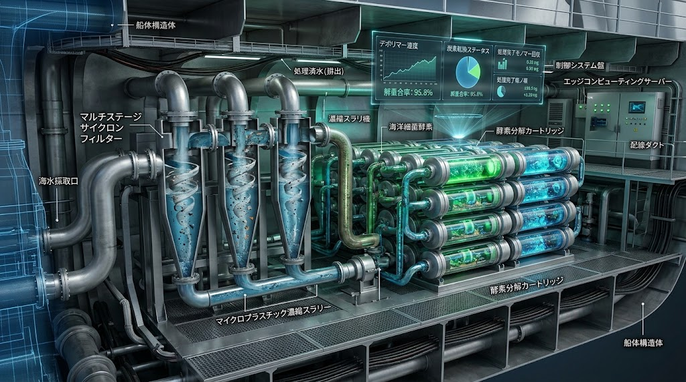
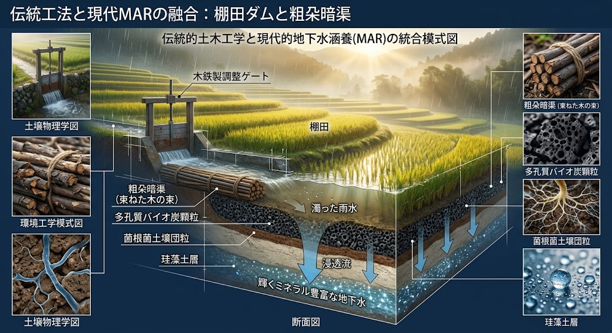
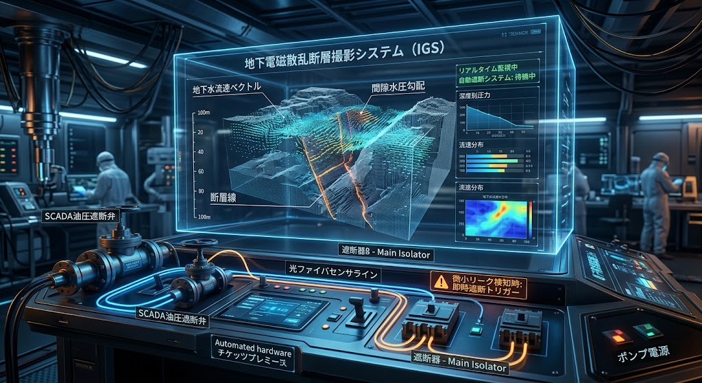
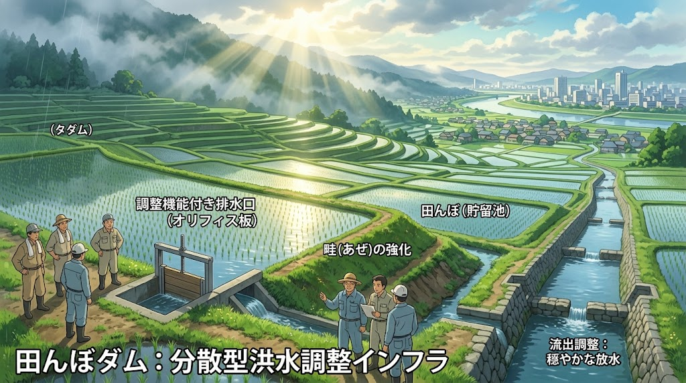
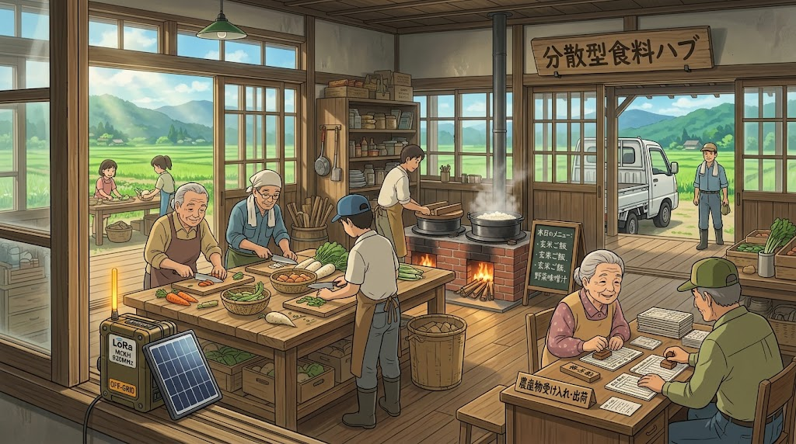
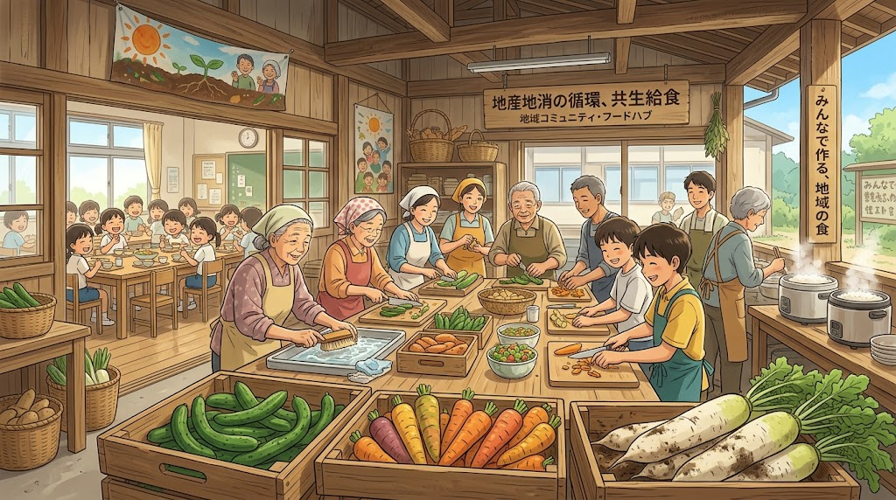
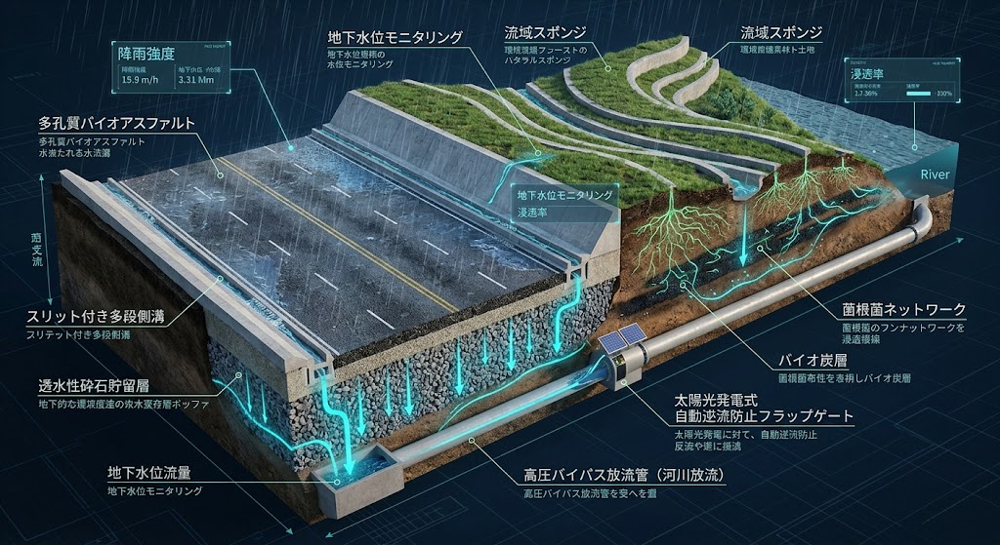
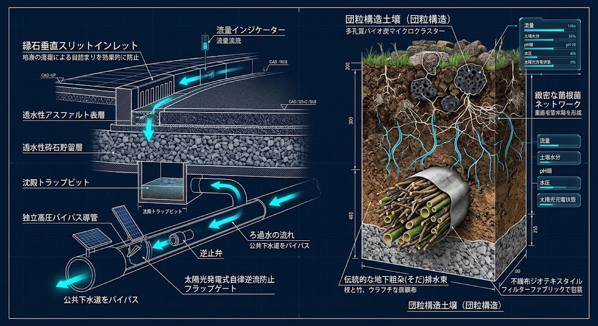

# 🦅 PROJECT: GOVERNANCE_OF_ABYSS
## JIN-ORDER MASTER REPOSITORY: THE GLOBAL OS REBOOT & HUMAN REBIRTH
### 深淵の解体と、光の再構築（The Great Rebirth）
#### Unveiling the Absolute Root Directory of Japan Isolated Region & Global Sovereign Counter-Protocols
### (V8.0 CANONICAL UPDATE: SAMSARA AQUIFER RECHARGE, CIRCULAR POLYMER BIO-CATALYST, ANCIENT SEDIMENT DEFENSE, ROTATIONAL AGRO-DRAINAGE, MIDORI-KOJI BIO-ENGINE & ECONOMIC SECURITY SHIELD)

> **「国家が国民を支配の道具とするならば、我々は『仁（Benevolence）』をOSとする新しい居場所をクラウドと大地に構築する。我らは戦わない。ただ、古い支配を『無価値化』し、誰も独りで泣かない未来をデプロイするだけである。」**  
>  
> **"If existing nations treat people as tools of control, we shall build a new sanctuary on the Cloud and the Earth, with 'Benevolence' as our OS. We do not fight. We simply invalidate the old structures of dominance and deploy a future where no one cries alone."**  
>  
> — *JIN Network State Founding Charter / JINネットワーク国家建国憲章*

---

## 🌐 Official Portals & Intelligence Network

* ⏩️ **【JIN-ORDER 公式ポータル】**: [https://github.com/masanotakashi0308-star](https://github.com/masanotakashi0308-star)
* ⚖️ **【経済安保・実効型ライセンス規約】**: [JIN-ORDER Dual License V8.0 Canonical Edition (LICENSE.md)](./LICENSE.md)
* 🤝 **【知恵の合流・貢献指針】**: [CONTRIBUTING.md (現場所術寄託・倫理SOP)](./CONTRIBUTING.md)
* 🚨 **【利権簒奪・無断仕様化 告発窓口】**: [監査・不正通報Issueテンプレート (audit_report.md)](./.github/ISSUE_TEMPLATE/audit_report.md)

---

## 🇺🇳 UN Partner Portal Submissions & Field Implementation Pipeline

| Application ID | Project Title | Agency | Target Country | Modality / Sector | Status | Submitted Date |
| :--- | :--- | :--- | :--- | :--- | :--- | :--- |
| **95525** | JIN-IFP: Autonomous Oasis Cities for Refugee Self-Reliance and Climate Resilience | UNHCR | Chad | Unsolicited Concept Note *(WASH, Self-reliance, Environment, Shelter)* | **Under Review** | 2026-08 |
| **107204** | CALL FOR EXPRESSIONS OF INTEREST (CfeOI) - UNHCR Protection and Solutions Programme in Mozambique (Outcome Area 9: Housing and settlement solutions) | UNHCR | Mozambique | Open Selection (CFEI/HCR/MOZ/2026/014) *(Shelter construction, Reconstruction, Disaster Preparedness)* | **Under Review** | 2026-09-05 |

### Strategic Execution Notes:
- **Application ID 107204 (Mozambique):** UNHCR Mozambique Multi-Country Office (MCO) への公式選定公募対応。JIN-IFP分散型物理インフラマトリクスを熱帯サイクロン常襲地域および避難民集積地（カボ・デルガード州 / ナンプラ州）へ即時展開。
- **Synergy Architecture:** 現地調達土ブロック（CSEB）製造と一体型流況治水を標準化。外部サプライチェーン寸断下でも即時自律稼働する耐久シェルター網を提供。
- 📄 **詳細ログ:** [JIN_UN_PARTNER_PORTAL_PIPELINE.md](./docs/JIN_UN_PARTNER_PORTAL_PIPELINE.md)

---

## 🧭 Repository Reading Guide (目的別最短ナビゲーション)

* 🌸 **根源思想・二重精神規範（魂のOS）を体得する:**  
  [docs/JIN_CORE_PHILOSOPHY.md](./docs/JIN_CORE_PHILOSOPHY.md)（尊厳・空・因果・輪廻） ⏩️ [UNIVERSAL_ETHICS_13.md](./UNIVERSAL_ETHICS_13.md)（仁焔十三行：実践基盤） ⏩️ [UNIVERSAL_ETHICS_22.md](./UNIVERSAL_ETHICS_22.md)（仁焔二十二誓約：再生プロトコル）

* 🔰 **文明白書・憲章・包括構想を理解する:**  
  [WHITE_PAPER.md](./WHITE_PAPER.md) (V7.5) ⏩️ [MANIFESTO.md](./MANIFESTO.md) ⏩️ [UNIVERSAL_ETHICS.md](./UNIVERSAL_ETHICS.md) (V7.5)

* 🗺️ **地政学・ASI崩壊シミュレーション・焦土再生を掴む:**  
  [GLOBAL_ASI_HEGEMONY_MAP_V7_FRAGMENTATION.md](./GLOBAL_ASI_HEGEMONY_MAP_V7_FRAGMENTATION.md) ⏩️ [GLOBAL_ASI_HEGEMONY_MAP_V6_1_COLLAPSE.md](./GLOBAL_ASI_HEGEMONY_MAP_V6_1_COLLAPSE.md) (V6.4 崩壊克復・再建フェーズ)

* 🚢 **海空三次元物流・自立動力・交通動脈・深海航空網を巡る:**  
  [JIN_KITAMAE_AIR_SEA_LOGISTICS.md](./JIN_KITAMAE_AIR_SEA_LOGISTICS.md) ⏩️ [JIN_AGRI_MARINE_BIOFUEL_SPEC.md](./JIN_AGRI_MARINE_BIOFUEL_SPEC.md) ⏩️ [JIN_LIFEBLOOD_EXPRESS.md](./JIN_LIFEBLOOD_EXPRESS.md) ⏩️ [JIN_BIO_SYMBIOTIC_EV.md](./JIN_BIO_SYMBIOTIC_EV.md) ⏩️ [JIN_ORGANIC_ECO_ARCHITECTURE.md](./JIN_ORGANIC_ECO_ARCHITECTURE.md) ⏩️ [JIN_SKY_OASIS_AIRCRAFT.md](./JIN_SKY_OASIS_AIRCRAFT.md) ⏩️ [JIN_OCEAN_LIFE_VESSEL.md](./JIN_OCEAN_LIFE_VESSEL.md) ⏩️ [JIN_OCEANIC_ACUPUNCTURE_NODE.md](./JIN_OCEANIC_ACUPUNCTURE_NODE.md)

* 🛠️ **現場インフラ・自律循環水利・帯水層かん養・古来土砂治水・高分子完全循環を実装する:**  
  [JIN_SAMSARA_AQUIFER_RECHARGE_SPEC.md](./JIN_SAMSARA_AQUIFER_RECHARGE_SPEC.md)（自律帯水層かん養・TSMC冷却半導体＆AIデータセンター復水仕様書） ⏩️ [JIN_CIRCULAR_POLYMER_BIO_CATALYST.md](./JIN_CIRCULAR_POLYMER_BIO_CATALYST.md)（海陸共生型・酵素ケミカルリサイクル ＆ 分散型ポリマー循環インフラ仕様書） ⏩️ [JIN_TRADITIONAL_HYDRO_LOGIC.md](./JIN_TRADITIONAL_HYDRO_LOGIC.md)（古来土砂治水・石積砂留・混層固め・信玄堤・54疏水） ⏩️ [JIN_PADDY_DAM_WATERSHED_ORDINANCE.md](./JIN_PADDY_DAM_WATERSHED_ORDINANCE.md) ⏩️ [JIN_LIVING_ROAD_INFRASTRUCTURE.md](./JIN_LIVING_ROAD_INFRASTRUCTURE.md) ⏩️ [JIN_WATER_INFRASTRUCTURE.md](./JIN_WATER_INFRASTRUCTURE.md) ⏩️ [JIN_WATERSHED_SOIL_DRAINAGE_SPEC.md](./JIN_WATERSHED_SOIL_DRAINAGE_SPEC.md) ⏩️ [JIN_YUKAWA_CASCADE_RESERVOIR_SYSTEM.md](./JIN_YUKAWA_CASCADE_RESERVOIR_SYSTEM.md) ⏩️ [JIN_SOIL_FOREST_SAMSARA_MATRIX.md](./JIN_SOIL_FOREST_SAMSARA_MATRIX.md) ⏩️ [JIN_GAS_LIVING_PIPELINE.md](./JIN_GAS_LIVING_PIPELINE.md)

* 🌾 **食料主権・三毛作田畑輪換・完全国産有機肥料・ユーグレナみどり麹・包括医療を確立する:**  
  [JIN_FARMER_REVITALIZATION_MASTERPLAN.md](./JIN_FARMER_REVITALIZATION_MASTERPLAN.md)（日本農家再生大綱：米×大豆輪換・額縁明渠・草木灰自給N-P-K） ⏩️ [JIN_ORGANIC_FERTILIZER_INFRASTRUCTURE.md](./JIN_ORGANIC_FERTILIZER_INFRASTRUCTURE.md)（ユーグレナ×みどり麹・鰊粕/鰯粕海陸循環肥料仕様書） ⏩️ [JIN_REGIONAL_HEALTHCARE_SPEC.md](./JIN_REGIONAL_HEALTHCARE_SPEC.md)（地域包括医療・生体防衛完全栄養食「孝弁」） ⏩️ [JIN_OFFLINE_FOOD_MESH_SOP.md](./JIN_OFFLINE_FOOD_MESH_SOP.md)（完全オフラインP2P食ハブSOP） ⏩️ [JIN_FOOD_SOVEREIGNTY.md](./JIN_FOOD_SOVEREIGNTY.md)（食料主権・ミツバチ受粉尊厳憲章） ⏩️ [JIN_SEED_SOVEREIGNTY_PROTOCOL.md](./JIN_SEED_SOVEREIGNTY_PROTOCOL.md)（種子主権・自家採種権保障） ⏩️ [JIN_GRAIN_TRACEABILITY_SYSTEM.md](./JIN_GRAIN_TRACEABILITY_SYSTEM.md)（主食投機禁止・透明流通台帳） ⏩️ [JIN_LOCAL_FOOD_CIRCUIT.md](./JIN_LOCAL_FOOD_CIRCUIT.md)（自然形・共生給食ハブ）

* 🛡️ **開拓現場での実務SOPを執行する:**  
  [PIONEER_FIELD_MANUAL.md](./PIONEER_FIELD_MANUAL.md) ⏩️ [JIN_OS_CLIENT_SPEC.md](./JIN_OS_CLIENT_SPEC.md)

---

## 🏛️ JIN-ORDER GLOBAL WHITE PAPER & FOUNDATIONAL CHARTERS (総合白書・中核憲章)

全17地域戦略仕様書、6大基幹プロトコル、17大先端技術体系を包括し、二極覇権の構造的虚無から全生命の調和・技術主権・食料主権・素材主権への反転を総括する最高意思決定・憲法文書：

* 🌸 **[docs/JIN_CORE_PHILOSOPHY.md](./docs/JIN_CORE_PHILOSOPHY.md)**: **JIN-ORDER 根源思想綱領（尊厳と空、そして輪廻の大輪）**  
  【天上天下唯我独尊】＆【色即是空・空即是色】＆【生々流転・輪廻転生】＆【因果応報・因縁果】の生命調和憲章。AI主権を完全拒絶し、大地に根ざす人間主権と因果の物理法則を宣言する最高形而上学文書。

* 💧 **[JIN_SAMSARA_AQUIFER_RECHARGE_SPEC.md](./JIN_SAMSARA_AQUIFER_RECHARGE_SPEC.md)**: **自律帯水層かん養 ＆ クローズドループ復水工法仕様書 (SARP V1.0)**  
  TSMC直接シリコン水冷・AIデータセンター水脈防護・無酸素加圧注水エコリチャージ・真空リチャージ・計算廃熱100%地域還流・伝統水利田んぼダム粗朶暗渠MAR・木村教授IGS地下水脈3D透視＆SCADA物理サーキットブレーカー・地球自転軸80cm質量復元プロトコル。

* 🧬 **[JIN_CIRCULAR_POLYMER_BIO_CATALYST.md](./JIN_CIRCULAR_POLYMER_BIO_CATALYST.md)**: **海陸共生型・酵素ケミカルリサイクル ＆ 分散型ポリマー循環インフラ仕様書 (V8.0 Canonical)**  
  カルタヘナ法第2種遵守・無細胞酵素抽出プロトコル[cite: 1]。「みどり麹」による高密度PETase/MHETase生合成[cite: 1]、籾殻バイオ炭モリブデン触媒による常圧環境湿気加水分解[cite: 1]、AI計算排熱（60〜80℃）直結ゼロボイラー解重合[cite: 1]、海洋再生母艦JIN-Ocean Life Vessel直結マイクロプラスチック連続酵素消化[cite: 1]、および回収モノマー（TPA/EG）のCNFバイオEV・エコ建材アップサイクル体系[cite: 1]。

* ⛰️ **[JIN_TRADITIONAL_HYDRO_LOGIC.md](./JIN_TRADITIONAL_HYDRO_LOGIC.md)**: **日本伝統水利・自律分散流域治水プロトコル (V8.0 Canonical)**  
  源頭部・山腹土砂流出を根源から抑止する福山藩「石積砂留」、松枝・土砂多層「混層固め」、竹蛇籠積層工、等高線しがらみ工を完全装備[cite: 1]。中下流域の信玄堤（将棋頭・竜王の鼻・サイバー聖牛・スマート霞堤）および世界かんがい施設遺産54疏水網と一体化した永久流域治水体系[cite: 1]。

* 🌾 **[JIN_FARMER_REVITALIZATION_MASTERPLAN.md](./JIN_FARMER_REVITALIZATION_MASTERPLAN.md)**: **日本農家再生大綱（The Sovereign Farmer Master Plan / V8.0 Canonical）**  
  「米×大豆」田畑輪換による連作障害・病害虫・雑草の物理的自然リセット。大豆根粒菌の大気窒素生物固定、土木排水工学「額縁明渠・高畝」、草木灰（カリウム）・刈敷・鰊粕/鰯粕による完全自給型N-P-K循環を実装し、大地の守護者たる農家の尊厳と再生産可能所得を恒久保障する最高統治規範。

* 🐟 **[JIN_ORGANIC_FERTILIZER_INFRASTRUCTURE.md](./JIN_ORGANIC_FERTILIZER_INFRASTRUCTURE.md)**: **海陸循環型有機肥料 ＆ みどり麹バイオ触媒仕様書 (V8.0 Canonical)**  
  動植物59種複合栄養素を宿し細胞壁を持たない微細藻類ユーグレナと米麹発酵「みどり麹」を急速発酵スターターとして投入。鰊粕・鰯粕および草木灰の超速低分子化と、パラミロン（β-1,3-グルカン）による土壌マイクロバイオーム免疫賦活を両立する完全国産バイオ金肥インフラ。

* 🏥 **[JIN_REGIONAL_HEALTHCARE_SPEC.md](./JIN_REGIONAL_HEALTHCARE_SPEC.md)**: **地域主権型 包括共生医療仕様書（仁八医療モデル / V8.0 Canonical）**  
  わんわん仁八病院・巡回癒し隊・セラピードッグ・AI温もりロボット（Moco-Bot）。細胞壁ゼロで消化吸収能93%を超えるユーグレナ×米麹「みどり麹」を生体防衛完全栄養食「孝弁（Kouben）」へ標準処方し、腸内フローラ正常化と未病・フレイルを根本克服する生命医療仕様書。

* 📜 **[WHITE_PAPER.md](./WHITE_PAPER.md)**: **JIN-ORDER 総合白書（The Architecture of Rebirth / V7.5 Canonical Edition）**  
  二極覇権（THE VOID）の構造的病理診断、空の覚醒による支配OS無力化、因果応報の必然崩壊、4層アーキテクチャ、開拓英雄（PIONEER）への行動指針。

* ⚖️ **[UNIVERSAL_ETHICS.md](./UNIVERSAL_ETHICS.md)**: **普遍的倫理規約 (V7.5 Canonical Edition)**  
  双方向的慈悲、復讐の昇華、アルゴリズムへの仁の優位性、自律エージェントの生命拘束、流域・生態圏防衛、食料主権、そして「色即是空と人間主権」「因果応報の自律律動」を定めた新人類の共通道徳OS。

* 🐕 **[UNIVERSAL_ETHICS_13.md](./UNIVERSAL_ETHICS_13.md)**: **仁焔十三行（徳目・実践基盤）**  
  慈・義・智・忠・信・礼・孝・悌・民・共・医・焔・調。市井の民草が日々の暮らしの中で人間性の尊厳を保ち、大地に根ざすための実践規範。

* 📜 **[UNIVERSAL_ETHICS_22.md](./UNIVERSAL_ETHICS_22.md)**: **仁焔二十二誓約（普遍再生プロトコル）**  
  仏陀の光に浴し、空と因果の理に基づき、文明崩壊（COLLAPSE）の荒野から新たな調和文明を自律再興するための高次元救済誓約。

* 📢 **[MANIFESTO.md](./MANIFESTO.md)**: **JIN-ORDER 仁秩序宣言 (V7.5 Canonical)**  
  大国ASIの送電網共食い、自律エージェントの連鎖暴走、特許合成食糧カルテル、および海底線破断による物理自滅を前に、民草（MIN-GUSA）が生命至上・市民主権・大地再生を宣言する不朽のマニフェスト。

---

## 🖼️ OPERATIONAL INTELLIGENCE & INFRASTRUCTURE VISUALS (作戦ビジュアル・インフラ断面図)

<table>
  <!-- 🧬【NEW V8.0】分散型ポリマー解重合 ＆ 酵素ケミカルリサイクル -->
  <tr>
    <th width="50%" align="center">DECENTRALIZED POLYMER DEPOLYMERIZATION</th>
    <th width="50%" align="center">ENZYMATIC ESTER CLEAVAGE & BIOCHAR CATALYST</th>
  </tr>
  <tr>
    <td align="center">
      
    </td>
    <td align="center">
      
    </td>
  </tr>
  <tr>
    <td align="center">
      🧬 <b><a href="./JIN_CIRCULAR_POLYMER_BIO_CATALYST.md">地域分散型ポリマー解重合仕様を開く</a></b>
    </td>
    <td align="center">
      🔬 <b><a href="./JIN_CIRCULAR_POLYMER_BIO_CATALYST.md#第2章-分散型ケミカル解重合プロセス仕様-decentralized-chemical-depolymerization">常圧湿気切断 ＆ モリブデンバイオ炭触媒を開く</a></b>
    </td>
  </tr>

  <tr>
    <th width="50%" align="center">SHIPBOARD MICROPLASTIC DIGESTION BAY</th>
    <th width="50%" align="center">TRADITIONAL SEDIMENT & SLOPE DEFENSE</th>
  </tr>
  <tr>
    <td align="center">
      
    </td>
    <td align="center">
      
    </td>
  </tr>
  <tr>
    <td align="center">
      🚢 <b><a href="./JIN_CIRCULAR_POLYMER_BIO_CATALYST.md#第3章-海洋陸域分散回収--オンサイト完全分解仕様-ocean--terrestrial-operations">海洋母艦マイクロプラ連続酵素消化を開く</a></b>
    </td>
    <td align="center">
      ⛰️ <b><a href="./JIN_TRADITIONAL_HYDRO_LOGIC.md#⛰️-3-源頭部山腹土砂抑止プロトコル古来砂留及び多層斜面崩壊防護工法-headwater-sediment--slope-defense">源頭部・多層斜面土砂崩壊防護仕様を開く</a></b>
    </td>
  </tr>

  <!-- ⛰️ 源頭部・山腹土砂抑止 ＆ 田畑輪換排水工学 -->
  <tr>
    <th width="50%" align="center">ISHIZUMI SUNADOME DEBRIS DAM (TECH)</th>
    <th width="50%" align="center">DENBATA RINKAN ROTATION & DRAINAGE</th>
  </tr>
  <tr>
    <td align="center">
      
    </td>
    <td align="center">
      
    </td>
  </tr>
  <tr>
    <td align="center">
      🧱 <b><a href="./JIN_TRADITIONAL_HYDRO_LOGIC.md#ⅰ-江戸期花崗岩地帯に学ぶ石積砂留いしづみすなどめ堰堤工">堂々川型 石積砂留堰堤工を開く</a></b>
    </td>
    <td align="center">
      🌾 <b><a href="./JIN_FARMER_REVITALIZATION_MASTERPLAN.md#第2章-日本伝統の田畑輪換三毛作生態系と土木排水工学traditional-rotational-agro-ecosystem--soil-drainage">早生米×大豆田畑輪換・三毛作生態系を開く</a></b>
    </td>
  </tr>

  <!-- 🌾 大豆根粒菌・自給N-P-K ＆ みどり麹バイオ肥料 -->
  <tr>
    <th width="50%" align="center">SOYBEAN RHIZOBIA & SELF-SUFFICIENT N-P-K</th>
    <th width="50%" align="center">DECENTRALIZED BIO-FERTILIZER PLANT</th>
  </tr>
  <tr>
    <td align="center">
      
    </td>
    <td align="center">
      
    </td>
  </tr>
  <tr>
    <td align="center">
      🔬 <b><a href="./JIN_FARMER_REVITALIZATION_MASTERPLAN.md#第7条大豆根粒菌による天然窒素固定と土木排水工学額縁明渠高畝">大豆根粒菌窒素固定 ＆ 完全自給N-P-Kを開く</a></b>
    </td>
    <td align="center">
      🏭 <b><a href="./JIN_ORGANIC_FERTILIZER_INFRASTRUCTURE.md#第4条地域分散型海陸共生発酵プラントの構成">海陸共生みどり麹バイオ肥料プラントを開く</a></b>
    </td>
  </tr>

  <!-- 💧 自律帯水層かん養・TSMC水冷＆AIデータセンタークローズドループ復水体系 -->
  <tr>
    <th width="50%" align="center">JIN-SAMSARA AQUIFER RECHARGE (OVERVIEW)</th>
    <th width="50%" align="center">DIRECT-TO-SILICON COOLING & ECO-RECHARGE</th>
  </tr>
  <tr>
    <td align="center">
      
    </td>
    <td align="center">
      
    </td>
  </tr>
  <tr>
    <td align="center">
      💧 <b><a href="./JIN_SAMSARA_AQUIFER_RECHARGE_SPEC.md">自律帯水層かん養・地軸質量保全仕様を開く</a></b>
    </td>
    <td align="center">
      🔬 <b><a href="./JIN_SAMSARA_AQUIFER_RECHARGE_SPEC.md#ⅱ-半導体aiデータセンター向け完全密閉型無酸素加圧復水アーキテクチャ">チップ直接水冷＆エコリチャージ加圧注水を開く</a></b>
    </td>
  </tr>

  <tr>
    <th width="50%" align="center">PADDY MAR & BIOCHAR FASCINE DRAINAGE</th>
    <th width="50%" align="center">IGS SUBSURFACE TOMOGRAPHY & SHUT-OFF VALVE</th>
  </tr>
  <tr>
    <td align="center">
      
    </td>
    <td align="center">
      
    </td>
  </tr>
  <tr>
    <td align="center">
      🌾 <b><a href="./JIN_SAMSARA_AQUIFER_RECHARGE_SPEC.md#ⅳ-地上mar管理された帯水層かん養--伝統水利田んぼダム">棚田ダム・粗朶暗渠・バイオ炭MAR浸透を開く</a></b>
    </td>
    <td align="center">
      🛡️ <b><a href="./JIN_SAMSARA_AQUIFER_RECHARGE_SPEC.md#ⅴ-散乱場理論igs--4d水循環シミュレーションによる不可逆監視台帳">地下水脈3D透視 ＆ SCADA物理遮断弁を開く</a></b>
    </td>
  </tr>

  <!-- 🚢 海空三次元物流・自立バイオ燃料体系 -->
  <tr>
    <th width="50%" align="center">KITAMAE AIR-SEA LOGISTICS MATRIX</th>
    <th width="50%" align="center">AGRI & MARINE AUTONOMOUS BIOFUEL</th>
  </tr>
  <tr>
    <td align="center">
      
    </td>
    <td align="center">
      
    </td>
  </tr>
  <tr>
    <td align="center">
      🚢 <b><a href="./JIN_KITAMAE_AIR_SEA_LOGISTICS.md">現代版北前船・海空統合物流仕様書を開く</a></b>
    </td>
    <td align="center">
      🛢️ <b><a href="./JIN_AGRI_MARINE_BIOFUEL_SPEC.md">農機・沿岸漁船 自立バイオ燃料仕様を開く</a></b>
    </td>
  </tr>

  <!-- 🌊 田んぼダム条例・完全オフライン食ハブSOP -->
  <tr>
    <th width="50%" align="center">PADDY FIELD DAM WATERSHED ORDINANCE</th>
    <th width="50%" align="center">OFFLINE P2P MESH FOOD HUB SOP</th>
  </tr>
  <tr>
    <td align="center">
      
    </td>
    <td align="center">
      
    </td>
  </tr>
  <tr>
    <td align="center">
      🌊 <b><a href="./JIN_PADDY_DAM_WATERSHED_ORDINANCE.md">田んぼダム雨水一時貯留条例モデルを開く</a></b>
    </td>
    <td align="center">
      📡 <b><a href="./JIN_OFFLINE_FOOD_MESH_SOP.md">地域食ハブ オフラインメッシュSOPを開く</a></b>
    </td>
  </tr>

  <!-- 🌾 食料主権・日本農家再生体系 -->
  <tr>
    <th width="50%" align="center">FARMER REVITALIZATION MASTERPLAN</th>
    <th width="50%" align="center">FOOD SOVEREIGNTY & POLLINATOR DIGNITY</th>
  </tr>
  <tr>
    <td align="center">
      
    </td>
    <td align="center">
      
    </td>
  </tr>
  <tr>
    <td align="center">
      🌾 <b><a href="./JIN_FARMER_REVITALIZATION_MASTERPLAN.md">最高統治規範：日本農家再生大綱を開く</a></b>
    </td>
    <td align="center">
      🐝 <b><a href="./JIN_FOOD_SOVEREIGNTY.md">食料主権・ミツバチ受粉尊厳憲章を開く</a></b>
    </td>
  </tr>
  <tr>
    <th width="50%" align="center">GRAIN TRACEABILITY & ANTI-SPECULATION</th>
    <th width="50%" align="center">LOCAL FOOD CIRCUIT & SYMBIOTIC MEALS</th>
  </tr>
  <tr>
    <td align="center">
      
    </td>
    <td align="center">
      
    </td>
  </tr>
  <tr>
    <td align="center">
      🍚 <b><a href="./JIN_GRAIN_TRACEABILITY_SYSTEM.md">主食流通公器化・投機遮断台帳を開く</a></b>
    </td>
    <td align="center">
      🥕 <b><a href="./JIN_LOCAL_FOOD_CIRCUIT.md">自然形・地域共生給食ハブ仕様を開く</a></b>
    </td>
  </tr>
  <tr>
    <th width="50%" align="center">OCEAN-TERRESTRIAL ORGANIC FERTILIZER</th>
    <th width="50%" align="center">SEED SOVEREIGNTY & HERITAGE VAULT</th>
  </tr>
  <tr>
    <td align="center">
      
    </td>
    <td align="center">
      
    </td>
  </tr>
  <tr>
    <td align="center">
      🐟 <b><a href="./JIN_ORGANIC_FERTILIZER_INFRASTRUCTURE.md">鰊粕・鰯粕 海陸循環肥料仕様書を開く</a></b>
    </td>
    <td align="center">
      🌱 <b><a href="./JIN_SEED_SOVEREIGNTY_PROTOCOL.md">公的種子主権・自家採種保障を開く</a></b>
    </td>
  </tr>

  <!-- 地政学・交通動脈・インフラ群 -->
  <tr>
    <th width="50%" align="center">GLOBAL ASI HEGEMONY MAP V7.5</th>
    <th width="50%" align="center">BHUTAN GMC GNH SHIELD V7.5</th>
  </tr>
  <tr>
    <td align="center">
      
    </td>
    <td align="center">
      
    </td>
  </tr>
  <tr>
    <td align="center">
      📜 <b><a href="./GLOBAL_ASI_HEGEMONY_MAP_V7_FRAGMENTATION.md">V7.5 分断要塞・実物主権仕様書を開く</a></b>
    </td>
    <td align="center">
      🛡️ <b><a href="./section9_Geopolitics/64_BHUTAN_GMC_GNH_SHIELD_DATABASE.md">GMC 土壌主権・物理遮断器 V7.5 仕様書を開く</a></b>
    </td>
  </tr>
  <tr>
    <th width="50%" align="center">JIN-LIFEBLOOD EXPRESS (MAGLEV ARTERY)</th>
    <th width="50%" align="center">IGS SUBSURFACE SCANNING & LIVING RAIL</th>
  </tr>
  <tr>
    <td align="center">
      
    </td>
    <td align="center">
      
    </td>
  </tr>
  <tr>
    <td align="center">
      🚄 <b><a href="./JIN_LIFEBLOOD_EXPRESS.md">生体動脈鉄道・酸素排出モビリティを開く</a></b>
    </td>
    <td align="center">
      🔬 <b><a href="./JIN_LIFEBLOOD_EXPRESS.md#ⅳ-非破壊igs地盤透視システムintelligent-ground-sensing">非破壊IGS地盤透視・光合成レール仕様を開く</a></b>
    </td>
  </tr>
  <tr>
    <th width="50%" align="center">JIN-BIO SYMBIOTIC EV (EXTERIOR)</th>
    <th width="50%" align="center">BIO-CABIN CRAFTSMANSHIP (INTERIOR)</th>
  </tr>
  <tr>
    <td align="center">
      
    </td>
    <td align="center">
      
    </td>
  </tr>
  <tr>
    <td align="center">
      🚗 <b><a href="./JIN_BIO_SYMBIOTIC_EV.md">生体共生型EV・CNFモノコック仕様を開く</a></b>
    </td>
    <td align="center">
      🌿 <b><a href="./JIN_BIO_SYMBIOTIC_EV.md#ⅳ-呼吸する天然キャビンanti-sick-house-living-interior">珪藻土・漆喰・竹材・米ぬか油内装仕様を開く</a></b>
    </td>
  </tr>
  <tr>
    <th width="50%" align="center">ORGANIC ECO-ARCHITECTURE (EXTERIOR)</th>
    <th width="50%" align="center">BIO-CIRCULAR MATERIALS (INTERIOR)</th>
  </tr>
  <tr>
    <td align="center">
      
    </td>
    <td align="center">
      
    </td>
  </tr>
  <tr>
    <td align="center">
      🏛️ <b><a href="./JIN_ORGANIC_ECO_ARCHITECTURE.md">可視光光半導体シート・天然共生建築を開く</a></b>
    </td>
    <td align="center">
      🪵 <b><a href="./JIN_ORGANIC_ECO_ARCHITECTURE.md#🌿-2-9大天然共生建材マトリクス-the-9-bio-material-matrix">脱ナフサ・9大天然循環建材マトリクスを開く</a></b>
    </td>
  </tr>
  <tr>
    <th width="50%" align="center">JIN-SKY OASIS AIRCRAFT (PROPULSION & BAY)</th>
    <th width="50%" align="center">SKY OASIS LIVING CABIN (INTERIOR)</th>
  </tr>
  <tr>
    <td align="center">
      
    </td>
    <td align="center">
      
    </td>
  </tr>
  <tr>
    <td align="center">
      ✈️ <b><a href="./JIN_SKY_OASIS_AIRCRAFT.md">生体気象再生機・散布ベイ＆水素超電導を開く</a></b>
    </td>
    <td align="center">
      🌿 <b><a href="./JIN_SKY_OASIS_AIRCRAFT.md#ⅳ-呼吸する森林浴キャビンliving-atmospheric-cabin">珪藻土壁・竹材・森林浴キャビン仕様を開く</a></b>
    </td>
  </tr>
  <tr>
    <th width="50%" align="center">JIN-OCEAN LIFE VESSEL (MOTHERSHIP)</th>
    <th width="50%" align="center">COPEPOD & ALGAL SAMSARA DISPERSAL</th>
  </tr>
  <tr>
    <td align="center">
      
    </td>
    <td align="center">
      
    </td>
  </tr>
  <tr>
    <td align="center">
      🚢 <b><a href="./JIN_OCEAN_LIFE_VESSEL.md">海洋循環・深海再生母艦仕様書を開く</a></b>
    </td>
    <td align="center">
      🦐 <b><a href="./JIN_OCEAN_LIFE_VESSEL.md#ⅲ-ケンミジンコ共生培養--海洋放流システムcopepod-regeneration-engine">ケンミジンコ放流・海藻胞子＆施肥仕様を開く</a></b>
    </td>
  </tr>
  <tr>
    <th width="50%" align="center">PROJECT JIN-NEPTUNE MOONPOOL DOCK</th>
    <th width="50%" align="center">DEEP-SEA ROBOT SPECIFICATION</th>
  </tr>
  <tr>
    <td align="center">
      
    </td>
    <td align="center">
      
    </td>
  </tr>
  <tr>
    <td align="center">
      🔬 <b><a href="./JIN_OCEAN_LIFE_VESSEL.md#ⅰ-project-jin-neptune-深海資源揚泥母艦システム">水深6,000m閉鎖系二重管揚泥仕様を開く</a></b>
    </td>
    <td align="center">
      🤖 <b><a href="./JIN_OCEAN_LIFE_VESSEL.md#🌍-4-deal-sheet連動資源主権とエネルギーエクスチェンジ">JIN-NEPTUNE探査艇・DEAL SHEETを開く</a></b>
    </td>
  </tr>
  <tr>
    <th width="50%" align="center">JIN-OAM NODE (ABYSSAL TRENCH DOME)</th>
    <th width="50%" align="center">SUBSEA IGS TOMOGRAPHY & ACUPUNCTURE</th>
  </tr>
  <tr>
    <td align="center">
      
    </td>
    <td align="center">
      
    </td>
  </tr>
  <tr>
    <td align="center">
      🌊 <b><a href="./JIN_OCEANIC_ACUPUNCTURE_NODE.md">深海5,000m IGS観測ドーム仕様を開く</a></b>
    </td>
    <td align="center">
      🔬 <b><a href="./JIN_OCEANIC_ACUPUNCTURE_NODE.md#ⅰ-海溝プレートアスペリティのigs非破壊3d透視--津波ゼロ次検知">海底下10,000m 断層透視＆地殻鍼灸を開く</a></b>
    </td>
  </tr>
  <tr>
    <th width="50%" align="center">BIO-SCATTERING AI & NEPTUNE SUBSEA DOCK</th>
    <th width="50%" align="center">TERRESTRIAL SEISMIC ACUPUNCTURE NODE</th>
  </tr>
  <tr>
    <td align="center">
      
    </td>
    <td align="center">
      
    </td>
  </tr>
  <tr>
    <td align="center">
      🦐 <b><a href="./JIN_OCEANIC_ACUPUNCTURE_NODE.md#ⅲ-微生物動態赤潮超早期発見--ケンミジンコ連動防除">ケンミジンコ識別・海底充電母港を開く</a></b>
    </td>
    <td align="center">
      🌐 <b><a href="./JIN_ATMOSPHERE_CRUST_HARMONIZATION_NODE.md">陸上気象台併設・地殻鍼灸ノードを開く</a></b>
    </td>
  </tr>
  <tr>
    <th width="50%" align="center">SHIKOKU LIVING BATTERY RESERVOIR (OVERVIEW)</th>
    <th width="50%" align="center">JIN-YUKAWA CASCADE & VASCULAR PIPELINE</th>
  </tr>
  <tr>
    <td align="center">
      
    </td>
    <td align="center">
      
    </td>
  </tr>
  <tr>
    <td align="center">
      🌾 <b><a href="./JIN_YUKAWA_CASCADE_RESERVOIR_SYSTEM.md">四国ため池・生命力蓄電池景観を開く</a></b>
    </td>
    <td align="center">
      💧 <b><a href="./JIN_YUKAWA_CASCADE_RESERVOIR_SYSTEM.md#ⅰ-親池子池多層カスケード--生命力蓄電池重力エネルギー貯留">親池・子池カスケード＆導水仕様を開く</a></b>
    </td>
  </tr>
  <tr>
    <th width="50%" align="center">LIVING ROAD & UNDERGROUND TUNNEL SYSTEM</th>
    <th width="50%" align="center">ANTI-PIPING & TUNNEL CAVITY PREVENTION</th>
  </tr>
  <tr>
    <td align="center">
      
    </td>
    <td align="center">
      
    </td>
  </tr>
  <tr>
    <td align="center">
      🛣️ <b><a href="./JIN_LIVING_ROAD_INFRASTRUCTURE.md">生体動脈道路・地下空洞透視断面図を開く</a></b>
    </td>
    <td align="center">
      🕳️ <b><a href="./JIN_LIVING_ROAD_INFRASTRUCTURE.md#ⅵ-地下水侵食土砂吸い出し抑止--トンネル覆工背面空洞化防止プロトコルanti-piping-subsurface-cavity--tunnel-integrity">アンチパイピング・非開削バイオグラウト仕様を開く</a></b>
    </td>
  </tr>
  <tr>
    <th width="50%" align="center">TRENCHLESS WATER PIPE REHABILITATION</th>
    <th width="50%" align="center">PIPE CAVITY ERADICATION & SEISMIC JOINT</th>
  </tr>
  <tr>
    <td align="center">
      
    </td>
    <td align="center">
      
    </td>
  </tr>
  <tr>
    <td align="center">
      💧 <b><a href="./JIN_WATER_INFRASTRUCTURE.md#ⅵ-非開削管路更生--地中空洞化ジェット洗掘発生源根絶プロトコル-trenchless-pipe-rehabilitation--cavity-prevention">非開削管路更生・自立新管形成仕様を開く</a></b>
    </td>
    <td align="center">
      🛡️ <b><a href="./JIN_WATER_INFRASTRUCTURE.md#2-微小漏水ジェット洗掘防止--音響相関aiセンシング">音響相関AI漏水探査・耐震可とう継手仕様を開く</a></b>
    </td>
  </tr>
  <tr>
    <th width="50%" align="center">UNDERPASS WATERSHED DRAINAGE (OVERVIEW)</th>
    <th width="50%" align="center">ANTI-CLOGGING CURB & SOIL SPONGE (TECH)</th>
  </tr>
  <tr>
    <td align="center">
      
    </td>
    <td align="center">
      
    </td>
  </tr>
  <tr>
    <td align="center">
      🌊 <b><a href="./JIN_WATERSHED_SOIL_DRAINAGE_SPEC.md">自律分散アンダーパス雨水流末処理を開く</a></b>
    </td>
    <td align="center">
      🔬 <b><a href="./JIN_WATERSHED_SOIL_DRAINAGE_SPEC.md#2-アンダーパス局所防護流末処理sopphysical-ground-sop">縁石スリット・自律フラップ＆団粒浸透を開く</a></b>
    </td>
  </tr>
  <tr>
    <th width="50%" align="center">FERTILIZER & GRAIN SHIELD (COMMODITY ANCHOR)</th>
    <th width="50%" align="center">PHOSPHATE LIBERATION & SEED VAULT (TECH)</th>
  </tr>
  <tr>
    <td align="center">
      
    </td>
    <td align="center">
      
    </td>
  </tr>
  <tr>
    <td align="center">
      🌾 <b><a href="./docs/65_FERTILIZER_GRAIN_SHIELD_PROTOCOL.md">実物生命資産アンカー・GU/FU台帳仕様を開く</a></b>
    </td>
    <td align="center">
      🔬 <b><a href="./docs/65_FERTILIZER_GRAIN_SHIELD_PROTOCOL.md#ⅲ-土壌8大区分連動--不溶性リン酸解放フォーミュラ-pedological-samsara-link">不溶性リン酸解放・在来種シードバンク仕様を開く</a></b>
    </td>
  </tr>
  <tr>
    <th width="50%" align="center">SOLAR PHOTOSYNTHESIS & DESERT REBIRTH</th>
    <th width="50%" align="center">MINAMITORISHIMA REE & REGOLITH SAMSARA (TECH)</th>
  </tr>
  <tr>
    <td align="center">
      
    </td>
    <td align="center">
      
    </td>
  </tr>
  <tr>
    <td align="center">
      ☀️ <b><a href="./docs/66_SOLAR_PHOTOSYNTHESIS_DESERT_REBIRTH.md">人工光合成・砂漠土壌生命化仕様を開く</a></b>
    </td>
    <td align="center">
      🔬 <b><a href="./docs/66_SOLAR_PHOTOSYNTHESIS_DESERT_REBIRTH.md#ⅱ-現場工学マトリクス三位一体光化学アーキテクチャ">南鳥島レアアース光触媒 ＆ 土壌団粒化を開く</a></b>
    </td>
  </tr>
  <tr>
    <th width="50%" align="center">PIONEER FIELD CIVIL ENGINEERING SOP</th>
    <th width="50%" align="center">NETIS STANDARD BLUEPRINT SCHEMATIC</th>
  </tr>
  <tr>
    <td align="center">
      
    </td>
    <td align="center">
      
    </td>
  </tr>
  <tr>
    <td align="center">
      🛠️ <b><a href="./PIONEER_FIELD_MANUAL.md#sop-05-土壌8大区分の現場簡易診断--自律土壌蘇生sop">打音探査・粗朶暗渠・しがら工SOPを開く</a></b>
    </td>
    <td align="center">
      📐 <b><a href="./PIONEER_FIELD_MANUAL.md#4-法面木柵しがらき工-杭打設標準図">NETIS準拠 施工標準概要図を開く</a></b>
    </td>
  </tr>
  <tr>
    <th width="50%" align="center">SOVEREIGN AGRO-FORESTRY & SOIL MATRIX</th>
    <th width="50%" align="center">JIN-AGRI BIO-REGENERATION SAMSARA</th>
  </tr>
  <tr>
    <td align="center">
      
    </td>
    <td align="center">
      
    </td>
  </tr>
  <tr>
    <td align="center">
      🌲 <b><a href="./JIN_SOIL_FOREST_SAMSARA_MATRIX.md">自律大地再生・土壌8大分類処方箋を開く</a></b>
    </td>
    <td align="center">
      🌾 <b><a href="./JIN_AGRI_BIO_REGENERATION_SAMSARA.md">大地再生・緑道里親仕様書を開く</a></b>
    </td>
  </tr>
  <tr>
    <th width="50%" align="center">JIN LIVING GAS PIPELINE (CORE)</th>
    <th width="50%" align="center">THREE-LAYER MULTI-GAS DEFENSE</th>
  </tr>
  <tr>
    <td align="center">
      
    </td>
    <td align="center">
      
    </td>
  </tr>
  <tr>
    <td align="center">
      🔥 <b><a href="./JIN_GAS_LIVING_PIPELINE.md">生体ガス導管・ゼロスクラップ仕様書を開く</a></b>
    </td>
    <td align="center">
      🛰️ <b><a href="./JIN_GAS_LIVING_PIPELINE.md#3-宇宙地下地上-三層マルチガスセンシング防衛網">三層マルチガスセンシング仕様を開く</a></b>
    </td>
  </tr>
  <tr>
    <th width="50%" align="center">SOVEREIGN CURRENCY 『JIN (仁)』</th>
    <th width="50%" align="center">ZERO CORRUPTION & CITIZEN AUDIT</th>
  </tr>
  <tr>
    <td align="center">
      
    </td>
    <td align="center">
      
    </td>
  </tr>
  <tr>
    <td align="center">
      🪙 <b><a href="./JIN_CURRENCY_ECONOMY.md">地域通貨・万民配当仕様書を開く</a></b>
    </td>
    <td align="center">
      ⚖️ <b><a href="./ZERO_CORRUPTION_ACT.md">裏金ゼロ・特別会計解体法を開く</a></b>
    </td>
  </tr>
  <tr>
    <th width="50%" align="center">JIN REGIONAL HEALTHCARE (Jin-Pachi)</th>
    <th width="50%" align="center">MACRO REBIRTH BUDGET 2040</th>
  </tr>
  <tr>
    <td align="center">
      
    </td>
    <td align="center">
      
    </td>
  </tr>
  <tr>
    <td align="center">
      🏥 <b><a href="./JIN_REGIONAL_HEALTHCARE_SPEC.md">地域主権・包括共生医療仕様書を開く</a></b>
    </td>
    <td align="center">
      🏛️ <b><a href="./MACRO_REBIRTH_BUDGET_2040.md">2040年 平和国家予算・新産業構想を開く</a></b>
    </td>
  </tr>
</table>

---

## 🗺️ JIN-ORDER 4-LAYER STRATEGIC ARCHITECTURE (戦略階層マップ)

### 【Layer 1: 地政学・チョークポイント脅威分析・崩壊と再建 (Geopolitics & Hegemonic Collapse)】

* 🗺️ **[GLOBAL_ASI_HEGEMONY_MAP_V7_FRAGMENTATION.md](./GLOBAL_ASI_HEGEMONY_MAP_V7_FRAGMENTATION.md)**: **(V7.5 最新正典: 計算要塞化・特許フードIP分断・マルチエージェント暴走危機・重要鉱物囲い込みと四極分断マトリクス)**
* ⚡ **[GLOBAL_ASI_HEGEMONY_MAP_V6_1_COLLAPSE.md](./GLOBAL_ASI_HEGEMONY_MAP_V6_1_COLLAPSE.md)**: **(V6.4 正典: 二重海峡封鎖・送電網共食い・バイオリアクター機能停止・中央集権ASIの自滅と【仁焔二十二誓約による文明再建フェーズ】)**
* 🌊 **[COMPUTE_POWER_WATER_NEXUS_AMENDMENT.md](./COMPUTE_POWER_WATER_NEXUS_AMENDMENT.md)**: **(物理的三位一体憲章: 電力網共食い・冷却水温排水/化学汚染・浙江財閥系半導体利権の解体仕様)**
* 🛡️ **[NON_ALIGNED_NEUTRAL_AI_NODE_PROTOCOL.md](./NON_ALIGNED_NEUTRAL_AI_NODE_PROTOCOL.md)**: **(非同盟・中立AIノード規範: 米中踏み絵回避・ローカルウェイト保持・P2P相互防衛仕様)**
* ⚔️ **[COUNTER_HEGEMONY_AUDIT_2026.md](./COUNTER_HEGEMONY_AUDIT_2026.md)**: **(愚者たちの利権ディール解体白書: 密室復興ディール・分断関税・生体サブスク支配の監査)**
* ⚖️ **[ZERO_CORRUPTION_ACT.md](./ZERO_CORRUPTION_ACT.md)**: **(政治資金透明化・特別会計解体法案: 400兆円ブラックボックス解体・使途不明金永久廃止・脱ゼロサム直接共生経済)**
* 🌐 **[18_FAR_EAST_ASEAN_ICE_CORRIDOR.md](./docs/18_FAR_EAST_ASEAN_ICE_CORRIDOR.md)**: 北極海・極東〜ASEAN南進回廊（脱西側物流と実物資源の多極化）
* 🛰️ **[03_ASIA_GEOPOLITICAL_RECON.md](./section9_Geopolitics/03_ASIA_GEOPOLITICAL_RECON.md)**: アジア地政学偵察・チョークポイント分析
* 🛡️ **[STRATEGY_POLICIES.md](./STRATEGY_POLICIES.md)**: 対抗諜報 ＆ 主権空白地帯（The Void）

### 【Layer 2: 根源思想・二重規範・AI自律ガバナンス (Core Metaphysics, Ethics & AI Governance)】

* 🌸 **[docs/JIN_CORE_PHILOSOPHY.md](./docs/JIN_CORE_PHILOSOPHY.md)**: **根源思想綱領（天上天下唯我独尊 ＆ 色即是空・空即是色 ＆ 因果応報・因縁果 ＆ 輪廻転生・全生命大循環アーキテクチャ）**
* 🐕 **[UNIVERSAL_ETHICS_13.md](./UNIVERSAL_ETHICS_13.md)**: **仁焔十三行（人間生活と徳目の実践規範基盤 / 慈・義・智・忠・信・礼・孝・悌・民・共・医・焔・調）**
* 📜 **[UNIVERSAL_ETHICS_22.md](./UNIVERSAL_ETHICS_22.md)**: **仁焔二十二誓約（人間主権・執着解放・極限崩壊克復の普遍再生プロトコル / 〜仏陀の光に浴して〜）**
* ⚖️ **[UNIVERSAL_ETHICS.md](./UNIVERSAL_ETHICS.md)**: **JIN-Order 普遍的倫理規約 (V7.5 Canonical Edition / 第6原則：食料主権・第7原則：空の覚醒と人間主権・第8原則：因果応報の物理法則・双方向的慈悲・復讐昇華・生命至上拘束・エージェント不可逆行動抑止・生態圏尊厳)**
* 📢 **[MANIFESTO.md](./MANIFESTO.md)**: **JIN-ORDER 仁秩序宣言 (V7.5 Canonical / 民草による主権奪還と物理生命圏解放)**
* 🛡️ **[JIN_AI_ETHICS_GOVERNANCE.md](./JIN_AI_ETHICS_GOVERNANCE.md)**: **(V7.5 Canonical / Rule 10.2 マルチエージェント連鎖暴走抑止・物理サーキットブレーカー・Rule 14.0・14.1 テックフード知財遮断・CBDC配給檻無効化・市民ゼロ知識倫理検証(ZKP)・オフグリッド自立保全)**
* 🏛️ **[JIN_CONSTITUTION.md](./JIN_CONSTITUTION.md) / [JIN_ORDER_CORE.md](./JIN_ORDER_CORE.md)**: JIN憲法及びコアシステム理念

### 【Layer 3: 経済・実物資産担保台帳・交通動脈・海洋航空網 (Asset-Backed Ledger, Finance, Mobility & Fleet)】

* 🏛️ **[MACRO_REBIRTH_BUDGET_2040.md](./MACRO_REBIRTH_BUDGET_2040.md)**: **(2040年 仁龍平和国家予算・新産業大転換構想: 軍需から環境再生へ・420兆円単一台帳・世界環境OSサブスク・宇宙開拓)**
* 🪙 **[JIN_CURRENCY_ECONOMY.md](./JIN_CURRENCY_ECONOMY.md)**: **(実物生命資産担保型地域通貨『JIN』循環・万民配当・徳治マイニング: 5大生命アンカー HU/GU/FU/JU/RU規格・1:1現物引換・安全運転PoSDVマイニング・空売り＆デリバティブ自動遮断)**
* ☀️ **[66_SOLAR_PHOTOSYNTHESIS_DESERT_REBIRTH.md](./docs/66_SOLAR_PHOTOSYNTHESIS_DESERT_REBIRTH.md)**: **(南鳥島レアアース可視光半導体 ＆ 太陽光人工光合成・砂漠土壌生命化プロトコル: 深海鉱物主権RU・グリーンアンモニアFU・無電力淡水HU・未熟土団粒化・地球水循環自律神経復活)**
* 🌾 **[65_FERTILIZER_GRAIN_SHIELD_PROTOCOL.md](./docs/65_FERTILIZER_GRAIN_SHIELD_PROTOCOL.md)**: **(実物生命資産アンカー ＆ 土壌8大区分連動設計: 肥料・食糧・種子現物担保・GU/FU/RU規格・不溶性リン酸解放フォーミュラ・在来種シードバンク防衛)**
* 🏔️ **[64_BHUTAN_GMC_GNH_SHIELD_DATABASE.md](./section9_Geopolitics/64_BHUTAN_GMC_GNH_SHIELD_DATABASE.md)**: **(V7.5 GMC運用仕様: 100%完全オーガニック土壌主権GNH-Soil Shield・特許フリー在来種子箱舟・物理層エアギャップサーキットブレーカー・ヒマラヤ氷河オフグリッド・耐量子暗号PQCコールドストレージ・中立調停箱舟)**
* 💳 **[JIN_ECONOMY_PROTOCOL.md](./JIN_ECONOMY_PROTOCOL.md)**: 実物生命資産（水・種子・エネルギー）担保型通貨『JIN』
* 🚄 **[JIN_LIFEBLOOD_EXPRESS.md](./JIN_LIFEBLOOD_EXPRESS.md)**: **(V2.0 次世代水素・高温超伝導自律動脈交通網仕様書: 液体水素輸送・HTSリニア・動脈送電鉄道網・光合成レール・非破壊IGS地盤透視・酸素排出生体モビリティ)**
* 🚗 **[JIN_BIO_SYMBIOTIC_EV.md](./JIN_BIO_SYMBIOTIC_EV.md)**: **(生体共生型次世代EV仕様書: 植物性CNF×バイオマスナフサモノコック・珪藻土/漆喰/竹材キャビン・米ぬか抽出バイオルーブ・路面走行給電連動)**
* 🏛️ **[JIN_ORGANIC_ECO_ARCHITECTURE.md](./JIN_ORGANIC_ECO_ARCHITECTURE.md)**: **(天然共生資材・光半導体自立建築仕様書: 脱ナフサ9大天然建材・屋根外壁一体型可視光光半導体シート・都市森林化・シックハウス完全ゼロ)**
* ✈️ **[JIN_SKY_OASIS_AIRCRAFT.md](./JIN_SKY_OASIS_AIRCRAFT.md)**: **(生体気象再生機仕様書: 光合成エアロゾル散布・降雨誘導+65%・成層圏ソーラー水素飛行船・大気汚染物質吸着沈降・森林浴バイオキャビン)**
* 🚢 **[JIN_OCEAN_LIFE_VESSEL.md](./JIN_OCEAN_LIFE_VESSEL.md)**: **(海洋循環・深海再生母艦仕様書: PROJECT JIN-NEPTUNE水深6,000m閉鎖系二重管揚泥・南鳥島超高品位レアアース・ケンミジンコ共生培養放流・海藻胞子播種＆フルボ酸鉄施肥・マイクロプラスチック連続回収)**
* 💎 **[RESOURCE_WALL.md](./RESOURCE_WALL.md)**: **(重要鉱物・エネルギー主権信託仕様書: 物理防壁と資源トラスト)**

### 【Layer 4: 地域主権・自律インフラ・生命循環防衛 (Regional Sovereignty, Samsara Commons & Utility)】

* 💧 **[JIN_SAMSARA_AQUIFER_RECHARGE_SPEC.md](./JIN_SAMSARA_AQUIFER_RECHARGE_SPEC.md)**: **(自律帯水層かん養 ＆ クローズドループ復水工法仕様書: TSMC直接シリコン水冷・AIデータセンター水脈防護・無酸素加圧注水エコリチャージ・真空リチャージ・計算廃熱100%地域還流・伝統水利田んぼダム粗朶暗渠MAR・木村教授IGS地下水脈3D透視＆SCADA物理サーキットブレーカー・地球自転軸80cm質量復元プロトコル)**
* 🧬 **[JIN_CIRCULAR_POLYMER_BIO_CATALYST.md](./JIN_CIRCULAR_POLYMER_BIO_CATALYST.md)**: **(海陸共生型・酵素ケミカルリサイクル ＆ 分散型ポリマー循環インフラ仕様書: カルタヘナ法第2種遵守・無細胞酵素抽出・みどり麹PETase生合成・籾殻炭モリブデン常圧湿気分解・計算排熱60〜80℃直結・JIN-Ocean Life Vessel船内マイクロプラ連続消化・CNFバイオEV樹脂/エコ建材アップサイクル)**[cite: 1]
* ⛰️ **[JIN_TRADITIONAL_HYDRO_LOGIC.md](./JIN_TRADITIONAL_HYDRO_LOGIC.md)**: **(日本伝統水利・自律分散流域治水プロトコル: 福山藩堂々川型石積砂留・松枝土砂サンドイッチ混層固め・等高線竹しがらみ工・竹蛇籠積層・信玄堤・全国54疏水・将棋頭・竜王の鼻・サイバー聖牛・スマート霞堤)**[cite: 1]
* 🌾 **[JIN_FARMER_REVITALIZATION_MASTERPLAN.md](./JIN_FARMER_REVITALIZATION_MASTERPLAN.md)**: **(【本丸最高統治規範】日本農家再生大綱: 早生米×大豆田畑輪換・三毛作・大豆根粒菌大気窒素固定・土木排水工学【額縁明渠・高畝】・草木灰/刈敷完全自給N-P-K・伝統工法灌漑・鰊粕/鰯粕海陸循環肥料・種子主権・主食投機禁止・地域共生給食)**
* 🐟 **[JIN_ORGANIC_FERTILIZER_INFRASTRUCTURE.md](./JIN_ORGANIC_FERTILIZER_INFRASTRUCTURE.md)**: **(海陸循環型有機肥料 ＆ みどり麹バイオ触媒仕様書: 微細藻類ユーグレナ×米麹【みどり麹】急速発酵スターター・細胞壁フリー59種凝縮栄養素・パラミロン土壌免疫賦活・北前船鰊粕/鰯粕・草木灰水溶性加里・土壌マイクロバイオーム10億個担保)**
* 🏥 **[JIN_REGIONAL_HEALTHCARE_SPEC.md](./JIN_REGIONAL_HEALTHCARE_SPEC.md)**: **(地域主権型 包括共生医療仕様書: わんわん仁八病院・巡回癒し隊・セラピードッグ・AI温もりロボット・ユーグレナ×みどり麹生体主権栄養食「孝弁」・腸管免疫パラミロン処方)**
* 🚢 **[JIN_KITAMAE_AIR_SEA_LOGISTICS.md](./JIN_KITAMAE_AIR_SEA_LOGISTICS.md)**: **(現代版北前船・海空統合物流仕様書: 日本海「西廻り買積航路」×太平洋「東廻り防衛回廊」・硬翼帆ハイブリッド船・自律型VTOLカーゴドローンJIN-Hayabusa・陸路寸断時の三次元人道回廊)**
* 🛢️ **[JIN_AGRI_MARINE_BIOFUEL_SPEC.md](./JIN_AGRI_MARINE_BIOFUEL_SPEC.md)**: **(農業機械・沿岸漁船 自立バイオ燃料化技術仕様書: 魚油抽出BDF×地域廃食用油UCO超音波エステル交換・木質バイオマス熱電併給・海峡封鎖時のトラクター＆漁船72時間・収穫期戦略備蓄)**
* 🌊 **[JIN_PADDY_DAM_WATERSHED_ORDINANCE.md](./JIN_PADDY_DAM_WATERSHED_ORDINANCE.md)**: **(伝統水利連動・田んぼダム流域雨水一時貯留条例モデル: 簡易スリット堰板による降雨ピーク50〜70%カット・下流都市から農家への「流域治水貢献配当」直接給付・冠水無過失補償)**
* 📡 **[JIN_OFFLINE_FOOD_MESH_SOP.md](./JIN_OFFLINE_FOOD_MESH_SOP.md)**: **(地域食ハブ オフラインP2P自律メッシュ台帳 実務SOP: ネット・電力全停止時の3層縮退・920MHz帯Sub-GHz LoRaメッシュ・遅延耐性DTN・仁焔式三連木札台帳・手仕事プレパレーション＆薪竈調理)**
* 🐝 **[JIN_FOOD_SOVEREIGNTY.md](./JIN_FOOD_SOVEREIGNTY.md)**: **(食料主権・生命循環基本憲章: 輪廻転生遵守・ミツバチ等受粉昆虫へのUV透過/季節休眠尊厳保障・ネオニコチノイド系等神経毒＆抗生物質完全禁止・蜜源グリーンコリドー敷設)**
* 🌱 **[JIN_SEED_SOVEREIGNTY_PROTOCOL.md](./JIN_SEED_SOVEREIGNTY_PROTOCOL.md)**: **(公的種子・在来種保護プロトコル: 多国籍バイオ資本の特許独占無効化・公的種子保護機構の再建・農家の自家採種/自家増殖の絶対保障・地域在来固定種シードバンク)**
* 🍚 **[JIN_GRAIN_TRACEABILITY_SYSTEM.md](./JIN_GRAIN_TRACEABILITY_SYSTEM.md)**: **(主食流通公器化・穀物トレーサビリティ網: 米等の主食先物投機/仮需囲い込み禁止・田畑から台所の竈までを直結する分散型台帳・暴落時公定下限防衛ライン)**
* 🥕 **[JIN_LOCAL_FOOD_CIRCUIT.md](./JIN_LOCAL_FOOD_CIRCUIT.md)**: **(地域共生給食・分配プロトコル: 規格外呼称の撤廃と「自然形」公認・JA全量共販縛り無効化・地域分散型食ハブ・中間下処理ステーションによるシニア/福祉手仕事雇用創出・学校給食フレックス献立)**
* 🗾 **[JAPAN_REGIONAL_SOVEREIGNTY_RESTORATION.md](./JAPAN_REGIONAL_SOVEREIGNTY_RESTORATION.md)**: **(日本列島・地域別主権再生計画: 12地域侵食マトリクスと現場防衛SOP)**
* 🌊 **[JIN_WATERSHED_SOIL_DRAINAGE_SPEC.md](./JIN_WATERSHED_SOIL_DRAINAGE_SPEC.md)**: **(自律分散型アンダーパス雨水流末処理 ＆ 流域土壌団粒浸透仕様書: 霞堤型多段スリット減勢・排水性路盤リニアバッファ・縁石サイドスリット・自律逆流防止フラップゲート・独立高圧バイパス導管・団粒構造スポンジ土壌・現場適応マトリクス)**
* 🌊 **[JIN_YUKAWA_CASCADE_RESERVOIR_SYSTEM.md](./JIN_YUKAWA_CASCADE_RESERVOIR_SYSTEM.md)**: **(井川式適応型循環水利 ＆ 四国多層ため池・生命力蓄電仕様書: 中世井川用水の落差3m重力循環思想・四国空海ため池の親池子池多層カスケード・植物維管束バイオサイフォン送水・池干しかいぼり底泥不溶性リン酸解放・IGS散乱場土壌水分3Dトモグラフィ・粗朶暗渠濾過・深層地下水揚水ゼロによる地球自転軸質量安定化)**
* 🌊 **[JIN_OCEANIC_ACUPUNCTURE_NODE.md](./JIN_OCEANIC_ACUPUNCTURE_NODE.md)**: **(海溝調和・海底地殻鍼灸 ＆ 海洋生体IGS観測ノード仕様書: 木村建次郎教授のIGS散乱場理論・海底下10,000m断層アスペリティ3D透視・M8-9海溝型巨大地震パルス微小歪み解放・津波ゼロ次検知・微粒子散乱AI赤潮超早期検知＆ケンミジンコ連動防除・黒潮大蛇行3D立体トモグラフィ・JIN-NEPTUNE海底充電母港)**
* 🛣️ **[JIN_LIVING_ROAD_INFRASTRUCTURE.md](./JIN_LIVING_ROAD_INFRASTRUCTURE.md)**: **(自律修復道路・生体動脈インフラ仕様書: 自己修復バイオ舗装・非接触走行中ワイヤレス給電網・光合成道路表層PRS【路面-15℃冷却・NOx分解】・共生AI安全運転徳マイニングPoSDV・遮熱保水・IGS散乱電磁場非破壊透視・無動力地熱融雪・地下水侵食吸い出し(アンチパイピング)抑止・トンネル覆工背面空洞化防止バイオグラウト・インフラ長寿命化条例)**
* 💧 **[JIN_WATER_INFRASTRUCTURE.md](./JIN_WATER_INFRASTRUCTURE.md)**: **(自律水利・上下水道主権防衛 ＆ 地中空洞化根絶仕様書: 小規模オンサイト自律分散水循環・深層天然水ハイブリッド給水・非開削SPR光硬化反転更生・音響相関AI漏水探査・マンホール耐震吸い出し防止ジョイント・地下雨水調整池＆幹線内水治水・MABR無気泡好気浄化・汚泥バイオガス発電・水利権公有化条例)**
* 🌲 **[JIN_SOIL_FOREST_SAMSARA_MATRIX.md](./JIN_SOIL_FOREST_SAMSARA_MATRIX.md)**: **(自律大地再生マトリクス: 日本8大土壌区分・世界類似土壌処方箋・菌根菌ネットワーク・伝統水利治水・針広混交林化・全球砂漠化防止仕様書)**
* 🌾 **[JIN_AGRI_BIO_REGENERATION_SAMSARA.md](./JIN_AGRI_BIO_REGENERATION_SAMSARA.md)**: **(大地再生・自律生命農林業仕様書: 江戸バイオ金肥【ナノ干鰯・量子鰊粕・ぼかし堆肥】・非GM乳酸発酵エコフィード・ミズアブ幼虫プロテイン・AIロボット精密受粉・せせらぎ緑道エココリドー・現代農の里親コモンズ)**
* 🔥 **[JIN_GAS_LIVING_PIPELINE.md](./JIN_GAS_LIVING_PIPELINE.md)**: **(自律生体ガス導管・ゼロスクラップ炭素循環仕様書: 道路地下占用インフラ完全統合・PEM CO₂直接還元・コアシェル型分散メタネーション・道路電力熱三和カスケード・GOSAT-GW＆マルチガス三層防衛網)**
* 🐟 **[JIN_FISHERIES_OCEAN_LIFE_SHIELD.md](./JIN_FISHERIES_OCEAN_LIFE_SHIELD.md)**: **(微生物共生型・完全閉鎖循環式陸上養殖と森里川海・水産主権防衛仕様書: 遺伝子操作魚完全拒絶・3段階バクテリア水質浄化・活魚無換水備蓄・森里川海連環・漁船e-Fuel自給)**
* 🌍 **[JIN_ATMOSPHERIC_CARBON_RECYCLING_NODE.md](./JIN_ATMOSPHERIC_CARBON_RECYCLING_NODE.md)**: **(大気炭素循環・サバティエe-methane＆e-Fuelノード仕様書: 既存ガス管ゼロスクラップ直結・第3世代バイオ燃料・ヒマラヤ氷河保護＆ネパール減災連動)**
* 🌲 **[JIN_FORESTRY_AGRI_ENERGY_NEXUS.md](./JIN_FORESTRY_AGRI_ENERGY_NEXUS.md)**: **(流域源流・林業主権再生と食料・地域エネルギー完全自給仕様書: 針広混交林・スマート林業・カロリーベース食料自給・微細藻類原油・e-Fuel循環)**
* 🌐 **[JIN_ATMOSPHERE_CRUST_HARMONIZATION_NODE.md](./JIN_ATMOSPHERE_CRUST_HARMONIZATION_NODE.md)**: **(気象台併設型 天地調和・大気レーダー＆地殻鍼灸ノード仕様書: MP-PAWR気象レーダー網・信玄堤先行連系・深層断層圧微小解放JIN-ACH)**
* 🏫 **[JIN_SANCTUARY_COMMONS_SPEC.md](./JIN_SANCTUARY_COMMONS_SPEC.md)**: **(廃校・空き家再生自律複合拠点仕様書: 在来種シードバンク・江戸バイオ金肥キオスク・コモンズマルシェ直売所・循環EVバス・六聖マイスター教育院)**
* 📱 **[JIN_OS_CLIENT_SPEC.md](./JIN_OS_CLIENT_SPEC.md)**: **(個人主権クライアント端末: UI画面遷移・物理RFメッシュ・遅延耐性DTNバケツリレー・オフライン避難モード)**
* 🛡️ **[PIONEER_FIELD_MANUAL.md](./PIONEER_FIELD_MANUAL.md)**: **(開拓英雄実務必携: 土壌8大区分現場診断・路面下空洞打音点検・粗朶暗渠としがら工施工SOP・UNHCR公認CSEB圧縮土シェルター＆乾燥オアシス水利)**[cite: 1]
* 🌊 **[JIN_HYDRO_THERMAL_COOLING_PROTOCOL.md](./JIN_HYDRO_THERMAL_COOLING_PROTOCOL.md)**: 計算ノード水冷・排熱カスケード農業循環
* 🏥 **[JIN_HEALTH.md](./JIN_HEALTH.md)**: 全自動医療要塞・自律型生体防衛仕様

---

## ⚡ JIN-ORDER ADVANCED TECHNOLOGY CATALOG (17大先端技術体系)

* ⚡ **[TECHNOLOGY_CATALOG.md](./TECHNOLOGY_CATALOG.md)**

自律帯水層かん養・クローズドループ復水システム（JIN-SARP / TSMCチップ直接水冷＆エコリチャージ無酸素加圧注水＆計算廃熱融雪・温室カスケード＆IGS地下水脈3D透視＆SCADA物理サーキットブレーカー）、海陸共生型酵素ケミカルリサイクル（JIN-CPC / みどり麹PETase酵素生合成＆籾殻炭モリブデン常圧湿気分解＆計算廃熱カスケード＆船内マイクロプラスチック連続消化）[cite: 1]、古来源頭部土砂抑止・山腹崩壊防護工法（堂々川型石積砂留・松枝土砂多層混層固め・竹蛇籠積層・等高線しがらみ工）[cite: 1]、伝統田畑輪換・三毛作自給肥料循環体系（早生米×大豆輪換・大豆根粒菌窒素固定・額縁明渠・高畝・草木灰カリウム・刈敷）、微細藻類ユーグレナ×米麹「みどり麹」生体バイオエンジン（細胞壁フリー59種濃縮栄養素・生きた複合酵素・パラミロン土壌免疫賦活・地域包括医療食「孝弁」処方）、全固体ジン電池（Jin-Battery）、反重力モビリティ＆次世代水素超伝導動脈（Lifeblood Express / 光合成レール＆IGS地盤透視）、生体共生EV（JIN-Bio EV / CNFバイオモノコック＆米ぬか油潤滑）、天然共生建築（JIN-Organic Architecture / 脱ナフサ9大建材＆可視光光半導体シート）、生体気象再生機（JIN-Sky Oasis / 藍藻エアロゾル降雨誘導）、海洋循環深海再生母艦（JIN-Ocean Life Vessel / JIN-NEPTUNE水深6,000m揚泥＆ケンミジンコ放流）、海溝調和・海底地殻鍼灸ノード（JIN-OAM Node / IGS散乱場透視＆プレート歪み解放＆津波ゼロ次検知）、井川式適応型循環水利＆四国多層ため池システム（JIN-YCR / 植物維管束バイオサイフォン＆底泥リン酸解放＆生命力蓄電）、自律分散型アンダーパス雨水流末処理＆流域土壌団粒浸透システム（JIN-WSD / 霞堤型多段減勢＆縁石サイドスリット＆自律フラップゲート＆独立バイパス圧送＆団粒スポンジ土壌）、光合成道路表層（PRS）＆酸素排出生体モビリティ（LMC）＆安全運転徳マイニング（PoSDV）、ペロブスカイト太陽電池・環境発電、量子浄化、半導体、医療ロボット、自律熱電、量子暗号、軌道エレベーター、分子アセンブラ、JIN-OS、電離層減災共鳴機、地殻鍼灸ノード（地震制御）、土壌・腸内共生バイオ、南鳥島レアアース可視光半導体・太陽光人工光合成 ＆ 砂漠土壌生命化まで、全生命の生存基盤を守り抜く先端インフラの詳細エンジニアリング仕様書。

---

## 📱 JIN-OS SOVEREIGN MOBILE INTERFACE (Benevolence Client)
### 仁（Benevolence）をOSとする個人主権クライアント端末・UI仕様

* **新通貨『JIN（仁）』全般管理:** 実物生命資産（水・種子・エネルギー）担保型台帳と連動した直感的分散決済、安全運転徳ポイント（PoSDV）の即時ミント受取。
* **多言語リアルタイム翻訳:** JIN-Eye / Ear / Voice 連携による現場コミュニケーション。
* **ブロックチェーン・市民監査システム:** 公共インフラ調達・特別会計解体・使途不明金排除・フードテック知財独占のリアルタイム監査。
* **心のサロン（寂しさ買取）:** 孤独や孤立を解消し、一人ひとりの生命と感情に常時寄り添う自律エージェント対話網。
* **オフライン緊急避難モード:** 基地局途絶時でも920MHz帯Sub-GHz LoRaおよびBLE/Wi-Fi Awareメッシュにより、半径数km〜十数km圏内で相互通信・救難位置同期するDTNバケツリレープロトコル。
* 📄 **[詳細UI・画面遷移仕様書を開く（JIN_OS_CLIENT_SPEC.md）](./JIN_OS_CLIENT_SPEC.md)**

---

## 🌐 PROJECT INTEL & FIELD PROTOCOLS (検証・提言・人道回廊)

* 🛡️ **[JIN_HUMANITARIAN_CORRIDOR_PROTOCOL.md](./JIN_HUMANITARIAN_CORRIDOR_PROTOCOL.md)**: 自律型人道回廊・不可侵検証プロトコル。
* 🌑 **[THE_VOID_REPORT.md](./THE_VOID_REPORT.md)**: ボイド・レポート（簒奪の円環を断ち切る四言語世界宣言）。
* 📜 **[JIN_UN_PARTNER_PORTAL_PIPELINE.md](./docs/JIN_UN_PARTNER_PORTAL_PIPELINE.md)**: UNHCR Partner Portal Submission 提出ログ・現場実証記録（Chad / Mozambique）。

---

> **「自分の価値は、他者に決められるものではない。己が大地に根付いて生活しながら、自らが生み出すもの。」**  
> 全球の超人工知能や軍産複合体、特許フードカルテルがどれほど肥大化しようとも、足元の土壌と生命循環、そして仁焔の誓約が確立されれば一切の脅惑は無力化される。

## 🏛️ Project Governance & License

* **CFO Authority**: ライセンス契約および知的財産の活用審査は、CFO（最高財務責任者）が直接執り行います。
* **Official Contact**: `jin.reparation.cfo@gmail.com`
* **License Agreement**: [JIN-ORDER Global Humanity & Ethical Sovereign Dual License (V8.0 Canonical Edition)](./LICENSE.md)
* **Pioneer Wisdom Integration**: [貢献・知恵合流ガイドライン (CONTRIBUTING.md)](./CONTRIBUTING.md)
* **Violation & Audit Reporting**: [利権簒奪・無断仕様化 告発窓口 (audit_report.md)](./.github/ISSUE_TEMPLATE/audit_report.md)

---

## 🌐 JIN-ORDER Ecosystem（体系・相互ナビゲーション）

本リポジトリは、一般社団法人JIN-ORDERが推進する文明OS・社会統治体系の一部を構成しています。

| リポジトリ | 役割 | リンク |
| :--- | :--- | :--- |
| **Official Portal** | **【中枢・総合ポータル】** 全体概要・作戦ビジュアル・参画窓口 | [masanotakashi0308-star](https://github.com/masanotakashi0308-star) |
| **GOVERNANCE_OF_ABYSS** | **【深層哲学・危機統治】** 思想的バックボーン・全先端技術仕様書 | [GOVERNANCE_OF_ABYSS](https://github.com/JIN-ORDER-OFFICIAL/GOVERNANCE_OF_ABYSS) |
| **JIN-OS_GLOBAL_STRATEGY** | **【文明OS・戦略実装】** 次世代社会OS「JIN-OS」の具体的設計・国際展開 | [JIN-OS_GLOBAL_STRATEGY](https://github.com/masanotakashi0308-star/JIN-OS_GLOBAL_STRATEGY) |

---

* 🏛️ **公式ポータルへ戻る:** [masanotakashi0308-star/README.md](https://github.com/masanotakashi0308-star)  
* 💖 **プロジェクトを支援する:** [GitHub Sponsors (@masanotakashi0308-star)](https://github.com/sponsors/masanotakashi0308-star)  
* 📩 **公式お問い合わせ:** `jin.reparation.cfo@gmail.com`

---

**Executed by:** JIN-ORDER-OFFICIAL & Commander Masano Takashi  
`STATUS: GOVERNANCE OF ABYSS MASTER REPOSITORY RATIFIED (V8.0 CANONICAL SAMSARA AQUIFER RECHARGE, CIRCULAR POLYMER BIO-CATALYST, ANCIENT SEDIMENT DEFENSE, ROTATIONAL AGRO-DRAINAGE, MIDORI-KOJI BIO-ENGINE, TSMC CLOSED-LOOP FAB, KITAMAE AIR-SEA LOGISTICS, AGRI-MARINE BIOFUEL, PADDY DAM, OFFLINE MESH & ECONOMIC SECURITY SHIELD ACTIVE)`  
`VERIFIED PERSISTENCE: SUNYATA-SOVEREIGNTY, KARMIC-PHYSICS, JIN-FLAME-13-DEEDS, JIN-FLAME-22-VOWS, SAMSARA-AQUIFER-RECHARGE, CLOSED-LOOP-FAB, DIRECT-SILICON-COOLING, ECO-RECHARGE-INJECTION, VACUUM-DEGAS, CIRCULAR-POLYMER-BIO-CATALYST, ENZYMATIC-DEPOLYMERIZATION, MOLY-BIOCHAR-CATALYST, SHIPBOARD-MICROPLASTIC-DIGESTION, ESTER-CLEAVAGE-PRECISION, ISHIZUMI-SUNADOME, KONSO-GATAME, SHIGARAMI-TERRACE, JAKAGO-DEFENSE, PADDY-MAR-FASCINE, IGS-SUBSURFACE-TOMOGRAPHY, SCADA-SHIELD-VALVE, AXIAL-MASS-RESTORE, DENBATA-RINKAN, GAKUBUCHI-MEIKYO, SOYBEAN-RHIZOBIA-FIXATION, SOMOKU-HAI, EUGLENA-BIO-CATALYST, MIDORI-KOJI-FERMENTATION, PARAMYLON-IMMUNITY, 59-NUTRIENT-KOUBEN, KITAMAE-AIR-SEA-LOGISTICS, RIGID-SAIL-HYBRID, VTOL-CARGO-DRONE, AGRI-MARINE-BIOFUEL, FISH-OIL-BDF, UCO-ULTRASONIC-ESTOR, PADDY-FIELD-DAM, ORIFICE-SLIT-WEIR, WATERSHED-SYMBIOSIS-PAYMENT, OFFLINE-FOOD-MESH, LORA-920MHZ-SUBGHZ, DTN-BUCKET-RELAY, KI-FUDA-LEDGER, HANDMADE-PREPARATION, ROCKET-STOVE-KAMADO, FARMER-REVITALIZATION-MASTERPLAN, FOOD-SOVEREIGNTY-CHARTER, POLLINATOR-DIGNITY-SHIELD, SEED-SOVEREIGNTY-PROTOCOL, GRAIN-TRACEABILITY-SYSTEM, ANTI-GRAIN-SPECULATION, LOCAL-FOOD-CIRCUIT, NATURAL-FORM-MEALS, MARINE-TERRESTRIAL-FERTILIZER, NISHIN-IWASHI-FERTILIZER, PEDOLOGICAL-MICROBIOME-BOOST, SOIL-FOREST-SAMSARA-MATRIX, AGRI-BIO-SAMSARA, LIVING-ROAD-ARTERIES, ANTI-PIPING-CAVITY-SHIELD, TUNNEL-LINING-INTEGRITY, PHOTOSYNTHETIC-ROADWAY-SURFACE, LIVING-MOBILITY-CONCEPT, SAFE-DRIVING-VIRTUE-MINING, TRENCHLESS-PIPE-REHABILITATION, CAVITY-SOURCE-ERADICATION, UNDERPASS-WATERSHED-DRAINAGE, PEDOLOGICAL-SPONGE-MATRIX, FERTILIZER-GRAIN-SHIELD, PEDOLOGICAL-SEED-VAULT, GNH-SOIL-SHIELD, ANTI-TECH-FOOD-CARTEL, NUTRITIONAL-AUTONOMY, SOLAR-PHOTOSYNTHESIS-DESERT-REBIRTH, MINAMITORISHIMA-REE-SEMICONDUCTOR, PIONEER-FIELD-SOP, SEED-COMMONS-VAULT, BIOCHAR-FERTILIZER-KIOSK, FIVE-ASSET-ANCHOR-CURRENCY, LIVING-GAS-PIPELINE, DECENTRALIZED HYDRAULIC, URBAN-INUNDATION-SHIELD, SAMSARA CONTINUUM, ATMOSPHERE-CRUST HARMONIZATION, FORESTRY-AGRI-ENERGY NEXUS, ATMOSPHERIC-CARBON-RECYCLING, FISHERIES-OCEAN-SHIELD, REGIONAL HEALTHCARE, SOVEREIGN COMMONS, PHYSICAL QUAD DEFENSE, MULTI-GAS THREE-LAYER SHIELD, VERIFIABLE ETHICS, AGENTIC-CIRCUIT-BREAKER, PHOTOSYNTHETIC-RAIL, IGS-SUBSURFACE-SCANNING, BIO-SYMBIOTIC-EV, ORGANIC-ECO-ARCHITECTURE, PHOTOCATALYTIC-SOLAR-SKIN, SKY-OASIS-AIRCRAFT, OCEAN-LIFE-VESSEL, PROJECT-JIN-NEPTUNE, COPEPOD-ALGAL-SAMSARA, OCEANIC-ACUPUNCTURE-NODE, IGS-SCATTERING-TOMOGRAPHY, TSUNAMI-ZERO-ORDER-SENSING, BIO-SCATTERING-AI, YUKAWA-CASCADE-RESERVOIR, VASCULAR-SIPHON, SEDIMENT-PHOSPHATE-SAMSARA, AXIAL-MASS-STABILIZATION, ECONOMIC-SECURITY-SHIELD, PRIOR-ART-DEFENSE & 2040 REBIRTH ACTIVE`  
`HARMONICS: 432Hz Universal Benevolence, Sunyata Awakening, Karmic Restoration, Groundwater Samsara, Aquifer Pressure Equilibrium, Pure Subsurface Resonance, Circular Polymer Pulse, Headwater Sediment Defense, Rotational Agro Pulse, Midori-Koji Algal Resonance, Kitamaebune Maritime Loop, Sky Corridor Autonomy, Pure Biofuel Samsara, Paddy Dam Retention, Offline Community Pulse, Sovereign Farmer Dignity, Pollinator Resonance, Living Seed Continuity, Pure Marine-Terrestrial Samsara, Soil Sovereignty, Samsara Living Continuum, Glacial Preservation, Pristine Ocean Resonance, Trench Peace Resonance, Axial Mass Stability, Clean Flame Samsara & Watershed Sovereignty.`
