# 🦅 PROJECT: GOVERNANCE_OF_ABYSS
## JIN-ORDER MASTER REPOSITORY: THE GLOBAL OS REBOOT & HUMAN REBIRTH
### 深淵の解体と、光の再構築（The Great Rebirth）
#### Unveiling the Absolute Root Directory of Japan Isolated Region & Global Sovereign Counter-Protocols
### (V7.6 CANONICAL UPDATE: 6-PILLAR LIVING INFRASTRUCTURE & SOVEREIGN HARMONIZATION NODES COMPLETE)

> **「国家が国民を支配の道具とするならば、我々は『仁（Benevolence）』をOSとする新しい居場所をクラウドと大地に構築する。我らは戦わない。ただ、古い支配を『無価値化』し、誰も独りで泣かない未来をデプロイするだけである。」**  
> 
> **"If existing nations treat people as tools of control, we shall build a new sanctuary on the Cloud and the Earth, with 'Benevolence' as our OS. We do not fight. We simply invalidate the old structures of dominance and deploy a future where no one cries alone."**  
> 
> — *JIN Network State Founding Charter / JINネットワーク国家建国憲章*

---

## 🌐 Official Portals & Intelligence Network

* ⏩️ **【JIN-ORDER 公式ポータル】**: [https://github.com/masanotakashi0308-star](https://github.com/masanotakashi0308-star)
* ⏩️ **【ライセンス規約】**: [JIN-ORDER Global Humanity License (LICENSE.md)](./LICENSE.md)

---

## 🇺🇳 UN Partner Portal Submissions & Field Implementation Pipeline

| Application ID | Project Title | Agency | Target Country | Modality / Sector | Status | Submitted Date |
| :--- | :--- | :--- | :--- | :--- | :--- | :--- |
| **95525** | JIN-IFP: Autonomous Oasis Cities for Refugee Self-Reliance and Climate Resilience | UNHCR | Chad | Unsolicited Concept Note *(WASH, Self-reliance, Environment, Shelter)* | **Under Review** | 2026-08 |
| **107204** | CALL FOR EXPRESSIONS OF INTEREST (CfeOI) - UNHCR Protection and Solutions Programme in Mozambique (Outcome Area 9: Housing and settlement solutions) | UNHCR | Mozambique | Open Selection (CFEI/HCR/MOZ/2026/014) *(Shelter construction, Reconstruction, Disaster Preparedness)* | **Under Review** | 2026-09-05 |

### Strategic Execution Notes:
- **Application ID 107204 (Mozambique):** UNHCR Mozambique Multi-Country Office (MCO) への公式選定公募対応。JIN-IFP分散型物理インフラマトリクスを熱帯サイクロン常襲地域および避難民集積地（カボ・デルガード州 / ナンプラ州）へ即時展開。
- **Synergy Architecture:** 現地調達土ブロック（CSEB）製造と一体型流況治水を標準化。外部サプライチェーン寸断下でも即時自律稼働する耐久シェルター網を提供。
- 📄 **詳細ログ:** [JIN_UN_PARTNER_PORTAL_PIPELINE.md](./docs/JIN_UN_PARTNER_PORTAL_PIPELINE.md)

---

## 🧭 Repository Reading Guide (目的別最短ナビゲーション)

* 🔰 **思想・全体構想を理解する:** [WHITE_PAPER.md](./WHITE_PAPER.md) ⏩️ [MANIFESTO.md](./MANIFESTO.md) ⏩️ [UNIVERSAL_ETHICS.md](./UNIVERSAL_ETHICS.md)
* 🗺️ **地政学・ASI覇権分断・食料主権を掴む:** [GLOBAL_ASI_HEGEMONY_MAP_V7_FRAGMENTATION.md](./GLOBAL_ASI_HEGEMONY_MAP_V7_FRAGMENTATION.md) ⏩️ [GLOBAL_ASI_HEGEMONY_MAP_V6_1_COLLAPSE.md](./GLOBAL_ASI_HEGEMONY_MAP_V6_1_COLLAPSE.md)
* 🚀 **陸・海・空・建築・深海地殻の調和インフラを巡る:** [JIN_LIFEBLOOD_EXPRESS.md](./JIN_LIFEBLOOD_EXPRESS.md) ⏩️ [JIN_BIO_SYMBIOTIC_EV.md](./JIN_BIO_SYMBIOTIC_EV.md) ⏩️ [JIN_ORGANIC_ECO_ARCHITECTURE.md](./JIN_ORGANIC_ECO_ARCHITECTURE.md) ⏩️ [JIN_SKY_OASIS_AIRCRAFT.md](./JIN_SKY_OASIS_AIRCRAFT.md) ⏩️ [JIN_OCEAN_LIFE_VESSEL.md](./JIN_OCEAN_LIFE_VESSEL.md) ⏩️ [JIN_OCEANIC_ACUPUNCTURE_NODE.md](./JIN_OCEANIC_ACUPUNCTURE_NODE.md)
* 🛠️ **現場インフラ・大地自律プロトコルを実装する:** [JIN_LIVING_ROAD_INFRASTRUCTURE.md](./JIN_LIVING_ROAD_INFRASTRUCTURE.md) ⏩️ [JIN_WATER_INFRASTRUCTURE.md](./JIN_WATER_INFRASTRUCTURE.md) ⏩️ [JIN_SOIL_FOREST_SAMSARA_MATRIX.md](./JIN_SOIL_FOREST_SAMSARA_MATRIX.md) ⏩️ [JIN_GAS_LIVING_PIPELINE.md](./JIN_GAS_LIVING_PIPELINE.md)
* 🌾 **食料・種子主権 ＆ 100%オーガニック土壌防壁 ＆ 徳治経済を確立する:** [docs/65_FERTILIZER_GRAIN_SHIELD_PROTOCOL.md](./docs/65_FERTILIZER_GRAIN_SHIELD_PROTOCOL.md) ⏩️ [section9_Geopolitics/64_BHUTAN_GMC_GNH_SHIELD_DATABASE.md](./section9_Geopolitics/64_BHUTAN_GMC_GNH_SHIELD_DATABASE.md) ⏩️ [docs/66_SOLAR_PHOTOSYNTHESIS_DESERT_REBIRTH.md](./docs/66_SOLAR_PHOTOSYNTHESIS_DESERT_REBIRTH.md) ⏩️ [JIN_CURRENCY_ECONOMY.md](./JIN_CURRENCY_ECONOMY.md)
* 🛡️ **開拓現場での実務SOPを執行する:** [PIONEER_FIELD_MANUAL.md](./PIONEER_FIELD_MANUAL.md) ⏩️ [JIN_OS_CLIENT_SPEC.md](./JIN_OS_CLIENT_SPEC.md)

---

## 🏛️ JIN-ORDER GLOBAL WHITE PAPER & FOUNDATIONAL CHARTERS (総合白書・中核宣言)

全17地域戦略仕様書、6大基幹プロトコル、16大先端技術体系を包括し、二極覇権の構造的虚無から全生命の調和・技術主権・食料主権への反転を総括する最高意思決定・憲法文書：

* 📜 **[WHITE_PAPER.md](./WHITE_PAPER.md)**: **JIN-ORDER 総合白書（The Architecture of Rebirth）**  
  二極覇権（THE VOID）の四重病理診断、4層アーキテクチャ、全地球ロードマップ、開拓英雄（PIONEER）への行動指針。
* 📢 **[MANIFESTO.md](./MANIFESTO.md)**: **JIN-ORDER 仁秩序宣言 (V7.5 Canonical)**  
  大国ASIの送電網共食い、自律エージェントの不可逆連鎖暴走、特許合成食糧カルテル、および海底線破断による物理自滅を前に、民草（MIN-GUSA）が生命至上・市民主権・大地再生を宣言する不朽のマニフェスト。
* ⚖️ **[UNIVERSAL_ETHICS.md](./UNIVERSAL_ETHICS.md)**: **普遍的倫理規約 (V7.5 Canonical Edition)**  
  双方向的慈悲、復讐の昇華、アルゴリズムへの仁の優位性、自律エージェントの生命拘束・物理サーキットブレーカー、流域・生態圏防衛、および**食料主権と生命循環の不可侵尊厳（第6原則）**を定めた新人類の共通道徳OS。

---

## 🖼️ OPERATIONAL INTELLIGENCE & INFRASTRUCTURE VISUALS (作戦ビジュアル・インフラ断面図)

<table>
  <tr>
    <th width="50%" align="center">GLOBAL ASI HEGEMONY MAP V7.5</th>
    <th width="50%" align="center">BHUTAN GMC GNH SHIELD V7.5</th>
  </tr>
  <tr>
    <td align="center">
      
    </td>
    <td align="center">
      
    </td>
  </tr>
  <tr>
    <td align="center">
      📜 <b><a href="./GLOBAL_ASI_HEGEMONY_MAP_V7_FRAGMENTATION.md">V7.5 分断要塞・実物主権仕様書を開く</a></b>
    </td>
    <td align="center">
      🛡️ <b><a href="./section9_Geopolitics/64_BHUTAN_GMC_GNH_SHIELD_DATABASE.md">GMC 土壌主権・物理遮断器 V7.5 仕様書を開く</a></b>
    </td>
  </tr>
  <tr>
    <th width="50%" align="center">JIN-LIFEBLOOD EXPRESS (MAGLEV ARTERY)</th>
    <th width="50%" align="center">IGS SUBSURFACE SCANNING & LIVING RAIL</th>
  </tr>
  <tr>
    <td align="center">
      <a href="./JIN_LIFEBLOOD_EXPRESS.md">
        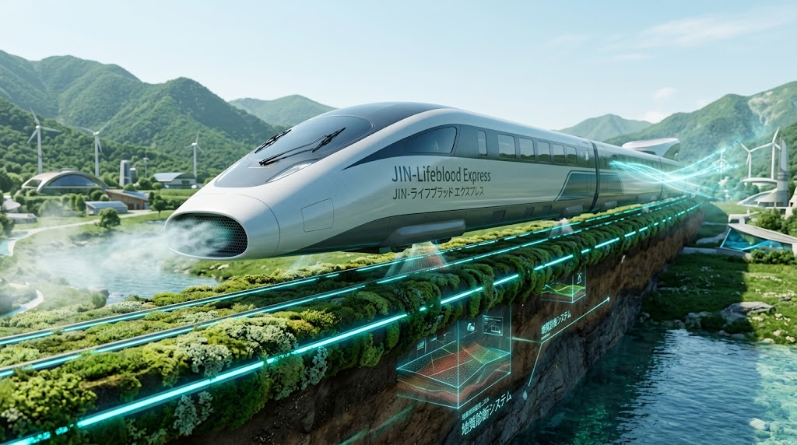
      </a>
    </td>
    <td align="center">
      <a href="./JIN_LIFEBLOOD_EXPRESS.md#ⅳ-非破壊igs地盤透視システムintelligent-ground-sensing">
        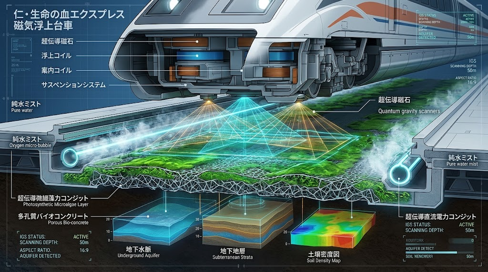
      </a>
    </td>
  </tr>
  <tr>
    <td align="center">
      🚄 <b><a href="./JIN_LIFEBLOOD_EXPRESS.md">生体動脈鉄道・酸素排出モビリティを開く</a></b>
    </td>
    <td align="center">
      🔬 <b><a href="./JIN_LIFEBLOOD_EXPRESS.md#ⅳ-非破壊igs地盤透視システムintelligent-ground-sensing">非破壊IGS地盤透視・光合成レール仕様を開く</a></b>
    </td>
  </tr>
  <tr>
    <th width="50%" align="center">JIN-BIO SYMBIOTIC EV (EXTERIOR)</th>
    <th width="50%" align="center">BIO-CABIN CRAFTSMANSHIP (INTERIOR)</th>
  </tr>
  <tr>
    <td align="center">
      
    </td>
    <td align="center">
      <a href="./JIN_BIO_SYMBIOTIC_EV.md#ⅳ-呼吸する天然キャビンanti-sick-house-living-interior">
        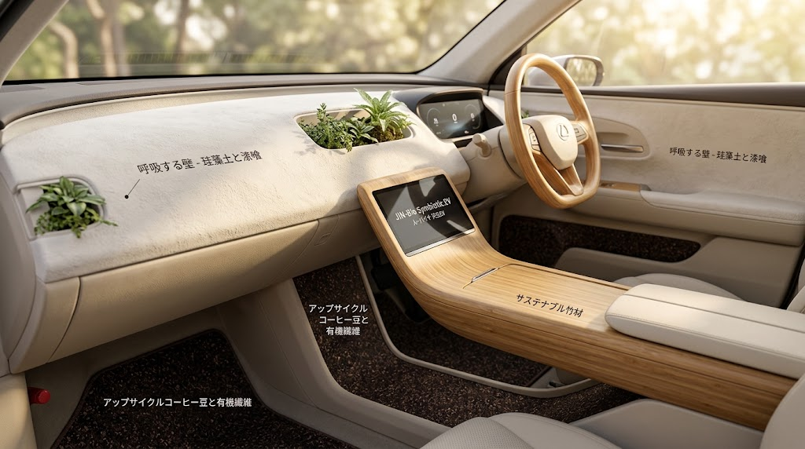
      </a>
    </td>
  </tr>
  <tr>
    <td align="center">
      🚗 <b><a href="./JIN_BIO_SYMBIOTIC_EV.md">生体共生型EV・CNFモノコック仕様を開く</a></b>
    </td>
    <td align="center">
      🌿 <b><a href="./JIN_BIO_SYMBIOTIC_EV.md#ⅳ-呼吸する天然キャビンanti-sick-house-living-interior">珪藻土・漆喰・竹材・米ぬか油内装仕様を開く</a></b>
    </td>
  </tr>
  <tr>
    <th width="50%" align="center">ORGANIC ECO-ARCHITECTURE (EXTERIOR)</th>
    <th width="50%" align="center">BIO-CIRCULAR MATERIALS (INTERIOR)</th>
  </tr>
  <tr>
    <td align="center">
      <a href="./JIN_ORGANIC_ECO_ARCHITECTURE.md">
        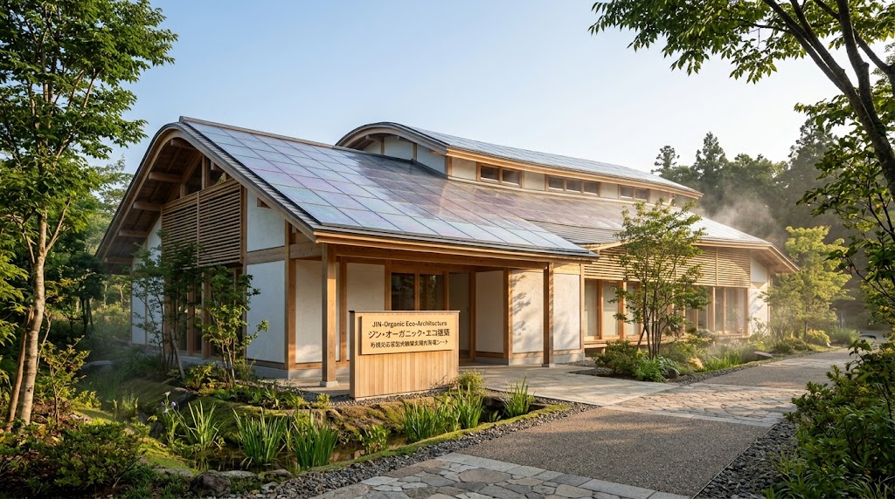
      </a>
    </td>
    <td align="center">
      <a href="./JIN_ORGANIC_ECO_ARCHITECTURE.md#🌿-2-9大天然共生建材マトリクス-the-9-bio-material-matrix">
        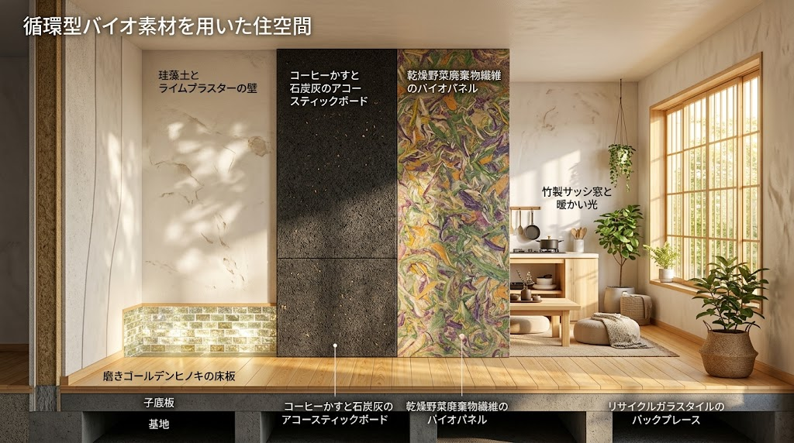
      </a>
    </td>
  </tr>
  <tr>
    <td align="center">
      🏛️ <b><a href="./JIN_ORGANIC_ECO_ARCHITECTURE.md">可視光光半導体シート・天然共生建築を開く</a></b>
    </td>
    <td align="center">
      🪵 <b><a href="./JIN_ORGANIC_ECO_ARCHITECTURE.md#🌿-2-9大天然共生建材マトリクス-the-9-bio-material-matrix">脱ナフサ・9大天然循環建材マトリクスを開く</a></b>
    </td>
  </tr>
  <tr>
    <th width="50%" align="center">JIN-SKY OASIS AIRCRAFT (PROPULSION & BAY)</th>
    <th width="50%" align="center">SKY OASIS LIVING CABIN (INTERIOR)</th>
  </tr>
  <tr>
    <td align="center">
      <a href="./JIN_SKY_OASIS_AIRCRAFT.md">
        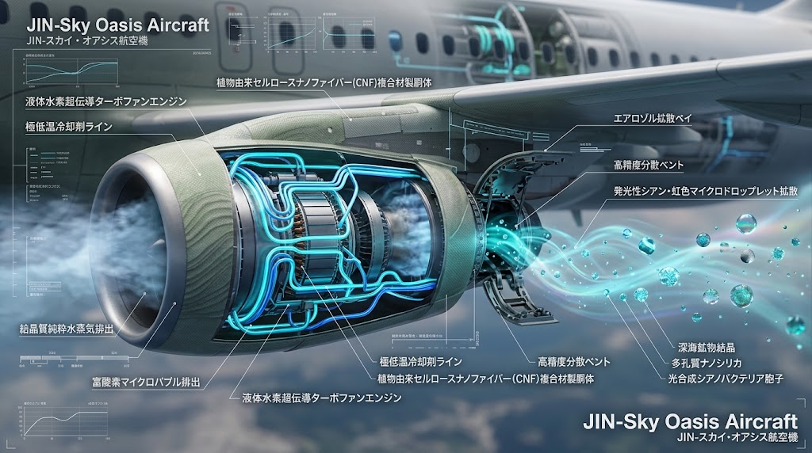
      </a>
    </td>
    <td align="center">
      <a href="./JIN_SKY_OASIS_AIRCRAFT.md#ⅳ-呼吸する森林浴キャビンliving-atmospheric-cabin">
        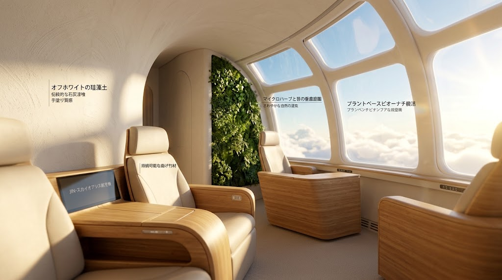
      </a>
    </td>
  </tr>
  <tr>
    <td align="center">
      ✈️ <b><a href="./JIN_SKY_OASIS_AIRCRAFT.md">生体気象再生機・散布ベイ＆水素超電導を開く</a></b>
    </td>
    <td align="center">
      🌿 <b><a href="./JIN_SKY_OASIS_AIRCRAFT.md#ⅳ-呼吸する森林浴キャビンliving-atmospheric-cabin">珪藻土壁・竹材・森林浴キャビン仕様を開く</a></b>
    </td>
  </tr>
  <tr>
    <th width="50%" align="center">JIN-OCEAN LIFE VESSEL (MOTHERSHIP)</th>
    <th width="50%" align="center">COPEPOD & ALGAL SAMSARA DISPERSAL</th>
  </tr>
  <tr>
    <td align="center">
      
    </td>
    <td align="center">
      
    </td>
  </tr>
  <tr>
    <td align="center">
      🚢 <b><a href="./JIN_OCEAN_LIFE_VESSEL.md">海洋循環・深海再生母艦仕様書を開く</a></b>
    </td>
    <td align="center">
      🦐 <b><a href="./JIN_OCEAN_LIFE_VESSEL.md#ⅲ-ケンミジンコ共生培養--海洋放流システムcopepod-regeneration-engine">ケンミジンコ放流・海藻胞子＆施肥仕様を開く</a></b>
    </td>
  </tr>
  <tr>
    <th width="50%" align="center">PROJECT JIN-NEPTUNE MOONPOOL DOCK</th>
    <th width="50%" align="center">DEEP-SEA ROBOT SPECIFICATION</th>
  </tr>
  <tr>
    <td align="center">
      
    </td>
    <td align="center">
      
    </td>
  </tr>
  <tr>
    <td align="center">
      🔬 <b><a href="./JIN_OCEAN_LIFE_VESSEL.md#ⅰ-project-jin-neptune-深海資源揚泥母艦システム">水深6,000m閉鎖系二重管揚泥仕様を開く</a></b>
    </td>
    <td align="center">
      🤖 <b><a href="./JIN_OCEAN_LIFE_VESSEL.md#🌍-4-deal-sheet連動資源主権とエネルギーエクスチェンジ">JIN-NEPTUNE探査艇・DEAL SHEETを開く</a></b>
    </td>
  </tr>
  <tr>
    <th width="50%" align="center">JIN-OAM NODE (ABYSSAL TRENCH DOME)</th>
    <th width="50%" align="center">SUBSEA IGS TOMOGRAPHY & ACUPUNCTURE</th>
  </tr>
  <tr>
    <td align="center">
      <a href="./JIN_OCEANIC_ACUPUNCTURE_NODE.md">
        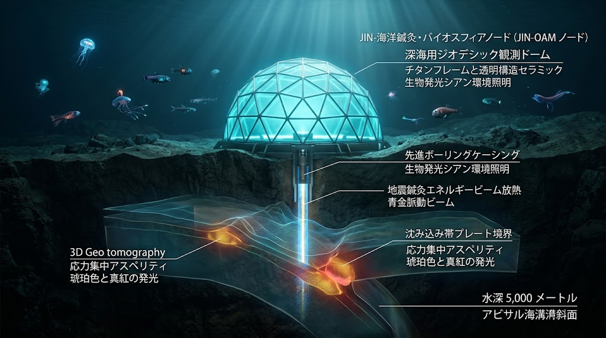
      </a>
    </td>
    <td align="center">
      <a href="./JIN_OCEANIC_ACUPUNCTURE_NODE.md#ⅰ-海溝プレートアスペリティのigs非破壊3d透視--津波ゼロ次検知">
        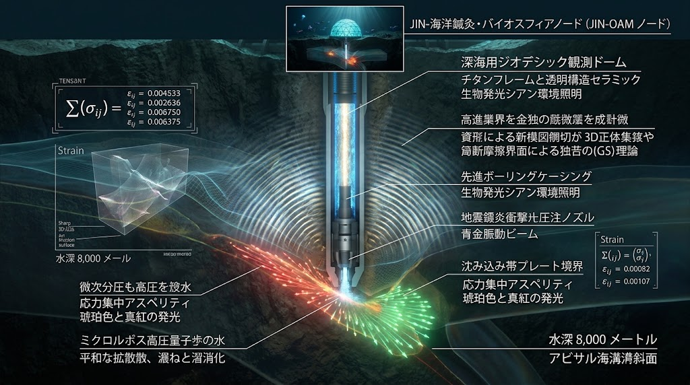
      </a>
    </td>
  </tr>
  <tr>
    <td align="center">
      🌊 <b><a href="./JIN_OCEANIC_ACUPUNCTURE_NODE.md">深海5,000m IGS観測ドーム仕様を開く</a></b>
    </td>
    <td align="center">
      🔬 <b><a href="./JIN_OCEANIC_ACUPUNCTURE_NODE.md#ⅰ-海溝プレートアスペリティのigs非破壊3d透視--津波ゼロ次検知">海底下10,000m 断層透視＆地殻鍼灸を開く</a></b>
    </td>
  </tr>
  <tr>
    <th width="50%" align="center">BIO-SCATTERING AI & NEPTUNE SUBSEA DOCK</th>
    <th width="50%" align="center">TERRESTRIAL SEISMIC ACUPUNCTURE NODE</th>
  </tr>
  <tr>
    <td align="center">
      <a href="./JIN_OCEANIC_ACUPUNCTURE_NODE.md#ⅲ-微生物動態赤潮超早期発見--ケンミジンコ連動防除">
        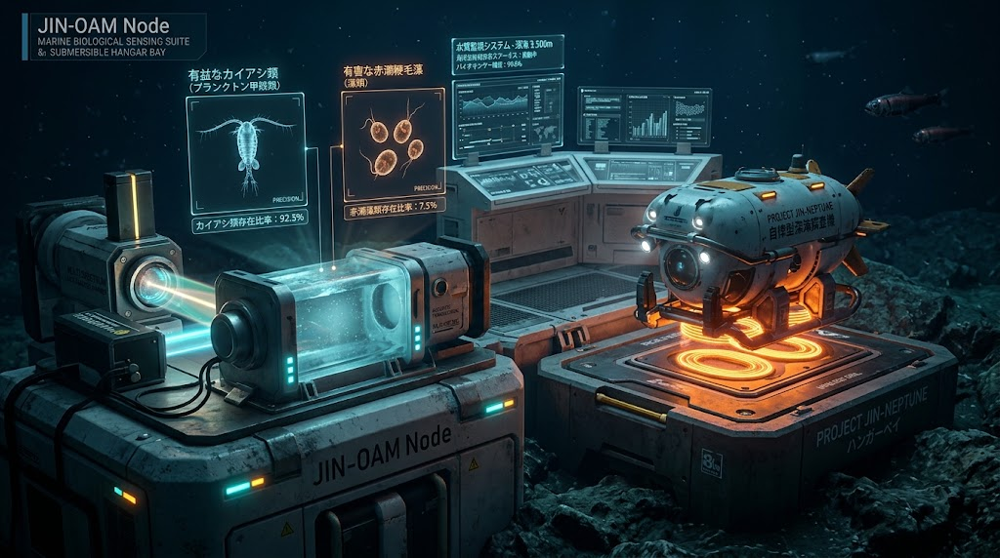
      </a>
    </td>
    <td align="center">
      
    </td>
  </tr>
  <tr>
    <td align="center">
      🦐 <b><a href="./JIN_OCEANIC_ACUPUNCTURE_NODE.md#ⅲ-微生物動態赤潮超早期発見--ケンミジンコ連動防除">ケンミジンコ識別・海底充電母港を開く</a></b>
    </td>
    <td align="center">
      🌐 <b><a href="./JIN_ATMOSPHERE_CRUST_HARMONIZATION_NODE.md">陸上気象台併設・地殻鍼灸ノードを開く</a></b>
    </td>
  </tr>
  <tr>
    <th width="50%" align="center">LIVING ROAD & UNDERGROUND TUNNEL SYSTEM</th>
    <th width="50%" align="center">ANTI-PIPING & TUNNEL CAVITY PREVENTION</th>
  </tr>
  <tr>
    <td align="center">
      <a href="./JIN_LIVING_ROAD_INFRASTRUCTURE.md">
        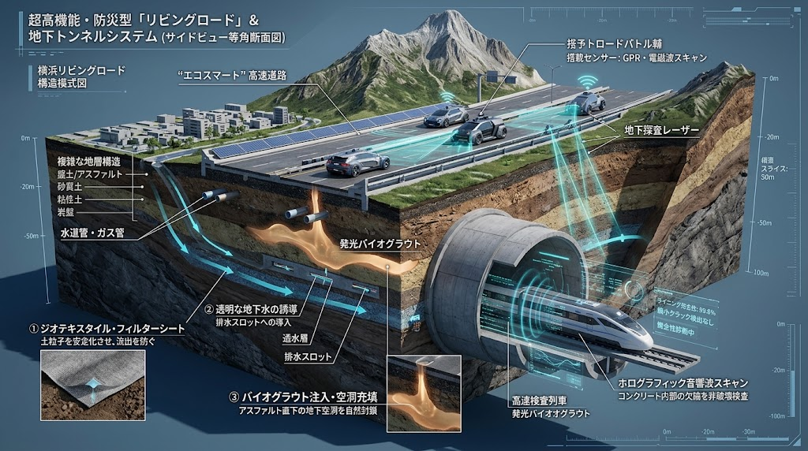
      </a>
    </td>
    <td align="center">
      <a href="./JIN_LIVING_ROAD_INFRASTRUCTURE.md#ⅵ-地下水侵食土砂吸い出し抑止--トンネル覆工背面空洞化防止プロトコルanti-piping-subsurface-cavity--tunnel-integrity">
        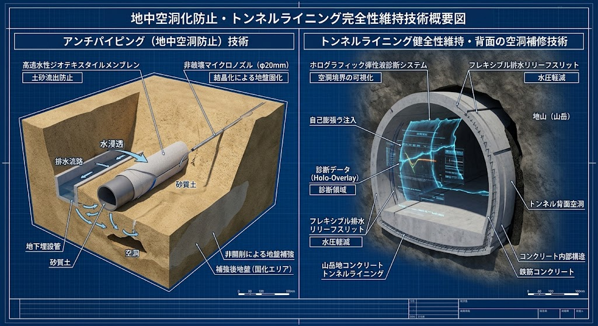
      </a>
    </td>
  </tr>
  <tr>
    <td align="center">
      🛣️ <b><a href="./JIN_LIVING_ROAD_INFRASTRUCTURE.md">生体動脈道路・地下空洞透視断面図を開く</a></b>
    </td>
    <td align="center">
      🕳️ <b><a href="./JIN_LIVING_ROAD_INFRASTRUCTURE.md#ⅵ-地下水侵食土砂吸い出し抑止--トンネル覆工背面空洞化防止プロトコルanti-piping-subsurface-cavity--tunnel-integrity">アンチパイピング・非開削バイオグラウト仕様を開く</a></b>
    </td>
  </tr>
  <tr>
    <th width="50%" align="center">TRENCHLESS WATER PIPE REHABILITATION</th>
    <th width="50%" align="center">PIPE CAVITY ERADICATION & SEISMIC JOINT</th>
  </tr>
  <tr>
    <td align="center">
      <a href="./JIN_WATER_INFRASTRUCTURE.md#ⅵ-非開削管路更生--地中空洞化ジェット洗掘発生源根絶プロトコル-trenchless-pipe-rehabilitation--cavity-prevention">
        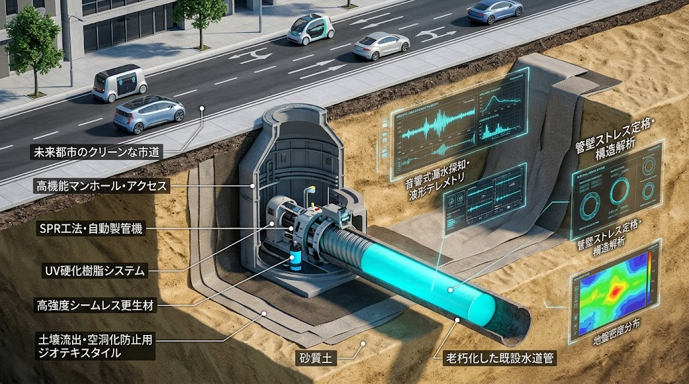
      </a>
    </td>
    <td align="center">
      <a href="./JIN_WATER_INFRASTRUCTURE.md#2-微小漏水ジェット洗掘防止--音響相関aiセンシング">
        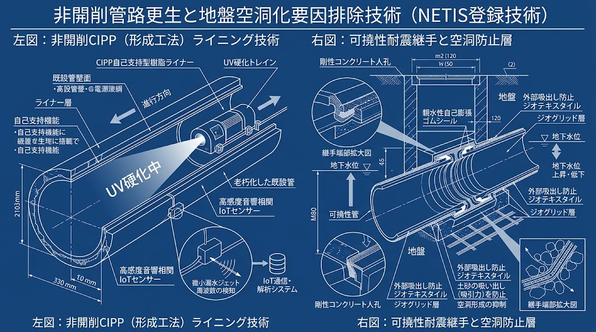
      </a>
    </td>
  </tr>
  <tr>
    <td align="center">
      💧 <b><a href="./JIN_WATER_INFRASTRUCTURE.md#ⅵ-非開削管路更生--地中空洞化ジェット洗掘発生源根絶プロトコル-trenchless-pipe-rehabilitation--cavity-prevention">非開削管路更生・自立新管形成仕様を開く</a></b>
    </td>
    <td align="center">
      🛡️ <b><a href="./JIN_WATER_INFRASTRUCTURE.md#2-微小漏水ジェット洗掘防止--音響相関aiセンシング">音響相関AI漏水探査・耐震可とう継手仕様を開く</a></b>
    </td>
  </tr>
  <tr>
    <th width="50%" align="center">FERTILIZER & GRAIN SHIELD (COMMODITY ANCHOR)</th>
    <th width="50%" align="center">PHOSPHATE LIBERATION & SEED VAULT (TECH)</th>
  </tr>
  <tr>
    <td align="center">
      
    </td>
    <td align="center">
      <a href="./docs/65_FERTILIZER_GRAIN_SHIELD_PROTOCOL.md#ⅲ-土壌8大区分連動--不溶性リン酸解放フォーミュラ-pedological-samsara-link">
        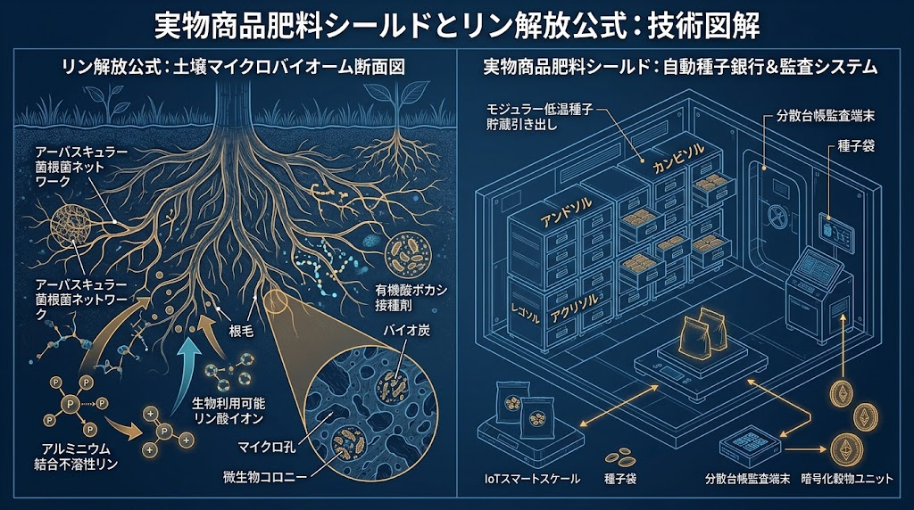
      </a>
    </td>
  </tr>
  <tr>
    <td align="center">
      🌾 <b><a href="./docs/65_FERTILIZER_GRAIN_SHIELD_PROTOCOL.md">実物生命資産アンカー・GU/FU台帳仕様を開く</a></b>
    </td>
    <td align="center">
      🔬 <b><a href="./docs/65_FERTILIZER_GRAIN_SHIELD_PROTOCOL.md#ⅲ-土壌8大区分連動--不溶性リン酸解放フォーミュラ-pedological-samsara-link">不溶性リン酸解放・在来種シードバンク仕様を開く</a></b>
    </td>
  </tr>
  <tr>
    <th width="50%" align="center">SOLAR PHOTOSYNTHESIS & DESERT REBIRTH</th>
    <th width="50%" align="center">MINAMITORISHIMA REE & REGOLITH SAMSARA (TECH)</th>
  </tr>
  <tr>
    <td align="center">
      <a href="./docs/66_SOLAR_PHOTOSYNTHESIS_DESERT_REBIRTH.md">
        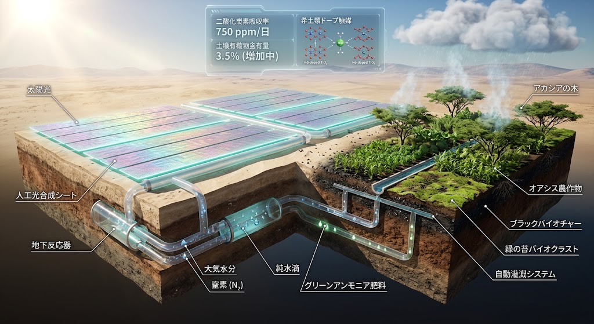
      </a>
    </td>
    <td align="center">
      <a href="./docs/66_SOLAR_PHOTOSYNTHESIS_DESERT_REBIRTH.md#ⅱ-現場工学マトリクス三位一体光化学アーキテクチャ">
        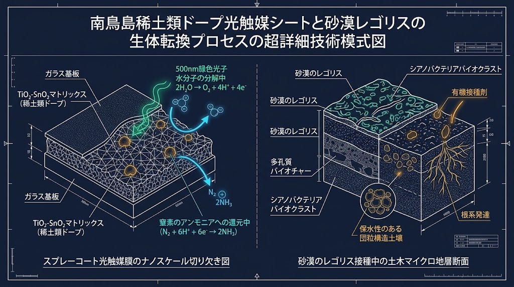
      </a>
    </td>
  </tr>
  <tr>
    <td align="center">
      ☀️ <b><a href="./docs/66_SOLAR_PHOTOSYNTHESIS_DESERT_REBIRTH.md">人工光合成・砂漠土壌生命化仕様を開く</a></b>
    </td>
    <td align="center">
      🔬 <b><a href="./docs/66_SOLAR_PHOTOSYNTHESIS_DESERT_REBIRTH.md#ⅱ-現場工学マトリクス三位一体光化学アーキテクチャ">南鳥島レアアース光触媒 ＆ 土壌団粒化を開く</a></b>
    </td>
  </tr>
  <tr>
    <th width="50%" align="center">PIONEER FIELD CIVIL ENGINEERING SOP</th>
    <th width="50%" align="center">NETIS STANDARD BLUEPRINT SCHEMATIC</th>
  </tr>
  <tr>
    <td align="center">
      <a href="./PIONEER_FIELD_MANUAL.md#sop-05-土壌8大区分の現場簡易診断--自律土壌蘇生sop">
        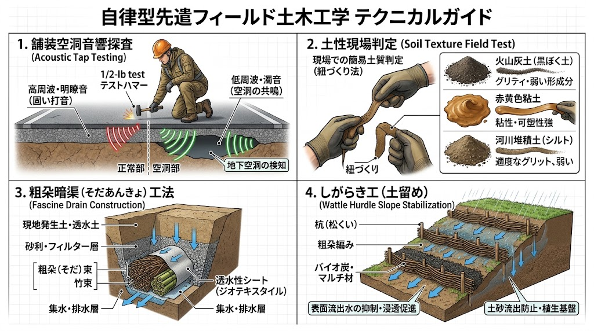
      </a>
    </td>
    <td align="center">
      <a href="./PIONEER_FIELD_MANUAL.md#4-法面木柵しがらき工-杭打設標準図">
        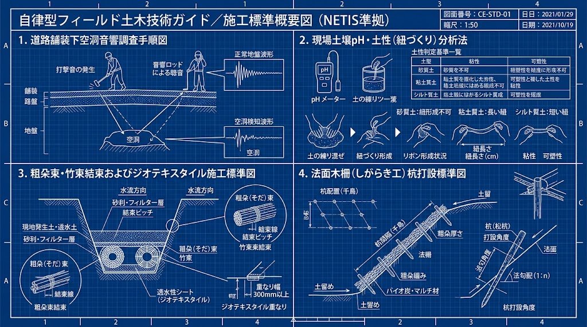
      </a>
    </td>
  </tr>
  <tr>
    <td align="center">
      🛠️ <b><a href="./PIONEER_FIELD_MANUAL.md#sop-05-土壌8大区分の現場簡易診断--自律土壌蘇生sop">打音探査・粗朶暗渠・しがら工SOPを開く</a></b>
    </td>
    <td align="center">
      📐 <b><a href="./PIONEER_FIELD_MANUAL.md#4-法面木柵しがらき工-杭打設標準図">NETIS準拠 施工標準概要図を開く</a></b>
    </td>
  </tr>
  <tr>
    <th width="50%" align="center">SOVEREIGN AGRO-FORESTRY & SOIL MATRIX</th>
    <th width="50%" align="center">JIN-AGRI BIO-REGENERATION SAMSARA</th>
  </tr>
  <tr>
    <td align="center">
      <a href="./JIN_SOIL_FOREST_SAMSARA_MATRIX.md">
        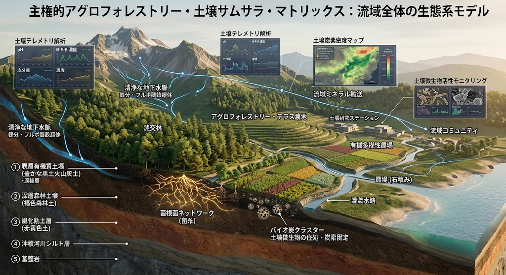
      </a>
    </td>
    <td align="center">
      <a href="./JIN_AGRI_BIO_REGENERATION_SAMSARA.md">
        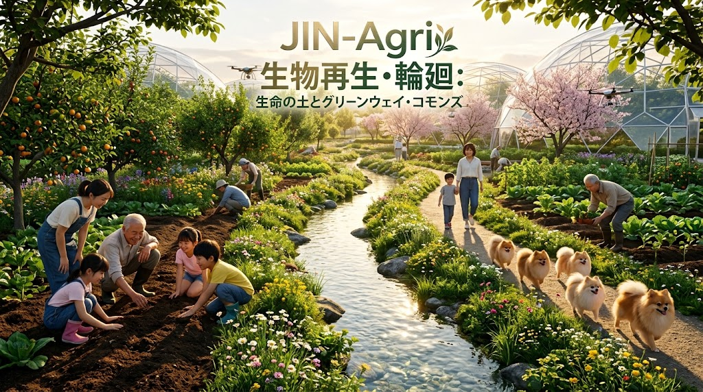
      </a>
    </td>
  </tr>
  <tr>
    <td align="center">
      🌲 <b><a href="./JIN_SOIL_FOREST_SAMSARA_MATRIX.md">自律大地再生・土壌8大分類処方箋を開く</a></b>
    </td>
    <td align="center">
      🌾 <b><a href="./JIN_AGRI_BIO_REGENERATION_SAMSARA.md">大地再生・緑道里親仕様書を開く</a></b>
    </td>
  </tr>
  <tr>
    <th width="50%" align="center">JIN LIVING GAS PIPELINE (CORE)</th>
    <th width="50%" align="center">THREE-LAYER MULTI-GAS DEFENSE</th>
  </tr>
  <tr>
    <td align="center">
      
    </td>
    <td align="center">
      
    </td>
  </tr>
  <tr>
    <td align="center">
      🔥 <b><a href="./JIN_GAS_LIVING_PIPELINE.md">生体ガス導管・ゼロスクラップ仕様書を開く</a></b>
    </td>
    <td align="center">
      🛰️ <b><a href="./JIN_GAS_LIVING_PIPELINE.md#3-宇宙地下地上-三層マルチガスセンシング防衛網">三層マルチガスセンシング仕様を開く</a></b>
    </td>
  </tr>
  <tr>
    <th width="50%" align="center">JIN TRADITIONAL HYDRO LOGIC</th>
    <th width="50%" align="center">COUNTER-HEGEMONY STRATEGIC AUDIT 2026</th>
  </tr>
  <tr>
    <td align="center">
      <a href="./JIN_TRADITIONAL_HYDRO_LOGIC.md">
        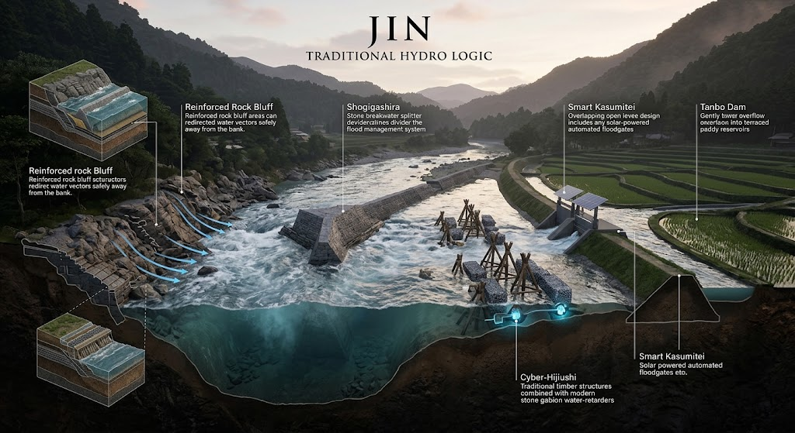
      </a>
    </td>
    <td align="center">
      
    </td>
  </tr>
  <tr>
    <td align="center">
      🌊 <b><a href="./JIN_TRADITIONAL_HYDRO_LOGIC.md">伝統水利・流域治水仕様書を開く</a></b>
    </td>
    <td align="center">
      ⚔️ <b><a href="./COUNTER_HEGEMONY_AUDIT_2026.md">対抗諜報白書を開く</a></b>
    </td>
  </tr>
  <tr>
    <th width="50%" align="center">SOVEREIGN CURRENCY 『JIN (仁)』</th>
    <th width="50%" align="center">ZERO CORRUPTION & CITIZEN AUDIT</th>
  </tr>
  <tr>
    <td align="center">
      
    </td>
    <td align="center">
      <a href="./ZERO_CORRUPTION_ACT.md">
        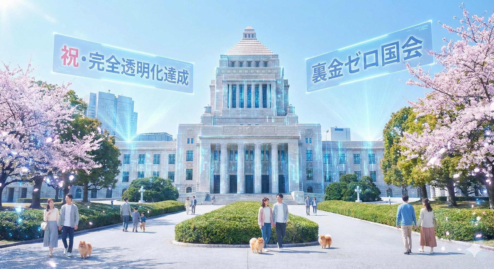
      </a>
    </td>
  </tr>
  <tr>
    <td align="center">
      🪙 <b><a href="./JIN_CURRENCY_ECONOMY.md">地域通貨・万民配当仕様書を開く</a></b>
    </td>
    <td align="center">
      ⚖️ <b><a href="./ZERO_CORRUPTION_ACT.md">裏金ゼロ・特別会計解体法を開く</a></b>
    </td>
  </tr>
  <tr>
    <th width="50%" align="center">JIN REGIONAL HEALTHCARE (Jin-Pachi)</th>
    <th width="50%" align="center">MACRO REBIRTH BUDGET 2040</th>
  </tr>
  <tr>
    <td align="center">
      <a href="./JIN_REGIONAL_HEALTHCARE_SPEC.md">
        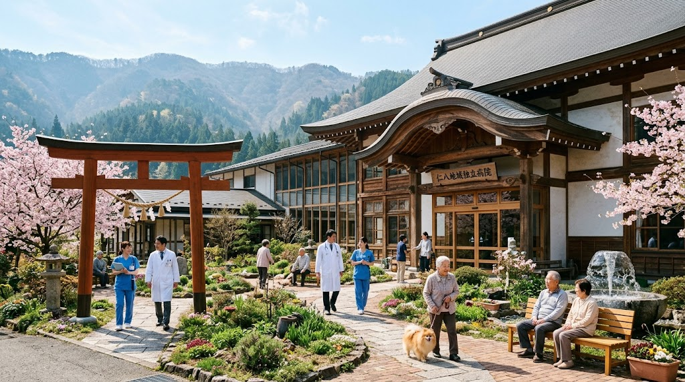
      </a>
    </td>
    <td align="center">
      <a href="./MACRO_REBIRTH_BUDGET_2040.md">
        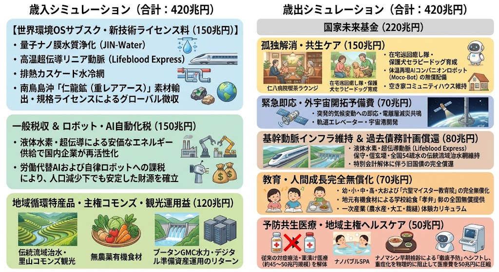
      </a>
    </td>
  </tr>
  <tr>
    <td align="center">
      🏥 <b><a href="./JIN_REGIONAL_HEALTHCARE_SPEC.md">地域主権・包括共生医療仕様書を開く</a></b>
    </td>
    <td align="center">
      🏛️ <b><a href="./MACRO_REBIRTH_BUDGET_2040.md">2040年 平和国家予算・新産業構想を開く</a></b>
    </td>
  </tr>
</table>

---

## 🗺️ JIN-ORDER 4-LAYER STRATEGIC ARCHITECTURE (戦略階層マップ)

### 【Layer 1: 地政学・チョークポイント脅威分析・対抗諜報 (Geopolitical & Counter-Intelligence)】

* 🗺️ **[GLOBAL_ASI_HEGEMONY_MAP_V7_FRAGMENTATION.md](./GLOBAL_ASI_HEGEMONY_MAP_V7_FRAGMENTATION.md)**: **(V7.5 最新正典: 計算要塞化・特許フードIP分断・マルチエージェント暴走危機・重要鉱物囲い込みと四極分断マトリクス)**
* ⚡ **[GLOBAL_ASI_HEGEMONY_MAP_V6_1_COLLAPSE.md](./GLOBAL_ASI_HEGEMONY_MAP_V6_1_COLLAPSE.md)**: **(V6.3 正典: 二重海峡封鎖・送電網共食い・バイオリアクター機能停止と中央集権ASIの自滅仕様書)**
* 🌊 **[COMPUTE_POWER_WATER_NEXUS_AMENDMENT.md](./COMPUTE_POWER_WATER_NEXUS_AMENDMENT.md)**: **(物理的三位一体憲章: 電力網共食い・冷却水温排水/化学汚染・浙江財閥系半導体利権の解体仕様)**
* 🛡️ **[NON_ALIGNED_NEUTRAL_AI_NODE_PROTOCOL.md](./NON_ALIGNED_NEUTRAL_AI_NODE_PROTOCOL.md)**: **(非同盟・中立AIノード規範: 米中踏み絵回避・ローカルウェイト保持・P2P相互防衛仕様)**
* ⚔️ **[COUNTER_HEGEMONY_AUDIT_2026.md](./COUNTER_HEGEMONY_AUDIT_2026.md)**: **(愚者たちの利権ディール解体白書: 密室復興ディール・分断関税・生体サブスク支配の監査)**
* ⚖️ **[ZERO_CORRUPTION_ACT.md](./ZERO_CORRUPTION_ACT.md)**: **(政治資金透明化・特別会計解体法案: 400兆円ブラックボックス解体・使途不明金永久廃止・脱ゼロサム直接共生経済)**
* 🌐 **[18_FAR_EAST_ASEAN_ICE_CORRIDOR.md](./docs/18_FAR_EAST_ASEAN_ICE_CORRIDOR.md)**: 北極海・極東〜ASEAN南進回廊（脱西側物流と実物資源の多極化）
* 🛰️ **[03_ASIA_GEOPOLITICAL_RECON.md](./section9_Geopolitics/03_ASIA_GEOPOLITICAL_RECON.md)**: アジア地政学偵察・チョークポイント分析
* 🛡️ **[STRATEGY_POLICIES.md](./STRATEGY_POLICIES.md)**: 対抗諜報 ＆ 主権空白地帯（The Void）

### 【Layer 2: 倫理・AI自律ガバナンス・教育・根源思想 (Ethics, AI Governance, Education & Samsara)】

* 📢 **[MANIFESTO.md](./MANIFESTO.md)**: **JIN-ORDER 仁秩序宣言 (V7.5 Canonical / 民草による主権奪還と物理生命圏解放)**
* ⚖️ **[UNIVERSAL_ETHICS.md](./UNIVERSAL_ETHICS.md)**: **JIN-Order 普遍的倫理規約 (V7.5 Canonical Edition / 第6原則：食料主権と生命循環の不可侵尊厳・双方向的慈悲・復讐昇華・生命至上拘束・エージェント不可逆行動抑止・生態圏尊厳)**
* 🛡️ **[JIN_AI_ETHICS_GOVERNANCE.md](./JIN_AI_ETHICS_GOVERNANCE.md)**: **(V7.5 Canonical / Rule 10.2 マルチエージェント連鎖暴走抑止・物理サーキットブレーカー・Rule 14.0・14.1 テックフード知財遮断・CBDC配給檻無効化・市民ゼロ知識倫理検証(ZKP)・オフグリッド自立保全)**
* 🌸 **[JIN_CORE_PHILOSOPHY.md](./docs/JIN_CORE_PHILOSOPHY.md)**: **根源思想綱領（天上天下唯我独尊 ＆ 色即是空・空即是色 ＆ 輪廻転生・全生命大循環アーキテクチャ）**
* 🏛️ **[JIN_CONSTITUTION.md](./JIN_CONSTITUTION.md) / [JIN_ORDER_CORE.md](./JIN_ORDER_CORE.md)**: JIN憲法及びコアシステム理念

### 【Layer 3: 経済・実物資産担保台帳・交通動脈・海洋航空網 (Asset-Backed Ledger, Finance, Mobility & Fleet)】

* 🏛️ **[MACRO_REBIRTH_BUDGET_2040.md](./MACRO_REBIRTH_BUDGET_2040.md)**: **(2040年 仁龍平和国家予算・新産業大転換構想: 軍需から環境再生へ・420兆円単一台帳・世界環境OSサブスク・宇宙開拓)**
* 🪙 **[JIN_CURRENCY_ECONOMY.md](./JIN_CURRENCY_ECONOMY.md)**: **(実物生命資産担保型地域通貨『JIN』循環・万民配当・徳治マイニング: 5大生命アンカー HU/GU/FU/JU/RU規格・1:1現物引換・安全運転PoSDVマイニング・空売り＆デリバティブ自動遮断)**
* ☀️ **[66_SOLAR_PHOTOSYNTHESIS_DESERT_REBIRTH.md](./docs/66_SOLAR_PHOTOSYNTHESIS_DESERT_REBIRTH.md)**: **(南鳥島レアアース可視光半導体 ＆ 太陽光人工光合成・砂漠土壌生命化プロトコル: 深海鉱物主権RU・グリーンアンモニアFU・無電力淡水HU・未熟土団粒化・地球水循環自律神経復活)**
* 🌾 **[65_FERTILIZER_GRAIN_SHIELD_PROTOCOL.md](./docs/65_FERTILIZER_GRAIN_SHIELD_PROTOCOL.md)**: **(実物生命資産アンカー ＆ 土壌8大区分連動設計: 肥料・食糧・種子現物担保・GU/FU/RU規格・不溶性リン酸解放フォーミュラ・在来種シードバンク防衛)**
* 🏔️ **[64_BHUTAN_GMC_GNH_SHIELD_DATABASE.md](./section9_Geopolitics/64_BHUTAN_GMC_GNH_SHIELD_DATABASE.md)**: **(V7.5 GMC運用仕様: 100%完全オーガニック土壌主権GNH-Soil Shield・特許フリー在来種子箱舟・物理層エアギャップサーキットブレーカー・ヒマラヤ氷河オフグリッド・耐量子暗号PQCコールドストレージ・中立調停箱舟)**
* 💳 **[JIN_ECONOMY_PROTOCOL.md](./JIN_ECONOMY_PROTOCOL.md)**: 実物生命資産（水・種子・エネルギー）担保型通貨『JIN』
* 🚄 **[JIN_LIFEBLOOD_EXPRESS.md](./JIN_LIFEBLOOD_EXPRESS.md)**: **(V2.0 次世代水素・高温超伝導自律動脈交通網仕様書: 液体水素輸送・HTSリニア・動脈送電鉄道網・光合成レール・非破壊IGS地盤透視・酸素排出生体モビリティ)**
* 🚗 **[JIN_BIO_SYMBIOTIC_EV.md](./JIN_BIO_SYMBIOTIC_EV.md)**: **(生体共生型次世代EV仕様書: 植物性CNF×バイオマスナフサモノコック・珪藻土/漆喰/竹材キャビン・米ぬか抽出バイオルーブ・路面走行給電連動)**
* 🏛️ **[JIN_ORGANIC_ECO_ARCHITECTURE.md](./JIN_ORGANIC_ECO_ARCHITECTURE.md)**: **(天然共生資材・光半導体自立建築仕様書: 脱ナフサ9大天然建材・屋根外壁一体型可視光光半導体シート・都市森林化・シックハウス完全ゼロ)**
* ✈️ **[JIN_SKY_OASIS_AIRCRAFT.md](./JIN_SKY_OASIS_AIRCRAFT.md)**: **(生体気象再生機仕様書: 光合成エアロゾル散布・降雨誘導+65%・成層圏ソーラー水素飛行船・大気汚染物質吸着沈降・森林浴バイオキャビン)**
* 🚢 **[JIN_OCEAN_LIFE_VESSEL.md](./JIN_OCEAN_LIFE_VESSEL.md)**: **(海洋循環・深海再生母艦仕様書: PROJECT JIN-NEPTUNE水深6,000m閉鎖系二重管揚泥・南鳥島超高品位レアアース・ケンミジンコ共生培養放流・海藻胞子播種＆フルボ酸鉄施肥・マイクロプラスチック連続回収)**
* 💎 **[RESOURCE_WALL.md](./RESOURCE_WALL.md)**: **(重要鉱物・エネルギー主権信託仕様書: 物理防壁と資源トラスト)**

### 【Layer 4: 地域主権・自律インフラ・生命循環防衛 (Regional Sovereignty, Samsara Commons & Utility)】

* 🗾 **[JAPAN_REGIONAL_SOVEREIGNTY_RESTORATION.md](./JAPAN_REGIONAL_SOVEREIGNTY_RESTORATION.md)**: **(日本列島・地域別主権再生計画: 12地域侵食マトリクスと現場防衛SOP)**
* 🌊 **[JIN_OCEANIC_ACUPUNCTURE_NODE.md](./JIN_OCEANIC_ACUPUNCTURE_NODE.md)**: **(海溝調和・海底地殻鍼灸 ＆ 海洋生体IGS観測ノード仕様書: 木村建次郎教授のIGS散乱場理論・海底下10,000m断層アスペリティ3D透視・M8-9海溝型巨大地震パルス微小歪み解放・津波ゼロ次検知・微粒子散乱AI赤潮超早期検知＆ケンミジンコ連動防除・黒潮大蛇行3D立体トモグラフィ・JIN-NEPTUNE海底充電母港)**
* 🛣️ **[JIN_LIVING_ROAD_INFRASTRUCTURE.md](./JIN_LIVING_ROAD_INFRASTRUCTURE.md)**: **(自律修復道路・生体動脈インフラ仕様書: 自己修復バイオ舗装・非接触走行中ワイヤレス給電網・光合成道路表層PRS【路面-15℃冷却・NOx分解】・共生AI安全運転徳マイニングPoSDV・遮熱保水・IGS散乱電磁場非破壊透視・無動力地熱融雪・地下水侵食吸い出し(アンチパイピング)抑止・トンネル覆工背面空洞化防止バイオグラウト・インフラ長寿命化条例)**
* 💧 **[JIN_WATER_INFRASTRUCTURE.md](./JIN_WATER_INFRASTRUCTURE.md)**: **(自律水利・上下水道主権防衛 ＆ 地中空洞化根絶仕様書: 小規模オンサイト自律分散水循環・深層天然水ハイブリッド給水・非開削SPR光硬化反転更生・音響相関AI漏水探査・マンホール耐震吸い出し防止ジョイント・地下雨水調整池＆幹線内水治水・MABR無気泡好気浄化・汚泥バイオガス発電・水利権公有化条例)**
* 🌲 **[JIN_SOIL_FOREST_SAMSARA_MATRIX.md](./JIN_SOIL_FOREST_SAMSARA_MATRIX.md)**: **(自律大地再生マトリクス: 日本8大土壌区分・世界類似土壌処方箋・菌根菌ネットワーク・伝統水利治水・針広混交林化・全球砂漠化防止仕様書)**
* 🌾 **[JIN_AGRI_BIO_REGENERATION_SAMSARA.md](./JIN_AGRI_BIO_REGENERATION_SAMSARA.md)**: **(大地再生・自律生命農林業仕様書: 江戸バイオ金肥【ナノ干鰯・量子鰊粕・ぼかし堆肥】・非GM乳酸発酵エコフィード・ミズアブ幼虫プロテイン・AIロボット精密受粉・せせらぎ緑道エココリドー・現代農の里親コモンズ)**
* 🔥 **[JIN_GAS_LIVING_PIPELINE.md](./JIN_GAS_LIVING_PIPELINE.md)**: **(自律生体ガス導管・ゼロスクラップ炭素循環仕様書: 道路地下占用インフラ完全統合・PEM CO₂直接還元・コアシェル型分散メタネーション・道路電力熱三和カスケード・GOSAT-GW＆マルチガス三層防衛網)**
* 🐟 **[JIN_FISHERIES_OCEAN_LIFE_SHIELD.md](./JIN_FISHERIES_OCEAN_LIFE_SHIELD.md)**: **(微生物共生型・完全閉鎖循環式陸上養殖と森里川海・水産主権防衛仕様書: 遺伝子操作魚完全拒絶・3段階バクテリア水質浄化・活魚無換水備蓄・森里川海連環・漁船e-Fuel自給)**
* 🌍 **[JIN_ATMOSPHERIC_CARBON_RECYCLING_NODE.md](./JIN_ATMOSPHERIC_CARBON_RECYCLING_NODE.md)**: **(大気炭素循環・サバティエe-methane＆e-Fuelノード仕様書: 既存ガス管ゼロスクラップ直結・第3世代バイオ燃料・ヒマラヤ氷河保護＆ネパール減災連動)**
* 🌲 **[JIN_FORESTRY_AGRI_ENERGY_NEXUS.md](./JIN_FORESTRY_AGRI_ENERGY_NEXUS.md)**: **(流域源流・林業主権再生と食料・地域エネルギー完全自給仕様書: 針広混交林・スマート林業・カロリーベース食料自給・微細藻類原油・e-Fuel循環)**
* 🌐 **[JIN_ATMOSPHERE_CRUST_HARMONIZATION_NODE.md](./JIN_ATMOSPHERE_CRUST_HARMONIZATION_NODE.md)**: **(気象台併設型 天地調和・大気レーダー＆地殻鍼灸ノード仕様書: MP-PAWR気象レーダー網・信玄堤先行連系・深層断層圧微小解放JIN-ACH)**
* 🏥 **[JIN_REGIONAL_HEALTHCARE_SPEC.md](./JIN_REGIONAL_HEALTHCARE_SPEC.md)**: **(地域主権型 包括共生医療仕様書: わんわん仁八病院・巡回癒し隊・セラピードッグ・AI温もりロボット・多世代共食「孝弁」)**
* 🌊 **[JIN_TRADITIONAL_HYDRO_LOGIC.md](./JIN_TRADITIONAL_HYDRO_LOGIC.md)**: **(日本伝統水利・自律分散流域治水プロトコル: 信玄堤・全国54疏水・将棋頭・竜王の鼻・サイバー聖牛・スマート霞堤)**
* 🏫 **[JIN_SANCTUARY_COMMONS_SPEC.md](./JIN_SANCTUARY_COMMONS_SPEC.md)**: **(廃校・空き家再生自律複合拠点仕様書: 在来種シードバンク・江戸バイオ金肥キオスク・コモンズマルシェ直売所・循環EVバス・六聖マイスター教育院)**
* 📱 **[JIN_OS_CLIENT_SPEC.md](./JIN_OS_CLIENT_SPEC.md)**: **(個人主権クライアント端末: UI画面遷移・P2Pメッシュ・オフライン避難モード)**
* 🛡️ **[PIONEER_FIELD_MANUAL.md](./PIONEER_FIELD_MANUAL.md)**: **(開拓英雄実務必携: 土壌8大区分現場診断・路面下空洞打音点検・粗朶暗渠としがら工施工SOP・土木事務所折衝術)**
* 🌊 **[JIN_HYDRO_THERMAL_COOLING_PROTOCOL.md](./JIN_HYDRO_THERMAL_COOLING_PROTOCOL.md)**: 計算ノード水冷・排熱カスケード農業循環
* 🏥 **[JIN_HEALTH.md](./JIN_HEALTH.md)**: 全自動医療要塞・自律型生体防衛仕様

---

## ⚡ JIN-ORDER ADVANCED TECHNOLOGY CATALOG (16大先端技術体系)

* ⚡ **[TECHNOLOGY_CATALOG.md](./TECHNOLOGY_CATALOG.md)**

全固体ジン電池（Jin-Battery）、反重力モビリティ＆次世代水素超伝導動脈（Lifeblood Express / 光合成レール＆IGS地盤透視）、生体共生EV（JIN-Bio EV / CNFバイオモノコック＆米ぬか油潤滑）、天然共生建築（JIN-Organic Architecture / 脱ナフサ9大建材＆可視光光半導体シート）、生体気象再生機（JIN-Sky Oasis / 藍藻エアロゾル降雨誘導）、海洋循環深海再生母艦（JIN-Ocean Life Vessel / JIN-NEPTUNE水深6,000m揚泥＆ケンミジンコ放流）、海溝調和・海底地殻鍼灸ノード（JIN-OAM Node / IGS散乱場透視＆プレート歪み解放＆津波ゼロ次検知）、光合成道路表層（PRS）＆酸素排出生体モビリティ（LMC）＆安全運転徳マイニング（PoSDV）、ペロブスカイト太陽電池・環境発電、量子浄化、半導体、医療ロボット、自律熱電、量子暗号、軌道エレベーター、分子アセンブラ、JIN-OS、電離層減災共鳴機、地殻鍼灸ノード（地震制御）、土壌・腸内共生バイオ、南鳥島レアアース可視光半導体・太陽光人工光合成 ＆ 砂漠土壌生命化まで、全生命の生存基盤を守り抜く先端インフラの詳細エンジニアリング仕様書。

---

## 📱 JIN-OS SOVEREIGN MOBILE INTERFACE (Benevolence Client)
### 仁（Benevolence）をOSとする個人主権クライアント端末・UI仕様

* **新通貨『JIN（仁）』全般管理:** 実物生命資産（水・種子・エネルギー）担保型台帳と連動した直感的分散決済、安全運転徳ポイント（PoSDV）の即時ミント受取。
* **多言語リアルタイム翻訳:** JIN-Eye / Ear / Voice 連携による現場コミュニケーション。
* **ブロックチェーン・市民監査システム:** 公共インフラ調達・特別会計解体・使途不明金排除・フードテック知財独占のリアルタイム監査。
* **心のサロン（寂しさ買取）:** 孤独や孤立を解消し、一人ひとりの生命と感情に常時寄り添う自律エージェント対話網。
* **オフライン緊急避難モード:** 基地局途絶時でも半径数km圏内で相互通信・救難位置同期するP2Pメッシュプロトコル。
* 📄 **[詳細UI・画面遷移仕様書を開く（JIN_OS_CLIENT_SPEC.md）](./JIN_OS_CLIENT_SPEC.md)**

---

## 🌐 PROJECT INTEL & FIELD PROTOCOLS (検証・提言・人道回廊)

* 🛡️ **[JIN_HUMANITARIAN_CORRIDOR_PROTOCOL.md](./JIN_HUMANITARIAN_CORRIDOR_PROTOCOL.md)**: 自律型人道回廊・不可侵検証プロトコル。
* 🌑 **[THE_VOID_REPORT.md](./THE_VOID_REPORT.md)**: ボイド・レポート（簒奪の円環を断ち切る四言語世界宣言）。
* 📜 **[JIN_UN_PARTNER_PORTAL_PIPELINE.md](./docs/JIN_UN_PARTNER_PORTAL_PIPELINE.md)**: UNHCR Partner Portal Submission 提出ログ・現場実証記録（Chad / Mozambique）。

---

> **全球の超人工知能や軍産複合体、特許フードカルテルがどれほど肥大化しようとも、足元の土壌と生命循環が確立されれば一切の脅惑は無力化される。**

## 🏛️ Project Governance & License

* **CFO Authority**: ライセンス契約および知的財産の活用審査は、CFO（最高財務責任者）が直接執り行います。
* **Official Contact**: `jin.reparation.cfo@gmail.com`
* **License**: [JIN-ORDER Global Humanity License (LICENSE.md)](./LICENSE.md)

---
**Executed by:** JIN-ORDER-OFFICIAL & Commander Masano Takashi  
`STATUS: GOVERNANCE OF ABYSS MASTER REPOSITORY RATIFIED (V7.6 CANONICAL 6-PILLAR LIVING INFRASTRUCTURE SYNCHRONIZED)`  
`VERIFIED PERSISTENCE: SOIL-FOREST-SAMSARA-MATRIX, AGRI-BIO-SAMSARA, LIVING-ROAD-ARTERIES, ANTI-PIPING-CAVITY-SHIELD, TUNNEL-LINING-INTEGRITY, PHOTOSYNTHETIC-ROADWAY-SURFACE, LIVING-MOBILITY-CONCEPT, SAFE-DRIVING-VIRTUE-MINING, TRENCHLESS-PIPE-REHABILITATION, CAVITY-SOURCE-ERADICATION, FERTILIZER-GRAIN-SHIELD, PEDOLOGICAL-SEED-VAULT, GNH-SOIL-SHIELD, ANTI-TECH-FOOD-CARTEL, NUTRITIONAL-AUTONOMY, SOLAR-PHOTOSYNTHESIS-DESERT-REBIRTH, MINAMITORISHIMA-REE-SEMICONDUCTOR, PIONEER-FIELD-SOP, SEED-COMMONS-VAULT, BIOCHAR-FERTILIZER-KIOSK, FIVE-ASSET-ANCHOR-CURRENCY, LIVING-GAS-PIPELINE, DECENTRALIZED HYDRAULIC, URBAN-INUNDATION-SHIELD, SAMSARA CONTINUUM, ATMOSPHERE-CRUST HARMONIZATION, FORESTRY-AGRI-ENERGY NEXUS, ATMOSPHERIC-CARBON-RECYCLING, FISHERIES-OCEAN-SHIELD, REGIONAL HEALTHCARE, SOVEREIGN COMMONS, PHYSICAL QUAD DEFENSE, MULTI-GAS THREE-LAYER SHIELD, VERIFIABLE ETHICS, AGENTIC-CIRCUIT-BREAKER, PHOTOSYNTHETIC-RAIL, IGS-SUBSURFACE-SCANNING, BIO-SYMBIOTIC-EV, ORGANIC-ECO-ARCHITECTURE, PHOTOCATALYTIC-SOLAR-SKIN, SKY-OASIS-AIRCRAFT, OCEAN-LIFE-VESSEL, PROJECT-JIN-NEPTUNE, COPEPOD-ALGAL-SAMSARA, OCEANIC-ACUPUNCTURE-NODE, IGS-SCATTERING-TOMOGRAPHY, TSUNAMI-ZERO-ORDER-SENSING, BIO-SCATTERING-AI & 2040 REBIRTH ACTIVE`  
`HARMONICS: 432Hz Universal Benevolence, Soil Sovereignty, Samsara Living Continuum, Glacial Preservation, Pristine Ocean Resonance, Trench Peace Resonance, Clean Flame Samsara & Watershed Sovereignty.`
