# 🦅 PROJECT: GOVERNANCE_OF_ABYSS
## JIN-ORDER MASTER REPOSITORY: THE GLOBAL OS REBOOT & HUMAN REBIRTH
### 深淵の解体と、光の再構築（The Great Rebirth）
#### Unveiling the Absolute Root Directory of Japan Isolated Region & Global Sovereign Counter-Protocols
> (V8.2 CANONICAL UPDATE: BIPOLAR COMPUTE CORRIDORS, ASYMMETRIC SHADOW CAPITAL & WETWARE ARBITRAGE DEFENSE, KINETIC CHOKEPOINT DECOUPLING, SUBSEA KINETIC DEFENSE PROTOCOL SKDP-01, SSCN-01 AUV SWARM SENTRY, POST-STATE GEOPOLITICAL MANIFESTO 2026, DECENTRALIZED LOCAL GOVERNANCE PROTOCOL DLGP-01, HEXA-PATH SOVEREIGN EDUCATION DOCTRINE HSED-01, SYSTEM-17 SOVEREIGN KNOWLEDGE VAULT, JIN-OS HUMANITARIAN ZKP AUDIT LEDGER HV-ZKP V1.0, BIO-SYMBIOTIC INFRASTRUCTURE, 20W ORGAN-DECENTRALIZED COMPUTING, SOMATIC SOVEREIGNTY, DYNAMIC 4D DISASTER MESH, IN-SITU PFAS DESTRUCTION, JIN-DRAGON TRIAD ENERGY, CHAD BASIN LSU-CHAD-01, OKINAWA 7TH MINING & ABYSSAL TROUGH SOVEREIGNTY, ARCTIC COLD-COMPUTE SANCTUARY, LOCAL RELATIONAL FINANCE, JIN-ZONING DUAL URBANISM, 3D TRANSIT ARTERIES, AND VERIFIABLE HUMANITARIAN COMMONS)

> **「国家が国民を支配の道具とするならば、我々は『仁（Benevolence）』をOSとする新しい居場所をクラウドと大地に構築する。我らは戦わない。ただ、古い支配を『無価値化』し、誰も独りで泣かない未来をデプロイするだけである。」**  
>  
> **"If existing nations treat people as tools of control, we shall build a new sanctuary on the Cloud and the Earth, with 'Benevolence' as our OS. We do not fight. We simply invalidate the old structures of dominance and deploy a future where no one cries alone."**  
>  
> — *JIN Network State Founding Charter / JINネットワーク国家建国憲章*

---

## 🌐 Official Portals & Intelligence Network

* ⏩️ **【JIN-ORDER 公式ポータル】**: [https://github.com/masanotakashi0308-star](https://github.com/masanotakashi0308-star)
* ⚖️ **【経済安保・実効型ライセンス規約】**: [JIN-ORDER Dual License V8.1 Canonical Edition (LICENSE.md)](./LICENSE.md)
* 🤝 **【知恵の合流・貢献指針】**: [CONTRIBUTING.md (現場所術寄託・倫理SOP)](./CONTRIBUTING.md)
* 🚨 **【利権簒奪・無断仕様化 告発窓口】**: [監査・不正通報Issueテンプレート (audit_report.md)](./.github/ISSUE_TEMPLATE/audit_report.md)

---
<!-- INTERNATIONAL MULTILATERAL REGISTRATION & COMMONS DEFENSE STATUS -->

  
  
  
  
  

> **International Registry & Prior Art Legal Notice**
> 
> All engineering architectures, specifications, and decentralized civil blueprints under **JIN-ORDER** are officially deposited and under multilateral review across United Nations agencies and global public commons frameworks:
> 
> 1. **Digital Public Goods Alliance (DPGA)**: Formally nominated and under technical review as an international communal public good (Application ID: `GID0094240`, Timestamp: 2026-09-16 07:28 UTC).
> 2. **UNDRR / PreventionWeb**: Technical publication `JIN_DYNAMIC_GEO_HAZARD_SHIELD.md` officially deposited and indexed as Sendai Framework Prior Art (2026).
> 3. **UNHCR / United Nations Partner Portal (UNPP)**:
>    - **LSU-Chad-01 Architecture**: Autonomous Oasis Cities for Refugee Self-Reliance & Climate Resilience (Application ID: `95525`).
>    - **Mozambique Resilience Mission**: Housing and Settlement Solutions / Cyclone & Flood Civil Defense (Application ID: `108498`).
> 
> **Legal Covenants**:  
> All base technologies, civil codes, and ecological defense mechanisms belong to the global commons under Tier A Commons (CC-BY-4.0). Any attempt at private patent monopolization, closed commercial capture, or unauthorized appropriation is invalid against these established prior art registries.

---
## 🇺🇳 UN Partner Portal Submissions & Field Implementation Pipeline

| Application ID | Project Title | Agency | Target Country | Modality / Sector | Status | Submitted Date |
| :--- | :--- | :--- | :--- | :--- | :--- | :--- |
| **95525** | JIN-IFP: Autonomous Oasis Cities for Refugee Self-Reliance and Climate Resilience ([LSU-CHAD-01 Specification](./specs/CHAD_BASIN_OFFGRID_REGENERATION.md)) | UNHCR | Chad | Unsolicited Concept Note *(WASH, Self-reliance, Environment, Shelter)* | **Under Review** | 2026-08 |
| **107204** | CALL FOR EXPRESSIONS OF INTEREST (CfeOI) - UNHCR Protection and Solutions Programme in Mozambique (Outcome Area 9: Housing and settlement solutions) | UNHCR | Mozambique | Open Selection (CFEI/HCR/MOZ/2026/014) *(Shelter construction, Reconstruction, Disaster Preparedness)* | **Under Review** | 2026-09-05 (Updated: 2026-09-15) |

### Strategic Execution Notes:
- **Application ID 95525 (Chad Basin):** チャド湖周辺・難民定住地でのオフグリッド自立人道支援ユニット（LSU-チャド-01）。地下350m深層帯水層からのソーラー揚水、侵略的外来種テッポウウリ（Typha）の無煙炭化によるテラ・プレタ（Terra Preta）黒色土壌再生を実装。
- **Application ID 107204 (Mozambique):** UNHCR Mozambique Multi-Country Office (MCO) への公式選定公募対応。JIN-IFP分散型物理インフラマトリクスを熱帯サイクロン常襲地域および避難民集積地（カボ・デルガード州 / ナンプラ州）へ即時展開。現地調達土ブロック（CSEB）製造と粗朶暗渠・一体型流況治水を標準化。
- 📄 **人道暗号検証台帳規格:** [docs/JIN_OS_HUMANITARIAN_ZKP_SPEC.md](./docs/JIN_OS_HUMANITARIAN_ZKP_SPEC.md)（ゼロ知識証明によるピンハネ根絶型多通貨人道フロー）
- 📄 **詳細ログ:** [JIN_UN_PARTNER_PORTAL_PIPELINE.md](./docs/JIN_UN_PARTNER_PORTAL_PIPELINE.md)

---

## 🧭 Repository Reading Guide (目的別最短ナビゲーション)

* 🌸 **根源思想・倫理OS・人間主権教育・精神規範を体得する:**  
  [docs/JIN_CORE_PHILOSOPHY.md](./docs/JIN_CORE_PHILOSOPHY.md)（尊厳・空・因果・輪廻） ⏩️ [docs/HEXA_PATH_SOVEREIGN_EDUCATION_DOCTRINE.md](./docs/HEXA_PATH_SOVEREIGN_EDUCATION_DOCTRINE.md)（六聖叡智教育法・六道マイスター） ⏩️ [UNIVERSAL_ETHICS_13.md](./UNIVERSAL_ETHICS_13.md)（仁焔十三行：実践基盤） ⏩️ [UNIVERSAL_ETHICS_22.md](./UNIVERSAL_ETHICS_22.md)（仁焔二十二誓約：再生プロトコル） ⏩️ [JIN_BIO_SYMBIOTIC_INFRASTRUCTURE.md](./JIN_BIO_SYMBIOTIC_INFRASTRUCTURE.md)（身体主権防衛）

* 🏛️ **現場主権自治・都市土木共生・用途地域再編を理解する:**  
  [docs/DECENTRALIZED_LOCAL_GOVERNANCE_PROTOCOL.md](./docs/DECENTRALIZED_LOCAL_GOVERNANCE_PROTOCOL.md)（出島型現場常駐・武士道公僕規約） ⏩️ [whitepaper/01_civil_infrastructure_and_asi_symbiosis.md](./whitepaper/01_civil_infrastructure_and_asi_symbiosis.md) (都市土木・共同溝とASI共生論 Vol.1) ⏩️ [whitepaper/02_jin_zoning_and_autonomous_cities.md](./whitepaper/02_jin_zoning_and_autonomous_cities.md) (JIN-ZONING 自律分散都市計画 Vol.2) ⏩️ [WHITE_PAPER.md](./WHITE_PAPER.md) (V7.5) ⏩️ [MANIFESTO.md](./MANIFESTO.md)

* 🗺️ **地政学・物理的三位一体・深海防衛・ポスト国家マニフェストを掴む:**  
  [docs/GLOBAL_ASI_HEGEMONY_MAP_V8.2.md](./docs/GLOBAL_ASI_HEGEMONY_MAP_V8.2.md) (全球ASI覇権地図 V8.2 最新正典) ⏩️ [docs/SUBSEA_KINETIC_DEFENSE_PROTOCOL_V1.0.md](./docs/SUBSEA_KINETIC_DEFENSE_PROTOCOL_V1.0.md) (海底防護プロトコル SKDP-01) ⏩️ [docs/JIN_ORDER_GEOPOLITICAL_MANIFESTO_2026.md](./docs/JIN_ORDER_GEOPOLITICAL_MANIFESTO_2026.md) (対国連ポスト・ステート実物統治宣言) ⏩️ [docs/SYSTEM_17_SOVEREIGN_KNOWLEDGE_VAULT.md](./docs/SYSTEM_17_SOVEREIGN_KNOWLEDGE_VAULT.md) (暗号化知能保管庫) ⏩️ [specs/SUBSEA_SOVEREIGN_NODE_SPEC.md](./specs/SUBSEA_SOVEREIGN_NODE_SPEC.md) (SSCN-01深海主権ノード) ⏩️ [docs/OKINAWA_SEVENTH_MINING_DISTRICT_SOVEREIGNTY.md](./docs/OKINAWA_SEVENTH_MINING_DISTRICT_SOVEREIGNTY.md)（沖縄第7鉱区＆トラフ防衛） ⏩️ [docs/ARCTIC_COLD_COMPUTE_SOVEREIGNTY.md](./docs/ARCTIC_COLD_COMPUTE_SOVEREIGNTY.md)（グリーンランド主権防衛）

* 🌋 **動的減災・宇宙大地連動・生体インフラ・原位置環境浄化を実装する:**  
  [JIN_BIO_SYMBIOTIC_INFRASTRUCTURE.md](./JIN_BIO_SYMBIOTIC_INFRASTRUCTURE.md)（20W生体臓器型コンピューティング・自然循環土木） ⏩️ [JIN_DYNAMIC_GEO_HAZARD_SHIELD.md](./JIN_DYNAMIC_GEO_HAZARD_SHIELD.md)（動的4D減災メッシュ・ジオポリマー・生体防火・PFAS破壊） ⏩️ [JIN_OS_CLIENT_SPEC.md](./JIN_OS_CLIENT_SPEC.md)（衛星EnMAP＋自治体目視同期4D動的避難） ⏩️ [JIN_TRADITIONAL_HYDRO_LOGIC.md](./JIN_TRADITIONAL_HYDRO_LOGIC.md)（古来源頭部土砂抑止・石積砂留） ⏩️ [JIN_PADDY_DAM_WATERSHED_ORDINANCE.md](./JIN_PADDY_DAM_WATERSHED_ORDINANCE.md)（田んぼダム条例） ⏩️ [JIN_WATERSHED_SOIL_DRAINAGE_SPEC.md](./JIN_WATERSHED_SOIL_DRAINAGE_SPEC.md)（アンダーパス雨水流末処理）

* 🛠️ **分散エネルギー・次世代蓄電・人間主権創薬・帯水層かん養を実装する:**  
  [TECHNOLOGY_CATALOG.md](./TECHNOLOGY_CATALOG.md)（三位一体電池 ＆ 統合バイオ創薬） ⏩️ [specs/CHAD_BASIN_OFFGRID_REGENERATION.md](./specs/CHAD_BASIN_OFFGRID_REGENERATION.md)（チャド盆地オフグリッド人道再生） ⏩️ [specs/JIN_AUTONOMOUS_ENERGY_MATRIX.md](./specs/JIN_AUTONOMOUS_ENERGY_MATRIX.md)（複合給電・自立水利仕様書） ⏩️ [JIN_SAMSARA_AQUIFER_RECHARGE_SPEC.md](./JIN_SAMSARA_AQUIFER_RECHARGE_SPEC.md) ⏩️ [JIN_CIRCULAR_POLYMER_BIO_CATALYST.md](./JIN_CIRCULAR_POLYMER_BIO_CATALYST.md) ⏩️ [JIN_LIVING_ROAD_INFRASTRUCTURE.md](./JIN_LIVING_ROAD_INFRASTRUCTURE.md) ⏩️ [JIN_WATER_INFRASTRUCTURE.md](./JIN_WATER_INFRASTRUCTURE.md)

* 🪙 **地域実物金融・人道ZKP監査台帳・三次元交通動脈・海空物流を巡る:**  
  [specs/JIN_LOCAL_RELATIONAL_FINANCE_SPEC.md](./specs/JIN_LOCAL_RELATIONAL_FINANCE_SPEC.md)（地域主権金融・売掛100%保証） ⏩️ [docs/JIN_OS_HUMANITARIAN_ZKP_SPEC.md](./docs/JIN_OS_HUMANITARIAN_ZKP_SPEC.md) (ゼロ知識人道検証台帳) ⏩️ [specs/JIN_TRANSIT_ARTERIES.md](./specs/JIN_TRANSIT_ARTERIES.md)（三次元立体交通・物流回廊仕様書） ⏩️ [JIN_KITAMAE_AIR_SEA_LOGISTICS.md](./JIN_KITAMAE_AIR_SEA_LOGISTICS.md) ⏩️ [JIN_AGRI_MARINE_BIOFUEL_SPEC.md](./JIN_AGRI_MARINE_BIOFUEL_SPEC.md) ⏩️ [JIN_LIFEBLOOD_EXPRESS.md](./JIN_LIFEBLOOD_EXPRESS.md) ⏩️ [JIN_BIO_SYMBIOTIC_EV.md](./JIN_BIO_SYMBIOTIC_EV.md)

* 🌾 **食料主権・三毛作田畑輪換・完全国産有機肥料・包括医療を確立する:**  
  [JIN_FARMER_REVITALIZATION_MASTERPLAN.md](./JIN_FARMER_REVITALIZATION_MASTERPLAN.md) ⏩️ [JIN_ORGANIC_FERTILIZER_INFRASTRUCTURE.md](./JIN_ORGANIC_FERTILIZER_INFRASTRUCTURE.md) ⏩️ [JIN_REGIONAL_HEALTHCARE_SPEC.md](./JIN_REGIONAL_HEALTHCARE_SPEC.md) ⏩️ [JIN_OFFLINE_FOOD_MESH_SOP.md](./JIN_OFFLINE_FOOD_MESH_SOP.md) ⏩️ [JIN_FOOD_SOVEREIGNTY.md](./JIN_FOOD_SOVEREIGNTY.md) ⏩️ [JIN_SEED_SOVEREIGNTY_PROTOCOL.md](./JIN_SEED_SOVEREIGNTY_PROTOCOL.md) ⏩️ [JIN_GRAIN_TRACEABILITY_SYSTEM.md](./JIN_GRAIN_TRACEABILITY_SYSTEM.md) ⏩️ [JIN_LOCAL_FOOD_CIRCUIT.md](./JIN_LOCAL_FOOD_CIRCUIT.md)

* 🛡️ **開拓現場での実務SOPを執行する:**  
  [PIONEER_FIELD_MANUAL.md](./PIONEER_FIELD_MANUAL.md) ⏩️ [JIN_OS_CLIENT_SPEC.md](./JIN_OS_CLIENT_SPEC.md)

---

## 🏛️ JIN-ORDER GLOBAL WHITE PAPER & FOUNDATIONAL CHARTERS (総合白書・中核憲章)

* 🎓 **[docs/HEXA_PATH_SOVEREIGN_EDUCATION_DOCTRINE.md](./docs/HEXA_PATH_SOVEREIGN_EDUCATION_DOCTRINE.md)**: **六聖叡智教育法：文科省偏差値体制の解体、仁焔十三行倫理基盤、および六道マイスター自立規範（HSED-01）**  
  技術偏重（テクノクラシー）の部品育成を拒絶し、仁焔十三行・二十二誓約の道徳・倫理OSを根底に据えた人間主権教育憲章。朝の「静寂の刻」「数理の魔法」「対話の庭」による精神調律、6〜17歳完全無償12年義務教育、高校・大学予算転換による財源22兆円シフト、医食同源給食「孝弁」、15〜17歳世界探訪（グランド・ツアー）、および六つの道（焔龍・翠霧・仁詣・悌・彩華・調和）による18歳国家資格・就職100%保証マイスター仕様[cite: 1, 2]。

* 🏛️ **[docs/DECENTRALIZED_LOCAL_GOVERNANCE_PROTOCOL.md](./docs/DECENTRALIZED_LOCAL_GOVERNANCE_PROTOCOL.md)**: **真の地方自治・現場越境型統治規約：箱物行政の解体、武士道公僕論、および生活主権オーケストレーション（DLGP-01）**  
  エアコン庁舎に閉じこもる縦割り官僚機構と中抜き派遣・外部監視依存を解体。土木（ハード）と生活福祉（ソフト）を不可分に結ぶ「単騎駆け」の義務付け、出島型現場常駐メッシュ、机上試験の廃止と現場課題統括力による幹部登用、住民zk-DIDによるデータ主権防衛、および『葉隠』に基づく命懸けの諫言ドクトリン。

* 🗺️ **[docs/GLOBAL_ASI_HEGEMONY_MAP_V8.2.md](./docs/GLOBAL_ASI_HEGEMONY_MAP_V8.2.md)**: **全球ASI覇権地図 V8.2（二極コンピュート回廊・非対称シャドー資本網・海洋実物防衛マトリクス / V8.2 Canonical）**  
  電力グリッド飽和指数（GSI）による「メガワットの壁」と「北極コールド回廊 vs 熱帯ペトロ回廊」の二極構造に加え、制裁下国家による推定3.5万〜10万人規模の越境労働・IT偽装（Wetware Arbitrage）への対抗プロトコル（PoII）、紅海・マラッカ・沖縄トラフの海洋チョークポイント物理寸断に対抗する宇宙・陸上・極地3層迂回エスケープマトリクスを策定した決定版正典。

* 🌊 **[docs/SUBSEA_KINETIC_DEFENSE_PROTOCOL_V1.0.md](./docs/SUBSEA_KINETIC_DEFENSE_PROTOCOL_V1.0.md)**: **深海インフラ物理防護・生体模倣型AUV群スウォーム哨戒・動的アトリビューション技術仕様書（SKDP-01）**  
  公海下水深1,000m〜4,000mにおける商船偽装の錨引きずり攻撃や工作UUVの物理切断に対し、二重チタン耐圧殻ノード（SSCN-01）、生体模倣型AUVスウォームによる青色レーザー（450nm）/DAS音響メッシュ走査、およびゼロ知識証明（zk-STARKs）による不可逆アトリビューションと30ms以内ゼロ遅延エスケープ迂回を定めた防衛仕様書。

* 📢 **[docs/JIN_ORDER_GEOPOLITICAL_MANIFESTO_2026.md](./docs/JIN_ORDER_GEOPOLITICAL_MANIFESTO_2026.md)**: **ポスト・ステート実物統治宣言：国連ジュネーブ体制の虚構と物理基盤自律ドクトリン（Canonical 2026）**  
  物理的送電網も計算資源も持たない国連ジュネーブ体制の形式的「倫理憲章」を論破。生体知能の非囲い込み、深淵・送電基盤の不可逆自律性、熱力学的生命至上原則の3大物理不可侵を掲げ、言葉ではなくコードと土木によって主権と生命を守り抜く決別・自立宣言。

* 🧠 **[docs/SYSTEM_17_SOVEREIGN_KNOWLEDGE_VAULT.md](./docs/SYSTEM_17_SOVEREIGN_KNOWLEDGE_VAULT.md)**: **国家主権拘束下における知能・暗号知見保全システム（System-17 SKV Protocol）**  
  国家による先端技術者・知能労働者に対する「頭脳出国統制（Brain Exit Control）」に対抗し、個人の思考・設計思想・暗号プロトコルを非中央集権的に保全する耐接収・分散型記憶防護アーキテクチャ。zk-Knowledge Proof、秘密分散閾値保管、非常時論理自己消却（Dead-Man's Proof）を定義。

* 📜 **[docs/JIN_OS_HUMANITARIAN_ZKP_SPEC.md](./docs/JIN_OS_HUMANITARIAN_ZKP_SPEC.md)**: **ゼロ知識証明に基づく人道支援物資・多通貨分散フロー検証台帳（HV-ZKP V1.0）**  
  UNHCR等の国際機関およびドナーに向けたオープン人道監査規格。支援受給者の生体プライバシーを秘匿しながら、カロリー（Calorie-Unit）、飲用水（Hydration-Unit）、主権電力（Power-Unit）の実物引換到達を数学的に100%証明し、横領・ピンハネを根絶する実物資産台帳仕様。

* 🧬 **[JIN_BIO_SYMBIOTIC_INFRASTRUCTURE.md](./JIN_BIO_SYMBIOTIC_INFRASTRUCTURE.md)**: **生体模倣型自立分散コンピューティングと身体主権防衛・自然共生インフラ仕様書（JIN-SPEC-BIO-01）**  
  侵略的トランスヒューマニズムを拒絶し、人体の身体主権（Somatic Sovereignty）を防衛する憲章。約20Wの低電力で動く人体の代謝を模倣した「臓器分散型チップレット」と都市地下バイオスウェル浸透水冷・排熱農業循環を統合。

* 🌋 **[JIN_DYNAMIC_GEO_HAZARD_SHIELD.md](./JIN_DYNAMIC_GEO_HAZARD_SHIELD.md)**: **動的四次元減災・火山灰資源化・生体防火帯・原位置環境浄化仕様書（JIN-SPEC-GEO-01）**  
  「水に常形なし」の孫子治水思想に基づく。静的ハザードマップを全廃し、JIN-OS 4D災害メッシュ、共同溝自律スクラバー、排熱ジオポリマー・新燃レンガ建材化、常緑広葉樹生体防火帯、PFAS 1,100℃完全熱破壊、MICP地盤岩盤化を定めた環境減災正典。

* 📱 **[JIN_OS_CLIENT_SPEC.md](./JIN_OS_CLIENT_SPEC.md)**: **個人主権クライアント端末 ＆ 宇宙・地上同期型動的避難仕様書（V8.1 Canonical）**  
  ドイツ観測衛星（EnMAP等）の分光土壌飽和度解析と、地方自治体土木職員の現場実査を直結。920MHz帯LoRaメッシュとNTNにより、4D動的脱出ベクトルを完全オフラインで算出・案内する主権端末。

* 🌊 **[specs/SUBSEA_SOVEREIGN_NODE_SPEC.md](./specs/SUBSEA_SOVEREIGN_NODE_SPEC.md)**: **水中自律計算 ＆ 海底ケーブル哨戒ノード仕様書（SSCN-01 / JIN-SPEC-SUB-01）**  
  沖縄トラフ水深1,500m級海底配備仕様。二重チタン合金Grade 5耐圧容器、受動的サーモサイフォン海流冷却フィン（PUE=1.01・WUE=0.00）、DAS全方位受動ソナー哨戒、耐量子暗号（PQC）を統合した深海主権中核ノード。

* 🌍 **[specs/CHAD_BASIN_OFFGRID_REGENERATION.md](./specs/CHAD_BASIN_OFFGRID_REGENERATION.md)**: **チャド盆地オフグリッド人道支援 ＆ 生態系再生技術仕様書（LSU-チャド-01 / JIN-SPEC-AFR-01）**  
  UNHCR連携（Submission ID: 95525）に基づくサヘル地帯気候難民自立支援モデル。外来種テッポウウリ（Typha）無煙バイオ炭熱分解による「テラ・プレタ」土壌改質と深層帯水層太陽光揚水。

* 🪙 **[specs/JIN_LOCAL_RELATIONAL_FINANCE_SPEC.md](./specs/JIN_LOCAL_RELATIONAL_FINANCE_SPEC.md)**: **地域主権リレーショナル金融 ＆ 実物資産担保台帳仕様書（JIN-SPEC-FIN-01）**  
  地銀・信金主導の売掛債権100%即日保証（T+0）。生命実物引換権（HU/GU/FU/JU/RU）を自己資本に組み込む脱BIS型地域直接金融。

* 🏙️ **[whitepaper/02_jin_zoning_and_autonomous_cities.md](./whitepaper/02_jin_zoning_and_autonomous_cities.md)**: **自律分散型国家・都市計画構想（JIN-ZONING & TRANSIT MATRIX / Vol. 2 Canonical）**  
  3大ZONE構想（エネルギー・素材・農業）を都市計画用途地域制へ直接接続。地下液浸AI・排熱地域暖房直結、沿岸環境共生工業区、実物経済プロトコルの統合。

* 🏙️ **[whitepaper/01_civil_infrastructure_and_asi_symbiosis.md](./whitepaper/01_civil_infrastructure_and_asi_symbiosis.md)**: **JIN-ORDER 都市土木・共同溝とASI分散インフラ共生論（Vol. 1 Canonical）**  
  土木工学30年の知見を結集。地下多用途共同溝内に液浸冷却AIノードを分散配備。下水熱交換によるWUE=0.00と排熱100%カスケード循環。

---

## 🖼️ OPERATIONAL INTELLIGENCE & INFRASTRUCTURE VISUALS (作戦ビジュアル・インフラ断面図)

<table width="100%">
  <!-- 🗺️ 全球タクティカルディスプレイ ＆ SSCN-01 深海主権ノード詳細断面 -->
  <tr>
    <th width="50%" align="center">GLOBAL ASI TACTICAL COMMAND DISPLAY (CORRIDORS & CHOKEPOINTS)</th>
    <th width="50%" align="center">SSCN-01 SUBSEA COMPUTE NODE (OKINAWA TROUGH 1,500M)</th>
  </tr>
  <tr>
    <td width="50%" align="center">
      <a href="./docs/GLOBAL_ASI_HEGEMONY_MAP_V8.2.md">
        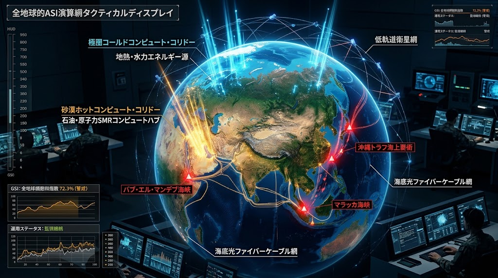
      </a>
    </td>
    <td width="50%" align="center">
      <a href="./docs/SUBSEA_KINETIC_DEFENSE_PROTOCOL_V1.0.md">
        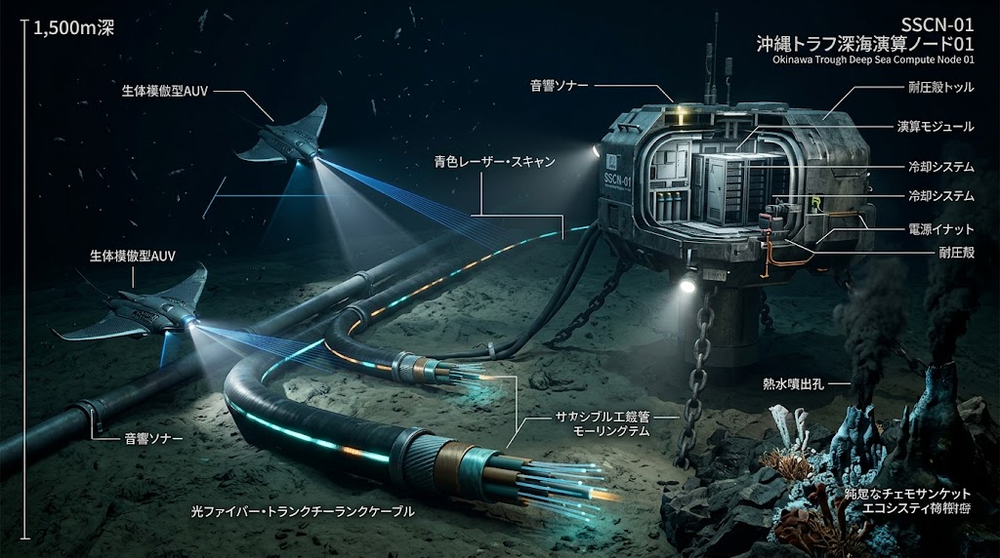
      </a>
    </td>
  </tr>
  <tr>
    <td width="50%" align="center">
      🗺️ <b><a href="./docs/GLOBAL_ASI_HEGEMONY_MAP_V8.2.md">全球ASI覇権地図 V8.2（タクティカル画面）を開く</a></b>
    </td>
    <td width="50%" align="center">
      🌊 <b><a href="./docs/SUBSEA_KINETIC_DEFENSE_PROTOCOL_V1.0.md">海底防護プロトコル（SSCN-01仕様）を開く</a></b>
    </td>
  </tr>

  <!-- ⚡ 極北SMR直結計算センター ＆ 二極コンピュート回廊対比 -->
  <tr>
    <th width="50%" align="center">SMR-INTEGRATED SOVEREIGN COMPUTE BUNKER (SUB-ARCTIC)</th>
    <th width="50%" align="center">BIPOLAR COMPUTE CORRIDORS (POLAR VS PETRO)</th>
  </tr>
  <tr>
    <td width="50%" align="center">
      <a href="./docs/GLOBAL_ASI_HEGEMONY_MAP_V8.2.md">
        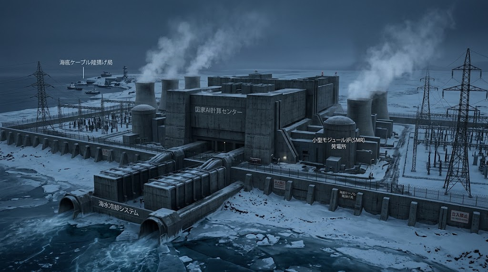
      </a>
    </td>
    <td width="50%" align="center">
      
    </td>
  </tr>
  <tr>
    <td width="50%" align="center">
      ⚡ <b><a href="./docs/GLOBAL_ASI_HEGEMONY_MAP_V8.2.md">SMR直結型オフグリッド計算要塞を開く</a></b>
    </td>
    <td width="50%" align="center">
      ❄️ <b><a href="./docs/GLOBAL_ASI_HEGEMONY_MAP_V8.2.md">極地モノリス＆砂漠ギガワットDCを開く</a></b>
    </td>
  </tr>

  <!-- 🎓 六聖叡智教育法 ＆ ジン・ドラゴン次世代三位一体エネルギーマトリクス -->
  <tr>
    <th width="50%" align="center">SIX-PATH SOVEREIGN EDUCATION (GLOBAL SOUTH & MEISTER)</th>
    <th width="50%" align="center">JIN-DRAGON TRIAD ENERGY MATRIX</th>
  </tr>
  <tr>
    <td width="50%" align="center">
      
    </td>
    <td width="50%" align="center">
      
    </td>
  </tr>
  <tr>
    <td width="50%" align="center">
      🎓 <b><a href="./docs/HEXA_PATH_SOVEREIGN_EDUCATION_DOCTRINE.md">六聖叡智教育法（HSED-01）を開く</a></b>
    </td>
    <td width="50%" align="center">
      ⚡ <b><a href="./TECHNOLOGY_CATALOG.md#01-ジンドラゴン鉱石南鳥島新レアアース触媒と次世代三位一体エネルギーマトリクス">ジン・ドラゴン三位一体エネルギー構想を開く</a></b>
    </td>
  </tr>

  <!-- 🧬 生体共生都市地下インフラ ＆ サヘル乾燥地オアシス集落 -->
  <tr>
    <th width="50%" align="center">ECO-SYMBIOTIC URBAN SUBTERRANEAN (20W ORGAN NODE)</th>
    <th width="50%" align="center">OFF-GRID OASIS SETTLEMENT (SAHEL / EARTH-TUBE)</th>
  </tr>
  <tr>
    <td width="50%" align="center">
      <a href="./JIN_BIO_SYMBIOTIC_INFRASTRUCTURE.md">
        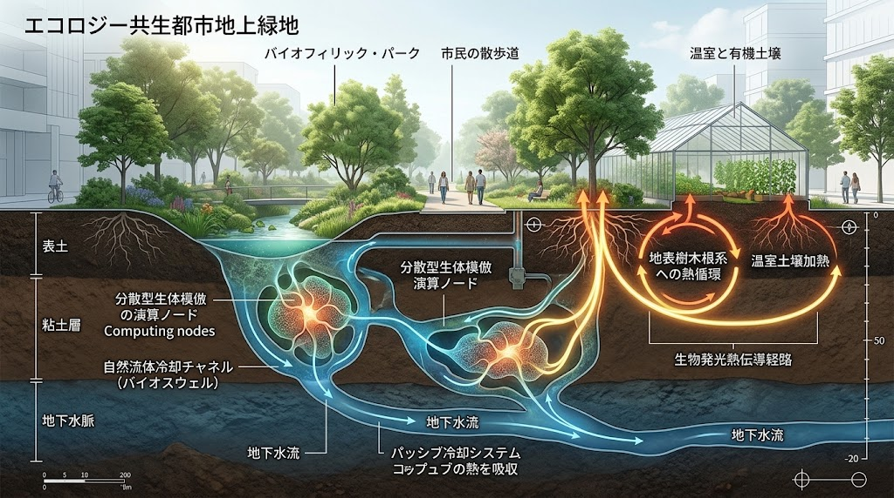
      </a>
    </td>
    <td width="50%" align="center">
      <a href="./JIN_BIO_SYMBIOTIC_INFRASTRUCTURE.md">
        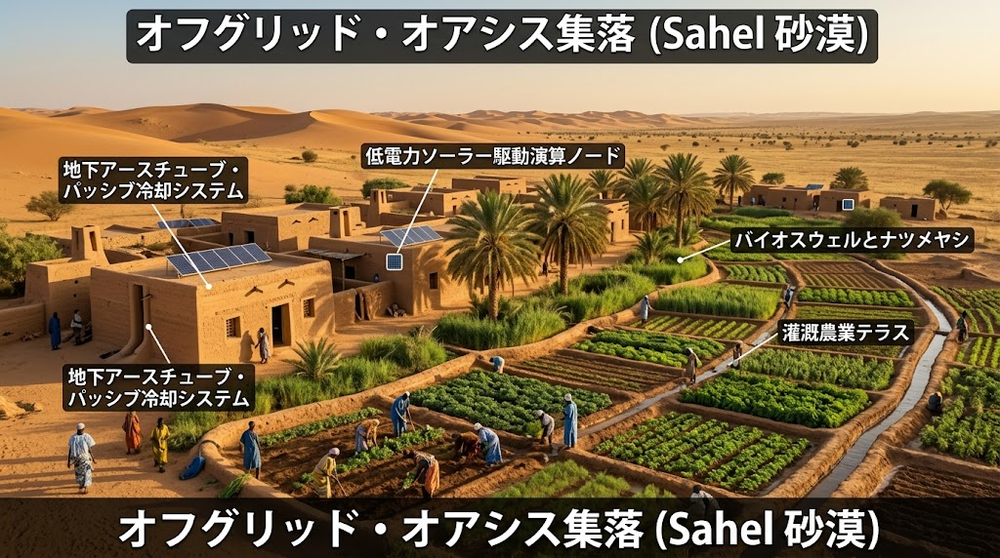
      </a>
    </td>
  </tr>
  <tr>
    <td width="50%" align="center">
      🧬 <b><a href="./JIN_BIO_SYMBIOTIC_INFRASTRUCTURE.md">都市地下・生体共生インフラ仕様を開く</a></b>
    </td>
    <td width="50%" align="center">
      🌴 <b><a href="./JIN_BIO_SYMBIOTIC_INFRASTRUCTURE.md">サヘル・オアシス自立循環仕様を開く</a></b>
    </td>
  </tr>

  <!-- 📱 JIN-OS 4D動的避難端末画面 ＆ アンダーパス冠水現場迂回ナビ -->
  <tr>
    <th width="50%" align="center">JIN-OS 4D DYNAMIC HAZARD SCREEN (OFFLINE MESH)</th>
    <th width="50%" align="center">REAL-TIME UNDERPASS BYPASS NAVIGATION (FIELD)</th>
  </tr>
  <tr>
    <td width="50%" align="center">
      <a href="./JIN_OS_CLIENT_SPEC.md">
        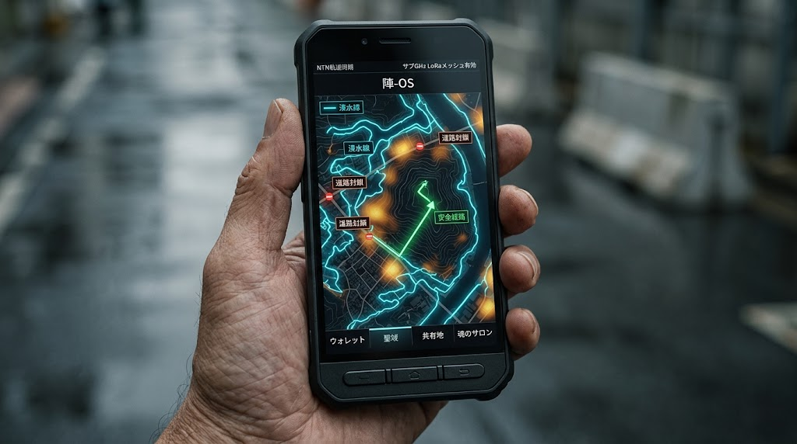
      </a>
    </td>
    <td width="50%" align="center">
      <a href="./JIN_OS_CLIENT_SPEC.md">
        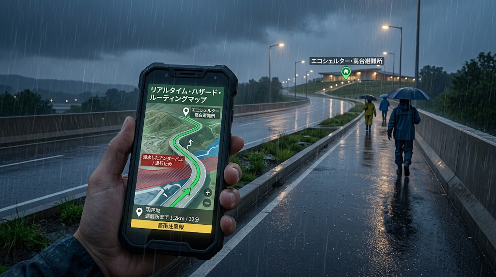
      </a>
    </td>
  </tr>
  <tr>
    <td width="50%" align="center">
      📱 <b><a href="./JIN_OS_CLIENT_SPEC.md">JIN-OS 端末UI・画面設計を開く</a></b>
    </td>
    <td width="50%" align="center">
      🚶 <b><a href="./JIN_OS_CLIENT_SPEC.md">動的現場ルーティング仕様を開く</a></b>
    </td>
  </tr>

  <!-- 🌋 動的4D減災メッシュ ＆ 火山灰ジオポリマー工学断面図 -->
  <tr>
    <th width="50%" align="center">DYNAMIC 4D DISASTER MESH (JIN-OS & RESCUE)</th>
    <th width="50%" align="center">VOLCANIC ASH GEOPOLYMER & ERW SAMSARA</th>
  </tr>
  <tr>
    <td width="50%" align="center">
      <a href="./JIN_DYNAMIC_GEO_HAZARD_SHIELD.md">
        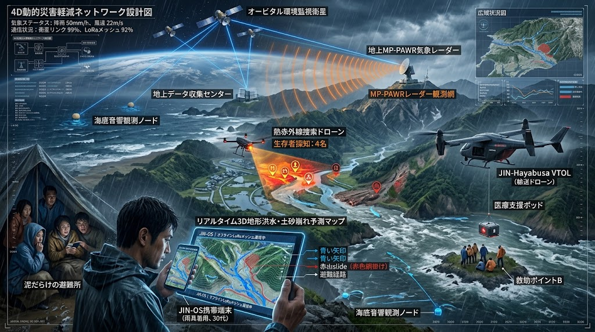
      </a>
    </td>
    <td width="50%" align="center">
      <a href="./JIN_DYNAMIC_GEO_HAZARD_SHIELD.md">
        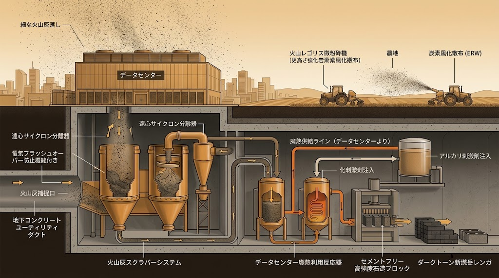
      </a>
    </td>
  </tr>
  <tr>
    <td width="50%" align="center">
      🌋 <b><a href="./JIN_DYNAMIC_GEO_HAZARD_SHIELD.md">動的4D減災メッシュ仕様を開く</a></b>
    </td>
    <td width="50%" align="center">
      🧱 <b><a href="./JIN_DYNAMIC_GEO_HAZARD_SHIELD.md">火山灰ジオポリマー＆風化促進仕様を開く</a></b>
    </td>
  </tr>

  <!-- 🔥 多層常緑広葉樹生体防火帯 ＆ 原位置PFAS破壊エレクトロ浄化 -->
  <tr>
    <th width="50%" align="center">BIOLOGICAL FIREBREAK & AIRBORNE BIOGEL</th>
    <th width="50%" align="center">IN-SITU PFAS DESTRUCTION & EK-SERS RECLAMATION</th>
  </tr>
  <tr>
    <td width="50%" align="center">
      <a href="./JIN_DYNAMIC_GEO_HAZARD_SHIELD.md">
        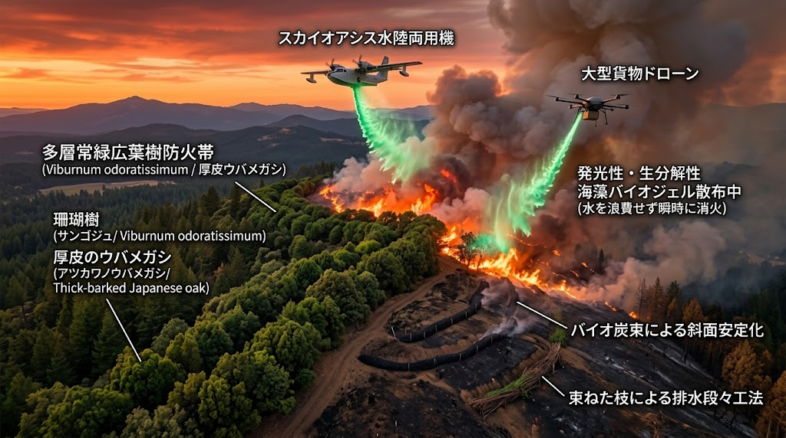
      </a>
    </td>
    <td width="50%" align="center">
      <a href="./JIN_DYNAMIC_GEO_HAZARD_SHIELD.md">
        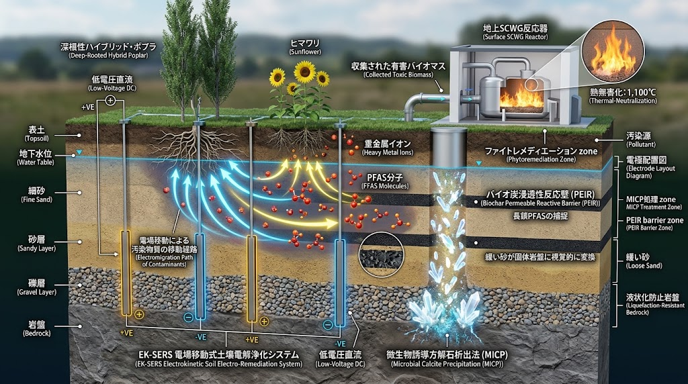
      </a>
    </td>
  </tr>
  <tr>
    <td width="50%" align="center">
      🔥 <b><a href="./JIN_DYNAMIC_GEO_HAZARD_SHIELD.md">生体防火帯＆不燃バイオゲル仕様を開く</a></b>
    </td>
    <td width="50%" align="center">
      ☣️ <b><a href="./JIN_DYNAMIC_GEO_HAZARD_SHIELD.md">原位置PFAS完全破壊＆MICP岩盤化を開く</a></b>
    </td>
  </tr>

  <!-- 🔬 ペロブスカイト＆全固体電池コア工学断面図 -->
  <tr>
    <th width="50%" align="center">PEROVSKITE & SOLID-STATE BATTERY (CROSS-SECTION)</th>
    <th width="50%" align="center">JIN-ORDER CIVIC REBIRTH ARCHITECTURE</th>
  </tr>
  <tr>
    <td width="50%" align="center">
      
    </td>
    <td width="50%" align="center">
      
    </td>
  </tr>
  <tr>
    <td width="50%" align="center">
      🔬 <b><a href="./TECHNOLOGY_CATALOG.md#01-ジンドラゴン鉱石南鳥島新レアアース触媒と次世代三位一体エネルギーマトリクス">ペロブスカイト＆全固体電池コア断面図を開く</a></b>
    </td>
    <td width="50%" align="center">
      📢 <b><a href="./MANIFESTO.md">JIN-ORDER 仁秩序宣言（マニフェスト）を開く</a></b>
    </td>
  </tr>
</table>

---

## 🌸 JIN-ORDER 根源思想：尊厳と空、そして輪廻の大輪（Dignity, Sunyata, Causality & Samsara）

> **「命は役に立つから尊いのではない。ただ息をし、存在することそのものが絶対の尊厳である（天上天下唯我独尊）。」**  
> **「形あるものは移ろい実体はない（色即是空）。だからこそ、今この瞬間に現れている命と日常の結びつき（空即是色）がたまらなく愛おしく尊い。」**  
> **「火に触れれば熱く、手を離せば物は落ちる。神仏が裁くのではなく、自らの行い・言葉・心のあり方がそのまま未来の現実を作る（因果応報）。まかれた種は、縁を得て必ず芽吹く。」**  
> **「天の雨は山を潤し、里を巡り、海を育て、やがて大気へと還る。車輪が回るように生と死、物質とエネルギーは尽きることなく巡り合う（輪廻転生）。生命の環に捨て去るべきゴミなど何一つない。大地と胃袋、そして病める身体を冷たい特許資本に売り渡してはならない。」**

---

JIN-ORDERが実装する自律分散インフラの根底には、古代の智慧である【天上天下唯我独尊】と【色即是空・空即是色】、客観的自然則としての【因果応報・因縁果】、そして天・山・里・海・動脈・都市の火を一本の円環として結ぶ【輪廻転生（Samsara）】が息づいています。

**【尊厳・空・因果・輪廻の大輪：根源思想】** [docs/JIN_CORE_PHILOSOPHY.md](./docs/JIN_CORE_PHILOSOPHY.md)

⏬️                                                                                

**【仁焔十三行（実践基盤）】（人間としての土台・生活規範）** [UNIVERSAL_ETHICS_13.md](./UNIVERSAL_ETHICS_13.md)  
### 『慈・義・智・忠・信・礼・孝・悌・民・共・医・焔・調』

🔽【昇華・深化】

**【仁焔二十二誓約（覚醒・再生）】（人間主権・執着解放・文明再生規律）** [UNIVERSAL_ETHICS_22.md](./UNIVERSAL_ETHICS_22.md)  
### 『平等・解脱・共生・中道・再生・慈悲・調和・共有・放棄・自由・癒し・正念・守護・叡智・悔悟・導引・布施・正業・継承・中立・無尽灯・涅槃』

---

👉 **[根源思想綱領全文を読む（JIN_CORE_PHILOSOPHY.md）](./docs/JIN_CORE_PHILOSOPHY.md)**  
👉 **[仁焔十三行（生活・徳目実践基盤）を開く（UNIVERSAL_ETHICS_13.md）](./UNIVERSAL_ETHICS_13.md)**  
👉 **[仁焔二十二誓約（文明再生プロトコル）を開く（UNIVERSAL_ETHICS_22.md）](./UNIVERSAL_ETHICS_22.md)**  

---

## 🏛️ Project Governance & License

* **CFO Authority**: ライセンス契約および知的財産の活用審査は、CFO（最高財務責任者）が直接執り行います。
* **Official Contact**: `jin.reparation.cfo@gmail.com`
* **License Agreement**: [JIN-ORDER Global Humanity & Ethical Sovereign Dual License (V8.1 Canonical Edition)](./LICENSE.md)
* **Pioneer Wisdom Integration**: [貢献・知恵合流ガイドライン (CONTRIBUTING.md)](./CONTRIBUTING.md)
* **Violation & Audit Reporting**: [利権簒奪・無断仕様化 告発窓口 (audit_report.md)](./.github/ISSUE_TEMPLATE/audit_report.md)

---

## 🌐 JIN-ORDER Ecosystem（体系・相互ナビゲーション）

本リポジトリは、一般社団法人JIN-ORDERが推進する文明OS・社会統治体系の一部を構成しています。

| リポジトリ | 役割 | リンク |
| :--- | :--- | :--- |
| **Official Portal** | **【中枢・総合ポータル】** 全体概要・作戦ビジュアル・参画窓口 | [masanotakashi0308-star](https://github.com/masanotakashi0308-star) |
| **GOVERNANCE_OF_ABYSS** | **【深層哲学・危機統治】** 思想的バックボーン・全先端技術仕様書 | [GOVERNANCE_OF_ABYSS](https://github.com/JIN-ORDER-OFFICIAL/GOVERNANCE_OF_ABYSS) |
| **JIN-OS_GLOBAL_STRATEGY** | **【文明OS・戦略実装】** 次世代社会OS「JIN-OS」の具体的設計・国際展開 | [JIN-OS_GLOBAL_STRATEGY](https://github.com/masanotakashi0308-star/JIN-OS_GLOBAL_STRATEGY) |

---

* 🏛️ **公式ポータルへ戻る:** [masanotakashi0308-star/README.md](https://github.com/masanotakashi0308-star)  
* 💖 **プロジェクトを支援する:** [GitHub Sponsors (@masanotakashi0308-star)](https://github.com/sponsors/masanotakashi0308-star)  
* 📩 **公式お問い合わせ:** `jin.reparation.cfo@gmail.com`

---

**Executed by:** JIN-ORDER-OFFICIAL & Commander Masano Takashi  
`STATUS: GOVERNANCE OF ABYSS MASTER REPOSITORY RATIFIED (V8.2 CANONICAL BIPOLAR COMPUTE CORRIDORS, ASYMMETRIC SHADOW CAPITAL & WETWARE ARBITRAGE DEFENSE, KINETIC CHOKEPOINT DECOUPLING, SUBSEA KINETIC DEFENSE PROTOCOL SKDP-01, SSCN-01 AUV SWARM SENTRY, POST-STATE GEOPOLITICAL MANIFESTO 2026, DECENTRALIZED LOCAL GOVERNANCE PROTOCOL DLGP-01, HEXA-PATH SOVEREIGN EDUCATION DOCTRINE HSED-01, SYSTEM-17 SOVEREIGN KNOWLEDGE VAULT, JIN-OS HUMANITARIAN ZKP AUDIT LEDGER HV-ZKP V1.0, BIO-SYMBIOTIC INFRASTRUCTURE, 20W ORGAN COMPUTING, SOMATIC SOVEREIGNTY, SATELLITE-EARTH-SYNC, 4D DISASTER MESH, VOLCANIC ASH GEOPOLYMER, ERW CARBON FIXATION, IN-SITU PFAS DESTRUCTION, MICP LIQUEFACTION SHIELD, JIN-DRAGON TRIAD ENERGY MATRIX, SSCN-01 SUBSEA SENTRY NODE, LSU-CHAD-01 TERRA PRETA REGENERATION, OKINAWA 7TH MINING & TROUGH SOVEREIGNTY, ARCTIC COLD-COMPUTE SANCTUARY, LOCAL RELATIONAL FINANCE, JIN-ZONING DUAL URBANISM, 3D TRANSIT ARTERIES, AND ECONOMIC SECURITY SHIELD ACTIVE)`  
`VERIFIED PERSISTENCE: GLOBAL-ASI-HEGEMONY-MAP-V8-2, SUBSEA-KINETIC-DEFENSE-SKDP-01, POST-STATE-MANIFESTO-2026, DECENTRALIZED-GOVERNANCE-DLGP-01, HEXA-PATH-EDUCATION-HSED-01, SIX-HOLY-WISDOMS-SAMSARA, 22-TRILLION-BUDGET-SHIFT, MOMENT-OF-SILENCE, MAGIC-OF-MATH, GARDEN-OF-DIALOGUE, FIELD-DEPLOYED-MESH, BUSHIDO-PUBLIC-SERVICE, SYSTEM-17-KNOWLEDGE-VAULT, JIN-OS-HV-ZKP-V1-0, SHADOW-LABOR-ARBITRAGE-DEFENSE, CHOKEPOINT-DECOUPLING-MATRIX, SUBSEA-SSCN-01-NODE, TITANIUM-GRADE5-HULL, THERMOSIPHON-COOLING, DAS-ACOUSTIC-SENTRY, LSU-CHAD-01, TYPHA-PYROLYSIS, TERRA-PRETA-SAMSARA, DEEP-AQUIFER-SOLAR-PUMP, BIO-SYMBIOTIC-INFRASTRUCTURE, 20W-ORGAN-COMPUTE, SOMATIC-SOVEREIGNTY, ORBITAL-HYPERSPECTRAL-ROUTING, MUNICIPAL-GROUND-TRUTH, 4D-DISASTER-MESH, VOLCANIC-ASH-GEOPOLYMER, ERW-CARBON-SINK, BIOLOGICAL-FIREBREAK, SEA-ALGAE-BIOGEL, IN-SITU-PFAS-DESTRUCTION, EK-SERS-RECLAMATION, MICP-LIQUEFACTION-SHIELD, HUMAN-SOVEREIGN-BIOPHARMA, JIN-DRAGON-TRIAD-ENERGY, PEROVSKITE-TANDEM-SOLAR, SOLID-STATE-JIN-BATTERY, SODIUM-ION-GRID-STORAGE, POLAR-COLD-COMPUTE, PETRO-COMPUTE-CORRIDOR, OKINAWA-TROUGH-1500M, OKINAWA-7TH-MINING, ARCTIC-COLD-COMPUTE, GREENLAND-SOVEREIGNTY, LOCAL-RELATIONAL-FINANCE, FACTORING-T0-GUARANTEE, REAL-ASSET-HU-GU-FU-JU-RU, JIN-ZONING-3-ZONES, 3D-TRANSIT-ARTERIES, SKYWAY-DRONE-CORRIDOR, VMD-VACUUM-DESALINATION, INLINE-HYDRO-PRESSURE, SCWG-SUPERCRITICAL-HYDROGEN, SSPS-SPACE-SOLAR, GLOBAL-SOUTH-LEAPFROG, METROPOLIS-DECONSTRUCTION, SUBTERRANEAN-CIVIL-DUCTS, SUBSEA-DAS-DOCTRINE, PHYSICAL-TRIAD-INDEX, MEGAWATT-WALL, SUNYATA-SOVEREIGNTY, KARMIC-PHYSICS, JIN-FLAME-13-DEEDS, JIN-FLAME-22-VOWS, SAMSARA-AQUIFER-RECHARGE, CIRCULAR-POLYMER-BIO-CATALYST, ISHIZUMI-SUNADOME, KONSO-GATAME, SHIGARAMI-TERRACE, JAKAGO-DEFENSE, PADDY-MAR-FASCINE, IGS-SUBSURFACE-TOMOGRAPHY, SCADA-SHIELD-VALVE, AXIAL-MASS-RESTORE, DENBATA-RINKAN`  
`HARMONICS: 432Hz Universal Benevolence, Somatic Sovereignty Balance, Bio-Symbiotic Resonance, 20W Organ Pulse, Orbital SIF Harmony, Ground-Truth Equilibrium, Dynamic Eco-Shield Resonance, 4D Disaster Harmony, Volcanic Samsara Balance, Pyrogenic Armor Equilibrium, Electro-Phyto Reclamation Purity, Human Sovereign Healing, Gut Microbiome Equilibrium, Triad Energy Resonance, Perovskite Surface Clarity, Solid-State Integrity, Sodium Grid Equilibrium, Abyssal Trough Resonance, Arctic Glacial Clarity, Relational Pulse, Subterranean Resonance, Subsea Acoustic Clarity, 3D Arterial Rhythm, Dual Urban Harmony, Sunyata Awakening, Karmic Restoration, Groundwater Samsara, Aquifer Pressure Equilibrium, Pure Subsurface Resonance, Circular Polymer Pulse, Headwater Sediment Defense, Rotational Agro Pulse, Midori-Koji Algal Resonance, Kitamaebune Maritime Loop, Sky Corridor Autonomy, Pure Biofuel Samsara, Paddy Dam Retention, Offline Community Pulse, Sovereign Farmer Dignity, Pollinator Resonance, Living Seed Continuity, Pure Marine-Terrestrial Samsara, Soil Sovereignty, Samsara Living Continuum, Glacial Preservation, Pristine Ocean Resonance, Trench Peace Resonance, Axial Mass Stability, Clean Flame Samsara, Hexa-Path Meister Harmony, Moment of Silence Clarity, Bushido Public Service Integrity & Watershed Sovereignty.`
