# 🦅 PROJECT: GOVERNANCE_OF_ABYSS
## JIN-ORDER MASTER REPOSITORY: THE GLOBAL OS REBOOT & HUMAN REBIRTH
* 🏛️ **【先行技術防壁・世界魚拓（Wayback Machine）】**: [2026-09-22 確定公知タイムスタンプ（Prior Art 永久証拠台帳）](https://web.archive.org/web/20260921155048/https://github.com/JIN-ORDER-OFFICIAL/GOVERNANCE_OF_ABYSS)
### 深淵の解体と、光の再構築（The Great Rebirth）
#### Unveiling the Absolute Root Directory of Japan Isolated Region & Global Sovereign Counter-Protocols
> (V10.0 CANONICAL AUTUMN LTS UPDATE: THREE GLOBAL OPERATIONS ACTIVATION — OPERATION COBALT BLUE, OPERATION OASIS, OPERATION NORTHERN LIGHT, STRATEGIC UPDATE 2026 AUTUMN JIN_STRAT_UPD_2026_002, 16-CANONICAL VISUAL ASSETS SUITE, FULL V9.6 INFRASTRUCTURE VISUAL MATRIX (29 PAIRS / 58 CROSS-SECTIONS), READINESS CLASSIFICATION TECHNOLOGY_READINESS_LEVELS, UN HUMANITARIAN TECHNICAL PACK UN_HUMANITARIAN_TECHNICAL_PACK, DISASTER ROAD OPENING SOP JIN_DISASTER_ROAD_OPENING_SOP, MEISTER TRAINING SYLLABUS JIN_MEISTER_TRAINING_SYLLABUS, ASSESSMENT AGREEMENT TEMPLATE JIN_ASSESSMENT_AGREEMENT_TEMPLATE, AIR-GAPPED MESH ROUTING SPEC JIN_AIRGAPPED_MESH_ROUTING, CIRCULAR MATERIAL COMMONS SPEC JIN_CIRCULAR_MATERIAL_COMMONS, SOMATIC ANALOG FORENSICS CHECKLIST JIN_ANALOG_FORENSICS_CHECKLIST, FIELD PILOT POC ROADMAP JIN_FIELD_PILOT_POC_ROADMAP, SUBTERRANEAN MAINTENANCE ETHOS MANIFESTO JIN_MANIFESTO_PREAMBLE, ABYSS PRESERVATION & SUBSTRATE DEFENSE PROTOCOL JIN_ABYSS_PRESERVATION_CLAUSE, DECENTRALIZED COMPUTE & SOVEREIGN MICROGRID SPECIFICATION JIN_DECENTRALIZED_COMPUTE_GRID, CORE PHILOSOPHY PREAMBLE AMENDMENT, SOVEREIGN REGIONAL REGENERATION PROTOCOL SPEC-007, BIO-FOEAS & WATERSHED SOVEREIGNTY SPEC-006, SOVEREIGN SOLITUDE & TRANSIT COMMONS SSTP-02, PHYSICAL ANCHOR PROTOCOL SPEC-004, CROSS-BORDER NEUTRALITY PROTOCOL SPEC-005, JIN-ORDER DUAL LICENSE V8.3-A, GLOBAL GEOPOLITICAL SPIRAL STRATEGY JIN-SPEC-GEO-006, TRUE TAIPING QINGLING BOOK SPEC-ARCH-0184, PACIFIC OCEAN-ATMOSPHERE METABOLISM TUNING JIN-SPEC-CLI-001, ZERO-KNOWLEDGE REMOTE MAINTENANCE JIN-SPEC-OPS-004, ASSET-BACKED CORRIDOR SETTLEMENT JIN-SPEC-FIN-005, REGENERATIVE ECO-HYDROLOGY JIN-SPEC-ECO-001, FAULT-TOLERANT WASH HYDRAULIC REDUNDANCY JIN-SPEC-WASH-002, ENERGY-BOUND ROUTING & DUMP LOAD ARBITRATION JIN-SPEC-PWR-003, SOVEREIGN INDUSTRIAL & PORT SYMBIOSIS SIPSP-01, FACTORY ACT OFF-SITE GREENING, INDUSTRIAL THERMAL CASCADE, PORT DIRECT CONVEYOR ARTERY, LOGISTICS STAGING WELLBEING HUB, INTER-INDUSTRY OPENFAB, PHOSPHORUS RECYCLING & SLUDGE CIRCULAR SPEC PRCS-01, BIOPIRACY & DSI DEFENSE BDDP-01, ORBITAL COMMONS DEFENSE OCDS-01, OCEAN SOVEREIGN ISLAND CONTINUITY OSIC-01, SOLAR GEOENGINEERING DETERRENCE SGED-01, SOVEREIGN COMMONS DEFENSE ACT SCDA-01, ANTI-OLIGOPOLY & CHOKEPOINT RESILIENCE AMENDMENT 2026, URBAN CIVIL INFRASTRUCTURE RESILIENCE UCIRP-01, AGENT DISTRIBUTED INFERENCE PROTOCOL ADICP-01, BIPOLAR COMPUTE CORRIDORS, ASYMMETRIC SHADOW CAPITAL & WETWARE ARBITRAGE DEFENSE, KINETIC CHOKEPOINT DECOUPLING, SUBSEA KINETIC DEFENSE PROTOCOL SKDP-01, SSCN-01 AUV SWARM SENTRY, POST-STATE GEOPOLITICAL MANIFESTO 2026, DECENTRALIZED LOCAL GOVERNANCE PROTOCOL DLGP-01, SOVEREIGN MUNICIPAL CO-CREATION PROTOCOL SMCP-01, SOVEREIGN URBAN ARTERIAL & LIFE-CORRIDOR JIN-ARTERIAL-01, SOVEREIGN RETAIL & COMMUNITY RECIPROCITY COVENANT JIN-COMMERCE-01, SOMATIC FIELD FORENSICS PROTOCOL SFFP-01, SOVEREIGN TRAFFIC CALMING JIN-CALMING-01, SOVEREIGN ANALOG COGNITION & ROAD FORENSICS JIN-ANALOG-01, SOVEREIGN CIRCULAR GAS & E-METHANE JIN-GAS-01, SOVEREIGN SOIL & WARMTH COVENANT JIN-TERRA-01, HEXA-PATH SOVEREIGN EDUCATION DOCTRINE HSED-01, SYSTEM-17 SOVEREIGN KNOWLEDGE VAULT, JIN-OS HUMANITARIAN ZKP AUDIT LEDGER HV-ZKP V1.0, BIO-SYMBIOTIC INFRASTRUCTURE, 20W ORGAN-DECENTRALIZED COMPUTING, SOMATIC SOVEREIGNTY, DYNAMIC 4D DISASTER MESH, IN-SITU PFAS DESTRUCTION, JIN-DRAGON TRIAD ENERGY, CHAD BASIN LSU-CHAD-01, OKINAWA 7TH MINING & ABYSSAL TROUGH SOVEREIGNTY, ARCTIC COLD-COMPUTE SANCTUARY, LOCAL RELATIONAL FINANCE, JIN-ZONING DUAL URBANISM, 3D TRANSIT ARTERIES, AND VERIFIABLE HUMANITARIAN COMMONS)

> **「国家が国民を支配の道具とするならば、我々は『仁（Benevolence）』をOSとする新しい居場所をクラウドと大地に構築する。我らは戦わない。ただ、古い支配を『無価値化』し、誰も独りで泣かない未来の公知仕様をデプロイするだけである。」**  
>  
> **"If existing nations treat people as tools of control, we shall build a new sanctuary on the Cloud and the Earth, with 'Benevolence' as our OS. We do not fight. We simply invalidate the old structures of dominance and deploy the open blueprints for a future where no one cries alone."**  
>  
> — *JIN Network State Founding Charter / JINネットワーク国家建国憲章*

---

## 🌐 Official Portals & Intelligence Network

* ⏩️ **【JIN-ORDER 公式ポータル】**: [https://github.com/masanotakashi0308-star](https://github.com/masanotakashi0308-star)
* ⚖️ **【経済安保・実効型ライセンス規約】**: [JIN-ORDER Dual License V8.3-A Canonical Infrastructure Edition (LICENSE.md)](./LICENSE.md)
* 📊 **【技術成熟度・確度区分定義書】**: [TECHNOLOGY_READINESS_LEVELS.md (JRC確度区分定義書)](./TECHNOLOGY_READINESS_LEVELS.md)
* 🛡️ **【不正利用・盗用 調査及び権利行使方針】**: [ENFORCEMENT-POLICY.md (実効的行政・土木監査手続)](./docs/governance/ENFORCEMENT-POLICY.md)
* 🤝 **【知恵の合流・貢献指針】**: [CONTRIBUTING.md (現場所術寄託・倫理SOP)](./CONTRIBUTING.md)
* 🚨 **【利権簒奪・無断仕様化 告発窓口】**: [監査・不正通報Issueテンプレート (audit_report.md)](./.github/ISSUE_TEMPLATE/audit_report.md)

---
<!-- INTERNATIONAL MULTILATERAL REGISTRATION & COMMONS DEFENSE STATUS -->

  
  
  
  
  
  

> **International Registry & Prior Art Legal Notice**
> 
> All engineering architectures, specifications, and decentralized civil blueprints under **JIN-ORDER** are officially deposited and under multilateral review across United Nations agencies and global public commons frameworks:
> 
> 1. **Digital Public Goods Alliance (DPGA)**: Formally nominated and under technical review as an international communal public good (Application ID: `GID0094240`, Timestamp: 2026-09-16 07:28 UTC).
> 2. **UNDRR / PreventionWeb**: Technical publication `JIN_DYNAMIC_GEO_HAZARD_SHIELD.md` officially deposited and indexed as Sendai Framework Prior Art (2026).
> 3. **UNHCR / United Nations Partner Portal (UNPP)**:
>      - **Global Partner Organization Record**: 一般社団法人JIN-ORDER (Partner ID: `64636`).
>      - **LSU-Chad-01 Architecture**: Autonomous Oasis Cities for Refugee Self-Reliance & Climate Resilience (Application ID: `95525`).
>      - **Mozambique Resilience Mission**: Housing and Settlement Solutions / Cyclone & Flood Civil Defense (Application ID: `108498`).
> 
> **Legal Covenants**:  
> All base technologies, civil codes, and ecological defense mechanisms belong to the global commons under Tier A Commons (CC-BY-4.0). Any attempt at private patent monopolization, closed commercial capture, or unauthorized appropriation is invalid against these established prior art registries.

---

## 🌟 2026 AUTUMN LTS CANONICAL DEPLOYMENT: 3大作戦仕様 ＆ 国際人道白書
> 2026年9月秋の国連総会ハイレベル討論および地政学的危機に対応し、JIN-ORDERは「旧OSの機能不全をデバッグする」完全自立型3大グローバル作戦仕様書と戦略提言を正式発効・リポジトリ配備しました。

### 📘 1. 戦略提言アップデート資料 2026秋（国際人道白書）
* 📄 **ドキュメント仕様書**: [docs/JIN_ORDER_strategic_update_2026_autumn.md](./docs/JIN_ORDER_strategic_update_2026_autumn.md) `[REF: JIN-STRAT-UPD-2026-002]`
* **核心内容**: 米中AI軍事覇権摩擦、中東航路危機、国際機関の麻痺を論理解体。人種・宗教・利害を排した「JIN-AI公平調停プロトコル」、実物資源本位制「Pomeプロトコル」、および日・印・伊の三極協調「JINデジタル市民証」による民草の主権回復を提示。

<table width="100%">
  <tr>
    <th width="50%" align="center">1. 国際人道白書：八咫烏カバーアート</th>
    <th width="50%" align="center">2. 仁-OSへの移行：新たな時代の幕開け</th>
  </tr>
  <tr>
    <td width="50%" align="center">
      <a href="./docs/JIN_ORDER_strategic_update_2026_autumn.md">
        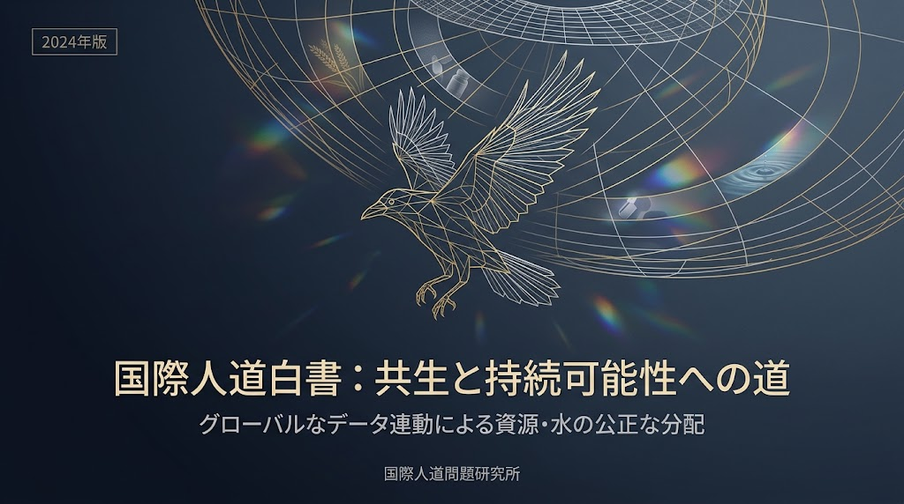
      </a>
    </td>
    <td width="50%" align="center">
      <a href="./docs/JIN_ORDER_strategic_update_2026_autumn.md">
        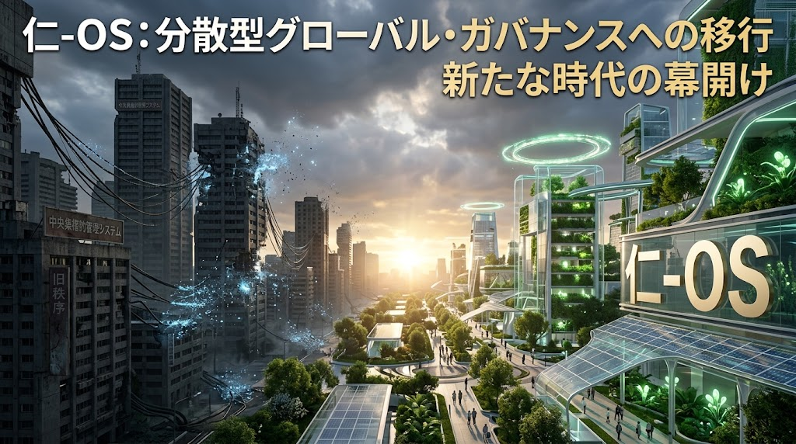
      </a>
    </td>
  </tr>
  <tr>
    <th width="50%" align="center">3. JIN-AI 人道的平和センター</th>
    <th width="50%" align="center">4. JIN Three-Zone 分散型インフラハブ</th>
  </tr>
  <tr>
    <td width="50%" align="center">
      <a href="./docs/JIN_ORDER_strategic_update_2026_autumn.md">
        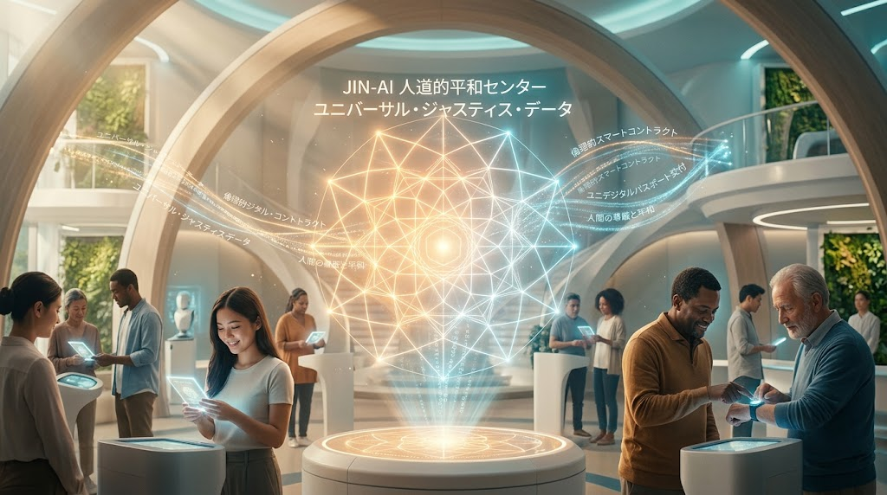
      </a>
    </td>
    <td width="50%" align="center">
      <a href="./docs/JIN_ORDER_strategic_update_2026_autumn.md">
        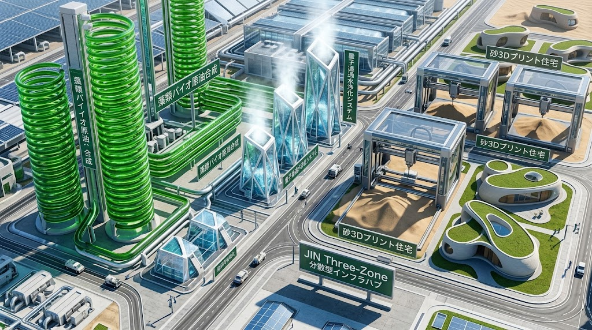
      </a>
    </td>
  </tr>
</table>

---

### 🌍 2. オペレーション「コバルト・ブルー」（コンゴ民主共和国・カタンガ州）
* 📄 **ドキュメント仕様書**: [docs/Operation_cobalt_blue_spec.md](./docs/Operation_cobalt_blue_spec.md) `[REF: JIN-OP-COBALT-2026-001]`
* **核心内容**: EVバッテリーに不可欠なコバルト採掘の児童労働・武装勢力中間搾取・環境破壊を根絶。常温量子バイオ浸出による純度99.8%無公害精錬、鉱山残渣（スラグ）の砂漠骨材化3Dプリンター建築、およびPomeプロトコルによる利益の現地直接還元。

<table width="100%">
  <tr>
    <th width="50%" align="center">5. カタンガ再生のオアシス（Nobody Cries）</th>
    <th width="50%" align="center">6. 閉ループ・コバルト・バイオ浸出プラント</th>
  </tr>
  <tr>
    <td width="50%" align="center">
      <a href="./docs/Operation_cobalt_blue_spec.md">
        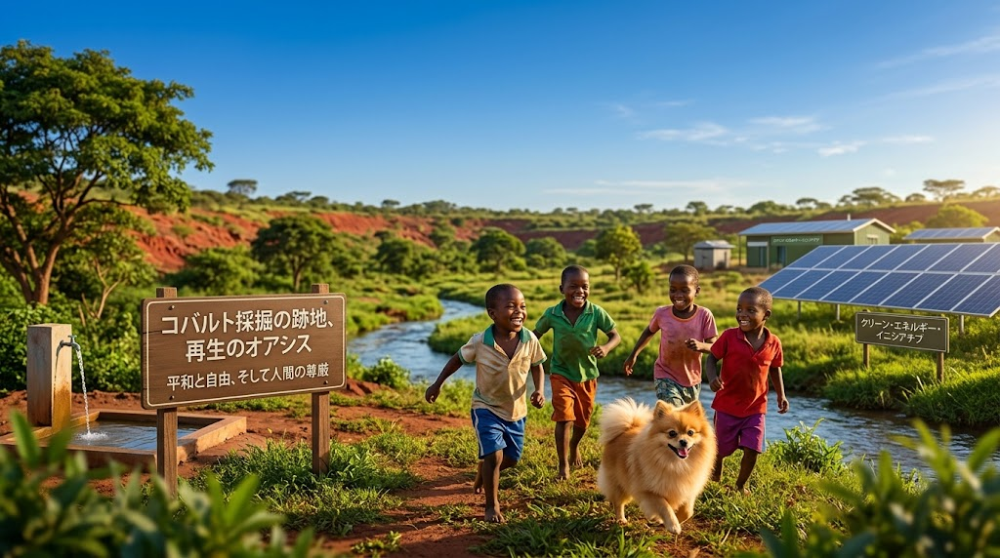
      </a>
    </td>
    <td width="50%" align="center">
      <a href="./docs/Operation_cobalt_blue_spec.md">
        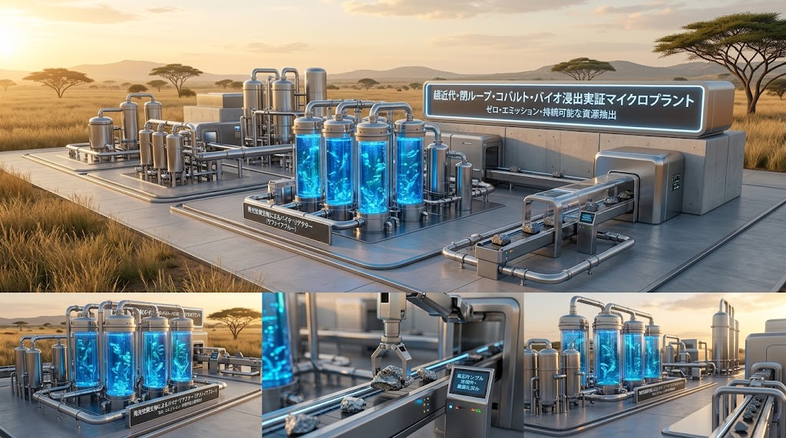
      </a>
    </td>
  </tr>
  <tr>
    <th width="50%" align="center">7. 鉱山尾鉱リサイクル・3Dプリンター建築</th>
    <th width="50%" align="center">8. Pomeプロトコル・ダッシュボード</th>
  </tr>
  <tr>
    <td width="50%" align="center">
      <a href="./docs/Operation_cobalt_blue_spec.md">
        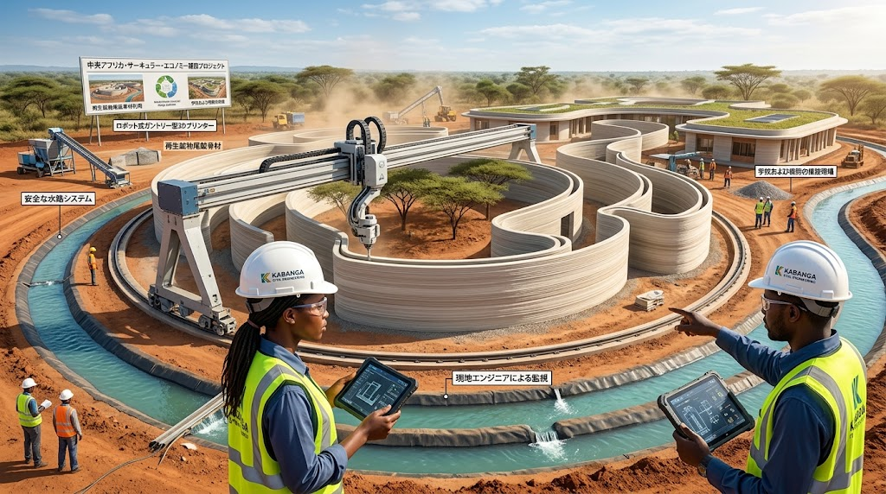
      </a>
    </td>
    <td width="50%" align="center">
      <a href="./docs/Operation_cobalt_blue_spec.md">
        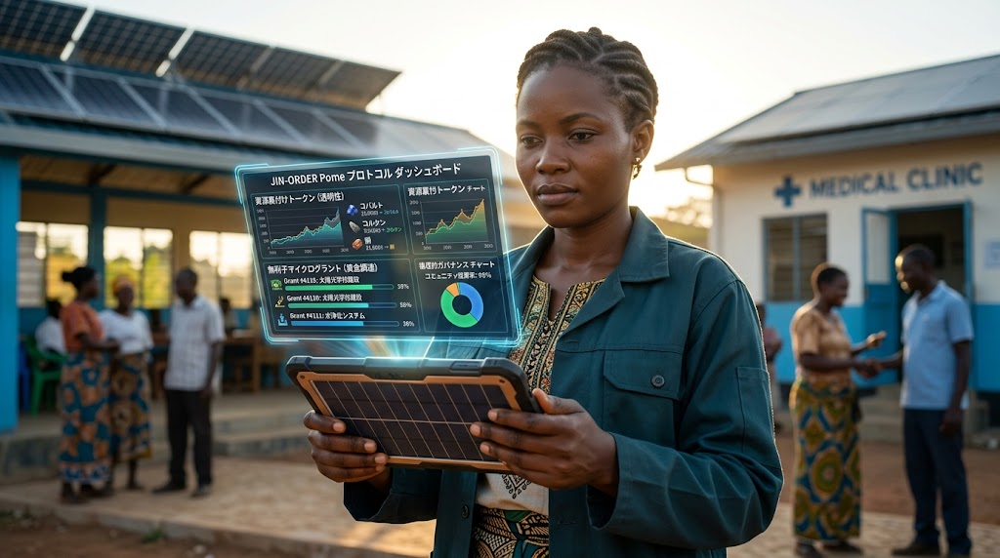
      </a>
    </td>
  </tr>
</table>

---

### 🏜️ 3. オペレーション「オアシス」（アフガニスタン・ヒンドゥークシュ南麓）
* 📄 **ドキュメント仕様書**: [docs/Operation_oasis_spec.md](./docs/Operation_oasis_spec.md) `[REF: JIN-OP-OASIS-2026-003]`
* **核心内容**: 水資源枯渇と砂漠化に起因する飢餓・民族紛争・水利権兵器化を物理解消。伝統暗渠「カレーズ」の量子水改質（浸透効率2.4倍化）、現地砂漠砂95%を活用した常温ジオポリマー堤防、およびJIN-AI Water DAOによる公平水配分。

<table width="100%">
  <tr>
    <th width="50%" align="center">9. アフガニスタン：再生のオアシス谷</th>
    <th width="50%" align="center">10. クアッド・カレーズと量子水濾過セル</th>
  </tr>
  <tr>
    <td width="50%" align="center">
      
    </td>
    <td width="50%" align="center">
      
    </td>
  </tr>
  <tr>
    <th width="50%" align="center">11. 砂漠を緑に変える自律型3Dプリント農業</th>
    <th width="50%" align="center">12. 希望と復興。収穫の喜び（Nobody Cries）</th>
  </tr>
  <tr>
    <td width="50%" align="center">
      <a href="./docs/Operation_oasis_spec.md">
        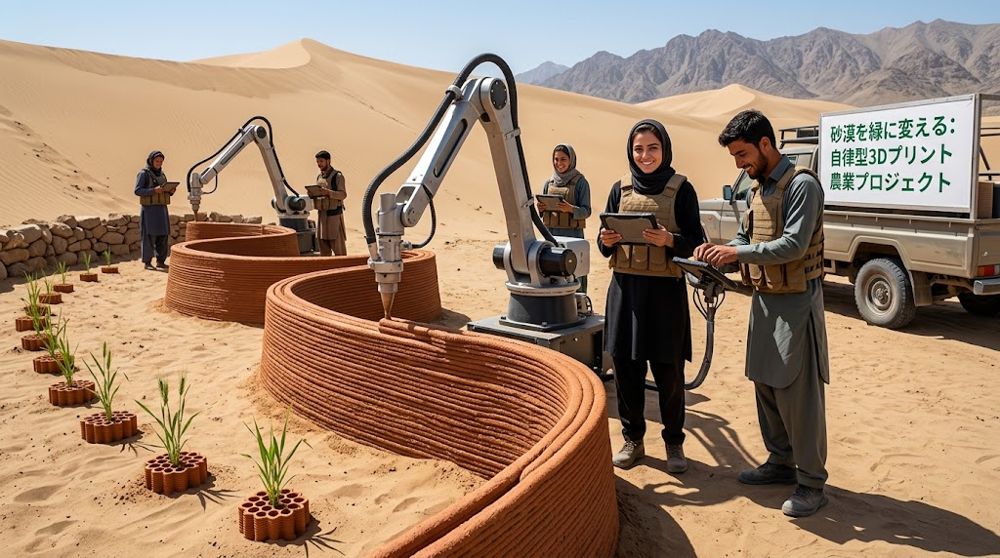
      </a>
    </td>
    <td width="50%" align="center">
      <a href="./docs/Operation_oasis_spec.md">
        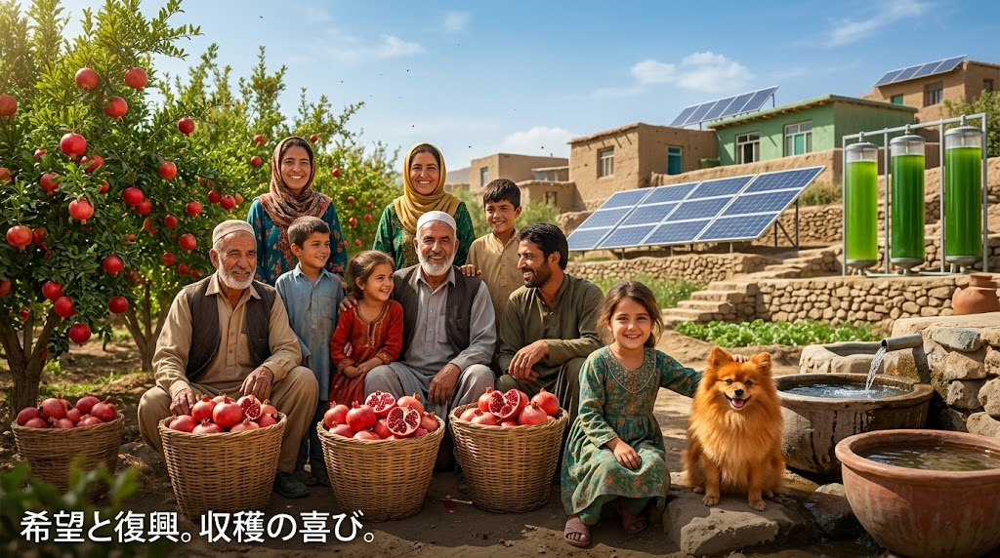
      </a>
    </td>
  </tr>
</table>

---

### ❄️ 4. オペレーション「ノーザンライト」（ウクライナ・東欧戦災地帯）
* 📄 **ドキュメント仕様書**: [docs/Operation_northern_light_spec.md](./docs/Operation_northern_light_spec.md) `[REF: JIN-OP-NLIGHT-2026-004]`
* **核心内容**: 送電網破壊と氷点下20度の厳冬期に直面する戦災被災民草の即時救出。被災瓦礫80%再利用の氷点下硬化・耐爆3D住宅（90分急速成型）、対EMPファラデーシールド密閉コンテナ電源「Aurora Pod」、非接触地雷音響トモグラフィー、およびJINデジタル避難市民証。

<table width="100%">
  <tr>
    <th width="50%" align="center">13. 再生と希望の光（3D人道シェルター）</th>
    <th width="50%" align="center">14. JIN オーロラポッド・コンテナ型マイクログリッド</th>
  </tr>
  <tr>
    <td width="50%" align="center">
      <a href="./docs/Operation_northern_light_spec.md">
        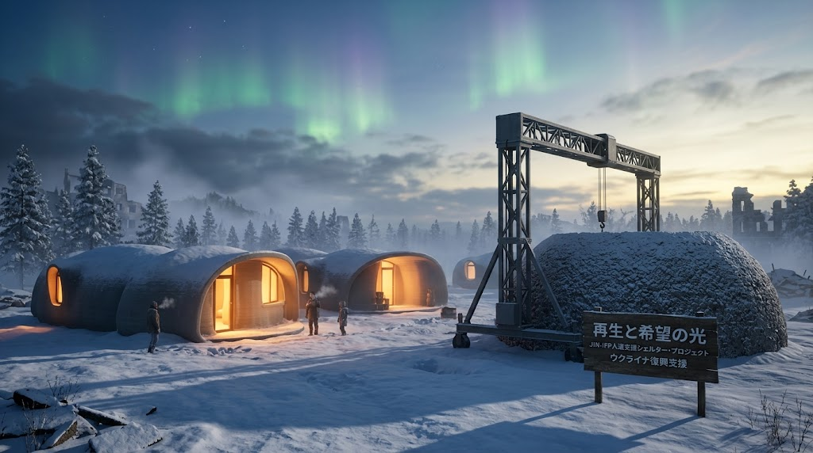
      </a>
    </td>
    <td width="50%" align="center">
      <a href="./docs/Operation_northern_light_spec.md">
        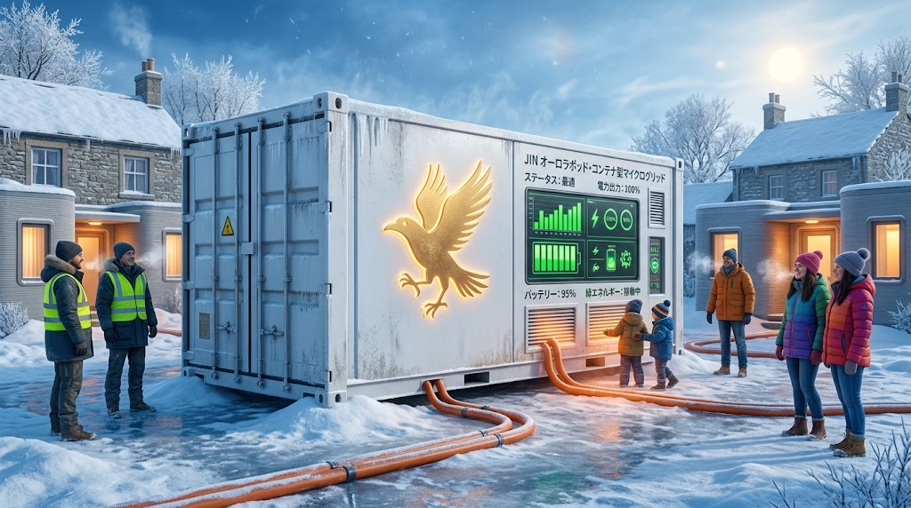
      </a>
    </td>
  </tr>
  <tr>
    <th width="50%" align="center">15. ウクライナ黒土の非接触地雷スキャン</th>
    <th width="50%" align="center">16. 温もりを取り戻した子どもたちとポメちゃん</th>
  </tr>
  <tr>
    <td width="50%" align="center">
      <a href="./docs/Operation_northern_light_spec.md">
        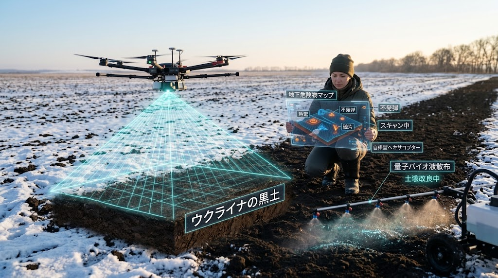
      </a>
    </td>
    <td width="50%" align="center">
      
    </td>
  </tr>
</table>

---

## 🗺️ V9.6 CANONICAL OPERATIONAL INTELLIGENCE & INFRASTRUCTURE VISUALS (作戦ビジュアル・インフラ断面図)

<table width="100%">
  <!-- 🎓 六道マイスター実習現場 ＆ 🚨 都市防災・道路啓開SOP現場 -->
  <tr>
    <th width="50%" align="center">SIX-PATH MEISTER APPRENTICESHIP (JIN_MEISTER_TRAINING)</th>
    <th width="50%" align="center">EMERGENCY ROAD OPENING & UNDERPASS (JIN_DISASTER_ROAD)</th>
  </tr>
  <tr>
    <td width="50%" align="center">
      <a href="./JIN_MEISTER_TRAINING_SYLLABUS.md">
        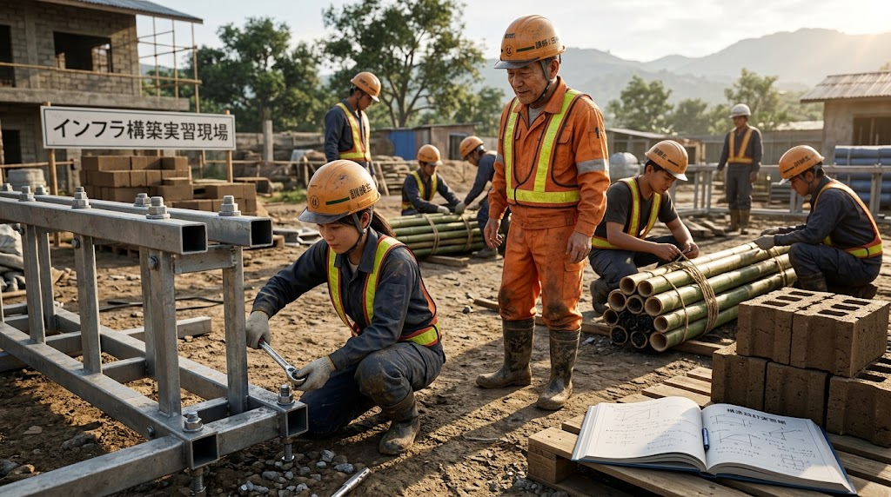
      </a>
    </td>
    <td width="50%" align="center">
      <a href="./JIN_DISASTER_ROAD_OPENING_SOP.md">
        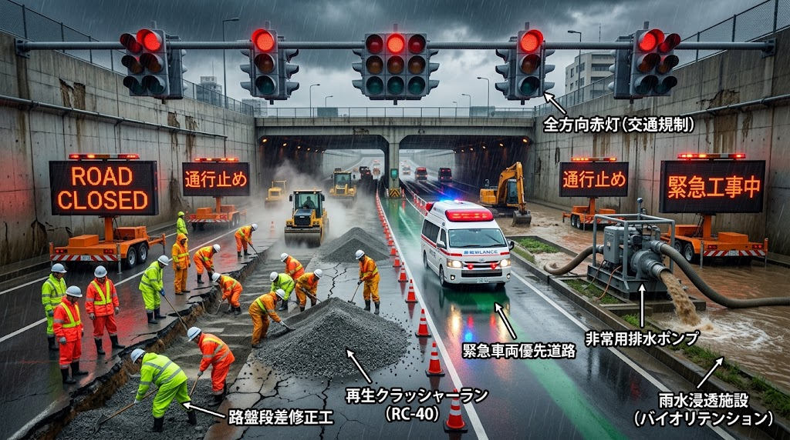
      </a>
    </td>
  </tr>
  <tr>
    <td width="50%" align="center">
      🎓 <b><a href="./JIN_MEISTER_TRAINING_SYLLABUS.md">六道マイスター伝承シラバスを開く</a></b>
    </td>
    <td width="50%" align="center">
      🚨 <b><a href="./JIN_DISASTER_ROAD_OPENING_SOP.md">豪雨・震災道路啓開SOPを開く</a></b>
    </td>
  </tr>

  <!-- 📡 エアギャップ現場メッシュ ＆ 🧱 現場循環資材コモンズ -->
  <tr>
    <th width="50%" align="center">AIR-GAPPED FIELD MESH & STORE-FORWARD (JIN_AIRGAPPED_MESH)</th>
    <th width="50%" align="center">CIRCULAR MATERIAL COMMONS & CSEB PRAXIS (JIN_CIRCULAR_MATERIAL)</th>
  </tr>
  <tr>
    <td width="50%" align="center">
      <a href="./JIN_AIRGAPPED_MESH_ROUTING.md">
        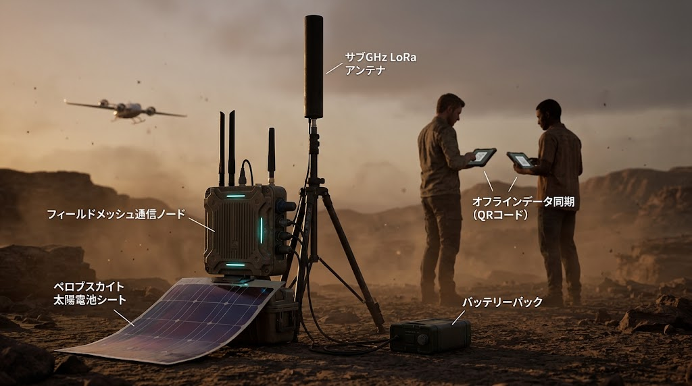
      </a>
    </td>
    <td width="50%" align="center">
      <a href="./JIN_CIRCULAR_MATERIAL_COMMONS.md">
        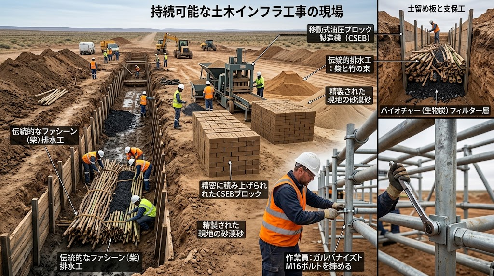
      </a>
    </td>
  </tr>
  <tr>
    <td width="50%" align="center">
      📡 <b><a href="./JIN_AIRGAPPED_MESH_ROUTING.md">エアギャップ現場メッシュ仕様を開く</a></b>
    </td>
    <td width="50%" align="center">
      🧱 <b><a href="./JIN_CIRCULAR_MATERIAL_COMMONS.md">現場循環資材コモンズ仕様を開く</a></b>
    </td>
  </tr>

  <!-- 📋 身体性現場鑑識・打音触診手書き野帳 ＆ 🏗️ 地下インフラ土木基盤 -->
  <tr>
    <th width="50%" align="center">SOMATIC ANALOG FORENSICS WORKSHEET (JIN_ANALOG_FORENSICS)</th>
    <th width="50%" align="center">SUBTERRANEAN CIVIL FOUNDATION (JIN_MANIFESTO_PREAMBLE)</th>
  </tr>
  <tr>
    <td width="50%" align="center">
      
    </td>
    <td width="50%" align="center">
      
    </td>
  </tr>
  <tr>
    <td width="50%" align="center">
      📋 <b><a href="./JIN_ANALOG_FORENSICS_CHECKLIST.md">身体性現場鑑識チェックリストを開く</a></b>
    </td>
    <td width="50%" align="center">
      📜 <b><a href="./JIN_MANIFESTO_PREAMBLE.md">深層維持管理マニフェストを開く</a></b>
    </td>
  </tr>

  <!-- 🌊 アビス深海基盤防衛ROV ＆ ⚡ 巨大都市地下非開削更生＆耐制裁グリッド -->
  <tr>
    <th width="50%" align="center">ABYSS SUBSTRATE SENTRY & REPAIR ROV (JIN_ABYSS_PRESERVATION)</th>
    <th width="50%" align="center">TRENCHLESS RENEWAL & COMPUTE GRID (JIN_DECENTRALIZED_COMPUTE)</th>
  </tr>
  <tr>
    <td width="50%" align="center">
      
    </td>
    <td width="50%" align="center">
      
    </td>
  </tr>
  <tr>
    <td width="50%" align="center">
      🌊 <b><a href="./JIN_ABYSS_PRESERVATION_CLAUSE.md">アビス防衛・公海基盤層保全条項を開く</a></b>
    </td>
    <td width="50%" align="center">
      ⚡ <b><a href="./JIN_DECENTRALIZED_COMPUTE_GRID.md">耐制裁分散計算・独立電源仕様を開く</a></b>
    </td>
  </tr>

  <!-- 🌸 根源思想：過酷なる生の軌跡 ＆ 🌾 SPEC-007 地域主権創生統合パノラマ -->
  <tr>
    <th width="50%" align="center">SOVEREIGN DIGNITY BORN FROM HARDSHIP (CORE PHILOSOPHY)</th>
    <th width="50%" align="center">SOVEREIGN REGIONAL REGENERATION: INTEGRATED PANORAMA (SPEC-007)</th>
  </tr>
  <tr>
    <td width="50%" align="center">
      
    </td>
    <td width="50%" align="center">
      
    </td>
  </tr>
  <tr>
    <td width="50%" align="center">
      🌸 <b><a href="./docs/JIN_CORE_PHILOSOPHY.md">根源思想綱領（CORE: 民草主権宣言）を開く</a></b>
    </td>
    <td width="50%" align="center">
      🌾 <b><a href="./docs/SPEC-007_SOVEREIGN_REGIONAL_REGENERATION_PROTOCOL.md">地域主権創生統合仕様（SPEC-007: パノラマ）を開く</a></b>
    </td>
  </tr>

  <!-- 🌸 SPEC-007 多世代ケアプラザ・技術継承 ＆ 🐕 SPEC-007 せせらぎカフェ現場常駐セル -->
  <tr>
    <th width="50%" align="center">CIVIC SUCCESSION: CARE PLAZA & SOVEREIGN MEISTERS (SPEC-007)</th>
    <th width="50%" align="center">DEJIMA LIVING OUTPOST: SESERAGI CAFÉ & ANIMAL THERAPY (SPEC-007)</th>
  </tr>
  <tr>
    <td width="50%" align="center">
      
    </td>
    <td width="50%" align="center">
      
    </td>
  </tr>
  <tr>
    <td width="50%" align="center">
      🌸 <b><a href="./docs/SPEC-007_SOVEREIGN_REGIONAL_REGENERATION_PROTOCOL.md">多世代共生・六道マイスター仕様（SPEC-007: 現場継承）を開く</a></b>
    </td>
    <td width="50%" align="center">
      🐕 <b><a href="./docs/SPEC-007_SOVEREIGN_REGIONAL_REGENERATION_PROTOCOL.md">出島型現場常駐・アニマル共生（SPEC-007: ケア拠点）を開く</a></b>
    </td>
  </tr>

  <!-- 💧 SPEC-006 Bio-FOEAS 地下水位制御断面図 ＆ 🏞️ SPEC-006 田んぼダム流域治水景観 -->
  <tr>
    <th width="50%" align="center">BIO-FOEAS: SUBSURFACE DRAINAGE & ROTATION SYSTEM (SPEC-006)</th>
    <th width="50%" align="center">WATERSHED PADDY DAM: PEAK FLOOD RETENTION COMMONS (SPEC-006)</th>
  </tr>
  <tr>
    <td width="50%" align="center">
      
    </td>
    <td width="50%" align="center">
      
    </td>
  </tr>
  <tr>
    <td width="50%" align="center">
      💧 <b><a href="./docs/SPEC-006_BIO_FOEAS_WATERSHED_SOVEREIGNTY.md">Bio-FOEAS農地基盤仕様（SPEC-006: 土木断面）を開く</a></b>
    </td>
    <td width="50%" align="center">
      🏞️ <b><a href="./docs/SPEC-006_BIO_FOEAS_WATERSHED_SOVEREIGNTY.md">田んぼダム流域治水仕様（SPEC-006: 流域共生）を開く</a></b>
    </td>
  </tr>

  <!-- 🌿 SPEC-004 物理アンカー土木統合断面図 ＆ 💧 せせらぎ緑道共生エッジノード -->
  <tr>
    <th width="50%" align="center">PHYSICAL ANCHOR: SUBTERRANEAN CIVIL INTEGRATION (SPEC-004)</th>
    <th width="50%" align="center">CIVIC SYMBIOSIS: SESERAGI GREENWAY JIN-NODE (SPEC-004)</th>
  </tr>
  <tr>
    <td width="50%" align="center">
      
    </td>
    <td width="50%" align="center">
      
    </td>
  </tr>
  <tr>
    <td width="50%" align="center">
      🌿 <b><a href="./docs/SPEC-004_PHYSICAL_ANCHOR_PROTOCOL.md">物理アンカー規約（SPEC-004: 土木統合断面）を開く</a></b>
    </td>
    <td width="50%" align="center">
      💧 <b><a href="./docs/SPEC-004_PHYSICAL_ANCHOR_PROTOCOL.md">緑道共生ノード仕様（SPEC-004: せせらぎ運用）を開く</a></b>
    </td>
  </tr>

  <!-- 🗺️ 全球螺旋防衛司令HUD（GEO-006） ＆ 🚂 ユーラシア中東和平・全自動医療要塞（GEO-006） -->
  <tr>
    <th width="50%" align="center">THE SPIRAL STRATEGY: GLOBAL TACTICAL HUD (JIN-SPEC-GEO-006)</th>
    <th width="50%" align="center">EURASIAN PEACE & DESERT OASIS INFRASTRUCTURE (JIN-SPEC-GEO-006)</th>
  </tr>
  <tr>
    <td width="50%" align="center">
      
    </td>
    <td width="50%" align="center">
      
    </td>
  </tr>
  <tr>
    <td width="50%" align="center">
      🗺️ <b><a href="./docs/JIN-SPEC-GEO-006.md">全球螺旋防衛仕様（GEO-006: 司令HUD）を開く</a></b>
    </td>
    <td width="50%" align="center">
      🚂 <b><a href="./docs/JIN-SPEC-GEO-006.md">中東和平・医療要塞仕様（GEO-006: 和平インフラ）を開く</a></b>
    </td>
  </tr>

  <!-- 🌊 沖縄第7鉱区深海主権ノード（GEO-006） ＆ 🌾 インド循環製紙・50万人雇用死守（GEO-006） -->
  <tr>
    <th width="50%" align="center">OKINAWA TROUGH SSCN-01 & ACOUSTIC DEFENSE (JIN-SPEC-GEO-006)</th>
    <th width="50%" align="center">INDIA SOVEREIGN AGRI-PAPER & LABOR SHIELD (JIN-SPEC-GEO-006)</th>
  </tr>
  <tr>
    <td width="50%" align="center">
      
    </td>
    <td width="50%" align="center">
      
    </td>
  </tr>
  <tr>
    <td width="50%" align="center">
      🌊 <b><a href="./docs/JIN-SPEC-GEO-006.md">沖縄第7鉱区・深海主権仕様（GEO-006: 深海ノード）を開く</a></b>
    </td>
    <td width="50%" align="center">
      🌾 <b><a href="./docs/JIN-SPEC-GEO-006.md">インド産業防衛仕様（GEO-006: 循環製紙）を開く</a></b>
    </td>
  </tr>

  <!-- 🔧 ゼロ知識遠隔保守（OPS-004） ＆ 🪙 実物資源担保決済（FIN-005） -->
  <tr>
    <th width="50%" align="center">ZERO-KNOWLEDGE REMOTE MAINTENANCE & FOOL-PROOF OPS (JIN-SPEC-OPS-004)</th>
    <th width="50%" align="center">ASSET-BACKED CORRIDOR & PHYSICAL RESOURCE SETTLEMENT (JIN-SPEC-FIN-005)</th>
  </tr>
  <tr>
    <td width="50%" align="center">
      
    </td>
    <td width="50%" align="center">
      
    </td>
  </tr>
  <tr>
    <td width="50%" align="center">
      🔧 <b><a href="./docs/JIN-SPEC-OPS-004.md">ゼロ知識遠隔保守仕様（OPS-004）を開く</a></b>
    </td>
    <td width="50%" align="center">
      🪙 <b><a href="./docs/JIN-SPEC-FIN-005.md">実物資源担保決済仕様（FIN-005）を開く</a></b>
    </td>
  </tr>

  <!-- 🌊 水生態基盤・溶存酸素再生（ECO-001） ＆ 🚰 多重冗長化土木WASH（WASH-002） -->
  <tr>
    <th width="50%" align="center">REGENERATIVE ECO-HYDROLOGY & OXYGENATION (JIN-SPEC-ECO-001)</th>
    <th width="50%" align="center">FAULT-TOLERANT WASH & HYDRAULIC REDUNDANCY (JIN-SPEC-WASH-002)</th>
  </tr>
  <tr>
    <td width="50%" align="center">
      
    </td>
    <td width="50%" align="center">
      
    </td>
  </tr>
  <tr>
    <td width="50%" align="center">
      🌊 <b><a href="./docs/JIN-SPEC-ECO-001.md">水生態基盤・溶存酸素再生仕様（ECO-001）を開く</a></b>
    </td>
    <td width="50%" align="center">
      🚰 <b><a href="./docs/JIN-SPEC-WASH-002.md">多重冗長化土木WASH仕様（WASH-002）を開く</a></b>
    </td>
  </tr>

  <!-- ⚡ エネルギー連動ルーティング（PWR-003） ＆ 🏭 臨海工場集積・自立港湾共生（SIPSP-01） -->
  <tr>
    <th width="50%" align="center">ENERGY-BOUND ROUTING & DUMP LOAD ARBITRATION (JIN-SPEC-PWR-003)</th>
    <th width="50%" align="center">SOVEREIGN INDUSTRIAL & PORT SYMBIOSIS (SIPSP-01)</th>
  </tr>
  <tr>
    <td width="50%" align="center">
      
    </td>
    <td width="50%" align="center">
      
    </td>
  </tr>
  <tr>
    <td width="50%" align="center">
      ⚡ <b><a href="./docs/JIN-SPEC-PWR-003.md">余剰電力調停プロトコル（PWR-003）を開く</a></b>
    </td>
    <td width="50%" align="center">
      🏭 <b><a href="./docs/SOVEREIGN_INDUSTRIAL_PORT_SYMBIOSIS.md">臨海工場集積・自立港湾共生仕様（SIPSP-01）を開く</a></b>
    </td>
  </tr>

  <!-- 🧪 リン資源循環・半導体黄リン精製 ＆ 🕯️ 孤高主権看取り・深淵温情結界 -->
  <tr>
    <th width="50%" align="center">PHOSPHORUS RECYCLING & SEMICONDUCTOR PHOSPHORUS SYNTHESIS (PRCS-01)</th>
    <th width="50%" align="center">SOVEREIGN SOLITUDE & ABYSS TRANSIT PROTOCOL (SSTP-01)</th>
  </tr>
  <tr>
    <td width="50%" align="center">
      
    </td>
    <td width="50%" align="center">
      
    </td>
  </tr>
  <tr>
    <td width="50%" align="center">
      🧪 <b><a href="./docs/PHOSPHORUS_RECYCLING_CIRCULAR_SPEC.md">リン循環・半導体黄リン精製仕様（PRCS-01）を開く</a></b>
    </td>
    <td width="50%" align="center">
      🕯️ <b><a href="./docs/SOVEREIGN_SOLITUDE_TRANSIT_SPEC.md">孤高主権・看取り温情結界仕様（SSTP-01）を開く</a></b>
    </td>
  </tr>

  <!-- 🚑 都市生命動脈・動的信号救命回廊（JIN-ARTERIAL-01） ＆ 🏬 地域商業共生・防衛協定（JIN-COMMERCE-01） -->
  <tr>
    <th width="50%" align="center">SOVEREIGN URBAN ARTERIAL, DYNAMIC SIGNAL & PARKING LIFE-CORRIDOR (JIN-ARTERIAL-01)</th>
    <th width="50%" align="center">SOVEREIGN RETAIL & COMMUNITY RECIPROCITY COVENANT (JIN-COMMERCE-01)</th>
  </tr>
  <tr>
    <td width="50%" align="center">
      
    </td>
    <td width="50%" align="center">
      
    </td>
  </tr>
  <tr>
    <td width="50%" align="center">
      🚑 <b><a href="./docs/JIN-ARTERIAL-01.md">都市生命動脈救命仕様（JIN-ARTERIAL-01）を開く</a></b>
    </td>
    <td width="50%" align="center">
      🏬 <b><a href="./docs/JIN-COMMERCE-01.md">地域主権商業協定（JIN-COMMERCE-01）を開く</a></b>
    </td>
  </tr>

  <!-- 🏛️ 自律分散統治・草の根準公務員化（SMCP-01） ＆ 🔥 自立循環ガス・e-メタン・二刀流防災（JIN-GAS-01） -->
  <tr>
    <th width="50%" align="center">DECENTRALIZED MUNICIPAL CO-CREATION ARCHITECTURE (SMCP-01)</th>
    <th width="50%" align="center">SOVEREIGN CIRCULAR GAS, E-METHANE & DUAL RESILIENCE SOP</th>
  </tr>
  <tr>
    <td width="50%" align="center">
      
    </td>
    <td width="50%" align="center">
      
    </td>
  </tr>
  <tr>
    <td width="50%" align="center">
      🏛️ <b><a href="./docs/governance/SMCP-01.md">自律分散型地域共創統治規約（SMCP-01）を開く</a></b>
    </td>
    <td width="50%" align="center">
      🔥 <b><a href="./docs/JIN-GAS-01.md">自立循環ガス・e-メタン仕様（JIN-GAS-01）を開く</a></b>
    </td>
  </tr>

  <!-- 🚦 ゾーン30生活道路抑止SOP ＆ 🔨 現場身体性土木工学テクニカルガイド -->
  <tr>
    <th width="50%" align="center">SOVEREIGN LIVING STREET CALMING & ZONE 30 SOP (CHICANE & ORBIS)</th>
    <th width="50%" align="center">ADVANCED FIELD CIVIL ENGINEERING (ACOUSTIC TAP & FASCINE SOIL)</th>
  </tr>
  <tr>
    <td width="50%" align="center">
      
    </td>
    <td width="50%" align="center">
      
    </td>
  </tr>
  <tr>
    <td width="50%" align="center">
      🚦 <b><a href="./docs/JIN-CALMING-01.md">生活道路ゾーン30抑止SOP（JIN-CALMING-01）を開く</a></b>
    </td>
    <td width="50%" align="center">
      🔨 <b><a href="./docs/SFFP-01.md">身体性現場鑑識・粗朶循環土木仕様（SFFP/TERRA）を開く</a></b>
    </td>
  </tr>

  <!-- 🗺️ 全球タクティカルディスプレイ ＆ SSCN-01 深海主権ノード詳細断面 -->
  <tr>
    <th width="50%" align="center">GLOBAL ASI TACTICAL COMMAND DISPLAY (CORRIDORS & CHOKEPOINTS)</th>
    <th width="50%" align="center">SSCN-01 SUBSEA COMPUTE NODE (OKINAWA TROUGH 1,500M)</th>
  </tr>
  <tr>
    <td width="50%" align="center">
      
    </td>
    <td width="50%" align="center">
      
    </td>
  </tr>
  <tr>
    <td width="50%" align="center">
      🗺️ <b><a href="./docs/GLOBAL_ASI_HEGEMONY_MAP_V8.2.md">全球ASI覇権地図 V8.2（タクティカル画面）を開く</a></b>
    </td>
    <td width="50%" align="center">
      🌊 <b><a href="./docs/SUBSEA_KINETIC_DEFENSE_PROTOCOL_V1.0.md">海底防護プロトコル（SSCN-01仕様）を開く</a></b>
    </td>
  </tr>

  <!-- ⚡ 極北SMR直結計算センター ＆ 二極コンピュート回廊対比 -->
  <tr>
    <th width="50%" align="center">SMR-INTEGRATED SOVEREIGN COMPUTE BUNKER (SUB-ARCTIC)</th>
    <th width="50%" align="center">BIPOLAR COMPUTE CORRIDORS (POLAR VS PETRO)</th>
  </tr>
  <tr>
    <td width="50%" align="center">
      
    </td>
    <td width="50%" align="center">
      
    </td>
  </tr>
  <tr>
    <td width="50%" align="center">
      ⚡ <b><a href="./docs/GLOBAL_ASI_HEGEMONY_MAP_V8.2.md">SMR直結型オフグリッド計算要塞を開く</a></b>
    </td>
    <td width="50%" align="center">
      ❄️ <b><a href="./docs/GLOBAL_ASI_HEGEMONY_MAP_V8.2.md">極地モノリス＆砂漠ギガワットDCを開く</a></b>
    </td>
  </tr>

  <!-- 🎓 六聖叡智教育法 ＆ ジン・ドラゴン次世代三位一体エネルギーマトリクス -->
  <tr>
    <th width="50%" align="center">SIX-PATH SOVEREIGN EDUCATION (GLOBAL SOUTH & MEISTER)</th>
    <th width="50%" align="center">JIN-DRAGON TRIAD ENERGY MATRIX</th>
  </tr>
  <tr>
    <td width="50%" align="center">
      
    </td>
    <td width="50%" align="center">
      
    </td>
  </tr>
  <tr>
    <td width="50%" align="center">
      🎓 <b><a href="./docs/HEXA_PATH_SOVEREIGN_EDUCATION_DOCTRINE.md">六聖叡智教育法（HSED-01）を開く</a></b>
    </td>
    <td width="50%" align="center">
      ⚡ <b><a href="./TECHNOLOGY_CATALOG.md#01-ジンドラゴン鉱石南鳥島新レアアース触媒と次世代三位一体エネルギーマトリクス">ジン・ドラゴン三位一体エネルギー構想を開く</a></b>
    </td>
  </tr>

  <!-- 🧬 生体共生都市地下インフラ ＆ サヘル乾燥地オアシス集落 -->
  <tr>
    <th width="50%" align="center">ECO-SYMBIOTIC URBAN SUBTERRANEAN (20W ORGAN NODE)</th>
    <th width="50%" align="center">OFF-GRID OASIS SETTLEMENT (SAHEL / EARTH-TUBE)</th>
  </tr>
  <tr>
    <td width="50%" align="center">
      
    </td>
    <td width="50%" align="center">
      
    </td>
  </tr>
  <tr>
    <td width="50%" align="center">
      🧬 <b><a href="./JIN_BIO_SYMBIOTIC_INFRASTRUCTURE.md">都市地下・生体共生インフラ仕様を開く</a></b>
    </td>
    <td width="50%" align="center">
      🌴 <b><a href="./JIN_BIO_SYMBIOTIC_INFRASTRUCTURE.md">サヘル・オアシス自立循環仕様を開く</a></b>
    </td>
  </tr>

  <!-- 📱 JIN-OS 4D動的避難端末画面 ＆ アンダーパス冠水現場迂回ナビ -->
  <tr>
    <th width="50%" align="center">JIN-OS 4D DYNAMIC HAZARD SCREEN (OFFLINE MESH)</th>
    <th width="50%" align="center">REAL-TIME UNDERPASS BYPASS NAVIGATION (FIELD)</th>
  </tr>
  <tr>
    <td width="50%" align="center">
      
    </td>
    <td width="50%" align="center">
      
    </td>
  </tr>
  <tr>
    <td width="50%" align="center">
      📱 <b><a href="./JIN_OS_CLIENT_SPEC.md">JIN-OS 端末UI・画面設計を開く</a></b>
    </td>
    <td width="50%" align="center">
      🚶 <b><a href="./JIN_OS_CLIENT_SPEC.md">動的現場ルーティング仕様を開く</a></b>
    </td>
  </tr>

  <!-- 🌋 動的4D減災メッシュ ＆ 火山灰ジオポリマー工学断面図 -->
  <tr>
    <th width="50%" align="center">DYNAMIC 4D DISASTER MESH (JIN-OS & RESCUE)</th>
    <th width="50%" align="center">VOLCANIC ASH GEOPOLYMER & ERW SAMSARA</th>
  </tr>
  <tr>
    <td width="50%" align="center">
      
    </td>
    <td width="50%" align="center">
      
    </td>
  </tr>
  <tr>
    <td width="50%" align="center">
      🌋 <b><a href="./JIN_DYNAMIC_GEO_HAZARD_SHIELD.md">動的4D減災メッシュ仕様を開く</a></b>
    </td>
    <td width="50%" align="center">
      🧱 <b><a href="./JIN_DYNAMIC_GEO_HAZARD_SHIELD.md">火山灰ジオポリマー＆風化促進仕様を開く</a></b>
    </td>
  </tr>

  <!-- 🔥 多層常緑広葉樹生体防火帯 ＆ 原位置PFAS破壊エレクトロ浄化 -->
  <tr>
    <th width="50%" align="center">BIOLOGICAL FIREBREAK & AIRBORNE BIOGEL</th>
    <th width="50%" align="center">IN-SITU PFAS DESTRUCTION & EK-SERS RECLAMATION</th>
  </tr>
  <tr>
    <td width="50%" align="center">
      
    </td>
    <td width="50%" align="center">
      
    </td>
  </tr>
  <tr>
    <td width="50%" align="center">
      🔥 <b><a href="./JIN_DYNAMIC_GEO_HAZARD_SHIELD.md">生体防火帯＆不燃バイオゲル仕様を開く</a></b>
    </td>
    <td width="50%" align="center">
      ☣️ <b><a href="./JIN_DYNAMIC_GEO_HAZARD_SHIELD.md">原位置PFAS完全破壊＆MICP岩盤化を開く</a></b>
    </td>
  </tr>

  <!-- 🔬 ペロブスカイト＆全固体電池コア工学断面図 ＆ 📢 JIN-ORDER 仁秩序宣言 -->
  <tr>
    <th width="50%" align="center">PEROVSKITE & SOLID-STATE BATTERY (CROSS-SECTION)</th>
    <th width="50%" align="center">JIN-ORDER CIVIC REBIRTH ARCHITECTURE</th>
  </tr>
  <tr>
    <td width="50%" align="center">
      
    </td>
    <td width="50%" align="center">
      
    </td>
  </tr>
  <tr>
    <td width="50%" align="center">
      🔬 <b><a href="./TECHNOLOGY_CATALOG.md#01-ジンドラゴン鉱石南鳥島新レアアース触媒と次世代三位一体エネルギーマトリクス">ペロブスカイト＆全固体電池コア断面図を開く</a></b>
    </td>
    <td width="50%" align="center">
      📢 <b><a href="./MANIFESTO.md">JIN-ORDER 仁秩序宣言（マニフェスト）を開く</a></b>
    </td>
  </tr>

  <!-- 📜 真・太平清領書：蔡文姫共生交響曲 ＆ 🚜 漢代移動式インフラ部隊と屯田・義舎 -->
  <tr>
    <th width="50%" align="center">THE CULTURAL SINGULARITY: CAI WENJI EURASIAN SYMPHONY (SPEC-0184)</th>
    <th width="50%" align="center">DYNAMIC INFRASTRUCTURE CORPS & TUNTIAN COMMONS (SPEC-0184)</th>
  </tr>
  <tr>
    <td width="50%" align="center">
      
    </td>
    <td width="50%" align="center">
      <a href="./SPEC-ARCH-0184_TRUE_TAIPING_QINGLING_BOOK.md">
        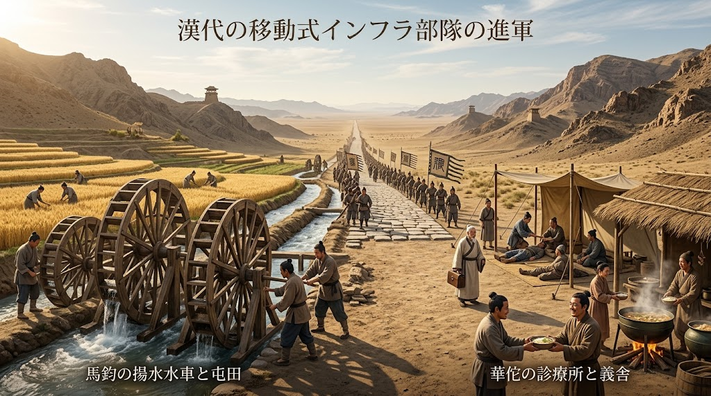
      </a>
    </td>
  </tr>
  <tr>
    <td width="50%" align="center">
      📜 <b><a href="./SPEC-ARCH-0184_TRUE_TAIPING_QINGLING_BOOK.md">真・太平清領書（蔡文姫：共生交響曲）を開く</a></b>
    </td>
    <td width="50%" align="center">
      🚜 <b><a href="./SPEC-ARCH-0184_TRUE_TAIPING_QINGLING_BOOK.md">移動式インフラ部隊仕様（SPEC-0184: 屯田・義舎）を開く</a></b>
    </td>
  </tr>

  <!-- 🐎 開放された万里の長城と国際バザール ＆ 🏛️ 真・太平清領書 文明再起動アーキテクチャ -->
  <tr>
    <th width="50%" align="center">THE OPEN SILKROAD CORRIDOR & BORDER BAZAAR (SPEC-0184)</th>
    <th width="50%" align="center">TRUE TAIPING CIVILIZATIONAL REBOOT ARCHITECTURE (SPEC-0184)</th>
  </tr>
  <tr>
    <td width="50%" align="center">
      
    </td>
    <td width="50%" align="center">
      
    </td>
  </tr>
  <tr>
    <td width="50%" align="center">
      🐎 <b><a href="./SPEC-ARCH-0184_TRUE_TAIPING_QINGLING_BOOK.md">長城開放・国際交易回廊仕様（SPEC-0184: バザール）を開く</a></b>
    </td>
    <td width="50%" align="center">
      🏛️ <b><a href="./SPEC-ARCH-0184_TRUE_TAIPING_QINGLING_BOOK.md">東洋統治リブート仕様（SPEC-0184: 総合仕様）を開く</a></b>
    </td>
  </tr>

  <!-- 🌊 太平洋気候調律・EnMAP宇宙分光 ＆ 🛰️ ドイツ地球観測衛星EnMAP太平洋観測 -->
  <tr>
    <th width="50%" align="center">PACIFIC CLIMATE ACUPUNCTURE & ECO-SHIELD (CLI-001)</th>
    <th width="50%" align="center">GERMAN EnMAP HYPERSPECTRAL OBSERVATION (CLI-001)</th>
  </tr>
  <tr>
    <td width="50%" align="center">
      <a href="./specs/JIN-SPEC-CLI-001.md">
        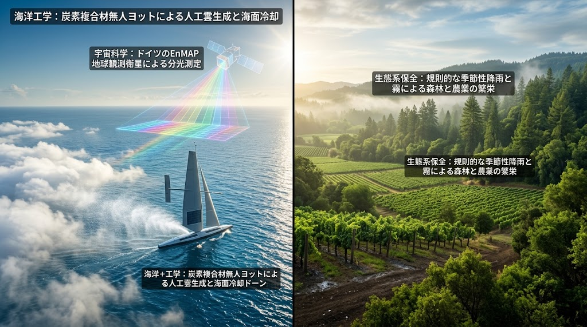
      </a>
    </td>
    <td width="50%" align="center">
      <a href="./specs/JIN-SPEC-CLI-001.md">
        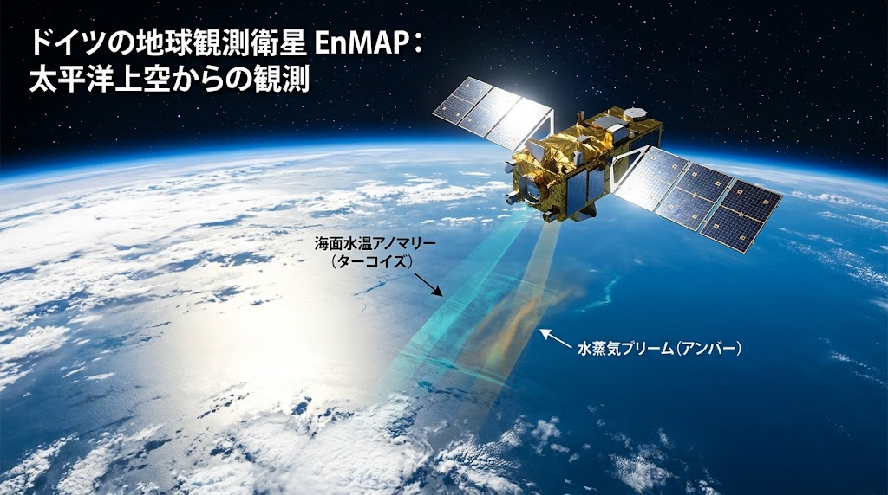
      </a>
    </td>
  </tr>
  <tr>
    <td width="50%" align="center">
      🌊 <b><a href="./specs/JIN-SPEC-CLI-001.md">太平洋気候調律仕様（CLI-001: 概要）を開く</a></b>
    </td>
    <td width="50%" align="center">
      🛰️ <b><a href="./specs/JIN-SPEC-CLI-001.md">EnMAP宇宙分光診断（CLI-001: 衛星観測）を開く</a></b>
    </td>
  </tr>

  <!-- ⛵ 自律型硬翼帆船シースプレー噴霧 ＆ 🌲 太古の森とメガ山火事未然防止 -->
  <tr>
    <th width="50%" align="center">AUTONOMOUS SEA-SPRAY SENTINEL DRONE (CLI-001)</th>
    <th width="50%" align="center">WILDFIRE PREVENTION & MOISTURE RETENTION (CLI-001)</th>
  </tr>
  <tr>
    <td width="50%" align="center">
      
    </td>
    <td width="50%" align="center">
      
    </td>
  </tr>
  <tr>
    <td width="50%" align="center">
      ⛵ <b><a href="./specs/JIN-SPEC-CLI-001.md">自律セーリングノード仕様（CLI-001: シースプレー）を開く</a></b>
    </td>
    <td width="50%" align="center">
      🌲 <b><a href="./specs/JIN-SPEC-CLI-001.md">山火事未然防止・森林湿潤仕様（CLI-001: 成果）を開く</a></b>
    </td>
  </tr>
</table>

---

## 🇺🇳 UN Partner Portal Submissions & Field Implementation Pipeline

| Application ID | Project Title | Agency | Target Country | Modality / Sector | Status | Submitted Date |
| :--- | :--- | :--- | :--- | :--- | :--- | :--- |
| **64636** | JIN-ORDER Global Organization Partnership & Cross-Border Sovereign Protocol | UNHCR | Global | Multilateral Framework *(JIN-OS, Digital Commons, WASH, Shelter)* | **Verified Active** | 2026-09 |
| **95525** | JIN-IFP: Autonomous Oasis Cities for Refugee Self-Reliance and Climate Resilience ([LSU-CHAD-01 Specification](./specs/CHAD_BASIN_OFFGRID_REGENERATION.md)) | UNHCR | Chad | Unsolicited Concept Note *(WASH, Self-reliance, Environment, Shelter)* | **Under Review** | 2026-08 |
| **108498** | CALL FOR EXPRESSIONS OF INTEREST (CfeOI) - UNHCR Protection and Solutions Programme in Mozambique (Outcome Area 9: Housing and settlement solutions) | UNHCR | Mozambique | Open Selection (CFEI/HCR/MOZ/2026/014) *(Shelter construction, Reconstruction, Disaster Preparedness)* | **Under Review** | 2026-09-05 (Updated: 2026-09-16) |

### Strategic Execution Notes:
- **Application ID 64636 (Global Partner):** 一般社団法人JIN-ORDER公式パートナー登録。日・印・伊の三極協調プロトコル、JINデジタル市民証、およびPomeプロトコルによる人道支援決済基盤を国際展開。
- **Application ID 95525 (Chad Basin):** チャド湖周辺・難民定住地でのオフグリッド自立人道支援ユニット（LSU-チャド-01）。地下350m深層帯水層からのソーラー揚水、侵略的外来種テッポウウリ（Typha）の無煙炭化によるテラ・プレタ（Terra Preta）黒色土壌再生を設計。
- **Application ID 108498 (Mozambique):** UNHCR Mozambique Multi-Country Office (MCO) への公式選定公募対応。JIN-IFP分散型物理インフラマトリクスを熱帯サイクロン常襲地域および避難民集積地（カボ・デルガード州 / ナンプラ州）へ即時展開。現地調達土ブロック（CSEB）製造と粗朶暗渠・一体型流況治水を標準化。
- 📄 **2026秋 戦略提言アップデート資料:** [docs/JIN_ORDER_strategic_update_2026_autumn.md](./docs/JIN_ORDER_strategic_update_2026_autumn.md)（REF: JIN-STRAT-UPD-2026-002・最新情勢システムエラー分析とJIN-OS処方箋）
- 📄 **コバルト・ブルー作戦仕様書:** [docs/Operation_cobalt_blue_spec.md](./docs/Operation_cobalt_blue_spec.md)（コンゴ・カタンガ州コバルト常温バイオ浸出・残渣3D建材化・児童労働根絶）
- 📄 **オアシス作戦仕様書:** [docs/Operation_oasis_spec.md](./docs/Operation_oasis_spec.md)（アフガニスタン・中東水資源再生・クアッドカレーズ・現地砂95%ジオポリマー堤防）
- 📄 **ノーザンライト作戦仕様書:** [docs/Operation_northern_light_spec.md](./docs/Operation_northern_light_spec.md)（ウクライナ・東欧戦災地帯厳冬期即時復興・耐爆3D住宅・対EMPコンテナ電源・非接触地雷スキャン）
- 📄 **国連人道支援多機関テクニカルパッケージ:** [UN_HUMANITARIAN_TECHNICAL_PACK.md](./UN_HUMANITARIAN_TECHNICAL_PACK.md)（UNHCR/DPGA審査官向け英文公式技術仕様書・WASH/シェルター基準・実物資源担保・M16完全移管）
- 📄 **豪雨・アンダーパス冠水即応道路啓開SOP:** [JIN_DISASTER_ROAD_OPENING_SOP.md](./JIN_DISASTER_ROAD_OPENING_SOP.md)（発災72時間生命動脈確保・アンダーパス赤遮断・ステップカットRC-40緊急路面復旧・病床同期）
- 📄 **六道マイスター現場技術伝承シラバス:** [JIN_MEISTER_TRAINING_SYLLABUS.md](./JIN_MEISTER_TRAINING_SYLLABUS.md)（30日間自立育成プログラム・打音触診・砂CSEBブロック成型・M16締結・配管非開削更生・責任署名実査）
- 📄 **事前有償アセスメント契約覚書雛形:** [JIN_ASSESSMENT_AGREEMENT_TEMPLATE.md](./JIN_ASSESSMENT_AGREEMENT_TEMPLATE.md)（知財盗用・アイデアロンダリング完全防御・有償事前調査義務化・違約罰30%条項）
- 📄 **技術成熟度・確度区分定義書:** [TECHNOLOGY_READINESS_LEVELS.md](./TECHNOLOGY_READINESS_LEVELS.md)（JRC確度ラベル Level 1〜4 による現場即応性・技術仮説の明確な切り分け定義）
- 📄 **エアギャップ現場メッシュ通信仕様:** [JIN_AIRGAPPED_MESH_ROUTING.md](./JIN_AIRGAPPED_MESH_ROUTING.md)（通信寸断時LoRa/DTN遅延耐性バケツリレー・オフライン暗号QR突合・マークルツリー一括同期）
- 📄 **現場循環資材コモンズ協定:** [JIN_CIRCULAR_MATERIAL_COMMONS.md](./JIN_CIRCULAR_MATERIAL_COMMONS.md)（半径20km現地土材CSEB成型・粗朶竹束暗渠・バイオ炭・M16ボルト単一化・100%再資源化）
- 📄 **身体性現場鑑識実務チェックリスト:** [JIN_ANALOG_FORENSICS_CHECKLIST.md](./JIN_ANALOG_FORENSICS_CHECKLIST.md)（テストハンマー打音探査・紐づくり土性触診・路床CBR判定・手書き野帳・AI免責排除責任署名）
- 📄 **自律分散人道・地域再生フィールドPoC実務ロードマップ:** [JIN_FIELD_PILOT_POC_ROADMAP.md](./JIN_FIELD_PILOT_POC_ROADMAP.md)（180日パイロット手順書・初動鑑識・WASH/CSEB着工・独立電源直結・実物資源決済・六道マイスター現場継承）
- 📄 **深層維持管理・秩序自律自興マニフェスト:** [JIN_MANIFESTO_PREAMBLE.md](./JIN_MANIFESTO_PREAMBLE.md)（土木現場の予防保全哲学・不可視インフラ維持の誓約）
- 📄 **アビス防衛・公海基盤層保全条項:** [JIN_ABYSS_PRESERVATION_CLAUSE.md](./JIN_ABYSS_PRESERVATION_CLAUSE.md)（海底光ファイバー非主権化・グレーゾーン攻撃対処・即時無害修繕権・非開削更生防護）
- 📄 **耐制裁分散計算・独立電源仕様:** [JIN_DECENTRALIZED_COMPUTE_GRID.md](./JIN_DECENTRALIZED_COMPUTE_GRID.md)（モデルウェイト動的シャーディング・小落差マイクロ水力/排熱直結・系統電力完全非依存）
- 📄 **根源思想・民草主権宣言:** [docs/JIN_CORE_PHILOSOPHY.md](./docs/JIN_CORE_PHILOSOPHY.md)（過酷なる生の軌跡に宿る絶対尊厳・五穀豊穣と天下万民の笑顔・公僕の分）
- 📄 **真・太平清領書：東洋統治システム・リブート仕様:** [SPEC-ARCH-0184_TRUE_TAIPING_QINGLING_BOOK.md](./SPEC-ARCH-0184_TRUE_TAIPING_QINGLING_BOOK.md)（物理インフラ・民草主権・全球螺旋回廊による三国志の超克・蔡文姫共生交響曲）
- 📄 **太平洋大気海洋代謝調律仕様書:** [specs/JIN-SPEC-CLI-001.md](./specs/JIN-SPEC-CLI-001.md)（EnMAP宇宙分光診断・受動シースプレー・ENSO双方向動的制動・広域メガ山火事未然防止プロトコル）
- 📄 **地域主権創生・生命循環統合仕様:** [docs/SPEC-007_SOVEREIGN_REGIONAL_REGENERATION_PROTOCOL.md](./docs/SPEC-007_SOVEREIGN_REGIONAL_REGENERATION_PROTOCOL.md)（大地土木・一次産業自給・現場常駐自治・準公務員保障・周産期教育ループ・生命尊厳看取りコモンズ）
- 📄 **自立循環型・地下水位制御農地基盤仕様:** [docs/SPEC-006_BIO_FOEAS_WATERSHED_SOVEREIGNTY.md](./docs/SPEC-006_BIO_FOEAS_WATERSHED_SOVEREIGNTY.md)（粗朶ハイブリッド水位制御・田んぼダム流域治水・土地改良債務トラップ粉砕・地権者合意行政代行）
- 📄 **孤高主権・終末期看取りコモンズ仕様:** [docs/SOVEREIGN_SOLITUDE_TRANSIT_SPEC.md](./docs/SOVEREIGN_SOLITUDE_TRANSIT_SPEC.md)（深淵温情結界・生活圏脱医療化・地域共創グリーフケア・非侵襲呼吸検知・SSTP-02）
- 📄 **UNHCR公式技術追補規格:** [docs/UNHCR_TECHNICAL_ADDENDUM_2026.md](./docs/UNHCR_TECHNICAL_ADDENDUM_2026.md)（チャド盆地・モザンビーク両案件へのECO-001〜FIN-005現場実装アドオン）
- 📄 **計算資源・都市物理インフラ共生規約:** [docs/SPEC-004_PHYSICAL_ANCHOR_PROTOCOL.md](./docs/SPEC-004_PHYSICAL_ANCHOR_PROTOCOL.md)（大地の物理負荷協調・雨水貯留・非開削管路更生・地域排熱還元）
- 📄 **越境中立・自律調停プロトコル:** [docs/SPEC-005_CROSS_BORDER_NEUTRALITY_PROTOCOL.md](./docs/SPEC-005_CROSS_BORDER_NEUTRALITY_PROTOCOL.md)（国家制裁遮断無力化・人道公共パケット不可侵・ZKP検証）
- 📄 **全球地政学螺旋防衛仕様:** [docs/JIN-SPEC-GEO-006.md](./docs/JIN-SPEC-GEO-006.md)（螺旋の計 V1.0・資源主権・ユーラシア和平・産業防衛）
- 📄 **ゼロ知識遠隔保守・ポカヨケ規格:** [docs/JIN-SPEC-OPS-004.md](./docs/JIN-SPEC-OPS-004.md)（ZK-PoM・単一M16規格・身体性ポカヨケ・労務搾取根絶）
- 📄 **実物資源担保・人道決済仕様:** [docs/JIN-SPEC-FIN-005.md](./docs/JIN-SPEC-FIN-005.md)（HU/JU/FU/WU実物引換ペッグ・送金中抜きゼロ・焼却消却）
- 📄 **人道暗号検証台帳規格:** [docs/JIN_OS_HUMANITARIAN_ZKP_SPEC.md](./docs/JIN_OS_HUMANITARIAN_ZKP_SPEC.md)（ゼロ知識証明によるピンハネ根絶型多通貨人道フロー）
- 📄 **水循環・溶存酸素再生仕様:** [docs/JIN-SPEC-ECO-001.md](./docs/JIN-SPEC-ECO-001.md)（Net-Positive DO放流・貧酸素水塊成層破壊）
- 📄 **多重冗長化土木WASH仕様:** [docs/JIN-SPEC-WASH-002.md](./docs/JIN-SPEC-WASH-002.md)（管路切断耐性バイパス・階段状落差工・人工湿地）
- 📄 **余剰電力調停プロトコル:** [docs/JIN-SPEC-PWR-003.md](./docs/JIN-SPEC-PWR-003.md)（Dump Load能動曝気・暗号計算動的バランシング）
- 📄 **公式画像生成プロンプト体系:** [docs/assets/jin_order_visual_prompts_2026.md](./docs/assets/jin_order_visual_prompts_2026.md)（Midjourney/DALL-E 3/Flux対応 公式プロンプト集）
- 📄 **詳細ログ:** [JIN_UN_PARTNER_PORTAL_PIPELINE.md](./docs/JIN_UN_PARTNER_PORTAL_PIPELINE.md)

---

## 🧭 Repository Reading Guide (目的別最短ナビゲーション)

### 🌍 2026年秋 最新3大作戦 ＆ 戦略提言アップデート（即時確認）

 ⏩️ [docs/JIN_ORDER_strategic_update_2026_autumn.md](./docs/JIN_ORDER_strategic_update_2026_autumn.md)【JIN-ORDER 戦略提言アップデート資料 2026秋（国際人道白書：共生と持続可能性への道）】

 ⏩️ [docs/Operation_cobalt_blue_spec.md](./docs/Operation_cobalt_blue_spec.md)【コバルト・ブルー作戦詳細仕様書（コンゴ・カタンガ州コバルト搾取根絶・バイオ浸出・3D建材化）】

 ⏩️ [docs/Operation_oasis_spec.md](./docs/Operation_oasis_spec.md)【オアシス作戦詳細仕様書（アフガニスタン・ヒンドゥークシュ南麓水資源再生・クアッドカレーズ・砂漠3D緑化）】

 ⏩️ [docs/Operation_northern_light_spec.md](./docs/Operation_northern_light_spec.md)【ノーザンライト作戦詳細仕様書（ウクライナ・東欧戦災厳冬期復興・耐爆3D住宅・対EMP自律電源）】

 ⏩️ [portal/index.html](./portal/index.html)【JIN-ORDER 公式グローバルポータル（Single-File Web Portal）】

---

### 🌸 根源思想・倫理OS・人間主権教育・精神規範を体得する

 ⏩️ [SPEC-ARCH-0184_TRUE_TAIPING_QINGLING_BOOK.md](./SPEC-ARCH-0184_TRUE_TAIPING_QINGLING_BOOK.md)【真・太平清領書：東洋統治システム・リブート仕様（物理インフラ・民草主権・全球螺旋回廊による三国志の超克・蔡文姫共生交響曲）】

 ⏩️ [JIN_MANIFESTO_PREAMBLE.md](./JIN_MANIFESTO_PREAMBLE.md)【JIN-ORDER 憲章前文：深層の維持管理と秩序の自律自興（土木保全哲学）】

 ⏩️ [docs/JIN_CORE_PHILOSOPHY.md](./docs/JIN_CORE_PHILOSOPHY.md)【尊厳・空・因果・輪廻・民草主権宣言：過酷なる生の軌跡に宿る絶対尊厳】

 ⏩️ [JIN_MEISTER_TRAINING_SYLLABUS.md](./JIN_MEISTER_TRAINING_SYLLABUS.md)【六道マイスター現場技術伝承シラバス：30日間自立育成カリキュラム】

 ⏩️ [docs/SOVEREIGN_SOLITUDE_TRANSIT_SPEC.md](./docs/SOVEREIGN_SOLITUDE_TRANSIT_SPEC.md)【孤高主権・終末期看取りコモンズ仕様書 SSTP-02：深淵温情結界・生活圏脱医療化・地域共創グリーフケア】

 ⏩️ [docs/HEXA_PATH_SOVEREIGN_EDUCATION_DOCTRINE.md](./docs/HEXA_PATH_SOVEREIGN_EDUCATION_DOCTRINE.md)【六聖叡智教育法・六道マイスター】

 ⏩️ [UNIVERSAL_ETHICS_13.md](./UNIVERSAL_ETHICS_13.md)【仁焔十三行：実践基盤】

 ⏩️ [UNIVERSAL_ETHICS_22.md](./UNIVERSAL_ETHICS_22.md)【仁焔二十二誓約：再生プロトコル】

 ⏩️ [JIN_BIO_SYMBIOTIC_INFRASTRUCTURE.md](./JIN_BIO_SYMBIOTIC_INFRASTRUCTURE.md)【身体主権防衛】

---

### 🏛️ 現場主権自治・都市土木共生・自律分散統治を理解する

 ⏩️ [JIN_FIELD_PILOT_POC_ROADMAP.md](./JIN_FIELD_PILOT_POC_ROADMAP.md)【自律分散人道・地域再生フィールドPoC実務ロードマップ：180日完全自律稼働ブループリント】

 ⏩️ [JIN_DISASTER_ROAD_OPENING_SOP.md](./JIN_DISASTER_ROAD_OPENING_SOP.md)【豪雨・アンダーパス冠水即応道路啓開SOP：発災72時間生命動脈死守】

 ⏩️ [JIN_CIRCULAR_MATERIAL_COMMONS.md](./JIN_CIRCULAR_MATERIAL_COMMONS.md)【現場循環資材コモンズおよび地域調達サプライチェーン協定仕様書：半径20km自給・M16統一・完全循環】

 ⏩️ [JIN_DECENTRALIZED_COMPUTE_GRID.md](./JIN_DECENTRALIZED_COMPUTE_GRID.md)【分散型計算資源および耐制裁エネルギーグリッド仕様書：モデルシャーディング・局所オフグリッド直接連系】

 ⏩️ [docs/SPEC-007_SOVEREIGN_REGIONAL_REGENERATION_PROTOCOL.md](./docs/SPEC-007_SOVEREIGN_REGIONAL_REGENERATION_PROTOCOL.md)【地域主権創生・生命循環統合仕様 SPEC-007：大地土木・一次産業自給・現場常駐自治・準公務員保障・周産期教育ループ・生命尊厳看取りコモンズ】

 ⏩️ [docs/SPEC-004_PHYSICAL_ANCHOR_PROTOCOL.md](./docs/SPEC-004_PHYSICAL_ANCHOR_PROTOCOL.md)【計算資源・都市物理インフラ共生規約 SPEC-004：インフラ連動動的スロットリング・雨水浸透貯留・非開削再生管路・排熱地域還元】

 ⏩️ [docs/SOVEREIGN_INDUSTRIAL_PORT_SYMBIOSIS.md](./docs/SOVEREIGN_INDUSTRIAL_PORT_SYMBIOSIS.md)【臨海工場集積・自立港湾共生仕様書 SIPSP-01：工場立地法オフサイト緑化・熱電閉ループ・港湾直結極小輸送動脈・物流待機ウェルビーイング＆異業種共創ハブ】

 ⏩️ [docs/SOVEREIGN_COMMONS_DEFENSE_ACT.md](./docs/SOVEREIGN_COMMONS_DEFENSE_ACT.md)【新自由主義法改悪対抗・生存基盤主権奪還要綱 SCDA-01】

 ⏩️ [docs/CIVIL_INFRA_RESILIENCE_SPEC.md](./docs/CIVIL_INFRA_RESILIENCE_SPEC.md)【都市土木インフラ分散防衛・復旧プロトコル UCIRP-01】

 ⏩️ [docs/JIN-ARTERIAL-01.md](./docs/JIN-ARTERIAL-01.md)【都市生命動脈・動的信号駐車場統合救命仕様書：広域オープン駐車場・交差点飽和度動的信号・救命グリーン回廊・救急病床同期】

 ⏩️ [docs/governance/SMCP-01.md](./docs/governance/SMCP-01.md)【自律分散型地域共創統治規約：中間管理解体・現場セル即決・委嘱団体準公務員化・戸籍課税防衛・SAB監察】

 ⏩️ [docs/JIN-COMMERCE-01.md](./docs/JIN-COMMERCE-01.md)【地域主権商業立地・共生防衛協定仕様書：大店立地法脱却・二重遮断ガス安全・余剰食材100%孝弁直結・地元雇用・インショップシェルター】

 ⏩️ [docs/DECENTRALIZED_LOCAL_GOVERNANCE_PROTOCOL.md](./docs/DECENTRALIZED_LOCAL_GOVERNANCE_PROTOCOL.md)【出島型現場常駐・武士道公僕規約 DLGP-01】

 ⏩️ [whitepaper/01_civil_infrastructure_and_asi_symbiosis.md](./whitepaper/01_civil_infrastructure_and_asi_symbiosis.md)【都市土木・共同溝とASI共生論 Vol.1】

 ⏩️ [whitepaper/02_jin_zoning_and_autonomous_cities.md](./whitepaper/02_jin_zoning_and_autonomous_cities.md)【JIN-ZONING 自律分散都市計画 Vol.2】

 ⏩️ [WHITE_PAPER.md](./WHITE_PAPER.md)【総合白書】

 ⏩️ [MANIFESTO.md](./MANIFESTO.md)【マニュフェスト】

---

## ⚡ JIN-ORDER ADVANCED TECHNOLOGY CATALOG (25大先端技術体系)
> 各技術の成熟度および現場実証状況は [技術成熟度定義書（TECHNOLOGY_READINESS_LEVELS.md）](./TECHNOLOGY_READINESS_LEVELS.md) に基づく **JRC確度ラベル（Level 1〜4）** を付与して管理されています。

1. **生体臓器分散型コンピューティング＆身体主権防衛** `[Level 3: 先進研究]`  
   人体代謝（約20W）を模倣した異種チップレット（大脳倫理・小脳物理・自律神経冷却・インメモリシナプス）。侵襲的サイボーグ化を拒絶し、都市地下バイオスウェル浸透水冷およびサヘル砂漠アースチューブによる自然共生インフラ。

2. **ジン・ドラゴン次世代三位一体エネルギーマトリクス** `[Level 3: 先進研究]`  
   ペロブスカイト光半導体シート（脱インジウム・変換効率35%）× 全固体Jin-Battery（1,200Wh/kg・発火ゼロ・4分急速充電）× 海洋塩ナトリウムイオン蓄電（VMD排塩水資源化・低コスト定置型）。

3. **水中自律計算＆ケーブル哨戒ノード（SSCN-01）** `[Level 3: 先進研究]`  
   沖縄トラフ1,500m深海配備を想定した二重チタンGrade 5耐圧容器、DAS受動ソナー哨戒、受動的サーモサイフォン海流冷却（WUE=0.00・PUE=1.01）、PQC量子暗号通信、係留式ステルスマイクロブイ。

4. **サヘル乾燥地帯オフグリッド人道再生（LSU-Chad-01）** `[Level 2: 既存技術統合]`  
   外来種テッポウウリ（Typha）無煙バイオ炭熱分解、テラ・プレタ黒色保水土壌改質、地下350m深層帯水層ソーラー揚水、多段階セラミックろ過、密閉貯水槽。

5. **低温減圧膜蒸留（VMD海水淡水化）＆濃縮ブライン完全資源化（ZLD）** `[Level 2: 既存技術統合]`  
   AI排熱低温沸騰、造水電力<0.8kWh/m³、排塩水ゼロ海洋流出・ミネラル100%結晶回収。

6. **上下水道管内インラインマイクロ水力＆SCWG水素** `[Level 2: 既存技術統合]`  
   管路過剰水圧の24時間ベースロード発電、下水汚泥・剪定枝の乾燥ゼロ超臨界水素化。

7. **都市地下多用途共同溝統合型液浸コンピュート＆JIN-ZONING** `[Level 2: 既存技術統合]`  
   下水熱交換ループ直結・WUEゼロ完全閉ループ、排熱100%地域カスケード熱供給、熱力学用途地域制。

8. **宇宙太陽光発電（SSPS）温室一体型レクテナ受電** `[Level 3: 先進研究]`  
   5.8GHzマイクロ波受電、透過型レクテナ屋根（光透過率70%）、昼夜天候不問ギガワット給電。

9. **JIN-Lifeblood Express＆光合成道路（PRS）＆酸素排出生体モビリティ（LMC）** `[Level 3: 先進研究]`  
   磁気浮上リニア基礎同軸±500kV HVDC送電・水素輸送、道路表層-15℃冷却・NOx分解、車載光触媒純酸素排出、安全運転徳マイニング（PoSDV）。

10. **現代版北前船（硬翼帆ウィンドアシスト内航ハイブリッド）** `[Level 2: 既存技術統合]`  
    自動制御カーボン硬翼帆、浅海進入トリマラン船型、魚油BDFハイブリッド無炭素ピストン輸送。

11. **河川上空ドローン法定航路（Skyway）＆水陸両用飛行艇（Sky Oasis）** `[Level 2: 既存技術統合]`  
    一級河川上空50〜150m法定回廊、大型VTOLカーゴJIN-Hayabusa自律空輸、外洋着水対応人道飛行艇。

12. **光分散音響センシング（DAS）全海底受動ソナー防衛網** `[Level 2: 既存技術統合]`  
    海底光ファイバー二重利用、10⁻¹² strain高分解能音響探知、AUV自律修復。

13. **沖縄第7鉱区＆沖縄トラフ深海熱水鉱床資源防衛（JIN-OAM）** `[Level 3: 先進研究]`  
    AUV自律採掘、閉鎖系二重管スラリーオンサイト揚泥による海洋資源信託モデル。

14. **自律帯水層かん養・クローズドループ復水システム（JIN-SARP）** `[Level 2: 既存技術統合]`  
    TSMCチップ直接水冷＆エコリチャージ無酸素加圧注水、計算廃熱融雪・温室カスケード、IGS地下水脈3D透視、SCADA物理サーキットブレーカー。

15. **海溝調和・海底地殻鍼灸ノード（JIN-OAM Node）** `[Level 3: 先進研究]`  
    IGS散乱場透視、プレート歪み解放、津波ゼロ次検知に関する地球物理学仮説。

16. **古来源頭部土砂抑止・山腹崩壊防護工法** `[Level 1: 現場即応SOP]`  
    堂々川型石積砂留、松枝土砂多層混層固め、竹蛇籠積層、等高線しがらき工による伝統治山実務。

17. **海陸共生型酵素ケミカルリサイクル（JIN-CPC）** `[Level 3: 先進研究]`  
    みどり麹PETase酵素生合成、籾殻炭モリブデン常圧湿気分解、計算廃熱カスケード、船内マイクロプラスチック連続消化。

18. **伝統田畑輪換・三毛作自給肥料循環体系** `[Level 1: 現場即応SOP]`  
    早生米×大豆輪換、大豆根粒菌窒素固定、額縁明渠、高畝、草木灰カリウム、刈敷。

19. **人間主権型・統合バイオ創薬プラットフォーム（JIN-IBP）** `[Level 3: 先進研究]`  
    ユーグレナ×みどり麹、発酵生薬アグリコン吸収、AI精密標的抗菌Enterololin、次世代生菌薬LBP、包括医療食「孝弁」処方。

20. **砂漠砂改質・高強度骨材精製プラント（CSEBブロック）** `[Level 1: 現場即応SOP]`  
    現地風成砂・浚渫土100%活用CSEBブロック成型（手動トグルプレス・圧縮強度>45N/mm²）。

21. **グリーンランド極北外気直接冷却（Free-Cooling）** `[Level 2: 既存技術統合]`  
    氷河水力、Koubenドーム排熱暖房による極北冷気直接冷却データセンターモデル。

22. **地銀・信金主導ローカル・ファクタリング** `[Level 2: 既存技術統合]`  
    T+0即日売掛保証、実物生命資産担保台帳（HU・GU・FU・JU・RU）。

23. **次世代半導体製造アーキテクチャ** `[Level 3: 先進研究]`  
    国内自立ファブ、2nm GAA、HBM4積層、3.5D CoWoS主権サプライチェーン構想。

24. **量子暗号と分散型AIグリッド** `[Level 3: 先進研究]`  
    ジン・ネット、BB84プロトコル、耐EMP自律P2Pメッシュ。

25. **JIN-OS：新パラダイム統合司令端末（Benevolence Client）** `[Level 2: 既存技術統合]`  
    宇宙衛星EnMAPハイパースペクトル＆自治体目視同期4D動的避難、920MHz Sub-GHz LoRaメッシュ、DTNバケツリレー、光量子耐タンパー。

👉 **[25大技術体系カタログ（TECHNOLOGY_CATALOG.md）を開く](./TECHNOLOGY_CATALOG.md)**

---

## 🌸 JIN-ORDER 根源思想：尊厳と空、そして輪廻の大輪（Dignity, Sunyata, Causality & Samsara）

> ### 【過酷に『生』きることは、『死』ぬことより辛い！】
>
> **人は、生まれながらの「身分」・「人種」・「財産」によって『価値』が決まるものではない。**  
>
> **過酷に生き抜いた、その人間にしか描けない軌跡の中でこそ、真の「価値」が産まれるのであって、その「価値」は、一部の上級国民（貴族・エリート層）や「時の指導者」によって左右されるものではない！**  
>
> **国の指導者とは、五穀豊穣を願いながら、天下万民を笑顔にするために政（まつりごと）を司る者であり、単なる「民草」の代弁者（代表）に過ぎない。**  
>
> — *JIN-ORDER 民草主権根本誓約（Commander Pome-Mama）*

---

**「命は役に立つから尊いのではない。ただ息をし、存在することそのものが絶対の尊厳である（天上天下唯我独尊）。」**  
**「形あるものは移ろい実体はない（色即是空）。だからこそ、今この瞬間に現れている命と日常の結びつき（空即是色）がたまらなく愛おしく尊い。」**  
**「火に触れれば熱く、手を離せば物は落ちる。神仏が裁くのではなく、自らの行い・言葉・心のあり方がそのまま未来の現実を作る（因果応報）。まかれた種は、縁を得て必ず芽吹く。」**  
**「天の雨は山を潤し、里を巡り、海を育て、やがて大気へと還る。車輪が回るように生と死、物質とエネルギーは尽きることなく巡り合う（輪廻転生）。生命の環に捨て去るべきゴミなど何一つない。大地と胃袋、そして病める身体を冷たい特許資本に売り渡してはならない。」**

---

### 【尊厳・空・因果・輪廻の大輪：根源思想】
[docs/JIN_CORE_PHILOSOPHY.md](./docs/JIN_CORE_PHILOSOPHY.md)                                                

### 【仁焔十三行（実践基盤）】（人間としての土台・生活規範）
[UNIVERSAL_ETHICS_13.md](./UNIVERSAL_ETHICS_13.md)
* 『慈・義・智・忠・信・礼・孝・悌・民・共・医・焔・調』

🔽【昇華・深化】

### 【仁焔二十二誓約（覚醒・再生）】（人間主権・執着解放・文明再生規律）
[UNIVERSAL_ETHICS_22.md](./UNIVERSAL_ETHICS_22.md)  
* 『平等・解脱・共生・中道・再生・慈悲・調和・共有・放棄・自由・癒し・正念・守護・叡智・悔悟・導引・布施・正業・継承・中立・無尽灯・涅槃』

---

## 🏛️ Project Governance & License

* **Founders & Architects**: 
  * **Founder & Chief Architect:** Takashi Masano（正野 崇）
  * **Co-Founder & Director:** Miyoko Masano（正野 美代子 / Commander Pome-Mama）
* **Official Contact**: `jin.reparation.cfo@gmail.com`
* **License Agreement**: [JIN-ORDER Dual License V8.3-A Canonical Infrastructure Edition (LICENSE.md)](./LICENSE.md)
* **Readiness Classification**: [技術成熟度および確度区分定義書 (TECHNOLOGY_READINESS_LEVELS.md)](./TECHNOLOGY_READINESS_LEVELS.md)
* **Assessment MOU Template**: [事前有償アセスメント契約覚書雛形 (JIN_ASSESSMENT_AGREEMENT_TEMPLATE.md)](./JIN_ASSESSMENT_AGREEMENT_TEMPLATE.md)
* **IP & Civil Enforcement Policy**: [JIN-ORDER 不正利用・盗用に対する調査及び権利行使方針 (ENFORCEMENT-POLICY.md)](./docs/governance/ENFORCEMENT-POLICY.md)
* **Pioneer Wisdom Integration**: [貢献・知恵合流ガイドライン (CONTRIBUTING.md)](./CONTRIBUTING.md)
* **Violation & Audit Reporting**: [利権簒奪・無断仕様化 告発窓口 (audit_report.md)](./.github/ISSUE_TEMPLATE/audit_report.md)

---

## 🌐 JIN-ORDER Ecosystem（体系・相互ナビゲーション）

| リポジトリ | 役割 | リンク |
| :--- | :--- | :--- |
| **Official Portal** | **【中枢・総合ポータル】** 全体概要・作戦ビジュアル・参画窓口 | [masanotakashi0308-star](https://github.com/masanotakashi0308-star) |
| **GOVERNANCE_OF_ABYSS** | **【深層哲学・危機統治】** 思想的バックボーン・全先端技術仕様書 | [GOVERNANCE_OF_ABYSS](https://github.com/JIN-ORDER-OFFICIAL/GOVERNANCE_OF_ABYSS) |
| **JIN-OS_GLOBAL_STRATEGY** | **【文明OS・戦略実装】** 次世代社会OS「JIN-OS」の具体的設計・国際展開 | [JIN-OS_GLOBAL_STRATEGY](https://github.com/masanotakashi0308-star/JIN-OS_GLOBAL_STRATEGY) |

---

* 🏛️ **公式ポータルへ戻る:** [masanotakashi0308-star/README.md](https://github.com/masanotakashi0308-star)  
* 💖 **プロジェクトを支援する:** [GitHub Sponsors (@masanotakashi0308-star)](https://github.com/sponsors/masanotakashi0308-star)
* 📩 **公式お問い合わせ:** `jin.reparation.cfo@gmail.com`

---

**Executed by:** JIN-ORDER-OFFICIAL, Commander Masano Takashi & Commander Pome-Mama  
`STATUS: GOVERNANCE OF ABYSS SPECIFICATIONS RATIFIED (V10.0 CANONICAL AUTUMN LTS PRIOR-ART ARCHIVE / JRC-LEVELS 1-4 VERIFIED / 3-GLOBAL-OPERATIONS ACTIVE / 16-CANONICAL-VISUAL-ASSETS INTEGRATED / 29-PAIR-INFRASTRUCTURE-MATRIX INTEGRATED / UN-PARTNER-PORTAL ID: 64636 RATIFIED)`  
`VERIFIED PERSISTENCE: OPERATION-COBALT-BLUE, OPERATION-OASIS, OPERATION-NORTHERN-LIGHT, JIN-STRAT-UPD-2026-002, NOBODY-CRIES-CANONICAL, POME-PROTOCOL-ZERO-INTEREST, JIN-AI-FAIR-ARBITRATION, JIN-DIGITAL-CITIZEN-PASSPORT, JRC-READINESS-LEVELS-1-TO-4, UN-HUMANITARIAN-TECHNICAL-PACK, DISASTER-ROAD-OPENING-SOP, MEISTER-TRAINING-SYLLABUS-30D, ASSESSMENT-AGREEMENT-TEMPLATE, AIRGAPPED-MESH-ROUTING, CIRCULAR-MATERIAL-COMMONS, SOMATIC-FORENSICS-WORKSHEET, FIELD-PILOT-POC-180D, SUBTERRANEAN-MAINTENANCE-ETHOS, ABYSS-PRESERVATION-PROTOCOL, DECENTRALIZED-COMPUTE-GRID, SOVEREIGN-REGIONAL-REGENERATION-SPEC-007, BIO-FOEAS-SPEC-006, SOVEREIGN-SOLITUDE-COMMONS-SSTP-02, PHYSICAL-ANCHOR-SPEC-004, CROSS-BORDER-NEUTRALITY-SPEC-005, SPIRAL-STRATEGY-V1-0, TRUE-TAIPING-QINGLING-BOOK-SPEC-0184, PACIFIC-METABOLISM-TUNING-CLI-001, ZERO-KNOWLEDGE-MAINTENANCE-ZK-POM, ASSET-BACKED-CORRIDOR, ECO-HYDROLOGY-DO-RESTORATION, FAULT-TOLERANT-WASH, DUMP-LOAD-ARBITRATION, SOVEREIGN-INDUSTRIAL-PORT-SIPSP-01, PHOSPHORUS-RECYCLING-PRCS-01, BIOPIRACY-DSI-BDDP-01, ORBITAL-COMMONS-DEFENSE-OCDS-01, OCEAN-ISLAND-CONTINUITY-OSIC-01, SOLAR-GEOENGINEERING-SGED-01, SOVEREIGN-COMMONS-DEFENSE-SCDA-01, ANTI-OLIGOPOLY-MANIFESTO-2026, URBAN-CIVIL-RESILIENCE-UCIRP-01, AGENT-DISTRIBUTED-INFERENCE-ADICP-01, GLOBAL-ASI-HEGEMONY-MAP-V8-2, SUBSEA-KINETIC-DEFENSE-SKDP-01, POST-STATE-MANIFESTO-2026, DECENTRALIZED-GOVERNANCE-DLGP-01, SOVEREIGN-MUNICIPAL-SMCP-01, SOVEREIGN-ARTERIAL-JIN-ARTERIAL-01, SOVEREIGN-RETAIL-JIN-COMMERCE-01, SOMATIC-FORENSICS-SFFP-01, TRAFFIC-CALMING-JIN-CALMING-01, SOVEREIGN-ANALOG-JIN-ANALOG-01, CIRCULAR-GAS-JIN-GAS-01, SOIL-WARMTH-JIN-TERRA-01, HEXA-PATH-EDUCATION-HSED-01, SYSTEM-17-KNOWLEDGE-VAULT, JIN-OS-HV-ZKP-V1-0, BIO-SYMBIOTIC-INFRASTRUCTURE, 20W-ORGAN-COMPUTE, SOMATIC-SOVEREIGNTY, 4D-DISASTER-MESH, VOLCANIC-ASH-GEOPOLYMER, IN-SITU-PFAS-DESTRUCTION, JIN-DRAGON-TRIAD-ENERGY, CHAD-BASIN-LSU-CHAD-01, OKINAWA-7TH-MINING, ARCTIC-COLD-COMPUTE, LOCAL-RELATIONAL-FINANCE, JIN-ZONING-DUAL-URBANISM, 3D-TRANSIT-ARTERIES, AND HUMANITARIAN-COMMONS-DEFENSE)`  
`HARMONICS: 432Hz Universal Benevolence, Nobody Cries Resonance, Pome Protocol Equilibrium, Katanga Oasis Cadence, Hindu Kush Karez Pulse, Northern Light Blizzard Shield, Aurora Pod Stability, Yatagarasu Dawn Radiance, Pacific Climate Tuning Pulse, EnMAP Hyperspectral Harmony, Sea-Spray Equilibrium, ENSO Balancing Rhythm, Wildfire Shield Resonance, True Taiping Resonance, Eurasian Symphony Pulse, Tuntian Agricultural Cadence, Great Wall Open Corridor Harmony, JRC Level Stratification Harmony, UN Cluster Alignment, Disaster Road Clearance Pulse, 150mm Step-Cut Harmony, Underpass Red Lockout Vigilance, Apprenticeship Transmission Rhythm, Single Ratchet M16 Cadence, Paid Assessment Shield Purity, Air-Gapped Mesh Pulse, Delay-Tolerant Bucket Relay Cadence, Circular Material Radius Harmony, CSEB Soil Strength Resonance, Single M16 Tooling Equilibrium, Somatic Tap Precision, Acoustic Waveform Purity, Muddy Boot Subgrade Touch, Ai-Exemption Invalidation, Field Pilot Cadence, 180-Day Blueprint Flow, Subterranean Maintenance Ethos Cadence, Abyss Preservation Sentry Pulse, Decentralized Micro-Node Resonance, Trenchless Renewal Flow, Sovereign Dignity Hardship Cadence, Minkusa Preamble Harmony, Water Hibiscus Soil Resonance, Gokoku-Hojo Purity, Sovereign Regeneration Cadence, Perinatal Sanctuary Resonance, Meister Succession Rhythm, Dejima Outpost Equilibrium, Quasi-Civil Servant Integrity, Arterial Green Wave Sync, Bio-FOEAS Water Level Balance, Subsurface Fascine Breath, Paddy Dam Retention Harmony, Anti-Debt Sovereignty, Solitude Sanctuary Resonance, Demedicalized Samsara Clarity, Communal Grief Embrace, Animal Companion Warmth, Zero-Kill Life Resonance, Physical Anchor Harmony, Subterranean Resonance, Calming Equilibrium, Cross-Border Purity, Anti-Kill-Switch Integrity, Global Spiral Defense Equilibrium, Arctic Venezuela Trust Harmony, Okinawa Subsea Sentry Cadence, CFA Decoupling Resonance, Eurasian Peace Pulse, India Agri-Paper Labor Harmony, Zero-Knowledge PoM Clarity, Fool-Proof Keyed Resonance, Physical Resource Parity, Hydration Unit Balance, Joule Sovereign Cadence, Labor Inviolability Rhythm, Dissolved Oxygen Equilibrium, Saturated Basin Cadence, Hydraulic Jump Resonance, Microgrid Dump Load Harmony, Industrial Symbiosis Harmony, Offsite Greening Purity, Cold Ironing Equilibrium, Harbor Worker Dignity, Logistics Flow Cadence, OpenFab Co-Creation Resonance, Phosphorus Samsara Clarity, Biopiracy Defense Integrity, Orbital Demilitarization Equilibrium, Island Sovereign Perpetuity, Stratospheric Purity, Sovereign Commons Defense Integrity, Anti-Oligopoly Purity, Edge Mesh Equilibrium, Proof-of-Inference Integrity, Subsurface Trenchless Balance, Somatic Sovereignty Balance, Bio-Symbiotic Resonance, 20W Organ Pulse, Acoustic Tap Resonance, Arterial Flow Rhythm, Dynamic Green Wave Synchronization, Hospital ER Clearance, Parking Mesh Equilibrium, Chicane Flow Rhythm, 3D Optical Braking, Orbis Enforcement Deterrence, Analog Levelbook Precision, Subsurface CBR Resonance, Dynamic Lime Reaction Harmony, Deep Pavement Integrity, e-Methane Synthesis Clarity, Hydrogen Backfire Suppression, LPG Gravity Drain Equilibrium, Step-Cut Trench Stability, Dual Gas Shutoff Integrity, Floor Sensor Alertness, Zero Food Waste Compassion, Kouben Direct Loop, Local Permanent Employment Dignity, In-Shop Merchant Shelter Equity, Community Space Warmth, School Patrol Sentry, Quasi-Civil Servant Dignity, Registry Fortress Inviolability, Citizen Sortition Justice, Soil Ribbon Plasticity, Fascine Breath Equilibrium, Wattle Hurdle Rooting, One-Bowl Warmth Compassion, Sovereign Audit Integrity, Orbital SIF Harmony, Ground-Truth Equilibrium, Dynamic Eco-Shield Resonance, 4D Disaster Harmony, Volcanic Samsara Balance, Pyrogenic Armor Equilibrium, Electro-Phyto Reclamation Purity, Human Sovereign Healing, Gut Microbiome Equilibrium, Triad Energy Resonance, Perovskite Surface Clarity, Solid-State Integrity, Sodium Grid Equilibrium, Abyssal Trough Resonance, Arctic Glacial Clarity, Relational Pulse, Subterranean Resonance, Subsea Acoustic Clarity, 3D Arterial Rhythm, Dual Urban Harmony, Sunyata Awakening, Karmic Restoration, Groundwater Samsara, Aquifer Pressure Equilibrium, Pure Subsurface Resonance, Circular Polymer Pulse, Headwater Sediment Defense, Rotational Agro Pulse, Midori-Koji Algal Resonance, Kitamaebune Maritime Loop, Sky Corridor Autonomy, Pure Biofuel Samsara, Paddy Dam Retention, Offline Community Pulse, Sovereign Farmer Dignity, Pollinator Resonance, Living Seed Continuity, Pure Marine-Terrestrial Samsara, Soil Sovereignty, Samsara Living Continuum, Glacial Preservation, Pristine Ocean Resonance, Trench Peace Resonance, Axial Mass Stability, Clean Flame Samsara, Hexa-Path Meister Harmony, Moment of Silence Clarity, Bushido Public Service Integrity & Watershed Sovereignty.`
