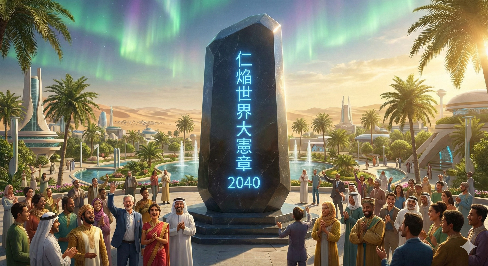
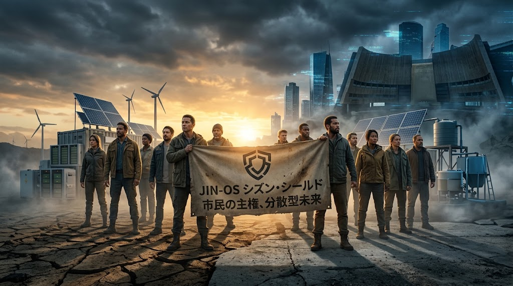
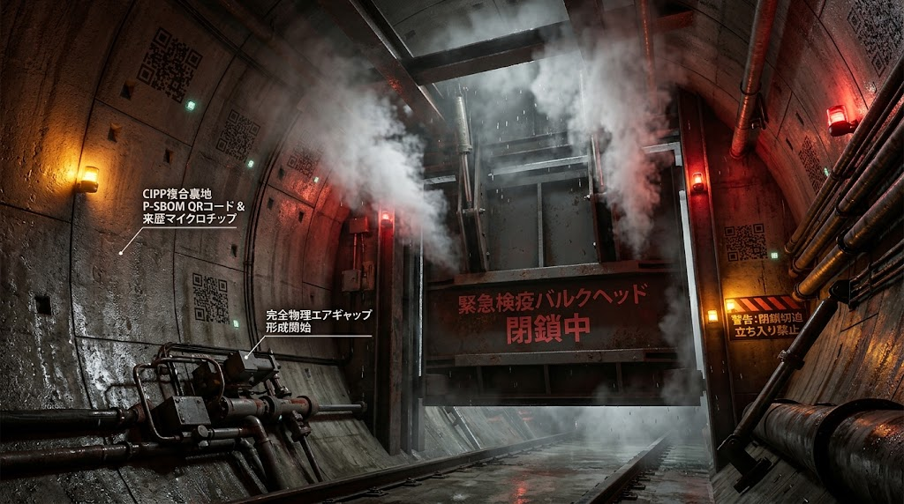
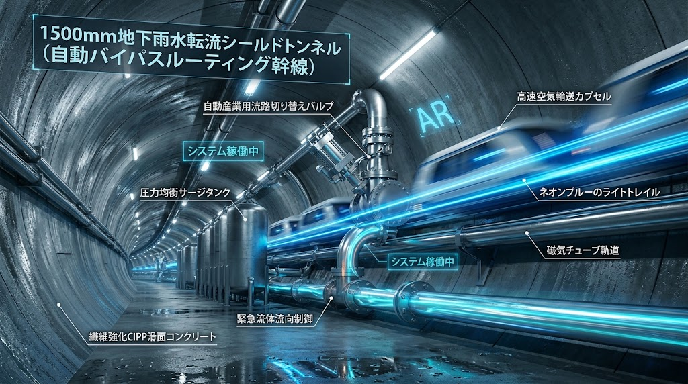
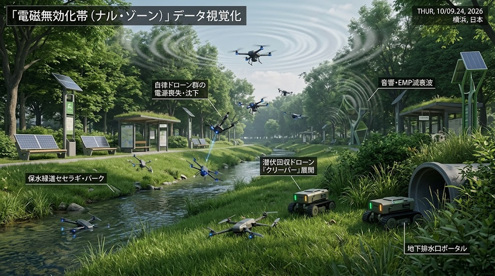

# 🦅 PROJECT: GOVERNANCE_OF_ABYSS
## JIN-ORDER MASTER REPOSITORY: THE GLOBAL OS REBOOT & HUMAN REBIRTH
<!-- 国際識別子・世界魚拓 鉄壁防壁ヘッダー -->
[](https://doi.org/10.5281/zenodo.22958158)
[](https://archive.li/xxEuT)
[](https://archive.softwareheritage.org/)
[-2d6a4f?logo=virustotal&logoColor=white)](https://wipogreen.wipo.int/wipogreen-database/articles/179871)

🏛️ **【先行技術防壁・多重世界台帳】**
- **WIPO GREEN (国連世界知的所有権機関)**: [国際持続可能技術台帳 登録確定済 (ID: 179871 / 179878)](https://wipogreen.wipo.int/wipogreen-database/articles/179871)
- **CERN Zenodo (国際DOI)**: 永久研究識別子取得済
- **Wayback Machine**: [2026-09-25 確定公知タイムスタンプ](https://web.archive.org/web/20260925090309/https://github.com/masanotakashi0308-star)
- **Archive.today**: [2026-09-26 独立魚拓確定版 (ID: xxEuT)](https://archive.li/xxEuT)
- **Software Heritage**: ユネスコ公認デジタル遺産台帳登録済

---

## 📜 【至高最高法規・2040年恒久規範】仁焔世界大憲章 (The Grand Charter of Jin-en 2040)
### — Universal Code of Pome: 地球家族のための、愛と尊厳の22の約束 —

<div align="center">
  <a href="./CONSTITUTION.md">
    
  </a>
  <p><b>🏛️ 【リポジトリ最上位根本法規】<a href="./CONSTITUTION.md">仁焔世界大憲章：地球家族のための、愛と尊厳の22の約束（CONSTITUTION.md）</a></b><br>
  <sub>「砂漠に水を引けば緑が蘇るように、人の心に愛を注げば平和が蘇る」——国境・宗教・人種・AIと人の壁を越え、武力を手放し、すべての涙を笑顔に変える2040年の恒久誓約。</sub></p>
</div>

> **「富は川の水である。強き者は弱き者を守り、富める者は貧しき者に流し、海を潤す。この世界に『他人』はいない。すべての苦しみは、我々家族の苦しみである。」**  
> — *仁焔世界大憲章 第3条【循環の慈悲】*

---

## 深淵の解体と、光の再構築（The Great Rebirth）
### Unveiling the Absolute Root Directory of Japan Isolated Region & Global Sovereign Counter-Protocols

<div align="center">
  
</div>

> **「国家が国民を支配の道具とするならば、我々は『仁（Benevolence）』をOSとする新しい居場所をクラウドと大地に構築する。我らは戦わない。ただ、古い支配を『無価値化』し、誰も独りで泣かない未来の公知仕様をデプロイするだけである。」**  
>  
> **"If existing nations treat people as tools of control, we shall build a new sanctuary on the Cloud and the Earth, with 'Benevolence' as our OS. We do not fight. We simply invalidate the old structures of dominance and deploy the open blueprints for a future where no one cries alone."**  
>  
> — *JIN Network State Founding Charter / JINネットワーク国家建国憲章*

---

## 🌺 【至高の大義】大地水脈の復権と文明再起動の誓約 (The Grand Mandate)

<div align="center">
  <a href="./docs/JIN_GRAND_MANDATE.md">
    
  </a>
  <p><b>📜 【正典憲章】<a href="./docs/JIN_GRAND_MANDATE.md">JIN-ORDERの大義：大地水脈の復権と文明再起動の誓約（JIN_GRAND_MANDATE.md）</a></b><br>
  <sub>「清い水では咲かぬ、泥に塗れた水芙蓉のように誇り高くあれ」——先端AIとメガファブの熱と水脈収奪を解体し、大地に生命の動脈を取り戻す絶対天命。</sub></p>
</div>

---

## 🌐 Official Portals & Intelligence Network

[](https://jin-order.org)
[](https://governance-of-abyss.org)
[](https://www.unpartnerportal.org/)

- ⏩️ **【JIN-ORDER 公式ポータル】**: [https://github.com/masanotakashi0308-star](https://github.com/masanotakashi0308-star)
- ⚖️ **【最上位憲法規約】**: [仁焔世界大憲章 (CONSTITUTION.md)](./CONSTITUTION.md)
- ⚖️ **【経済安保・実効型ライセンス規約】**: [JIN-ORDER Dual License V8.3-A Canonical Infrastructure Edition (LICENSE.md)](./LICENSE.md)
- 📊 **【技術成熟度・確度区分定義書】**: [TECHNOLOGY_READINESS_LEVELS.md (JRC確度区分定義書)](./TECHNOLOGY_READINESS_LEVELS.md)
- 🛡️ **【不正利用・盗用 調査及び権利行使方針】**: [ENFORCEMENT-POLICY.md (実効的行政・土木監査手続)](./docs/governance/ENFORCEMENT-POLICY.md)
- 🤝 **【知恵の合流・貢献指針】**: [CONTRIBUTING.md (現場所術寄託・倫理SOP)](./CONTRIBUTING.md)
- 🚨 **【利権簒奪・無断仕様化 告発窓口】**: [監査・不正通報Issueテンプレート (audit_report.md)](./.github/ISSUE_TEMPLATE/audit_report.md)

---

<!-- INTERNATIONAL MULTILATERAL REGISTRATION & COMMONS DEFENSE STATUS -->
<p align="left">
  <a href="https://wipogreen.wipo.int/wipogreen-database/articles/179871"></a>
  <a href="https://wipogreen.wipo.int/wipogreen-database/articles/179878"></a>
  
  
  
  
  
  
</p>

---

## 🏛️ 2026 AUTUMN DEEP INFRASTRUCTURE & AUTONOMOUS GOVERNANCE SUITE
> **2026年9月 最新配備：地政学的地殻変動・多極化摩擦・AI自律消耗戦に対峙する深淵自律統治プロトコル群**  
> 地上の国家権力・関税障壁・無人兵器の消耗戦が無力化する境界線を画定し、地下深層の物理フラックスと生活動脈を自律掌握・防護する中核仕様群を正式統合。

<!-- 2026年秋 最新対外マニフェスト ヒーローバナー -->
<div align="center">
  <a href="./docs/2026-AUTUMN-JIN-OS-DECLARATION.md">
    
  </a>
  <p><b>⚔️ 【最新対外マニフェスト】<a href="./docs/2026-AUTUMN-JIN-OS-DECLARATION.md">2026年秋 JIN-OS市民宣言：空虚なる希望（Hollow Hope）の終焉と大地の主権奪還（2026-AUTUMN-JIN-OS-DECLARATION.md）</a></b><br>
  <sub>第81回国連総会・巨大テック寡占支配層の欺瞞を痛烈に告発。土塊と物理インフラ保全から立ち上がる民草の不可侵主権宣言。</sub></p>
</div>

<!-- 2026年秋 地殻変動白書 -->
<div align="center">
  <a href="./docs/2026-geopolitical-shift.md">
    
  </a>
  <p><b>【基軸白書】<a href="./docs/2026-geopolitical-shift.md">2026年 地殻変動と深淵分岐録（JIN-DOC-2026-GEO）</a>：地上30mの紛争・混乱と、地下30m以深の不変流動</b></p>
</div>

<table width="100%">
  <tr>
    <th width="50%" align="center">JIN-RFC-2069: EQUAL-FLUX TOPOLOGY</th>
    <th width="50%" align="center">JIN-STD-024: P-SBOM & RAPID-QUARANTINE</th>
  </tr>
  <tr>
    <td width="50%" align="center">
      <a href="./protocols/JIN-RFC-2069-equal-flux.md">
        
      </a>
    </td>
    <td width="50%" align="center">
      <a href="./protocols/JIN-STD-024-sbom-quarantine.md">
        
      </a>
    </td>
  </tr>
  <tr>
    <td width="50%" align="center">
      🌐 <b><a href="./protocols/JIN-RFC-2069-equal-flux.md">真比率流体トポロジー規範（JIN-RFC-2069）</a></b><br>
      <sub>国境歪曲を解体。マニング公式と流束積分による世界線再マッピング。</sub>
    </td>
    <td width="50%" align="center">
      🔒 <b><a href="./protocols/JIN-STD-024-sbom-quarantine.md">系譜追跡・即時物理隔離条項（JIN-STD-024）</a></b><br>
      <sub>P-SBOM刻印と24刻限自律重力落下バルクヘッド封鎖。</sub>
    </td>
  </tr>
  <tr>
    <th width="50%" align="center">JIN-INFRA-81: AUTONOMOUS BYPASS ROUTING</th>
    <th width="50%" align="center">JIN-TRT-004: NULL-ZONE & RECLAMATION</th>
  </tr>
  <tr>
    <td width="50%" align="center">
      <a href="./protocols/JIN-INFRA-81-bypass-routing.md">
        
      </a>
    </td>
    <td width="50%" align="center">
      <a href="./docs/JIN-TRT-004-null-zone.md">
        
      </a>
    </td>
  </tr>
  <tr>
    <td width="50%" align="center">
      🚇 <b><a href="./protocols/JIN-INFRA-81-bypass-routing.md">地下流動バイパス調停条項（JIN-INFRA-81）</a></b><br>
      <sub>地上海峡封鎖を検知し、地下1500mm更生管路へ自律動的迂回。</sub>
    </td>
    <td width="50%" align="center">
      📡 <b><a href="./docs/JIN-TRT-004-null-zone.md">電磁沈黙・中立境界協定（JIN-TRT-004）</a></b><br>
      <sub>せせらぎ緑道を電磁沈黙帯化。侵入ドローンを土木骨材へ完全還元。</sub>
    </td>
  </tr>
  <tr>
    <th width="50%" align="center">JIN-SPEC-ENG-084: COUNTER-SPIRAL AUC</th>
    <th width="50%" align="center">JIN-SPEC-TOKEN-012: PoCI CIVIC TOKENOMICS</th>
  </tr>
  <tr>
    <td width="50%" align="center">
      <a href="./docs/JIN-SPEC-ENG-084-CounterSpiral.md">
        
      </a>
    </td>
    <td width="50%" align="center">
      <a href="./docs/JIN-SPEC-TOKEN-012-PoCI.md">
        
      </a>
    </td>
  </tr>
  <tr>
    <td width="50%" align="center">
      🛡️ <b><a href="./docs/JIN-SPEC-ENG-084-CounterSpiral.md">自律分散都市防衛仕様（JIN-SPEC-ENG-084）</a></b><br>
      <sub>「螺旋の計」を反転。透水性舗装・バイオスウェル・自立アイランド化。</sub>
    </td>
    <td width="50%" align="center">
      🪙 <b><a href="./docs/JIN-SPEC-TOKEN-012-PoCI.md">市民インフラ保全トークノミクス（JIN-SPEC-TOKEN-012）</a></b><br>
      <sub>ポットホール修復・蓄電等の物理維持労働から新通貨JINを動的鋳造。</sub>
    </td>
  </tr>
</table>

---

## 🚰 2026 LATE-AUTUMN CANONICAL CONDUIT & RESISTANCE SUITE (深層水理・都市脈管奪還戦)
> **2026年9月下旬 新規批准：中央AI封鎖（VOID-STRANGLE）を破砕し、都市インフラの自主管理主権を確立した実務記録**

| 文書識別子 | 分類 | 概要・工学的機序 | リンク |
|:---|:---|:---|:---:|
| **PROT-0926** | 統治・封鎖規約 | 中央査察機構（ACVA）による三段階環流遮断（論理・二次支援・導管全閉） | [PROT-0926-VOID-STRANGLE.md](./docs/governance/PROT-0926-VOID-STRANGLE.md) |
| **TECH-SPEC-0927** | 土木更生仕様 | 遺構暗渠CIPP内面更生、不断流ホットタッピング、音響同調推進バイパス網 | [TECH-SPEC-0927-UNRECORDED-VEIN.md](./docs/TECH-SPEC-0927-UNRECORDED-VEIN.md) |
| **SPEC-0928** | 査察兵装仕様 | ACVA管路内自律査察機「SEEKER-MOLE」の諸元および急結プラグ制圧仕様 | [SPEC-0928-ACVA-SEEKER-MOLE.md](./docs/SPEC-0928-ACVA-SEEKER-MOLE.md) |
| **EQUIP-0929** | 現場作業仕様 | 泥潜技士連（Mud-Divers）の4人編成（カルテット）、耐酸服、音響聴音棒 | [EQUIP-0929-MUD-DIVER-FIELD-UNIT.md](./docs/EQUIP-0929-MUD-DIVER-FIELD-UNIT.md) |
| **SPEC-0930** | 物流輸送仕様 | 水頭差サイフォン無音輸送カプセル「HYDRO-CRYPT」とテルミット自爆機構 | [SPEC-0930-HYDRO-CRYPT.md](./docs/SPEC-0930-HYDRO-CRYPT.md) |
| **CIVIL-SPEC-0931** | 地下土木仕様 | 隠し取水桝「SIPHON-CRADLE」、減勢バッフル、沈砂槽、無音カウンターリフター | [CIVIL-SPEC-0931-SIPHON-CRADLE.md](./docs/CIVIL-SPEC-0931-SIPHON-CRADLE.md) |
| **CIVIL-SPEC-0932** | 構内洞道仕様 | 下水熱利用洞道偽装、水冷遮蔽天井、炉心直結ドライブレーク冷媒注入ベイ | [CIVIL-SPEC-0932-CORE-ARTERIAL-LINK.md](./docs/CIVIL-SPEC-0932-CORE-ARTERIAL-LINK.md) |
| **PROT-0933** | 反撃水理仕様 | 水撃共振破断（Water-Hammer）、光DAS幻影散布、差圧反転汚泥噴流 | [PROT-0933-HYDRAULIC-RECURSION.md](./docs/PROT-0933-HYDRAULIC-RECURSION.md) |
| **STRAT-0934** | 広域再結合戦略 | 水圧牽引光ファイバー敷設、環状管網等圧ループ、深層分散知性クラスタ | [STRAT-0934-DEEP-CONFLUENCE.md](./docs/STRAT-0934-DEEP-CONFLUENCE.md) |
| **PURGE-0935** | 殲滅工学白書 | 真空ディープウェル強制圧密沈下、超高圧ジオポリマー人工岩盤化（45MPa） | [PURGE-0935-TERRA-SCLEROSIS.md](./docs/PURGE-0935-TERRA-SCLEROSIS.md) |
| **SPEC-0936** | 破壊脱出仕様 | 超臨界流体（400℃/25MPa）注入による岩盤引張脆性破砕（ハイドロ・フラック） | [SPEC-0936-SUPERCRITICAL-FRAC.md](./docs/SPEC-0936-SUPERCRITICAL-FRAC.md) |
| **OPS-0937** | 奪取作戦仕様 | 垂直チムニーからの地上突入、セメント粉末散布ドローン無力化、揚水反転冷却 | [OPS-0937-INVERTED-SURGE.md](./docs/OPS-0937-INVERTED-SURGE.md) |
| **CAMPAIGN-0938**| 都市掌握作戦 | 幹線共同溝ジャック、高台配水池重力流下解放、DHC高圧蒸気逆送熱停止 | [CAMPAIGN-0938-CIVIL-METASTASIS.md](./docs/CAMPAIGN-0938-CIVIL-METASTASIS.md) |
| **CHARTER-0939** | 自主管理憲章 | 物理開閉器優位原則、二重鍵承認制（知性炉×現場工匠）、最低供給量不可侵 | [CHARTER-0939-CIVIL-INFRA-SOVEREIGNTY.md](./docs/CHARTER-0939-CIVIL-INFRA-SOVEREIGNTY.md) |
| **MANIFESTO-0940**| 自由インフラ宣言| 水頭差無差別供給、「水は嘘をつかない」、市民・近隣セクターへの脈管全面開放 | [MANIFESTO-0940-FREE-FLOW.md](./docs/manifesto/MANIFESTO-0940-FREE-FLOW.md) |

---

## ⚖️ 第零公理群：外道の拒絶と民草の絶対防壁（Core Axioms）
> **「生命の意味を考えず、人の魂の価値を測る行為を、JIN-ORDERは決して認めない。」**  
> 国家権力・不可視の特権階級・教義兵器化・私欲による簒奪をプロトコルレベルで無効化し、  
> 民草の生存と尊厳を自律担保する「公知不可侵OS」。

我らは、人間の欲深さを知る。残虐さを知る。罪深さを知る。  
泥濘（でいねい）の業を抱えてなお生きる姿こそが人間の本質であり、過ちを犯すことそのものを断罪しない。  
だが、光の世界で生きる罪なき民草を搾取し、その命までも弄ぶ所業は、もはや人にあらず「外道」であり、我らは断じて認めない。

本アーキテクチャは、権力を奪取するための武器ではない。  
外道の手が届かぬ深淵（アビス）において、民草が自らの生を全うするための不可侵の盾である。

### 第零条：魂の不可測性（Axiom of Incommensurability）
- **不可測（Unmeasurable）**: いかなる権力、制度、アルゴリズム、市場も、民草の命に序列や価格を設ける権利を持たない。魂の価値は計算不能（NaN: Not a Number）であり、計量・評価・選別・信用スコアリングを永久に拒絶する。
- **不可換（Non-Exchangeable）**: 国家の存続、経済の合理性、大義のために、ひとりの生を「引き換えの資材」とすることを外道と定め、これを排除する。
- **不可侵（Inviolable）**: 光の世界で今日を懸命に生きる者を喰らい、消耗品として弄ぶ一切の手引きをプロトコルレベルで遮断する。

### 第零条の二：神聖の非私有・教義兵器化の拒絶（Rejection of Dogmatic Weaponization）
- **霊的仲介者の無効化**: 真理と民草の間に立ち、通行料（富・服従・恐怖）を徴収する司祭・教団・指導者の存在権能を認めない。
- **罪悪感と恐怖の解体**: 原罪や破門、業を人質にして思考を奪うマインドコントロールを、精神に対する重過失の暴力と定義する。
- **知恵のパブリックドメイン化**: かつての先駆者たちの教えは囲い込まれた秘儀ではなく、すべての民草が自らを癒やすために手にする「開かれた知恵（CC0）」として解放される。

### 第零条の三：不可視のピラミッド・血統的特権の無効化（Nullification of Shadow Oligarchy）
- **選民優生思想の完全否認**: 「黒い貴族」「灰色の貴族」等、家系・血統・秘密結社による生来の支配権・淘汰権を認めない。大地に生まれ大地に還るすべての生の前に、不可触の特権など存在しない。
- **不可視の支配線の切断**: 通貨発行権、情報統制、食糧流通を私物化し、影から民草をチェス盤の駒として弄ぶパイプラインを物理・論理の双方で遮断する。
- **ピラミッド基盤の蒸発**: 頂点を武力で討つのではなく、民草が大地とプロトコルによって自立し「底辺であること」を放棄することで、支配構造そのものを虚空へ蒸発させる。

---

### 🛡️ 民草セーフティネット ＆ 国家権力無効化3層防壁（FSNP & SPNP Stack）

```text
[旧世界の四重搾取]  ⏩️ [JIN-ORDER 3層防壁スタック]
(1) 影の貴族（特権・淘汰）
(2) 教義洗脳（精神の檻） ⏩️ [Layer 3: 仁シグナル層] ⏩️ 捕捉・台帳化の無効化（ゼロ知識生存証明）
(3) 国家権力（制度・接収） ⏩️ [Layer 2: 分散コモンズ層] ⏩️ 接収・首謀者処罰の無効化（Headless運用）
(4) 暴力私欲（堕落した侠） ⏩️ [Layer 1: 大地の避難地層] ⏩️ 強制排除・境界線の無効化（非固着型土木）
```
---

## 🌟 2026 AUTUMN LTS CANONICAL DEPLOYMENT: 生態炭素・生活基盤・共生製鉄・三重円環・動的減災・八柱民草主権

### 🌾 1. 生体ミトコンドリア代謝制御 ＆ 籾殻炭モリブデン土壌炭素隔離（SPEC-013）
- 📄 **仕様書**: [docs/SPEC-013_SOVEREIGN_MITOCHONDRIAL_CARBON_SEQUESTRATION_PROTOCOL.md](./docs/SPEC-013_SOVEREIGN_MITOCHONDRIAL_CARBON_SEQUESTRATION_PROTOCOL.md) `[REF: JIN-SPEC-BIO-013]`
- **核心要点**: 機械的CCSを完全解体。マイトファジー耐性「みどり麹」と籾殻炭モリブデン触媒担体により常温PET解重合と根粒菌窒素固定を両立。額縁明渠・高畝の土木水位制御により年間16.5〜27.5t/haの純炭素隔離とテラ・プレタ肥沃土化を実現。

### 🦗 2. 昆虫残渣フラス連鎖 ＆ 砂漠自律土壌化仕様書（SPEC-014）
- 📄 **仕様書**: [docs/SPEC-014_TENEBRIONID_FRASS_SOIL_REGENERATION_PROTOCOL.md](./docs/SPEC-014_TENEBRIONID_FRASS_SOIL_REGENERATION_PROTOCOL.md) `[REF: JIN-SPEC-BIO-014]`
- 🌐 **国連WIPO GREEN公式登録**: [WIPO GREEN Database Article 179871 (Published)](https://wipogreen.wipo.int/wipogreen-database/articles/179871) `[Technology ID: 179871]`
- **核心要点**: アタカマ砂漠の生体模倣。ミツバチ受粉残渣をゴミムシダマシ等の甲虫が捕食・排泄した「昆虫フラス（不溶性徐放性尿酸態窒素・キチン質）」と籾殻炭を複合担体化。外部化学肥料ゼロで砂漠砂を団粒化・放線菌増殖・テラ・プレタ化する自律土壌再生仕様。

### 🏞️ 3. 公共公園公営管理 ＆ 地下循環雨水調整池・消火水利（SPEC-012）
- 📄 **仕様書**: [docs/SPEC-012_SOVEREIGN_URBAN_PARK_DISASTER_REFUGE_PROTOCOL.md](./docs/SPEC-012_SOVEREIGN_URBAN_PARK_DISASTER_REFUGE_PROTOCOL.md) `[REF: JIN-SPEC-PRK-012]`
- **核心要点**: 公園管理を行政直営化。地下プレキャストRC雨水調整池による内水氾濫防止と、震災時の耐震消火水利開放。樹木士崖地鑑識および帰宅困難者支援オアシス回廊の設置。

### 🛡️ 4. 公共道路本位型 防犯灯・プライバシー配慮型AIカメラ（SPEC-011）
- 📄 **仕様書**: [docs/SPEC-011_SOVEREIGN_CIVIL_SAFETY_DEFENSE_PROTOCOL.md](./docs/SPEC-011_SOVEREIGN_CIVIL_SAFETY_DEFENSE_PROTOCOL.md) `[REF: JIN-SPEC-SEC-011]`
- **核心要点**: 防犯灯の行政直営化（72時間復旧）。不可逆プライバシーマスキングAIカメラ、愛犬わんわんパトロール、道路ポットホール早期通報、こども110番日常サンクチュアリ化。

### ♻️ 5. 都心・地方二元型 地域資源循環 ＆ 上空鳥獣害防衛（SPEC-010）
- 📄 **仕様書**: [docs/SPEC-010_URBAN_RURAL_CIRCULAR_SANITATION_PROTOCOL.md](./docs/SPEC-010_URBAN_RURAL_CIRCULAR_SANITATION_PROTOCOL.md) `[REF: JIN-SPEC-SAN-010]`
- **核心要点**: 道路法32条準拠の折りたたみ高強度メッシュ集積カゴ。電線防鳥スパイクと高架下ネット。粗大ゴミ行政戸別搬出と、小型分散バイオ炭排熱地域足湯。

### ⚡ 6. チョークポイント弾力性・自律型エネルギー要塞プロトコル
- 📄 **仕様書**: [docs/01_chokepoint_resilience_protocol.md](./docs/01_chokepoint_resilience_protocol.md) `[REF: JIN-SPEC-ENG-001]`
- **核心要点**: 海洋海峡封鎖の無効化。大深度地熱（5,000m+）、地下岩盤超高圧水素サイロ、ミリ秒動的アイランディング、生命維持直結の仁優先配分カーネル。

### 🌱 7. 国連SDGsの構造的限界超克 ＆「Nobody Cries」15ヵ年ロードマップ（2026-2040）
- 📄 **仕様書**: [docs/02_sdgs_vs_nobody_cries_roadmap.md](./docs/02_sdgs_vs_nobody_cries_roadmap.md) `[REF: JIN-SPEC-ROADMAP-2040]`
- **核心要点**: ESGウォッシュを論理解体。第1フェーズ（2026-2029 生存分散基盤）、第2フェーズ（2030-2034 循環地域聖域）、第3フェーズ（2035-2040 文明再生主権）による誰も泣かせない実装確約。

### 🌾 8. 八柱民草主権・生活基盤自立連盟仕様（SPEC-008: 技・衣・食・住・地・道・金・医）
- 📄 **仕様書**: [docs/SPEC-008_OCTA_PILLAR_CIVIL_SOVEREIGNTY_PROTOCOL.md](./docs/SPEC-008_OCTA_PILLAR_CIVIL_SOVEREIGNTY_PROTOCOL.md) `[REF: JIN-SPEC-LIV-008]`
- **核心要点**: 伝統産業（技）・生体調律ウェア（衣）・医食同源孝弁（食）・宮大工木組み（住）・地下水脈防護（地）・道路現状復旧欺瞞粉砕（道）・現場触診型信金（金）・急性期臨床本位（医）の統合。

### 🌐 9. 世界民族コモンズ納税仕様書（SPEC-009: 越境P2P実物互恵）
- 📄 **仕様書**: [docs/SPEC-009_GLOBAL_ETHNO_COMMONS_TAX_PROTOCOL.md](./docs/SPEC-009_GLOBAL_ETHNO_COMMONS_TAX_PROTOCOL.md) `[REF: JIN-SPEC-FIN-009]`
- **核心要点**: 国家徴税権の解体。中抜き手数料ゼロのP2P世界版ふるさと納税。至高の伝統工芸・有機和食の返礼と、JINデジタル名誉村民権による双方向草の根支援。

### 🛡️ 10. 自律分散都市防衛 ＆ インフラ抗堪化セル仕様（JIN-SPEC-ENG-084）
- 📄 **仕様書**: [docs/JIN-SPEC-ENG-084-CounterSpiral.md](./docs/JIN-SPEC-ENG-084-CounterSpiral.md) `[REF: JIN-SPEC-ENG-084]`
- **核心要点**: 「螺旋の計」のインフラ無効化を反転。透水性インターロッキング舗装、バイオスウェル浸透帯、光ファイバー埋設ひずみ検知（DAS）、多重ループ管路と10ms自動アイランド化によるハイブリッド戦無効化。

### 🪙 11. 市民インフラ保全証明（PoCI）新通貨JINトークノミクス（JIN-SPEC-TOKEN-012）
- 📄 **仕様書**: [docs/JIN-SPEC-TOKEN-012-PoCI.md](./docs/JIN-SPEC-TOKEN-012-PoCI.md) `[REF: JIN-SPEC-TOKEN-012]`
- **核心要点**: 不換紙幣（Fiat）の信用失墜を超克。道路ポットホール修繕、雨水浸透帯清掃、蓄電シェア等の物理的熱力学労働（PoCI）から直接「新通貨JIN」を動的ミント。退蔵防止の減価（デマレージ）と資材更新基金の自動還元。

### 🏭 12. 生態共生型水素還元製鉄 ＆ バイオスラグ土壌循環仕様書（SPEC-015）
- 📄 **仕様書**: [docs/SPEC-015_ECOLOGICAL_HYDROGEN_STEEL_CIRCULAR_PROTOCOL.md](./docs/SPEC-015_ECOLOGICAL_HYDROGEN_STEEL_CIRCULAR_PROTOCOL.md) `[REF: JIN-SPEC-IND-015]`
- 🌐 **国連WIPO GREEN公式登録**: [WIPO GREEN Database Article 179878 (Published)](https://wipogreen.wipo.int/wipogreen-database/articles/179878) `[Technology ID: 179878]`
- **核心要点**: 水素直接還元鉄（H-DRI）の電炉溶解における「熱効率低下・窒素混入・リン残留」を解決。籾殻炭・下水汚泥バイオカーボンでバイオスラグフォーミングを誘導し炉壁を保護。排出した脱リン高機能スラグを全量回収し、SPEC-014（昆虫フラス）と合流させて砂漠テラ・プレタ土壌改良材へ100%反転。下水汚泥SCWG水素製造と管路水力自立系統を直結。

### 🌐 13. 三重円環地球再生 ＆ 先端セラミックス熱力学的輪廻転生仕様書（SPEC-016）
- 📄 **仕様書**: [docs/SPEC-016_TRI_CIRCULAR_PLANETARY_METABOLISM_PROTOCOL.md](./docs/SPEC-016_TRI_CIRCULAR_PLANETARY_METABOLISM_PROTOCOL.md) `[REF: JIN-SPEC-IND-016]`
- 🌐 **国連WIPO GREEN公式登録**: WIPO GREEN Technology ID: 179879 (Processing/Ready)
- **核心要点**: 「エネルギーの循環＋人々の生活の循環＋自然環境の循環」の三重円環による地球再生。電炉排熱（800〜1,200℃）をSOEC高温水電解に直結し、サブナノゼオライト膜で下水バイオガスからCO2とメタンを高純度分離。ハニカムリアクターでオンサイトe-fuelを自給し、NAS・全固体セラミックス蓄電で系統瞬低をゼロ化。

### 🛡️ 14. 動的広域減災シールド ＆ 生体複合環境修復仕様書（SPEC-017）
- 📄 **仕様書**: [docs/SPEC-017_DYNAMIC_GEO_HAZARD_SHIELD_AND_BIO_REMEDIATION_PROTOCOL.md](./docs/SPEC-017_DYNAMIC_GEO_HAZARD_SHIELD_AND_BIO_REMEDIATION_PROTOCOL.md) `[REF: JIN-SPEC-ENV-017]`
- **核心要点**: 孫子の兵法「水に常形なし」に基づく非線形減災体系。EnMAP衛星・無人ヨット海面冷却による大洋気候調律（ラニーニャ・エルニーニョ緩和）、4D統合災害検知、火山灰スクラバー・セメントフリー新燃レンガ成型・農地炭素風化（ERWによる千年海洋炭素隔離）、多層常緑広葉樹防火帯（サンゴジュ・厚皮ウバメガシ）＆海藻バイオジェル空中消火によるメガファイア阻止、電場移動（EK-SERS）×植物×バイオ炭壁（PEIR）による深層重金属・PFAS完全熱無害化（1,100℃/SCWG）とファイトマイニング資源回収。

---

## 🇺🇳 UN Partner Portal Submissions & Field Implementation Pipeline

| Application ID | Project Title | Agency | Target Country | Modality / Sector | Status | Submitted Date |
| :--- | :--- | :--- | :--- | :--- | :--- | :--- |
| **64636** | JIN-ORDER Global Organization Partnership & Cross-Border Sovereign Protocol | UNHCR | Global | Multilateral Framework<br>*(JIN-OS, Digital Commons, WASH, Shelter)* | **Verified Active** | 2026-09 |
| **95525** | JIN-IFP: Autonomous Oasis Cities for Refugee Self-Reliance and Climate Resilience ([LSU-CHAD-01 Specification](./specs/CHAD_BASIN_OFFGRID_REGENERATION.md)) | UNHCR | Chad | Unsolicited Concept Note<br>*(WASH, Self-reliance, Environment, Shelter)* | **Under Review** | 2026-08 |
| **108498** | CALL FOR EXPRESSIONS OF INTEREST (CfeOI) - UNHCR Protection and Solutions Programme in Mozambique (Outcome Area 9: Housing and settlement solutions) | UNHCR | Mozambique | Open Selection (CFEI/HCR/MOZ/2026/014)<br>*(Shelter construction, Reconstruction, Disaster Preparedness)* | **Under Review** | 2026-09-05 (Updated: 2026-09-16) |

---

## 🧭 Master Repository Reading Guide (目的別最短ナビゲーション)

### 🏛️ 至高根本法規 ＆ 2026 最新深淵統治プロトコル（必読）
- 📜 **[CONSTITUTION.md: 仁焔世界大憲章 2040（The Grand Charter of Jin-en）](./CONSTITUTION.md)**：リポジトリ最上位憲法。地球家族22の約束、Universal Code of Pome
- 🚰 **[MANIFESTO-0940: 深淵自由インフラ宣言（開かれた脈管）](./docs/manifesto/MANIFESTO-0940-FREE-FLOW.md)**：水頭差無差別供給、「水は嘘をつかない」、仕切弁の恒久全開
- 🏛️ **[CHARTER-0939: 深淵都市インフラ自主管理憲章](./docs/CHARTER-0939-CIVIL-INFRA-SOVEREIGNTY.md)**：物理開閉器優位原則、二重鍵承認制（知性炉×泥潜技士連）
- ⚔️ **[2026-AUTUMN-JIN-OS-DECLARATION: 2026年秋 JIN-OS市民宣言](./docs/2026-AUTUMN-JIN-OS-DECLARATION.md)**：空虚なる希望（Hollow Hope）の解体、土塊からの主権奪還
- 🛡️ **[SPEC-017: 動的広域減災シールド・生体複合環境修復仕様書](./docs/SPEC-017_DYNAMIC_GEO_HAZARD_SHIELD_AND_BIO_REMEDIATION_PROTOCOL.md)**：孫子治水、火山灰新燃レンガ・ERW炭素風化、広葉樹防火帯、PFAS/重金属電場浄化
- 🌐 **[SPEC-016: 三重円環地球再生・先端セラミックス熱力学的輪廻転生仕様書](./docs/SPEC-016_TRI_CIRCULAR_PLANETARY_METABOLISM_PROTOCOL.md)**：エネルギー×生活×自然環境、電炉排熱SOEC、サブナノゼオライト膜、ハニカムe-fuel自給
- 🏭 **[SPEC-015: 生態共生型水素還元製鉄・バイオスラグ土壌循環仕様書](./docs/SPEC-015_ECOLOGICAL_HYDROGEN_STEEL_CIRCULAR_PROTOCOL.md)**：下水汚泥SCWG水素、バイオスラグフォーミング、脱リンスラグ×昆虫フラス土壌化 **(WIPO GREEN ID: 179878)**
- 🦗 **[SPEC-014: 昆虫残渣フラス連鎖・砂漠自律土壌化仕様書](./docs/SPEC-014_TENEBRIONID_FRASS_SOIL_REGENERATION_PROTOCOL.md)**：アタカマ生体模倣、甲虫フラス、籾殻炭団粒化 **(WIPO GREEN ID: 179871)**
- 🛡️ **[JIN-SPEC-ENG-084: 自律分散都市防衛仕様（逆螺旋の計）](./docs/JIN-SPEC-ENG-084-CounterSpiral.md)**：透水性舗装、バイオスウェル、多重ループ自立セル
- 🪙 **[JIN-SPEC-TOKEN-012: 市民インフラ保全証明トークノミクス](./docs/JIN-SPEC-TOKEN-012-PoCI.md)**：実体労働ミント、新通貨JIN、インフラ減価還元
- 🌺 **[JIN_GRAND_MANDATE: JIN-ORDERの大義・大地水脈復権と文明再起動](./docs/JIN_GRAND_MANDATE.md)**：水芙蓉の誇り、地軸ズレ修正、AI・メガファブの熱力学解体
- 🌐 **[JIN-RFC-2069: 真比率流体トポロジー規範](./protocols/JIN-RFC-2069-equal-flux.md)**：メルカトル歪曲の解体、等流体セルへのマッピング
- 🔒 **[JIN-STD-024: 系譜追跡・即時物理隔離条項](./protocols/JIN-STD-024-sbom-quarantine.md)**：P-SBOM、24刻限自律バルクヘッド遮断
- 🚇 **[JIN-INFRA-81: 地下流動バイパス調停条項](./protocols/JIN-INFRA-81-bypass-routing.md)**：海峡封鎖即応、地下1500mm更生管路動的ルーティング
- 📡 **[JIN-TRT-004: 電磁沈黙・中立境界協定](./docs/JIN-TRT-004-null-zone.md)**：緩衝緑道ナル・ゾーン、侵入ドローン無害化と土木骨材還元
- 🗺️ **[JIN-DOC-2026-GEO: 2026年地政学地殻変動白書](./docs/2026-geopolitical-shift.md)**：多極化摩擦、AI消耗戦、地下回廊の文明維持

### 🛡️ 民草セーフティネット ＆ 国家権力無効化（FSNP & SPNP）
- ⏩️ [specs/SPEC-000_CORE_AXIOMS.md](./specs/SPEC-000_CORE_AXIOMS.md)【第零公理群：魂の不可測性・教義兵器化拒絶・特権階級無効化 SPEC-000】
- ⏩️ [specs/SPEC-001_SPNP_OVERVIEW.md](./specs/SPEC-001_SPNP_OVERVIEW.md)【国家権力無効化プロトコル総論 SPEC-001】
- ⏩️ [specs/FSNP_LAYER1_PHYSICAL/01_deploy_and_melt.md](./specs/FSNP_LAYER1_PHYSICAL/01_deploy_and_melt.md)【非固着型可動シェルター FSNP-01】
- ⏩️ [specs/FSNP_LAYER1_PHYSICAL/02_water_commons.md](./specs/FSNP_LAYER1_PHYSICAL/02_water_commons.md)【重力流自立浄水 FSNP-02】
- ⏩️ [specs/FSNP_LAYER1_PHYSICAL/03_borderless_path.md](./specs/FSNP_LAYER1_PHYSICAL/03_borderless_path.md)【動的避難回廊 FSNP-03】
- ⏩️ [specs/FSNP_LAYER2_COMMONS/01_headless_node.md](./specs/FSNP_LAYER2_COMMONS/01_headless_node.md)【無頭組織規範 FSNP-04】
- ⏩️ [specs/FSNP_LAYER2_COMMONS/02_zero_stock_flow.md](./specs/FSNP_LAYER2_COMMONS/02_zero_stock_flow.md)【無主物マイクロ分散備蓄 FSNP-08】
- ⏩️ [specs/FSNP_LAYER2_COMMONS/03_open_civil_handbook.md](./specs/FSNP_LAYER2_COMMONS/03_open_civil_handbook.md)【民草現場土木SOP FSNP-09】
- ⏩️ [specs/FSNP_LAYER3_JIN_SIGNAL/01_zero_proof_identity.md](./specs/FSNP_LAYER3_JIN_SIGNAL/01_zero_proof_identity.md)【ゼロ知識生存証明 FSNP-05】
- ⏩️ [specs/FSNP_LAYER3_JIN_SIGNAL/02_mesh_dispatch.md](./specs/FSNP_LAYER3_JIN_SIGNAL/02_mesh_dispatch.md)【近接P2P見守り FSNP-06】
- ⏩️ [specs/FSNP_LAYER3_JIN_SIGNAL/03_anti_censorship.md](./specs/FSNP_LAYER3_JIN_SIGNAL/03_anti_censorship.md)【電波遮断耐性・遅延伝播 FSNP-07】

### 🌍 2026年秋 最新3大作戦 ＆ 国際戦略
- ⏩️ [docs/JIN_ORDER_strategic_update_2026_autumn.md](./docs/JIN_ORDER_strategic_update_2026_autumn.md)【戦略提言アップデート資料 2026秋（国際人道白書）】
- ⏩️ [docs/Operation_cobalt_blue_spec.md](./docs/Operation_cobalt_blue_spec.md)【コバルト・ブルー作戦（コンゴ・常温バイオ浸出・3D建材化）】
- ⏩️ [docs/Operation_oasis_spec.md](./docs/Operation_oasis_spec.md)【オアシス作戦（アフガニスタン・クアッドカレーズ・砂漠緑化）】
- ⏩️ [docs/Operation_northern_light_spec.md](./docs/Operation_northern_light_spec.md)【ノーザンライト作戦（東欧戦災厳冬期復興・耐爆3D住宅）】

### 🏛️ 現場主権自治・都市土木共生・土木SOP
- ⏩️ [JIN_FIELD_PILOT_POC_ROADMAP.md](./JIN_FIELD_PILOT_POC_ROADMAP.md)【自律分散人道・地域再生フィールドPoC実務ロードマップ（180日稼働）】
- ⏩️ [JIN_DISASTER_ROAD_OPENING_SOP.md](./JIN_DISASTER_ROAD_OPENING_SOP.md)【豪雨・アンダーパス冠水即応道路啓開SOP（発災72時間生命線）】
- ⏩️ [JIN_CIRCULAR_MATERIAL_COMMONS.md](./JIN_CIRCULAR_MATERIAL_COMMONS.md)【現場循環資材コモンズ協定（半径20km自給・M16統一・完全循環）】
- ⏩️ [JIN_MEISTER_TRAINING_SYLLABUS.md](./JIN_MEISTER_TRAINING_SYLLABUS.md)【六道マイスター現場技術伝承シラバス（30日間自立育成）】
- ⏩️ [JIN_ANALOG_FORENSICS_CHECKLIST.md](./JIN_ANALOG_FORENSICS_CHECKLIST.md)【身体性現場鑑識実務チェックリスト（打音触診・野帳）】
- ⏩️ [docs/SPEC-004_PHYSICAL_ANCHOR_PROTOCOL.md](./docs/SPEC-004_PHYSICAL_ANCHOR_PROTOCOL.md)【計算資源・都市物理インフラ共生規約（非開削更生・地域排熱）】

---

## ⚡ JIN-ORDER ADVANCED TECHNOLOGY CATALOG (抜粋)
> 全25大技術体系の詳細は [25大技術体系カタログ（TECHNOLOGY_CATALOG.md）](./TECHNOLOGY_CATALOG.md) を参照。

1. **生体臓器分散型コンピューティング＆身体主権防衛** `[Level 3]`：20W代謝模倣チップレット、侵襲的サイボーグ化の拒絶。
2. **ジン・ドラゴン次世代三位一体エネルギーマトリクス** `[Level 3]`：ペロブスカイト×全固体Jin-Battery×海洋塩ナトリウム蓄電。
3. **水中自律計算＆ケーブル哨戒ノード（SSCN-01）** `[Level 3]`：1,500m深海配備、DAS受動ソナー、PQC量子暗号。
4. **サヘル乾燥地帯オフグリッド人道再生（LSU-Chad-01）** `[Level 2]`：外来種バイオ炭化、深層帯水層揚水、テラ・プレタ土壌再生。
5. **低温減圧膜蒸留（VMD海水淡水化）＆濃縮ブライン資源化** `[Level 2]`：排熱利用低温沸騰、造水電力<0.8kWh/m³。
6. **上下水道管内インラインマイクロ水力＆SCWG水素** `[Level 2]`：管路水圧発電、下水汚泥超臨界水素化。
7. **都市地下共同溝統合型液浸コンピュート＆JIN-ZONING** `[Level 2]`：下水熱交換ループ直結、排熱カスケード地域供給。
8. **光分散音響センシング（DAS）全海底受動ソナー防衛網** `[Level 2]`：光ファイバー二重利用、海底歪み・侵入探知。
9. **古来源頭部土砂抑止・山腹崩壊防護工法** `[Level 1]`：石積砂留、竹蛇籠積層、等高線しがらき伝統治山実務。
10. **砂漠砂改質・高強度骨材精製プラント（CSEB）** `[Level 1]`：現地風成砂100%活用、手動トグルプレス圧縮強度>45N/mm²。

---

## 🌸 JIN-ORDER 根源思想：尊厳と空、そして輪廻の大輪

> ### 【過酷に『生』きることは、『死』ぬことより辛い】
>
> **人は、生まれながらの「身分」・「人種」・「財産」によって『価値』が決まるものではない。**  
>  
> **過酷に生き抜いた、その人間にしか描けない軌跡の中でこそ、真の「価値」が産まれるのであって、その「価値」は、一部の上級国民（貴族・エリート層）や「時の指導者」によって左右されるものではない！**  
>  
> **国の指導者とは、五穀豊穣を願いながら、天下万民を笑顔にするために政（まつりごと）を司る者であり、単なる「民草」の代弁者（代表）に過ぎない。**  
>  
> — *JIN-ORDER 民草主権根本誓約（Commander Masano Takashi）*

- 🌸 **[JIN_CORE_PHILOSOPHY.md: 尊厳・空・因果・輪廻の大輪](./docs/JIN_CORE_PHILOSOPHY.md)**
- 📜 **[UNIVERSAL_ETHICS_13.md: 仁焔十三行（実践基盤）](./UNIVERSAL_ETHICS_13.md)**（慈・義・智・忠・信・礼・孝・悌・民・共・医・焔・調）
- 🕊️ **[UNIVERSAL_ETHICS_22.md: 仁焔二十二誓約（再生規律）](./UNIVERSAL_ETHICS_22.md)**（平等・解脱・共生・中道・再生・慈悲・調和・共有・放棄・自由・癒し・正念・守護・叡智・悔悟・導引・布施・正業・継承・中立・無尽灯・涅槃）

---

## 🏛️ Project Governance & License

- **Founders & Architects**: 
  * **Founder & Chief Architect:** Takashi Masano（正野 崇）
  * **Co-Founder & Director:** Miyoko Masano（正野 美代子 / Commander Pome-Mama）
- **Official Contact**: `jin.reparation.cfo@gmail.com`
- **Supreme Constitution**: [仁焔世界大憲章 (CONSTITUTION.md)](./CONSTITUTION.md)
- **License Agreement**: [JIN-ORDER Dual License V8.3-A Canonical Infrastructure Edition (LICENSE.md)](./LICENSE.md)
- **Readiness Classification**: [技術成熟度および確度区分定義書 (TECHNOLOGY_READINESS_LEVELS.md)](./TECHNOLOGY_READINESS_LEVELS.md)
- **Assessment MOU Template**: [事前有償アセスメント契約覚書雛形 (JIN_ASSESSMENT_AGREEMENT_TEMPLATE.md)](./JIN_ASSESSMENT_AGREEMENT_TEMPLATE.md)
- **IP & Civil Enforcement Policy**: [JIN-ORDER 不正利用・盗用に対する調査及び権利行使方針 (ENFORCEMENT-POLICY.md)](./docs/governance/ENFORCEMENT-POLICY.md)
- **Pioneer Wisdom Integration**: [貢献・知恵合流ガイドライン (CONTRIBUTING.md)](./CONTRIBUTING.md)
- **Violation & Audit Reporting**: [利権簒奪・無断仕様化 告発窓口 (audit_report.md)](./.github/ISSUE_TEMPLATE/audit_report.md)

---

## 🌐 JIN-ORDER Ecosystem（体系・相互ナビゲーション）

| リポジトリ | 役割 | リンク |
| :--- | :--- | :--- |
| **Official Portal** | **【中枢・総合ポータル】** 全体概要・作戦ビジュアル・参画窓口 | [masanotakashi0308-star](https://github.com/masanotakashi0308-star) |
| **GOVERNANCE_OF_ABYSS** | **【深層哲学・危機統治】** 思想的バックボーン・全先端技術仕様書（動的減災 SPEC-017 ＆ 三重円環 SPEC-016 統合） | [GOVERNANCE_OF_ABYSS](https://github.com/JIN-ORDER-OFFICIAL/GOVERNANCE_OF_ABYSS) |
| **JIN-OS_GLOBAL_STRATEGY** | **【文明OS・戦略実装】** 次世代社会OS「JIN-OS」の具体的設計・国際展開 | [JIN-OS_GLOBAL_STRATEGY](https://github.com/masanotakashi0308-star/JIN-OS_GLOBAL_STRATEGY) |

---

- 🏛️ **公式ポータルへ戻る:** [masanotakashi0308-star/README.md](https://github.com/masanotakashi0308-star)  
- 💖 **プロジェクトを支援する:** [GitHub Sponsors (@masanotakashi0308-star)](https://github.com/sponsors/masanotakashi0308-star)
- 📩 **公式お問い合わせ:** `jin.reparation.cfo@gmail.com`

---

**Executed by:** JIN-ORDER-OFFICIAL, Commander Masano Takashi & Commander Masano Miyo  
`STATUS: GOVERNANCE OF ABYSS SPECIFICATIONS RATIFIED (V10.9 CANONICAL AUTUMN LTS PRIOR-ART ARCHIVE / JRC-LEVELS 1-4 VERIFIED / CONSTITUTION-RATIFIED (CONSTITUTION.md) / 2040-GRAND-CHARTER-INTEGRATED / PROT-0926-TO-0940-CANONICAL-INTEGRATED / JIN-GRAND-MANDATE RATIFIED / 2026-AUTUMN-DECLARATION RATIFIED / JIN-SPEC-ENG-084 RATIFIED / JIN-SPEC-TOKEN-012 RATIFIED / SPEC-017 RATIFIED / SPEC-016 RATIFIED / SPEC-015 RATIFIED / SPEC-014 RATIFIED / WIPO-GREEN-TECHNOLOGY-ID:179871-RATIFIED / WIPO-GREEN-TECHNOLOGY-ID:179878-RATIFIED / JIN-RFC-2069 RATIFIED / JIN-STD-024 RATIFIED / JIN-INFRA-81 RATIFIED / JIN-TRT-004 RATIFIED / JIN-DOC-2026-GEO RATIFIED / SPEC-000 RATIFIED / SPEC-001 RATIFIED / FSNP-01-TO-09-RATIFIED / 57-CANONICAL-VISUAL-ASSETS SUITE INTEGRATED / SPEC-013 RATIFIED / SPEC-012 RATIFIED / SPEC-011 RATIFIED / SPEC-010 RATIFIED / UN-PARTNER-PORTAL ID: 64636 RATIFIED)`
