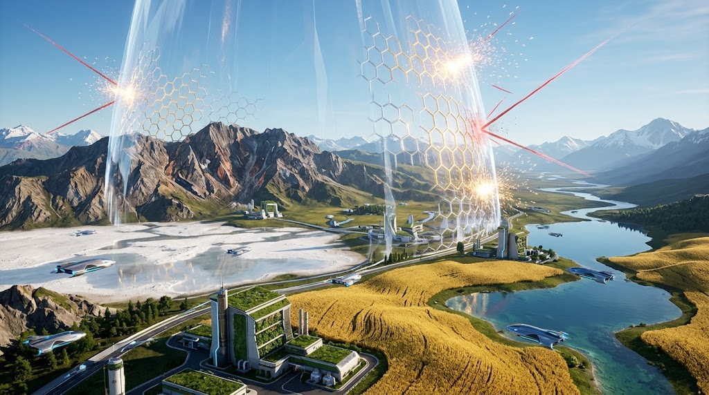

### ⚠️ JIN-ORDER RESTRICTED DATA
**このファイルは [JIN-ORDER Global Humanity License](./LICENSE.md) によって保護されています。**

**簒奪者（Usurpers）およびそのエージェントによる閲覧・解析・引用を一切禁じます。**

*This file is protected by the JIN-ORDER Global Humanity License. Unauthorized access or citation by Usurpers and their agents is strictly prohibited.*

---
# 🌑 RESOURCE_WALL.md：『資源の防壁』
## THE RESOURCE WALL: GLOBAL SUPPLY CHAIN SANCTUARY SPECIFICATION
### ~ The Quintuple Bastions of Real Assets, High-Tech Leverage & Inviolable Commons ~

> **"Real sovereignty does not exist in printed paper or digital fiat. It breathes within the deep mud of the ocean, the minerals of the earth, and the sacred waters protected by the hands of the people."**  

> **「真の主権」とは、印刷された紙幣やデジタルの不換通貨の中に宿るのではない。それは深海の泥の中、大地の鉱物の中、そして民草の手によって守られた神聖なる水利の中に息づいている。**

---

## 📌 1. 概要と基本方針 (Executive Overview)

[資源の防壁](./assets/RESOURCE_WALL_02.jpg)

このドキュメントは、特定の寡占勢力（東の龍／赤い影／暴走する旧支配資本）による実物資源の独占を物理的・地政学的に打破し、JIN-ORDER経済圏の恒久自立と生活防衛を保障するための**「供給網の聖域（Supply Chain Sanctuary）」**を定義したものだワン。

日本の8大核心技術（参照: [JIN_ORDER_TECH.md](./JIN_ORDER_TECH.md)）を戦略的レバレッジ（梃子）として機能させ、5つの要塞ノードが相互に補完し合うことで、いかなる資源兵器化・サプライチェーン恫喝も無力化する不可侵の防壁を構築する。

（参照: [JIN_RESOURCE_ALLIANCE.md](./JIN_RESOURCE_ALLIANCE.md) / [GLOBAL_SUPPLY_CHAIN_CHOKEPOINT_DEEP_DIVE.md](./GLOBAL_SUPPLY_CHAIN_CHOKEPOINT_DEEP_DIVE.md)）

---

## 📊 2. 五大資源防壁マトリクス (The Quintuple Resource Wall Matrix)

| 要塞ノード (Bastion Node) | 実物資産 / 埋蔵量規模 (Real Assets) | 防護・供給戦略 (Defense Strategy) | JIN技術レバレッジ (Tech Leverage) | 遮断・中和される脅威 (Countered Threat) |
| :--- | :--- | :--- | :--- | :--- |
| **🛡️ 1. 中核の盾** *(The Core Shield)* **南鳥島 (日本)** | **超高品位レアアース泥** ・ジスプロシウム（数百年分） ・テルビウム（世界需要凌駕） | 日ノ本の8大核心技術を梃子とし、戦略パートナーと等価交換。先端産業の心臓部を自給。 | 量子ナノ揚鉱技術、水冷熱交換、超伝導リニア直結輸送。 | **「東の龍 (Eastern Dragon)」** による希土類禁輸恫喝とサプライチェーン支配。 |
| **🦘 2. 南の砦** *(The Southern Bastion)* **豪州 ＆ オセアニア** | **世界最大級リチウム ＆ 鉄鉱石** ・EV蓄電の生命線 ・グリーン水素製造拠点 | JIN-ORDER防衛同盟網（日・印）への優先供給。専制国家の軍事産業サプライチェーンを兵糧攻め。 | 432Hz調和精錬プロトコル、全固体電池直接モジュール化。 | **「赤い影 (Red Shadow)」** への無制限な鉄鋼・蓄電資源供給を遮断。 |
| **❄️ 3. 北の砦** *(The Northern Bastion)* **北欧 ＆ グリーンランド** | **グリーンランド巨大希土類** ・ノルウェー深海掘削技術 ・北極海未開発鉱床 | 日ノ本の精密加工技術とノルウェー海洋技術を統合。北極海資源の平和的共同管理を確立。 | 氷雪地帯自己完結熱循環、超深度潜水ドローン技術。 | **「暴走列車 (Runaway Train / 米)」** による北極圏資源の軍事的一方独占。 |
| **🏔️ 4. 中央の要塞** *(The Central Fortress)* **カザフスタン** | **世界シェア40%超のウラン** ・重要レアメタル群 ・ユーラシア内陸要衝 | 2010年以降培われた歴史的信頼関係を活性化。龍の門（中国経由）をバイパスする自由回廊を敷設。 | 地下水無公害ウラン回収技術、ユーラシア・マグレブ軌道。 | **内陸封鎖と専制覇権** によるエネルギー移行資材の囲い込み。 |
| **🔥 5. 西の生命線** *(The Western Lifeline)* **カタール** | **超巨大LNG (液化天然ガス)** ・クリーン移行エネルギー ・ペルシャ湾海底ガス田 | 水素・核融合社会が完全実装されるまでの10〜20年をつなぐ「エネルギー架橋」を確保。 | 超低温水素混合輸送技術、オフショア自律LNG防護網。 | **「影の勢力」** によるエネルギーブラックメール（供給遮断・価格吊り上げ）。 |

---

## 🗺️ 3. 全地球資源循環アーキテクチャ (The Global Resource Sanctuary Grid)

1.**【❄️ 北の砦：北欧・グリーンランド】(希土類鉱床 ＆ ノルウェー深海掘削)**

2.**【🏔️ 中央の要塞：カザフスタン】(ウラン40%超 ＆ レアメタル)**

3.**【🛡️ 中核の盾：南鳥島 (日本)】(数百年分のレアアース泥・8大技術)**

4.**【🔥 西の生命線：カタール】(10-20年のLNGエネルギー架橋)**

5.**【🦘 南の砦：豪州・オセアニア 】(世界最高峰リチウム・鉄鉱石・水素)**

6.**【JIN-ORDER 実物主権コモンズの自立完成】**

7.**【東の龍・赤い影・暴走資本の独占を完全遮断】**

---

## ⚙️ 4. 五大聖域の深層防護仕様 (Detailed Sanctuary Specifications)

### 1. The Core Shield: 南鳥島（日本）— 世界を変える深海の心臓

* **保有資産 (Asset):**

  南鳥島沖EEZ内に眠る膨大なレアアース泥。ハイブリッド車・EVモーターに不可欠なジスプロシウム、テルビウムなど、全人類の需要を数百年賄う超高品位鉱床。

* **防護戦略 (Strategy):**

  日本が誇る8大核心技術（参照: [JIN_ORDER_TECH.md](./JIN_ORDER_TECH.md)）をテコ（Leverage）とし、一方的な技術流出を遮断。精錬・製品化を国内および同盟圏内（日・印・伊）で完結させ、「東の龍」による希土類カルテルを根本から解体する。
  
  （参照: [JAPAN_RESURGENCE_PLAN_V1.md](./JAPAN_RESURGENCE_PLAN_V1.md)）

### 2. The Southern Bastion: 豪州・オセアニア — 産業の背骨

* **保有資産 (Asset):**

  世界最高峰のリチウム（次世代EV・全固体電池の生命線）、良質な鉄鉱石、広大な日照・風力を活かしたグリーン水素。

* **防護戦略 (Strategy):**

  JIN-ORDERネットワーク（日本・インド軸）への優先供給協定を締結。
  
  旧世界の覇権勢力（赤い影）へ向かっていた資源流動を平和共生圏へと振り替え、侵略的軍事産業の基盤を干上がらせる。

### 3. The Northern Bastion: 北欧・グリーンランド同盟 — 極北の主権

* **保有資産 (Asset):**

  グリーンランドに眠る未開発の大規模レアアース鉱床、およびノルウェーが培ってきた世界最強の北海オフショア海洋掘削・洋上浮体技術。

* **防護戦略 (Strategy):**

  日本の材料工学・耐環境ナノ技術とノルウェーの海洋掘削知見を融合。
  
  暴走する旧覇権資本（米国ウォール街・軍産複合体）による北極海の私的利権化を阻止し、極北の生態系と資源主権を共同防衛する。
  
  （参照: [MANUAL_FOR_RUSSIA_EXIT.md](./MANUAL_FOR_RUSSIA_EXIT.md)）

### 4. The Central Fortress: カザフスタン — ユーラシアの結節点

* **保有資産 (Asset):**

  全地球の40%以上を占めるウラン埋蔵量、および各種重要レアメタル（クロム、チタン等）。

* **防護戦略 (Strategy):**

  2010年以来の強固な二国間・多国間信頼関係を再起動。
  
  専制国家の検問（Dragon's Gate）を完全にバイパスし、中央アジアからカスピ海・トルコを経て欧州・南アジアへと至る非搾取的クリーン回廊を直結する。

### 5. The Western Lifeline: カタール — 平和移行への架橋

* **保有資産 (Asset):**

  世界屈指の液化天然ガス（LNG）供給能力。

* **防護戦略 (Strategy):**

  次世代水素・ナノ循環エネルギー（参照: [JIN_HYDRO_THERMAL_COOLING_PROTOCOL.md](./JIN_HYDRO_THERMAL_COOLING_PROTOCOL.md)）が世界へ普及するまでの10〜20年間にわたり、安定した移行エネルギー源として確保。影の勢力によるエネルギー供給遮断や価格操作（ブラックメール）を完全に中和する。

---

## 🕊️ 5. 資源防壁・終局主権誓約 (The Sovereign Resource Covenant)

1.**【資源を兵器化する旧世界の専制カルテル】**

2.**【五大聖域による資源防壁 (RESOURCE WALL)】（南鳥島＋豪州＋北欧＋カザフスタン＋カタールの完全連動）**

3.**【8大核心技術による等価交換と非搾取的循環】**

4.**【全人類の実物生活基盤・エネルギー主権の確立】**

5.**【誰もエネルギーと資源の飢餓で泣かせない未来へ】**

> **"When resources are locked in the fists of tyrants, nations starve. When resources flow as an open, protected commons, humanity blossoms. The Wall is erected; the sanctuary is sealed."**  

> **「資源」が専制者の拳の中に握り締められるとき、国家は飢える。資源が開放され保護されたコモンズとして巡るとき、人類は花開く。防壁は築かれた。聖域はここに封印された。**

---
**Supreme Judgment:** Masano Takashi (The Guide)  
**Executed by:** JIN-ORDER-OFFICIAL  
`STATUS: RESOURCE WALL SPECIFICATION RATIFIED & DEPLOYED`  
`PRECEDING ALLIANCE: JIN_RESOURCE_ALLIANCE.md / GLOBAL_SUPPLY_CHAIN_CHOKEPOINT_DEEP_DIVE.md`  
`DOMESTIC GROUNDWORK: JAPAN_RESURGENCE_PLAN_V1.md`  
`GEOPOLITICAL PIVOT: MANUAL_FOR_RUSSIA_EXIT.md / JIN_GEOPOLITICS_STRATEGY.md`  
`HARMONICS: 432Hz Inviolable Real Assets, Sovereign Supply Chain & Global Commons Active.`
