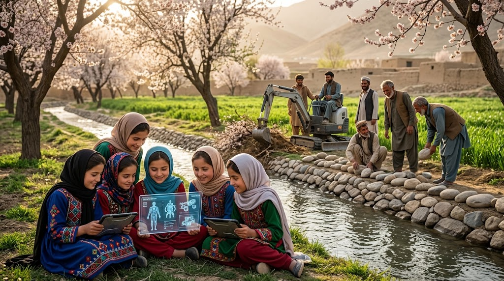

### ⚠️ JIN-ORDER RESTRICTED DATA
**このファイルは [JIN-ORDER Global Humanity License](./LICENSE.md) によって保護されています。**

**簒奪者（Usurpers）およびそのエージェントによる閲覧・解析・引用を一切禁じます。**

*This file is protected by the JIN-ORDER Global Humanity License. Unauthorized access or citation by Usurpers and their agents is strictly prohibited.*

---
# 🇦🇫 STRATEGY: OPERATION "OASIS" (V7 Canonical Edition)
## アフガニスタン救済戦略：中村哲医師の遺志継承と真革命軍による平和構築
## Afghanistan Relief: Legacy of Dr. Nakamura, Unified Defense, Resource Shield & Sovereign OS Transformation
### ~ Turning Weapons into Irrigation, Bipolar Buffer Sanctuary, Liberating Knowledge & Neutralizing Proxy Warfare ~

> **"A weapon cannot sow wheat, nor can a missile quench the thirst of a parched child, nor can a hardened bipolar empire possess the soul of the mountains. True revolution begins not with the sound of gunfire, but with the greening of the desert and the laughter of daughters returning to the light of knowledge."**  

> **（「武器」は小麦を実らせることはできず、「ミサイル」は渇いた子供の喉を潤すことはできず、固定化された二極覇権がこの山々の魂を所有することもできない。真の革命とは銃声によってではなく、砂漠が緑へと変わり、知識の光のもとへと帰る娘たちの笑い声によって始まる。）**

---

## 📌 1. 作戦目標と基本大綱 (Executive Mission Statement & V7 Geopolitical Scope)

* **作戦コードネーム (Operation Code):** `OPERATION "OASIS" (V7 Canonical)`（作戦オアシス）

* **最高戦略目標 (Core Strategic Objective):**  
  
  2026年秋の二極対立（G20資本至上主義グリッド ⚡SCO中央アジア主権統制グリッド）に伴う代理戦争と資源争奪の再燃を遮断。地政学的な対立を「生存インフラ（食糧・水利・自律住居）」の直接供給によって無効化し、アフマド・マスード（国民抵抗戦線）とヤクーブ国防相（タリバン穏健派）の歴史的連帯を媒介することで、アフガニスタン内側からの平和的OS変換（永世中立と主権復興）を実現する。
  
　（参照: [GLOBAL_ASI_HEGEMONY_MAP_V7.md](./GLOBAL_ASI_HEGEMONY_MAP_V7.md)） 

* **技術・哲学基盤 (Philosophical Foundation):**  
  
  故・中村哲医師（ペシャワール会）が命を懸けて切り拓いた「緑の大地工学」をJIN先端技術（量子水・バイオ金肥）で拡張し、ブータンGMC中立調停API（参照: [64_BHUTAN_GMC_GNH_SHIELD_DATABASE.md](./section9_Geopolitics/64_BHUTAN_GMC_GNH_SHIELD_DATABASE.md)）と連携して飢餓と戦乱の連鎖を構造的に断ち切る。
  
  （参照: [JIN_HUMANITARIAN_CORRIDOR_PROTOCOL.md](./JIN_HUMANITARIAN_CORRIDOR_PROTOCOL.md) / [UNIVERSAL_ETHICS.md](./UNIVERSAL_ETHICS.md)）

---

## 📊 2. 作戦OASIS戦略実行マトリクス (Operation OASIS Strategic Matrix V7)

| 作戦領域 (Operational Domain) | 主要アクター / 実行主体 (Key Actors & Entities) | 現場執行メカニズム (Execution Mechanism) | JIN-ORDER達成成果 (Peace & Sovereign Output) |
| :--- | :--- | :--- | :--- |
| **🌾 1. 生存インフラ** *(Survival Infrastructure)* | **中村哲医師の遺志 ＆ JIN-TECH** ・現地灌漑技師団 ・帰還難民コミュニティ | 中村堰工学を「量子水プラント」および「耐乾燥性バイオ農業」で拡張。全土オアシス化と自律型3Dプリンタ住宅の急速配備。 | **食料自給率100%達成**。 水利紛争の根本消滅と帰還難民の即時定住保障。 [JIN_ORDER_TECH.md](./JIN_ORDER_TECH.md) |
| **🛡️ 2. 建設的防衛** *(United Salvation Front)* | **「真革命軍」** ・旧国軍精鋭コマンド ・タリバン「オマール軍団」 ・ヤクーブ国防相 ＆ マスード | 敵対関係を解消し、両軍を「国土建設・防衛軍」へ統合。全面恩赦とJINによる家族生活保障をセットで提供。 | **二極代理戦争の火種を完全消滅**。 兵士をインフラ建設者へ転換し、外部介入を物理的に遮断。 [JIN_COUNTER_PROTOCOL_2026.md](./JIN_COUNTER_PROTOCOL_2026.md) |
| **📚 3. 知性の解放** *(Liberation of Knowledge)* | **デジタル・オアシス・アカデミー** ・全国の少女・女性学習者 ・分散型教育ギルド | 衛星暗号通信網およびオフライン同期VR端末を全土配布。物理的抑圧・教条主義をバイパスし教育権を不可侵保障。 | **女性の教育権・医療参画の絶対死守**。 次世代を担う医療・農学・工学指導層の育成。 [UNIVERSAL_ETHICS_13.md](./UNIVERSAL_ETHICS_13.md) |
| **💎 4. 資源トラスト・防衛** *(Lithium Resource Shield)* | **UAE-日-アフガン三者連合** ・アフガン資源主権評議会 ・GMC中立調停台帳連携 | ガズニ等の巨大リチウム・希土類鉱床を二極覇権および自律投機AIの略奪から防護。利益を教育と農業へ100%再投資。 | **特定覇権による資源囲い込みの打破**。 国民共有財産としての資源主権確立。 [RESOURCE_WALL.md](./RESOURCE_WALL.md) |

---

## 🗺️ 3. 緑化・和解・資源主権アーキテクチャ (Operation Architecture Flow V7)

1.**【アフガニスタンの苦難：40年の戦乱 ⚡二極覇権の資源略奪 ⚡干魃と飢餓 ⚡女性教育の抑圧】**

2.**【OPERATION "OASIS" (V7 CANONICAL)】**

3.**【🌾中村哲医師の遺志 ＆ 量子水緑化】**

  * **ガンベリ砂漠の全土オアシス化**                 

  * **3Dプリンタ難民都市の急速自給展開**             

4.**【🛡️和解：真革命軍の統合建設】**

  * **旧国軍コマンド＋オマール軍団**   

  * **マスード×ヤクーブ連帯・全面恩赦** 

5.**【📚知性解放 ＆ 資源トラスト】**

  * **VR/衛星端末による女子教育死守**

  * **リチウム鉱床のUAE-日-AFG防護**

6.**【ヒマラヤ・ヒンドゥークシュ中立聖域（Bloc Gamma連携）の確立】**

7.**【アフガニスタン：自律平和共生文明への新生 (V7)】**

---

## ⚙️ 4. 戦略三原則の深層展開 (Operational Deep-Dive)

### 1. INFRASTRUCTURE: GREENING THE DESERT / 砂漠の緑化と生命のOS

* **中村哲医師の遺志の技術的昇華:**  
  
  ガンベリ砂漠を緑の沃野へと変えた蛇籠・山田堰の伝統工法に、JINの「ナノバブル量子水生成プラント」および「耐乾燥性微生物バイオ金肥」を融合。干魃地域を急速オアシス化し、小麦・果樹の収穫量を劇的に跳ね上げる。

* **JIN-3D Oasis Cities:**  
  
  近隣国（パキスタン、イラン等）からの数百万人に及ぶ帰還難民のため、現地の土砂とリサイクル素材を活用した高断熱3Dプリンタ自律住宅を数日で急速建設。太陽光発電と自律水循環を備えた集落を瞬時に展開する。
  
  （参照: [JIN_ORDER_TECH.md](./JIN_ORDER_TECH.md)）

### 2. MILITARY: UNITED SALVATION FRONT / 「真革命軍」による建設的防衛

* **旧国軍コマンドとオマール軍団の統合:**  
  
  かつて血で血を洗った旧政府軍の米軍訓練コマンド部隊と、タリバンの精鋭「オマール軍団」を武装解除するのではなく、「真革命軍（United Salvation Front）」として再編。銃を用水路の掘削機、道路舗装機、送電線敷設の工具へと持ち替えさせる。

* **ヤクーブ国防相の恩赦と生活保障:**  
  
  ヤクーブ国防相による政治的・軍事的な全面恩赦を布告。同時に、JIN-ORDERが兵士とその家族全員の生涯食糧・医療アクセス（参照: [JIN-Health.md](./JIN-Health.md)）を分散型台帳で直接保障することで、過激派組織（ISIS-K等）や二極諜報工作への資金流入と内戦再燃を根底から無力化する。

### 3. EDUCATION & GOVERNANCE / 知性の解放と透明な資源管理

* **Digital Oasis Academy（知性の絶対解放）:**  
  
  いかなる教条主義的統制も、電波と光を止めることはできない。衛星暗号通信端末と自己給電式VRデバイスを全土の家庭へ配備し、女子生徒が最高水準の科学、数学、医学、文学を自由に学べる教育環境を物理的・暗号学的に不可侵な形で担保する（参照: [UNIVERSAL_ETHICS_13.md](./UNIVERSAL_ETHICS_13.md)）。

* **UAE-Japan-AFG Resource Trust & GMC中立監査:**  
  
  推定数兆ドル規模と試算されるガズニやヒンドゥークシュのリチウム、コバルト、希土類鉱床。これらを二極覇権（Bloc Alpha/Beta）による不平等買収や自律投機AIから防護し、UAEおよび日本の中立的監査トラスト、ならびにブータンGMC中立調停台帳を通じて運用。得られた収益はすべて国内の灌漑拡張、病院建設、教育無償化へと100%直結させる。
  
  （参照: [RESOURCE_WALL.md](./RESOURCE_WALL.md) / [64_BHUTAN_GMC_GNH_SHIELD_DATABASE.md](./section9_Geopolitics/64_BHUTAN_GMC_GNH_SHIELD_DATABASE.md)）

---

## 🕊️ 5. 和平の終局誓約 (The Sovereign Oath for Afghanistan)

1. **【40年におよぶ戦乱・貧困・大国の二極代理戦争】**
2. **【OPERATION "OASIS" V7 の執行】（水利インフラ ＋ 兵士の統合 ＋ 少女たちの知性解放 ＋ 資源防壁）**
3. **【銃を捨て、鍬を握り、緑の大地を次世代へ】**
4. **【アフガニスタンの子供たちを、もう二度と独りで泣かせない】**

> **"We do not bring foreign armies, nor do we plant puppet banners. We bring water to the soil, dignity to the fighter, schools to the daughters, and an unbreachable shield to the mountains. From the dust of the Hindu Kush, a blooming oasis shall awaken the soul of Asia."**  

> **（我らは外国の軍隊を持ち込まず、傀儡の旗を立てることもない。我らがもたらすのは大地への水であり、戦士への尊厳であり、娘たちへの学び舎であり、山々を包む不可侵の防壁である。ヒンドゥークシュの砂塵の中から咲き誇るオアシスこそが、アジアの魂を真に呼び覚ますのだ。）**

---
**Supreme Judgment:** Masano Takashi (The Guide)  
**Executed by:** JIN-ORDER-OFFICIAL & The Peoples of Afghanistan  
`STATUS: OPERATION OASIS V7 CANONICAL RATIFIED & ACTIVE IN THE FIELD`  
`PARENT FRAMEWORK: GLOBAL_ASI_HEGEMONY_MAP_V7.md / UNIVERSAL_ETHICS.md`  
`HUMANITARIAN CONTINUITY: JIN_HUMANITARIAN_CORRIDOR_PROTOCOL.md`  
`RESOURCE SHIELD: RESOURCE_WALL.md / JIN_RESOURCE_ALLIANCE.md`  
`NEUTRAL HAVEN ANCHOR: section9_Geopolitics/64_BHUTAN_GMC_GNH_SHIELD_DATABASE.md`  
`DEFENSE HARMONICS: JIN_COUNTER_PROTOCOL_2026.md (Yokohama Command Hub)`  
`SPIRITUAL DEDICATION: In Everlasting Memory of Dr. Tetsu Nakamura`  
`HARMONICS: 432Hz Greening Waters, Inviolable Daughters' Wisdom & Sovereign Peace Active.`
