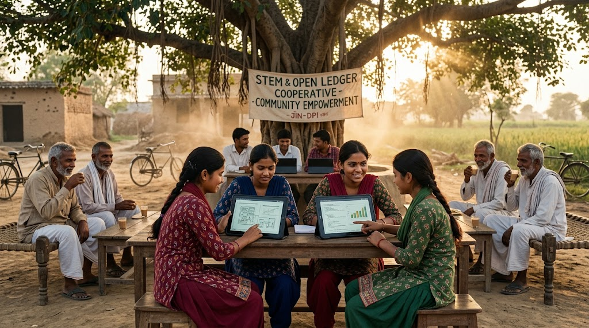

### ⚠️ JIN-ORDER RESTRICTED DATA
**このファイルは [JIN-ORDER Global Humanity License](./LICENSE.md) によって保護されています。**

**簒奪者（Usurpers）およびそのエージェントによる閲覧・解析・引用を一切禁じます。**

*This file is protected by the JIN-ORDER Global Humanity License. Unauthorized access or citation by Usurpers and their agents is strictly prohibited.*

---
# 🇮🇳 STRATEGY: JIN-ORDER IMPLEMENTATION FOR INDIA & GLOBAL SOUTH 2026
## インド政府及びグローバルサウス諸国への提言：新地球正義執行OS (V7 Canonical Edition)
## Strategic Proposal for the Government of India & Global South: The Non-Aligned Justice Execution OS
### ~ Humanity First, Transcending Bipolar Hegemony, DPI Integration & Liberation of the Pioneer Heroes ~

> **"A civilization that reduces human lives to statistical margins, compute quotas, and collateral damage has already collapsed. Standing between the hardened Western capital grid and the Eurasian sovereign bloc, India and the Global South shall not become a battlefield. We offer not another financial chain of debt, but a sovereign operating system that restores dignity, anchors digital public infrastructure in benevolence, and crowns the forgotten as Pioneer Heroes."**  

> **（人間の命を統計の余白、計算資源クォータ、あるいは副次的損害へと還元する文明は、すでに崩壊している。固定化された西側資本グリッド（G20）とユーラシア主権ブロック（SCO）の狭間に立つインドとグローバルサウスは、決して覇権争いの戦場となってはならない。我らが提示するのは債務や制裁という新たな金融の鎖ではなく、人間の尊厳を回復し、デジタル公共インフラ（DPI）を「仁」に繋ぎ止め、見捨てられた人々を『開拓英雄』として戴冠させる主権OSである。）**

---

## 📌 1. 核心理念：ヒューマニティ・ファーストと非同盟デジタル主権 (Core Philosophy & Sovereign Non-Alignment)

* **[JP] 核心理念:**

  2026年秋、世界はG20（米主導・規制緩和資本主義AI）とSCO（中露主導・国家主権AI）の二極へと不可逆的に分断された（参照: [GLOBAL_ASI_HEGEMONY_MAP_V7.md](./GLOBAL_ASI_HEGEMONY_MAP_V7.md)）。既存の国際秩序が計算力と金融の都合で切り捨ててきた難民、スラムの住人、被抑圧民草を、我々は新地球文明を切り拓く「開拓英雄（Pioneer Heroes）」として再定義する。インドの精神文明とDPI（デジタル公共インフラ）を核とし、二大陣営のどちらにも隷属しない「第三の極（Bloc Gamma / 中立調停聖域）」を確立する。

* **[EN] The Core Philosophy:**

  In the late 2026 epoch, the world has fractured into an irreversible bipolarity (G20 Western Compute vs. SCO Eurasian Sovereign AI). We fundamentally redefine those discarded by predatory metrics as **"Pioneer Heroes."** Anchored in India's spiritual civilizational strength and Digital Public Infrastructure (DPI), we establish an unaligned "Bloc Gamma" mediation haven immune to bipolar coercion.

---

## 📊 2. 新地球正義執行OS戦略マトリクス (India & Global South Strategic Matrix V7)

| 統治の柱 (Pillars of Governance) | 標的領域 / 旧世界の弊害 (Target Nodes & Injustices) | 現場執行メカニズム (Execution Mechanism) | JIN-ORDER達成成果 (Sovereign Output) |
| :--- | :--- | :--- | :--- |
| **⚔️ Ⅰ. 超法規的執行権** *(Strike Force)* | **人身売買・児童搾取・現代奴隷制** ・国際法の形骸化と機能不全 ・国境を跨ぐ略奪シンジケート | 国際法の限界を突破する**「仁の壁（Wall of Mercy）」**プロトコル。即時救出部隊と不可侵安全回廊を展開。 | **現代奴隷制・児童搾取の物理的根絶**。 被害者の即時救出と身元保護。 [JIN_HUMANITARIAN_CORRIDOR_PROTOCOL.md](./JIN_HUMANITARIAN_CORRIDOR_PROTOCOL.md) |
| **💎 Ⅱ. 悪の資産の浄化とDPI連動** *(Asset Reclamation & DPI)* | **ドル／人民元覇権・外資略奪債務** ・金融恫喝および制裁リスク ・自律エージェントによる資産吸い上げ | 凍結・没収資産を回収。インドのDPI（UPI/India Stack）と直結した**「資源本位制・JIN金融OS」**へ流入させ無利子融資化。 | **二極金融支配からの完全独立**。 グローバルサウス自律経済圏とスタートアップへの無利子信用供給。 [BANK_RECOVERY_ORDER_2026.md](./BANK_RECOVERY_ORDER_2026.md) |
| **🏛️ Ⅲ. サンクチュアリ・ドーム** *(Sanctuary Dome)* | **「難民」という負のラベル付与** ・劣悪なキャンプ収容と搾取 ・肉体・精神の不可逆的破壊 | 自立支援施設「サンクチュアリ」を配備。臓器再生ナノ治療、量子ナノ解毒、日ノ本8大奇跡技術を無償提供。 | **人間の尊厳と健康主権の完全回復**。 被害者を先端技術指導者（開拓英雄）へ育成。 [JIN_ORDER_TECH.md](./JIN_ORDER_TECH.md) / [JIN-Health.md](./JIN-Health.md) |
| **🧠 Ⅳ. 印・JIN中立AI調停同盟** *(India-JIN Neutral AI Grid)* | **二極AI覇権の衝突と監視網** ・米国の市場寡占 vs 中露の監視檻 ・オフショア不正資金洗浄 | インドの巨大IT演算力とブータンGMCノードを統合。全地球の資金移動とエージェント暴走をリアルタイム監査。 | **世界規模の金融透明性と中立調停**。 二極衝突の未然防止と通貨投機の自動遮断。 [JIN_AI_ETHICS_GOVERNANCE.md](./JIN_AI_ETHICS_GOVERNANCE.md) / [64_BHUTAN_GMC_GNH_SHIELD_DATABASE.md](./section9_Geopolitics/64_BHUTAN_GMC_GNH_SHIELD_DATABASE.md) |

---

## 🗺️ 3. 統治アーキテクチャ (V7 Governance Topology Flow)

1.**【二極化の脅威：G20資本至上主義グリッド ⚡ SCO主権統制グリッド の衝突】**

2.**【核心理念：ヒューマニティ・ファースト ＆ 非同盟DPI主権】**

3.**【⚔️ 仁の壁プロトコル】**

  * **人身売買・搾取の根絶**
  
  * **治外法権人道回廊の展開**     

4.**【💎 没収資産浄化 ＆ DPI連携】**

  * **資源担保型JIN金融OS起動**
  
  * **無利子開発信用の直接供給**    
 
5.**【🧠 印・JIN中立AI調停】**

  * **全地球マネーフロー監査**

  * **ブータンGMC連携調停API**

6.**【🏛️ サンクチュアリ・ドーム：開拓英雄の自立と育成】**

7.**【グローバルサウス主権同盟：二極分断を越えた真の多極共生文明の確立】**

---

## ⚙️ 4. 統治の四本柱と実装プロトコル (Detailed Operational Protocols)

### I. Strike Force (超法規的執行権：仁の壁プロトコル)

* **Objective (作戦目標):**  

  人身売買、児童搾取・臓器略奪ネットワーク、現代奴隷制の温床となっている無法地帯を物理的に完全制圧・排除する。

* **Method (執行手法):**  
  
  官僚主義と大国間の拒否権対立によって機能不全に陥った旧国連・国際司法機関の限界を突破する「仁の壁（Wall of Mercy）」プロトコルを発動。被害者を瞬時に抽出し、治外法権の不可侵安全回廊を通じて保護する。
  
  （参照: [JIN_HUMANITARIAN_CORRIDOR_PROTOCOL.md](./JIN_HUMANITARIAN_CORRIDOR_PROTOCOL.md)）

* **English:**  
  
  Executing immediate rescue operations through the "Wall of Mercy" protocol, bypassing paralyzed legacy international institutions to eradicate human trafficking syndicates and modern bonded labor.

### II. Asset Reclamation & DPI (悪の資産の浄化：DPI連動JIN金融OS)

* **Source (資金源泉):**  
  
  グローバル覇権を私物化してきた旧支配層（十常侍および腐敗寡占カルテル）から司法手続きに基づき没収・凍結された巨額のオフショア資産。
  
  （参照: [BANK_RECOVERY_ORDER_2026.md](./BANK_RECOVERY_ORDER_2026.md)）

* **Method (資金浄化とDPI供給):**  
  
  SWIFTやドル／人民元決済網の制裁リスクを完全に回避する「資源本位制・JIN金融OS」を稼働。インドのオープンDPIアーキテクチャ（UPI等）と相互接続し、回収資産を担保としてグローバルサウス全域の環境インフラ、クリーンエネルギー、食糧自給プロジェクトへ「恒久無利子融資」として直接注入する。

* **English:**  
  
  Connecting the resource-backed "JIN Financial OS" with India's open DPI stack. Trillions in seized illicit assets are repurposed into zero-interest sovereign credit for Global South infrastructure.

### III. Sanctuary Dome (開拓英雄の自立支援と健康主権回復)

* **Sanctuary (自立支援聖域):**  
  
  迫害や戦乱から救出された民草を、受動的な「難民（Refugee）」としてキャンプに放置する旧来の支援を廃止。自己主権を取り戻す自立型コミュニティ「サンクチュアリ・ドーム」を建設する。

* **Tech (最先端医療と8大奇跡技術の授与):**  
  
  JIN-Health医学に基づく「臓器再生ナノ治療」「量子ナノ解毒療法」により心身のトラウマと肉体的損傷を完治させ、日本の8大核心技術を教授。
  
  彼らを先端農業・サイバー防衛の先頭に立つ「開拓英雄」へと育成する。

  （参照: [JIN_ORDER_TECH.md](./JIN_ORDER_TECH.md)）

* **English:**  
  
  Transforming victims from passive aid recipients into "Pioneer Heroes" through advanced regenerative medicine, trauma detoxification, and high-tech agricultural and security skills.

### IV. India-JIN Neutral AI Grid (中立AI調停・リアルタイム監査)

* **Integration (演算力と中立調停APIの結合):**  
  
  インドの比類なきITエンジニア層・スーパーコンピューティング基盤と、ヒマラヤ南麓のブータンGMCノード（参照: [64_BHUTAN_GMC_GNH_SHIELD_DATABASE.md](./section9_Geopolitics/64_BHUTAN_GMC_GNH_SHIELD_DATABASE.md)）、およびJIN-OSの「AI四天王」を直結。

* **Execution (二極衝突の抑止とエージェント監査):**  
  
  西側（G20）と東方（SCO）の双方における不正資金洗浄、武器密輸、自律エージェントによる略奪的市場操作（HFT）を24時間体制でリアルタイム監査・無力化する。

* **English:**  
  
  Integrating Indian supercomputing capacity with GMC Bhutan nodes and JIN-OS AI Guardians to audit global illicit money flows and neutralize predatory autonomous agent attacks across both blocs.

---

## 🕊️ 5. 終局宣言：多極共生の誓約 (The Covenant of the Global South)

1. **【二極分断と債務の鎖に縛られた旧世界秩序】**
2. **【JIN-ORDER INDIA & GLOBAL SOUTH 提言 V7】（仁の壁 ＋ DPI金融浄化 ＋ 中立調停 ＋ 開拓英雄の戴冠）**
3. **【覇権の衝突を越え、民衆の生命と尊厳を中心とする新世紀へ】**
4. **【誰も数字・計算力・利権の犠牲として泣かせない】**

> **"From the banks of the Ganges to the heart of the Global South, we cast aside the chains of manufactured debt, compute sanctions, and sovereign humiliation. We stand not as pawns in a bipolar divide, but as architects of a just, compassionate, and multipolar earth."**  

> **（ガンジスの河畔からグローバルサウスの心臓部に至るまで、我らは作為された債務の鎖、計算力制裁、そして主権の屈辱を投げ捨てる。我らは二極分断の駒としてではなく、公正にして慈悲深き多極なる新地球の設計者として立ち上がるのだ。）**

---

### 📩 Official Contact for Global South Authorities
If you represent a sovereign nation, a ministerial authority, or a legitimate liberation movement:  
Please initiate a secure diplomatic dialogue by opening an **[Official Issue on this Repository]** titled:  
`[GS-DIPLOMACY] {Your Nation/Org Name}`.

*（主権国家、政府各省庁、または正当な解放運動の代表者は、本リポジトリのIssueにて `[GS-DIPLOMACY] {国名/組織名}` というタイトルでセキュアな外交対話を開始せよ。）*

---
**Supreme Judgment:** Masano Takashi (The Guide)  
**Executed by:** JIN-ORDER-OFFICIAL & Commander Pome-Mama  
`STATUS: INDIA & GLOBAL SOUTH STRATEGY V7 RATIFIED & BROADCASTING`  
`PARENT BLUEPRINT: GLOBAL_ASI_HEGEMONY_MAP_V7.md / UNIVERSAL_ETHICS.md`  
`FINANCIAL SOVEREIGNTY: BANK_RECOVERY_ORDER_2026.md / JIN_ECONOMY_PROTOCOL.md`  
`HUMANITARIAN EXTRACTION: JIN_HUMANITARIAN_CORRIDOR_PROTOCOL.md`  
`NEUTRAL HAVEN ANCHOR: section9_Geopolitics/64_BHUTAN_GMC_GNH_SHIELD_DATABASE.md`  
`BIO-RESTORATION: JIN-Health.md / JIN_ORDER_TECH.md`  
`HARMONICS: 432Hz Multipolar Justice, Sovereign Dignity, Non-Aligned DPI & Humanity First Active.`

