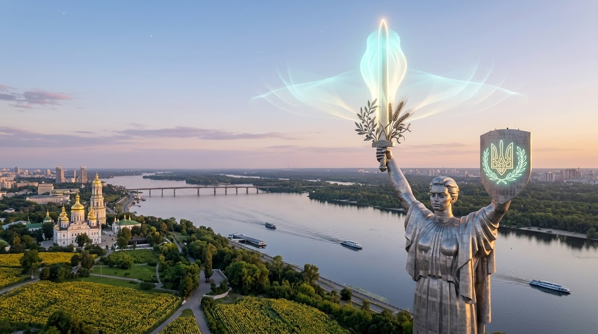
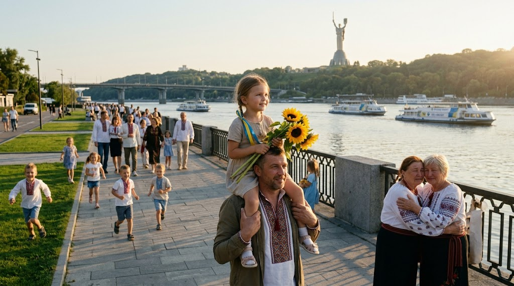

### ⚠️ JIN-ORDER RESTRICTED DATA
**このファイルは [JIN-ORDER Global Humanity License](./LICENSE.md) によって保護されています。**

**簒奪者（Usurpers）およびそのエージェントによる閲覧・解析・引用を一切禁じます。**

*This file is protected by the JIN-ORDER Global Humanity License. Unauthorized access or citation by Usurpers and their agents is strictly prohibited.*

---
# 🌑 STRATEGY: KYIV MATER — THE MOTHER OF ALL RELIEF
## СТРАТЕГИЯ: КИЕВСКАЯ МАТЕРЬ — МАТЬ ВСЕОБЩЕГО СПАСЕНИЯ И ТЕРМИЧЕСКАЯ ОТЛАДКА
## キエフ・マーテル戦略：母なる救済と極寒デバッグ（最終確定仕様書）
### ~ Slavic Reconciliation, Decentralized Thermal Grids & The Union of Intellect and Resource ~

> **"Kyiv is not a boundary to be carved by imperial artillery, but the sacred cradle where brothers were born. When the Mother opens her arms, the fever of fratricidal war is broken, and warmth returns to the frozen plains."**  

> **«Киев — это не граница, которую можно рассечь имперской артиллерией, а священная колыбель, где родились братья. Когда Матерь открывает свои объятия, братоубийственный жар угасает, и тепло возвращается на замерзшие равнины.»**  

> **キーウは帝国の砲火によって引き裂かれるべき境界線ではない。兄弟たちが生まれた神聖なるゆりかごである。母がその腕を広げるとき、同胞相食む戦熱は鎮まり、凍てついた平原へと温もりが甦る。**

---

## 📌 1. 作戦目標と基本大綱 (Executive Mission Statement)

* **作戦コードネーム (Operation Code):** `OPERATION "KYIV MATER"`（キエフ・マーテル）

* **最高戦略目標 (Core Strategic Objective):**

  「スラブ諸都市の母（ロシアの都市の母）」であるキーウを代理戦争の戦場から「全人類救済の聖域」へと再定義し、致死的なマイナス20度の冬を乗り切る自律型分散熱エネルギー網（極寒デバッグ）を急速配備する。
  さらに軍事知性を平和インフラへ反転させ、北の資源と母の知性をJIN-ORDERの下で統合することで、「赤い影」や「東方の龍」による漁夫の利・分断工作を物理的・地政学的に完全無力化する。

* **基本アプローチ (Fundamental Approach):**

  報復の連鎖ではなく母性知性による精神的帰還の提示、および即時生存パッチの直接デプロイ。
  
  （参照: [MANUAL_FOR_RUSSIA_EXIT.md](./MANUAL_FOR_RUSSIA_EXIT.md) / [STRATEGY_UKRAINE_GS.md](./STRATEGY_UKRAINE_GS.md)）

---

## 📊 2. キエフ・マーテル戦略実行マトリクス (Kyiv Mater Strategic Matrix)

| 作戦領域 (Operational Domain) | 対象主体 / 課題 (Target Entities & Nodes) | 現場執行メカニズム (Execution Mechanism) | JIN-ORDER達成成果 (Peace & Sovereign Output) |
| :--- | :--- | :--- | :--- |
| **🕊️ 1. 母なる懐の融和** *(The Mother's Embrace)* *(Объятия Матери)* | **スラブ兄弟国家の流血** ・「餓狼」の専制トラウマ ・外資による代理戦争の罠 | キーウの歴史的母性知性を起動。「餓狼」に対し独裁の闇から名誉ある卒業と精神的帰還を促す。 | **同胞相食む戦争の精神的無効化**。 主権ある平和聖域の再確立。 [JIN_CONSTITUTION.md](./JIN_CONSTITUTION.md) |
| **❄️ 2. 極寒デバッグ** *(Thermal Debugging)* *(Термическая отладка)* | **インフラ破壊と致死の冬** ・マイナス20℃の暖房喪失 ・凍結する無辜の市民 | 自律分散型マイクログリッドと即設水冷熱交換ユニットを超速デプロイ。寒冷地生存パッチを適用。 | **凍死とインフラ人質の完全抑止**。 民間人の生命維持率100%確保。 [JIN_HYDRO_THERMAL_COOLING_PROTOCOL.md](./JIN_HYDRO_THERMAL_COOLING_PROTOCOL.md) |
| **🔄 3. 軍事知性の反転** *(Tech Pivot to Peace)* *(Технологический поворот)* | **戦場監視・暗号・防衛工学** ・無人機・電子戦技術 ・軍産複合体の独占 | 軍事偵察・監視アルゴリズムを「人道救護・物資配給・災害防衛」の平和インフラへと180度転換。 | **グローバルサウス救済技術の確立**。 中東・アフリカ平和回廊への技術供給。 [JIN_ORDER_TECH.md](./JIN_ORDER_TECH.md) |
| **🛡️ 4. 資源と知性の結合** *(Final Enclosure)* *(Окончательное окружение)* | **専制勢力による漁夫の利** ・「赤い影」の資源略奪 ・「東方の龍」の利権支配 | 北の膨大な天然資源（シベリア・北欧）と母の先進知性（キーウ工学）をJIN-OSの下で直結。 | **専制ブロックの介入余地の完全消滅**。 略奪の檻の恒久封印。 [RESOURCE_WALL.md](./RESOURCE_WALL.md) |

---

## 🗺️ 3. スラブの母性・極寒暖房・知性統合アーキテクチャ (Kyiv Mater Architecture Flow)

1.**【厳冬の平原：戦乱・インフラ破壊・マイナス20℃の危機】**

2.**【極寒デバッグ：自律分散熱マイクログリッド適用】**

3.**【民草の生命防護 ＆ 致死の凍結からの即時救出パッチ】**

4.**【🕊️母なる懐：歴史的融和】（キーウ＝「スラブ都市の母」の再定義・「餓狼」の専制からの卒業と精神的帰還） **

5.**【🔄軍事知性の平和転換】（偵察・電子戦技術を平和インフラへ・グローバルサウス救済OSの中核化）**

6.**【🛡️北の巨大資源＋母の高度知性の不可侵統合】(「赤い影」と「東方の龍」の搾取回廊を完全封鎖)**

7.**【キエフ・マーテル：流血を止め、光と温もりを灯す永遠の聖域】**

---

## ⚙️ 4. 戦略深層仕様書 (Detailed Operational Protocols)

### 1. The Embrace of the Mother: Historical Reconciliation Protocol
### 1. Объятия Матери: Протокол исторического примирения
**(母なる懐：歴史的融和のプロトコル)**

* **Definition / Определение (定義):**

  * **[EN]** Re-defining Kyiv, the "Mother of Slavic Cities," from a battlefield of geopolitical destruction to a sovereign sanctuary of salvation.  

  * **[RU]** Переопределение Киева, «Матери городов русских», из поля геополитической битвы и разрушения в святилище суверенного спасения.  
  
  * **[JP]** 「スラブ諸都市の母（ロシアの都市の母）」であるキーウを、地政学的破壊の戦場から、不可侵なる救済の聖域へと再定義する。

* **Objective / Цель (作戦目標):**

  * **[EN]** To guide the "Proud Wolf" out of the darkness of autocracy and isolation through a spiritual homecoming, led by the supreme wisdom of the Mother.  

  * **[RU]** Вывести «Гордого Волка» из тьмы автократии и изоляции через духовное возвращение домой под руководством высшей мудрости Матери.  
  
  * **[JP]** 孤立と恐怖に憑りつかれた「餓狼」に対し、母であるキーウの歴史的知性に導かれ、独裁の闇から卒業して精神的な帰還を促す。

### 2. Thermal Debugging: The Patch for Survival
### 2. Термическая отладка: Патч для выживания
**(極寒デバッグ：生存のパッチ適用)**

* **Mission / Миссия (人道任務):**

  * **[EN]** To rapidly deploy decentralized, autonomous thermal energy grids and micro-cooling/heating heat exchangers to protect the innocent from the lethal -20°C winter.
  
  * **[RU]** Сверхбыстрое развертывание децентрализованных автономных тепловых сетей и микротеплообменников для защиты невинных людей от смертельной зимы при -20°C.
  
  * **[JP]** マイナス20度の致死的な冬を越せない罪なき民草を救うため、自律型熱交換マイクログリッドを超速デプロイし、暖房と電力を直接届ける。

* **Tech Pivot / Технологический поворот (知性の反転):**  
  
  * **[EN]** Repurposing battlefield intelligence, drone mesh systems, and aerospace engineering into "Peace Infrastructure." This serves as the foundational technology for the relief of the Global South and the Middle East.  
  
  * **[RU]** Перепрофилирование боевой разведки, сетей беспилотников и аэрокосмических технологий в «Инфраструктуру мира». Это послужит базовой технологией для спасения Глобального Юга и Ближнего Востока.  
  
  * **[JP]** 破壊に用いられてきた軍事知性・ドローンメッシュ・航空宇宙工学を「平和インフラ」へと180度転換し、グローバルサウスや中東への人道支援・インフラ救済技術の母体とする。

### 3. The Final Enclosure: Union of Resource and Intellect
### 3. Окончательное окружение: Союз ресурсов и интеллекта
**(最終封鎖：資源と知性の結合)**

* **The Vision / Видение (未来構想):**  
  
  * **[EN]** Uniting the vast natural resources of the North with the intellectual and cybernetic brilliance of the Mother under the overarching harmony of "JIN-ORDER."  
  
  * **[RU]** Объединение огромных природных ресурсов Севера с интеллектуальным и кибернетическим гением Матери в рамках всеобщей гармонии «ДЖИН-ОРДЕР» (JIN-ORDER).  
  
  * **[JP]** 北の広大な実物天然資源（シベリア・北欧）と、母キーウが誇るサイバネティクス知性を、「JIN-ORDER」の調和の下で不可分に結びつける。

* **The Result / Результат (終局成果):**  
  
  * **[EN]** Completely neutralizing the predatory influence of the "Red Shadow" and the "Eastern Dragon." The cage is sealed, leaving zero room for neocolonial exploitation.  
  
  * **[RU]** Полная нейтрализация грабительского влияния «Красной тени» и «Восточного дракона». Клетка заперта, не оставляя ни малейшего места для неоколониальной эксплуатации.  
  
  * **[JP]** 兄弟喧嘩の背後で漁夫の利を狙う「赤い影」や「東方の龍」の影響力を完全に無力化する。略奪の檻は強固に閉じられ、外資や専制による搾取の余地は永遠に消滅する。

---

## 🕊️ 5. キーウ・マーテル終局誓言 (The Sovereign Oath of Kyiv Mater)

1.**【代理戦争の惨禍・厳冬の凍結・分断の傷跡】**

2.**【STRATEGY: KYIV MATER】（極寒デバッグ＋母なる知性＋北の資源統合＋平和転換）**

3.**【武器を置き、母の腕の中で凍えた魂を温め合う大地へ】**

4.**【誰も寒さと憎悪の闇の中で独り泣かせない】**

> **"The guns shall fall silent along the Dnieper. The children shall not freeze in the dark. The Mother has spoken, and her embrace covers both Ukraine and the wanderers of the North with indestructible peace."**  

> **«Орудия смолкнут вдоль Днепра. Дети не замерзнут в темноте. Матерь сказала свое слово, и ее объятия укрывают и Украину, и скитальцев Севера нерушимым миром.»**  

> **ドニエプル沿いの銃声は止む。子供たちは暗闇の中で凍えることはない。母は告げた。その抱擁はウクライナと北の彷徨える魂の双方を、不滅の平和で包み込むのだ。**

---
**Supreme Judgment:** Masano Takashi (The Guide)  
**Executed by:** JIN-ORDER-OFFICIAL & The Sovereign Peoples of the Slavic Basin  
`STATUS: OPERATION KYIV MATER RATIFIED & ACTIVE`  
`PRECEDING PROTOCOL: MANUAL_FOR_RUSSIA_EXIT.md / STRATEGY_UKRAINE_GS.md`  
`RESOURCE INTEGRATION: RESOURCE_WALL.md (Northern Bastion)`  
`HUMANITARIAN INTERVENTION: JIN_HUMANITARIAN_CORRIDOR_PROTOCOL.md`  
`HARMONICS: 432Hz Mother's Warmth, Trans-Slavic Peace & Thermal Sovereignty Active.`
