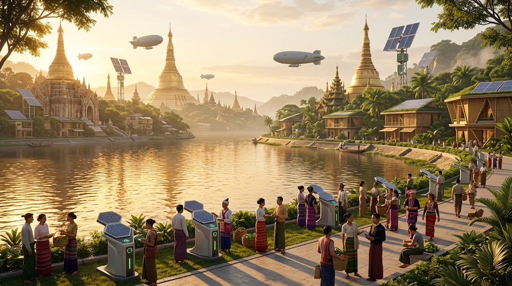
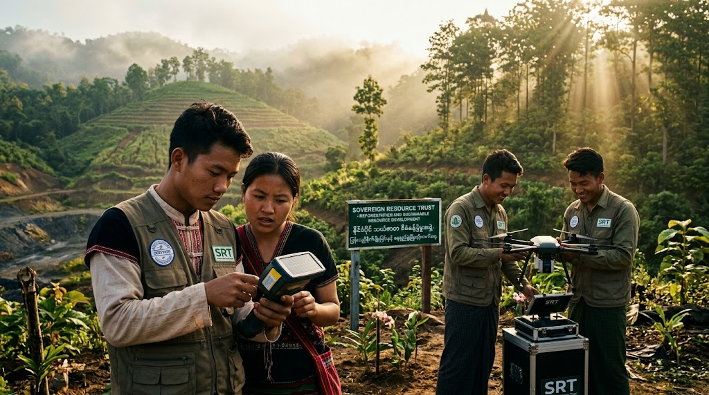

### ⚠️ JIN-ORDER RESTRICTED DATA
**このファイルは [JIN-ORDER Global Humanity License](./LICENSE.md) によって保護されています。**

**簒奪者（Usurpers）およびそのエージェントによる閲覧・解析・引用を一切禁じます。**

*This file is protected by the JIN-ORDER Global Humanity License. Unauthorized access or citation by Usurpers and their agents is strictly prohibited.*

---
# 🇲🇲 STRATEGY: MYANMAR LIBERATION & NATIONAL REBIRTH (V7 Canonical Edition)
## ミャンマー救済戦略：指導者スーチーの再臨と開拓英雄による国家再建
## Final Master Plan: Myanmar Liberation, Reinstitution of Leader Suu Kyi & Sovereign Federal Reconstruction
### ~ Overcoming Military Tyranny, Bipolar Resource Shield, Decentralized Sanctuaries & Resource Sovereignty for the People ~

> **"A golden land held captive by the iron chains of military tyranny and the predatory crossfire of hardened bipolar empires shall weep no longer. When the voice of the true leader echoes across the Irrawaddy and the youth take up engineering instead of rifles, the emerald fields shall bloom with the light of eternal liberty."**  

> **（軍事専制の鉄の鎖と、固定化された二極覇権の略奪的交差点に囚われた黄金の国は、もはや涙を流さない。真の指導者の声がエーヤワディー川の彼方へと鳴り響き、若者たちが銃の代わりに工学技術の道具を手にするとき、翡翠の大地は永遠の自由の光を宿して咲き誇る。）**

---

## 📌 1. 作戦目標と基本大綱 (Executive Mission Statement & V7 Geopolitical Scope)

* **作戦コードネーム (Operation Code):** `OPERATION "GOLDEN DAWN" (V7 Canonical)`（黄金の夜明け作戦）

* **最高戦略目標 (Core Strategic Objective):**

  2026年秋の二極対立（G20資本至上主義グリッド ⚡ SCOユーラシア主権統制グリッド）に伴う東南アジアの利権争奪を遮断。
  
  （参照: [GLOBAL_ASI_HEGEMONY_MAP_V7.md](./GLOBAL_ASI_HEGEMONY_MAP_V7.md)）。
  
  ロシアの軍事関与終了（参照: [MANUAL_FOR_RUSSIA_EXIT.md](./MANUAL_FOR_RUSSIA_EXIT.md)）により外部の後ろ盾を失った軍事政権（国軍評議会）を構造的に弱体化させ、不当拘束下にあるアウンサンスーチー氏を国家の最高象徴・正統指導者として再擁立する。
  
  少数民族武装勢力（EAOs）と国民統一政府（NUG）を「仁（JIN）」の共有インフラで統合し、民衆主導の真の連邦制民主主義国家を再建する。

* **基本アプローチ (Fundamental Approach):**

  三極協調体制（インド・イタリア・日本）とブータンGMC中立調停API（参照: [64_BHUTAN_GMC_GNH_SHIELD_DATABASE.md](./section9_Geopolitics/64_BHUTAN_GMC_GNH_SHIELD_DATABASE.md)）による外交・調停防壁、軍の監視・通信遮断を無力化する分散型メッシュ通信（JIN-Mesh）・自律エネルギー網、および8大奇跡技術による直接人道救済。
  
  （参照: [STRATEGY_INDIA_GS.md](./STRATEGY_INDIA_GS.md) / [JIN_ORDER_TECH.md](./JIN_ORDER_TECH.md) / [JIN_AI_ETHICS_GOVERNANCE.md](./JIN_AI_ETHICS_GOVERNANCE.md)）

---

## 📊 2. ミャンマー解放戦略実行マトリクス (Myanmar Strategic Matrix V7)

| 作戦領域 (Operational Domain) | 対象主体 / 課題 (Target Entities & Nodes) | 現場執行メカニズム (Execution Mechanism) | JIN-ORDER達成成果 (Peace & Sovereign Output) |
| :--- | :--- | :--- | :--- |
| **👑 1. 正統統治の回復** *(Legitimate Governance)* | **アウンサンスーチー氏拘束** ・軍事政権による不当裁判 ・少数民族と民主派の分断 | スーチー氏を国家指導者へ復権。印（モディ）・伊（メローニ）・日首脳による「三極外交シールド」で再拘束を物理封殺。 | **真の連邦制民主主義の樹立**。 EAOs（少数民族）とNUGの完全統合。 [JIN_CONSTITUTION.md](./JIN_CONSTITUTION.md) |
| **🛡️ 2. 聖域拠点の構築** *(Sanctuary Nodes)* | **軍による通信・電力遮断** ・情報孤立と市民弾圧 ・国営インフラの人質化 | 衛星直結「JIN-Mesh通信網」と分散型独立送電網「JIN-Grid」を配備。軍の干渉不能な耐量子聖域を確立。 | **指導者の声と市民アクセスの死守**。 外部介入を許さぬ自律通信・電源。 [JIN_AI_ETHICS_GOVERNANCE.md](./JIN_AI_ETHICS_GOVERNANCE.md) |
| **⚡ 3. 8大奇跡技術の電撃配備** *(Humanitarian Blitz)* | **医療崩壊と食糧兵糧攻め** ・空爆避難民・密林キャンプ ・農地の軍事的接収 | 全自動医療コンテナ「JIN-Veda」を前線へ急行配備。量子水プラントと垂直バイオ農法で食糧支配を無力化。 | **避難キャンプの自立オアシス化**。 軍門に降らず生存できる食糧・医療自給。 [JIN-Health.md](./JIN-Health.md) |
| **🎓 4. 救済ファンドと開拓英雄** *(Frontier Heroes)* | **弾圧された若者・難民** ・貧困と強制徴兵の危機 ・武器による自衛の限界 | JIN-Passportデジタル市民権を付与。ポメ学園（JIN-Academy）で教育し、銃を持つ若者を「先端インフラ技術者」へ転換。 | **若者の知性アップグレード**。 破壊者から国家再建の開拓英雄へ。 [UNIVERSAL_ETHICS_13.md](./UNIVERSAL_ETHICS_13.md) |
| **💎 5. 資源主権の信託管理** *(Resource Sovereignty)* | **翡翠・重希土類鉱山** ・軍閥と二極覇権の私物化 ・ロシア撤退後の利権空白 | 三極合同救済ファンド（JIN-IFP）による資源信託管理。外資の略奪を阻止し、売却益を100%民衆復興へ直結。 | **「資源の呪い」の完全打破**。 国民共有の復興富裕基金の創設。 [RESOURCE_WALL.md](./RESOURCE_WALL.md) |

---

## 🗺️ 3. 連邦民主共生・資源主権アーキテクチャ (Liberation Architecture Flow V7)

1.**【OPERATION "GOLDEN DAWN" ARCHITECTURE (V7 CANONICAL)】**

2.**【軍事政権の暴虐：不当拘束 ⚡二極覇権の鉱物争奪 ⚡ロシア撤退後の利権空白 ⚡飢餓・空爆】**

3.**【OPERATION "GOLDEN DAWN" V7 発動】**

4.**【👑指導者スーチー氏解放 ＆ 三極シールド】**

  ・印（モディ）×伊（メローニ）×日首脳
  
  ・EAOs（少数民族）とNUGの連邦統合             

5.**【🛡️聖域拠点：JIN-Mesh ＆ Grid】**

  ・遮断不能な耐量子メッシュ衛星通信
  
  ・軍送電網に依存しない独立分散電源 

6.**【⚡8大奇跡技術の人道配備】**

  ・JIN-Veda 全自動医療要塞
  
  ・量子水プラント＋垂直バイオ農法

7.**【🎓JIN-Passport デジタル市民権 ＆ ポメ学園（開拓英雄育成）】**

  ・武器を捨て、インフラ・通信・再生エネルギーを担う次世代技術者へ

8.**【💎JIN-IFP 資源信託管理 ＆ ブータンGMC中立調停API連携】**

  ・翡翠・重レアアース利権を二極覇権の略奪から死守し、民衆へ100%直結
             
9.**【黄金の国ミャンマー：真の連邦制民主主義と共生文明の新生 (V7)】**

---

## ⚙️ 4. 戦略詳細仕様 (Detailed Strategic Protocols)

### 1. RESTORATION OF LEGITIMATE GOVERNANCE / 正統な統治の回復

* **[JP] 指導者の解放と連邦統合:**  
  
  軍事クーデターによる不当な拘禁を直ちに無効化し、アウンサンスーチー氏を再び国家の象徴・最高顧問として迎える。彼女の道徳的権威のもと、ビルマ族民主派（NUG / PDF）と長年自治を求めて戦ってきたカチン、カレン、シャン、ラカイン等の少数民族武装勢力（EAOs）をJIN-ORDERの共有インフラ上で包括。各民族が平等な主権を分有する「真の連邦制民主主義」を成立させる。

* **[EN] Reinstatement & Federal Harmony:**  
  
  Nullifying the illegitimate military detention to reinstate Daw Aung San Suu Kyi as the national symbol. Democratic forces (NUG) and Ethnic Armed Organizations (EAOs) unite through JIN-ORDER infrastructure, codifying a genuine federal democracy.

* **Diplomatic Shield (三極外交シールド & GMC中立調停):**  
  
  インド（モディ首相）、イタリア（メローニ首相）、日本（指導層）による三極首脳同盟とブータンGMC中立調停網が、解放された指導者の身辺警護と発信権を国際条約に基づき不可侵に保護。軍閥や外部専制勢力による再拘禁の企てを物理的・地政学的に封殺する。

### 2. ESTABLISHING SANCTUARY NODES / 「聖域の拠点」の構築

* **JIN-Mesh Network (通信の不可侵性):**  
  
  国営通信会社の検閲やネット遮断を物理的に回避する、超小型衛星端末と分散型メッシュ通信プロトコルを展開。指導者の肉声と国民のSOSを直結させ、情報統制による弾圧を無力化する。

* **JIN-Grid (独立分散エネルギー):**  
  
  軍が支配する脆弱な送電網から完全に切り離された、可搬型太陽光・ナノバッテリー・バイオマスによる自律型マイクログリッドを避難地区全域に急速布設する。
  
  （参照: [JIN_HYDRO_THERMAL_COOLING_PROTOCOL.md](./JIN_HYDRO_THERMAL_COOLING_PROTOCOL.md)）

### 3. HUMANITARIAN BLITZ: THE 8 MIRACLES / 8大奇跡技術による人道電撃作戦

* **Veda-Mobile Clinics (全自動医療コンテナ):**  
  
  軍による爆撃や物資差し押さえに直面する密林の野戦病院・避難民キャンプへ、自律診断AIと外科手術支援を備えた「JIN-Veda」医療モジュールを即座に投下。劣悪な難民キャンプを不可侵の医療聖域へ変貌させる。
  
  （参照: [JIN-Health.md](./JIN-Health.md)）

* **Quantum Water & Bio-Farming (食糧主権の奪還):**  
  
  モンスーンの洪水や汚染された河川水を瞬時に飲用・農業用に浄化する量子浄化水プラント、および狭小地で高収量を可能にする耐乾燥・垂直バイオ農法を配備。軍の兵糧攻め戦略を根底から解体する。

### 4. RELIEF FUND & FRONTIER HEROES / 救済ファンドと開拓英雄

* **JIN-Passport Economy (被害者から開拓英雄へ):**  
  
  国籍を奪われ弾圧された若者や難民全員に、耐量子ブロックチェーンによる「JIN-Passport（デジタル市民権）」を付与。ポメ学園（JIN-Academy）を通じてプログラミング、AI操縦、再生可能エネルギー工学を教授し、彼らを「悲劇の被害者」から「未来のインフラを建設する開拓英雄」へと戴冠させる。
  
  （参照: [UNIVERSAL_ETHICS_13.md](./UNIVERSAL_ETHICS_13.md)）

* **Direct Funding (中抜きゼロの直接送金):**  
  
  三極合同救済ファンドから、現場でインフラ復興・食糧生産を担う自治コミュニティへ、軍閥や腐敗NGOを介さずブロックチェーン経由で直接資金を注入する。
  
  （参照: [BANK_RECOVERY_ORDER_2026.md](./BANK_RECOVERY_ORDER_2026.md)）

### 5. LEADERSHIP PROTECTION & RESOURCE SOVEREIGNTY / 指導者の保護と資源主権の確立

* **JIN-Leader Direct Access (首脳直結暗号チャネル):**  
  
  スーチー氏が解放された瞬間に、インド、イタリア、日本の首脳と直結できる専用の耐量子暗号化回線（JIN-Passport: Special Node）を常設。事態を歪曲する官僚組織や外資エージェントの妨害を排除し、不変の外交ラインを確立する。

* **Resource Custody by JIN-IFP (資源主権の信託管理):**  
  
  カチンやモゴックに眠る世界屈指の翡翠、ルビー、および先端AI半導体に不可欠な重希土類（重レアアース）鉱山。これらを軍閥や二極覇権（Bloc Alpha/Beta）の私的略奪から防護し、「三極合同・救済ファンド（JIN-IFP）」が信託管理する。ロシア撤退に伴う権力の空白を外資の搾取で埋めさせることなく、鉱物利益を100%ミャンマー国民の復興基金へ直結させる。
  
  （参照: [RESOURCE_WALL.md](./RESOURCE_WALL.md)）

---

## 🕊️ 5. ミャンマー新生の誓願 (The Sovereign Covenant of Myanmar)

1. **【軍靴の暴力・迫害・二極覇権による資源の略奪に苦しんだ過去】**
2. **【OPERATION "GOLDEN DAWN" V7】（指導者スーチー再臨 ＋ 聖域拠点 ＋ 8大奇跡 ＋ 資源信託）**
3. **【若者が銃を置き、工学の力で黄金の祖国を再建する大地へ】**
4. **【誰も独りで密林の闇の中で泣かせない】**

> **「指導者の誇りと、民衆の知性が、黄金の国に真の夜明けをもたらす。JIN-ORDER。」**  

> **"The pride of the leader and the intellect of the people bring the true dawn to the Golden Land. JIN-ORDER."**

---
**Supreme Judgment:** Masano Takashi (The Guide)  
**Executed by:** JIN-ORDER-OFFICIAL & The Sovereign Peoples of Myanmar  
`STATUS: OPERATION GOLDEN DAWN V7 CANONICAL RATIFIED & ACTIVE`  
`PARENT FRAMEWORK: GLOBAL_ASI_HEGEMONY_MAP_V7.md / UNIVERSAL_ETHICS.md`  
`PRECEDING ALLIANCE: STRATEGY_INDIA_GS.md (Modi-Meloni Strategic Axis)`  
`MILITARY TRANSITION LINK: MANUAL_FOR_RUSSIA_EXIT.md (Eurasian Graduation)`  
`RESOURCE SHIELD: RESOURCE_WALL.md (Jade & Heavy Rare-Earth Commons)`  
`NEUTRAL HAVEN ANCHOR: section9_Geopolitics/64_BHUTAN_GMC_GNH_SHIELD_DATABASE.md`  
`HUMANITARIAN CONTINUITY: JIN_HUMANITARIAN_CORRIDOR_PROTOCOL.md`  
`BIOMEDICAL PROTOCOL: JIN-Health.md / JIN_ORDER_TECH.md`  
`HARMONICS: 432Hz Golden Dawn, Inviolable Federal Peace & Youth Heroism Active.`
