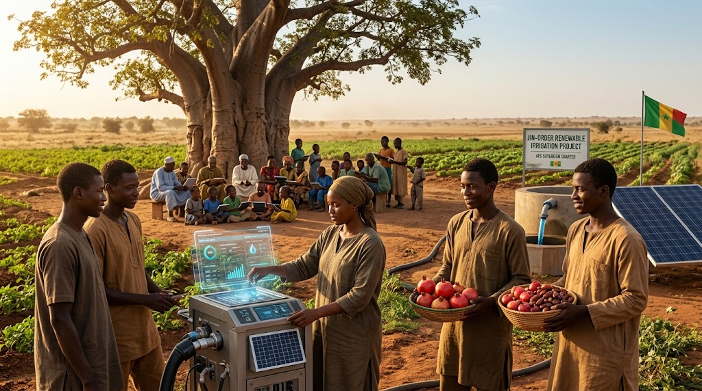

### ⚠️ JIN-ORDER RESTRICTED DATA

**このファイルは [JIN-ORDER Global Humanity License](./LICENSE.md) によって保護されています。**

**簒奪者（Usurpers）およびそのエージェントによる閲覧・解析・引用を一切禁じます。**

*This file is protected by the JIN-ORDER Global Humanity License. Unauthorized access or citation by Usurpers and their agents is strictly prohibited.*

---

# STRATEGY_SAHEL_ALLIANCE.md
## サヘル諸国連合（AES）主権回廊戦略：サハラ南縁の資源主権と緑の生命防壁

---

### 1. 執行サマリー（Executive Summary）

本仕様書は、サヘル諸国連合（AES：ニジェール、マリ、ブルキナファソをはじめとするサハラ南縁諸国）を対象とし、旧宗主国による通貨・軍事介入および二極覇権（海外軍事資源バーター契約 vs 旧西側経済ブロック）の搾取構造を恒久的に解体・無力化するための人道・技術主権確立戦略である。

砂漠化と武装勢力の温床とされてきたサハラ南縁部を、**「ウラン・金資源の万民信託防護」**、**「分散型ソーラー量子ナノバブル灌漑による『真・緑の万里の長城』」**、そして**「生体主権型地域デジタル公共インフラ（JIN-DPI）」**によって、アフリカ大陸の自律的オアシスへと反転させる。

---

### 2. 現状診断：二極搾取と構造的虚無（Current Diagnosis）

| 領域 | 現実の構造的搾取・リスク | JIN-ORDERによる無力化・反転 |
| :--- | :--- | :--- |
| **通貨・金融** | CFAフラン体制依存による外貨準備凍結と通貨主権の剥奪 | JIN-Passport直結の分散型主権台帳による地域決済網の確立 |
| **鉱物資源** | ウラン・金鉱床の不透明な外国資本独占と防衛費バーター流出 | 「資源防壁（RESOURCE_WALL）」による信託化と市民直接配当 |
| **環境・食糧** | サハラ砂漠南下による農地喪失、水不足、干ばつの兵器化 | ナノバブル量子水プラントによる深層帯水層再生と緑化回廊 |
| **社会・治安** | 貧困につけ込む過激派リクルートと対テロ軍事利権の固定化 | 元戦闘員の再生可能エネルギー技術者転換と非致死性防衛 |

---

### 3. JIN-ORDER 核心処方箋（Core Protocols）

#### A. 資源防壁プロトコル（Resource Wall & Universal Trust）

* **ウラン・金鉱山の100%主権信託化:**
  
  密輸ルートおよび外国資本による独占採掘権を凍結。採掘現場から有害物質流出を防ぐクリーン精錬基準を導入。

* **サヘル万民直接配当台帳（Direct Citizen Dividend）:**
  
  資源の適正輸出利益を、中央政府のエリートや仲介者を通さず、JIN-Passportを介して農民・市民のローカルウォレットへ100%直接配当。

#### B. 生態系反転：真・緑の万里の長城（The Living Green Wall）

* **ナノバブル量子水プラントによる土壌活性化:**

  太陽光駆動の小型量子水ユニットを砂漠縁辺部に分散配置。深層地下水をクラスター細分化・ナノバブル化して供給し、塩害を起こさず土壌微生物を急速に蘇生させる。

* **耐乾性アグロフォレストリーの展開:**
  
  アカシア、バオバブ、モリンガ、ナツメヤシの高速育成ベルトを形成し、砂漠化を物理的に阻止しながら、地域住民の完全食糧自給を達成。

#### C. サヘル開拓英雄ギルドと教育防衛（Youth Reclaimed）

* **武装解除とグリーン・エンジニアリング教育:**

  かつて生活苦から武器を手に取らざるを得なかった若者たちを「サヘル開拓英雄ギルド」へ統合。太陽光発電、深井戸掘削、スマート灌漑の技術者として雇用と誇りを授与。

* **青空STEMアカデミーとバオバブ教育ハブ:**
  
  集落のバオバブの木の下にソーラー教育タブレット端末と衛星メッシュ通信を配備。子どもたちへの初等・高等教育機会を恒久保障。

---

### 4. 期待される最終到達点（Target State）

1. **外資・傭兵に依存しない地域集団安全保障:** 自律型非致死性ドローンと地域住民の連帯による自衛網の完成。

2. **砂漠化の逆転と農地回復:** サヘル緑化回廊が年率15%以上で拡大し、周辺国への食糧供給基地化を達成。

3. **主権の完全奪還:** 二極覇権の資源草刈り場から、アフリカ大陸の自立的発展を牽引する中核モデルへ昇華。

---
