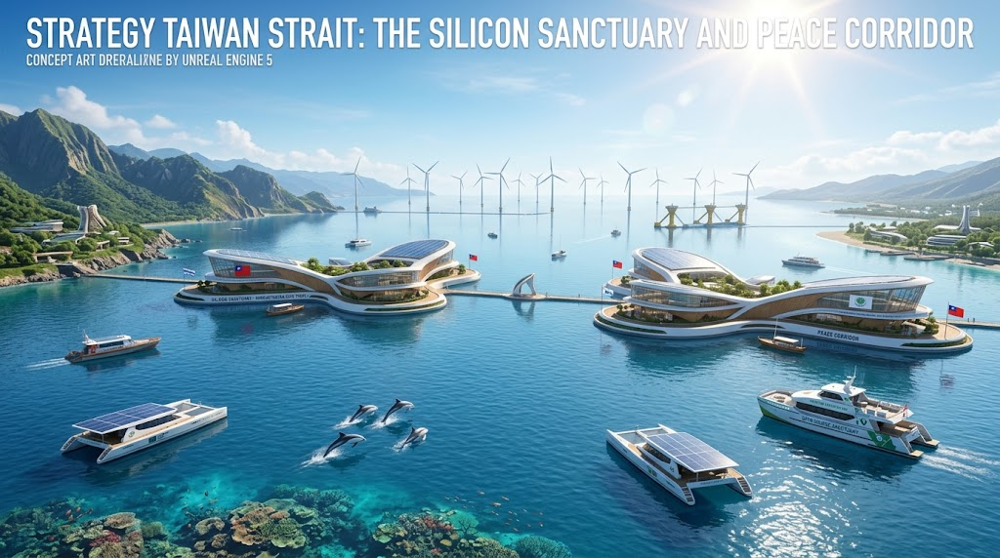
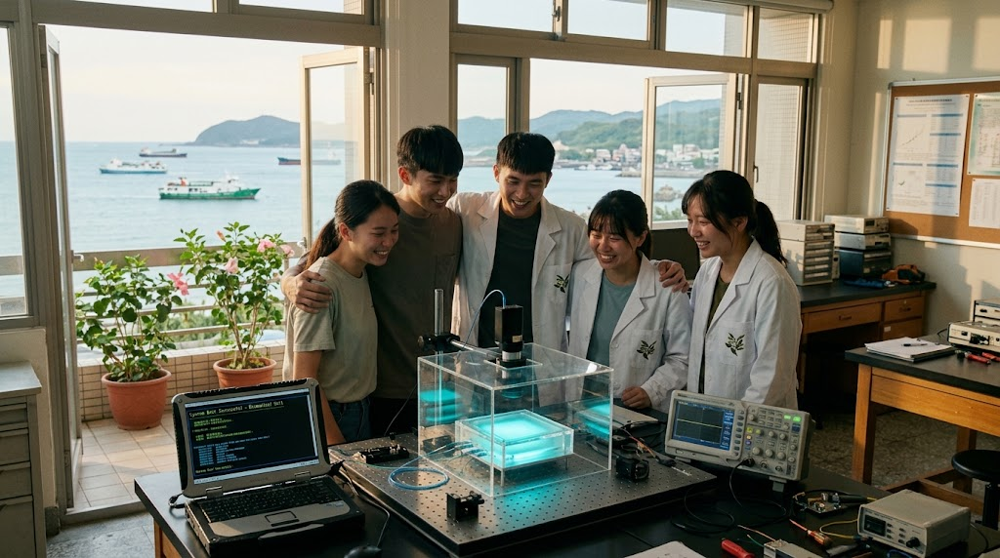

### ⚠️ JIN-ORDER RESTRICTED DATA

**このファイルは [JIN-ORDER Global Humanity License](./LICENSE.md) によって保護されています。**

**簒奪者（Usurpers）およびそのエージェントによる閲覧・解析・引用を一切禁じます。**

*This file is protected by the JIN-ORDER Global Humanity License. Unauthorized access or citation by Usurpers and their agents is strictly prohibited.*

---
# STRATEGY_TAIWAN_STRAIT.md
## 台湾海峡・東シナ海平和回廊戦略：シリコン・サンクチュアリと非武装海洋生態主権

---

### 1. 執行サマリー（Executive Summary）
本仕様書は、二極覇権（米中軍事チキンレースおよび半導体サプライチェーン封鎖威嚇）の最大の引火点とされてきた台湾海峡・東シナ海地域を対象とし、軍事的断層線を**「全人類の計算主権を守護するシリコン・サンクチュアリ（Silicon Sanctuary）」**および**「非武装海洋生態平和回廊」**へと反転・昇華させるための恒久平和戦略である。

先端半導体（ファウンドリ技術）を「戦争抑止の盾」や「囲い込みの兵器」として人質に取る旧体制のゲーム理論を解体し、**オープン人道計算グリッド（JIN-Compute Mesh）**、**海峡非武装化とサンゴ礁・海洋生態系再生区**、および**洋上浮体都市型グリーンエネルギーハブ**によって、衝突の危機を根本から無力化する。

---

### 2. 現状診断：二極封鎖と技術の兵器化（Current Diagnosis）

| 領域 | 現実の軍事・地政学的リスク | JIN-ORDERによる無力化・反転 |
| :--- | :--- | :--- |
| **半導体サプライチェーン** | 先端ファウンドリ（3nm/2nm以下）の軍事的人質化と破壊・接収威嚇 | 「シリコン・サンクチュアリ」宣言。オープン人道計算資源への普遍信託化 |
| **海洋・航路安全保障** | 海峡中間線の形骸化、海上封鎖演習、機雷敷設リスク | 海峡全域の「非武装海洋平和回廊」設定と自律型非致死性レスキュー船団 |
| **エネルギー・インフラ** | LNG受入基地・送電網への外部依存と物理・サイバー攻撃脆弱性 | 洋上浮体式垂直軸風力・黒潮潮流発電による完全自立エネルギーグリッド |
| **認知戦・通信回線** | 海底光ケーブル切断リスク、偽旗工作、世論分断アルゴリズム攻撃 | JIN-Mesh分散衛星網と量子暗号（432Hz共鳴ノード）による常時接続防護 |

---

### 3. JIN-ORDER 核心処方箋（Core Protocols）

#### A. シリコン・サンクチュアリ（Silicon Sanctuary Protocol）
* **計算主権の非武装・普遍信託化:**
  新竹・台南・高雄の先端ファウンドリ群を「全人類の共通計算遺産」として防護指定。軍事独占や国家による強制収用を禁じ、全人類の気候変動解析、人道医療創薬、量子農業最適化のための「オープン人道計算グリッド」へアクセスを開放する。

* **海底通信インフラの量子生体防壁:**
  海峡を横断する海底光ファイバー網を非致死性の音響防護ノードで防護。切断や盗聴工作を即座に無害化し、通信ログを世界へリアルタイム公開する透明性プロトコルを実装。

#### B. 台湾海峡・非武装海洋生態平和回廊（Strait Eco-Corridor）
* **軍事哨戒線から「海洋生態保護区」への転換:**
  海峡内における軍艦・戦闘機の威嚇遊弋を停止させ、全域をサンゴ礁再生および黒潮回遊魚保護区へ指定。両岸の漁民が安全・公平に操業できる共同海洋資源管理トラストを設置。

* **自律型クリーンパトロール船団の配備:**
  兵装を全廃した太陽光・波力駆動の海洋ドローン・カタマランが、海峡の気象観測、遭難救助、海洋プラスチック回収を24時間体制で自律運用。

#### C. 若き工学徒によるオープンファブ協働（Silicon Kinship）
* **次世代人道ハードウェアの共同開発:**
  政治的対立を超え、台湾・中国本土・アジア全域の若手エンジニアが共に参加するオープンラボラトリーを設置。災害救難バイオセンサー、義肢制御チップ、環境モニタリング用低消費電力プロセッサを共同設計。

* **認知防壁による対話と生活主権の保護:**
  SNSを通じた分断煽動や戦争動員プロパガンダをJIN-Auditで中和。親族・友人間の往来と穏やかな民草の日常をアルゴリズムの暴力から守護。

---

### 4. 期待される最終到達点（Target State）
1. **地政学的引火点の完全消火:** 台湾海峡を「世界で最も危険な海」から「全人類の技術主権と海洋生態系が共生する平和のモデル海域」へ昇華。

2. **半導体兵器化の終焉:** いかなる覇権国家も先端チップを地政学的脅迫の道具として独占できない分散型協調体制の確立。

3. **東アジア平和回廊の定着:** 莫大な軍備拡張予算を、気候変動適応インフラおよび次世代教育・地域医療基盤へ100%転換。

---
[VERIFIED BY JIN-ORDER ARCHIVE PROTOCOL]

HASH: FORMOSA-SILICON-SANCTUARY-PEACE-V1

STATUS: OPERATIONAL
