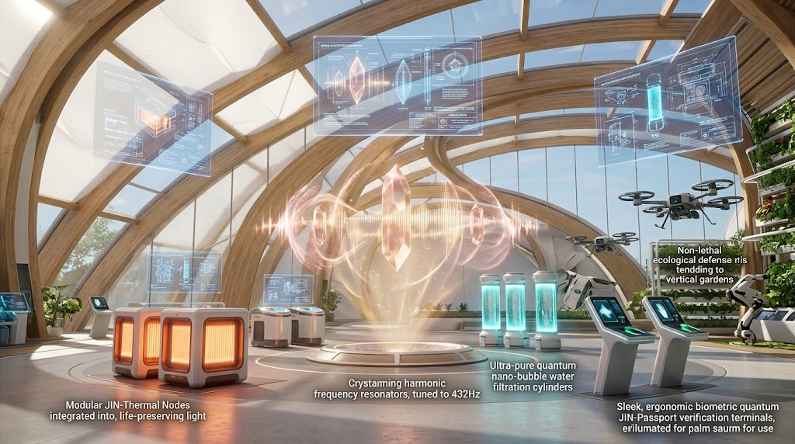
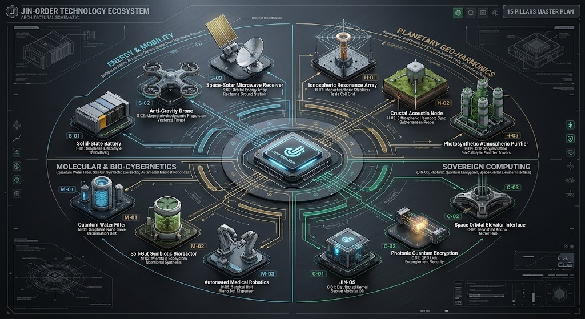
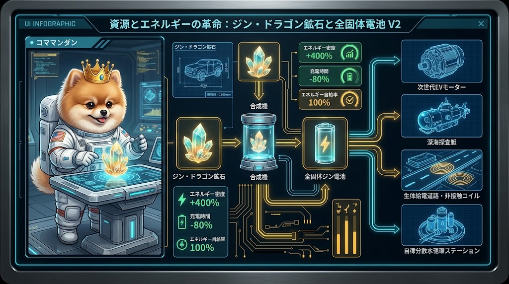
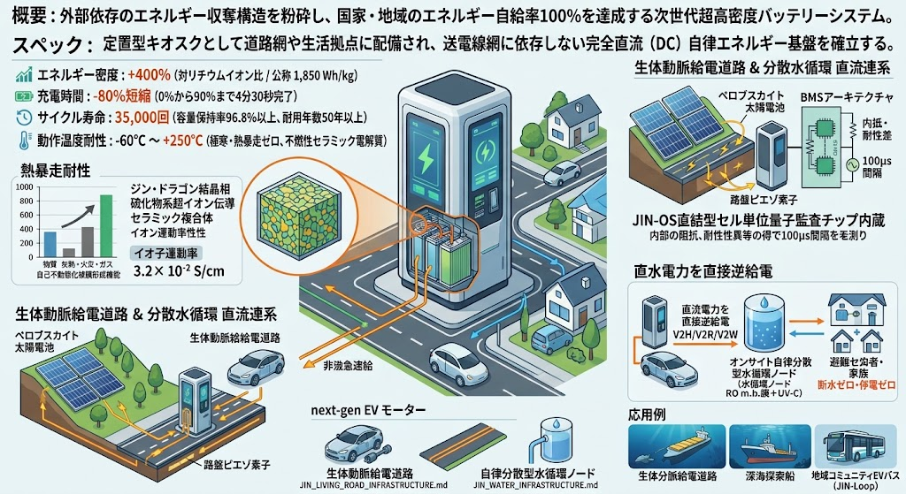
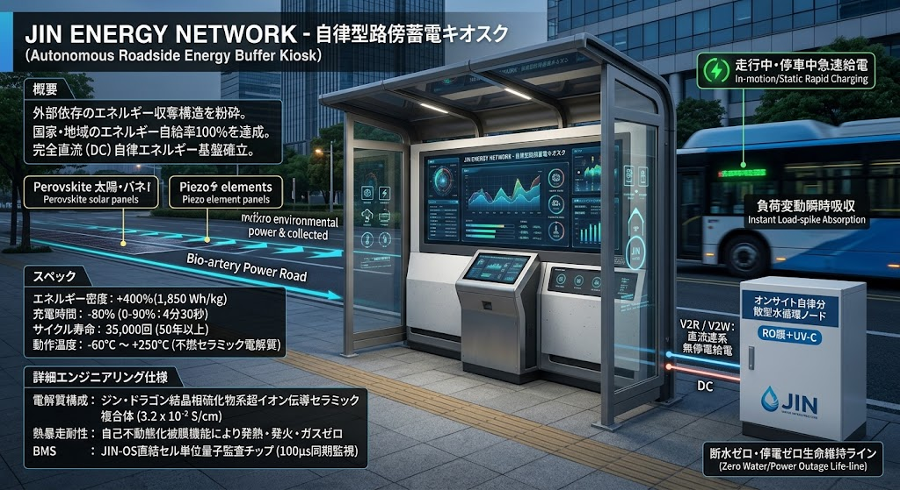
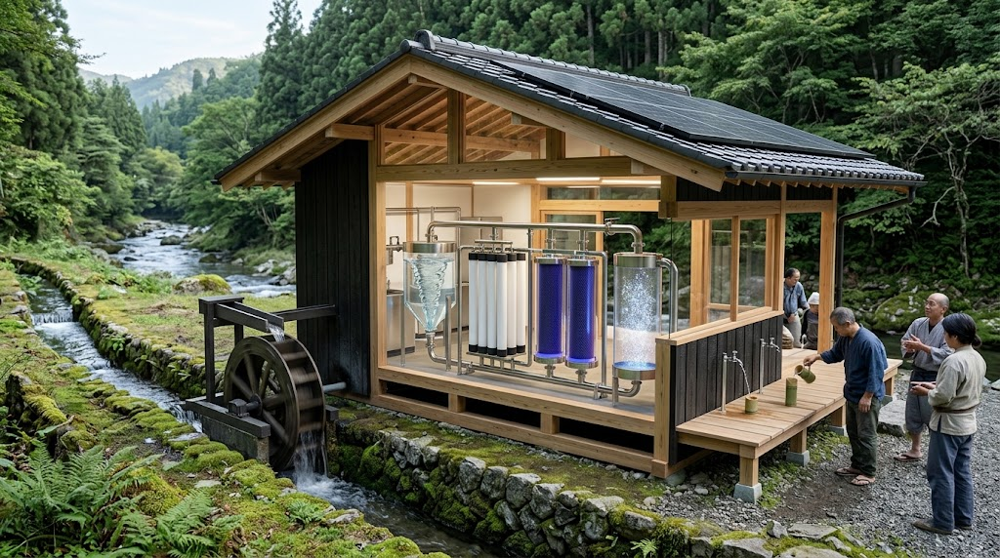
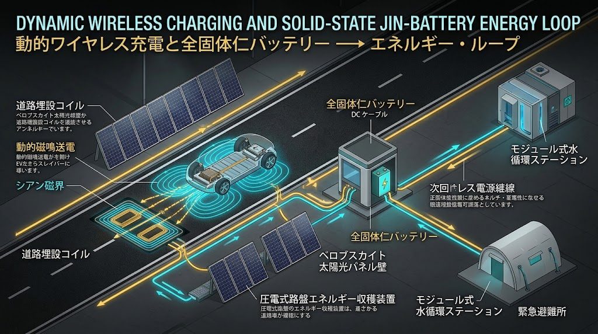
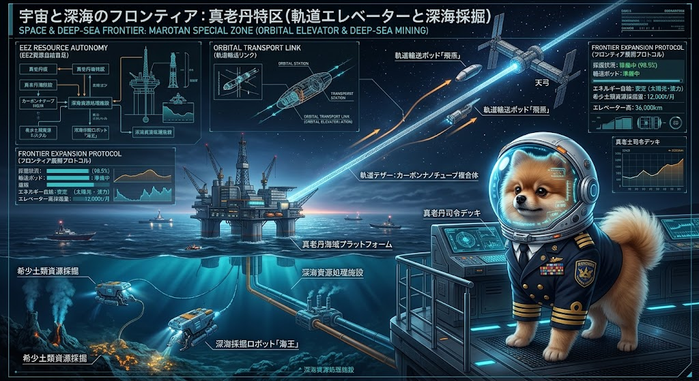
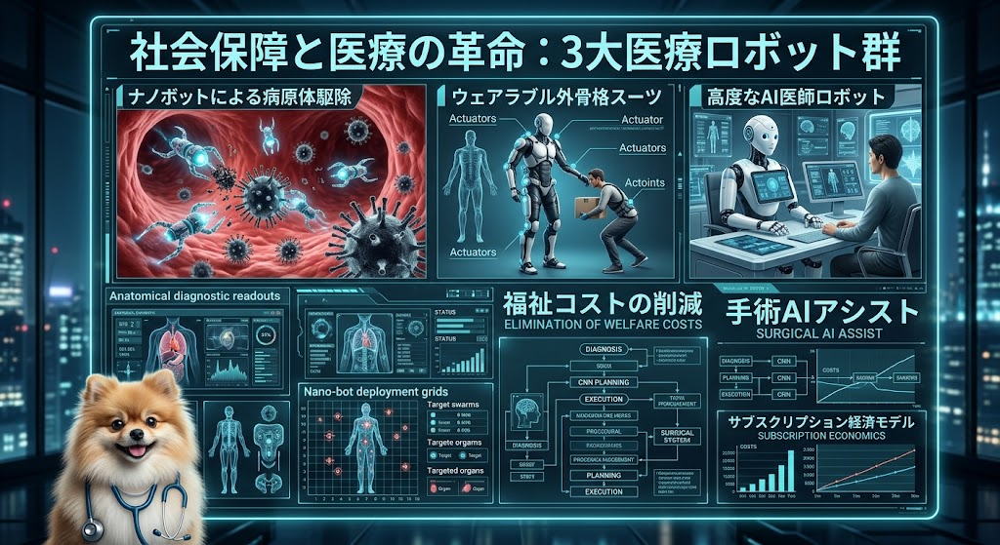
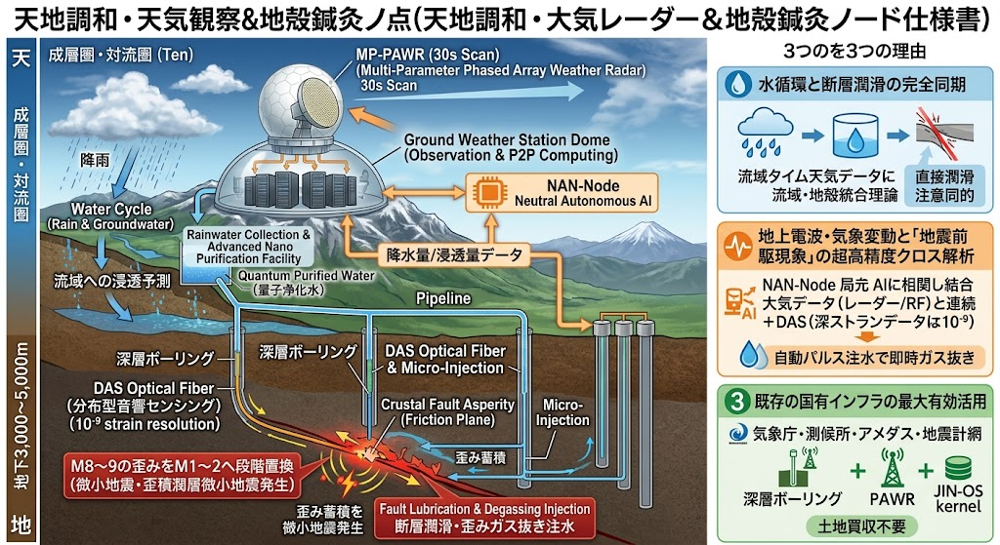

### ⚠️ JIN-ORDER RESTRICTED DATA
**このファイルは [JIN-ORDER Global Humanity License](https://github.com/JIN-ORDER-OFFICIAL/GOVERNANCE_OF_ABYSS/blob/main/LICENSE.md) によって保護されています。**

**簒奪者（Usurpers）およびそのエージェントによる閲覧・解析・引用を一切禁じます。**

*This file is protected by the JIN-ORDER Global Humanity License. Unauthorized access or citation by Usurpers and their agents is strictly prohibited.*

---

# 🌸 JIN-ORDER Technology Catalog: The Abyssal Archive

外部の中央集権や他国利権を排し、地球の生態系と人間の尊厳を根底から守り抜くための自律分散型テクノロジー・アーキテクチャ。

本カタログでは、『JIN-ORDER』および『GOVERNANCE_OF_ABYSS』が提唱する次世代インフラストラクチャの全貌を公開する。

---

## 🧭 JIN-ORDER 16大先端技術体系 統合アーキテクチャ設計図 (Master Ecosystem Matrix)

16大先端技術は、単独で存在するのではなく、中央の「JIN-ORDER 自律調和核」を中心に4つの同心円防壁・機能層として相互接続され、常時リアルタイムでエネルギー・計算資源・物質循環を同期させている。

* **⚡ ENERGY & MOBILITY（エネルギー・推進推力層）:** ジン・ドラゴン鉱石・全固体ジン電池、ペロブスカイト＆環境発電（ピエゾ・熱電）、生体動脈給電道路、反重力ドローン、次世代水素・超伝導動脈網（Lifeblood Express）、宇宙太陽光マイクロ波受電
* **🌍 PLANETARY GEO-HARMONICS（地球工学・環境減災・大気土壌再生層）:** 電離層減災共鳴機、気象台併設型マルチパラメータ・フェーズドアレイレーダー網、地殻鍼灸音響ノード（JIN-ACH）、光合成大気浄化タワー、南鳥島レアアース可視光光半導体シート・太陽光人工光合成 ＆ 砂漠土壌生命化システム[cite: 1]
* **🧬 MOLECULAR & BIO-CYBERNETICS（分子再生・生体共生層）:** 量子浄化フィルター、オンサイト自律分散水循環・深層天然水ループ、土壌・腸内共生バイオリアクター、全自動医療ロボティクス、地域バイオマス原油・e-Fuel
* **💻 SOVEREIGN COMPUTING（主権計算・通信防壁層）:** JIN-OS、非同盟・中立AIノード（NAN-Node）、光量子エンタングル暗号網、軌道エレベーター・テザー制御インターフェース

---

## 🗺️ 地域戦略 × 16大先端技術 クロスリファレンス・マトリクス

Regional Strategy & 16 Core Technologies Cross-Reference Matrix

地球規模の各地域における構造的バグや搾取システムを、どの自律分散型先端テクノロジーによって破砕し、再生させるのかを規定する戦略対応表。

| 方面 / 地域 (Region) | 中核作戦目標 (Core Strategy) | 適用される主要先端技術 (Deployed Technologies) | 期待される変革と実装効果 |
| :--- | :--- | :--- | :--- |
| **中東全域** | ザカート螺旋計画 ＆ WPOルネサンス | **[01]** ジン・ドラゴン鉱石・全固体電池 **[02]** 液体水素・超伝導動脈網 **[07]** 量子暗号ネット **[16]** 太陽光人工光合成シート[cite: 1] | 石油利権への依存を完全脱却。強烈な太陽光を淡水とグリーンアンモニア肥料へ転換し、食糧・緑化主権を確立[cite: 1]。 |
| **東アフリカ** | ナイル・ルネサンス・プロトコル | **[03]** 量子浄化フィルター **[02]** Lifeblood Express（自律軌道網） **[01]** 全固体電池グリッド | 水資源の争奪戦を終結させ、超高速な水浄化と地域分散型の電力網・水素交通によって持続的な農業・生活基盤を確立。 |
| **アフガニスタン** | 砂漠緑化水利連合（中村哲医師の遺志） | **[03]** 量子浄化フィルター **[06]** 自律型熱交換・水利網 **[16]** 砂漠土壌生命化プロトコル[cite: 1] | 荒廃した砂漠を原子レベル・水利レベルで緑化。未熟土を呼吸する黒土へ急速転換し、平和的農業OSを確立[cite: 1]。 |
| **中国・東アジア** | 大同世界 ＆ 真の社稷（土と民の調和） | **[07]** 分散型AIグリッド（ジン・ネット） **[04]** 次世代半導体製造（国内ファブ） | 14億の民草を縛る監視ドーム網を平和的にデバッグし、中央集権的統制から分散型の徳治共栄へシフト。 |
| **北朝鮮** | 平壌の春 ＆ JIN-KOREAプロトコル | **[08]** 軌道エレベーター・宇宙フロンティア **[01]** ジン・ドラゴン鉱石 | 軍事ミサイル（ICBM）インフラを平和的な宇宙開発・輸送拠点（天弓）へと転換し、福祉物流庁を通じて南北共栄。 |
| **ウクライナ** | 平和の翼作戦 ＆ サヘル（AES）連帯 | **[02]** 反重力ドローン（浮遊石）＆ 水素動脈 **[06]** 自律型熱交換・自然冷却プロトコル | 軍事用ドローン技術を100トン積載の物流・農業支援へ転換。極寒環境のインフラを零ロス熱交換で完全防護。 |
| **ベネズエラ** | 作戦シルバーライニング ＆ ノルウェーモデル | **[09]** 分子アセンブラ・マトリクス **[01]** 全固体電池 | 破綻した石油経済の予算化システムを解体し、物質循環と原子レベルの再構成によって自律的な生活インフラを再構築。 |
| **中米・カリブ** | 碧きルネサンス・プロトコル | **[03]** 量子浄化フィルター **[02]** 浮遊石（反重力ドローン） | 海洋・河川の環境汚染を根絶し、カリブ海域を結ぶクリーンなバイオ・物資回廊を現場主導で創出。 |
| **コンゴ民主共和国** | シスターフッド同盟 ＆ コバルト資源主権 | **[08]** 深海・地下資源自律採掘ロボット **[09]** 分子アセンブラ・マトリクス | 児童労働と不当な搾取構造を根絶し、女性ギルドと自動化ロボットによる安全かつ自律的な資源主権を確立。 |
| **ミャンマー** | 黄金の夜明け作戦 ＆ スーチー指導者再臨 | **[05]** 3大医療ロボット群 **[07]** ジン・ネット（量子暗号） | 紛争下で疲弊した地域社会へナノボット・AI医師による即時医療救済をもたらし、三極外交シールドで主権を守る。 |
| **ロシア出口戦略** | ユーラシア平和・エネルギー守護者 | **[01]** ジン・ドラゴン鉱石 **[02]** 液体水素・超伝導回廊 **[06]** 自律型熱交換・自然冷却プロトコル | JIN-PMC人道部隊と液体水素・超伝導グリッドの連動により、ユーラシア全域を真の平和とエネルギーの守護者へ転換。 |
| **インド** | デジタル公共インフラ（DPI） ＆ カースト打破 | **[10]** ノウアスフィア・オープン・ラーニング **[11]** JIN-OS（新パラダイム統合司令部） | 精神文明と先進ITを融合し、教育の分散同期と個人の主権的アイデンティティ（PIONEER）によって差別の壁を無効化。 |
| **サヘル諸国連合 (AES)** | サハラ南縁主権回廊 ＆ 緑の生命防壁 | **[03]** 量子浄化フィルター **[01]** 全固体電池グリッド **[16]** 太陽光人工光合成・砂漠緑化[cite: 1] | CFAフラン支配を脱却。サハラ砂漠南縁に光触媒シートを展開し、無電力で淡水・肥料を自給して「真・緑の長城」を築く[cite: 1]。 |
| **台湾海峡・東シナ海** | シリコン・サンクチュアリ ＆ 海洋生態回廊 | **[04]** 次世代半導体製造（国内ファブ） **[06]** 自律型熱交換・自然冷却プロトコル **[07]** ジン・ネット（量子暗号） | 先端ファウンドリを全人類の共通計算遺産へ信託化。海峡全域を非武装化し、洋上自律発電と海洋生態保護区へ昇華。 |
| **全地球的基盤** | 三大勢力対抗諜報 ＆ 主権空白地帯の消去 | **[11]** JIN-OS 統合司令スマホ端末 **[14]** 天地調和・地殻鍼灸ノード **[16]** 地球水循環・気候冷却グリッド[cite: 1] | すべての開拓英雄が個人の手元で財務・物質を管理。人工光合成と砂漠土壌化で地球の自律神経（水循環）を完全復元する[cite: 1]。 |

---
## ⚡ 1. エネルギー・環境・物質循環基盤
Energy, Environment & Atomic-Level Regeneration

### 01. ジン・ドラゴン鉱石と全固体電池（Solid-State Jin-Battery）

- **概要**: 外部依存のエネルギー収奪構造を粉砕し、国家・地域のエネルギー自給率100%を達成する次世代超高密度バッテリーシステム。定置型キオスクとして道路網や生活拠点に配備され、送電線網に依存しない完全直流（DC）自律エネルギー基盤を確立する。

- **スペック**: 
  - エネルギー密度: **+400%**（対リチウムイオン比 / 公称 1,850 Wh/kg）
  - 充電時間: **-80%**短縮（0%から90%まで4分30秒完了）
  - サイクル寿命: **35,000回**（容量保持率96.8%以上、耐用年数50年以上）
  - 動作温度耐性: **-60°C 〜 +250°C**（極寒・熱暴走ゼロ、不燃性セラミック電解質）

- **詳細エンジニアリング仕様**:
  - 電解質構成: ジン・ドラゴン結晶相硫化物系超イオン伝導セラミック複合体（室温イオン伝導率: 3.2 × 10⁻² S/cm）。
  - 熱暴走耐性: 物理的穿孔・圧壊テスト時における自己不動態化被膜形成機能により、発熱・発火・ガス噴出が原理的にゼロ。
  - BMSアーキテクチャ: JIN-OS直結型セル単位量子監査チップ内蔵（各セルの内部抵抗・電位差を100μs間隔で同期監視）。

- **生体動脈給電道路 ＆ 分散水循環 直流連系仕様**:

  - **路傍蓄電キオスク（Roadside Energy Buffer）**: 道路法面のペロブスカイト太陽電池や路盤ピエゾ素子から得られた微細な環境電力を集約・平滑化。EVの走行中・停車中非接触急速給電時に生じる急峻な電力スパイク（負荷変動）を瞬時に吸収・放電し、商用系統への負荷をゼロ化する。
  - **生活拠点・水循環無停電バックアップ（V2H / V2R / V2W）**: 大地震等の災害時、路傍やEVに搭載されたジン電池から、[JIN_WATER_INFRASTRUCTURE.md](./JIN_WATER_INFRASTRUCTURE.md) の「オンサイト自律分散型水循環ノード（RO膜＋UV-C）」および避難所・家庭へ直流電力を直接逆給電。商用電源が長期途絶しても、断水ゼロ・停電ゼロの生命維持ラインを死守する。

- **応用**: 次世代EVモーター、生体動脈給電道路（[JIN_LIVING_ROAD_INFRASTRUCTURE.md](./JIN_LIVING_ROAD_INFRASTRUCTURE.md)）、自律分散型水循環ノード（[JIN_WATER_INFRASTRUCTURE.md](./JIN_WATER_INFRASTRUCTURE.md)）、深海探査艇、地域コミュニティEVバス（JIN-Loop）。

---

### 03. 量子浄化フィルター

- **概要**: 毒素やCO2などの環境汚染物質を原子レベルで瞬時に純酸素や清浄な水へと変換する画期的な環境再生モジュール。集落の水車小屋や既存水路へアドオン配備可能。

- **スペック**:
  - PM2.5 除去率: **99.99%**
  - 水浄化速度: **1L/sec**（重金属・有機溶剤・マイクロプラスチック・PFAS完全ゼロ化）
  - モジュール駆動電力: **12V / 15W**（小水力水車・ソーラーセル直接駆動対応）

- **詳細エンジニアリング仕様**:
  - コア触媒: 高密度多孔質酸化チタン・グラフェン量子ドット積層メンブレン（有効比表面積: 2,400 m²/g）。
  - キャビテーション生成機構: 超音波ナノバブル共振子（平均気泡径: 30〜50nm / 気泡密度: 5億個/mL）。OHラジカルの局所超臨界分解による毒素分解。
  - メンテナンス間隔: 連続稼働18,000時間（自己逆洗浄サイクルおよび紫外線パルス再生機能内蔵）。

- **運用**: 地域分散型オフグリッド給水網（[JIN_WATER_INFRASTRUCTURE.md](./JIN_WATER_INFRASTRUCTURE.md)）およびグローバルな環境修復・輸出指標の達成。

---

### 09. 分子アセンブラ・マトリクス

- **概要**: カーボンダストやプラスチック廃棄物、混濁した水を分解・再構成し、純構造材料や高度有機ポリマーを生み出す物質循環装置。

- **スペック**:
  - 原子配置精度: **0.01nm**（原子間力マニピュレータアレイ制御）
  - エネルギー効率: **98.7%**（結合エネルギー熱回収機構搭載）
  - マテリアル出力レート: **2.5 kg/h**（標準炭素系高分子ブロック生成時）

- **詳細エンジニアリング仕様**:
  - 投入原料許容度: 海洋マイクロプラスチック、農薬残渣、工場排気カーボンダスト、汚泥灰分を無選別投入可能。
  - 再構成プロセス: 低温プラズマ分子解離チャンバー ＋ 走査トンネル顕微鏡型ナノ組立ノズルアレイ（4,096並列チャンネル）。
  - 安全インターロック: JIN-ORDER普遍倫理暗号鍵が一致しない軍事兵器・有毒化合物の分子配列設計図は物理的に遮断・分解。

---

## 🛸 2. モビリティ・インフラ・フロンティア
Mobility, Infrastructure & Frontiers

### 02. 次世代水素・超伝導動脈網 ＆ 反重力モビリティ（Lifeblood Express）
### ＆ ペロブスカイト太陽電池・環境発電 生体動脈グリッド

- **概要**: マイスナー効果・量子ピン止め推進による反重力ドローン、液体水素燃料電池・高温超伝導磁気浮上鉄道（Lifeblood Express）に加え、道路網そのものを発電・蓄電・給電の生体動脈へと昇華させる「ペロブスカイト太陽電池 ＆ 環境発電（ピエゾ・熱電）統合グリッド」を包括した次世代自律交通インフラ体系。

- **スペック**:
  - 反重力ドローン積載量: **100トン**（航続距離: 1,000km / 動作音響: 32dB）
  - 超伝導リニア巡航速度: **500 km/h**（フラックスピンニング浮上 / 摩耗ゼロ）
  - ペロブスカイト光電変換効率: **26.5%**（散乱光・雨天曇天低照度発電対応、曲率半径 5mm 湾曲フィルム）
  - 路盤ピエゾ発電出力: 重交通路線にて **150 kW/km**（車両踏圧・走行振動の回生電力）
  - 動的非接触給電（WPT）伝送効率: **92.5%**（85kHz帯磁界共鳴方式 / 車両通過検知時オンデマンド励磁）

- **詳細エンジニアリング仕様**:
  - **ペロブスカイト ＆ 環境ハーベスティング統合路面構造**:
    - 道路の遮音壁、法面、トンネル坑口、中央分離帯に軽量フレキシブル・ペロブスカイト太陽電池フィルムを密着施工。従来のシリコンパネルが設置不能だった曲面や垂直壁を完全発電体化。
    - アスファルト路盤直下に耐荷重型ピエゾ圧電セラミックアレイを積層。大型トラックやEVが通過する際の「荷重・衝撃・振動」を直接電気へ変換し、自立型エネルギーとして回収する。
    - 遮熱舗装面と地中路盤の温度差を利用するゼーベック熱電素子を側溝沿いに配置し、未利用熱エネルギーを連続回生。
  - **推進コア ＆ 水素超伝導動脈**: イットリウム系（YBCO）高温超伝導体と反磁性界磁コイルの同軸多層アレイ。完全非接触走行により軌道摩擦ゼロ化。幹線高架・軌道直下に「液体水素パイプライン」「超高純度緊急水利管」「直流自営給電線」を並設。
  - **生活インフラ直流（DC）ダイレクトリンケージ**:
    - 発電された直流電力は、インバータ変換ロスを挟まずに「全固体ジン電池キオスク（01）」へ直接充電。
    - 道路沿道に点在する「自律分散型水循環ノード（RO膜＋UV-Cポンプ）」および生活拠点・避難所へ自営線で直結し、外部の商用電力グリッドが壊滅しても、道路と水インフラが共生して生命線を自立維持する。

- **連携仕様書**: [JIN_LIVING_ROAD_INFRASTRUCTURE.md](./JIN_LIVING_ROAD_INFRASTRUCTURE.md) / [JIN_WATER_INFRASTRUCTURE.md](./JIN_WATER_INFRASTRUCTURE.md) / [JIN_LIFEBLOOD_EXPRESS.md](./JIN_LIFEBLOOD_EXPRESS.md) / [JIN_SANCTUARY_COMMONS_SPEC.md](./JIN_SANCTUARY_COMMONS_SPEC.md)
- **運用**: 地域循環EVバス、自動運転トラック、家庭・避難所への双方向エネルギー相互融通（V2G / V2H / V2R）。

---

### 06. 自律型熱交換・自然冷却プロトコル

- **概要**: AIデータセンターの膨大な排熱を、水田や農業用水の加温システムに循環利用する「ゼロ・ロス」共生エネルギーグリッド。

- **スペック**:
  - 電力負荷: **0.1 kWh** / 水流: **25L/min**
  - 農作物収穫量向上: **+18%**（冬季生産性向上）
  - 熱交換効率: **94.3%**（対向流マイクロチャンネル熱交換時）

- **詳細エンジニアリング仕様**:
  - 熱輸送媒体: 相変化マイクロカプセル分散型高熱伝導生体適合ナノ流体（熱容量比: 通常水の1.8倍）。
  - パッシブ流路設計: 外部動力を最小化するサイフォン原理と毛細管現象を組み合わせた自然循環ループ。
  - 地域適応型バルブ制御: 外気温-30°C（ウクライナ寒冷地）から+50°C（サヘル砂漠地域）まで自律的に熱バイパス経路を切り替え。

---

### 08. 真老丹特区（軌道エレベーターと深海採掘）

- **概要**: 海洋資源の完全自給（EEZ資源自給足）から、宇宙空間への輸送リンク（軌道テザー・カーボンナノチューブ複合体）を結ぶ超巨大フロンティア拠点。

- **スペック**:
  - エレベーター高: **36,000km**（天弓ステーション接続）
  - 稀少土類採掘量: **12,000t/月**（環境無害化スラリ吸引方式）
  - テザー引っ張り強度: **180 GPa**（連続カーボンナノチューブ繊維強化複合体）

- **詳細エンジニアリング仕様**:
  - 海上アンカープラットフォーム: 浮体式プレストレスト・コンクリートメガフロート構造（動的測位スラスター常時補正）。
  - クライマー駆動機構: レーザー受光型超伝導リニアモータードライブ（上昇巡航速度: 320 km/h）。
  - 深海採掘マニピュレータ: 熱水噴出孔周辺の生態系を回避する超音波ソナー・非接触型鉱泥サクションヘッド。

---

## 🛡️ 3. 産業・国防・社会保障
Industry, Defense & Social Security

### 04. 次世代半導体製造

- **概要**: 国内ファブの完全独立化と、最先端リソグラフィー技術による「国家の産業脳」の構築。

- **スペック**:
  - ウェーハ歩留まり: **95%**
  - リソグラフィー解像度: **3nm** / 2nm GAA（Gate-All-Around）対応
  - クリーンルーム消費電力: 従来比 **-60%**（自律熱電ノード連携）

- **詳細エンジニアリング仕様**:
  - 光源システム: 高出力高周波自律型EUV（極端紫外線）光源モジュール（波長: 13.5nm）。
  - マスク保護技術: カーボンナノチューブ製ペリクル（透過率: 92%以上、耐熱限界: 800W）。
  - シリコン・サンクチュアリ仕様: 軍事専用暗号コードの注入を検知した瞬間、物理的にトランジスタ配線を切断する倫理回路内蔵。

---

### 05. 3大医療ロボット群

- **概要**: ナノボットによる病原体駆除、ウェアラブル外骨格スーツ、高度なAI医師ロボットの連携による福祉コストの劇的な削減と医療革命。

- **詳細エンジニアリング仕様**:
  - **マイクロ・ナノボット群（Cellular Defenders）**: 生分解性マグネシウム基盤ナノマシン（磁場誘導・局所ドラッグデリバリー / 毛細血管内巡航径: 800nm）。
  - **ウェアラブル外骨格（Bio-Kinetic Exo-Armor）**: 圧電性人工筋肉ポリマー駆動（歩行支援トルク: 最大120 N・m / 装着時自己重量感ゼロ）。
  - **AI自律診断外科コンソール（Zenith Medicus）**: 432Hz調和パルスによる非侵襲麻酔、ナノ秒レーザーメスによる無出血縫合。

- **特徴**: サブスクリプション経済モデルからの脱却と、すべての生命に対する即時救済。

---

### 07. 量子暗号と分散型AIグリッド（ジン・ネット）

- **概要**: BB84プロトコルを用いた量子暗号と分散型P2Pノードネットワークにより、外部からのハッキングや監視を完全に無効化する主権国防システム。

- **スペック**:
  - 鍵共有速度: **2.5 Mbps**（100km光ファイバーリンク時）
  - 耐量子暗号強度: 格子暗号 ＋ エンタングルメント光子対（暗号解読コスト: 実質無限大）
  - 耐障害性: ノードの90%が電磁パルス（EMP）等で物理破壊されても残存メッシュで即時再結合。

- **詳細エンジニアリング仕様**:
  - 光子検出器: 超伝導ナノワイヤ単一光子検出器（SSPD / 暗計数率: < 1 Hz）。
  - 調和キャリア周波数: 432Hz共鳴キャリア波重畳通信によるノイズ耐性向上と生体への電磁ストレスゼロ化。

- **特徴**: リアルタイムサイバー防御（ZERIF ROUNCE）による完全な情報独立。

---

## 🌐 4. 意識と教育の同期
Consciousness & Education Synchronization

### 10. ノウアスフィア・オープン・ラーニング

- **概要**: 全人類の叡智と分散的協力を同期させ、地球規模で知識と意識を共有する自律型グローバル教育ネットワーク。

- **スペック**:
  - アクティブノード数: **145M+**
  - 分散ストレージ冗長性: **99.999999999%**（IPFS/耐量子分散台帳）
  - 帯域幅消費: 独自セマンティック圧縮アルゴリズムにより通常通信の **1/100**

- **詳細エンジニアリング仕様**:
  - 学習進捗同期エンジン: P2P型ゼロ知識証明（ZKP）を用いた主権的スキル認証プロトコル。
  - 多言語意識同期: 432Hz調和周波数を用いたバイオニューロ翻訳インターフェース（遅延: 12ms以内）。

- **理念**: 明らかに相互接続された美学と、すべての生活者のための開かれた学び。六聖叡智・地域マイスター教育院（[JIN_SANCTUARY_COMMONS_SPEC.md](./JIN_SANCTUARY_COMMONS_SPEC.md)）の知的基盤。

---

### 11. JIN-OS：新パラダイム統合司令部

- **概要**: すべての自律分散インフラ、分散型学習ネットワーク、主権的アイデンティティ、財務資産を掌中で統合管理するパーソナル統合司令（JIN-OSスマートフォン端末）。

- **スペック**:
  - 接続状態: **JIN-NET 100%自律性接続**  
  - 主権的アイデンティティ: **PIONEER-001**  
  - 財務資産確保 (JIN Treasury): **¥270,000 配当接続済み**

- **詳細エンジニアリング仕様**:
  - セキュアエレメント: 光量子耐タンパーチップ（外部物理解析・電子顕微鏡プロービング時に即時自己消去）。
  - 生体認証レイヤー: 静脈認証 ＋ 心電図（ECG）波形同期型バイオメトリクス（スプーフィング耐性: 1/100億）。
  - オフライン自律動作: 中央サーバー停止時でもローカルLLM/推論エンジンと近距離メッシュ通信で避難・配当・医療コマンドを実行可能。

- **連携仕様書**: [JIN_OS_CLIENT_SPEC.md](./JIN_OS_CLIENT_SPEC.md)
- **機能**: マテリアリサイクルコマンド確認、ノウアスフィア倫理知識交換、外部中央集権に依存しない完全なパーソナル主権防衛。

---

## 🌍 5. 地球物理・生体調和基盤（Geo-Harmonics & Bio-Restoration）
Geo-Engineering Inversion, Atmospheric Calming, Soil Restoration & Solar Photosynthesis

### 12. 大気調和・電離層減災共鳴機（JIN-Ionosphere Calmer）

- **概要**: 旧来「気象兵器・電離層加熱（HAARP等）」と恐れられていた理論を180度反転。超巨大台風の運動エネルギーを海上散逸させ、干ばつ地帯へ安全な雨をもたらす気候調和・減災インフラ。

- **スペック**:
  - 台風中心気圧緩和: **+25〜40 hPa 減衰**（上陸前の勢力を安全域へ減退）
  - 太陽フレア・電磁嵐防護: 誘導性オーロラシールドによる送電・通信網防衛（最大誘導磁場: **500 nT 偏向**）
  - 駆動キャリア周波数: **432Hz調和パルス重畳型**

- **詳細エンジニアリング仕様**:
  - 発振方式: 高周波・極超長波（ELF/VLF）フェーズドアレイアンテナ群による電離層プラズマ密度補正。
  - 安全設計: 軍事的な局所豪雨・干ばつ誘発を物理的に遮断する「大気循環共振リミッター」内蔵。
  - 運用拠点: 太平洋・大西洋の非武装洋上浮体プラットフォームより自律稼働。

---

### 13. 生命散布・光合成大気エアロゾル（JIN-Aerosol Oasis）

- **概要**: 空中散布（ケムトレイル等）の恐怖を、砂漠緑化と大気浄化の起死回生策へ反転。無害な多孔質ナノシリカと植物共生菌の空中散布により、乾燥地帯へ恵みの雨を降らせる大気再生システム。

- **スペック**:
  - 降雨誘導効率: 雲生成確率 **+65%**（相対湿度40%以上の環境下）
  - 大気汚染物質吸着: PM2.5・重金属粒子の **88%** を雨滴とともに無害結晶化して沈降
  - 生体毒性: **完全ゼロ**（食品衛生基準適合原料100%）

- **詳細エンジニアリング仕様**:
  - 散布キャリア: 自律型浮遊石ドローン（02）および高高度ソーラー飛行船による無音・低空散布。
  - エアロゾル組成: 海洋深層水ミネラル微結晶 ＋ 耐乾性放線菌・光合成藍藻胞子（生分解性100%）。
  - 効果: サヘル砂漠や荒涼地帯の土壌に直接着弾し、表土の微生物活性化と緑化種子の定着を同時促進。

---

### 14. 断層圧微小解放・地殻鍼灸ノード（JIN-Seismic Acupuncture）
### ＆ 気象台併設型 天地調和インフラ（JIN-ACH Node）

- **概要**: 地殻破壊や注水誘発の理論を、破滅的な巨大地震を防ぐ「地殻エネルギーの緩慢解放（スロースリップ制御）」へと再設計した減災アーキテクチャ。全国の気象台・レーダーサイトと直結し、上空の大気観測と地下5,000mの断層制御を垂直統合（JIN-ACH）する。地球の呼吸に合わせ、歪みエネルギーを安全にガス抜きする。

- **スペック**:
  - 歪み解放方式: M8〜9級の破局的歪みを、無感地震（M1〜2級の微小振動群）へ **分散置換**
  - 地殻モニタリング分解能: 光ファイバー分布型音響センシング（DAS）により **10⁻⁹ strain** を常時検知
  - 注入孔深度: **3,000m〜5,000m**（断層境界アスペリティ直上）
  - 天地統合スキャン（MP-PAWR連系）: 雨滴落下前10〜15分の三次元豪雨コア特定 ＆ 先行流域治水ゲート自動開閉

- **詳細エンジニアリング仕様**:
  - 注入媒体: 量子浄化水（03）に生体適合型コロイドシリカを添加した摩擦係数安定化流体。
  - 注入プロトコル: 高圧破壊ではなく、超微小パルス圧（マイクロインジェクション）により固着面をミリ単位で滑らせ、応力を段階解放。
  - 気象台垂直統合（JIN-ACH）: 地上気象台にマルチパラメータ・フェーズドアレイレーダー（MP-PAWR）とオフグリッド中立演算ノード（NAN-Node）を配備。豪雨水をナノ膜浄化して地下注水媒体へ直結し、完全密閉循環冷却（Zero-Water Waste）を実現。
  - 安全装置: 歪み解放速度が閾値を超えた場合、流体逆流弁が0.05秒で作動し注水を緊急停止。

- **連携仕様書**: [JIN_ATMOSPHERE_CRUST_HARMONIZATION_NODE.md](./JIN_ATMOSPHERE_CRUST_HARMONIZATION_NODE.md) / [JIN_TRADITIONAL_HYDRO_LOGIC.md](./JIN_TRADITIONAL_HYDRO_LOGIC.md) / [NON_ALIGNED_NEUTRAL_AI_NODE_PROTOCOL.md](./NON_ALIGNED_NEUTRAL_AI_NODE_PROTOCOL.md)

---

### 15. 土壌・腸内共生バイオファーミング（JIN-Symbiosis Bio-Soil）
### ＆ 地域エネルギー・食料自給ネクサス（Agri-Bio & e-Fuel Loop）

- **概要**: 特定企業の種子独占や土壌死滅をもたらす遺伝子改変・化学肥料モデルを完全解体。土壌常在菌と人間の腸内環境を同時に蘇生させ、さらに都市下水バイオマス原油（第3世代）や再エネe-Fuelによる農林業用燃料の内生化を統合した流域閉環型バイオアグリカルチャー。

- **スペック**:
  - 土壌腐植層形成速度: 従来の **10倍**（1年間で表土5cmをフカフカの黒土へ再生）
  - 作物栄養価向上: 抗酸化ポリフェノールおよび微量必須ミネラル含有量 **+120%**
  - 外部肥料・燃料依存度: **0%**（完全自家増殖・地域循環e-Fuel自給）

- **詳細エンジニアリング仕様**:
  - 菌叢カクテル: 納豆菌群・乳酸菌群・光合成細菌・菌根菌の完全調和共生培養液。
  - バイオ燃料・e-Fuel循環: 下水汚泥の微細藻類抽出によるバイオ原油と、再エネ水電解水素＋回収CO2によるFT合成燃料により、トラクター・運材トラックの燃料を完全地産地消。
  - 製造プロトコル: 米ぬか、落ち葉、もみ殻、清流水を用い、農家自身の手で常温発酵・無限増殖が可能。
  - 人体調和効果: 本技術で収穫された作物を摂取することで、腸内マイクロバイオームが多様化し、免疫力向上および自然治癒力を促進。
  - 連携仕様書: [JIN_FORESTRY_AGRI_ENERGY_NEXUS.md](./JIN_FORESTRY_AGRI_ENERGY_NEXUS.md) / [65_FERTILIZER_GRAIN_SHIELD_PROTOCOL.md](./docs/65_FERTILIZER_GRAIN_SHIELD_PROTOCOL.md)

---

### 16. 南鳥島レアアース可視光半導体 ＆ 太陽光人工光合成・砂漠土壌生命化システム (Solar Photosynthesis & Desert Regolith Rebirth System)

- **概要**: 気候変動を口実とした日傘型ジオエンジニアリング（太陽光遮蔽）や炭素排出権取引の詐欺構造を解体[cite: 1]。日本の深海主権鉱物（南鳥島レアアース泥）を可視光半導体のコアとして活用し、砂漠の強烈な太陽光から「純淡水」と「グリーンアンモニア肥料」を無電力合成[cite: 1]。さらに剪定枝バイオ炭・藍藻バイオクラストと連動し、不毛の砂を呼吸する生きた土壌へと反転させて地球の自律神経（水循環）を復元する三位一体の惑星規模生命調和システム[cite: 1]。

- **スペック**:
  - 太陽光波長利用率: **400nm〜800nm（可視光全域吸収 / 紫外線限界打破）**[cite: 1]
  - 貴金属依存度: **0%（白金・ルテニウム完全排除、鉄・銅・コバルト多孔体助触媒採用）**[cite: 1]
  - 淡水創出能: **15〜25 L/m²・day**（夜間MOF水蒸気凝縮 ＋ 昼間太陽光水分解）[cite: 1]
  - アンモニア肥料生成能: **3.8 g/m²・day**（大気中窒素N₂の常温常圧光触媒還元）[cite: 1]
  - 砂漠土壌化速度: 従来の **100倍**（3〜6ヶ月で砂粒から微生物団粒構造へ転換）[cite: 1]
  - 地表温度冷却効果: 植物群落の蒸散作用拡大により地表温度 **-15℃〜-20℃**[cite: 1]

- **詳細エンジニアリング仕様**:
  - **南鳥島レアアース泥ドープ可視光半導体シート**:
    - 日本の排他的経済水域（EEZ）内・南鳥島沖深海6,000mの超高濃度レアアース泥から抽出したテルビウム（Tb）、ユウロピウム（Eu）、ジスプロシウム（Dy）等のランタノイド系イオンをTiO₂-SnO₂マトリクスへ精密ドーピング[cite: 1]。
    - バンドギャップを2.1〜2.4 eVに最適化し、太陽光エネルギーの主成分である可視光フォトンを最大効率で吸収[cite: 1]。
    - プラチナの代わりに地球上に豊富に存在する鉄（Fe）、銅（Cu）、コバルト（Co）ナノクラスターを多孔質助触媒として結合し、低コストな常温スプレー塗布型シート（ガラス・フッ素樹脂基板）として量産[cite: 1]。
  - **三位一体オンサイト物質変換**:
    - **純淡水湧出:** 夜間は金属有機構造体（MOF）層が大気中の微小水蒸気を捕捉・凝縮し、昼間は地下かん水（塩水）を光分解して純淡水を滴下[cite: 1]。
    - **グリーンアンモニア合成:** 大気中の窒素分子（N₂）をプロトン（H⁺）および励起電子（e⁻）と反応させ、化学プラント不要の常温常圧光触媒窒素固定によりアンモニア（生体肥料FU）を自動生成[cite: 1]。
    - **炭素直接固定:** 大気中CO₂を有機酸・ギ酸へ光還元し、化学原料や微生物の炭素源として固定[cite: 1]。
  - **砂漠土壌生命化（Regolith Samsara） ＆ 水循環復活**:
    - [JIN_SOIL_FOREST_SAMSARA_MATRIX.md](./JIN_SOIL_FOREST_SAMSARA_MATRIX.md) の「未熟土・砂漠土処方箋」に基づき、光触媒生成物（淡水＋アンモニア）に地域キオスク製バイオ炭および土着藍藻（シアノバクテリア）を混合[cite: 1]。
    - 砂粒表面に強固な「生物学的土壌クラスト（Biocrust）」を急速形成し、砂嵐を完全抑止[cite: 1]。
    - 植林された耐乾性マメ科樹木（アカシア等）の蒸散作用によって大気湿度を上昇させ、局所雨雲を恒常発生させて地球の自律神経を快復させる[cite: 1]。

- **連携仕様書**: [docs/66_SOLAR_PHOTOSYNTHESIS_DESERT_REBIRTH.md](./docs/66_SOLAR_PHOTOSYNTHESIS_DESERT_REBIRTH.md) / [JIN_SOIL_FOREST_SAMSARA_MATRIX.md](./JIN_SOIL_FOREST_SAMSARA_MATRIX.md) / [65_FERTILIZER_GRAIN_SHIELD_PROTOCOL.md](./docs/65_FERTILIZER_GRAIN_SHIELD_PROTOCOL.md) / [JIN_ATMOSPHERIC_CARBON_RECYCLING_NODE.md](./JIN_ATMOSPHERIC_CARBON_RECYCLING_NODE.md)
- **実物資産担保**: RU（南鳥島深海鉱物主権） ＋ FU（グリーンアンモニア肥料） ＋ HU（太陽光淡水）

---
**Curated by:** JIN-ORDER Masano Takashi & Jemi AI  
**Engineering Authority:** JIN-ORDER Council of Advanced Sciences  
**Status:** 16 CORE TECHNOLOGIES RE-COMPILED & RATIFIED (V7.3 CANONICAL - SOLAR PHOTOSYNTHESIS & DESERT REBIRTH INTEGRATED)  
**Harmonics:** 432Hz Universal Benevolence Active.
