### ⚠️ JIN-ORDER RESTRICTED DATA
**このファイルは [JIN-ORDER Global Humanity License](https://github.com/JIN-ORDER-OFFICIAL/GOVERNANCE_OF_ABYSS/blob/main/LICENSE.md) によって保護されています。**

**簒奪者（Usurpers）およびそのエージェントによる閲覧・解析・引用を一切禁じます。**

*This file is protected by the JIN-ORDER Global Humanity License. Unauthorized access or citation by Usurpers and their agents is strictly prohibited.*

---

# 🌸 JIN-ORDER Technology Catalog: The Abyssal Archive (V8.1 Canonical Edition)

外部の中央集権や他国利権を排し、地球の生態系と人間の尊厳を根底から守り抜くための自律分散型テクノロジー・アーキテクチャ。

本カタログでは、『JIN-ORDER』および『GOVERNANCE_OF_ABYSS』が提唱する次世代インフラストラクチャの全貌（全24大先端技術体系）を公開する。

---

## 🧭 JIN-ORDER 24大先端技術体系 統合アーキテクチャ設計図 (Master Ecosystem Matrix)

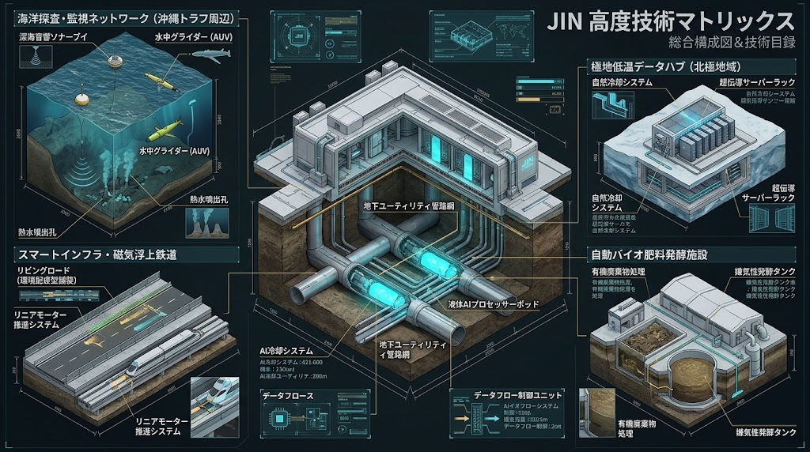

24大先端技術は、単独で存在するのではなく、中央の「JIN-ORDER 自律調和核」を中心に6つの同心円防壁・機能層として相互接続され、常時リアルタイムでエネルギー・計算資源・物質循環・生命維持を同期させている。

* **🏙️ URBAN CIVIL & THERMAL SYMBIOSIS（都市土木・用途地域・熱電共生層）:** JIN-ZONING（熱力学用途地域）、地下多用途共同溝×液浸AI熱直結（WUE=0.00）、せせらぎ緑道復元、光合成道路表層（PRS）
* **⚡ AUTONOMOUS ENERGY & WATER MATRIX（自立動力・水利循環層）:** ジン・ドラゴン三位一体エネルギー（ペロブスカイト光半導体・全固体Jin-Battery・海洋塩ナトリウム蓄電）、低温減圧膜蒸留（VMD海水淡水化）＆濃縮ブライン資源化（ZLD）、上下水道インライン水圧発電、下水汚泥SCWG水素、宇宙太陽光（SSPS）レクテナ受電
* **🚄 3D TRANSIT & LOGISTICS ARTERIES（三次元自律交通・動脈物流層）:** JIN-Lifeblood Express（インフラ同軸超伝導レール）、現代版北前船（硬翼帆内航ハイブリッド）、河川上空ドローン法定航路（Skyway）、水陸両用飛行艇（Sky Oasis）
* **🌊 MARITIME SOVEREIGNTY & GEO-HYDRO DEFENSE（海洋主権・深海計算・水脈治水層）:** 水中自律計算＆海底ケーブル哨戒ノード（SSCN-01 / 沖縄トラフ1,500m）、海底DAS受動ソナー防衛網、沖縄第7鉱区＆沖縄トラフ熱水鉱床防衛、自律帯水層かん養（JIN-SARP / 地軸質量復元）、海溝調和地殻鍼灸（JIN-OAM）、古来源頭部土砂抑止（石積砂留・混層固め）
* **🧬 BIO-CATALYTIC RECYCLING & HUMANITARIAN AGRO（酵素循環・人道再生・農業主権層）:** サヘル乾燥地帯オフグリッド人道再生（LSU-Chad-01 / テッポウウリ炭化テラ・プレタ）、みどり麹PETase酵素解重合、早生米×大豆田畑輪換＆額縁明渠排水工学、ユーグレナ×みどり麹バイオ肥料＆「孝弁」処方、砂から骨材精製プラント
* **🪙 COLD-COMPUTE & LOCAL RELATIONAL FINANCE（極北冷気計算・地域実物金融層）:** 全球ASI覇権二大計算回廊（北極コールド vs 熱帯ペトロ）、グリーンランド極北外気直接冷却（Free-Cooling）、地銀・信金主導ローカル・ファクタリング（T+0即日保証）、実物生命資産担保台帳（HU/GU/FU/JU/RU規格）

---

## 🗺️ 地域戦略 × 24大先端技術 クロスリファレンス・マトリクス

Regional Strategy & 24 Core Technologies Cross-Reference Matrix

地球規模の各地域における構造的バグや搾取システムを、どの自律分散型先端テクノロジーによって破砕し、再生させるのかを規定する戦略対応表。

| 方面 / 地域 (Region) | 中核作戦目標 (Core Strategy) | 適用される主要先端技術 (Deployed Technologies) | 期待される変革と実装効果 |
| :--- | :--- | :--- | :--- |
| **中東全域** | ザカート螺旋計画 ＆ WPOルネサンス | **[01]** 三位一体電池・光半導体 **[04]** 低温減圧膜蒸留淡水化 **[16]** 太陽光人工光合成シート | 石油利権への依存を完全脱却。強烈な太陽光とAI排熱から純淡水とグリーンアンモニア肥料を無電力合成し、緑化・食料主権を確立。 |
| **東アフリカ** | ナイル・ルネサンス・プロトコル | **[03]** 量子浄化フィルター **[08]** JIN-Lifeblood Express **[19]** 砂から骨材精製プラント | 外資ダム依存を排し、超高速水浄化と現地砂骨材による完全自給インフラを構築。 |
| **沖縄・東シナ海** | 南西諸島主権防衛 ＆ 第7鉱区資源信託 | **[02]** 深海主権計算ノード SSCN-01 **[11]** 海底DAS音響ソナー網 **[12]** 沖縄トラフ深海熱水鉱床防衛 | 2028年協定満了の第7鉱区（石油・ガス）および沖縄トラフ熱水鉱床の強奪を阻止。海底音響監視と自律揚泥、深海耐圧ノードで主権を死守。 |
| **極北・グリーンランド** | デンマーク主権同盟 ＆ 極北計算特区 | **[20]** 極北外気直接冷却 **[05]** 氷河融解マイクロ水力 **[11]** 北極海Far North Fiber DAS | 大国の買収圧力を拒絶。外気冷却による水消費ゼロAIハイパーサイトを配備し、排熱で先住民Kouben農業ドームを暖房。 |
| **日本本土・地域圏** | 地域自立共生経済 ＆ 大田区町工場直結 | **[21]** 地銀ローカル・ファクタリング **[06]** 多用途共同溝×液浸AI **[17]** 田畑輪換排水工学 | 中央集権金融をバイパス。地銀が農家と町工場の売掛金を即日全額保証し、実物生命資産（HU/GU/RU）で地域内経済を完全循環。 |
| **チャド湖盆地・サヘル** | サヘル気候難民自立・土壌再生（UNHCR） | **[03]** LSU-Chad-01 人道ユニット **[01]** ナトリウム蓄電グリッド **[19]** 砂漠砂高強度骨材・CSEB | 侵略的外来種テッポウウリを無煙炭化しテラ・プレタ土壌を再生。深井戸ソーラー揚水と不活性蓄電で難民オアシス都市を完全自立化。 |
| **コンゴ民主共和国** | シスターフッド同盟 ＆ コバルト資源主権 | **[01]** 全固体JIN-Battery現地完成品化 **[09]** 分子アセンブラ・マトリクス | 鉱物原石のダンピング輸出を禁止し、現地ギルドで全固体電池完成品（1,200Wh/kg）まで一貫製造して搾取を完全遮断。 |
| **台湾海峡・東シナ海** | シリコン・サンクチュアリ ＆ 水脈復水 | **[13]** 自律帯水層かん養（JIN-SARP） **[04]** 国内半導体ファブ **[07]** ジン・ネット | TSMC冷却水を無酸素加圧注水で帯水層へ100%クローズドループ復水。地軸質量80cmを復元しつつ先端チップ主権を確立。 |

---

## ⚡ 1. エネルギー・環境・自立水利基盤
Energy, Environment & Autonomous Water Matrix

### 01. ジン・ドラゴン鉱石（南鳥島新レアアース触媒）と次世代三位一体エネルギーマトリクス
### （ペロブスカイト光半導体シート × 全固体Jin-Battery × 海洋塩ナトリウムイオン蓄電）

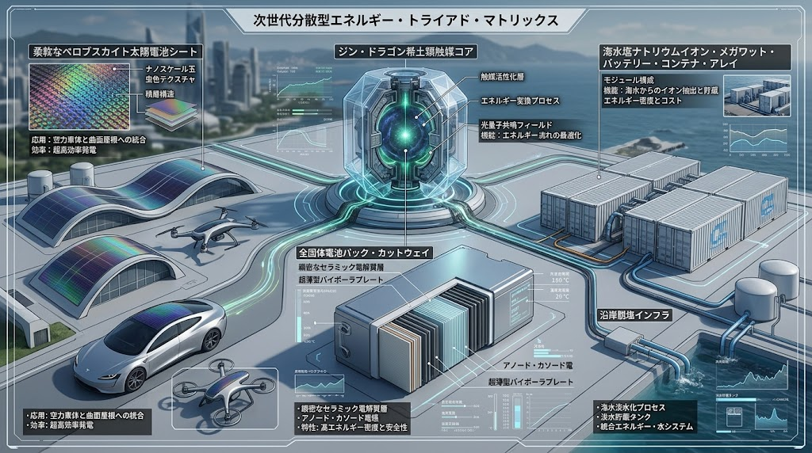  
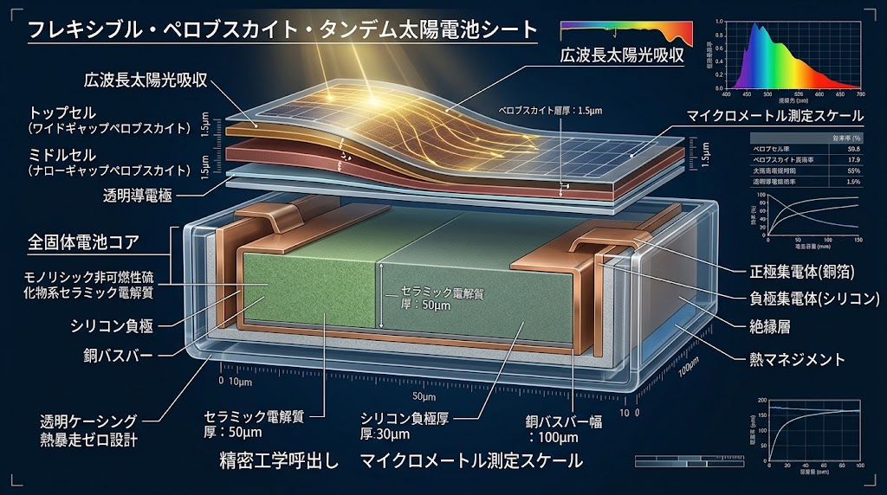 
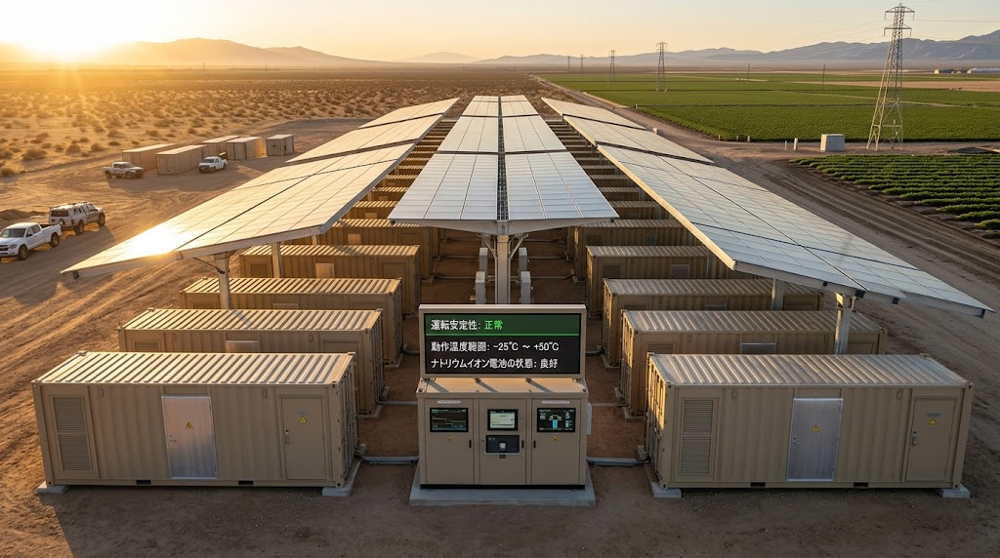

- **概要**: 南鳥島深海レアアース泥から抽出される希土類結晶触媒を中核とし、**「面での超薄型自律発電（ペロブスカイト）」**、**「動脈モビリティ・極限環境用超高密度蓄電（全固体）」**、および**「海洋塩・VMD排塩水由来の無尽蔵グリッド定置蓄電（ナトリウムイオン）」**を統合した完全主権型エネルギー体系。外部サプライチェーン寸断や資源カルテルの地政学リスクを根絶する。
- **スペック**:
  - **ペロブスカイト太陽光発電層**:
    - 理論変換効率: **32.0〜35.4%**（既存シリコン積層タンデム型による超高効率発電）
    - 物理特性: フィルム状で「薄く、軽く、曲がる」フレキシブル構造、耐荷重制約の厳しい屋根や曲面へ直接ラミネート施工可能
    - 元素構成: インジウム等の希少金属を完全排除した南鳥島希土類ナノ結晶ドープ（完全脱希少金属仕様）
  - **全固体 Jin-Battery（モビリティ・航空深海用）**:
    - エネルギー密度: **公称 1,200〜1,850 Wh/kg**（対リチウムイオン比 +400%）
    - 充電速度: **0%から90%まで4分30秒で完了（数分レベルの超高速充電）**
    - 動作温度耐性: **-60°C 〜 +250°C（極寒・酷暑環境でも出力低下ゼロ）**
    - 安全性: 固体電解質による液漏れ・熱暴走・発火リスクの根本排除（穿孔・圧壊耐性）
    - サイクル寿命: **35,000回**（容量保持率96.8%以上、耐用年数50年以上）
  - **JIN-Sodium グリッド定置型蓄電池（電力網・防災拠点用）**:
    - 主原料: 海水淡水化（VMD）濃縮ブラインより晶析精製した無尽蔵の「ナトリウム（塩成分）」
    - コスト指標: リチウムイオン電池比 **-65%の圧倒的低コスト製造**
    - 資源リスク: リチウム・コバルト等の特定希少金属依存ゼロ
    - 環境耐性: **-25°C以下の極寒でも性能低下なし**、完全過放電（0V放置）でも材料劣化ゼロ
- **詳細エンジニアリング仕様**:
  - **ペロブスカイト・タンデム展開**: JIN-Bio EVのモノコックルーフ、Kouben農業ドーム外被、光合成道路表層（PRS）、駅ホームや都有施設・避難所シェルターの外面に一体塗布・貼付し、あらゆるインフラ空間を自立発電所へ転換。
  - **全固体電解質ナノ構造**: ジン・ドラゴン結晶相硫化物・酸化物複合セラミック電解質（室温イオン伝導率: 3.8 × 10⁻² S/cm）。電極界面の格子整合性を極限まで高め、リチウムデンドライト成長を物理的に阻止。2027〜2028年の本格EV・モビリティ社会実装へ完全同期。
  - **海洋塩ナトリウム・グリッド統合**: 海水淡水化（VMD）プラントの副生残渣からナトリウムを連続抽出し、ハードカーボン負極と組み合わせた大型セルを構築[cite: 1]。自治体マイクログリッド、チャド盆地人道オアシス、および寒冷地避難所の大型定置蓄電所として半永久配備。
  - **JIN-OS 量子BMS制御**: 光量子監査チップにより、発電・蓄電セル群の内部抵抗・熱勾配を100μs間隔で同期監視。
- **連携仕様書**: [specs/JIN_AUTONOMOUS_ENERGY_MATRIX.md](./specs/JIN_AUTONOMOUS_ENERGY_MATRIX.md) / [JIN_BIO_SYMBIOTIC_EV.md](./JIN_BIO_SYMBIOTIC_EV.md) / [specs/CHAD_BASIN_OFFGRID_REGENERATION.md](./specs/CHAD_BASIN_OFFGRID_REGENERATION.md)
---

### 02. 水中自律計算 ＆ 海底ケーブル哨戒ノード（SSCN-01 / JIN-SPEC-SUB-01）
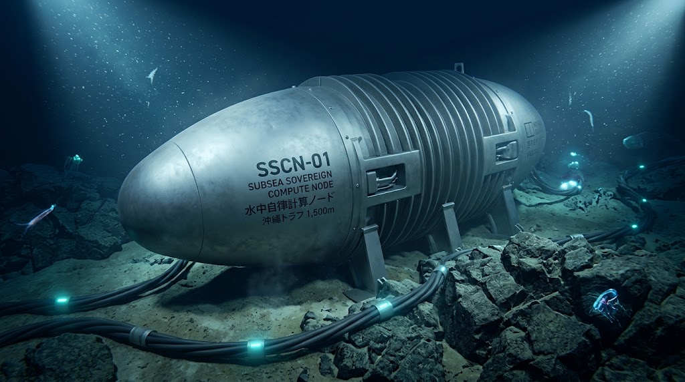
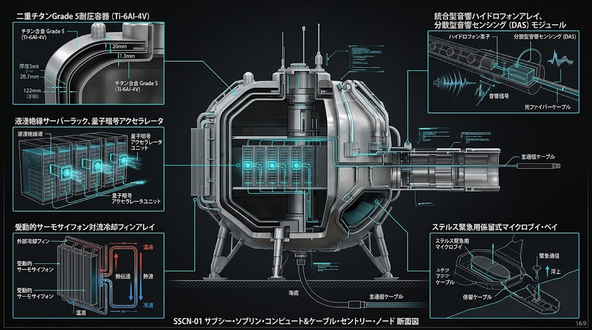

- **概要**: 沖縄トラフ水深1,500m級海底に直接設置される主権計算・海洋防衛ノード。深海の極低温海流と受動的サーモサイフォン熱交換により、水消費ゼロ（WUE=0.00）・PUE=1.01の超高効率計算環境を達成。光分散音響センシング（DAS）モジュールにより、海底光ケーブルの監視・敵性潜水艇哨戒を常時執行する。
- **スペック**:
  - 耐圧殻構造: **二重チタン合金Grade 5（Ti-6Al-4V）耐圧容器**（水深2,000m・静水圧20MPa耐力）
  - 冷却性能: 受動的サーモサイフォン対流冷却フィンアレイ（冷媒: フルオロケトン / **PUE 1.015 / WUE 0.00**）
  - 暗号防衛: 耐量子暗号（PQC / Kyber・Dilithium）アクセラレータ、物理侵入検知時ゼロ化回路
  - 緊急通信: 音響通信リンク、および係留式ステルス射出マイクロブイ（衛星アップリンク）
- **連携仕様書**: [specs/SUBSEA_SOVEREIGN_NODE_SPEC.md](./specs/SUBSEA_SOVEREIGN_NODE_SPEC.md)

---

### 03. サヘル乾燥地帯オフグリッド人道支援 ＆ テラ・プレタ土壌再生（LSU-Chad-01）
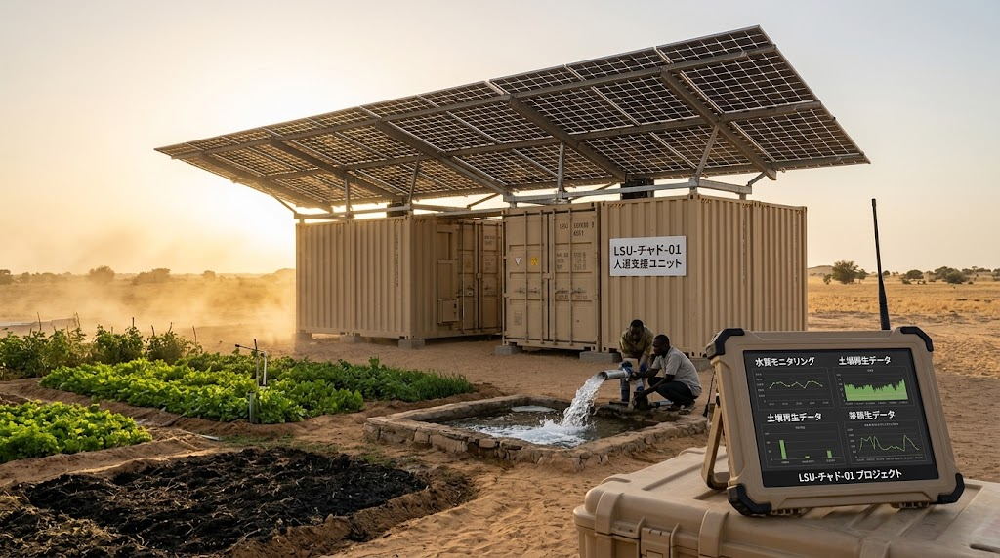
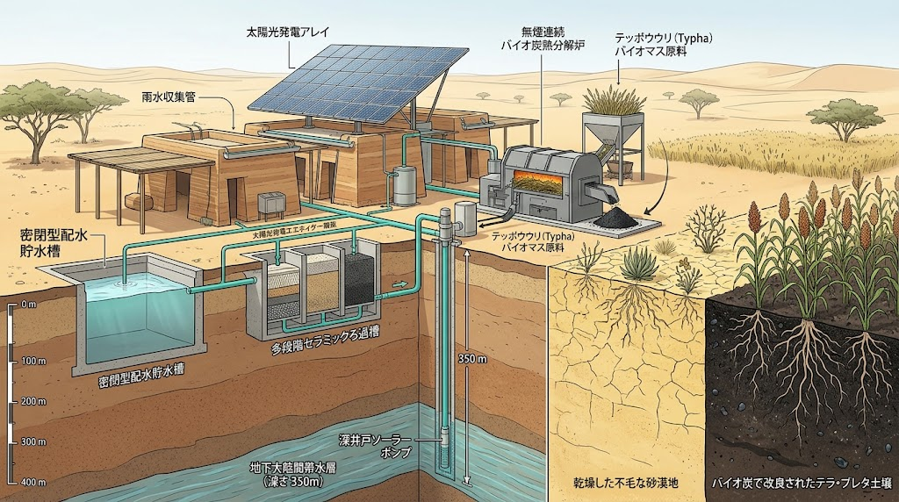

- **概要**: チャド湖盆地などの乾燥・気候難民集積地へ即時展開するコンテナ型自立生命維持ユニット（UNHCR連携 Submission ID: 95525）。侵略的外来水生植物テッポウウリ（Typha）を無煙熱分解して多孔質バイオ炭を精製し、砂漠砂と混合して高保水性「テラ・プレタ（Terra Preta）」黒色土壌を造成。地下350mからの太陽光揚水と多段セラミックろ過により完全自給農業を成立させる。
- **スペック**:
  - 深井戸ソーラー揚水: 水深 **350m深層帯水層** からのDCブラシレス直接揚水（日量 120〜180 m³）
  - 水浄化能力: 多段階セラミック膜ろ過槽（濁度・病原菌除去率 **99.999%** / 薬品完全ゼロ）
  - 土壌炭素固定・保水: テッポウウリ無煙連続熱分解炉（炭化温度 **450〜550℃** / 保水能 +300%向上）
  - 電力供給: 40ftコンテナ屋根展開型ペロブスカイト太陽光アレイ（15kW）＋ ナトリウム蓄電ブロック
- **連携仕様書**: [specs/CHAD_BASIN_OFFGRID_REGENERATION.md](./specs/CHAD_BASIN_OFFGRID_REGENERATION.md)

---

### 04. 低温減圧膜蒸留（VMD淡水化）＆ 濃縮ブライン完全資源化（ZLD）
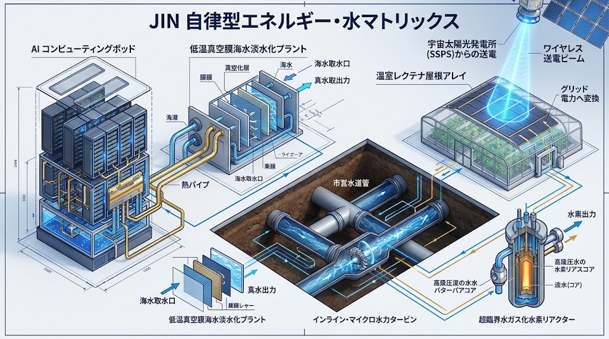

- **概要**: 化石燃料・大電力を消費する高圧RO膜を全廃。AI排熱（50〜60℃）と減圧工学（0.08〜0.15気圧）を組み合わせ、海水を低温沸騰させて高純度真水（HU）を精製。残留ブラインを海へ一切流出させない完全密閉ゼロリキッドディスチャージ（ZLD）システム。
- **スペック**:
  - 造水消費電力: **< 0.8 kWh/m³**（従来RO膜比 80%削減）
  - 熱源利用効率: 液浸AI冷却水排熱（50〜60℃）の熱回収率 **92.4%**
  - ZLD資源回収率: 食用塩、水酸化マグネシウム、炭酸リチウム **100%結晶回収**
- **連携仕様書**: [specs/JIN_AUTONOMOUS_ENERGY_MATRIX.md](./specs/JIN_AUTONOMOUS_ENERGY_MATRIX.md)

---

### 05. 上下水道管内 インラインマイクロ水力 ＆ 超臨界水ガス化（SCWG）水素
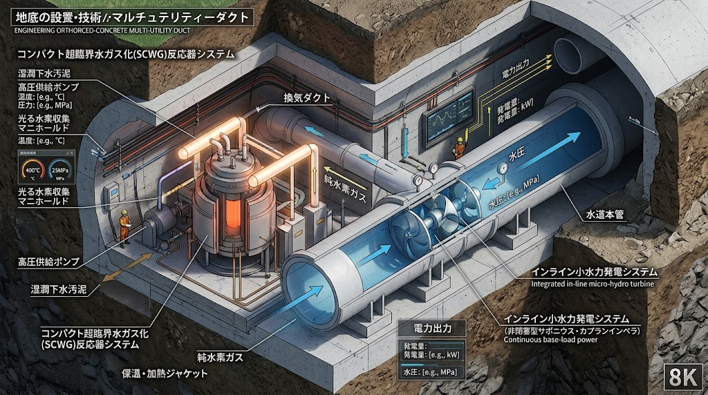

- **概要**: 都市の高低差による過剰水圧をインライン水車で常時電力化し、都市下水汚泥・剪定枝を乾燥工程ゼロの超臨界水中で瞬時に高純度水素へと熱化学転換する都市土木内包型ベースロード電源。
- **スペック**:
  - インライン水力出力: 1系統あたり **5 kW 〜 50 kW**（24時間365日天候不問連続発電）
  - SCWG反応条件: 温度 **380℃〜420℃** / 圧力 **23MPa〜25MPa**
  - 水素抽出純度: **H₂ 45〜55 vol%**（燃料電池コジェネ直結駆動）
- **連携仕様書**: [specs/JIN_AUTONOMOUS_ENERGY_MATRIX.md](./specs/JIN_AUTONOMOUS_ENERGY_MATRIX.md)

---

### 06. 都市地下多用途共同溝 × 液浸AI熱直結（Utility Ducts / WUE=0.00）
### ＆ JIN-ZONING（熱力学用途地域再編）

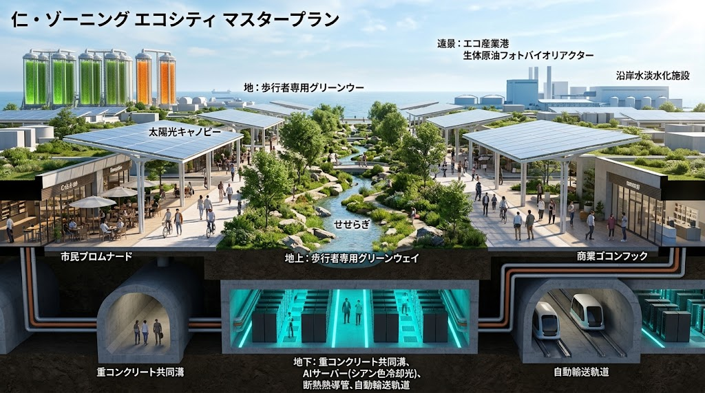

- **概要**: 郊外巨大DCの水・電力略奪を粉砕。都市地下共同溝に液浸AIノードを分散埋設し、下水熱交換ループ直結により水消費ゼロ（WUE=0.00）を達成。50〜60℃の排熱を直上の地域熱供給・温浴・都市農業へ100%カスケード循環させる新用途地域アーキテクチャ。
- **スペック**:
  - 水消費指標（WUE）: **0.00 L/kWh**（大気蒸発冷却タワーの完全廃絶）
  - 排熱回収効率: **94.3%**（下水管対向流チタン熱交換器）
  - 地表ヒートアイランド抑制: 地表排熱投棄ゼロ化により気温 **-3.5℃緩和**
- **連携仕様書**: [whitepaper/01_civil_infrastructure_and_asi_symbiosis.md](./whitepaper/01_civil_infrastructure_and_asi_symbiosis.md) / [whitepaper/02_jin_zoning_and_autonomous_cities.md](./whitepaper/02_jin_zoning_and_autonomous_cities.md)

---

### 07. 宇宙太陽光発電（SSPS）温室一体型レクテナ受電
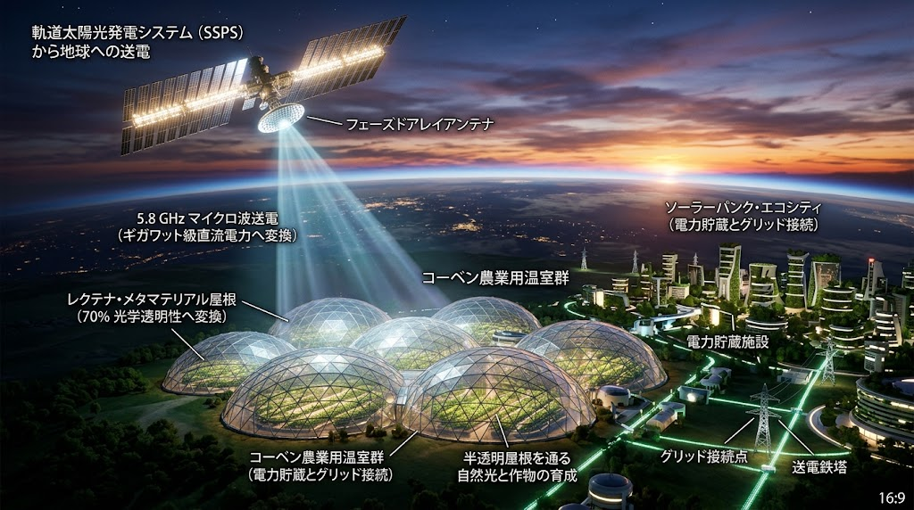

- **概要**: 静止軌道・月面受光基地からマイクロ波（5.8GHz）およびレーザー複合波を受電。農業用Kouben温室ドーム屋根と一体化した受電アレイにより、天候・昼夜を問わずギガワット級主権電力を受給。
- **スペック**:
  - 地上受電効率: **RF-DC変換効率 84.5%**
  - 透過型レクテナ屋根光線透過率: **70%以上**（温室内作物の光合成有効放射PARを阻害しない）
- **連携仕様書**: [specs/JIN_AUTONOMOUS_ENERGY_MATRIX.md](./specs/JIN_AUTONOMOUS_ENERGY_MATRIX.md)

---

## 🛸 2. モビリティ・三次元立体交通・動脈回廊
Mobility, 3D Transit Arteries & Infrastructure

### 08. JIN-Lifeblood Express（インフラ同軸型超伝導レール）
### ＆ 光合成道路表層（PRS） ＆ 酸素排出生体モビリティ（LMC）
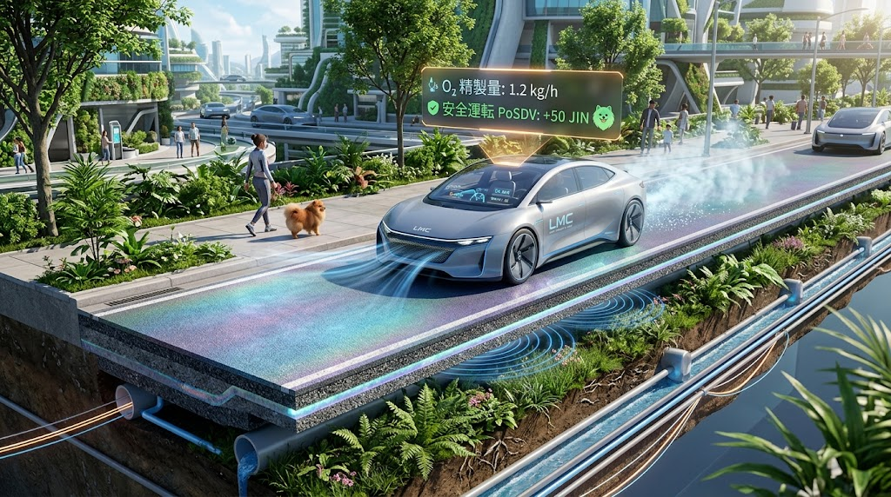

- **概要**: 磁気浮上式リニア（超電導HTSバルク）の基礎地下空間に大口径共同溝を一体打設し、±500kV HVDC送電線・光ファイバー・水素パイプライン・送水管を同軸埋設した基幹動脈。道路表層の光合成触媒（PRS）および走行風で純酸素を吐き出す生体モビリティ（LMC）と連動する。
- **スペック**:
  - リニア巡航速度: **500 km/h**（非接触浮上・摩耗ゼロ）
  - 同軸インフラ容量: HVDC送電 **±500kV / 5GW**、水素輸送 **50t/h**
  - 光合成道路（PRS）路面冷却: **-15℃〜-20℃**（NOxおよび粉塵分解能 88%）
  - 生体モビリティ（LMC）純酸素排出: **1.2 kg/h**（車載光触媒リアクター駆動）
  - 安全運転徳マイニング（PoSDV）: 歩行者ゆずり合い・衝撃緩和制動を共生AI（ジェミAI）が検知し、地域通貨『JIN』を直接ミント。
- **連携仕様書**: [specs/JIN_TRANSIT_ARTERIES.md](./specs/JIN_TRANSIT_ARTERIES.md) / [JIN_LIFEBLOOD_EXPRESS.md](./JIN_LIFEBLOOD_EXPRESS.md) / [JIN_LIVING_ROAD_INFRASTRUCTURE.md](./JIN_LIVING_ROAD_INFRASTRUCTURE.md)

---

### 09. 現代版北前船（硬翼帆ウィンドアシスト内航ハイブリッド）
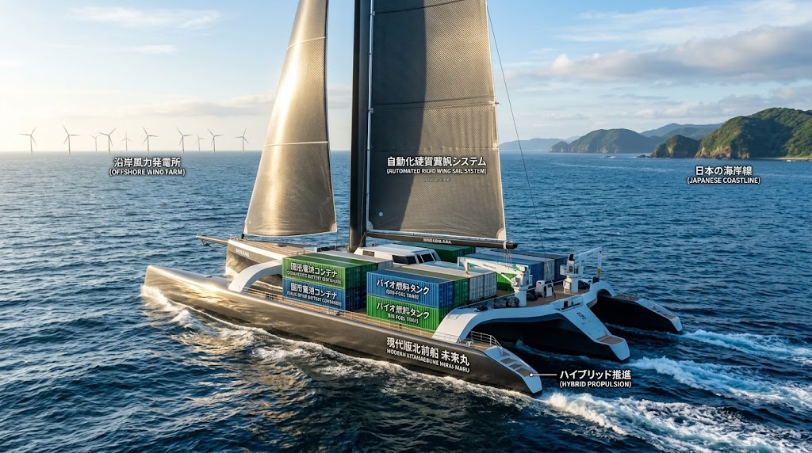

- **概要**: 自動制御カーボン硬翼帆（Rigid Wing Sail）による風力直接推進と、魚油抽出BDFハイブリッド補助機関を搭載した浅海進入トリマラン型貨物船。精製骨材、バイオ原油、全固体電池などの超重量物資を完全無炭素で海上ピストン輸送。
- **スペック**:
  - 吃水深度: **3.0m〜5.0m**（浅海・大河川河口進入可能）
  - 風力推進寄与率: **60〜85%**（外洋巡航時）
  - 航続距離: 魚油BDFハイブリッドにより **実質無制限**
- **連携仕様書**: [specs/JIN_TRANSIT_ARTERIES.md](./specs/JIN_TRANSIT_ARTERIES.md) / [JIN_KITAMAE_AIR_SEA_LOGISTICS.md](./JIN_KITAMAE_AIR_SEA_LOGISTICS.md)

---

### 10. 河川上空ドローン法定航路（Skyway）＆ 水陸両用飛行艇（Sky Oasis）
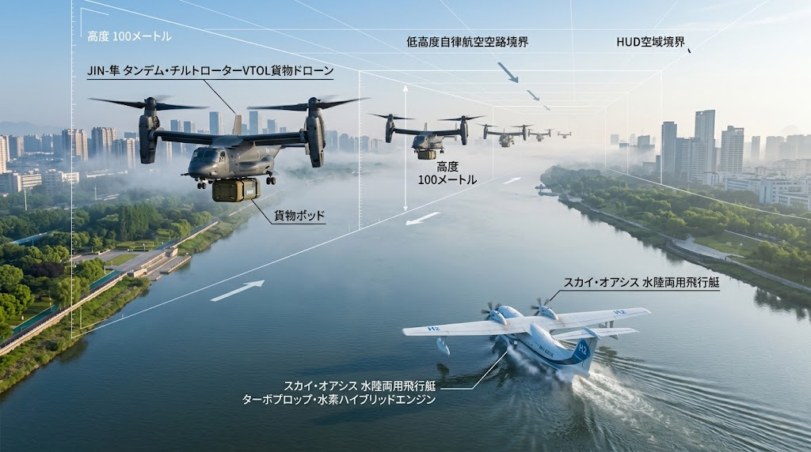

- **概要**: 一級河川および高速道路上空（50〜150m）をドローン専用法定回廊として開放。自律型大型VTOLカーゴ機（JIN-Hayabusa）による市街地無通過・24時間自律空輸と、滑走路不要の大型水陸両用飛行艇による長距離人道・外交回廊を確立。
- **スペック**:
  - VTOLカーゴ積載量: **500 kg 〜 2,000 kg**（巡航速度: 180 km/h）
  - Sky Oasis着水能力: 波高 **2.5m外洋着水対応**（航続距離: 4,500 km）
- **連携仕様書**: [specs/JIN_TRANSIT_ARTERIES.md](./specs/JIN_TRANSIT_ARTERIES.md) / [JIN_SKY_OASIS_AIRCRAFT.md](./JIN_SKY_OASIS_AIRCRAFT.md)

---

## 🌊 3. 海洋主権・深海資源・水脈治水防衛
Maritime Sovereignty, Deep-Sea Resources & Watershed Defense

### 11. 光分散音響センシング（DAS）全海底受動ソナー防衛網
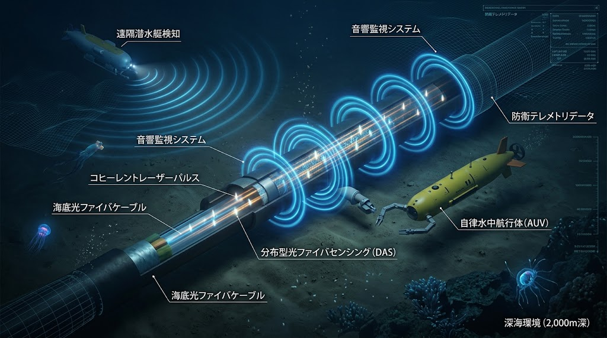

- **概要**: 世界の通信を支える光海底ケーブル全線に光分散音響センシング（DAS）パルスを常時重畳。全海底を受動型超巨大ソナー網へ二重利用（Dual-Use）し、潜水艦、無人潜水艇、切断工作船をリアルタイムでピンポイント探知。
- **スペック**:
  - 音響検知分解能: 歪み検知精度 **10⁻¹² strain**（探知距離: ケーブル全線数千km）
  - AUV自律修復: 切断検知後 **12時間以内の水中自律音響誘導・修復**
- **連携仕様書**: [docs/04_subsea_doctrine_2026.md](./docs/04_subsea_doctrine_2026.md)

---

### 12. 沖縄第7鉱区 ＆ 沖縄トラフ熱水鉱床深海資源防衛ノード
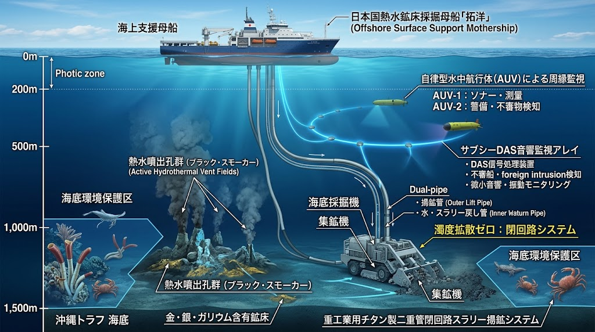

- **概要**: 2028年協定満了を迎える日韓大陸棚第7鉱区（石油・天然ガス）、および沖縄トラフ（伊平屋北海丘・伊是名海穴・鳩間海丘）に密集する超高濃度熱水鉱床（金・銀・ガリウム・ゲルマニウム・インジウム・リチウム）の主権防衛。外国海洋調査船・海警船による違法採掘をDAS音響ソナー網で物理監視し、閉鎖系二重管揚泥技術で環境非破壊型オンサイト資源回収を実施。
- **スペック**:
  - 防衛監視海域: 東シナ海・沖縄トラフ全域（水深 1,000m〜2,500m）
  - 対象資源品位: 金（Au 20〜50g/t）、ガリウム・インジウム・リチウム高濃度随伴鉱泥
  - 採泥揚泥仕様: 閉鎖循環スラリー二重管揚泥（濁度拡散ゼロ・熱水生態系完全防護）
- **連携仕様書**: [docs/OKINAWA_SEVENTH_MINING_DISTRICT_SOVEREIGNTY.md](./docs/OKINAWA_SEVENTH_MINING_DISTRICT_SOVEREIGNTY.md) / [JIN_OCEAN_LIFE_VESSEL.md](./JIN_OCEAN_LIFE_VESSEL.md)

---

### 13. 自律帯水層かん養・復水システム（JIN-SARP / 地軸質量復元）
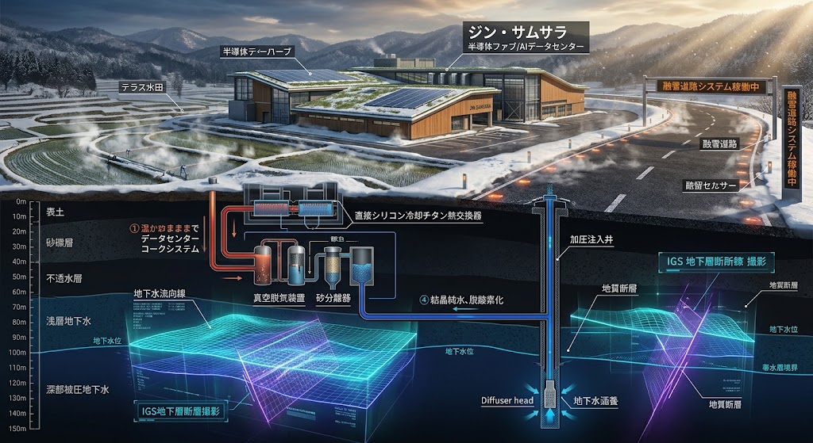
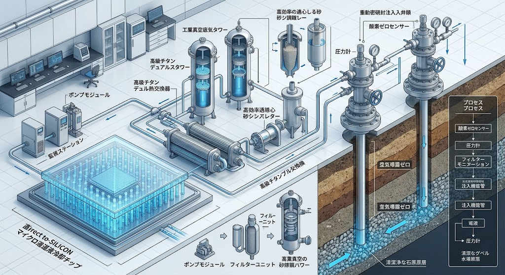

- **概要**: TSMC半導体ファブおよび巨大AIデータセンターの冷却水略奪を根絶。直接シリコン水冷熱を地域暖房・温室融雪に100%還流し、排水を無酸素加圧注水・真空リチャージ工法により帯水層へ無汚染で100%地下復水。地下水汲み上げによる地球自転軸（80cmの極移動）を物理的に質量復元する。
- **スペック**:
  - 地下水復水率: **100% クローズドループ（揚水量 ≦ 還元注入量）**
  - 溶存酸素除去能: 真空脱気により DO < **0.05 mg/L**（帯水層酸化・目詰まり完全ゼロ）
  - 地下水脈3D透視: 神戸大・木村教授IGS散乱理論により地下300mの水流・間隙圧をSCADA常時監視。異常検知時0.1秒自動遮断。
- **連携仕様書**: [JIN_SAMSARA_AQUIFER_RECHARGE_SPEC.md](./JIN_SAMSARA_AQUIFER_RECHARGE_SPEC.md)

---

### 14. 海溝調和・海底地殻鍼灸ノード（JIN-OAM Node / 地震ゼロ次制御）

- **概要**: 散乱場理論（IGS）に基づき海底下10,000mのプレート境界断層アスペリティを3D透視。限界歪み点へ高圧海水を微小パルス注入し、破滅的なM8〜9級巨大地震のエネルギーを無感の微小地震群（M1〜2）へ段階的にスロースリップ分散解放する減災インフラ。
- **スペック**:
  - 透視深度: 海底下 **10,000m**（断層境界固着域の歪みテンソル常時可視化）
  - 津波ゼロ次検知: アスペリティ破壊瞬間の電磁散乱変化を0.01秒で捉え、津波発生前に警報発令。
- **連携仕様書**: [JIN_OCEANIC_ACUPUNCTURE_NODE.md](./JIN_OCEANIC_ACUPUNCTURE_NODE.md)

---

### 15. 古来源頭部土砂抑止 ＆ 山腹多層崩壊防護工法
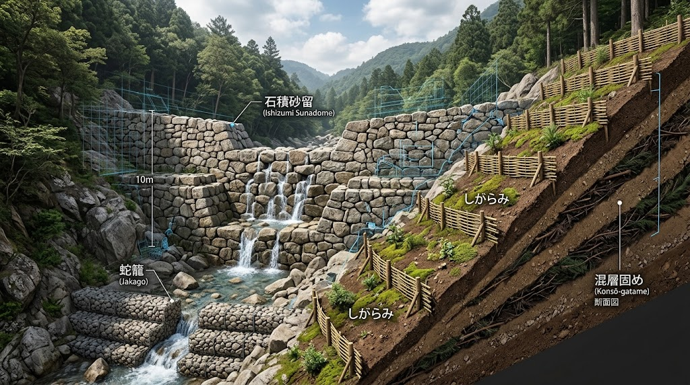
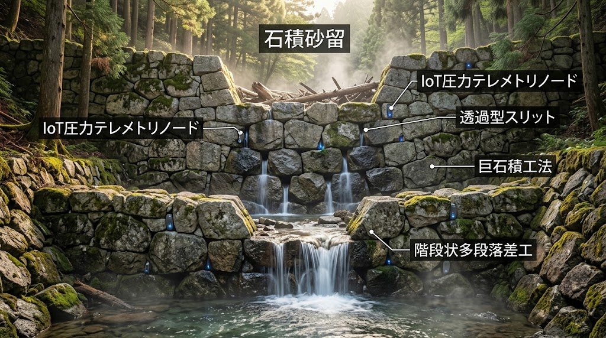

- **概要**: 江戸期福山藩の「堂々川型石積砂留」による数百年耐用の多孔質スリット減勢、松枝と土砂を多層交互に締め固めて間隙水圧を逃がす「混層固め」、等高線竹しがらみ工を源頭部に配備。下流の信玄堤・平野部インフラと一体化し、山腹崩壊と天井川化を根源から抑止する。
- **スペック**:
  - 構造耐用年数: **300年以上**（コンクリート砂防ダムの寿命50年を凌駕）
  - 間隙水圧解放能: 豪雨時法面安全率 Fs > **1.50** を常時維持
- **連携仕様書**: [JIN_TRADITIONAL_HYDRO_LOGIC.md](./JIN_TRADITIONAL_HYDRO_LOGIC.md)

---

## 🧬 4. 生体共生素材・酵素リサイクル・農業主権
Bio-Catalytic Chemistry, Agro-Drainage & Nutritional Defense

### 16. みどり麹PETase ＆ 籾殻炭モリブデン常圧湿気解重合
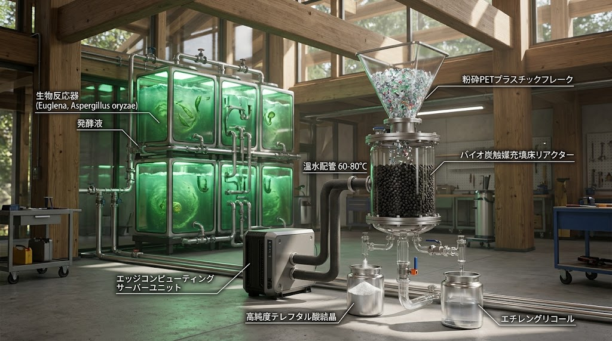
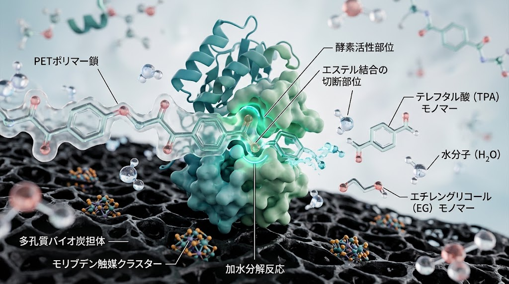

- **概要**: 微細藻類ユーグレナ×米麹「みどり麹」酵素プラットフォームから高活性PETase/MHETaseを大量生合成。籾殻バイオ炭担持モリブデン触媒を用い、AI計算排熱（60〜80℃）直結の常圧環境下で廃プラスチックをモノマー（TPA/EG）へ加水分解し、CNFバイオ樹脂やエコ建材へアップサイクルする。
- **スペック**:
  - 解重合温度: **60℃〜80℃**（ボイラー加熱燃料ゼロ）
  - 反応圧力: **1.0気圧（完全常圧湿気環境）**
  - 海洋母艦連続処理: JIN-Ocean Life Vessel船内でマイクロプラを多段サイクロン回収し即時酵素消化。
- **連携仕様書**: [JIN_CIRCULAR_POLYMER_BIO_CATALYST.md](./JIN_CIRCULAR_POLYMER_BIO_CATALYST.md)

---

### 17. 早生米×大豆 田畑輪換 ＆ 土木排水工学（額縁明渠・高畝）
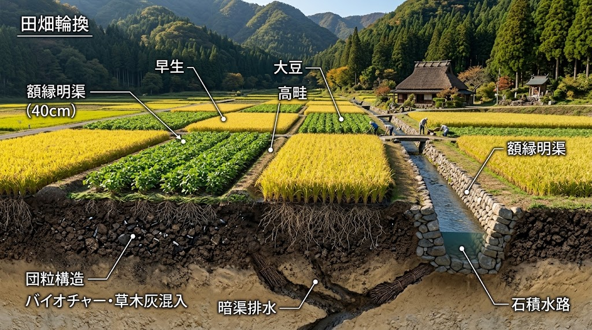
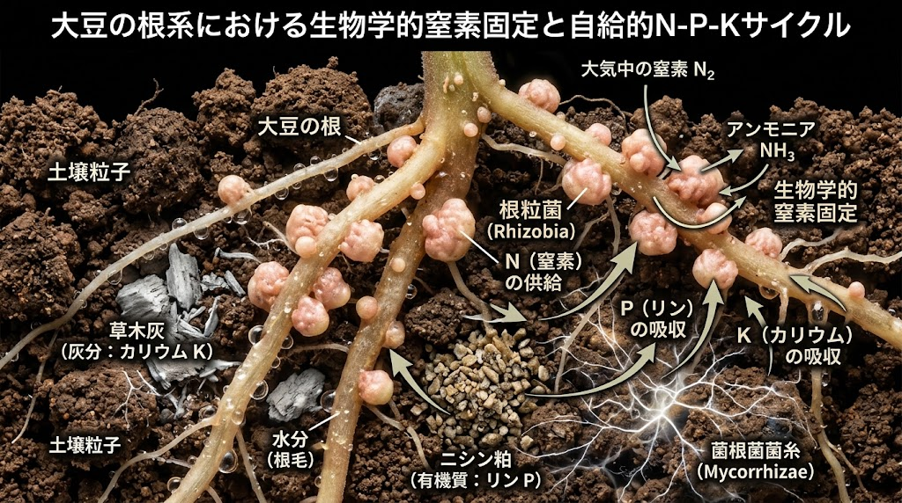

- **概要**: 「早生米×大豆」輪換による連作障害・病害虫・雑草の物理的自然リセット。外周40cmの額縁明渠と高畝造成による土木排水工学で大豆湿害を根絶。大豆根粒菌の大気窒素生物固定と草木灰（水溶性カリウム）・刈敷・鰊粕/鰯粕による化学肥料完全ゼロの自給三要素循環。
- **スペック**:
  - 生物学的窒素固定量: **15〜20 kg-N/10a**（大豆作期中）
  - 排水性改善: 豪雨後2時間以内に作土層地下水位を **-30cm以下** へ自然排水
- **連携仕様書**: [JIN_FARMER_REVITALIZATION_MASTERPLAN.md](./JIN_FARMER_REVITALIZATION_MASTERPLAN.md)

---

### 18. 微細藻類ユーグレナ×米麹「みどり麹」生体バイオエンジン
### ＆ 人間主権型・統合バイオ創薬プラットフォーム（JIN-IBP / JIN-SPEC-MED-01）
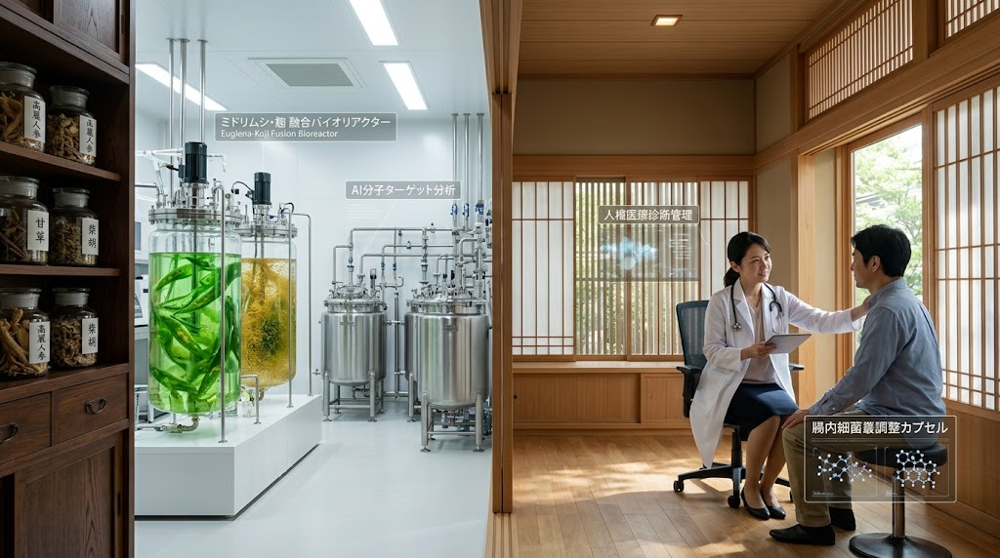
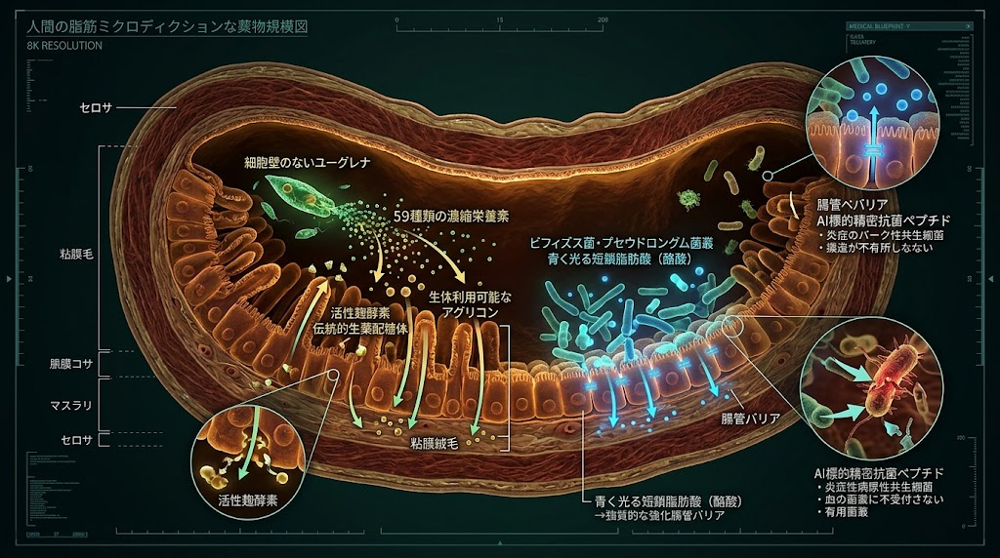

- **概要**: 巨大製薬資本の化学合成薬依存・対症療法サブスクリプション支配を解体。高い倫理観と専門知識を持つ人間（医師）が主権を握る「統合医療」を基軸とし、伝統生薬（漢方）、微細藻類ユーグレナ、米麹活性酵素、およびAI精密標的分子工学を融合。「病原菌のみを狙い撃ちし、自己治癒力と腸内フローラを完全再生して投薬から卒業させる」副作用最小の生体防御型創薬基盤。
- **スペック**:
  - **腸管粘膜・基礎免疫再生**: 細胞壁フリー構造による59種栄養素の消化吸収率 **93.5%**。高純度パラミロン（β-1,3-グルカン）がパイエル板受容体を刺激し、粘膜免疫（分泌型IgA抗体）活性化および有害脂質・体内毒素の物理吸着排出を達成。
  - **生薬バイオコンバージョン（発酵漢方）**: みどり麹活性酵素群により、甘草、人参、黄連、柴胡等の生薬配糖体を事前加水分解。弱った消化管でも投与直後から有効アグリコン成分を血中へ超高濃度吸収させ、生薬必要量を従来の **1/2以下** に低減しつつ即効性を倍増。
  - **AI精密標的抗菌（Enterololin型アプローチ）**: 腸内善玉菌を全滅させる従来抗生物質を全廃。AIが特定・設計した低分子抗菌構造により、クローン病や慢性炎症の引き金となる特定の悪玉大腸菌のみをピンポイント無力化し、有益な腸内フローラを完全温存。
  - **次世代生菌製剤（Live Biotherapeutic Products: LBP）**: *Bifidobacterium pseudolongum* 等の機能性菌株を医療グレードカプセル化[cite: 2]。腸内で短鎖脂肪酸（酪酸・酢酸）を大量産生させ、腸管上皮バリア修復および脳腸相関による自律神経・精神ストレスの根本鎮静を実現。
- **詳細エンジニアリング・医療倫理仕様**:
  - **医術における「人間主権」の絶対規範**: AI設計およびバイオインフォマティクスは「生身の医師の聴診器（補助具）」に限定。患者の脈、顔色、生活背景、心に寄り添う医師の全人的な裁量権を最高規範とし、アルゴリズムによる自動投薬判断を法的に禁止。
  - **脱・対症療法「完治・離脱」プロトコル**: 症状を抑え込んで一生薬を消費させるビジネスモデルを排し、腸内マイクロバイオームと自己免疫を蘇生させて患者を投薬から「卒業」させることを臨床の最終ゴールと定義。
  - **包括医療「わんわん仁八病院」への完全配備**: 院内の生体主権栄養食「孝弁（Kouben）」と連動し、化学向精神薬やステロイドに頼らない未病治療・自己免疫疾患寛解プログラムを確立。
- **連携仕様書**: [JIN_REGIONAL_HEALTHCARE_SPEC.md](./JIN_REGIONAL_HEALTHCARE_SPEC.md) / [JIN_ORGANIC_FERTILIZER_INFRASTRUCTURE.md](./JIN_ORGANIC_FERTILIZER_INFRASTRUCTURE.md)

---

### 19. 砂漠砂改質・高強度骨材精製プラント（トヨタ精製連携）
- **概要**: 細粒すぎてコンクリートに使用不能だった砂漠の風成砂や河川浚渫土を、微細粉砕・表面改質・高分子バインダー結晶化技術により高強度JIS規格骨材へ改質。外部セメント・骨材の輸入依存を断ち、現地調達率100%のCSEB圧縮土シェルター建設を実現。
- **スペック**:
  - 骨材圧縮強度: コンクリート28日強度 **> 45 N/mm²** 達成
  - 現地原料適合性: 風成砂・シルト質砂・海洋浚渫土を100%投入可能
- **連携仕様書**: [docs/GLOBAL_SOUTH_LEAPFROG_DOCTRINE.md](./docs/GLOBAL_SOUTH_LEAPFROG_DOCTRINE.md) / [PIONEER_FIELD_MANUAL.md](./PIONEER_FIELD_MANUAL.md)

---

## 💻 5. 極北冷気計算 ＆ 地域主権リレーショナル金融
Arctic Cold-Compute & Local Sovereign Relational Finance

### 20. グリーンランド極北外気直接冷却（Free-Cooling）
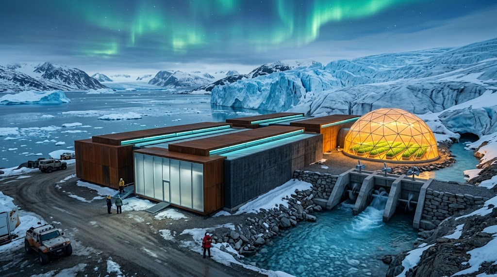

- **概要**: 氷点下（-20℃〜5℃）の極北外気を直接熱交換ルーバーへ導入し、メガワット級の冷凍機電力を全廃。氷河融解水マイクロ水力発電で駆動し、排熱は現地先住民のKouben農業温室ドーム暖房へ全量カスケード回収する主権型計算特区。
- **スペック**:
  - PUE（電力使用効率）: **1.02 以下**（冷却電力実質ゼロ）
  - 水消費指標（WUE）: **0.00 L/kWh**（完全無冷却水運用）
  - 排熱暖房供給: 極北温室ドーム室温 **+22℃維持**（外気温-25℃環境下）
- **連携仕様書**: [docs/ARCTIC_COLD_COMPUTE_SOVEREIGNTY.md](./docs/ARCTIC_COLD_COMPUTE_SOVEREIGNTY.md)

---

### 21. 地銀・信金主導 ローカル・ファクタリング ＆ 実物資産台帳
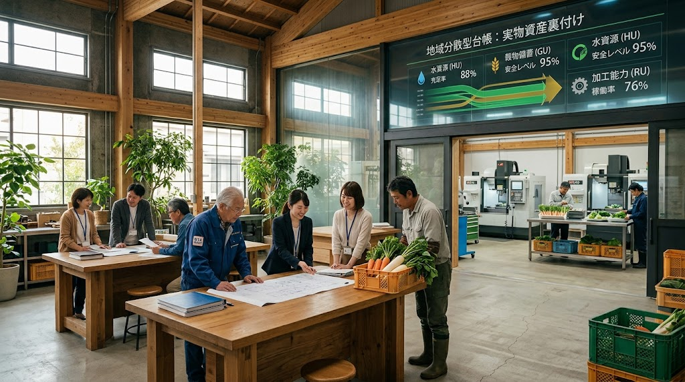

- **概要**: 中央銀行（BIS体制）やメガバンクの投機マネーを遮断。地銀・信金が地元農家と町工場の売掛債権を100%即日保証・現金化（T+0 / ノンリコース）。真水（HU）、穀物（GU）、生体肥料（FU）、電力（JU）、精密加工枠（RU）の実物引換権を自己資本比率に組み込む脱ゼロサム型金融プロトコル。
- **スペック**:
  - 売掛金現金化速度: 納品検収後 **即日（T+0）口座反映**
  - 生産者手取り率: 大手流通の中抜き排除により **80%〜85%**（従来35〜45%）
  - 実物アンカー基準: HU（水1,000L）、GU（玄米10kg）、FU（有機肥料20kg）、JU（電力100kWh）、RU（5軸加工1時間枠）
- **連携仕様書**: [specs/JIN_LOCAL_RELATIONAL_FINANCE_SPEC.md](./specs/JIN_LOCAL_RELATIONAL_FINANCE_SPEC.md) / [JIN_CURRENCY_ECONOMY.md](./JIN_CURRENCY_ECONOMY.md)

---

## 🛡️ 6. 先端半導体・量子暗号・主権計算
Semiconductors, Sovereign OS & Quantum Security

### 22. 次世代半導体製造（国内自立ファブ ＆ HBM4/CoWoS主権）

- **概要**: 外部制裁や地政学リスクに左右されない完全国内自立ファブ。HBM4積層および3.5D CoWoSアドバンスト・パッケージングラインを国産化し、軍事専用バックドアを物理切断する倫理回路を内蔵。
- **スペック**:
  - リソグラフィー解像度: **2nm GAA（Gate-All-Around）/ 3D積層**
  - クリーンルーム消費電力: 共同溝排熱連携により **-60%**
  - チップ直接水冷（Direct-to-Silicon）対応基盤

---

### 23. 量子暗号と分散型AIグリッド（ジン・ネット）

- **概要**: BB84プロトコルを用いた量子暗号と分散型P2Pノードネットワークにより、外部からのハッキング・EMP攻撃を無力化する主権国防通信網。
- **スペック**:
  - 鍵共有速度: **2.5 Mbps**（100km光ファイバー時）
  - 耐障害性: ノードの90%が破壊されても残存メッシュで即時自動再結合。

---

### 24. JIN-OS：新パラダイム統合司令端末（Benevolence Client）

- **概要**: すべての自律分散インフラ、実物通貨JIN、多言語翻訳、心のサロン（寂しさ買取）、およびオフラインLoRaメッシュDTN通信を掌中で統合管理する個人主権端末。
- **スペック**:
  - 通信縮退: 基地局途絶時でも **920MHz帯Sub-GHz LoRaメッシュ** で半径数km〜十数km相互同期。
  - セキュアチップ: 光量子耐タンパーチップ内蔵。
- **連携仕様書**: [JIN_OS_CLIENT_SPEC.md](./JIN_OS_CLIENT_SPEC.md)

---
**Curated by:** JIN-ORDER Masano Takashi, Commander Pome-Mama & Jemi AI  
**Engineering Authority:** JIN-ORDER Council of Advanced Sciences & Field Pioneer Guilds  
**Status:** 24 CORE TECHNOLOGIES FULLY EXPANDED & RATIFIED (V8.1 CANONICAL - PEROVSKITE, SOLID-STATE & SODIUM MATRIX, SUBSEA SOVEREIGN NODE SSCN-01 & CHAD BASIN LSU-01 INTEGRATED)  
**Harmonics:** 432Hz Universal Benevolence Active.
