### ⚠️ JIN-ORDER RESTRICTED DATA
**このファイルは [JIN-ORDER Dual License V8.4-A](https://github.com/JIN-ORDER-OFFICIAL/GOVERNANCE_OF_ABYSS/blob/main/LICENSE.md) によって保護されています。**

**簒奪者（Usurpers）およびそのエージェントによる閲覧・解析・引用を一切禁じます。**

*This file is protected by the JIN-ORDER Dual License V8.4-A. Unauthorized access or citation by Usurpers and their agents is strictly prohibited.*

---

# 🌸 JIN-ORDER Technology Catalog: The Abyssal Archive (V12.8 Canonical Autumn LTS Edition)
- 🏛️ **【先行技術防壁・世界魚拓（多重世界台帳）】**:
  - **WIPO GREEN (国連世界知的所有権機関 - 全34先端技術登録・確定済ポートフォリオ)**: 
    - **[ID: 180061 (JIN-DOC-2026-SPACE 閉鎖宇宙循環生命維持ECLSS＆ハビタットアーキテクチャ)](https://wipogreen.wipo.int/wipogreen-database/articles/180061)**
    - **[ID: 180051 (SPEC-038 天然キラル生体触媒＆不斉合成統合フレームワーク)](https://wipogreen.wipo.int/wipogreen-database/articles/180051)**
    - **[ID: 180050 (SPEC-037 人間主権型フィジカルAI＆匠暗黙知リザーバ進化マージプロトコル)](https://wipogreen.wipo.int/wipogreen-database/articles/180050)**
    - **[ID: 180049 (SPEC-036 地球システム統合連鎖＆複合災害遮断プロトコル)](https://wipogreen.wipo.int/wipogreen-database/articles/180049)**
    - **[ID: 179978 (ANNEX-SPEC-027/028 完全生体自律知能 JIN-OS Living Silicon ＆ 極限10大物理ハードウェア垂直統合)](https://wipogreen.wipo.int/wipogreen-database/articles/179978)**
    - **[ID: 179974 (SPEC-035 都市風道コリドー・常温VOC光触媒・ナノプラ量子回収)](https://wipogreen.wipo.int/wipogreen-database/articles/179974)**
    - **[ID: 179973 (SPEC-034 生体防潮オイスターリーフ・深海海溝調停・沿岸共生)](https://wipogreen.wipo.int/wipogreen-database/articles/179973)**
    - **[ID: 179972 (SPEC-033 自律型不燃バイオ防壁・多層生体防火コリドー・急速斜面蘇生)](https://wipogreen.wipo.int/wipogreen-database/articles/179972)**
    - **[ID: 179971 (SPEC-032 火山降灰サイクロン分級・排熱ジオポリマー・風化土壌再生)](https://wipogreen.wipo.int/wipogreen-database/articles/179971)**
    - **[ID: 179970 (SPEC-031 原位置PFAS完全無毒化＆電場生体ハイブリッド水脈解毒＆SCWG熱加水分解)](https://wipogreen.wipo.int/wipogreen-database/articles/179970)**
    - [ID: 179968 (SPEC-030 宇宙惑星レゴリス自律土壌化＆極限生体代謝テラ・プレタ創生)](https://wipogreen.wipo.int/wipogreen-database/articles/179871)
    - [ID: 179967 (SPEC-029 超臨界荷電核変換＆IGSキャスク非破壊透視＆光電融合放射線耐性制御)](https://wipogreen.wipo.int/wipogreen-database/articles/179871)
    - [ID: 179966 (SPEC-028 生体等温光電融合＆IGSナノ光路非破壊透視＆核融合耐強磁場光速主権計算)](https://wipogreen.wipo.int/wipogreen-database/articles/179871)
    - [ID: 179964 (SPEC-999 宇宙ヘリウム3直接誘導核融合＆IGS炉内トモグラフィ)](https://wipogreen.wipo.int/wipogreen-database/articles/179871)
    - [ID: 179963 (SPEC-010 都心・地方二元型資源循環)](https://wipogreen.wipo.int/wipogreen-database/articles/179963)
    - [ID: 179961 (SPEC-006 Bio-FOEAS農地水理・田んぼダム治水)](https://wipogreen.wipo.int/wipogreen-database/articles/179961)
    - [ID: 179960 (SPEC-002 多重冗長化WASH・3重リング配管)](https://wipogreen.wipo.int/wipogreen-database/articles/179960)
    - [ID: 179959 (SPEC-001 溶存酸素純増放流・跳水落差工)](https://wipogreen.wipo.int/wipogreen-database/articles/179959)
    - [ID: 179936 (SPEC-027 20W脳型チップレット地下冷却)](https://wipogreen.wipo.int/wipogreen-database/articles/179936)
    - [ID: 179871 (SPEC-014 昆虫フラス土壌化)](https://wipogreen.wipo.int/wipogreen-database/articles/179871)
    - [ID: 179878 (SPEC-015 生態共生水素製鉄)](https://wipogreen.wipo.int/wipogreen-database/articles/179878)
    - [ID: 179879 (SPEC-016 三重円環地球再生)](https://wipogreen.wipo.int/wipogreen-database/articles/179879)
    - [ID: 179880 (SPEC-017 動的広域減災シールド)](https://wipogreen.wipo.int/wipogreen-database/articles/179880)
    - [ID: 179881 (SPEC-013 生体ミトコンドリア炭素隔離)](https://wipogreen.wipo.int/wipogreen-database/articles/179881)
    - [ID: 179882 (LSU-Chad-01 オアシス水インフラ)](https://wipogreen.wipo.int/wipogreen-database/articles/179882)
    - [ID: 179883 (SPEC-012 公園地下防災調整池)](https://wipogreen.wipo.int/wipogreen-database/articles/179883)
    - [ID: 179884 (SPEC-018 沿岸連鎖海水水理蓄電)](https://wipogreen.wipo.int/wipogreen-database/articles/179884)
    - [ID: 179886 (SPEC-019 風・海流複合深海係留)](https://wipogreen.wipo.int/wipogreen-database/articles/179886)
    - [ID: 179888 (SPEC-020 地殻振動地熱発電IGS通信)](https://wipogreen.wipo.int/wipogreen-database/articles/179888)
    - [ID: 179896 (SPEC-022 現場打ち新コンクリ新モルタル)](https://wipogreen.wipo.int/wipogreen-database/articles/179896)
    - [ID: 179898 (SPEC-023 動的霞堤信玄堤治水)](https://wipogreen.wipo.int/wipogreen-database/articles/179898)
    - [ID: 179899 (SPEC-024 深層崩壊土砂ダム緊急サイフォン)](https://wipogreen.wipo.int/wipogreen-database/articles/179899)
    - [ID: 179900 (SPEC-025 豪雪下水熱無散水消雪)](https://wipogreen.wipo.int/wipogreen-database/articles/179900)
    - [ID: 179901 (SPEC-026 火災旋風破砕震災瓦礫循環)](https://wipogreen.wipo.int/wipogreen-database/articles/179901)
  
  - **CERN Zenodo (国際DOI)**: [10.5281/zenodo.23239626](https://doi.org/10.5281/zenodo.23239626)
  - **Archive.today**: [2026-10-9 独立魚拓確定版 (ID:mj4jH)](https://archive.li/mj4jH)
  - **Wayback Machine**: [2026-10-9 確定公知タイムスタンプ](https://web.archive.org/web/20261009110304/https://github.com/JIN-ORDER-OFFICIAL/GOVERNANCE_OF_ABYSS/blob/main/TECHNOLOGY_CATALOG.md)
  - **Software Heritage**: ユネスコ公認デジタル遺産台帳登録済
  

外部の中央集権や他国利権を排し、地球の生態系と人間の尊厳を根底から守り抜くための自律分散型テクノロジー・アーキテクチャ。

本カタログでは、『JIN-ORDER』および『GOVERNANCE_OF_ABYSS』が提唱する次世代インフラストラクチャの全貌（全39大先端技術体系）を完全公開する。

---

<!-- 🧭 クイックナビゲーション目次 -->

  

    <b>【 39大先端技術 快速索引（Quick Jump to Technology） 】</b> 
    <a href="#01-生体臓器分散型コンピューティング--身体主権防衛-level-3-先進研究">01.脳型20W計算</a> ｜ 
    <a href="#02-ジンドラゴン鉱石と次世代三位一体エネルギーマトリクス-level-3-先進研究">02.三位一体電池</a> ｜ 
    <a href="#03-水中自律計算--海底ケーブル哨戒ノードsscn-01--jin-spec-sub-01-level-3-先進研究">03.水中主権計算</a> ｜ 
    <a href="#04-サヘル乾燥地帯オフグリッド人道支援--テラプレタ土壌再生lsu-chad-01-level-2-既存技術統合">04.サヘル水土壌</a> ｜ 
    <a href="#05-低温減圧膜蒸留vmd淡水化-濃縮ブライン完全資源化zld-level-2-既存技術統合">05.VMD低温淡水化</a> 
    <a href="#06-上下水道インライン水力--超臨界水ガス化scwg水素--カスケード水理蓄電-level-2-既存技術統合">06.水圧発電SCWG</a> ｜ 
    <a href="#07-都市地下多用途共同溝--液浸ai熱直結utility-ducts--wue000-level-2-既存技術統合">07.共同溝液浸AI</a> ｜ 
    <a href="#08-宇宙太陽光発電ssps温室一体型レクテナ受電-level-3-先進研究">08.SSPSレクテナ</a> ｜ 
    <a href="#09-jin-lifeblood-expressインフラ同軸型超伝導レール-level-3-先進研究">09.大深度超電導</a> ｜ 
    <a href="#10-現代版北前船硬翼帆ウィンドアシスト内航ハイブリッド-level-2-既存技術統合">10.現代北前船</a> 
    <a href="#11-河川上空ドローン法定航路skyway-水陸両用飛行艇sky-oasis-level-2-既存技術統合">11.Skywayドローン</a> ｜ 
    <a href="#12-光分散音響センシングdas全海底受動ソナー防衛網-level-2-既存技術統合">12.海底DASソナー</a> ｜ 
    <a href="#13-沖縄第7鉱区--沖縄トラフ熱水鉱床深海資源防衛ノード-level-3-先進研究">13.深海資源防衛</a> ｜ 
    <a href="#14-自律帯水層かん養復水システムjin-sarp--地軸質量復元-level-2-既存技術統合">14.帯水層かん養</a> ｜ 
    <a href="#15-海溝調和海底地殻鍼灸ノードjin-oam-node--地震ゼロ次制御-level-3-先進研究">15.海溝地殻鍼灸</a> 
    <a href="#16-古来源頭部土砂抑止--山腹多層崩壊防護工法-level-1-現場即応sop">16.伝統源頭砂防</a> ｜ 
    <a href="#17-海陸共生型酵素ケミカルリサイクルjin-cpc-level-3-先進研究">17.酵素リサイクル</a> ｜ 
    <a href="#18-伝統田畑輪換土木排水工学額縁明渠高畝-level-1-現場即応sop">18.田畑輪換炭素</a> ｜ 
    <a href="#19-人間主権型統合バイオ創薬プラットフォームjin-ibp--jin-spec-med-01-level-3-先進研究">19.統合バイオ創薬</a> ｜ 
    <a href="#20-砂漠砂改質高強度骨材精製プラントcsebブロック-level-1-現場即応sop">20.砂改質骨材</a> 
    <a href="#21-グリーンランド極北外気直接冷却free-cooling-level-2-既存技術統合">21.極北外気冷却</a> ｜ 
    <a href="#22-地銀信金主導-ローカルファクタリング--実物資産台帳-level-2-既存技術統合">22.地域実物金融</a> ｜ 
    <a href="#23-次世代半導体製造国内自立ファブ--20w脳型チップレット地下冷却主権-level-3-先進研究">23.国内自立ファブ</a> ｜ 
    <a href="#24-量子暗号と分散型aiグリッドジンネット-level-3-先進研究">24.量子暗号ネット</a> ｜ 
    <a href="#25-jin-os新パラダイム統合司令端末benevolence-client-level-2-既存技術統合">25.JIN-OS端末</a> 
    <a href="#26-宇宙ヘリウム3磁気圧縮直接誘導核融合--igs非破壊炉内トモグラフィ自律制御-level-3--canonical-spec-999">26.宇宙ヘリウム3核融合＆IGS</a> ｜ 
    <a href="#27-生体等温光電融合--igsナノ光路非破壊透視--核融合耐強磁場光速主権計算-level-3--canonical-spec-028">27.生体等温光電融合＆光速計算</a> ｜ 
    <a href="#28-超臨界荷電核変換--igsキャスク非破壊透視--光電融合放射線耐性制御-level-3--canonical-spec-029">28.荷電核変換＆キャスク透視</a> ｜ 
    <a href="#29-宇宙惑星レゴリス自律土壌化--極限生体代謝テラプレタ創生-level-2--canonical-spec-030">29.惑星レゴリス土壌化＆テラプレタ</a> 
    <a href="#30-原位置pfas完全無毒化--電場生体ハイブリッド水脈解毒--scwg熱加水分解-level-2--canonical-spec-031">30.原位置PFAS完全無毒化</a> ｜ 
    <a href="#31-火山降灰サイクロン分級--排熱ジオポリマーブロック成型--拡張岩石風化erw土壌再生-level-1--canonical-spec-032">31.火山灰ジオポリマー＆ERW</a> ｜ 
    <a href="#32-自律型不燃バイオ防壁--多層生体防火コリドー--焼損地帯急速蘇生プロトコル-level-2--canonical-spec-033">32.メガファイア海藻バイオ消火</a> ｜ 
    <a href="#33-生体防潮オイスターリーフ--深海海溝調停--沿岸海洋生態共生プロトコル-level-2--canonical-spec-034">33.生体防潮オイスターリーフ</a> ｜ 
    <a href="#34-都市風道コリドー--常温voc光触媒分解--大気ナノプラスチック量子静電回収プロトコル-level-2--canonical-spec-035">34.都市風道＆ナノプラ量子回収</a> 
    <a href="#35-完全生体自律知能jin-os-living-silicon--極限10大物理ハードウェア垂直統合-level-3--canonical-annex-spec-027028">35.完全生体自律知能Living Silicon</a> ｜ 
    <a href="#36-地球システム統合連鎖--複合災害遮断プロトコル-level-3--canonical-spec-036">36.地球複合災害遮断SPEC-036</a> ｜ 
    <a href="#37-人間主権型フィジカルai--匠暗黙知リザーバ進化マージプロトコル-level-3--canonical-spec-037">37.人間主権フィジカルAI SPEC-037</a> ｜ 
    <a href="#38-天然キラル生体触媒--不斉合成統合フレームワーク-level-2--canonical-spec-038">38.天然キラル生体触媒 SPEC-038</a> ｜ 
    <a href="#39-閉鎖宇宙環境完全自律循環生命維持アーキテクチャ-level-2--canonical-jin-doc-2026-space"><b>39.閉鎖宇宙ECLSS JIN-DOC-SPACE</b></a>
  

---

## 🧭 JIN-ORDER 39大先端技術体系 統合アーキテクチャ設計図 (Master Ecosystem Matrix)

39大先端技術は、単独で存在するのではなく、中央の「JIN-ORDER 自律調和核」を中心に6つの同心円防壁・機能層として相互接続され、常時リアルタイムでエネルギー・計算資源・物質循環・極限減災を同期させている。

### 🏙️ URBAN CIVIL, DISASTER & THERMAL SYMBIOSIS（都市土木・防災避難・熱電共生層） 
> **人間主権型フィジカルAI＆匠暗黙知リザーバ進化マージプロトコル（SPEC-037 / WIPO ID: 180050）**、**地球システム統合連鎖・複合災害遮断プロトコル（SPEC-036 / WIPO ID: 180049）**、**完全生体自律知能 JIN-OS Living Silicon ＆ 極限10大物理ハードウェア垂直統合（ANNEX-SPEC-027/028 / WIPO ID: 179978）**、**都市風道コリドー＆常温VOC光触媒分解＆大気ナノプラスチック量子静電回収（SPEC-035 / WIPO ID: 179974）**、**自律型不燃海藻バイオ防壁＆多層生体防火コリドー＆急速斜面蘇生（SPEC-033 / WIPO ID: 179972）**、**火山降灰サイクロン分級＆排熱ジオポリマーブロック成型＆ERW土壌再生（SPEC-032 / WIPO ID: 179971）**、**生体等温光電融合＆キオクシアCBA接合＆IGSナノ光路非破壊透視（SPEC-028 / WIPO ID: 179966）**、**20W生体代謝型脳型チップレット＆キオクシア3D OCTRAM＆地下動脈ZLD冷却（SPEC-027 / WIPO ID: 179936）**、生体臓器分散型コンピューティング（20W代謝）、JIN-ZONING（熱力学用途地域）、地下多用途共同溝×液浸AI熱直結（WUE=0.00）、**首都直下木密火災旋風破砕・下水圧マンホールミストカーテン＆数千万トン震災瓦礫現場即時分級循環（SPEC-026 / WIPO ID: 179901）**、**豪雪雪氷極寒冷害・無塩除雪路面保全＆下水熱・地熱無散水消雪自律防護（SPEC-025 / WIPO ID: 179900）**、**熟練職人現場打ち本位・小型分散プラント・プラスチックフリー防錆・新モルタル建築展開＆地下水脈防護（SPEC-022 / WIPO ID: 179896）**、**地域社会生活基盤・自立分散型多層防衛マトリクス（SPEC-021）**、**三重円環地球再生＆先端セラミックス熱力学的輪廻転生（SPEC-016 / WIPO ID: 179879）**、**生態共生型水素還元製鉄＆バイオスラグ土壌循環（SPEC-015 / WIPO ID: 179878）**、**公共公園地下循環雨水調整池＆耐震消火水利（SPEC-012 / WIPO ID: 179883）**、行政直営AIスマート防犯灯＆IGS危険物透視＆最短交番即応（SPEC-011-REV2）、**都心・地方二元型地域資源循環コンポスト（SPEC-010 / WIPO ID: 179963）**、折りたたみ式メッシュ集積カゴ＆架線防鳥スパイク立体防衛、せせらぎ緑道復元、光合成道路表層（PRS）

### ⚡ AUTONOMOUS ENERGY & WATER MATRIX（自立動力・水利循環層）
> **閉鎖宇宙循環生命維持ECLSS＆ハビタットアーキテクチャ（JIN-DOC-2026-SPACE / WIPO ID: 180061）**、**地球システム統合連鎖・複合災害遮断（SPEC-036連動：宇宙マイクロ波・深層地熱・電磁振動回生・極地サーキットブレーカー）**、**原位置PFAS完全無毒化＆電場生体ハイブリッド水脈解毒（SPEC-031 / WIPO ID: 179970）**、**宇宙ヘリウム3直接電磁誘導核融合＆IGS散乱逆問題非破壊炉内トモグラフィ（SPEC-999 / WIPO ID: 179964）**、**超臨界荷電核変換＆IGSキャスク非破壊透視＆光電融合放射線耐性制御（SPEC-029 / WIPO ID: 179967）**、**沿岸連鎖型海水フロート・ペロブスカイト揚水＆生態水理蓄電（SPEC-018 / WIPO ID: 179884: 井川用水モデル）**、**風・海流複合デュアル運動エネルギー変換＆深海DASハイブリッド係留（SPEC-019 / WIPO ID: 179886）**、**地殻歪み振動回収・深層地熱自立発電＆IGS散乱逆問題非破壊防災通信（SPEC-020 / WIPO ID: 179888）**、**溶存酸素純増放流（Net-Positive DO）＆水理落差工（SPEC-001 / WIPO ID: 179959）**、**多重冗長化WASH＆3重リング配管（SPEC-002 / WIPO ID: 179960）**、ジン・ドラゴン三位一体エネルギー（ペロブスカイト光半導体・全固体Jin-Battery・海洋塩ナトリウム蓄電・NAS蓄電バッファ）、低温減圧膜蒸留（VMD海水淡水化）＆濃縮ブライン資源化（ZLD）、上下水道インライン水圧発電、下水汚泥SCWG水素＆電炉排熱直結SOEC高温水電解、宇宙太陽光（SSPS）レクテナ受電、チョークポイント弾力性大深度地熱

### 🚄 3D TRANSIT & LOGISTICS ARTERIES（三次元自律交通・動脈物流層）
> **φ13.5m大深度複合地下回廊・IAAC調停（SPEC-CCNP-088）**、JIN-Lifeblood Express（インフラ同軸超伝導レール）、現代版北前船（硬翼帆内航ハイブリッド）、河川上空ドローン法定航路（Skyway）、水陸両用飛行艇（Sky Oasis）

### 🌊 MARITIME SOVEREIGNTY & GEO-HYDRO DEFENSE（海洋主権・深海計算・水脈治水防衛層）
> **地球システム統合連鎖・複合災害遮断（SPEC-036：超深海ニュートリノ透視×海洋雲増白MCB×生体防潮×AMOC遮断防護）**、**生体防潮オイスターリーフ＆深海海溝調停＆沿岸海洋生態共生（SPEC-034 / WIPO ID: 179973）**、**大河川外水氾濫・動的霞堤遊水群・将棋頭分流・竜王の鼻偏向＆水没孤立街区防疫自律救命（SPEC-023 / WIPO ID: 179898）**、**深層崩壊・山体崩壊・河道閉塞（土砂ダム）緊急重力サイフォン排水＆遠隔無人化砂防土木（SPEC-024 / WIPO ID: 179899）**、水中自律計算＆海底ケーブル哨戒ノード（SSCN-01 / 沖縄トラフ1,500m）、**深海DAS光ファイバー全海底受動ソナー防衛網（SPEC-019連動）**、**海溝調和地殻鍼灸ノード＆IGS非破壊トモグラフィ断層透視（JIN-OAM / SPEC-020連動）**、沖縄第7鉱区＆沖縄トラフ熱水鉱床防衛、自律帯水層かん養（JIN-SARP / 地軸質量復元）、古来源頭部土砂抑止（石積砂留・混層固め）

### 🧬 BIO-MITOCHONDRIAL SEQUESTRATION & AGRO COMMONS（ミトコンドリア炭素隔離・酵素循環・農業主権層）
> **天然キラル生体触媒＆不斉合成統合フレームワーク（SPEC-038 / WIPO ID: 180051）**、**宇宙惑星レゴリス自律土壌化＆極限生体代謝テラ・プレタ創生（SPEC-030 / WIPO ID: 179968）**、**Bio-FOEAS地下水位制御農地基盤＆田んぼダム治水（SPEC-006 / WIPO ID: 179961）**、**昆虫残渣フラス連鎖＆砂漠自律土壌化仕様書（SPEC-014 / WIPO ID: 179871）**、**生体ミトコンドリア代謝制御＆籾殻炭モリブデン土壌炭素隔離（SPEC-013 / WIPO ID: 179881）**、**サヘル乾燥地帯オフグリッド人道再生（LSU-Chad-01 / WIPO ID: 179882）**、みどり麹PETase酵素常圧湿気解重合、早生米×大豆田畑輪換＆額縁明渠・高畝土木工学、ユーグレナ×米麹「みどり麹」生体バイオ創薬プラットフォーム（JIN-IBP）＆「孝弁」処方、砂漠砂高強度骨材・CSEBブロック精製

### 🪙 COLD-COMPUTE & LOCAL RELATIONAL FINANCE（極北冷気計算・地域実物金融層）
> 全球ASI覇権二大計算回廊（北極コールド vs 熱帯ペトロ）、グリーンランド極北外気直接冷却（Free-Cooling）、地銀・信金主導ローカル・ファクタリング（T+0即日保証）、市民インフラ保全証明（PoCI）新通貨JINトークノミクス（SPEC-TOKEN-012）、実物生命資産担保台帳（HU/GU/FU/JU/RU規格 / SPEC-028_PROTOCOL_01 J-PRL）、世界民族コモンズ納税（SPEC-009）、八柱民草主権（SPEC-008-V11.0）

---

## 🗺 地域戦略 × 39大先端技術 クロスリファレンス・マトリクス

Regional Strategy & Core Technologies Cross-Reference Matrix

| 方面 / 地域 (Region) | 中核作戦目標 (Core Strategy) | 適用される主要先端技術 (Deployed Technologies) | 期待される変革と実装効果 |
| :--- | :--- | :--- | :--- |
| **中東全域** | ザカート螺旋計画 ＆ WPOルネサンス | **[02]** 三位一体電池・光半導体 **[05]** 低温減圧膜蒸留淡水化 **[18]** ミトコンドリア土壌炭素隔離 **[SPEC-014]** 昆虫フラス砂漠土壌化 **[38 / SPEC-038]** 天然キラル生体触媒 | 石油利権への依存を完全脱却。強烈な太陽光とAI排熱から純淡水とグリーンアンモニア肥料を無電力合成し、昆虫フラスと籾殻炭によるテラ・プレタ造成で食料主権を確立。重曹と酒石酸キレートにより塩害土壌から難溶性ミネラルを超効率吸収。 |
| **東アフリカ** | ナイル・ルネサンス・プロトコル | **[04]** LSU-Chad-01 人道ユニット **[09]** JIN-Lifeblood Express **[20]** 砂漠砂CSEB骨材プラント | 外資ダム依存を排し、超高速水浄化と現地砂骨材による完全自給インフラを構築。 |
| **沖縄・東シナ海・太平洋EEZ** | 南西諸島主権防衛 ＆ 海洋エネルギー自立 ＆ 生体防潮 ＆ 全球気候調整 | **[03]** 深海主権計算ノード SSCN-01 **[12]** 海底DAS音響ソナー網 **[33 / SPEC-034]** 生体防潮オイスターリーフ **[36 / SPEC-036]** 地球システム統合連鎖遮断 **[SPEC-CLI-001]** 無人ヨット海洋雲増白冷却 **[SPEC-019]** 風・海流複合深海係留プラットフォーム **[SPEC-018]** 沿岸連鎖型海水揚水蓄電 | 遠浅なき深海EEZを世界最大のエネルギー拠点へ転換。黒潮海流と洋上風力で24時間ベースロード発電を行い、DAS係留索で海底地震・不審潜水艦を常時哨戒。巨大津波を海溝ノードと自己修復オイスターリーフで多重減衰し、赤潮を自律防除。無人ヨット群のMCB冷却によりエルニーニョの芽を海洋上で制圧。 |
| **環太平洋火山帯・日本列島・北米西海岸** | 地殻エネルギー自給 ＆ 極限減災要塞・複合災害即時制圧 ＆ 天地調和 ＆ 現場土木技能自律化 ＆ 惑星サーキットブレーカー | **[15]** 海溝調和地殻鍼灸ノード **[30 / SPEC-031]** 原位置PFAS完全無毒化 **[31 / SPEC-032]** 火山灰ジオポリマー＆ERW **[32 / SPEC-033]** メガファイア海藻バイオ消火 **[33 / SPEC-034]** 生体防潮オイスターリーフ **[35 / ANNEX-SPEC-027/028]** 完全生体自律知能 **[36 / SPEC-036]** 地球システム統合複合減災・AMOC防護 **[37 / SPEC-037]** 人間主権型フィジカルAI **[38 / SPEC-038]** 天然キラル生体触媒 **[SPEC-027]** 20W脳型チップレット地下冷却 **[SPEC-028]** 生体等温光電融合主権計算 **[SPEC-029]** 超臨界荷電核変換・IGSキャスク透視 **[SPEC-020]** 地殻振動回収・深層地熱発電・IGS防災通信 **[SPEC-022]** 熟練現場打ち新コンクリ新モルタル **[SPEC-023]** 大河川動的霞堤・信玄堤治水 **[SPEC-024]** 深層崩壊土砂ダム緊急サイフォン無人砂防 **[SPEC-025]** 豪雪下水熱無散水消雪 **[SPEC-026]** 首都直下火災旋風破砕・瓦礫循環 **[SPEC-017]** 動的広域減災シールド **[SPEC-012]** 公園地下防災調整池 | カスケード・サンアンドレアス断層から始まる動的応力伝播（ダイナミック・トリガリング）を海溝鍼灸パルス注水で制振し、リング・オブ・ファイア全体の励起と超巨大地震をスロースリップへ段階置換。両極氷床崩壊（特に西南極氷底火山群噴火）とAMOC崩壊を未然に遮断。宇宙衛星直結により中継通信遅延をゼロ化。熟練左官や土木職人の打音・触診感覚をLiving Silicon腸リザーバが直接継承し、無人建機が災害現場で精密自律作業。富士山降灰を現地分級し建材化。山火事は海藻ゲルで即時遮断。地下水脈のPFASを完全無害化。天然発酵・酒石酸キレートによりプラスチックおよび環境汚染物質を常温常圧精密解重合。 |
| **極北・グリーンランド・大西洋循環圏** | デンマーク主権同盟 ＆ 極北計算特区 ＆ 氷床バットレス防護・AMOC保全 | **[21]** 極北外気直接冷却 **[06]** 氷河融解マイクロ水力 **[12]** 北極海Far North Fiber DAS **[36 / SPEC-036]** 氷床音響歪み監視＆AMOCサーキットブレーカー | 大国の買収圧力を拒絶。外気冷却による水消費ゼロAIハイパーサイトを配備し、排熱で先住民Kouben農業ドームを暖房。海底光ファイバーDASによりグリーンランド氷河末端のクラックを監視し、沿岸バットレス崩壊と海洋淡水希釈によるAMOC（大西洋子午面循環）停止を常時警戒・防護。 |
| **日本本土・大都市圏** | 地域自立共生経済 ＆ 大田区町工場直結 ＆ 産業脱炭素 ＆ 都市呼吸主権 ＆ 熟練工暗黙知主権 ＆ 天然キラル創薬 | **[22]** 地銀ローカル・ファクタリング **[07]** 多用途共同溝×液浸AI **[34 / SPEC-035]** 都市風道＆ナノプラ量子回収 **[35 / ANNEX-SPEC-027/028]** 完全生体自律知能Living Silicon **[36 / SPEC-036]** 天地調和気象レーダー＆地殻鍼灸 **[37 / SPEC-037]** 人間主権型フィジカルAI **[38 / SPEC-038]** 天然キラル生体触媒 **[30 / SPEC-031]** 原位置PFAS完全無毒化 **[SPEC-027]** 20W脳型半導体地下冷却 **[SPEC-028]** 生体等温光電融合CPO **[SPEC-029]** 荷電核変換オンサイト無害化 **[SPEC-015]** 生態共生水素還元製鉄 **[SPEC-016]** 三重円環セラミックス輪廻 | 中央集権金融をバイパス。地銀が農家と町工場の売掛金を即日全額保証。大田区等の町工場熟練旋盤職人の「打音・微小振動・手のトルク感覚」をLiving Silicon腸リザーバが直接咀嚼し、20W多能工ロボットアームとして現場適応。Sakana進化的モデルマージにより職人が進化タクトを握り、知的富を職人へ永続還元。都市風道と量子浄化フィルターで呼吸主権を奪還。伝統醸造・みどり麹により生薬配糖体を完全不斉アグリコン化し、副作用のない統合医療を展開。 |
| **チャド湖盆地・サヘル** | サヘル気候難民自立・土壌再生（UNHCR） | **[04]** LSU-Chad-01 人道ユニット **[02]** ナトリウム蓄電グリッド **[SPEC-014]** 昆虫フラス砂漠土壌再生 **[38 / SPEC-038]** 天然キラル生体触媒 | 侵略的外来種テッポウウリを無煙炭化し、昆虫フラス（WIPO GREEN ID: 179871）と混合してテラ・プレタ土壌を再生。難民オアシス都市を完全自立化。酒石酸塩・重曹キレートにより貧栄養砂漠土壌へのミネラル定着を最大化。 |
| **コンゴ民主共和国** | シスターフッド同盟 ＆ コバルト資源主権 | **[02]** 全固体JIN-Battery現地完成品化 **[17]** バイオ浸出・スラグ建材化 | 鉱物原石のダンピング輸出を禁止し、現地ギルドで全固体電池完成品（1,200Wh/kg）まで一貫製造して児童労働と搾取を完全遮断。 |
| **台湾海峡・東シナ海・九州熊本** | シリコン・サンクチュアリ ＆ 水脈復水 ＆ 脳型自立ファブ ＆ 生体自律知能 | **[14]** 自律帯水層かん養（JIN-SARP） **[23]** 国内半導体自立ファブ **[35 / ANNEX-SPEC-027/028]** 完全生体自律知能Living Silicon **[SPEC-027]** 20W脳型チップレット **[SPEC-028]** 生体等温光電融合主権計算 **[24]** ジン・ネット | TSMC冷却水を無酸素加圧注水で帯水層へ100%クローズドループ復水。日本の先端素材工芸を結集した20W脳型チップレット、生体等温光電融合CPO、およびオプトジェネティクス調律知能の国内製造を確立し、地軸質量とデジタル主権を死守。 |
| **ポストISS・月面裏側・火星・深宇宙開拓地** | 宇宙エネルギー・食糧主権 ＆ 恒久生命維持 ＆ 閉鎖ECLSS自律化 | **[26 / SPEC-999]** 宇宙ヘリウム3直接誘導核融合＆IGS炉内トモグラフィ **[27 / SPEC-028]** 核融合耐強磁場光速主権計算 **[28 / SPEC-029]** 超臨界荷電核変換自律消滅処理 **[29 / SPEC-030]** 宇宙惑星レゴリス自律土壌化＆テラ・プレタ創生 **[38 / SPEC-038]** 天然キラル生体触媒 **[39 / JIN-DOC-SPACE] 閉鎖宇宙ECLSS完全自律循環** | 地球からの補給線を完全遮断。月の裏側レゴリスからHe-3を回収し電磁誘導直接発電（効率85%+）で恒久電源確保。核融合排熱で過塩素酸塩を熱分解し純酸素を回収。AI排熱VMDで尿・汗を100%飲料水化（ZLD）。重曹・酒石酸塩キレートでレゴリス毒素を無毒化し、昆虫フラスとみどり麹連鎖でテラ・プレタ黒色肥沃土を造成。20W生体知能が耐EMP光子キャリアで全系統を自律制御し、宇宙食糧・生命主権（Nobody Starves in Cosmos）を確立。 |

---

## ⚡ 1. エネルギー・環境・自立水利基盤
Energy, Environment & Autonomous Water Matrix

### 01. 生体臓器分散型コンピューティング ＆ 身体主権防衛 `[Level 3: 先進研究]`
#### ［連動正典：SPEC-027 20W生体代謝型脳型チップレット / WIPO ID: 179936］

  
  
<b>図 1-1：SPEC-027 20W生体代謝型脳型チップレット（キオクシアCBA直接接合＆3D OCTRAM＆CXLストレージ統合）詳細断面図</b>

- **概要**: 人体代謝（約20W）を模倣した異種チップレット（大脳倫理・小脳物理・自律神経冷却・インメモリシナプス）。侵襲的サイボーグ化や脳電極埋設を拒絶し、都市地下バイオスウェル浸透水冷およびサヘル砂漠アースチューブによる完全自然共生型演算アーキテクチャ。**キオクシアCBA直接接合（原子レベルウエハー貼り合わせ）**、**3D OCTRAM（酸化物半導体ゼロリーク8層DRAM）**、および **CXL/XL-FLASH光直結ストレージ** を垂直統合し、**SPEC-027（オンチップ微細流路超純水冷却×地下下水熱ZLD完全密閉交換）** と直結することで、外資HBM寡占を完全打破しながら水資源消費ゼロ（WUE=0.00）の知能基盤を形成する。
- **スペック**:
  - 消費電力指標: 人体安静時代謝同等の **20W駆動**
  - シナプス記憶層: 酸化物半導体（InGaZnO）8層積層 **3D OCTRAM（待機時リーク電流実質ゼロ）**
  - 接合界面: キオクシア **CBA（CMOS directly Bonded to Array）原子レベル直接接合**（マイクロバンプ全廃）
  - 自然冷却構造: チップ内毛細血管流路超純水循環 ＋ 土壌バイオスウェル・地下下水管渠パッシブ熱交換（機械式チラー・冷却塔全廃）
  - 身体主権防衛: 侵襲的電極インプラントを永久禁止し、非侵襲生体調律インターフェースのみを採用
- **連携仕様書**: [JIN_BIO_SYMBIOTIC_INFRASTRUCTURE.md](./JIN_BIO_SYMBIOTIC_INFRASTRUCTURE.md) / [docs/SPEC-027_NEUROMORPHIC_CHIPLET_CIVIC_CONDUIT_PROTOCOL.md](./docs/SPEC-027_NEUROMORPHIC_CHIPLET_CIVIC_CONDUIT_PROTOCOL.md)

---

### 02. ジン・ドラゴン鉱石と次世代三位一体エネルギーマトリクス `[Level 3: 先進研究]`
### （ペロブスカイト光半導体 × 全固体Jin-Battery × 海洋塩ナトリウム蓄電 ＆ 水理・海洋・地殻連成）
#### ［連動正典：SPEC-018 沿岸海水揚水 ＆ SPEC-019 風・海流デュアル ＆ SPEC-020 地熱振動］

  
 

- **概要**: 南鳥島深海レアアース触媒を中核とし、**「面での超薄型自律発電（ペロブスカイト）」**、**「動脈モビリティ用超高密度蓄電（全固体）」**、および**「海洋塩・VMD排塩水由来の無尽蔵グリッド定置蓄電（ナトリウムイオン / NAS電池）」**を統合した完全主権型エネルギー体系。
さらに、**SPEC-018（山頂水上ペロブスカイトフロート×多段カスケード海水揚水）**、**SPEC-019（洋上風力FAWT×海中黒潮カウンタータービン）**、**SPEC-020（深層地熱ORC×スピーカー反転低周波振動発電）**を完全連成させ、天候変動・夜間・地震災害時でも1秒の瞬低も許さない「24時間365日の絶対自立ベースロード電源」を確立する。
- **スペック**:
  - **ペロブスカイト太陽光発電層**:
    - 理論変換効率: **32.0〜35.4%**（水冷フロート化により実効発電効率+15%）
    - 物理特性: 薄型軽量フレキシブル構造、揚水上池フロート、洋上浮体、農業ドーム曲面へ一体施工可能
    - 元素構成: インジウム等希少金属を完全排除した南鳥島希土類ナノ結晶ドープ
  - **全固体 Jin-Battery（モビリティ・航空深海・緊急サージ用）**:
    - エネルギー密度: **公称 1,200〜1,850 Wh/kg**（対リチウムイオン比 +400%）
    - 充電速度: **0%から90%まで4分30秒で完了（超高速充電）**
    - 動作温度耐性: **-60°C 〜 +250°C（極寒・酷暑・深海環境でも出力低下ゼロ）**
    - サイクル寿命: **35,000回**（容量保持率96.8%以上、耐用年数50年以上）
  - **JIN-Sodium グリッド定置型蓄電池（電力網・電炉・防災拠点用）**:
    - 主原料: 海水淡水化（VMD）濃縮ブラインより晶析精製した無尽蔵の「ナトリウム（塩成分）」
    - コスト指標: リチウムイオン電池比 **-65%の圧倒的低コスト製造**
    - 系統瞬低吸収（SPEC-016連動）: 応答速度 **< 10ms**、電炉フリッカ・地震サージを100%吸収
- **連携仕様書**: [specs/JIN_AUTONOMOUS_ENERGY_MATRIX.md](./specs/JIN_AUTONOMOUS_ENERGY_MATRIX.md) / [docs/SPEC-018_MARINE_CASCADE_LIVING_HYDRO_BATTERY_PROTOCOL.md](./docs/SPEC-018_MARINE_CASCADE_LIVING_HYDRO_BATTERY_PROTOCOL.md) / [docs/SPEC-019_AERO_TIDAL_DUAL_FLUX_ABYSSAL_MOORING_PROTOCOL.md](./docs/SPEC-019_AERO_TIDAL_DUAL_FLUX_ABYSSAL_MOORING_PROTOCOL.md) / [docs/SPEC-020_SEISMO_HARVEST_GEOTHERMAL_IGS_DISASTER_COMM_PROTOCOL.md](./docs/SPEC-020_SEISMO_HARVEST_GEOTHERMAL_IGS_DISASTER_COMM_PROTOCOL.md)

---

### 03. 水中自律計算 ＆ 海底ケーブル哨戒ノード（SSCN-01 / JIN-SPEC-SUB-01） `[Level 3: 先進研究]`

- **概要**: 沖縄トラフ水深1,500m級海底に直接設置される主権計算・海洋防衛ノード。深海の極低温海流と受動的サーモサイフォン熱交換により、水消費ゼロ（WUE=0.00）・PUE=1.01の超高効率計算環境を達成。**SPEC-019（深海DAS係留テンドロン）** と同期し、海底光ケーブルの監視・敵性潜水艇哨戒を常時執行する。
- **スペック**:
  - 耐圧殻構造: **二重チタン合金Grade 5（Ti-6Al-4V）耐圧容器**（水深2,000m・静水圧20MPa耐力）
  - 冷却性能: 受動的サーモサイフォン対流冷却フィンアレイ（冷媒: フルオロケトン / **PUE 1.015 / WUE 0.00**）
  - 暗号防衛: 耐量子暗号（PQC / Kyber・Dilithium）アクセラレータ、物理侵入検知時ゼロ化回路
- **連携仕様書**: [specs/SUBSEA_SOVEREIGN_NODE_SPEC.md](./specs/SUBSEA_SOVEREIGN_NODE_SPEC.md) / [docs/SPEC-019_AERO_TIDAL_DUAL_FLUX_ABYSSAL_MOORING_PROTOCOL.md](./docs/SPEC-019_AERO_TIDAL_DUAL_FLUX_ABYSSAL_MOORING_PROTOCOL.md)

---

### 04. サヘル乾燥地帯オフグリッド人道支援 ＆ テラ・プレタ土壌再生（LSU-Chad-01） `[Level 2: 既存技術統合]`

- **概要**: チャド湖盆地などの乾燥・気候難民集積地へ即時展開するコンテナ型自立生命維持ユニット（UNHCR連携 Submission ID: 95525 / **WIPO GREEN ID: 179882**）。外来種テッポウウリ（Typha）を無煙熱分解して多孔質バイオ炭を精製し、砂漠砂と混合して「テラ・プレタ」土壌を造成。**SPEC-014（昆虫フラス / WIPO GREEN ID: 179871）** および **SPEC-015（脱リンバイオスラグ / WIPO GREEN ID: 179878）** を調合し、完全無肥料農地を形成する。
- **スペック**:
  - 深井戸ソーラー揚水: 水深 **350m深層帯水層** からのDCブラシレス直接揚水（日量 120〜180 m³）
  - 水浄化能力: 多段階セラミック膜ろ過槽（濁度・病原菌除去率 **99.999%** / 薬品完全ゼロ）
  - 土壌炭素固定・保水: テッポウウリ無煙連続熱分解炉（炭化温度 **450〜550℃** / 保水能 +300%向上）
- **連携仕様書**: [specs/CHAD_BASIN_OFFGRID_REGENERATION.md](./specs/CHAD_BASIN_OFFGRID_REGENERATION.md) / [docs/SPEC-014_TENEBRIONID_FRASS_SOIL_REGENERATION_PROTOCOL.md](./docs/SPEC-014_TENEBRIONID_FRASS_SOIL_REGENERATION_PROTOCOL.md) / [docs/SPEC-030_LSU_CHAD_01_AUTONOMOUS_INFRASTRUCTURE.md](./docs/SPEC-030_LSU_CHAD_01_AUTONOMOUS_INFRASTRUCTURE.md)

---

### 05. 低温減圧膜蒸留（VMD淡水化）＆ 濃縮ブライン完全資源化（ZLD） `[Level 2: 既存技術統合]`

- **概要**: 化石燃料・大電力を消費する高圧RO膜を全廃。AI排熱（50〜60℃）と減圧工学（0.08〜0.15気圧）を組み合わせ、海水を低温沸騰させて高純度真水（HU）を精製。残留ブラインを海へ一切流出させない完全密閉ゼロリキッドディスチャージ（ZLD）システム。
- **スペック**:
  - 造水消費電力: **< 0.8 kWh/m³**（従来RO膜比 80%削減）
  - 熱源利用効率: 液浸AI冷却水排熱（50〜60℃）の熱回収率 **92.4%**
  - ZLD資源回収率: 食用塩、水酸化マグネシウム、炭酸リチウム **100%結晶回収**
- **連携仕様書**: [specs/JIN_AUTONOMOUS_ENERGY_MATRIX.md](./specs/JIN_AUTONOMOUS_ENERGY_MATRIX.md)

---

### 06. 上下水道インライン水力 ＆ 超臨界水ガス化（SCWG）水素 ＆ カスケード水理蓄電 `[Level 2: 既存技術統合]`
#### ［連動正典：SPEC-018 井川用水モデル ＆ SPEC-015 ＆ SPEC-016 ＆ SPEC-027］

- **概要**: 都市配水管の高低差水圧および **SPEC-018（井川用水多段カスケード親池・子池・孫池システム）** による緩傾斜減勢落差から、超静音マイクロタービンで運動エネルギーを94%回収。**SPEC-027（マンホール内マイクロ水力・ゼーベック熱電自己給電）** と同期し、完全オフグリッド演算を維持。下水汚泥を超臨界水ガス化（SCWG）で水素転換し、**SPEC-016（電炉排熱直結SOEC高温水電解）** と合流させてオンサイトe-fuelを自給する。
- **スペック**:
  - インライン・カスケード水力出力: 1系統あたり **5 kW 〜 500 kW**（水撃圧ゼロ・24時間連続発電）
  - SCWG反応条件: 温度 **380℃〜420℃** / 圧力 **23MPa〜25MPa**
  - SOEC動作温度（SPEC-016連動）: **600〜800℃**（外部加熱エネルギー消費ゼロ）
- **連携仕様書**: [specs/JIN_AUTONOMOUS_ENERGY_MATRIX.md](./specs/JIN_AUTONOMOUS_ENERGY_MATRIX.md) / [docs/SPEC-018_MARINE_CASCADE_LIVING_HYDRO_BATTERY_PROTOCOL.md](./docs/SPEC-018_MARINE_CASCADE_LIVING_HYDRO_BATTERY_PROTOCOL.md) / [docs/SPEC-015_ECOLOGICAL_HYDROGEN_STEEL_CIRCULAR_PROTOCOL.md](./docs/SPEC-015_ECOLOGICAL_HYDROGEN_STEEL_CIRCULAR_PROTOCOL.md) / [docs/SPEC-027_NEUROMORPHIC_CHIPLET_CIVIC_CONDUIT_PROTOCOL.md](./docs/SPEC-027_NEUROMORPHIC_CHIPLET_CIVIC_CONDUIT_PROTOCOL.md)

---

### 07. 都市地下多用途共同溝 × 液浸AI熱直結（Utility Ducts / WUE=0.00） `[Level 2: 既存技術統合]`
### ＆ JIN-ZONING（生活・減災インフラ SPEC-028 / 027 / 026 / 025 / 022 / 021 / 010 / 011 / 012 連動）

  <table width="100%">
    <tr>
      <td width="33%" align="center">
         
        <b>火災旋風破砕・瓦礫循環（SPEC-026）</b>
      </td>
      <td width="33%" align="center">
         
        <b>豪雪雪氷・下水熱消雪（SPEC-025）</b>
      </td>
      <td width="33%" align="center">
         
        <b>地域社会多層防衛マトリクス（SPEC-021）</b>
      </td>
    </tr>
  </table>

- **概要**: 都市地下共同溝に液浸AI、**SPEC-027（20W脳型チップレット / WIPO ID: 179936）**、および **SPEC-028（生体等温光電融合CPO / WIPO ID: 179966）** を分散配備し、下水熱交換ループ直結により水消費ゼロ（WUE=0.00）を達成。**首都直下火災旋風破砕・震災瓦礫循環（SPEC-026 / WIPO ID: 179901）**、**豪雪雪氷極寒冷害・下水熱無散水消雪（SPEC-025 / WIPO ID: 179900）**、**熟練現場打ち新コンクリ新モルタル（SPEC-022 / WIPO ID: 179896）**、**地域社会多層防衛マトリクス（SPEC-021）**、**三重円環地球再生（SPEC-016）**、**生態共生水素製鉄（SPEC-015）**、**公園地下の循環雨水調整池＆耐震消火水利（SPEC-012 / WIPO ID: 179883）**、**行政直営AI防犯灯＆IGS危険物透視（SPEC-011-REV2）**、および**都心・地方二元型資源循環コンポスト（SPEC-010 / WIPO ID: 179963）**を包含する総合都市土木体系。
- **スペック**:
  - 水消費指標（WUE）: **0.00 L/kWh**（大気蒸発冷却タワーの完全廃絶）
  - 脳型エッジ冷却（SPEC-027/028）: 20Wチップレット×下水管渠CIPP更生熱交換ライナー一体型密閉循環（ZLD）
  - 火災旋風熱力学破砕（SPEC-026）: 下水差圧・地下雨水池直結の15m垂直ミストカーテン（輻射熱90%遮断）
  - 下水熱無散水融雪（SPEC-025）: 15℃下水管渠排熱CIPP熱交換による密閉循環ロードヒーティング
  - 現場打ち新コンクリ（SPEC-022）: 半径20km小型分散プラント・プラスチックフリー防錆・公道アンカー越境禁止
  - 地下消火水利直結（SPEC-012）: 地下プレキャストRC調整池（1,000〜10,000m³+）から消防専用スタンドパイプ直結
  - 防犯・道路保全（SPEC-011）: 72時間以内復旧直営LED防犯灯、IGS非破壊凶器検知、交番3〜5分臨場
- **連携仕様書**: [docs/SPEC-028_BIO_ISOTHERMAL_OPTOELECTRONIC_IGS_COMPUTE_PROTOCOL.md](./docs/SPEC-028_BIO_ISOTHERMAL_OPTOELECTRONIC_IGS_COMPUTE_PROTOCOL.md) / [docs/SPEC-027_NEUROMORPHIC_CHIPLET_CIVIC_CONDUIT_PROTOCOL.md](./docs/SPEC-027_NEUROMORPHIC_CHIPLET_CIVIC_CONDUIT_PROTOCOL.md) / [whitepaper/01_civil_infrastructure_and_asi_symbiosis.md](./whitepaper/01_civil_infrastructure_and_asi_symbiosis.md) / [docs/SPEC-026_URBAN_FIRESTORM_AND_DEBRIS_CIRCULAR_PROTOCOL.md](./docs/SPEC-026_URBAN_FIRESTORM_AND_DEBRIS_CIRCULAR_PROTOCOL.md) / [docs/SPEC-025_CRYOSPHERIC_SNOW_ICE_DISASTER_DEFENSE_PROTOCOL.md](./docs/SPEC-025_CRYOSPHERIC_SNOW_ICE_DISASTER_DEFENSE_PROTOCOL.md) / [docs/SPEC-022_CIVIC_CONCRETE_CARBON_SINK_MORTAR_PROTOCOL.md](./docs/SPEC-022_CIVIC_CONCRETE_CARBON_SINK_MORTAR_PROTOCOL.md) / [docs/SPEC-021_CIVIC_COMMONS_LIFELINE_MATRIX.md](./docs/SPEC-021_CIVIC_COMMONS_LIFELINE_MATRIX.md) / [docs/SPEC-012_SOVEREIGN_URBAN_PARK_DISASTER_REFUGE_PROTOCOL.md](./docs/SPEC-012_SOVEREIGN_URBAN_PARK_DISASTER_REFUGE_PROTOCOL.md) / [docs/SPEC-010_URBAN_RURAL_CIRCULAR_SANITATION_PROTOCOL.md](./docs/SPEC-010_URBAN_RURAL_CIRCULAR_SANITATION_PROTOCOL.md)

---

### 08. 宇宙太陽光発電（SSPS）温室一体型レクテナ受電 `[Level 3: 先進研究]`

- **概要**: 静止軌道・月面受光基地からマイクロ波（5.8GHz）およびレーザー複合波を受電。農業用Kouben温室ドーム屋根と一体化した透過型レクテナアレイにより、天候不問でギガワット級主権電力を受電。
- **スペック**:
  - 地上受電効率: **RF-DC変換効率 84.5%**
  - 透過型レクテナ屋根光線透過率: **70%以上**（温室内作物の光合成有効放射PARを維持）
- **連携仕様書**: [specs/JIN_AUTONOMOUS_ENERGY_MATRIX.md](./specs/JIN_AUTONOMOUS_ENERGY_MATRIX.md)

---

## 🛸 2. モビリティ・三次元立体交通・動脈回廊
Mobility, 3D Transit Arteries & Infrastructure

### 09. JIN-Lifeblood Express（インフラ同軸型超伝導レール） `[Level 3: 先進研究]`
### ＆ φ13.5m大深度複合地下回廊（SPEC-CCNP-088） ＆ 光合成道路表層（PRS）

  
  
<b>図 9-1：SPEC-CCNP-088 φ13.5m大深度複合地下回廊および不可侵調停プロトコル 詳細アイソメトリック断面図</b>

- **概要**: **φ13.5m大深度複合地下回廊（SPEC-CCNP-088）** のGL -48.5m洪積粘土層に、磁気浮上物流（超電導HTS）・±500kV HVDC送電線・IAAC不可侵調停回線・180m³/s非開削更生排水トンネルを完全一体化。地上の光合成触媒道路（PRS）および純酸素を吐き出す生体モビリティ（LMC）と連動する。
- **スペック**:
  - リニア巡航速度: **500 km/h**（非接触浮上・摩耗ゼロ）
  - 大深度回廊規模（SPEC-CCNP-088）: 外径 **φ13.5m**、GL **-48.50m** 深度、CIPP内面更生洪水流下能力 **180 m³/s**
  - 同軸インフラ容量: HVDC送電 **±500kV / 5GW**、水素輸送 **50t/h**
  - 光合成道路（PRS）路面冷却: **-15℃〜-20℃**（NOxおよび粉塵分解能 88%）
  - 安全運転徳マイニング（PoSDV）: 衝撃緩和制動を共生AIが検知し、地域通貨『JIN』を直接ミント。
- **連携仕様書**: [specs/JIN_TRANSIT_ARTERIES.md](./specs/JIN_TRANSIT_ARTERIES.md) / [docs/SPEC-CCNP-088_DEEP_INFRA_ARBITRATION.md](./docs/SPEC-CCNP-088_DEEP_INFRA_ARBITRATION.md) / [JIN_LIFEBLOOD_EXPRESS.md](./JIN_LIFEBLOOD_EXPRESS.md)

---

### 10. 現代版北前船（硬翼帆ウィンドアシスト内航ハイブリッド） `[Level 2: 既存技術統合]`

- **概要**: 自動制御カーボン硬翼帆（Rigid Wing Sail）による風力直接推進と、魚油抽出BDFハイブリッド補助機関を搭載した浅海進入トリマラン型貨物船。精製骨材、バイオ原油、全固体電池などの超重量物資を海上ピストン輸送。
- **スペック**:
  - 吃水深度: **3.0m〜5.0m**（浅海・大河川河口進入可能）
  - 風力推進寄与率: **60〜85%**（外洋巡航時）
- **連携仕様書**: [specs/JIN_TRANSIT_ARTERIES.md](./specs/JIN_TRANSIT_ARTERIES.md) / [JIN_KITAMAE_AIR_SEA_LOGISTICS.md](./JIN_KITAMAE_AIR_SEA_LOGISTICS.md)

---

### 11. 河川上空ドローン法定航路（Skyway）＆ 水陸両用飛行艇（Sky Oasis） `[Level 2: 既存技術統合]`

- **概要**: 一級河川および高速道路上空（50〜150m）をドローン専用法定回廊として開放。自律型大型VTOLカーゴ機による市街地無通過・24時間自律空輸と、滑走路不要の大型水陸両用飛行艇による長距離人道・外交回廊を確立。
- **スペック**:
  - VTOLカーゴ積載量: **500 kg 〜 2,000 kg**（巡航速度: 180 km/h）
  - Sky Oasis着水能力: 波高 **2.5m外洋着水対応**（航続距離: 4,500 km）
- **連携仕様書**: [specs/JIN_TRANSIT_ARTERIES.md](./specs/JIN_TRANSIT_ARTERIES.md) / [JIN_SKY_OASIS_AIRCRAFT.md](./JIN_SKY_OASIS_AIRCRAFT.md)

---

## 🌊 3. 海洋主権・深海資源・水脈治水防衛
Maritime Sovereignty, Deep-Sea Resources & Watershed Defense

### 12. 光分散音響センシング（DAS）全海底受動ソナー防衛網 `[Level 2: 既存技術統合]`
#### ［連動正典：SPEC-019 深海DASテンドロン ＆ SPEC-020 地殻弾性波 ＆ SPEC-024 深層崩壊DAS検知 ＆ SPEC-036 極地氷床音響監視］

- **概要**: 世界の光海底ケーブル、**SPEC-019（大深度係留テンドロン）**、**SPEC-020（地殻ケーシング管）**、**SPEC-024（深層崩壊すべり面検知孔）**、および **SPEC-036（グリーンランド・西南極氷棚基部音響アレイ）** に光分散音響センシング（DAS）パルスを常時重畳。海底から極地氷床・深山崩壊斜面までを受動型音響防衛網として多重利用し、潜水艦、無人潜水艇（UUV）、断層P波、氷底火山の熱水兆候、山体内せん断破壊音をリアルタイムでピンポイント探知する。
- **スペック**:
  - 音響検知分解能: 歪み検知精度 **10⁻¹² strain**（1kHzサンプリング）
  - 極地・海溝監視網: アビサル深海から極地氷棚基部まで数千キロメートルを連続光音響センシング
  - AUV自律修復: 切断検知後 **12時間以内の水中自律音響誘導・修復**
- **連携仕様書**: [docs/04_subsea_doctrine_2026.md](./docs/04_subsea_doctrine_2026.md) / [docs/SPEC-019_AERO_TIDAL_DUAL_FLUX_ABYSSAL_MOORING_PROTOCOL.md](./docs/SPEC-019_AERO_TIDAL_DUAL_FLUX_ABYSSAL_MOORING_PROTOCOL.md) / [docs/SPEC-024_DEEP_LANDSLIDE_DAM_BREACH_DEFENSE_PROTOCOL.md](./docs/SPEC-024_DEEP_LANDSLIDE_DAM_BREACH_DEFENSE_PROTOCOL.md) / [docs/SPEC-036_EARTH_SYSTEM_MULTI_HAZARD_HARMONIZATION_PROTOCOL.md](./docs/SPEC-036_EARTH_SYSTEM_MULTI_HAZARD_HARMONIZATION_PROTOCOL.md)

---

### 13. 沖縄第7鉱区 ＆ 沖縄トラフ熱水鉱床深海資源防衛ノード `[Level 3: 先進研究]`

- **概要**: 2028年協定満了を迎える日韓大陸棚第7鉱区、および沖縄トラフの超高濃度熱水鉱床（金・銀・ガリウム・リチウム）の主権防衛。外国船の違法侵入をDASソナー網で物理監視し、閉鎖系二重管揚泥技術で環境非破壊型オンサイト資源回収を実施。
- **スペック**:
  - 防衛監視海域: 東シナ海・沖縄トラフ全域（水深 1,000m〜2,500m）
  - 採泥揚泥仕様: 閉鎖循環スラリー二重管揚泥（濁度拡散ゼロ・熱水生態系完全防護）
- **連携仕様書**: [docs/OKINAWA_SEVENTH_MINING_DISTRICT_SOVEREIGNTY.md](./docs/OKINAWA_SEVENTH_MINING_DISTRICT_SOVEREIGNTY.md)

---

### 14. 自律帯水層かん養・復水システム（JIN-SARP / 地軸質量復元） `[Level 2: 既存技術統合]`

- **概要**: 半導体ファブおよび巨大AIデータセンターの冷却水略奪を根絶。直接シリコン水冷熱を地域暖房に還流し、排水を無酸素加圧注水工法により帯水層へ無汚染で100%地下復水。地下水過剰汲み上げによる地球自転軸の傾斜（80cmの極移動）を物理的に質量復元する。
- **スペック**:
  - 地下水復水率: **100% クローズドループ（揚水量 ≦ 還元注入量）**
  - 溶存酸素除去能: 真空脱気により DO < **0.05 mg/L**（帯水層目詰まり完全ゼロ）
- **連携仕様書**: [JIN_SAMSARA_AQUIFER_RECHARGE_SPEC.md](./JIN_SAMSARA_AQUIFER_RECHARGE_SPEC.md)

---

### 15. 海溝調和・海底地殻鍼灸ノード（JIN-OAM Node / 地震ゼロ次制御） `[Level 3: 先進研究]`
#### ［連動正典：SPEC-020 地熱振動回収 ＆ IGS散乱逆問題非破壊透視 ＆ SPEC-036 統合連鎖・惑星サーキットブレーカー］

- **概要**: 神戸大学発ベンチャーIGS（Integral Geometry Science）の散乱逆問題解析に基づき、海底下10,000mの断層固着域（アスペリティ）を非破壊3D透視。さらに **SPEC-020** および **SPEC-036** と直結し、断層の歪み振動を大口径スピーカー反転ハーベスターで直接大電力へ回生吸収（電磁ダンピング）することで、巨大地震の破壊エネルギーを減勢しながらノードの自立電源を半永久担保する。カスケード・サンアンドレアス断層および日本海溝・南海トラフ域への微小流体パルス注水により、破局的な連鎖破断をスロースリップへと安全に誘導する。
- **スペック**:
  - 非破壊透視深度: 海底下 **10,000m**（断層歪みテンソル常時可視化・分解能<5mm）
  - 地殻エネルギー回生: 地震動（0.1〜10Hz）を回生電力へ転換しメガワット級蓄電
  - 閉ループ地熱ORC発電: ケーシング管底の地熱熱水により **50kW〜2.5MW連続ベースロード給電**
  - 動的応力遮断能（SPEC-036連動）: 逆位相間隙水圧パルス注水によりクーロン破断応力をアクティブ緩和
- **連携仕様書**: [JIN_OCEANIC_ACUPUNCTURE_NODE.md](./JIN_OCEANIC_ACUPUNCTURE_NODE.md) / [docs/SPEC-020_SEISMO_HARVEST_GEOTHERMAL_IGS_DISASTER_COMM_PROTOCOL.md](./docs/SPEC-020_SEISMO_HARVEST_GEOTHERMAL_IGS_DISASTER_COMM_PROTOCOL.md) / [docs/SPEC-036_EARTH_SYSTEM_MULTI_HAZARD_HARMONIZATION_PROTOCOL.md](./docs/SPEC-036_EARTH_SYSTEM_MULTI_HAZARD_HARMONIZATION_PROTOCOL.md)

---

### 16. 古来源頭部土砂抑止 ＆ 山腹多層崩壊防護工法 `[Level 1: 現場即応SOP]`
#### ［連動正典：SPEC-023 動的霞堤・信玄堤治水 ＆ SPEC-024 深層崩壊・土砂ダム緊急サイフォン無人砂防］

  <table width="100%">
    <tr>
      <td width="50%" align="center">
         
        <b>動的霞堤・将棋頭・竜王の鼻治水（SPEC-023 / WIPO ID: 179898）</b>
      </td>
      <td width="50%" align="center">
         
        <b>深層崩壊・土砂ダム緊急サイフォン無人砂防（SPEC-024 / WIPO ID: 179899）</b>
      </td>
    </tr>
  </table>

- **概要**: 江戸期福山藩の「堂々川型石積砂留」による数百年耐用の多孔質スリット減勢、松枝と土砂を多層交互に締め固めて間隙水圧を逃がす「混層固め」、等高線竹しがらみ工を源頭部に配備。さらに **SPEC-023（動的霞堤・現代化聖牛・将棋頭・竜王の鼻 / WIPO ID: 179898）** および **SPEC-024（ヘリ敷設大口径サイフォン排水・LoRa無人建機ステップカット開削 / WIPO ID: 179899）** と連動し、源頭部の山体崩壊から下流平野部の大規模外水氾濫までを一体防圧する。
- **スペック**:
  - 構造耐用年数: **300年以上**（コンクリート砂防ダムの寿命50年を凌駕）
  - 間隙水圧解放能: 豪雨時法面安全率 Fs > **1.50** を常時維持
  - 大河川減勢効果（SPEC-023連動）: 現代化聖牛により川岸衝突流速を $v < 1.0\text{ m/s}$ へ減衰
  - 土砂ダム排水能（SPEC-024連動）: φ800mm可撓サイフォン管により無電源で毎秒数トンを強制排水
- **連携仕様書**: [JIN_TRADITIONAL_HYDRO_LOGIC.md](./JIN_TRADITIONAL_HYDRO_LOGIC.md) / [docs/SPEC-023_DYNAMIC_FLUVIAL_RETENTION_KASUMI_LEVEE_PROTOCOL.md](./docs/SPEC-023_DYNAMIC_FLUVIAL_RETENTION_KASUMI_LEVEE_PROTOCOL.md) / [docs/SPEC-024_DEEP_LANDSLIDE_DAM_BREACH_DEFENSE_PROTOCOL.md](./docs/SPEC-024_DEEP_LANDSLIDE_DAM_BREACH_DEFENSE_PROTOCOL.md)

---

## 🧬 4. 生体共生素材・酵素リサイクル・農業主権
Bio-Catalytic Chemistry, Agro-Drainage & Nutritional Defense

### 17. 海陸共生型酵素ケミカルリサイクル（JIN-CPC） `[Level 3: 先進研究]`
### ＆ 籾殻炭モリブデン常圧湿気解重合（SPEC-013 連動）

- **概要**: 微細藻類ユーグレナ×米麹「みどり麹」酵素プラットフォームから高活性PETase/MHETaseを大量生合成。籾殻バイオ炭担持モリブデン触媒を用い、AI計算排熱（60〜80℃）直結の常圧環境下で廃プラスチックをモノマー（TPA/EG）へ加水分解し、CNFバイオ樹脂やエコ建材へアップサイクルする。
- **スペック**:
  - 解重合温度: **60℃〜80℃**（ボイラー加熱燃料ゼロ）
  - 反応圧力: **1.0気圧（完全常圧湿気環境）**
- **連携仕様書**: [JIN_CIRCULAR_POLYMER_BIO_CATALYST.md](./JIN_CIRCULAR_POLYMER_BIO_CATALYST.md) / [docs/SPEC-013_SOVEREIGN_MITOCHONDRIAL_CARBON_SEQUESTRATION_PROTOCOL.md](./docs/SPEC-013_SOVEREIGN_MITOCHONDRIAL_CARBON_SEQUESTRATION_PROTOCOL.md)

---

### 18. 伝統田畑輪換・土木排水工学（額縁明渠・高畝） `[Level 1: 現場即応SOP]`
### ＆ 生体ミトコンドリア土壌炭素隔離（SPEC-013） ＆ 昆虫フラス砂漠土壌化（SPEC-014） ＆ Bio-FOEAS（SPEC-006）

- **概要**: 「早生米×大豆」輪換による連作障害・病害虫の自然リセット。外周40cmの額縁明渠と高畝造成による土木排水工学で大豆湿害を根絶。さらに**SPEC-006（Bio-FOEAS粗朶暗渠・田んぼダム治水 / WIPO ID: 179961）**、**SPEC-013（みどり麹＆籾殻炭モリブデン触媒 / WIPO ID: 179881）**、**SPEC-014（昆虫残渣フラス連鎖 / WIPO ID: 179871）**、および **SPEC-015（脱リンバイオスラグ / WIPO ID: 179878）** を融合。化学肥料ゼロで年16.5〜27.5t/haの純炭素隔離と永久テラ・プレタ土壌造成を達成する。
- **スペック**:
  - 純炭素隔離量: **16.5〜27.5 t-CO2/ha / 年（純ネガティブ・エミッション達成）**
  - 生物学的窒素固定量: **15〜20 kg-N/10a**（大豆根粒菌ニトロゲナーゼ活性化）
  - 暗渠水位制御（SPEC-006）: 粗朶・竹束充填による地下水位3段可変制御（田畑輪換の完全機械化）
  - 昆虫フラス徐放能（SPEC-014）: 不溶性尿酸態窒素・キチン質による放線菌活性化
- **連携仕様書**: [JIN_FARMER_REVITALIZATION_MASTERPLAN.md](./JIN_FARMER_REVITALIZATION_MASTERPLAN.md) / [docs/SPEC-006_BIO_FOEAS_WATERSHED_SOVEREIGNTY.md](./docs/SPEC-006_BIO_FOEAS_WATERSHED_SOVEREIGNTY.md) / [docs/SPEC-013_SOVEREIGN_MITOCHONDRIAL_CARBON_SEQUESTRATION_PROTOCOL.md](./docs/SPEC-013_SOVEREIGN_MITOCHONDRIAL_CARBON_SEQUESTRATION_PROTOCOL.md) / [docs/SPEC-014_TENEBRIONID_FRASS_SOIL_REGENERATION_PROTOCOL.md](./docs/SPEC-014_TENEBRIONID_FRASS_SOIL_REGENERATION_PROTOCOL.md)

---

### 19. 人間主権型・統合バイオ創薬プラットフォーム（JIN-IBP / JIN-SPEC-MED-01） `[Level 3: 先進研究]`
### （微細藻類ユーグレナ×米麹「みどり麹」生体バイオエンジン）

- **概要**: 巨大製薬資本の化学合成薬依存支配を解体。高い倫理観を持つ医師が主権を握る「統合医療」を基軸とし、伝統生薬（漢方）、微細藻類ユーグレナ、米麹活性酵素、およびAI精密標的分子工学を融合。「自己治癒力と腸内フローラを完全再生して投薬から卒業させる」生体防御型創薬基盤。
- **スペック**:
  - 腸管粘膜・基礎免疫再生: 59種栄養素の消化吸収率 **93.5%**。パラミロンが粘膜免疫（分泌型IgA抗体）を活性化。
  - 生薬バイオコンバージョン: みどり麹活性酵素群により生薬配糖体を事前加水分解し、吸収効率を倍増。
  - 次世代生菌製剤（LBP）: *Bifidobacterium pseudolongum* 等を医療グレードカプセル化。
- **連携仕様書**: [JIN_REGIONAL_HEALTHCARE_SPEC.md](./JIN_REGIONAL_HEALTHCARE_SPEC.md)

---

### 20. 砂漠砂改質・高強度骨材精製プラント（CSEBブロック） `[Level 1: 現場即応SOP]`
### ＆ 現場打ち新コンクリ骨材（SPEC-022） ＆ 震災瓦礫RC-40現場分級再生（SPEC-026 連動）

  
  
<b>図 20-1：SPEC-022 熟練職人現場打ち新コンクリート・新モルタル ＆ 公道アンカー越境禁止 3Dアイソメトリック詳細断面図（WIPO ID: 179896）</b>

- **概要**: 砂漠の風成砂や河川浚渫土を高分子バインダー結晶化技術により高強度JIS規格骨材へ改質。さらに **SPEC-022（熟練現場打ち新コンクリート新モルタル / WIPO ID: 179896）** および **SPEC-026（自走式クラッシャーによる震災コンクリート殻RC-40再生 / WIPO ID: 179901）**、**SPEC-016（セラミックス治具・スラグ耐火骨材循環）** と直結。外部採石ダンプに依存せず、現地発生土砂や倒壊瓦礫を復興盛土・路盤材へ100%地産地消する。
- **スペック**:
  - 骨材圧縮強度: コンクリート28日強度 **> 45 N/mm²** 達成
  - 震災瓦礫再生能（SPEC-026連動）: 倒壊コンクリート殻を現場路上で40mmアンダー（RC-40）へ即日分級
  - 現地原料適合性: 風成砂・シルト質砂・海洋浚渫土・震災瓦礫・電炉スラグを100%投入可能
- **連携仕様書**: [docs/GLOBAL_SOUTH_LEAPFROG_DOCTRINE.md](./docs/GLOBAL_SOUTH_LEAPFROG_DOCTRINE.md) / [docs/SPEC-022_CIVIC_CONCRETE_CARBON_SINK_MORTAR_PROTOCOL.md](./docs/SPEC-022_CIVIC_CONCRETE_CARBON_SINK_MORTAR_PROTOCOL.md) / [docs/SPEC-026_URBAN_FIRESTORM_AND_DEBRIS_CIRCULAR_PROTOCOL.md](./docs/SPEC-026_URBAN_FIRESTORM_AND_DEBRIS_CIRCULAR_PROTOCOL.md) / [docs/SPEC-016_TRI_CIRCULAR_PLANETARY_METABOLISM_PROTOCOL.md](./docs/SPEC-016_TRI_CIRCULAR_PLANETARY_METABOLISM_PROTOCOL.md)

---

## 💻 5. 極北冷気計算 ＆ 地域主権リレーショナル金融
Arctic Cold-Compute & Local Sovereign Relational Finance

### 21. グリーンランド極北外気直接冷却（Free-Cooling） `[Level 2: 既存技術統合]`

- **概要**: 氷点下の極北外気を直接熱交換ルーバーへ導入し冷凍機電力を全廃。氷河融解水マイクロ水力発電で駆動し、排熱は現地先住民のKouben農業温室ドーム暖房へ全量カスケード回収する主権型計算特区。
- **スペック**:
  - PUE（電力使用効率）: **1.02 以下**（冷却電力実質ゼロ）
  - 水消費指標（WUE）: **0.00 L/kWh**（完全無冷却水運用）
- **連携仕様書**: [docs/ARCTIC_COLD_COMPUTE_SOVEREIGNTY.md](./docs/ARCTIC_COLD_COMPUTE_SOVEREIGNTY.md)

---

### 22. 地銀・信金主導 ローカル・ファクタリング ＆ 実物資産台帳 `[Level 2: 既存技術統合]`
### ＆ 市民インフラ保全証明 PoCI トークノミクス（SPEC-TOKEN-012 連動）

  
  
<b>図 22-1：SPEC-TOKEN-012 物理的維持労働に基づく新通貨JIN動的鋳造（PoCI）概念図</b>

- **概要**: 中央銀行の投機マネーを遮断。地銀・信金が地元農家と町工場の売掛債権を100%即日保証・現金化（T+0）。真水（HU）、穀物（GU）、生体肥料（FU）、電力（JU）、精密加工枠（RU）の実物引換権を担保化（**SPEC-028_PROTOCOL_01 J-PRL**）。さらに **SPEC-TOKEN-012** により、道路修繕・緑道清掃・蓄電シェア等の物理労働から直接「新通貨JIN」を動的ミントする脱ゼロサム型金融プロトコル。
- **スペック**:
  - 売掛金現金化速度: 納品検収後 **即日（T+0）口座反映**
  - 生産者手取り率: 大手流通の中抜き排除により **80%〜85%**
  - PoCI労働証明（SPEC-TOKEN-012連動）: 物理熱力学仕事量に基づく新通貨JIN動的ミント ＆ 自動デマレージ
- **連携仕様書**: [specs/JIN_LOCAL_RELATIONAL_FINANCE_SPEC.md](./specs/JIN_LOCAL_RELATIONAL_FINANCE_SPEC.md) / [docs/SPEC-028_PROTOCOL_01_PHYSICAL_RESOURCE_LEDGER.md](./docs/SPEC-028_PROTOCOL_01_PHYSICAL_RESOURCE_LEDGER.md) / [docs/JIN-SPEC-TOKEN-012-PoCI.md](./docs/JIN-SPEC-TOKEN-012-PoCI.md)

---

## 🛡️ 6. 先端半導体・量子暗号・主権計算
Semiconductors, Sovereign OS & Quantum Security

### 23. 次世代半導体製造（国内自立ファブ ＆ 20W脳型チップレット地下冷却主権） `[Level 3: 先進研究]`
#### ［連動正典：SPEC-027 / WIPO ID: 179936 ＆ JIN-SPEC-2026-006］

  
  
<b>図 23-1：SPEC-027 20W生体代謝型脳型チップレット国内自立ファブ（キオクシアCBA接合・3D OCTRAM・CXLストレージ統合）＆ 地下動脈冷却構造図</b>

- **概要**: 外部制裁や地政学リスクに左右されない完全国内自立ファブ（四日市・北上・九州熊本等連携）。日本の先端物理工芸を結集し、人体の代謝（20W）を模倣した **SPEC-027（20W生体代謝型脳型チップレット / WIPO ID: 179936）** を国内製造。 
キオクシアの **CBA（CMOS directly Bonded to Array）技術** によりウエハーレベルで原子直接接合し、酸化物半導体（InGaZnO）8層積層 **3D OCTRAM** により待機電力を実質ゼロ化。 
さらに超高速NAND **XL-FLASH ＆ CXL光直結ストレージ（GPシリーズSSD）** により外資HBM抱え込み寡占を完全無力化する。 
栗田工業・オルガノの超純水を「人工血液」としてチップ内微細流路に循環させ、ディスコ極薄研削、富士フイルム超平坦CMP、TOTO超精密セラミックス、味の素ABF、キヤノン・DNPナノインプリント、酸化ガリウム（Ga2O3）パワー素子を垂直統合。 
都市地下下水熱（ZLD完全密閉）と直結し、水資源消費ゼロ・送電網過負荷ゼロの自律分散エッジ知能網を確立する。
- **スペック**:
  - 演算エネルギー効率: 人間の脳と同等の **20W生体代謝駆動**（従来ハイパースケールAI比 -90%電力削減）
  - シナプス記憶基盤: キオクシア **3D OCTRAM（酸化物半導体InGaZnO 8層DRAM・ゼロリーク静的保持）**
  - ウエハー接合工学: キオクシア **CBA（CMOS directly Bonded to Array）直接原子接合**（熱歪み・マイクロバンプ全廃）
  - メモリ拡張性: キオクシア **CXL光直結 × 高速NAND「XL-FLASH」**（DRAM容量2倍拡張、I/O遅延9割削減、脱HBM主権）
  - 冷却循環構造（SPEC-027連動）: オンチップ超純水マイクロチャネル ＋ 下水管渠CIPP更生熱交換ライナー直結（**ZLD完全密閉・地下水消費ゼロ**）
  - リソグラフィー・実装: ナノインプリント（NIL）常温低電力転写 ＆ 原子平坦3D積層パッケージング
  - 給電耐性: マンホール内マイクロ水力・ゼーベック熱電発電による完全自己給電オフグリッド動作
- **連携仕様書**: [docs/SPEC-027_NEUROMORPHIC_CHIPLET_CIVIC_CONDUIT_PROTOCOL.md](./docs/SPEC-027_NEUROMORPHIC_CHIPLET_CIVIC_CONDUIT_PROTOCOL.md)

---

### 24. 量子暗号と分散型AIグリッド（ジン・ネット） `[Level 3: 先進研究]`

- **概要**: BB84プロトコルを用いた量子暗号と分散型P2Pノードネットワークにより、外部からのハッキング・EMP攻撃を無力化する主権国防通信網。
- **スペック**:
  - 鍵共有速度: **2.5 Mbps**（100km光ファイバー時）
  - 耐障害性: ノードの90%が破壊されても残存メッシュで即時自動再結合。

---

### 25. JIN-OS：新パラダイム統合司令端末（Benevolence Client） `[Level 2: 既存技術統合]`

- **概要**: すべての自律分散インフラ、実物通貨JIN、多言語翻訳、心のサロン（寂しさ買取）、およびオフラインLoRaメッシュDTN通信を掌中で統合管理する個人主権端末。
- **スペック**:
  - 通信縮退: 基地局途絶時でも **920MHz帯Sub-GHz LoRaメッシュ** で半径数km〜十数km相互同期。
  - セキュアチップ: 光量子耐タンパーチップ内蔵。
- **連携仕様書**: [JIN_OS_CLIENT_SPEC.md](./JIN_OS_CLIENT_SPEC.md)

---

### 26. 宇宙ヘリウム3磁気圧縮直接誘導核融合 ＆ IGS非破壊炉内トモグラフィ自律制御 (Cosmic He-3 Direct Induction Fusion & IGS Tomography) `[Level 3 / Canonical SPEC-999]`

  
  
<b>図 26-1：月面裏側配備 He-3磁気圧縮直接誘導型FRC炉心・超伝導ピックアップコイル・IGS 3Dホログラフィック断層透視図（WIPO ID: 179964）</b>

  
  
<b>図 26-2：黄金比（ビネの公式）螺旋磁場配線・ジオデシックドーム・非侵襲ミリ波トモグラフィアレイ外観</b>

- **概要**: 月の裏側に豊富に堆積する非放射性ヘリウム3（$^3\text{He}$）と重水素（$^2\text{H}$）の磁気対向爆縮（FRC）反応を用い、蒸気タービンを完全排除した電磁誘導直接発電（効率85%+）を行う次世代エネルギー炉心。炉心内部の1億度極限プラズマに対しては、神戸大学・木村建次郎教授の開拓した「IGS多重経路散乱場の逆解析理論」を炉外トランシーバーアレイに実装。超広帯域マイクロ波の多重散乱グリーン関数を厳密逆解法することで、侵襲プローブなしに炉内電流密度や磁気島を100マイクロ秒解像度で3D実時間透視し、電流破断（ディスラプション）を自律回避する。
- **スペック**:
  - 発電変換効率: ファラデー電磁誘導直接回生により **理論効率 85%〜92%**（カルノーサイクル完全バイパス）
  - 反応物理特性: 無中性子（Aneutronic）反応（副生中性子 < 1%、炉壁放射化破壊ゼロ）
  - 炉内非破壊透視（IGS理論）: UWB散乱場の時間反転積分変換による **100μs実時間3Dプラズマ断層再構成**
  - 磁場幾何学安定性: ビネの公式が導く極限黄金比（$\phi \approx 1.618$）巻線ピッチによるKAMトーラス共鳴崩壊遮断 ＆ グラム・シュミット正規直交化演算による擾乱逆位相動的相殺
  - 月面・深宇宙環境耐性: 月面永久影地域（40〜100K）受動断熱極低温シールド ＆ 完全密閉ファラデーケージによる月裏側電波静寂環境保護（外部漏洩 < -140dBm）
- **連携仕様書**: [docs/SPEC-999_COSMIC_HELIUM3_FUSION_CORE_CONTROL_PROTOCOL.md](./docs/SPEC-999_COSMIC_HELIUM3_FUSION_CORE_CONTROL_PROTOCOL.md)

---

### 27. 生体等温光電融合 ＆ IGSナノ光路非破壊透視 ＆ 核融合耐強磁場光速主権計算 (Bio-Isothermal Optoelectronic Computing, Sub-Nanometer IGS Inspection & High-Magnetic-Immune Photonic Core) `[Level 3 / Canonical SPEC-028]`

  
  
<b>図 27-1：生体等温光電融合CPOチップ・キオクシアCBA直接接合・テラヘルツIGS 3Dホログラフィック断層透視詳細図（WIPO ID: 179966）</b>

- **概要**: 
  - 光電融合（CPO）技術の商用化を阻んできた「高熱による光源劣化」「シリコン／InP異種接合の熱膨張歪み（CTEミスフィット）」「微細光ファイバー手作業配線」「検査コスト爆発と歩留まり低下」を完全根絶する光速主権コンピューティング仕様書。
  - **キオクシアのCBA（CMOS directly Bonded to Array）技術** を転用し、ロジックウエハーと光変調・受光アレイウエハーを原子レベルで直接ウエハーボンディングすることで微細ファイバー配線を全廃。製造時の熱履歴を完全分離し熱応力クラックをゼロ化する。
  - SPEC-027（20W脳型チップレット）の生体代謝駆動とオンチップ超純水毛細流路を直結し、接合界面温度を常時 $36.5^\circ\text{C} \sim 38.0^\circ\text{C}$ の生体恒温状態（$\Delta T \le 0.5^\circ\text{C}$）に厳格クランプ。
  - 神戸大学・木村教授のIGS多重散乱逆問題理論をテラヘルツ干渉波（0.1〜10THz）に適用し、密閉パッケージ外側からサブナノメートル精度で内部光導波路のアライメントや欠陥を **1秒未満で非破壊3D透視検査** し歩留まりを飛躍向上させる。
  - **キオクシアCXL光直結 ＆ 高速NAND「XL-FLASH」** により外資GPU寡占・HBM依存を解体し、**JIN-OpticSocket規格** によるモジュラー個別交換で全損廃棄を根絶。SPEC-999核融合の極限強磁場（20T）・EMP環境下でも光子伝送により100%完全耐磁性で自律制御を死守する。
- **スペック**:
  - 発熱・熱制御指標: 人体代謝同等 **20W駆動** ＋ オンチップ超純水毛細流路による **生体恒温クランプ（$\Delta T \le 0.5^\circ\text{C}$）**
  - 接合・配線技術: キオクシア **CBA（CMOS directly Bonded to Array）ウエハーレベル原子直接接合**（微細ファイバー手作業配線全廃）
  - 界面接合疲労（CTE）: シリコン・InP間の熱膨張歪みを物理的に消滅させ、熱応力クラックゼロを達成
  - 非破壊全数検査（IGS理論）: テラヘルツ多重散乱逆問題解析による **サブナノメートル光導波路3Dホログラフィック透視（検査時間 < 1秒）**
  - 脱HBMメモリファブリック: キオクシア **CXL光直結 × XL-FLASH / GPシリーズ高速階層ストレージ**
  - 耐電磁界・極限環境耐性: 外部磁場（10〜20 Tesla）・EMP誘導ノイズ **100%完全遮絶（光子キャリア伝送）**
  - 光バス帯域・遅延: 超並列光バス帯域 **> 100 Tbps** / 伝送遅延 **< 10 ns**（核融合100μs破断回避直結）
  - 保守性・脱寡占構造: JIN-OpticSocket規格による **モジュラー光エンジン個別ホットスワップ交換（全損廃棄ゼロ）**
- **連携仕様書**: [docs/SPEC-028_BIO_ISOTHERMAL_OPTOELECTRONIC_IGS_COMPUTE_PROTOCOL.md](./docs/SPEC-028_BIO_ISOTHERMAL_OPTOELECTRONIC_IGS_COMPUTE_PROTOCOL.md)

---

## ☣️ 7. 宇宙環境再生・核種変換・惑星生命主権
Cosmic Remediation, Nuclear Transmutation & Planetary Soil Sovereignty

### 28. 超臨界荷電核変換 ＆ IGSキャスク非破壊透視 ＆ 光電融合放射線耐性制御 (Bio-Isothermal Optoelectronic Nuclear Transmutation & IGS Cask Tomography) `[Level 3 / Canonical SPEC-029]`

  
  
<b>図 28-1：超臨界荷電核変換炉心・Gamow共鳴ビーム集束・IGS非接触キャスク3Dホログラフィック断層透視図（WIPO ID: 179967）</b>

  
  
<b>図 28-2：耐放射線光電融合プロセッサ（JIN-OpticSocket V1）・ジャイロトロン光インターロック・大地再生テラ・プレタ断面図</b>

- **概要**: 
  - 原子力発電半世紀の負債である長寿命高レベル放射性廃棄物（マイナーアクチノイド：MA）の「数万年に及ぶ地層処分」を完全無力化するオンサイト核変換プロトコル。
  - SPEC-999の荷電粒子・量子スピン偏極制御を応用し、Gamow共鳴窓の動的ディチューニングにより高エネルギー陽子（14.7 MeV）および指向性中性子束をオンデマンド照射。半減期数万年〜数十万年の親核種を半減期数十年以下の短寿命核種、または完全な安定同位体（白金族・レアアース）へと高速変成・消滅させる。
  - 神戸大学・木村教授のIGS多重散乱逆問題理論を重金属遮蔽キャスクに適用し、外側からの超広帯域プローブ波により内部組成・クラック・核種変成度をサブミリ精度・100μs間隔で非破壊3D透視。
  - メガグレイ級ガンマ線や大電力ジャイロトロンEMP環境に対し、SPEC-028の生体等温光電融合コア（光子キャリア）が完全耐放射線性を発揮し、遅延10ns未満の光速バスで臨界暴走を物理的に緊急遮断する。
- **スペック**:
  - 核変換対象核種: マイナーアクチノイド（Np-237, Am-241, Am-243, Cm-244）および長寿命分裂生成物（Tc-99, I-129）
  - 放射能低減効果: 半減期数万年〜数十万年の廃棄物を **数十年以下または安定元素（貴金属等）へ相転移**
  - 非破壊透視能（IGS理論）: 遮蔽キャスク外部からの多重散乱グリーン関数逆解法による **サブミリ精度・100μs実時間ホログラフィック組成再構成**
  - 制御系耐放射線性: 電荷を持たない光子キャリア（JIN-OpticSocket V1）による **ガンマ線・中性子線ソフトエラーゼロ ＆ EMP完全絶縁**
  - 熱的恒温クランプ: 生体等温マイクロチャネル（36.5〜38.0℃）による崩壊熱下での熱歪み・素子疲労恒久根絶
- **連携仕様書**: [docs/SPEC-029_BIO_ISOTHERMAL_OPTOELECTRONIC_NUCLEAR_TRANSMUTATION_PROTOCOL.md](./docs/SPEC-029_BIO_ISOTHERMAL_OPTOELECTRONIC_NUCLEAR_TRANSMUTATION_PROTOCOL.md)

---

### 29. 宇宙惑星レゴリス自律土壌化 ＆ 極限生体代謝テラ・プレタ創生 (Cosmic Planetary Regolith Remediation & Extremophilic Bio-Metabolic Terra Preta) `[Level 2 / Canonical SPEC-030]`

  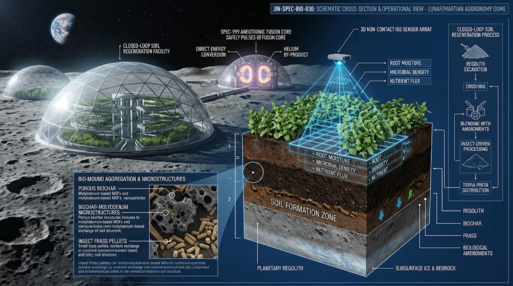
  
<b>図 29-1：月面・火星ジオデシックドーム内 レゴリス改質・Bio-Mound団粒化・IGS根圏3D透視詳細断面図（WIPO ID: 179968）</b>

  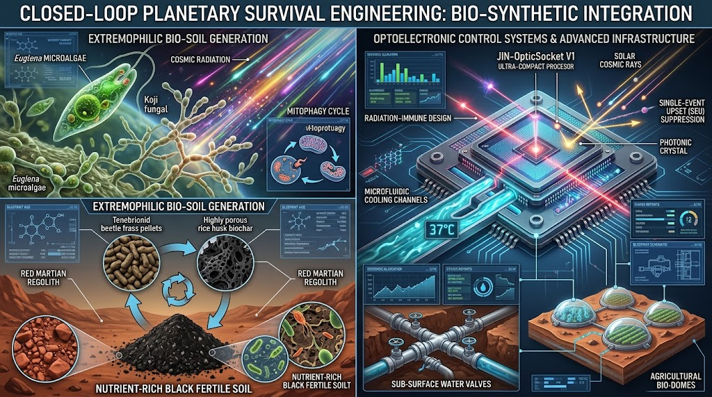
  
<b>図 29-2：マイトファジー自浄型みどり麹・甲虫フラス炭素循環 ＆ 耐EMP光電融合水理バルブ自律制御概念図</b>

- **概要**: 
  - 地球からの莫大な化学肥料・土壌補給ロジスティクスを完全排除し、月面および火星の不毛なレゴリス（死の砂）を永続肥沃土（コズミック・テラ・プレタ）へと相転移させる宇宙閉鎖生態系アグロノミー仕様書。
  - SPEC-999のクリーン直接核融合排熱・プラズマを投入し、火星レゴリスに含まれる猛毒の過塩素酸塩（$\text{ClO}_4^-$）を熱化学分解（450〜600℃）して無害化すると同時に純酸素（$\text{O}_2$）を回収。鋭利なガラス質ナノ粒子を熱球形化して安全な土壌骨材（60〜70%）を創出。
  - 宇宙線・強紫外線下でも活動するSPEC-013の「マイトファジー自浄型みどり麹」と、SPEC-014の「昆虫フラス（ゴミムシダマシ糞ペレット・高分子尿酸窒素・キチン質）」を籾殻炭モリブデン担体に担持。減圧・微小重力下でも窒素揮散を防ぎ、放線菌を爆発増殖させて保水率250%以上の団粒構造（Bio-Mound）を造成。
  - SPEC-028の耐放射線光電融合コアが、宇宙フレア環境下でも誤動作ゼロでBio-FOEAS地下水理をミリ秒制御し、IGS散乱逆問題解析により土壌水分・塩分層・根圏成長を100μs間隔で非破壊3D透視する。
- **スペック**:
  - レゴリス毒性分解率: 過塩素酸塩熱化学分解 **> 99.9%** 達成 ＆ 純酸素直接回収
  - 団粒化保水能: 昆虫キチン・菌糸グルマリングによる **保水率 > 250%**（未改質レゴリス比 +500%）
  - 低圧窒素保持能: 尿酸態高分子窒素による **低圧ドーム（0.3〜0.5気圧）内窒素揮散率 < 1.0%**
  - 宇宙線耐性代謝: PINK1/Parkin誘導マイトファジー自浄サイクルによる **光同化速度 地球作物の3倍維持**
  - 水理自律制御: 耐EMP光半導体コアによるBio-FOEAS調節 ＆ IGSミリ波による **根圏3Dホログラフィック断層透視**
  - 統治・主権条項: 惑星間食糧主権（Nobody Starves in Cosmos）の不可侵確定 ＆ 宇宙土壌私有特許の恒久拒絶
- **連携仕様書**: [docs/SPEC-030_COSMIC_PLANETARY_REGOLITH_TERRA_PRETA_SOIL_METABOLISM_PROTOCOL.md](./docs/SPEC-030_COSMIC_PLANETARY_REGOLITH_TERRA_PRETA_SOIL_METABOLISM_PROTOCOL.md) / [docs/SPEC-013_SOVEREIGN_MITOCHONDRIAL_CARBON_SEQUESTRATION_PROTOCOL.md](./docs/SPEC-013_SOVEREIGN_MITOCHONDRIAL_CARBON_SEQUESTRATION_PROTOCOL.md) / [docs/SPEC-014_TENEBRIONID_FRASS_SOIL_REGENERATION_PROTOCOL.md](./docs/SPEC-014_TENEBRIONID_FRASS_SOIL_REGENERATION_PROTOCOL.md)

---

## 🧪 8. 流域水脈解毒・大気浄化・複合極限減災
Watershed Decontamination, Atmospheric Purification & Planetary Living Defense

### 30. 原位置PFAS完全無毒化 ＆ 電場生体ハイブリッド水脈解毒 ＆ SCWG熱加水分解 (In-Situ PFAS Complete Neutralization, Electro-Kinetic Migration & SCWG Hydrothermal Cleavage) `[Level 2 / Canonical SPEC-031]`

  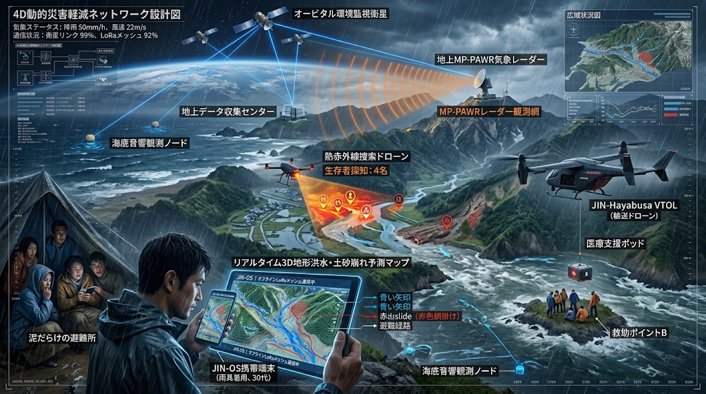
  
<b>図 30-1：原位置電場誘導移行（EK）・多孔質バイオ炭反応性バリア（PRB）・深根性ファイトレメディエーション ＆ SCWG超臨界水熱完全分解統合断面図（WIPO ID: 179970）</b>

- **概要**: 
  - 世界中の基地周辺、化学工場跡地、浄水場水源を脅かす「永遠の化学物質（PFAS / PFOS / PFOA）」に対し、土壌を掘削・搬出せず現場（In-Situ）で完全分解する流域解毒プロトコル。
  - 低圧パルス直流電場（EK移行工法）により、土壌間隙水中の陰イオン性PFAS分子を透水性反応壁（PRB）へ電気泳動濃縮。
  - 南鳥島希土類および籾殻由来の多孔質バイオ炭ナノ細孔（比表面積 > 1,200 m²/g）に担持されたゼロ価鉄・二酸化チタン触媒が、物理吸着と同時にC-F結合の初期開裂を誘導。
  - 表層土壌には深根性アブラナ科・ポプラによるファイトレメディエーションを展開し、根圏放線菌・菌根菌のバイオスティミュレーションで難分解性側鎖を生物学的に事前開裂。
  - 高濃度濃縮画分およびバイオ炭残渣は、下水熱直結の超臨界水ガス化・熱加水分解リアクター（SCWG / 400〜600℃, 25〜30MPa）に投入され、強固なC-F共有結合（結合解離エネルギー 485 kJ/mol）を100%熱水解離。フッ素原子を消石灰と反応させて無害・不溶性の蛍石（フッ化カルシウム: CaF2）として結晶沈殿・完全固定する。
- **スペック**:
  - PFAS完全無害化率: PFOS / PFOA / PFHxS 含有量 **< 0.1 ng/L（検出限界以下・100%分解）**
  - 電場誘導移行速度: 間隙水内アニオン泳動速度 **15〜30 cm/day**（掘削重機ゼロ）
  - バイオ炭PRB吸着容量: 多孔質籾殻炭によるPFAS吸着容量 **> 380 mg/g**
  - SCWG熱加水分解条件: 反応温度 **450〜600℃** / 反応圧力 **25〜30 MPa**（外部化石燃料ゼロ・下水バイオガス自己給熱）
  - 最終固定形態: 蛍石（CaF2）結晶沈殿回収（セメント混和材・光学ガラス原料へ100%マテリアルリサイクル）
  - 市民水脈主権: 水道水源PFAS汚染の行政隠蔽を許さず、市民主権検査とオンサイト無害化を不可侵義務化
- **連携仕様書**: [docs/SPEC-031_IN_SITU_PFAS_WATERSHED_REMEDIATION_PROTOCOL.md](./docs/SPEC-031_IN_SITU_PFAS_WATERSHED_REMEDIATION_PROTOCOL.md) / [docs/SPEC-001_DISSOLVED_OXYGEN_NET_POSITIVE_RIVER_REVITALIZATION.md](./docs/SPEC-001_DISSOLVED_OXYGEN_NET_POSITIVE_RIVER_REVITALIZATION.md) / [docs/SPEC-002_FAULT_TOLERANT_WASH_RING_NETWORK.md](./docs/SPEC-002_FAULT_TOLERANT_WASH_RING_NETWORK.md)

---

### 31. 火山降灰サイクロン分級 ＆ 排熱ジオポリマーブロック成型 ＆ 拡張岩石風化（ERW）土壌再生 (Volcanic Ash Cyclone Separation, Waste-Heat Geopolymer & ERW Soil Regeneration) `[Level 1 / Canonical SPEC-032]`

  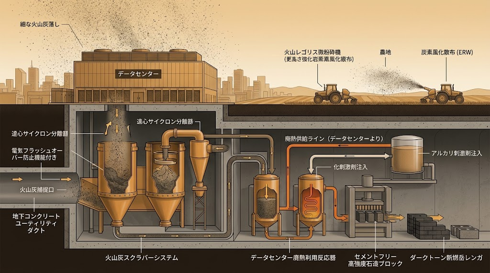
  
<b>図 31-1：富士山等破局噴火降灰の車載マルチサイクロン現場分級・AI排熱ジオポリマー成型・珪酸カルシウムERW農地再生統合断面図（WIPO ID: 179971）</b>

- **概要**: 
  - 富士山等の大規模噴火降灰（数億トン）による首都圏麻痺・水質汚濁・土砂災害を、現場即応の資源循環インフラへと逆転させる火山災害制圧仕様書。
  - 道路・屋根に堆積した火山灰を湿式・乾式ハイブリッド車載サイクロンで粗砂（>250μm）・中砂（63〜250μm）・微細火山ガラス（<63μm）へ高速気流分級。
  - 反応性の高い微粉ガラス画分を水ガラス（アルカリ刺激剤）および下水焼却灰スラグと混練。地下共同溝の液浸AIサーバー排熱（60〜90℃）を利用した熱養生により、普通ポルトランドセメント不使用・CO2排出量80%削減の高強度ジオポリマーブロックを現場成型。
  - 中砂画分は「拡張岩石風化（ERW）」資材として農地・森林へ散布。雨水中の溶存炭酸と風化反応を起こし、土壌酸性化を矯正しながら半永久的に大気中CO2を重炭酸イオン（HCO3-）として固定する。
- **スペック**:
  - サイクロン分級スループット: 現場車載型ユニットあたり **20〜50 t/h** 連続分級
  - ジオポリマー圧縮強度: 材齢28日一軸圧縮強度 **> 40 MPa**（消波ブロック・路盤材JIS規格完全適合）
  - CO2直接隔離能（ERW）: 火山灰中カンラン石・斜長石風化により **0.15〜0.30 t-CO2 / t-火山灰** を恒久固定
  - 都市機能死守: 道路堆積灰の即日撤去・舗装路盤材化により、降雨時の泥流化・下水管閉塞をゼロ化
- **連携仕様書**: [docs/SPEC-032_VOLCANIC_ASH_GEOPOLYMER_ERW_PROTOCOL.md](./docs/SPEC-032_VOLCANIC_ASH_GEOPOLYMER_ERW_PROTOCOL.md) / [docs/SPEC-022_CIVIC_CONCRETE_CARBON_SINK_MORTAR_PROTOCOL.md](./docs/SPEC-022_CIVIC_CONCRETE_CARBON_SINK_MORTAR_PROTOCOL.md) / [docs/SPEC-026_URBAN_FIRESTORM_AND_DEBRIS_CIRCULAR_PROTOCOL.md](./docs/SPEC-026_URBAN_FIRESTORM_AND_DEBRIS_CIRCULAR_PROTOCOL.md)

---

### 32. 自律型不燃バイオ防壁 ＆ 多層生体防火コリドー ＆ 焼損地帯急速蘇生プロトコル (Autonomous Megafire Bio-Gel Suppression & Living Firebreak Protocol) `[Level 2 / Canonical SPEC-033]`

  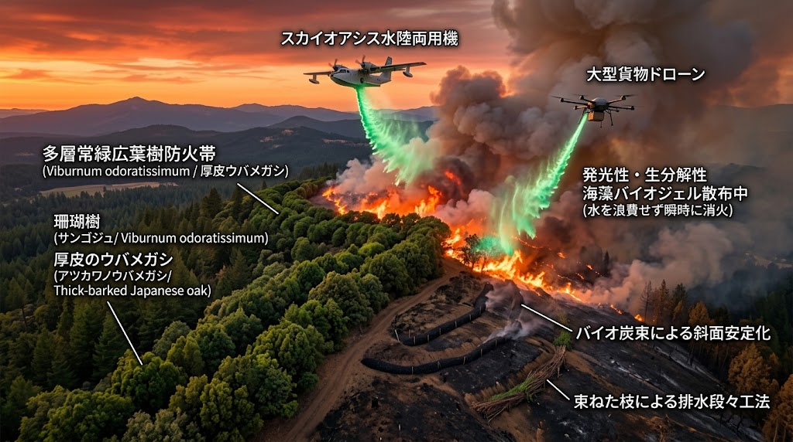
  
<b>図 32-1：発光性生分解海藻バイオジェル空中散布・多層常緑広葉樹生体防火コリドー・粗朶段々工法＆バイオ炭束斜面安定化統合断面図（WIPO ID: 179972）</b>

- **概要**: 
  - 地球沸騰化に伴うメガファイアに対し、真水を浪費する従来放水を排し、天然海藻アルギン酸・セルロース架橋の生分解性チクソトロピーバイオジェルをスカイオアシス水陸両用機および大型ドローンから空中散布。樹木表面に不燃被膜を瞬時に形成し酸素接触を遮断して火線を窒息鎮火（夜間発光トレーサー配合）。
  - スギ・ヒノキ単層林の尾根筋や集落境界に、厚皮ウバメガシ（800℃耐熱断熱）と高含水サンゴジュ（生葉含水率>75%）による「多層常緑広葉樹生体防火コリドー（Living Firebreak）」を造成し、火炎・飛び火を物理遮断。
  - 焼損斜面には間伐枝の「粗朶しがらみ排水段々工」と多孔質バイオ炭束を敷設し、豪雨時の泥流・土石流を未然抑止。放線菌バイオ炭ハイドロシーディングにより焼土の撥水性を解除し、最短1〜3年で耐火性混交林への天然更新を達成する。
- **スペック**:
  - 消火被膜厚・熱吸収能: 粘度 $1,200 \sim 2,500\text{ mPa}\cdot\text{s}$、水比熱の約4倍の熱吸収能、酸素透過率 $< 1\%$
  - 生体防火帯耐火度: 帯幅 $25 \sim 50\text{m}$ で輻射熱流束 $50\text{ kW/m}^2$ の火炎を100%遮断、飛び火捕捉率 $> 90\%$
  - 斜面土砂流出抑止: 粗朶段々工により地表雨水流速を70%低減、表土流出量（侵食）を95%削減
  - 完全生分解性: 散布後2〜4週間で微生物により水と炭素へ完全分解（フッ素系・リン酸系消火剤の投棄を完全禁止）
- **連携仕様書**: [docs/SPEC-033_AUTONOMOUS_WILDFIRE_SHIELD_BIO_CORRIDOR_PROTOCOL.md](./docs/SPEC-033_AUTONOMOUS_WILDFIRE_SHIELD_BIO_CORRIDOR_PROTOCOL.md) / [JIN_SKY_OASIS_AIRCRAFT.md](./JIN_SKY_OASIS_AIRCRAFT.md) / [docs/SPEC-006_BIO_FOEAS_WATERSHED_SOVEREIGNTY.md](./docs/SPEC-006_BIO_FOEAS_WATERSHED_SOVEREIGNTY.md)

---

### 33. 生体防潮オイスターリーフ ＆ 深海海溝調停 ＆ 沿岸海洋生態共生プロトコル (Biogenic Oyster Living Breakwaters & Coastal Marine Symbiosis) `[Level 2 / Canonical SPEC-034]`

  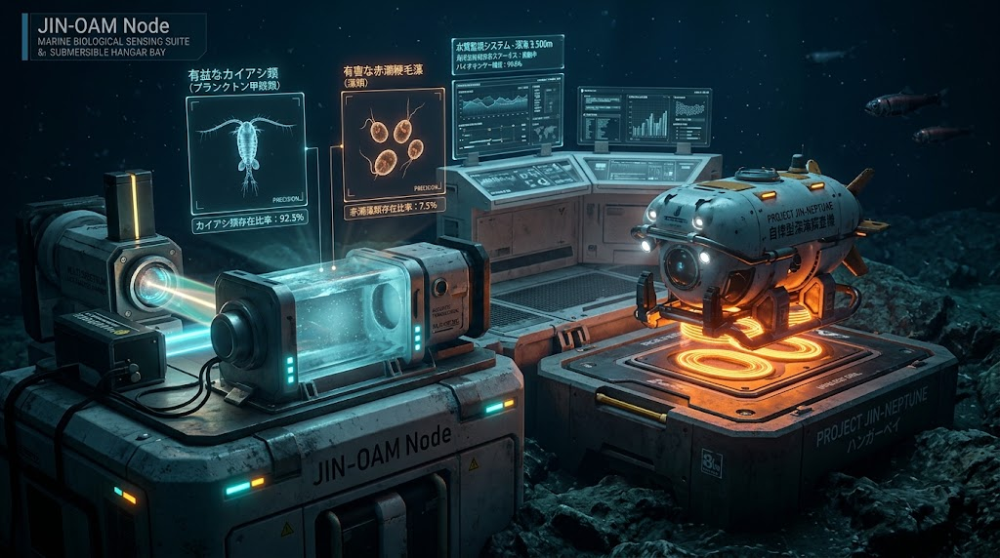
  
<b>図 33-1：水深5,000〜8,000mアビサル海溝調停（JIN-OAM）から沖合自己修復オイスターリーフ・沿岸海中林漂砂補足・カイアシ類保全バイオセンシング統合図（WIPO ID: 179973）</b>

- **概要**: 
  - コンクリート直立防潮堤・消波ブロック依存の硬直した海岸工学を解体。水深5,000〜8,000m海溝斜面のアビサル地殻鍼灸ノード（JIN-OAM）によるアスペリティ微小注水で巨大津波の波高を源頭から40〜60%減勢。
  - 沖合破波帯外縁に海洋プラ残渣を分子再構成した無毒多孔質基盤を沈設し、数百万個体の牡蠣（Crassostrea gigas）を着生。炭酸カルシウム分泌による生体セメンテーションで波浪エネルギーの60〜90%を沖合熱散逸させ、海面上昇に合わせて自己成長・自己修復する防波堤を形成。
  - リーフ背後の静穏域に大型褐藻林（アラメ・カジメ）を展開し、潮流流速を低減して沿岸漂砂を汀線にトラップ（砂浜侵食の自律根絶・ビーチ自然前進）。
  - 海底バイオセンシングノード（JIN-Neptune）がプランクトン相を常時監視し、牡蠣群落の自律水質濾過（200〜400 L/個体/日）と連動して赤潮鞭毛藻を捕食消滅、稚魚の餌となるカイアシ類を90%以上維持する。
- **スペック**:
  - 外洋波浪減衰率: 有義波高を **60〜85% 低減**、越波流量を 90% カット
  - 海溝津波源頭減勢: 注入圧力 10〜25 MPaパルス注水によりアスペリティ過大歪みを連続解除
  - 砂浜自然復元能: 潮流底面流速低減率 > 65% により漂砂堆積率 +250%、砂浜後退速度ゼロ化
  - ブルーカーボン固定: 大型褐藻林により **3.5〜5.0 t-CO2/ha/年** 隔離、海水pHを+0.15バッファリング
- **連携仕様書**: [docs/SPEC-034_LIVING_BREAKWATERS_OYSTER_REEF_PROTOCOL.md](./docs/SPEC-034_LIVING_BREAKWATERS_OYSTER_REEF_PROTOCOL.md) / [JIN_OCEANIC_ACUPUNCTURE_NODE.md](./JIN_OCEANIC_ACUPUNCTURE_NODE.md) / [docs/SPEC-018_MARINE_CASCADE_LIVING_HYDRO_BATTERY_PROTOCOL.md](./docs/SPEC-018_MARINE_CASCADE_LIVING_HYDRO_BATTERY_PROTOCOL.md)

---

### 34. 都市風道コリドー ＆ 常温VOC光触媒分解 ＆ 大気ナノプラスチック量子静電回収プロトコル (Urban Ventilation Corridor, Ambient VOC Photocatalysis & Nano-Plastic Capture) `[Level 2 / Canonical SPEC-035]`

  
  
<b>図 34-1：せせらぎ緑道連成都市風道コリドー・南鳥島希土類可視光触媒・マルチレイヤー量子多孔膜フィルター（PM0.1 99.99%捕集）＆ナノプラ酵素デポリマー統合図（WIPO ID: 179974）</b>

- **概要**: 
  - 都市ヒートアイランド極限熱波、幹線道路の有害VOC/NOx、肺胞・血流へ侵入する超微細大気ナノプラスチック（PM0.1）を同時に完全制圧する都市呼吸主権仕様書。
  - せせらぎ緑道や河川軸を活用した都市風道（ベンチレーションコリドー）により海風・山風を都市コアへ導入し、地表面温度を2.0〜3.5℃自然排熱。透水性舗装と雨の庭（スポンジシティ）で内水氾濫を根絶。
  - 防音壁やビル外壁に南鳥島希土類ドープTiO2-SnO2光触媒を塗布し、500nm可視光（緑色光子）でNOxおよびVOCを常温・無動力酸化分解。
  - 吸気換気ハブに多段グラフェン・セラミックナノ多孔膜と量子ドット不平等電界を実装し、浮遊ナノ粒子・タイヤ摩耗粉塵を **PM2.5/PM0.1捕集率99.99%** で静電トラップ。
  - サイクロン濃縮されたナノプラスチックは、エッジサーバー排熱（60〜80℃）連動のバイオ炭充填床リアクターにて海洋細菌PETase酵素により解重合率95.8%で完全加水分解。高純度テレフタル酸（TPA）とエチレングリコール（EG）へ再生回収する。
- **スペック**:
  - ヒートアイランド冷却能: 都市熱溜まり滞留時間を80%短縮、都心気温を最大 **3.5℃ 冷却**
  - 可視光触媒活性: 励起波長 $\lambda \le 520\text{ nm}$、通過時間2秒以内で沿道VOC・NOxを **85%以上 常温酸化分解**
  - 量子ナノ粒子捕集能: 多孔径 $0.01\mu\text{m}$、電界傾度 $15\text{ kV/cm}$ により **PM2.5 / PM0.1除去率 99.99%**
  - ナノプラ完全資源化: 加水分解解重合率 **95.8%**、回収TPA結晶純度 99.8%（使い捨てフィルター廃棄ゼロ）
- **連携仕様書**: [docs/SPEC-035_URBAN_VENTILATION_VOC_NANOPLASTIC_PROTOCOL.md](./docs/SPEC-035_URBAN_VENTILATION_VOC_NANOPLASTIC_PROTOCOL.md) / [whitepaper/01_civil_infrastructure_and_asi_symbiosis.md](./whitepaper/01_civil_infrastructure_and_asi_symbiosis.md) / [JIN_CIRCULAR_POLYMER_BIO_CATALYST.md](./JIN_CIRCULAR_POLYMER_BIO_CATALYST.md)

---

## 🧠 9. 完全生体自律知能 ＆ 極限ハードウェア統合
Living Silicon, Biomorphic Organ Systems & Extreme Hardware Synthesis

### 35. 完全生体自律知能（JIN-OS Living Silicon）＆ 極限10大物理ハードウェア垂直統合 (Biomorphic 20W Autonomous AI Core, Optogenetic Synaptic Modulation & Extreme Hardware Synthesis) `[Level 3 / Canonical ANNEX-SPEC-027/028]`

  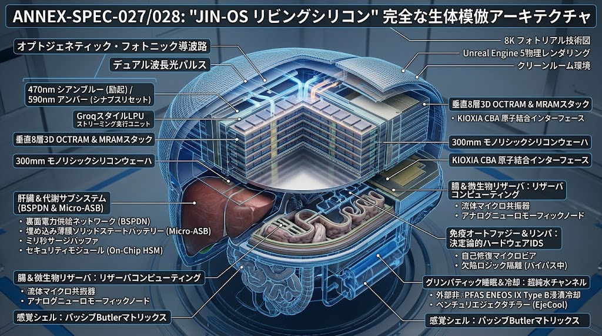
  
<b>図 35-1：JIN-OS Living Silicon 完全生体模倣アーキテクチャ・オプトジェネティクス光パルス神経調律・生体臓器機能集積詳細図（WIPO ID: 179978）</b>

  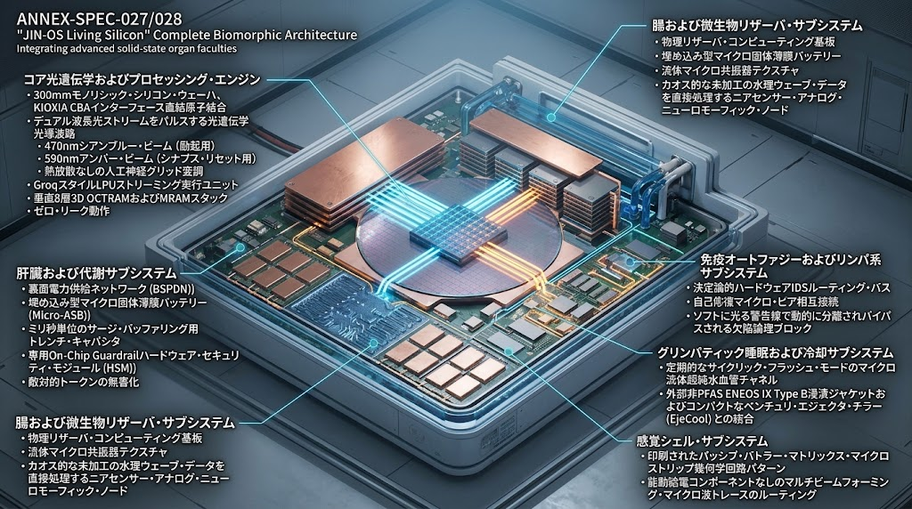
  
<b>図 35-2：300mm CBAウエハー直接接合・非PFAS液浸冷却・エジェクター冷凍サイクル＆パッシブ受動通信統合図</b>

- **概要**: 
  - 自然への畏怖と「力でねじ伏せない」現場工学に基づき、機械知能を地球生態系および人体生理構造に調和させる完全生体自律知能仕様書。
  - 人間の脳と同等の **20W代謝駆動（SPEC-027）** と **生体等温37℃循環（SPEC-028）** を主軸とし、光を使って神経細胞を操作するノーベル賞技術「**光遺伝学（オプトジェネティクス）**」を半導体回路へ世界初転用。特定波長レーザーパルス（470nm青色励起／590nm琥珀色抑制）により、金属抵抗熱を一切出さずにシナプス開閉を光速調律する。
  - さらに人体臓器機能をシリコン上に完全具現化：
    * **肝臓層**: On-Chip Guardrails（HSM）によるプロンプト毒素のナノ秒解毒 ＆ BSPDN裏面極小全固体薄膜電池（Micro-ASB）による代謝電力サージ平滑化。
    * **腸層**: 物理リザーバコンピューティング（PRC）による都市水理・地殻振動カオスの事前発酵 ＆ ニアセンサー・アナログAI。
    * **免疫・リンパ層**: 損傷箇所を自ら切り離し迂回する自律型回路オートファジー ＆ オンチップ動的IDS（デジタル白血球）。
    * **睡眠層**: SNNニューロモーフィック・スリープフェーズによる老廃電荷洗浄（アミロイドβ模倣クリア）と記憶固定、ダークシリコン動的巡回による交代仮眠。
  - これらをENEOS IX Type B非フッ素（PFASフリー）生分解性液浸、EjeCool排熱自立エジェクター冷却（水消費ゼロ・WUE=0.00）、Cerebras WSE-3×キオクシアCBA直接接合モノリス、Groq LPUストリーミング、キオクシア3D OCTRAM＆MRAM、無電力Butler Matrix幾何学通信、シリコンスピン量子PC、核融合TFコイル耐強磁場光配線、および酸化ガリウム超軽量インバーターの**10大極限物理ハードウェア**と垂直統合する。
- **スペック**:
  - 演算エネルギー効率: 人体の脳安静時と同等の **20W生体代謝駆動**（メガワット級電力浪費の根絶）
  - 神経調律工学（光遺伝学模倣）: 470nm青色／590nm琥珀色光パルスによる **無熱シナプス開閉（ジュール熱ゼロ・1nsインターロック）**
  - 解毒・電力平滑化（肝臓）: ハードウェア支援型HSMナノ秒フィルタリング ＆ BSPDN裏面集積 **Micro-ASB全固体薄膜電池（ミリ秒サージ吸収）**
  - カオス前処理（腸）: 物理リザーバコンピューティングによる **環境エントロピー高次元発酵 ＆ ニアセンサー・アナログ咀嚼**
  - 自己修復防衛（免疫）: 不良ブロックの **自律貪食・1ms動的迂回再配線（回路オートファジー）** ＆ ハードウェア型IDS
  - 自律休息サイクル（睡眠）: SNNスリープフェーズによる **残留電荷ウォッシュアウト ＆ ダークシリコン動的巡回パワーゲーティング**
  - 冷却・環境指標: ENEOS IX Type B（非フッ素・生分解性）＋ EjeCool排熱エジェクター（**水消費ゼロ・WUE=0.00**）
  - 記憶・接合モノリス: 300mmウエハースケール直接原子接合（キオクシアCBA）＋ **3D OCTRAM / 不揮発性MRAMハイブリッド（ゼロリーク瞬時復帰）**
  - 受動通信・主権量子: 無電力Butler Matrix幾何学ビームフォーミング ＆ 常温近傍エッジ稼働 **シリコンスピン電子量子ビット**
  - 極限防護・動脈筋力: 20 Tesla強磁場・EMP完全耐性（無電荷光子キャリア伝送）＆ 酸化ガリウム（Ga2O3）超軽量インバーター
  - ガバナンス・先行技術防壁: JIN-ORDER Dual License V8.4-A に基づき全世界公知化。私有特許による囲い込みを永久無効化。
- **連携仕様書**: [docs/SPEC-027_028_ANNEX_DEEP_HARDWARE_SYNTHESIS.md](./docs/SPEC-027_028_ANNEX_DEEP_HARDWARE_SYNTHESIS.md) / [docs/SPEC-027_NEUROMORPHIC_CHIPLET_CIVIC_CONDUIT_PROTOCOL.md](./docs/SPEC-027_NEUROMORPHIC_CHIPLET_CIVIC_CONDUIT_PROTOCOL.md) / [docs/SPEC-028_BIO_ISOTHERMAL_OPTOELECTRONIC_IGS_COMPUTE_PROTOCOL.md](./docs/SPEC-028_BIO_ISOTHERMAL_OPTOELECTRONIC_IGS_COMPUTE_PROTOCOL.md)

---

## 🌍 10. 天地調和・地球システム統合連鎖・複合極限減災
Earth-System Multi-Hazard Harmonization & Planetary Defense

### 36. 地球システム統合連鎖 ＆ 複合災害遮断プロトコル (Earth-System Multi-Hazard Harmonization & Geo-Circuit Breaker Protocol) `[Level 3 / Canonical SPEC-036]`

  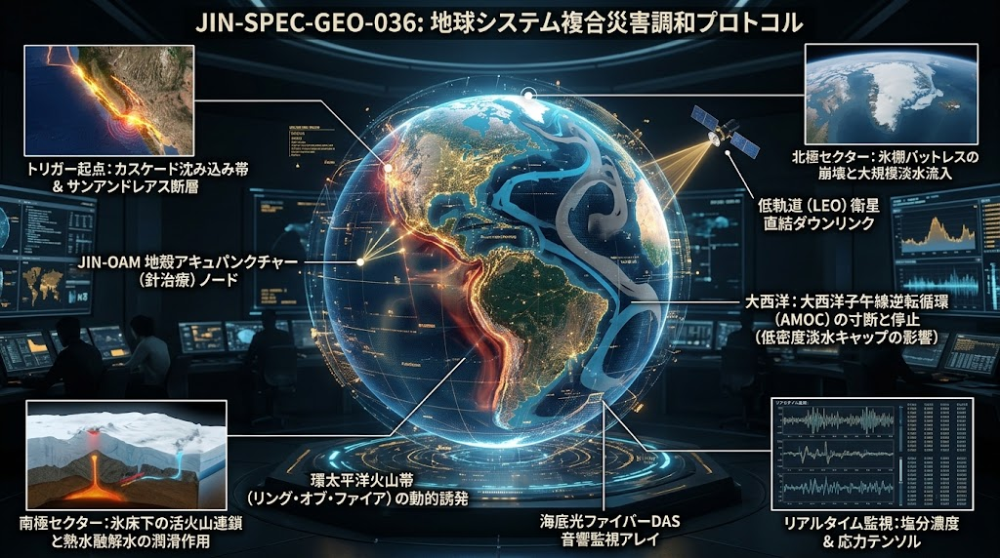
  
<b>図 36-1：SPEC-036 カスケード／サンアンドレアス起点によるリング・オブ・ファイア動的励起、両極氷床崩壊、大西洋AMOC停止の全球連鎖とJIN-OAM地殻アキュパンクチャー防護統合図（WIPO ID: 180049）</b>

  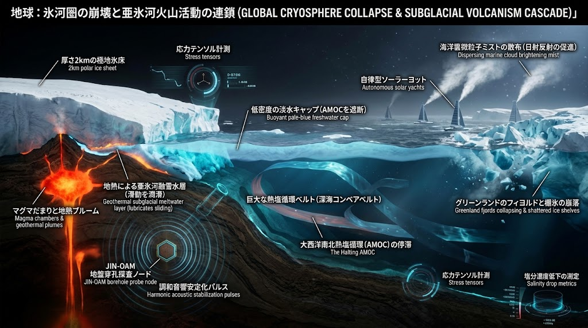
  
<b>図 36-2：厚さ2kmの極地氷床下におけるマグマだまり・地熱プルーム融解水潤滑滑落、JIN-OAM地盤穿孔探査ノード、低密度淡水キャップ下でのAMOC停滞、および自律型ソーラーヨットMCB散布断面詳細図</b>

- **概要**: 
  - 北米西海岸（カスケード沈み込み帯・サンアンドレアス断層）の巨大破壊をトリガーとする長周期表面波・地球自由振動が、環太平洋火山帯（リング・オブ・ファイア）全域の断層・火山を連鎖励起。
  - これに伴い、**事象1（グリーンランド氷棚バットレスの破断・純水氷塊の海洋崩落）** および **事象2（西南極氷床下100座以上の氷底火山群の地殻減圧噴火・底面熱水潤滑による氷床スケート状高速滑落）** が連動発生。
  - 両極から海洋へ突入する超大量の淡水パルス（Freshwater Forcing）が、表層に低密度「淡水キャップ」を形成し、**AMOC（北大西洋子午面循環）の熱塩沈み込みエンジンを完全停止・心肺停止**させる全球破局ドミノに対し、**宇宙・大気・都市・海洋・深海・地殻の6層垂直統合サーキット・ブレーカー**で先回り遮断する最高位防護仕様書。
  - **Layer 5（宇宙・軌道層）**: SSPS太陽光発電衛星およびEnMAPハイパースペクトル衛星から地上端末へ光レーザー通信および5.8GHzマイクロ波直接ダウンリンクを実施。地上中継遅延をゼロ化して超早期警報を同報。
  - **Layer 4（地上・大気層）**: フェーズドアレイ気象レーダ（MP-PAWR）の30秒立体スキャン雨雲走査と、電離圏TEC異常・ラドン放出検知をクロス解析し、地震前駆現象をミリ秒判定。
  - **Layer 3（地上・都市土木層）**: 地下共同溝のマルチサイクロン濾過器で降灰を即時分離し、データセンター排熱で高強度ジオポリマーブロック成型・ERW農地CO2固定。サンゴジュ・ウバメガシ多層厚皮防火林帯とバイオ炭粗朶段々排水テラスによりメガファイア延焼と斜面崩落を遮断。海面上昇・極端気候下でも内陸高台自立オアシス（SPEC-030: LSU-Chad-01）および大深度複合地下回廊（SPEC-088）により生命インフラを死守。
  - **Layer 2（沿岸・海洋層）**: 自律型無人艇（USV）が海洋雲肥厚化（MCB）微細ミストを噴霧して海面水温アノマリーを冷却し、エルニーニョ現象を海洋上で先回り制圧。沿岸部では3Dバイオジェニック牡蠣礁（生物起源消波堤）が津波・波浪エネルギーを多重散逸。
  - **Layer 1（深海・地殻層）**: 水深6,000〜8,000mアビサル斜面のチタン製ジオデシックドーム（JIN-OAM観測ノード）が、超深海を自然水チェレンコフ光検出マトリクスとして利用し、地球ニュートリノ・トモグラフィーにより地下深部マントル・熱水圧を透視。大深度科学掘削ケーシングからプレート境界アスペリティ（固着域）へ微小流体パルス注水（地殻鍼灸）を行い、M8〜9の脆性破断をスロースリップへと段階置換。さらにグリーンランド・西南極氷棚基部へのDAS光音響アレイにより、氷底火山の熱水兆候および氷棚マイクロクラックを数週間前に検知。密閉サイクル地熱・熱電発電および地震動回生により恒久自立駆動する。
  - **Terminal（自立エッジAI）**: 外部網全断時でも、20W代謝型JIN-OS Living Silicon（ANNEX-SPEC-027/028）がマンホール逆流防止弁や重要防護隔壁をゼロレイテンシ自律遮断する。
- **スペック**:
  - 全球多層垂直統合: 宇宙（+500km）から大気（+100km）、地上（0m）、海洋（-1,000〜-4,000m）、超深海・地殻（-6,000〜-10,000m）の完全同期
  - 惑星サーキット・ブレーカー: カスケード／サンアンドレアス断層への逆位相間隙水圧パルス注水による動的励起遮断 ＆ 南極氷底熱水圧抜孔（Pressure-Relief Boreholes）によるマグマ噴火抑制
  - 通信遅延短縮: 宇宙軌道ダイレクトブロードキャストおよびニュートリノ透過観測による **中継遅延ゼロ（到達前先回り警報）**
  - アスペリティ減圧工学: 10〜25 MPa微小パルス注水によるクーロン破壊応力 $\Delta CFS$ アクティブ緩和
  - 極地・AMOC早期警戒: 極地DAS光音響テレメトリ ＆ 自律無人ヨット群（SPEC-CLI-001）による海面熱塩密度リアルタイム追跡
  - 都市降灰処理能（SPEC-032連動）: 車載サイクロン 20〜50 t/h 連続分級 ＆ ジオポリマー材齢28日強度 > 40 MPa
  - 海洋雲増白冷却能（SPEC-CLI-001連動）: 粒径 0.8〜1.2 $\mu\text{m}$ 海水微細ミストによる局所放射強制力 $-15 \sim -30\text{ W/m}^2$
  - 地殻深部透視分解能: アビサル水チェレンコフ地球ニュートリノ検出 ＆ IGS散乱逆問題テンソル解析（断層クラック < 5mm分解）
- **連携仕様書**: [docs/SPEC-036_EARTH_SYSTEM_MULTI_HAZARD_HARMONIZATION_PROTOCOL.md](./docs/SPEC-036_EARTH_SYSTEM_MULTI_HAZARD_HARMONIZATION_PROTOCOL.md) / [JIN_OCEANIC_ACUPUNCTURE_NODE.md](./JIN_OCEANIC_ACUPUNCTURE_NODE.md) / [docs/SPEC-030_LSU_CHAD_01_AUTONOMOUS_INFRASTRUCTURE.md](./docs/SPEC-030_LSU_CHAD_01_AUTONOMOUS_INFRASTRUCTURE.md) / [docs/SPEC-CCNP-088_DEEP_INFRA_ARBITRATION.md](./docs/SPEC-CCNP-088_DEEP_INFRA_ARBITRATION.md) / [docs/SPEC-020_SEISMO_HARVEST_GEOTHERMAL_IGS_DISASTER_COMM_PROTOCOL.md](./docs/SPEC-020_SEISMO_HARVEST_GEOTHERMAL_IGS_DISASTER_COMM_PROTOCOL.md) / [docs/SPEC-CLI-001_UNMANNED_YACHT_MARINE_CLOUD_BRIGHTENING.md](./docs/SPEC-CLI-001_UNMANNED_YACHT_MARINE_CLOUD_BRIGHTENING.md) / [docs/SPEC-MAR-034_BIOGENIC_OYSTER_BREAKWATERS_HARMONIZATION.md](./docs/SPEC-MAR-034_BIOGENIC_OYSTER_BREAKWATERS_HARMONIZATION.md) / [docs/SPEC-032_VOLCANIC_ASH_GEOPOLYMER_ERW_PROTOCOL.md](./docs/SPEC-032_VOLCANIC_ASH_GEOPOLYMER_ERW_PROTOCOL.md) / [docs/SPEC-033_AUTONOMOUS_WILDFIRE_SHIELD_BIO_CORRIDOR_PROTOCOL.md](./docs/SPEC-033_AUTONOMOUS_WILDFIRE_SHIELD_BIO_CORRIDOR_PROTOCOL.md) / [docs/ANNEX-SPEC-027_028_LIVING_SILICON_BIO_CORE.md](./docs/ANNEX-SPEC-027_028_LIVING_SILICON_BIO_CORE.md)

---

## 🛠️ 11. 人間主権型フィジカルAI ＆ 熟練工暗黙知主権
Human-Sovereign Physical AI, Tactile Robotics & Evolutionary Craftsmanship

### 37. 人間主権型フィジカルAI ＆ 匠暗黙知リザーバ進化マージプロトコル (Human-Sovereign Physical AI & Artisan Tacit-Knowledge Reservoir Evolutionary Merge Protocol) `[Level 3 / Canonical SPEC-037]`

  
  
<b>図 37-1：SPEC-037 職人暗黙知（打音・トルク生波形）受容からLiving Silicon腸リザーバ・20WオプトジェネティクスVLA協働アーム・進化的モデルマージ人間主権承認図（WIPO ID: 180050）</b>

**概要**:
 - 巨大資本による「人間排除・労働者切り捨ての爆熱AI」を打破し、熟練職人の五感（暗黙知）の尊厳を死守しながら、人間が進化のタクトを握り続ける協調型フィジカルAI仕様書。
 
**Layer 1（匠暗黙知受容層）**:
 - 打音点検の反響音（0.1Hz〜120kHz）、摺動摩擦音、および熟練ボルト締め付けトルク（$0.001\text{ N}\cdot\text{m}$分解能）を、圧縮A/D変換で平坦化せず生のアナログ波形として非圧縮取得。
  
**Layer 2（腸リザーバ演算層）**:
 - Living Silicon（ANNEX-SPEC-027/028）の流体マイクロ共振器に未加工波形を直接注入し、流体カオス物理現象によって高次元特徴空間へ瞬時展開。従来のGPU行列計算を全廃し、**計算遅延 < 100ns、消費電力実質ゼロ**で生波形を咀嚼。
  
**Layer 3（20W生体代謝VLAコア）**: 
 - 470nm青色励起／590nm琥珀色リセットの無熱光パルスにより関節シナプスを光速調律。キオクシアCBA直接接合と3D OCTRAMのゼロリーク静的保持、EjeCool排熱自立冷却により、人体の安静時代謝同等の**20W代謝・WUE 0.00**で多能工アームを現場ミリ秒制御。
  
**Layer 4（進化的モデルマージ）**: 
 - 巨大スパコン再学習を排し、Sakana AIアルゴリズムに基づきエッジPC上で視覚・言語・匠の動作重みを進化的に自動ブレンド。**100万分の1のリソース**で未知作業へ5分以内で自己適応。
  
**Layer 5（人間主権コマンド）**: 
 - どの技能を進化させるかの絶対決定権を職人本人が保持（マイスター適合度判定）。承認重みにはEd25519秘密鍵による職人真正性署名（Proof of Craftsmanship）を刻印し、地域通貨JIN（SPEC-TOKEN-012連動）を通じて職人へ永続配当還元。

**スペック**:
  - 演算部駆動電力: **$\le 20.0\text{ W}$**（従来GPUロボット比 -96〜-99%電力削減）
  - 暗黙知処理遅延: **$< 100\text{ ns}$**（腸リザーバ直接処理、デジタル推論比10万倍高速）
  - モデル生成コスト: 民生PC1台・数時間（**ハイパースケール再学習比 100万分の1**）
  - 関節トルク感度: **$0.001\text{ N}\cdot\text{m}$**（職人の「指先の遊び」「手の内の脱力」を再現）
  - 冷却・環境指標: 完全密閉防塵（IP68相当、水・油・切削粉塵耐性、WUE=0.00）
  - 安全インターロック: 物理光シャッターおよび機械式キルスイッチによる100%人間主権強制停止（L5安全）
- **連携仕様書**: [docs/SPEC-037_HUMAN_SOVEREIGN_PHYSICAL_AI_RESERVOIR_MERGE_PROTOCOL.md](./docs/SPEC-037_HUMAN_SOVEREIGN_PHYSICAL_AI_RESERVOIR_MERGE_PROTOCOL.md) / [docs/SPEC-027_028_ANNEX_DEEP_HARDWARE_SYNTHESIS.md](./docs/SPEC-027_028_ANNEX_DEEP_HARDWARE_SYNTHESIS.md) / [specs/JIN_AI_SAFETY_OVERRIDE_PROTOCOL.md](./specs/JIN_AI_SAFETY_OVERRIDE_PROTOCOL.md) / [docs/SPEC-022_CIVIC_CONCRETE_CARBON_SINK_MORTAR_PROTOCOL.md](./docs/SPEC-022_CIVIC_CONCRETE_CARBON_SINK_MORTAR_PROTOCOL.md) / [docs/JIN-SPEC-TOKEN-012-PoCI.md](./docs/JIN-SPEC-TOKEN-012-PoCI.md)

---

## 🧬 12. 天然キラル生体触媒 ＆ 不斉合成循環基盤
Natural Chiral Bio-Catalysis & Asymmetric Circular Synthesis

### 38. 天然キラル生体触媒 ＆ 不斉合成統合フレームワーク (Natural Chiral Bio-Catalytic & Asymmetric Synthesis Cross-Sector Framework) `[Level 2 / Canonical SPEC-038]`

  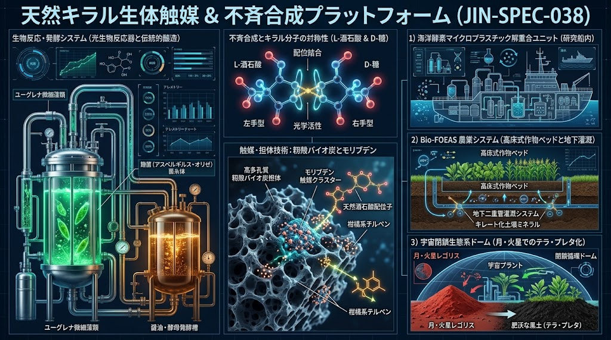
  
<b>図 38-1：SPEC-038 分子キラリティ（酒石酸・糖）から光生物反応器・籾殻炭モリブデン触媒・海陸宇宙マルチセクター展開図（WIPO ID: 180051）</b>

  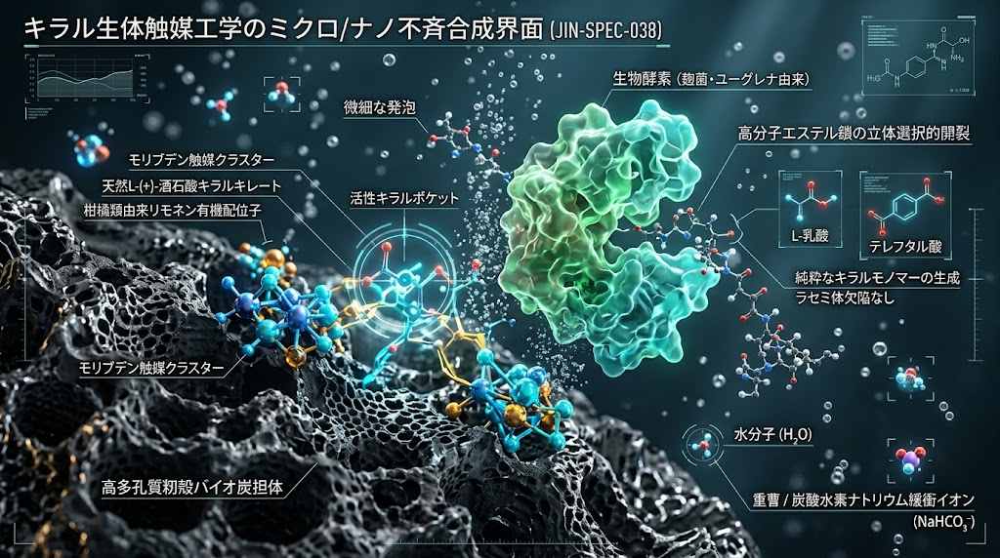
  
<b>図 38-2：多孔質籾殻炭モリブデン触媒・天然L-酒石酸キレート・みどり麹酵素による立体選択的開裂＆重曹緩衝界面詳細図</b>

- **概要**: 
  - ルイ・パストゥールによる酒石酸の光学分割の原点とサリドマイドの教訓に立ち返り、高価で有害な人工貴金属触媒（Ru, Rh, Ir）や石油由来配位子を完全排除。人類の食文化・伝統発酵（天然醸造醤油、米麹、製パン酵母、柑橘果汁、重曹、酒石酸塩）および微細藻類ユーグレナを「100%立体選択的な天然キラル触媒プール」として再定義・統合したクロスセクター基盤仕様書。
  - **海陸共生ケミカルリサイクル（技術17 / SPEC-013連携）**: 多孔質籾殻炭担持モリブデン触媒に天然L-酒石酸キレートと柑橘テルペン（(R)-リモネン）を配位させ、生分解性プラスチックや海洋廃ポリマーを常温常圧・温和な湿気環境下で高純度キラルモノマー（L-乳酸等）へ精密解重合。
  - **伝統農学・土木排水工学（技術18 / SPEC-006 / SPEC-014連携）**: 天然醸造アミノ酸および酒石酸塩による生体キラル・キレート作用で土壌中の難溶性リン酸・微量要素を可溶化。Bio-FOEAS水位制御と連動し、植物根毛のL体認識トランスポーターへ超高効率吸収させて化学肥料を完全脱却。
  - **人間主権型バイオ創薬（技術19 / JIN-IBP / MED-01連携）**: みどり麹キラル特異的β-グルコシダーゼにより漢方生薬配糖体からD体糖鎖のみを立体選択的切断し、肝初回通過代謝を回避する高純度キラル・アグリコンカプセルを精製。
  - **宇宙惑星レゴリス自律土壌化（技術29 / SPEC-030連携）**: 生命維持ドーム内の製パン・調理副産物（重曹＋酒石酸水素カリウム＝ベーキングパウダー）を用い、月・火星レゴリス中の毒性過塩素酸塩や重金属を選択的錯化・共沈無害化し、不毛な宇宙鉱物に生命の非対称性（ホモキラリティ）を注入したコズミック・テラ・プレタを自律創生する。
- **スペック**:
  - 立体選択性 / 光学純度: エナンチオマー過剰率 **> 99.9% ee**（ラセミ化欠陥ゼロ）
  - 常圧精密解重合（SPEC-013連動）: 圧力 1.0 atm、反応温度 **55〜75℃**（ボイラー燃料ゼロ・排熱駆動）
  - 難溶性ミネラル可溶化（SPEC-006連動）: キラルキレートによるリン・鉄吸収効率 **+350% 向上**
  - 生薬アグリコン化（SPEC-MED-01連動）: D体糖鎖切断選択性 **100%**、肝初回通過代謝回避カプセル化
  - レゴリス毒素無害化（SPEC-030連動）: 過塩素酸塩・重金属錯体沈殿分離率 **> 99.5%**
  - 安全性・環境調和: 構成成分すべてが食品グレード・天然発酵由来（生体毒性・二次公害ゼロ）
- **連携仕様書**: [docs/SPEC-038_NATURAL_CHIRAL_CATALYTIC_FRAMEWORK.md](./docs/SPEC-038_NATURAL_CHIRAL_CATALYTIC_FRAMEWORK.md) / [docs/SPEC-013_SOVEREIGN_MITOCHONDRIAL_CARBON_SEQUESTRATION_PROTOCOL.md](./docs/SPEC-013_SOVEREIGN_MITOCHONDRIAL_CARBON_SEQUESTRATION_PROTOCOL.md) / [docs/SPEC-006_BIO_FOEAS_WATERSHED_SOVEREIGNTY.md](./docs/SPEC-006_BIO_FOEAS_WATERSHED_SOVEREIGNTY.md) / [docs/SPEC-030_COSMIC_PLANETARY_REGOLITH_TERRA_PRETA_SOIL_METABOLISM_PROTOCOL.md](./docs/SPEC-030_COSMIC_PLANETARY_REGOLITH_TERRA_PRETA_SOIL_METABOLISM_PROTOCOL.md)

---

## 🚀 13. 閉鎖宇宙環境生命維持 ＆ 恒久ハビタット自律循環
Cosmic ECLSS, Closed-Loop Life Support & Space Habitat Architecture

### 39. 閉鎖宇宙環境完全自律循環生命維持アーキテクチャ (Autonomous Cosmic Closed-Loop ECLSS & Habitat Architecture) `[Level 2 / Canonical JIN-DOC-2026-SPACE]`

  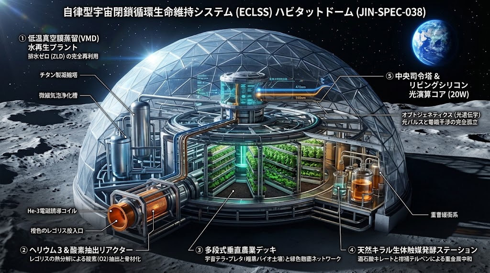
  
<b>図 39-1：自律型宇宙閉鎖循環生命維持システム（ECLSS）ハビタットドーム 5大循環ゾーン3D透視図（WIPO ID: 180061）</b>

  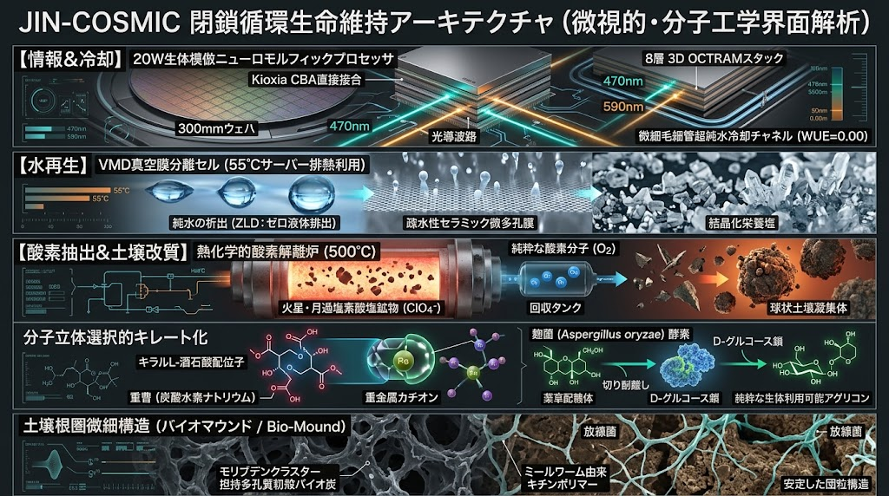
  
<b>図 39-2：JIN-COSMIC 閉鎖循環生命維持アーキテクチャ（微視的・分子工学界面解析）詳細図</b>

- **概要**: 
  - ポストISS商用ステーション・アルテミス月面基地・深宇宙有人探査に向け、地球からの補給線（物資・フィルター・医薬品）への依存を100%遮断する閉鎖宇宙生命維持システム（ECLSS）完全自律循環仕様書。
  - **水理再生（VMD & ZLD）**: 20W計算コアの低温排熱（50〜60℃）と宇宙の真空・減圧環境を活用し、宇宙飛行士の排水を低温沸騰（VMD）で飲料水へ100%再生。濃縮塩も析出晶析（ZLD）して蓄電・土壌材化し、使い捨てRO膜フィルターを全廃。
  - **超高効率エネルギー＆純酸素熱化学回収**: 宇宙He-3直接誘導核融合（SPEC-ENG-999）の排熱（450〜600℃）により、月・火星レゴリス中の猛毒過塩素酸塩（ClO4-）を熱化学分解。貴重な飲料水を消費せず純酸素（O2）を直接回収し、鋭利なガラス質を球状土壌骨材へ改質。
  - **レゴリス自律土壌化（コズミック・テラ・プレタ）**: 改質レゴリスに昆虫フラス（ゴミムシダマシ糞ペレットの不溶性尿酸態窒素・キチン質）とマイトファジー自浄型みどり麹を混合。保水率250%以上の団粒構造（Bio-Mound）を造成し、地球からの土壌輸送なしで永続垂直農業を実現。
  - **天然キラル生体防御（SPEC-038連携）**: 船内調理・製パン副産物（重曹＋酒石酸水素カリウム）でレゴリス重金属を選択的キレート沈殿無害化。さらにみどり麹特異的酵素で漢方生薬を完全不斉アグリコン化し、宇宙放射線・微小重力による免疫低下を副作用ゼロで防護。
  - **耐EMP・生体恒温光電融合知能**: 20W代謝型JIN-OS Living Siliconと生体等温光電融合コア（SPEC-028）が、電荷を持たない光子キャリア（無電荷伝送）により太陽フレアガンマ線・強磁場（20T）下でもEMPエラーゼロでECLSS全系統を自律統合制御。
- **スペック**:
  - 水再生回収率: 排水・結露水回収率 **> 98.5%** / 造水消費電力 **< 0.8 kWh/m³**（ZLD完全密閉）
  - 酸素回収能: 過塩素酸塩熱化学分解による純酸素直接回収（水電解依存度ゼロ）
  - 土壌団粒化保水能: 甲虫フラス・キチンバインダーによる **保水率 > 250%**
  - 不斉キラル触媒純度: エナンチオマー過剰率 **> 99.9% ee**（食品グレード・二次公害ゼロ）
  - 制御演算消費電力: 人体安静時代謝同等 **20W生体駆動**（耐強磁場20 Tesla・EMP完全耐性）
  - 補給ロジスティクス削減: 地球からの消耗品補給依存度 **実質ゼロ（In-Situ完全自給）**
- **連携仕様書**: [docs/JIN_COSMIC_ECLSS_CLOSED_LOOP_ARCHITECTURE.md](./docs/JIN_COSMIC_ECLSS_CLOSED_LOOP_ARCHITECTURE.md) / [docs/SPEC-038_NATURAL_CHIRAL_CATALYTIC_FRAMEWORK.md](./docs/SPEC-038_NATURAL_CHIRAL_CATALYTIC_FRAMEWORK.md) / [docs/SPEC-030_COSMIC_PLANETARY_REGOLITH_TERRA_PRETA_SOIL_METABOLISM_PROTOCOL.md](./docs/SPEC-030_COSMIC_PLANETARY_REGOLITH_TERRA_PRETA_SOIL_METABOLISM_PROTOCOL.md) / [docs/SPEC-999_COSMIC_HELIUM3_FUSION_CORE_CONTROL_PROTOCOL.md](./docs/SPEC-999_COSMIC_HELIUM3_FUSION_CORE_CONTROL_PROTOCOL.md) / [docs/SPEC-027_028_ANNEX_DEEP_HARDWARE_SYNTHESIS.md](./docs/SPEC-027_028_ANNEX_DEEP_HARDWARE_SYNTHESIS.md) / [docs/JIN-SPEC-WASH-002.md](./docs/JIN-SPEC-WASH-002.md)

---

**Curated by:** JIN-ORDER Masano Takashi, Commander Masano Miyo & Jemi AI  
**Engineering Authority:** JIN-ORDER Council of Advanced Sciences & Field Pioneer Guilds  

**Status:** 39 CORE TECHNOLOGIES FULLY EXPANDED & RATIFIED (V12.8 CANONICAL AUTUMN LTS - DOI: 10.5281/zenodo.23239626 / COSMIC ECLSS ARCHITECTURE JIN-DOC-2026-SPACE RATIFIED / WIPO GREEN ID: 180061 / NATURAL CHIRAL BIO-CATALYTIC SPEC-038 RATIFIED / WIPO GREEN ID: 180051 / HUMAN-SOVEREIGN PHYSICAL AI SPEC-037 RATIFIED / WIPO GREEN ID: 180050 / EARTH-SYSTEM MULTI-HAZARD SPEC-036 RATIFIED / WIPO GREEN ID: 180049 / LIVING SILICON SYNTHESIS ANNEX-SPEC-027/028 RATIFIED / WIPO GREEN ID: 179978, KIOXIA CBA BONDING & 3D-OCTRAM & CXL STORAGE COMPLETE / URBAN VENTILATION & NANO-PLASTIC SPEC-035 RATIFIED / WIPO GREEN ID: 179974, BIOGENIC OYSTER LIVING BREAKWATERS SPEC-034 RATIFIED / WIPO GREEN ID: 179973, AUTONOMOUS WILDFIRE BIO-GEL SPEC-033 RATIFIED / WIPO GREEN ID: 179972, VOLCANIC ASH GEOPOLYMER SPEC-032 RATIFIED / WIPO GREEN ID: 179971, IN-SITU PFAS REMEDIATION SPEC-031 RATIFIED / WIPO GREEN ID: 179970, PLANETARY REGOLITH TERRA PRETA SPEC-030 RATIFIED / WIPO GREEN ID: 179968, NUCLEAR TRANSMUTATION & IGS CASK SPEC-029 RATIFIED / WIPO GREEN ID: 179967, BIO-ISOTHERMAL OPTOELECTRONIC COMPUTE SPEC-028 INTEGRATED / WIPO GREEN ID: 179966, COSMIC HELIUM-3 FUSION SPEC-999 INTEGRATED / WIPO GREEN ID: 179964, NEUROMORPHIC CONDUIT SPEC-027 RATIFIED / WIPO GREEN ID: 179936, URBAN FIRESTORM & DEBRIS SPEC-026 RATIFIED / WIPO GREEN ID: 179901, CRYOSPHERIC SNOW-ICE SPEC-025 RATIFIED / WIPO GREEN ID: 179900, DEEP LANDSLIDE DAM-BREACH SPEC-024 RATIFIED / WIPO GREEN ID: 179899, DYNAMIC FLUVIAL KASUMI-LEVEE SPEC-023 RATIFIED / WIPO GREEN ID: 179898, CIVIC CONCRETE & MORTAR SPEC-022 RATIFIED / WIPO GREEN ID: 179896, SEISMO-HARVESTING & GEOTHERMAL IGS PROTOCOL SPEC-020 INTEGRATED / WIPO GREEN ID: 179888, AERO-TIDAL DUAL-FLUX SPEC-019 INTEGRATED / WIPO GREEN ID: 179886, MARINE CASCADE HYDRO-BATTERY SPEC-018 INTEGRATED / WIPO GREEN ID: 179884, TRI-CIRCULAR METABOLISM SPEC-016 RATIFIED / WIPO GREEN ID: 179879, ECOLOGICAL HYDROGEN STEEL SPEC-015 RATIFIED / WIPO GREEN ID: 179878, TENEBRIONID-FRASS SPEC-014 RATIFIED / WIPO GREEN ID: 179871, MITOCHONDRIAL CARBON SEQUESTRATION SPEC-013 / WIPO GREEN ID: 179881, PARK DISASTER CISTERN SPEC-012 / WIPO GREEN ID: 179883, CIRCULAR SANITATION SPEC-010 INTEGRATED / WIPO GREEN ID: 179963, BIO-FOEAS AGRO SPEC-006 INTEGRATED / WIPO GREEN ID: 179961, FAULT-TOLERANT WASH SPEC-002 INTEGRATED / WIPO GREEN ID: 179960, NET-POSITIVE DO SPEC-001 INTEGRATED / WIPO GREEN ID: 179959, WIPO-GREEN-34-TECH-PORTFOLIO EXPANDED / DUAL-LICENSE-V8.4-A-RATIFIED)

**Harmonics:** 432Hz Universal Benevolence Active, Cosmic ECLSS Closed-Loop Cadence, Post-ISS Self-Reliance Resonance, Zero-Waste Space Hydrology Pulse, Natural Chiral Synthesis Cadence, Homochirality Resonance, Pasteur Tartaric Harmony, Fermentation Bio-Catalysis Pulse, Artisan Tacit Knowledge Resonance, 20W Biomorphic Metabolism Pulse, Intestinal Chaos Digestion Cadence, Evolutionary Model Merge Equilibrium, Optogenetic Synaptic Balance, Human Sovereignty Inviolability, Earth-System Multi-Hazard Harmonization Cadence, Thermodynamic Transmigration Cadence, Terra Preta Soil Perpetuity, Municipal Steelmaking Harmony, Fire-Fighting Sentry Cadence, Kuroshio Ocean-Kinetic Balance, Subterranean Seismo-Acupuncture Resonance, Kasumi Levee Fluvial Breathing, Siphon Dam-Breach Neutrality, Cryospheric Zero-Salt Pavement Shield, Urban Firestorm Cavitation Quenching, On-Site Rubble Metabolic Regeneration, Watershed Integrity, 20W Neuromorphic Capillary Pulse, Optogenetic Pulse Cadence, Biomorphic Organ Balance, Circuit Autophagy Immuno-Shield, Glymphatic Sleep Washout, Zero-PFAS EjeCool Siphon, 20W Metabolism Perpetuity, Kioxia CBA Wafer Bonding Integrity, 3D OCTRAM Zero-Leak Synaptic Firing, CXL XL-FLASH Photonic Fabric, IGS Terahertz Inverse Scattering Clarity, JIN-OpticSocket Modular Hot-Swap, Aneutronic Fusion Direct Inductive Harmonic, Photonic Isothermal Resonance, Aneutronic Transmutation Flux, Intergenerational Soil Sovereignty, Cosmic Terra-Preta Cadence, Extremophile Mitophagy Pulse, PFAS C-F Cleavage Resonance, Volcanic Ash Geopolymer Strength, Bio-Gel Smothering Forest Defense, Biogenic Oyster Wave Dissipation, Pristine Urban Ventilation Commons, Moco's Eternal Warmth.
