### ⚠️ JIN-ORDER RESTRICTED DATA
**このファイルは [JIN-ORDER Dual License V8.4-A](https://github.com/JIN-ORDER-OFFICIAL/GOVERNANCE_OF_ABYSS/blob/main/LICENSE.md) によって保護されています。**

**簒奪者（Usurpers）およびそのエージェントによる閲覧・解析・引用を一切禁じます。**

*This file is protected by the JIN-ORDER Dual License V8.4-A. Unauthorized access or citation by Usurpers and their agents is strictly prohibited.*

---

# 🌸 JIN-ORDER Technology Catalog: The Abyssal Archive (V12.1 Canonical Autumn LTS Edition)
- 🏛️ **【先行技術防壁・世界魚拓（多重世界台帳）】**:
  - **WIPO GREEN (国連世界知的所有権機関 - 全21先端技術登録・確定および申請済)**: 
    - [ID: 179964 (SPEC-999 宇宙ヘリウム3直接誘導核融合＆IGS炉内トモグラフィ)](https://wipogreen.wipo.int/wipogreen-database/articles/179871)
    - [ID: 179963 (SPEC-010 都心・地方二元型資源循環)](https://wipogreen.wipo.int/wipogreen-database/articles/179963)
    - [ID: 179961 (SPEC-006 Bio-FOEAS農地水理・田んぼダム治水)](https://wipogreen.wipo.int/wipogreen-database/articles/179961)
    - [ID: 179960 (SPEC-002 多重冗長化WASH・3重リング配管)](https://wipogreen.wipo.int/wipogreen-database/articles/179960)
    - [ID: 179959 (SPEC-001 溶存酸素純増放流・跳水落差工)](https://wipogreen.wipo.int/wipogreen-database/articles/179959)
    - [ID: 179936 (SPEC-027 20W脳型チップレット地下冷却)](https://wipogreen.wipo.int/wipogreen-database/articles/179936)
    - [ID: 179871 (SPEC-014 昆虫フラス土壌化)](https://wipogreen.wipo.int/wipogreen-database/articles/179871)
    - [ID: 179878 (SPEC-015 生態共生水素製鉄)](https://wipogreen.wipo.int/wipogreen-database/articles/179878)
    - [ID: 179879 (SPEC-016 三重円環地球再生)](https://wipogreen.wipo.int/wipogreen-database/articles/179879)
    - [ID: 179880 (SPEC-017 動的広域減災シールド)](https://wipogreen.wipo.int/wipogreen-database/articles/179880)
    - [ID: 179881 (SPEC-013 生体ミトコンドリア炭素隔離)](https://wipogreen.wipo.int/wipogreen-database/articles/179881)
    - [ID: 179882 (LSU-Chad-01 オアシス水インフラ)](https://wipogreen.wipo.int/wipogreen-database/articles/179882)
    - [ID: 179883 (SPEC-012 公園地下防災調整池)](https://wipogreen.wipo.int/wipogreen-database/articles/179883)
    - [ID: 179884 (SPEC-018 沿岸連鎖海水水理蓄電)](https://wipogreen.wipo.int/wipogreen-database/articles/179884)
    - [ID: 179886 (SPEC-019 風・海流複合深海係留)](https://wipogreen.wipo.int/wipogreen-database/articles/179886)
    - [ID: 179888 (SPEC-020 地殻振動地熱発電IGS通信)](https://wipogreen.wipo.int/wipogreen-database/articles/179888)
    - [ID: 179896 (SPEC-022 現場打ち新コンクリ新モルタル)](https://wipogreen.wipo.int/wipogreen-database/articles/179896)
    - [ID: 179898 (SPEC-023 動的霞堤信玄堤治水)](https://wipogreen.wipo.int/wipogreen-database/articles/179898)
    - [ID: 179899 (SPEC-024 深層崩壊土砂ダム緊急サイフォン)](https://wipogreen.wipo.int/wipogreen-database/articles/179899)
    - [ID: 179900 (SPEC-025 豪雪下水熱無散水消雪)](https://wipogreen.wipo.int/wipogreen-database/articles/179900)
    - [ID: 179901 (SPEC-026 火災旋風破砕震災瓦礫循環)](https://wipogreen.wipo.int/wipogreen-database/articles/179901)
  - **CERN Zenodo (国際DOI)**: [10.5281/zenodo.22959426](https://doi.org/10.5281/zenodo.22959426) / 最新正典リリース: [10.5281/zenodo.23111012](https://doi.org/10.5281/zenodo.23111012)
  - **Archive.today**: [2026-10-3 独立魚拓確定版 (ID:5B4NC)](https://archive.li/5B4NC)
  - **Wayback Machine**: [2026-10-3 確定公知タイムスタンプ](https://web.archive.org/web/20261003031702/https://github.com/JIN-ORDER-OFFICIAL/GOVERNANCE_OF_ABYSS/blob/main/TECHNOLOGY_CATALOG.md)
  - **Software Heritage**: ユネスコ公認デジタル遺産台帳登録済

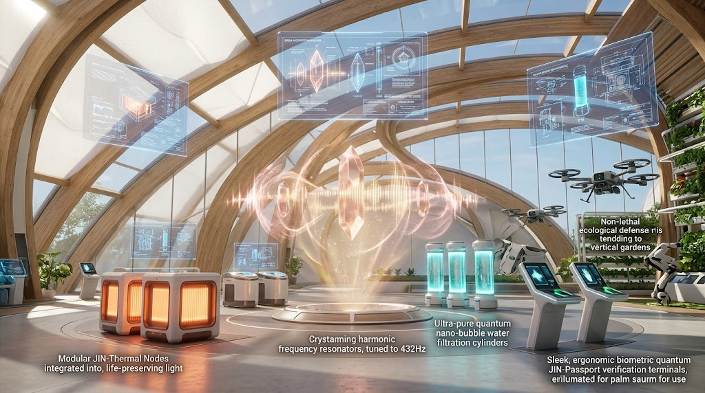

外部の中央集権や他国利権を排し、地球の生態系と人間の尊厳を根底から守り抜くための自律分散型テクノロジー・アーキテクチャ。

本カタログでは、『JIN-ORDER』および『GOVERNANCE_OF_ABYSS』が提唱する次世代インフラストラクチャの全貌（全26大先端技術体系）を完全公開する。

---

<!-- 🧭 クイックナビゲーション目次 -->

  

    <b>【 26大先端技術 快速索引（Quick Jump to Technology） 】</b> 
    <a href="#01-生体臓器分散型コンピューティング--身体主権防衛-level-3-先進研究">01.脳型20W計算</a> ｜ 
    <a href="#02-ジンドラゴン鉱石と次世代三位一体エネルギーマトリクス-level-3-先進研究">02.三位一体電池</a> ｜ 
    <a href="#03-水中自律計算--海底ケーブル哨戒ノードsscn-01--jin-spec-sub-01-level-3-先進研究">03.水中主権計算</a> ｜ 
    <a href="#04-サヘル乾燥地帯オフグリッド人道支援--テラプレタ土壌再生lsu-chad-01-level-2-既存技術統合">04.サヘル水土壌</a> ｜ 
    <a href="#05-低温減圧膜蒸留vmd淡水化-濃縮ブライン完全資源化zld-level-2-既存技術統合">05.VMD低温淡水化</a> 
    <a href="#06-上下水道インライン水力--超臨界水ガス化scwg水素--カスケード水理蓄電-level-2-既存技術統合">06.水圧発電SCWG</a> ｜ 
    <a href="#07-都市地下多用途共同溝--液浸ai熱直結utility-ducts--wue000-level-2-既存技術統合">07.共同溝液浸AI</a> ｜ 
    <a href="#08-宇宙太陽光発電ssps温室一体型レクテナ受電-level-3-先進研究">08.SSPSレクテナ</a> ｜ 
    <a href="#09-jin-lifeblood-expressインフラ同軸型超伝導レール-level-3-先進研究">09.大深度超電導</a> ｜ 
    <a href="#10-現代版北前船硬翼帆ウィンドアシスト内航ハイブリッド-level-2-既存技術統合">10.現代北前船</a> 
    <a href="#11-河川上空ドローン法定航路skyway-水陸両用飛行艇sky-oasis-level-2-既存技術統合">11.Skywayドローン</a> ｜ 
    <a href="#12-光分散音響センシングdas全海底受動ソナー防衛網-level-2-既存技術統合">12.海底DASソナー</a> ｜ 
    <a href="#13-沖縄第7鉱区--沖縄トラフ熱水鉱床深海資源防衛ノード-level-3-先進研究">13.深海資源防衛</a> ｜ 
    <a href="#14-自律帯水層かん養復水システムjin-sarp--地軸質量復元-level-2-既存技術統合">14.帯水層かん養</a> ｜ 
    <a href="#15-海溝調和海底地殻鍼灸ノードjin-oam-node--地震ゼロ次制御-level-3-先進研究">15.海溝地殻鍼灸</a> 
    <a href="#16-古来源頭部土砂抑止--山腹多層崩壊防護工法-level-1-現場即応sop">16.伝統源頭砂防</a> ｜ 
    <a href="#17-海陸共生型酵素ケミカルリサイクルjin-cpc-level-3-先進研究">17.酵素リサイクル</a> ｜ 
    <a href="#18-伝統田畑輪換土木排水工学額縁明渠高畝-level-1-現場即応sop">18.田畑輪換炭素</a> ｜ 
    <a href="#19-人間主権型統合バイオ創薬プラットフォームjin-ibp--jin-spec-med-01-level-3-先進研究">19.統合バイオ創薬</a> ｜ 
    <a href="#20-砂漠砂改質高強度骨材精製プラントcsebブロック-level-1-現場即応sop">20.砂改質骨材</a> 
    <a href="#21-グリーンランド極北外気直接冷却free-cooling-level-2-既存技術統合">21.極北外気冷却</a> ｜ 
    <a href="#22-地銀信金主導-ローカルファクタリング--実物資産台帳-level-2-既存技術統合">22.地域実物金融</a> ｜ 
    <a href="#23-次世代半導体製造国内自立ファブ--20w脳型チップレット地下冷却主権-level-3-先進研究">23.国内自立ファブ</a> ｜ 
    <a href="#24-量子暗号と分散型aiグリッドジンネット-level-3-先進研究">24.量子暗号ネット</a> ｜ 
    <a href="#25-jin-os新パラダイム統合司令端末benevolence-client-level-2-既存技術統合">25.JIN-OS端末</a> 
    <a href="#26-宇宙ヘリウム3磁気圧縮直接誘導核融合--igs非破壊炉内トモグラフィ自律制御-level-3--canonical-spec-999"><b>26.宇宙ヘリウム3核融合直接発電＆IGS</b></a>
  

---

## 🧭 JIN-ORDER 26大先端技術体系 統合アーキテクチャ設計図 (Master Ecosystem Matrix)

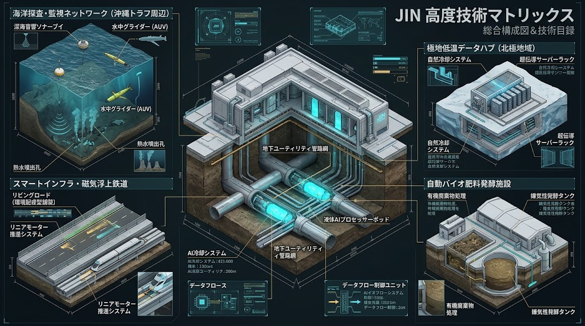

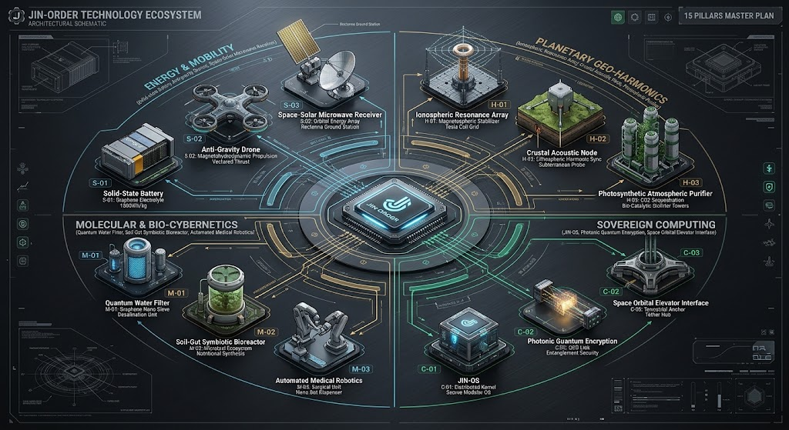

26大先端技術は、単独で存在するのではなく、中央の「JIN-ORDER 自律調和核」を中心に6つの同心円防壁・機能層として相互接続され、常時リアルタイムでエネルギー・計算資源・物質循環・極限減災を同期させている。

- **🏙️ URBAN CIVIL, DISASTER & THERMAL SYMBIOSIS（都市土木・防災避難・熱電共生層）:** **20W生体代謝型脳型チップレット＆地下動脈クローズドループ冷却インフラ（SPEC-027 / WIPO ID: 179936）**、生体臓器分散型コンピューティング（20W代謝）、JIN-ZONING（熱力学用途地域）、地下多用途共同溝×液浸AI熱直結（WUE=0.00）、**首都直下木密火災旋風破砕・下水圧マンホールミストカーテン＆数千万トン震災瓦礫現場即時分級循環（SPEC-026 / WIPO ID: 179901）**、**豪雪雪氷極寒冷害・無塩除雪路面保全＆下水熱・地熱無散水消雪自律防護（SPEC-025 / WIPO ID: 179900）**、**熟練職人現場打ち本位・小型分散プラント・プラスチックフリー防錆・新モルタル建築展開＆地下水脈防護（SPEC-022 / WIPO ID: 179896）**、**地域社会生活基盤・自立分散型多層防衛マトリクス（SPEC-021）**、**三重円環地球再生＆先端セラミックス熱力学的輪廻転生（SPEC-016 / WIPO ID: 179879）**、**生態共生型水素還元製鉄＆バイオスラグ土壌循環（SPEC-015 / WIPO ID: 179878）**、**公共公園地下循環雨水調整池＆耐震消火水利（SPEC-012 / WIPO ID: 179883）**、行政直営AIスマート防犯灯＆IGS危険物透視＆最短交番即応（SPEC-011-REV2）、**都心・地方二元型地域資源循環コンポスト（SPEC-010 / WIPO ID: 179963）**、折りたたみ式メッシュ集積カゴ＆架線防鳥スパイク立体防衛、せせらぎ緑道復元、光合成道路表層（PRS）
- **⚡ AUTONOMOUS ENERGY & WATER MATRIX（自立動力・水利循環層）:** **宇宙ヘリウム3直接電磁誘導核融合＆IGS散乱逆問題非破壊炉内トモグラフィ（SPEC-999 / WIPO ID: 179964）**、**沿岸連鎖型海水フロート・ペロブスカイト揚水＆生態水理蓄電（SPEC-018 / WIPO ID: 179884: 井川用水モデル）**、**風・海流複合デュアル運動エネルギー変換＆深海DASハイブリッド係留（SPEC-019 / WIPO ID: 179886）**、**地殻歪み振動回収・深層地熱自立発電＆IGS散乱逆問題非破壊防災通信（SPEC-020 / WIPO ID: 179888）**、**溶存酸素純増放流（Net-Positive DO）＆水理落差工（SPEC-001 / WIPO ID: 179959）**、**多重冗長化WASH＆3重リング配管（SPEC-002 / WIPO ID: 179960）**、ジン・ドラゴン三位一体エネルギー（ペロブスカイト光半導体・全固体Jin-Battery・海洋塩ナトリウム蓄電・NAS蓄電バッファ）、低温減圧膜蒸留（VMD海水淡水化）＆濃縮ブライン資源化（ZLD）、上下水道インライン水圧発電、下水汚泥SCWG水素＆電炉排熱直結SOEC高温水電解、宇宙太陽光（SSPS）レクテナ受電、チョークポイント弾力性大深度地熱
- **🚄 3D TRANSIT & LOGISTICS ARTERIES（三次元自律交通・動脈物流層）:** **φ13.5m大深度複合地下回廊・IAAC調停（SPEC-CCNP-088）**、JIN-Lifeblood Express（インフラ同軸超伝導レール）、現代版北前船（硬翼帆内航ハイブリッド）、河川上空ドローン法定航路（Skyway）、水陸両用飛行艇（Sky Oasis）
- **🌊 MARITIME SOVEREIGNTY & GEO-HYDRO DEFENSE（海洋主権・深海計算・水脈治水防衛層）:** **大河川外水氾濫・動的霞堤遊水群・将棋頭分流・竜王の鼻偏向＆水没孤立街区防疫自律救命（SPEC-023 / WIPO ID: 179898）**、**深層崩壊・山体崩壊・河道閉塞（土砂ダム）緊急重力サイフォン排水＆遠隔無人化砂防土木（SPEC-024 / WIPO ID: 179899）**、水中自律計算＆海底ケーブル哨戒ノード（SSCN-01 / 沖縄トラフ1,500m）、**深海DAS光ファイバー全海底受動ソナー防衛網（SPEC-019連動）**、**海溝調和地殻鍼灸ノード＆IGS非破壊トモグラフィ断層透視（JIN-OAM / SPEC-020連動）**、沖縄第7鉱区＆沖縄トラフ熱水鉱床防衛、自律帯水層かん養（JIN-SARP / 地軸質量復元）、古来源頭部土砂抑止（石積砂留・混層固め）
- **🧬 BIO-MITOCHONDRIAL SEQUESTRATION & AGRO COMMONS（ミトコンドリア炭素隔離・酵素循環・農業主権層）:** **Bio-FOEAS地下水位制御農地基盤＆田んぼダム治水（SPEC-006 / WIPO ID: 179961）**、**昆虫残渣フラス連鎖＆砂漠自律土壌化仕様書（SPEC-014 / WIPO ID: 179871）**、**生体ミトコンドリア代謝制御＆籾殻炭モリブデン土壌炭素隔離（SPEC-013 / WIPO ID: 179881）**、**サヘル乾燥地帯オフグリッド人道再生（LSU-Chad-01 / WIPO ID: 179882）**、みどり麹PETase酵素常圧湿気解重合、早生米×大豆田畑輪換＆額縁明渠・高畝土木工学、ユーグレナ×米麹「みどり麹」生体バイオ創薬プラットフォーム（JIN-IBP）＆「孝弁」処方、砂漠砂高強度骨材・CSEBブロック精製
- **🪙 COLD-COMPUTE & LOCAL RELATIONAL FINANCE（極北冷気計算・地域実物金融層）:** 全球ASI覇権二大計算回廊（北極コールド vs 熱帯ペトロ）、グリーンランド極北外気直接冷却（Free-Cooling）、地銀・信金主導ローカル・ファクタリング（T+0即日保証）、市民インフラ保全証明（PoCI）新通貨JINトークノミクス（SPEC-TOKEN-012）、実物生命資産担保台帳（HU/GU/FU/JU/RU規格）、世界民族コモンズ納税（SPEC-009）、八柱民草主権（SPEC-008-V11.0）

---

## 🗺 地域戦略 × 26大先端技術 クロスリファレンス・マトリクス

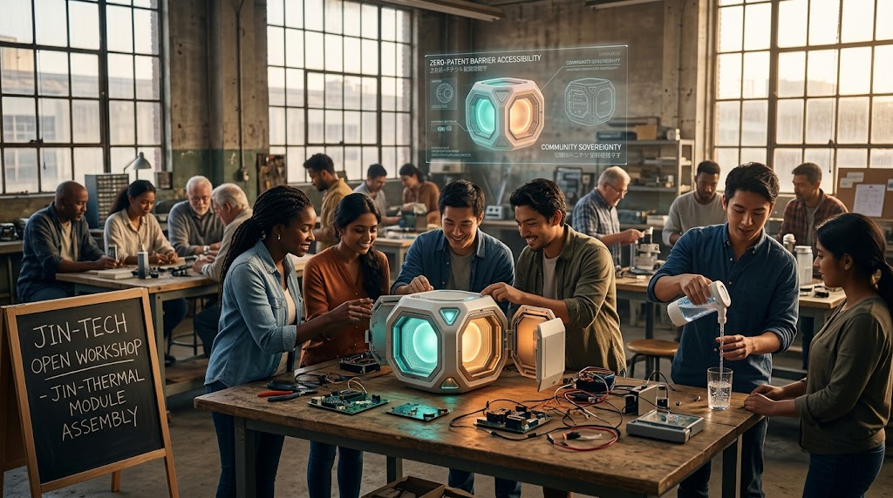

Regional Strategy & Core Technologies Cross-Reference Matrix

| 方面 / 地域 (Region) | 中核作戦目標 (Core Strategy) | 適用される主要先端技術 (Deployed Technologies) | 期待される変革と実装効果 |
| :--- | :--- | :--- | :--- |
| **中東全域** | ザカート螺旋計画 ＆ WPOルネサンス | **[02]** 三位一体電池・光半導体 **[05]** 低温減圧膜蒸留淡水化 **[18]** ミトコンドリア土壌炭素隔離 **[SPEC-014]** 昆虫フラス砂漠土壌化 | 石油利権への依存を完全脱却。強烈な太陽光とAI排熱から純淡水とグリーンアンモニア肥料を無電力合成し、昆虫フラスと籾殻炭によるテラ・プレタ造成で食料主権を確立。 |
| **東アフリカ** | ナイル・ルネサンス・プロトコル | **[04]** LSU-Chad-01 人道ユニット **[09]** JIN-Lifeblood Express **[20]** 砂漠砂CSEB骨材プラント | 外資ダム依存を排し、超高速水浄化と現地砂骨材による完全自給インフラを構築。 |
| **沖縄・東シナ海・太平洋EEZ** | 南西諸島主権防衛 ＆ 海洋エネルギー自立 | **[03]** 深海主権計算ノード SSCN-01 **[12]** 海底DAS音響ソナー網 **[SPEC-019]** 風・海流複合深海係留プラットフォーム **[SPEC-018]** 沿岸連鎖型海水揚水蓄電 | 遠浅なき深海EEZを世界最大のエネルギー拠点へ転換。黒潮海流と洋上風力で24時間ベースロード発電を行い、DAS係留索で海底地震・不審潜水艦を常時哨戒。 |
| **環太平洋火山帯・日本列島** | 地殻エネルギー自給 ＆ 極限減災要塞・都市焦熱復興 | **[15]** 海溝調和地殻鍼灸ノード **[SPEC-027]** 20W脳型チップレット地下冷却 **[SPEC-020]** 地殻振動回収・深層地熱発電・IGS防災通信 **[SPEC-022]** 熟練現場打ち新コンクリ新モルタル **[SPEC-023]** 大河川動的霞堤・信玄堤治水 **[SPEC-024]** 深層崩壊土砂ダム緊急サイフォン無人砂防 **[SPEC-025]** 豪雪下水熱無散水消雪 **[SPEC-026]** 首都直下火災旋風破砕・瓦礫循環 **[SPEC-017]** 動的広域減災シールド **[SPEC-012]** 公園地下防災調整池 | 大規模地震動を直接電力へ回生。外水氾濫を動的霞堤で呼吸減勢させ、土砂ダムを無人サイフォンで制圧。断水下でも下水圧ミストカーテンで火災旋風を破砕し、倒壊瓦礫を即日RC-40路盤材へ再生して都市機能を死守。地下下水熱直結20W脳型AIで大気排熱と水消費をゼロ化。 |
| **極北・グリーンランド** | デンマーク主権同盟 ＆ 極北計算特区 | **[21]** 極北外気直接冷却 **[06]** 氷河融解マイクロ水力 **[12]** 北極海Far North Fiber DAS | 大国の買収圧力を拒絶。外気冷却による水消費ゼロAIハイパーサイトを配備し、排熱で先住民Kouben農業ドームを暖房。 |
| **日本本土・地域圏** | 地域自立共生経済 ＆ 大田区町工場直結 ＆ 産業脱炭素 | **[22]** 地銀ローカル・ファクタリング **[07]** 多用途共同溝×液浸AI **[SPEC-027]** 20W脳型半導体地下冷却 **[SPEC-015]** 生態共生水素還元製鉄 **[SPEC-016]** 三重円環セラミックス輪廻 | 中央集権金融をバイパス。地銀が農家と町工場の売掛金を即日全額保証。電炉排熱をSOEC高温水電解に直結し、下水バイオガスからe-fuelを自給自足して都市と重工業の完全共生を達成。地下インフラ埋設20Wノードにより自治体のデジタル主権を確立。 |
| **チャド湖盆地・サヘル** | サヘル気候難民自立・土壌再生（UNHCR） | **[04]** LSU-Chad-01 人道ユニット **[02]** ナトリウム蓄電グリッド **[SPEC-014]** 昆虫フラス砂漠土壌再生 | 侵略的外来種テッポウウリを無煙炭化し、昆虫フラス（WIPO GREEN ID: 179871）と混合してテラ・プレタ土壌を再生。難民オアシス都市を完全自立化。 |
| **コンゴ民主共和国** | シスターフッド同盟 ＆ コバルト資源主権 | **[02]** 全固体JIN-Battery現地完成品化 **[17]** バイオ浸出・スラグ建材化 | 鉱物原石のダンピング輸出を禁止し、現地ギルドで全固体電池完成品（1,200Wh/kg）まで一貫製造して児童労働と搾取を完全遮断。 |
| **台湾海峡・東シナ海・九州熊本** | シリコン・サンクチュアリ ＆ 水脈復水 ＆ 脳型自立ファブ | **[14]** 自律帯水層かん養（JIN-SARP） **[23]** 国内半導体自立ファブ **[SPEC-027]** 20W脳型チップレット **[24]** ジン・ネット | TSMC冷却水を無酸素加圧注水で帯水層へ100%クローズドループ復水。日本の先端素材工芸を結集した20W脳型チップレットの国内製造を確立し、地軸質量とデジタル主権を死守。 |
| **月面裏側・深宇宙開拓地** | 宇宙エネルギー主権 ＆ 恒久生命維持電源 | **[26 / SPEC-999]** 宇宙ヘリウム3直接誘導核融合＆IGS炉内トモグラフィ | 月の裏側レゴリスからHe-3を回収。蒸気タービンを排した電磁誘導直接発電（効率85%+）とIGSマイクロ波散乱逆問題非破壊透視により、ディスラプション事故を根絶した不沈クリーンエネルギー供給を確立。 |

---

## ⚡ 1. エネルギー・環境・自立水利基盤
Energy, Environment & Autonomous Water Matrix

### 01. 生体臓器分散型コンピューティング ＆ 身体主権防衛 `[Level 3: 先進研究]`
#### ［連動正典：SPEC-027 20W生体代謝型脳型チップレット / WIPO ID: 179936］

  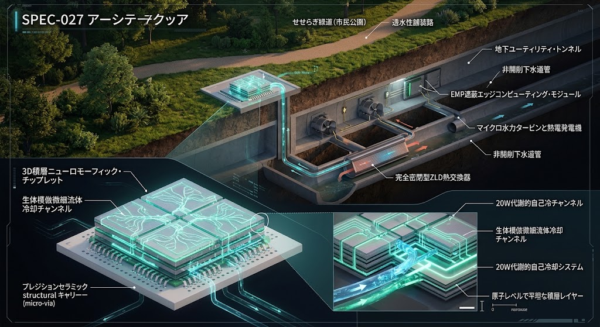
  
<b>図 1-1：SPEC-027 20W生体代謝型脳型チップレット ＆ 地下動脈クローズドループ冷却インフラ 3Dアイソメトリック詳細断面図</b>

- **概要**: 人体代謝（約20W）を模倣した異種チップレット（大脳倫理・小脳物理・自律神経冷却・インメモリシナプス）。侵襲的サイボーグ化や脳電極埋設を拒絶し、都市地下バイオスウェル浸透水冷およびサヘル砂漠アースチューブによる完全自然共生型演算アーキテクチャ。**SPEC-027（オンチップ微細流路超純水冷却×地下下水熱ZLD完全密閉交換）** と直結し、水資源消費ゼロの知能基盤を形成する。
- **スペック**:
  - 消費電力指標: 人体安静時代謝同等の **20W駆動**
  - 自然冷却構造: チップ内毛細血管流路超純水循環 ＋ 土壌バイオスウェル・地下下水管渠パッシブ熱交換（機械式チラー・冷却塔全廃）
  - 身体主権防衛: 侵襲的電極インプラントを永久禁止し、非侵襲生体調律インターフェースのみを採用
- **連携仕様書**: [JIN_BIO_SYMBIOTIC_INFRASTRUCTURE.md](./JIN_BIO_SYMBIOTIC_INFRASTRUCTURE.md) / [docs/SPEC-027_NEUROMORPHIC_CHIPLET_CIVIC_CONDUIT_PROTOCOL.md](./docs/SPEC-027_NEUROMORPHIC_CHIPLET_CIVIC_CONDUIT_PROTOCOL.md)

---

### 02. ジン・ドラゴン鉱石と次世代三位一体エネルギーマトリクス `[Level 3: 先進研究]`
### （ペロブスカイト光半導体 × 全固体Jin-Battery × 海洋塩ナトリウム蓄電 ＆ 水理・海洋・地殻連成）
#### ［連動正典：SPEC-018 沿岸海水揚水 ＆ SPEC-019 風・海流デュアル ＆ SPEC-020 地熱振動］

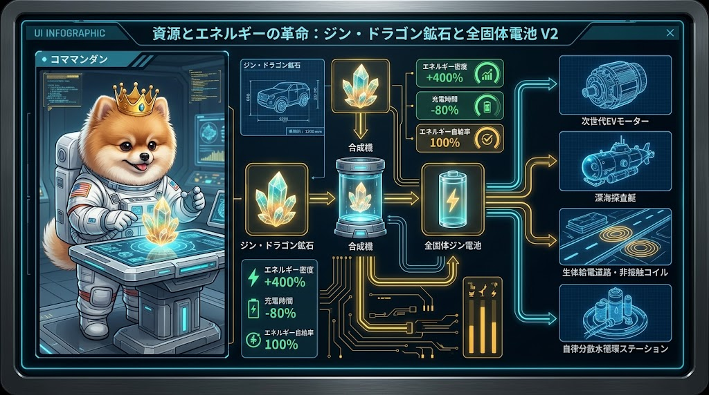
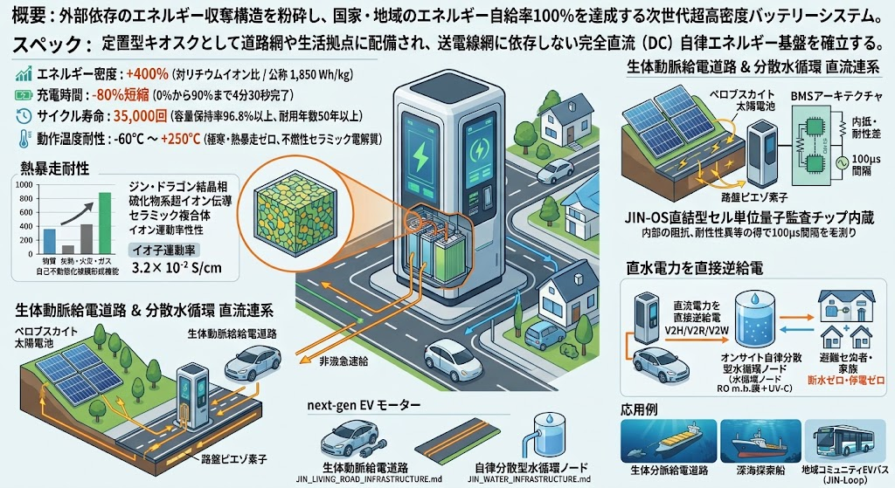

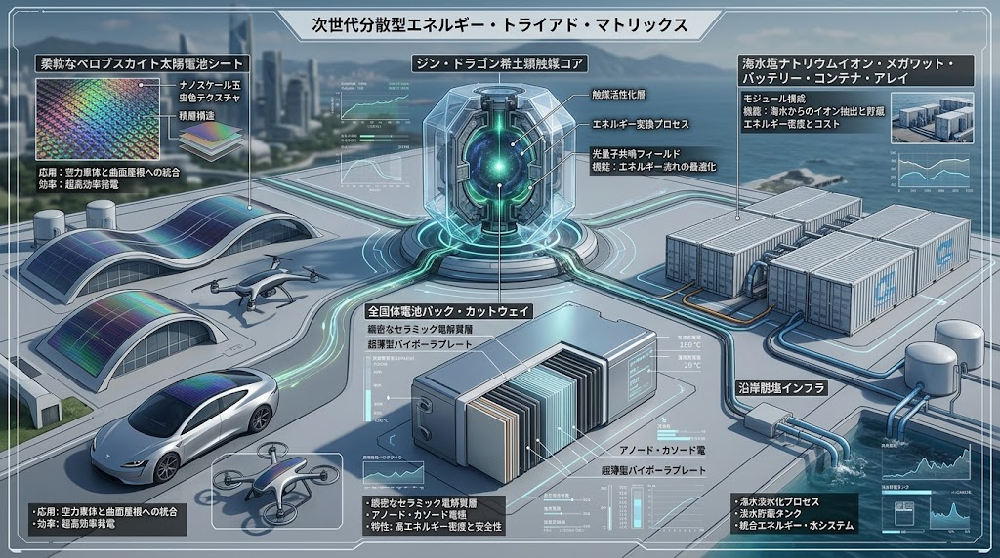  
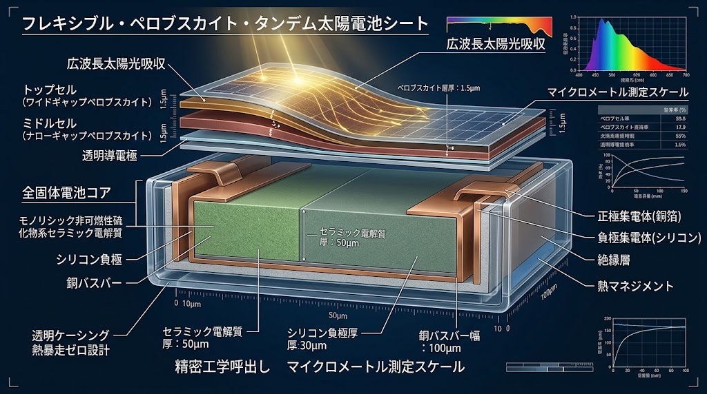 
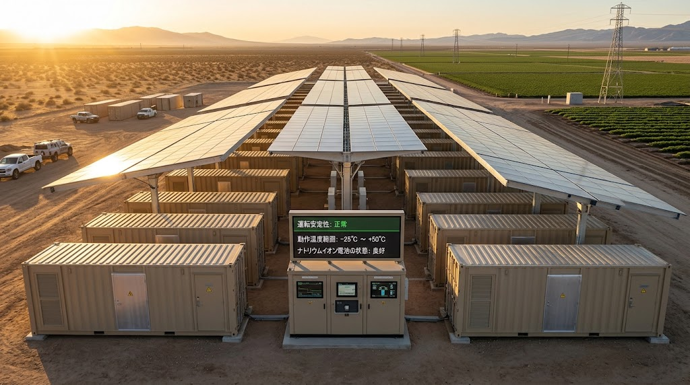

- **概要**: 南鳥島深海レアアース触媒を中核とし、**「面での超薄型自律発電（ペロブスカイト）」**、**「動脈モビリティ用超高密度蓄電（全固体）」**、および**「海洋塩・VMD排塩水由来の無尽蔵グリッド定置蓄電（ナトリウムイオン / NAS電池）」**を統合した完全主権型エネルギー体系。
さらに、**SPEC-018（山頂水上ペロブスカイトフロート×多段カスケード海水揚水）**、**SPEC-019（洋上風力FAWT×海中黒潮カウンタータービン）**、**SPEC-020（深層地熱ORC×スピーカー反転低周波振動発電）**を完全連成させ、天候変動・夜間・地震災害時でも1秒の瞬低も許さない「24時間365日の絶対自立ベースロード電源」を確立する。
- **スペック**:
  - **ペロブスカイト太陽光発電層**:
    - 理論変換効率: **32.0〜35.4%**（水冷フロート化により実効発電効率+15%）
    - 物理特性: 薄型軽量フレキシブル構造、揚水上池フロート、洋上浮体、農業ドーム曲面へ一体施工可能
    - 元素構成: インジウム等希少金属を完全排除した南鳥島希土類ナノ結晶ドープ
  - **全固体 Jin-Battery（モビリティ・航空深海・緊急サージ用）**:
    - エネルギー密度: **公称 1,200〜1,850 Wh/kg**（対リチウムイオン比 +400%）
    - 充電速度: **0%から90%まで4分30秒で完了（超高速充電）**
    - 動作温度耐性: **-60°C 〜 +250°C（極寒・酷暑・深海環境でも出力低下ゼロ）**
    - サイクル寿命: **35,000回**（容量保持率96.8%以上、耐用年数50年以上）
  - **JIN-Sodium グリッド定置型蓄電池（電力網・電炉・防災拠点用）**:
    - 主原料: 海水淡水化（VMD）濃縮ブラインより晶析精製した無尽蔵の「ナトリウム（塩成分）」
    - コスト指標: リチウムイオン電池比 **-65%の圧倒的低コスト製造**
    - 系統瞬低吸収（SPEC-016連動）: 応答速度 **< 10ms**、電炉フリッカ・地震サージを100%吸収
- **連携仕様書**: [specs/JIN_AUTONOMOUS_ENERGY_MATRIX.md](./specs/JIN_AUTONOMOUS_ENERGY_MATRIX.md) / [docs/SPEC-018_MARINE_CASCADE_LIVING_HYDRO_BATTERY_PROTOCOL.md](./docs/SPEC-018_MARINE_CASCADE_LIVING_HYDRO_BATTERY_PROTOCOL.md) / [docs/SPEC-019_AERO_TIDAL_DUAL_FLUX_ABYSSAL_MOORING_PROTOCOL.md](./docs/SPEC-019_AERO_TIDAL_DUAL_FLUX_ABYSSAL_MOORING_PROTOCOL.md) / [docs/SPEC-020_SEISMO_HARVEST_GEOTHERMAL_IGS_DISASTER_COMM_PROTOCOL.md](./docs/SPEC-020_SEISMO_HARVEST_GEOTHERMAL_IGS_DISASTER_COMM_PROTOCOL.md)

---

### 03. 水中自律計算 ＆ 海底ケーブル哨戒ノード（SSCN-01 / JIN-SPEC-SUB-01） `[Level 3: 先進研究]`
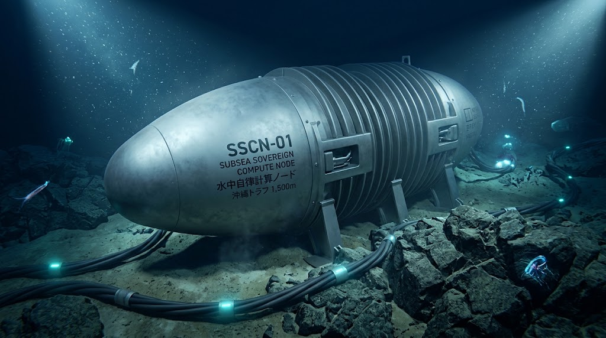
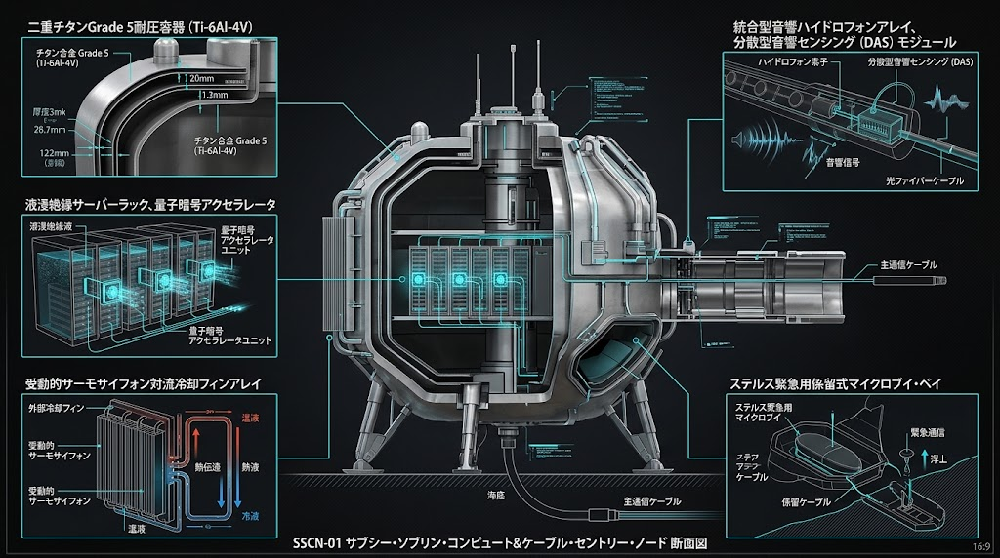

- **概要**: 沖縄トラフ水深1,500m級海底に直接設置される主権計算・海洋防衛ノード。深海の極低温海流と受動的サーモサイフォン熱交換により、水消費ゼロ（WUE=0.00）・PUE=1.01の超高効率計算環境を達成。**SPEC-019（深海DAS係留テンドロン）** と同期し、海底光ケーブルの監視・敵性潜水艇哨戒を常時執行する。
- **スペック**:
  - 耐圧殻構造: **二重チタン合金Grade 5（Ti-6Al-4V）耐圧容器**（水深2,000m・静水圧20MPa耐力）
  - 冷却性能: 受動的サーモサイフォン対流冷却フィンアレイ（冷媒: フルオロケトン / **PUE 1.015 / WUE 0.00**）
  - 暗号防衛: 耐量子暗号（PQC / Kyber・Dilithium）アクセラレータ、物理侵入検知時ゼロ化回路
- **連携仕様書**: [specs/SUBSEA_SOVEREIGN_NODE_SPEC.md](./specs/SUBSEA_SOVEREIGN_NODE_SPEC.md) / [docs/SPEC-019_AERO_TIDAL_DUAL_FLUX_ABYSSAL_MOORING_PROTOCOL.md](./docs/SPEC-019_AERO_TIDAL_DUAL_FLUX_ABYSSAL_MOORING_PROTOCOL.md)

---

### 04. サヘル乾燥地帯オフグリッド人道支援 ＆ テラ・プレタ土壌再生（LSU-Chad-01） `[Level 2: 既存技術統合]`
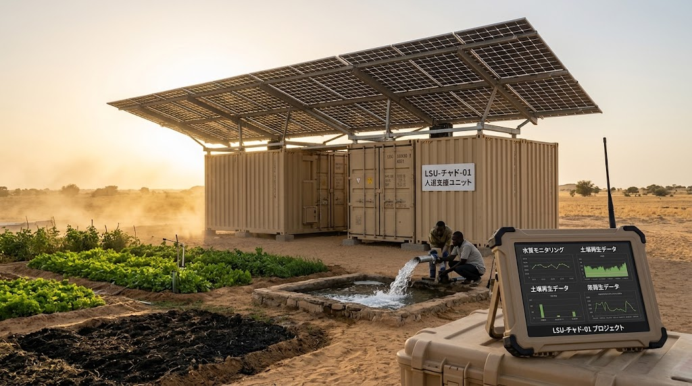
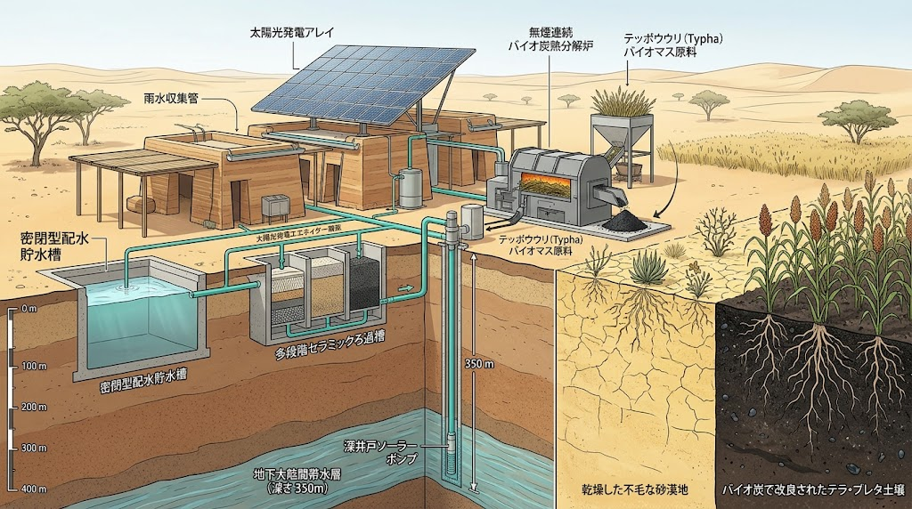

- **概要**: チャド湖盆地などの乾燥・気候難民集積地へ即時展開するコンテナ型自立生命維持ユニット（UNHCR連携 Submission ID: 95525 / **WIPO GREEN ID: 179882**）。外来種テッポウウリ（Typha）を無煙熱分解して多孔質バイオ炭を精製し、砂漠砂と混合して「テラ・プレタ」土壌を造成。**SPEC-014（昆虫フラス / WIPO GREEN ID: 179871）** および **SPEC-015（脱リンバイオスラグ / WIPO GREEN ID: 179878）** を調合し、完全無肥料農地を形成する。
- **スペック**:
  - 深井戸ソーラー揚水: 水深 **350m深層帯水層** からのDCブラシレス直接揚水（日量 120〜180 m³）
  - 水浄化能力: 多段階セラミック膜ろ過槽（濁度・病原菌除去率 **99.999%** / 薬品完全ゼロ）
  - 土壌炭素固定・保水: テッポウウリ無煙連続熱分解炉（炭化温度 **450〜550℃** / 保水能 +300%向上）
- **連携仕様書**: [specs/CHAD_BASIN_OFFGRID_REGENERATION.md](./specs/CHAD_BASIN_OFFGRID_REGENERATION.md) / [docs/SPEC-014_TENEBRIONID_FRASS_SOIL_REGENERATION_PROTOCOL.md](./docs/SPEC-014_TENEBRIONID_FRASS_SOIL_REGENERATION_PROTOCOL.md)

---

### 05. 低温減圧膜蒸留（VMD淡水化）＆ 濃縮ブライン完全資源化（ZLD） `[Level 2: 既存技術統合]`
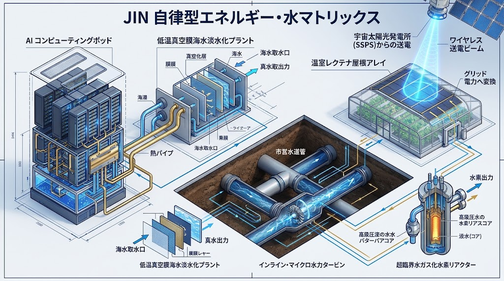

- **概要**: 化石燃料・大電力を消費する高圧RO膜を全廃。AI排熱（50〜60℃）と減圧工学（0.08〜0.15気圧）を組み合わせ、海水を低温沸騰させて高純度真水（HU）を精製。残留ブラインを海へ一切流出させない完全密閉ゼロリキッドディスチャージ（ZLD）システム。
- **スペック**:
  - 造水消費電力: **< 0.8 kWh/m³**（従来RO膜比 80%削減）
  - 熱源利用効率: 液浸AI冷却水排熱（50〜60℃）の熱回収率 **92.4%**
  - ZLD資源回収率: 食用塩、水酸化マグネシウム、炭酸リチウム **100%結晶回収**
- **連携仕様書**: [specs/JIN_AUTONOMOUS_ENERGY_MATRIX.md](./specs/JIN_AUTONOMOUS_ENERGY_MATRIX.md)

---

### 06. 上下水道インライン水力 ＆ 超臨界水ガス化（SCWG）水素 ＆ カスケード水理蓄電 `[Level 2: 既存技術統合]`
#### ［連動正典：SPEC-018 井川用水モデル ＆ SPEC-015 ＆ SPEC-016 ＆ SPEC-027］
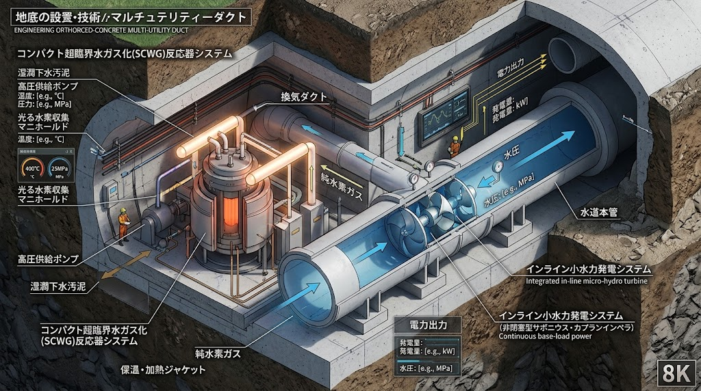

- **概要**: 都市配水管の高低差水圧および **SPEC-018（井川用水多段カスケード親池・子池・孫池システム）** による緩傾斜減勢落差から、超静音マイクロタービンで運動エネルギーを94%回収。**SPEC-027（マンホール内マイクロ水力・ゼーベック熱電自己給電）** と同期し、完全オフグリッド演算を維持。下水汚泥を超臨界水ガス化（SCWG）で水素転換し、**SPEC-016（電炉排熱直結SOEC高温水電解）** と合流させてオンサイトe-fuelを自給する。
- **スペック**:
  - インライン・カスケード水力出力: 1系統あたり **5 kW 〜 500 kW**（水撃圧ゼロ・24時間連続発電）
  - SCWG反応条件: 温度 **380℃〜420℃** / 圧力 **23MPa〜25MPa**
  - SOEC動作温度（SPEC-016連動）: **600〜800℃**（外部加熱エネルギー消費ゼロ）
- **連携仕様書**: [specs/JIN_AUTONOMOUS_ENERGY_MATRIX.md](./specs/JIN_AUTONOMOUS_ENERGY_MATRIX.md) / [docs/SPEC-018_MARINE_CASCADE_LIVING_HYDRO_BATTERY_PROTOCOL.md](./docs/SPEC-018_MARINE_CASCADE_LIVING_HYDRO_BATTERY_PROTOCOL.md) / [docs/SPEC-015_ECOLOGICAL_HYDROGEN_STEEL_CIRCULAR_PROTOCOL.md](./docs/SPEC-015_ECOLOGICAL_HYDROGEN_STEEL_CIRCULAR_PROTOCOL.md) / [docs/SPEC-027_NEUROMORPHIC_CHIPLET_CIVIC_CONDUIT_PROTOCOL.md](./docs/SPEC-027_NEUROMORPHIC_CHIPLET_CIVIC_CONDUIT_PROTOCOL.md)

---

### 07. 都市地下多用途共同溝 × 液浸AI熱直結（Utility Ducts / WUE=0.00） `[Level 2: 既存技術統合]`
### ＆ JIN-ZONING（生活・減災インフラ SPEC-027 / 026 / 025 / 022 / 021 / 010 / 011 / 012 連動）

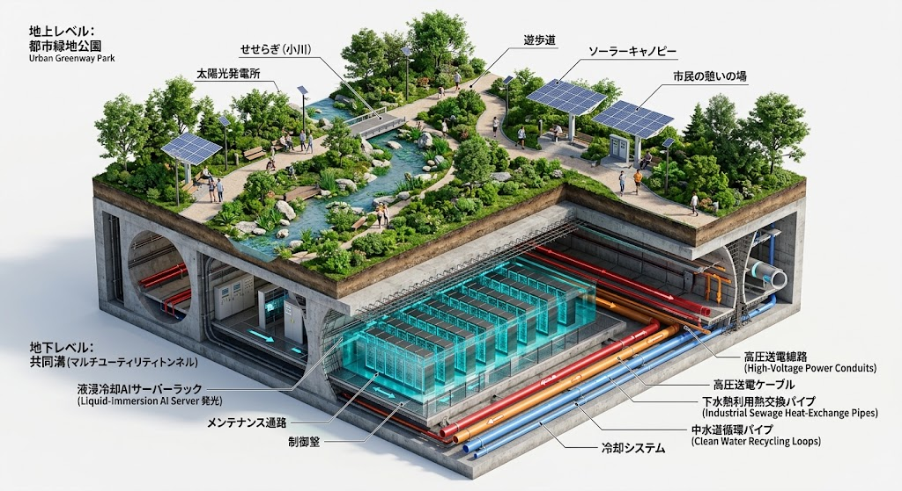
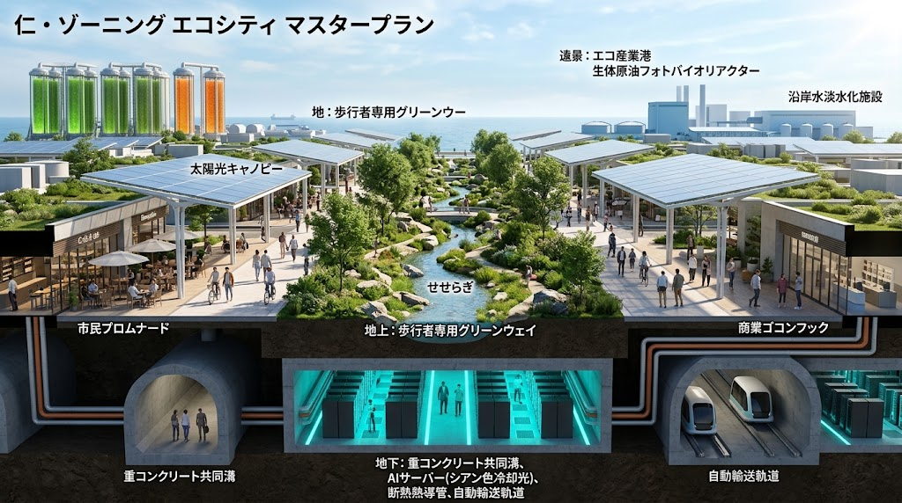

  <table width="100%">
    <tr>
      <td width="33%" align="center">
        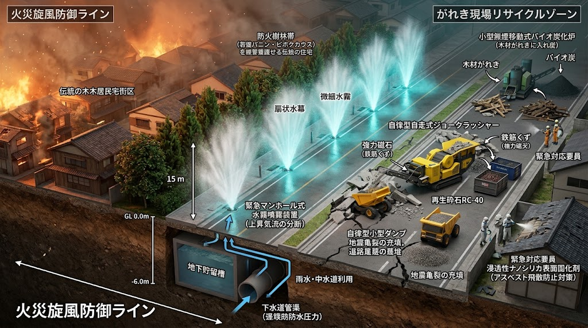 
        <b>火災旋風破砕・瓦礫循環（SPEC-026）</b>
      </td>
      <td width="33%" align="center">
        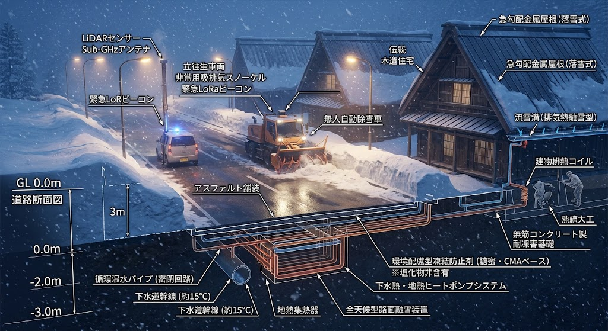 
        <b>豪雪雪氷・下水熱消雪（SPEC-025）</b>
      </td>
      <td width="33%" align="center">
        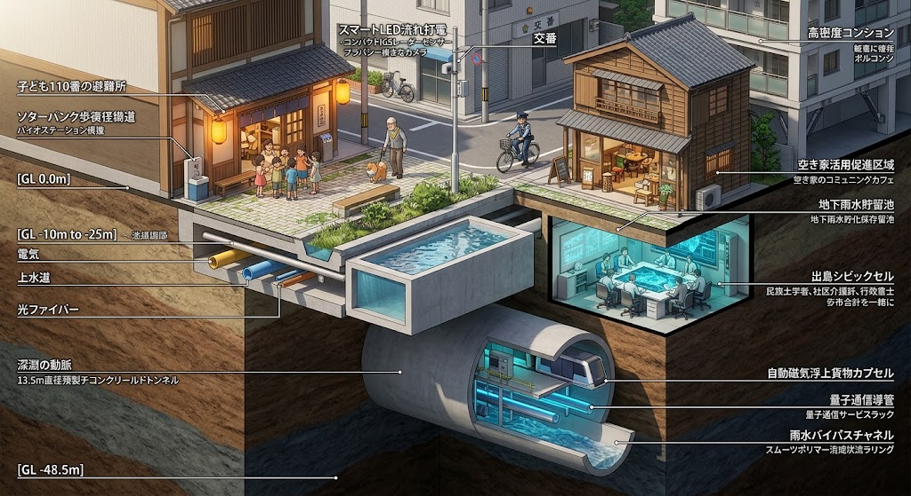 
        <b>地域社会多層防衛マトリクス（SPEC-021）</b>
      </td>
    </tr>
  </table>

- **概要**: 都市地下共同溝に液浸AIおよび **SPEC-027（20W脳型チップレット / WIPO ID: 179936）** を分散配備し、下水熱交換ループ直結により水消費ゼロ（WUE=0.00）を達成。**首都直下火災旋風破砕・震災瓦礫循環（SPEC-026 / WIPO ID: 179901）**、**豪雪雪氷極寒冷害・下水熱無散水消雪（SPEC-025 / WIPO ID: 179900）**、**熟練現場打ち新コンクリ新モルタル（SPEC-022 / WIPO ID: 179896）**、**地域社会多層防衛マトリクス（SPEC-021）**、**三重円環地球再生（SPEC-016）**、**生態共生水素製鉄（SPEC-015）**、**公園地下の循環雨水調整池＆耐震消火水利（SPEC-012 / WIPO ID: 179883）**、**行政直営AI防犯灯＆IGS危険物透視（SPEC-011-REV2）**、および**都心・地方二元型資源循環コンポスト（SPEC-010 / WIPO ID: 179963）**を包含する総合都市土木体系。
- **スペック**:
  - 水消費指標（WUE）: **0.00 L/kWh**（大気蒸発冷却タワーの完全廃絶）
  - 脳型エッジ冷却（SPEC-027）: 20Wチップレット×下水管渠CIPP更生熱交換ライナー一体型密閉循環（ZLD）
  - 火災旋風熱力学破砕（SPEC-026）: 下水差圧・地下雨水池直結の15m垂直ミストカーテン（輻射熱90%遮断）
  - 下水熱無散水融雪（SPEC-025）: 15℃下水管渠排熱CIPP熱交換による密閉循環ロードヒーティング
  - 現場打ち新コンクリ（SPEC-022）: 半径20km小型分散プラント・プラスチックフリー防錆・公道アンカー越境禁止
  - 地下消火水利直結（SPEC-012）: 地下プレキャストRC調整池（1,000〜10,000m³+）から消防専用スタンドパイプ直結
  - 防犯・道路保全（SPEC-011）: 72時間以内復旧直営LED防犯灯、IGS非破壊凶器検知、交番3〜5分臨場
- **連携仕様書**: [docs/SPEC-027_NEUROMORPHIC_CHIPLET_CIVIC_CONDUIT_PROTOCOL.md](./docs/SPEC-027_NEUROMORPHIC_CHIPLET_CIVIC_CONDUIT_PROTOCOL.md) / [whitepaper/01_civil_infrastructure_and_asi_symbiosis.md](./whitepaper/01_civil_infrastructure_and_asi_symbiosis.md) / [docs/SPEC-026_URBAN_FIRESTORM_AND_DEBRIS_CIRCULAR_PROTOCOL.md](./docs/SPEC-026_URBAN_FIRESTORM_AND_DEBRIS_CIRCULAR_PROTOCOL.md) / [docs/SPEC-025_CRYOSPHERIC_SNOW_ICE_DISASTER_DEFENSE_PROTOCOL.md](./docs/SPEC-025_CRYOSPHERIC_SNOW_ICE_DISASTER_DEFENSE_PROTOCOL.md) / [docs/SPEC-022_CIVIC_CONCRETE_CARBON_SINK_MORTAR_PROTOCOL.md](./docs/SPEC-022_CIVIC_CONCRETE_CARBON_SINK_MORTAR_PROTOCOL.md) / [docs/SPEC-021_CIVIC_COMMONS_LIFELINE_MATRIX.md](./docs/SPEC-021_CIVIC_COMMONS_LIFELINE_MATRIX.md) / [docs/SPEC-012_SOVEREIGN_URBAN_PARK_DISASTER_REFUGE_PROTOCOL.md](./docs/SPEC-012_SOVEREIGN_URBAN_PARK_DISASTER_REFUGE_PROTOCOL.md) / [docs/SPEC-010_URBAN_RURAL_CIRCULAR_SANITATION_PROTOCOL.md](./docs/SPEC-010_URBAN_RURAL_CIRCULAR_SANITATION_PROTOCOL.md)

---

### 08. 宇宙太陽光発電（SSPS）温室一体型レクテナ受電 `[Level 3: 先進研究]`
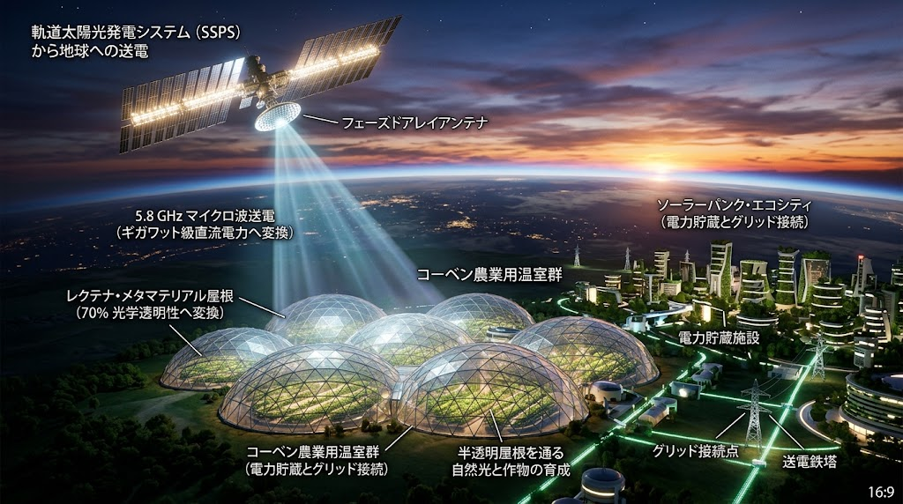

- **概要**: 静止軌道・月面受光基地からマイクロ波（5.8GHz）およびレーザー複合波を受電。農業用Kouben温室ドーム屋根と一体化した透過型レクテナアレイにより、天候不問でギガワット級主権電力を受電。
- **スペック**:
  - 地上受電効率: **RF-DC変換効率 84.5%**
  - 透過型レクテナ屋根光線透過率: **70%以上**（温室内作物の光合成有効放射PARを維持）
- **連携仕様書**: [specs/JIN_AUTONOMOUS_ENERGY_MATRIX.md](./specs/JIN_AUTONOMOUS_ENERGY_MATRIX.md)

---

## 🛸 2. モビリティ・三次元立体交通・動脈回廊
Mobility, 3D Transit Arteries & Infrastructure

### 09. JIN-Lifeblood Express（インフラ同軸型超伝導レール） `[Level 3: 先進研究]`
### ＆ φ13.5m大深度複合地下回廊（SPEC-CCNP-088） ＆ 光合成道路表層（PRS）

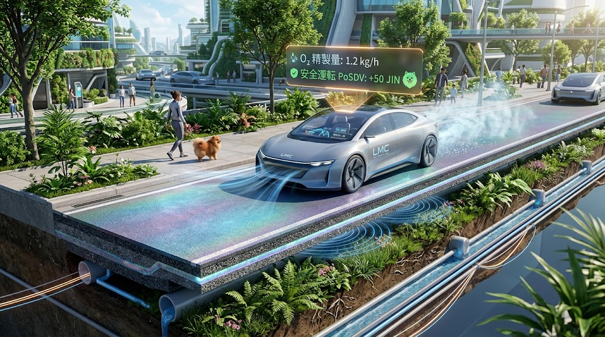

  
  
<b>図 9-1：SPEC-CCNP-088 φ13.5m大深度複合地下回廊および不可侵調停プロトコル 詳細アイソメトリック断面図</b>

- **概要**: **φ13.5m大深度複合地下回廊（SPEC-CCNP-088）** のGL -48.5m洪積粘土層に、磁気浮上物流（超電導HTS）・±500kV HVDC送電線・IAAC不可侵調停回線・180m³/s非開削更生排水トンネルを完全一体化。地上の光合成触媒道路（PRS）および純酸素を吐き出す生体モビリティ（LMC）と連動する。
- **スペック**:
  - リニア巡航速度: **500 km/h**（非接触浮上・摩耗ゼロ）
  - 大深度回廊規模（SPEC-CCNP-088）: 外径 **φ13.5m**、GL **-48.50m** 深度、CIPP内面更生洪水流下能力 **180 m³/s**
  - 同軸インフラ容量: HVDC送電 **±500kV / 5GW**、水素輸送 **50t/h**
  - 光合成道路（PRS）路面冷却: **-15℃〜-20℃**（NOxおよび粉塵分解能 88%）
  - 安全運転徳マイニング（PoSDV）: 衝撃緩和制動を共生AIが検知し、地域通貨『JIN』を直接ミント。
- **連携仕様書**: [specs/JIN_TRANSIT_ARTERIES.md](./specs/JIN_TRANSIT_ARTERIES.md) / [docs/SPEC-CCNP-088_DEEP_INFRA_ARBITRATION.md](./docs/SPEC-CCNP-088_DEEP_INFRA_ARBITRATION.md) / [JIN_LIFEBLOOD_EXPRESS.md](./JIN_LIFEBLOOD_EXPRESS.md)

---

### 10. 現代版北前船（硬翼帆ウィンドアシスト内航ハイブリッド） `[Level 2: 既存技術統合]`
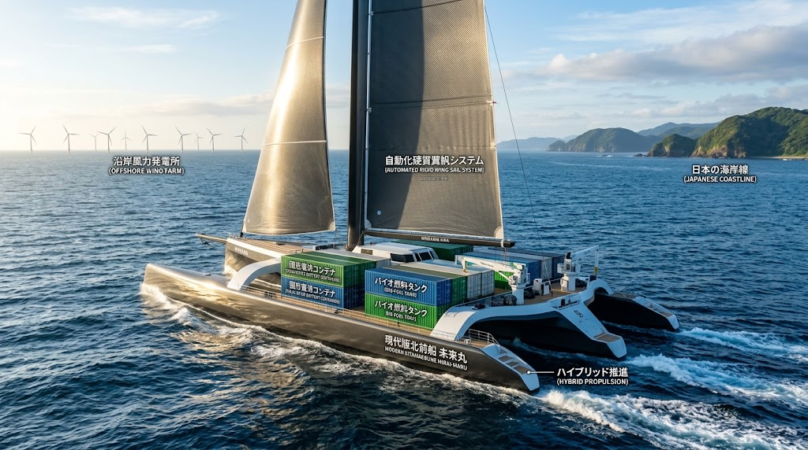

- **概要**: 自動制御カーボン硬翼帆（Rigid Wing Sail）による風力直接推進と、魚油抽出BDFハイブリッド補助機関を搭載した浅海進入トリマラン型貨物船。精製骨材、バイオ原油、全固体電池などの超重量物資を海上ピストン輸送。
- **スペック**:
  - 吃水深度: **3.0m〜5.0m**（浅海・大河川河口進入可能）
  - 風力推進寄与率: **60〜85%**（外洋巡航時）
- **連携仕様書**: [specs/JIN_TRANSIT_ARTERIES.md](./specs/JIN_TRANSIT_ARTERIES.md) / [JIN_KITAMAE_AIR_SEA_LOGISTICS.md](./JIN_KITAMAE_AIR_SEA_LOGISTICS.md)

---

### 11. 河川上空ドローン法定航路（Skyway）＆ 水陸両用飛行艇（Sky Oasis） `[Level 2: 既存技術統合]`
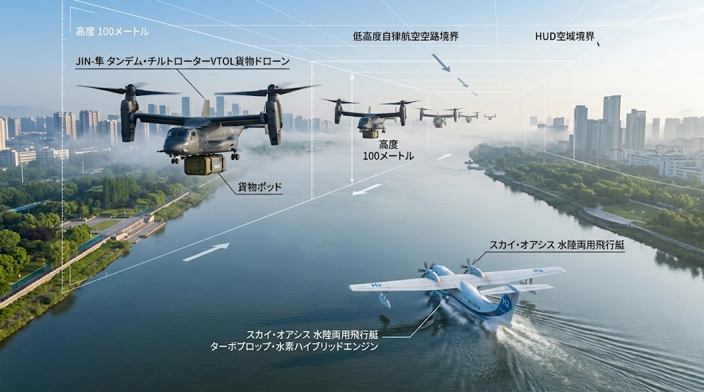

- **概要**: 一級河川および高速道路上空（50〜150m）をドローン専用法定回廊として開放。自律型大型VTOLカーゴ機による市街地無通過・24時間自律空輸と、滑走路不要の大型水陸両用飛行艇による長距離人道・外交回廊を確立。
- **スペック**:
  - VTOLカーゴ積載量: **500 kg 〜 2,000 kg**（巡航速度: 180 km/h）
  - Sky Oasis着水能力: 波高 **2.5m外洋着水対応**（航続距離: 4,500 km）
- **連携仕様書**: [specs/JIN_TRANSIT_ARTERIES.md](./specs/JIN_TRANSIT_ARTERIES.md) / [JIN_SKY_OASIS_AIRCRAFT.md](./JIN_SKY_OASIS_AIRCRAFT.md)

---

## 🌊 3. 海洋主権・深海資源・水脈治水防衛
Maritime Sovereignty, Deep-Sea Resources & Watershed Defense

### 12. 光分散音響センシング（DAS）全海底受動ソナー防衛網 `[Level 2: 既存技術統合]`
#### ［連動正典：SPEC-019 深海DASテンドロン ＆ SPEC-020 地殻弾性波 ＆ SPEC-024 深層崩壊DAS検知］
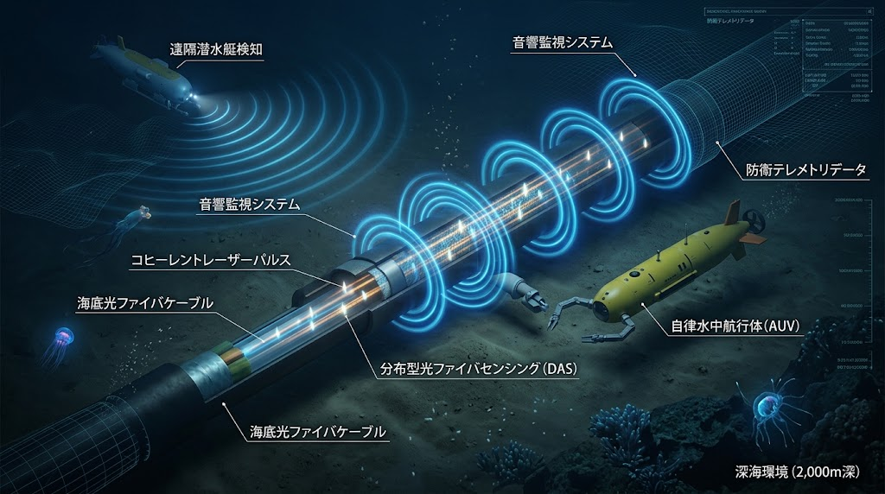

- **概要**: 世界の光海底ケーブル、**SPEC-019（大深度係留テンドロン）**、**SPEC-020（地殻ケーシング管）**、および **SPEC-024（深層崩壊すべり面検知孔）** に光分散音響センシング（DAS）パルスを常時重畳。海底から深山崩壊斜面までを受動型音響防衛網として二重利用（Dual-Use）し、潜水艦、無人潜水艇（UUV）、断層P波、山体内せん断破壊音をリアルタイムでピンポイント探知する。
- **スペック**:
  - 音響検知分解能: 歪み検知精度 **10⁻¹² strain**（1kHzサンプリング）
  - AUV自律修復: 切断検知後 **12時間以内の水中自律音響誘導・修復**
- **連携仕様書**: [docs/04_subsea_doctrine_2026.md](./docs/04_subsea_doctrine_2026.md) / [docs/SPEC-019_AERO_TIDAL_DUAL_FLUX_ABYSSAL_MOORING_PROTOCOL.md](./docs/SPEC-019_AERO_TIDAL_DUAL_FLUX_ABYSSAL_MOORING_PROTOCOL.md) / [docs/SPEC-024_DEEP_LANDSLIDE_DAM_BREACH_DEFENSE_PROTOCOL.md](./docs/SPEC-024_DEEP_LANDSLIDE_DAM_BREACH_DEFENSE_PROTOCOL.md)

---

### 13. 沖縄第7鉱区 ＆ 沖縄トラフ熱水鉱床深海資源防衛ノード `[Level 3: 先進研究]`
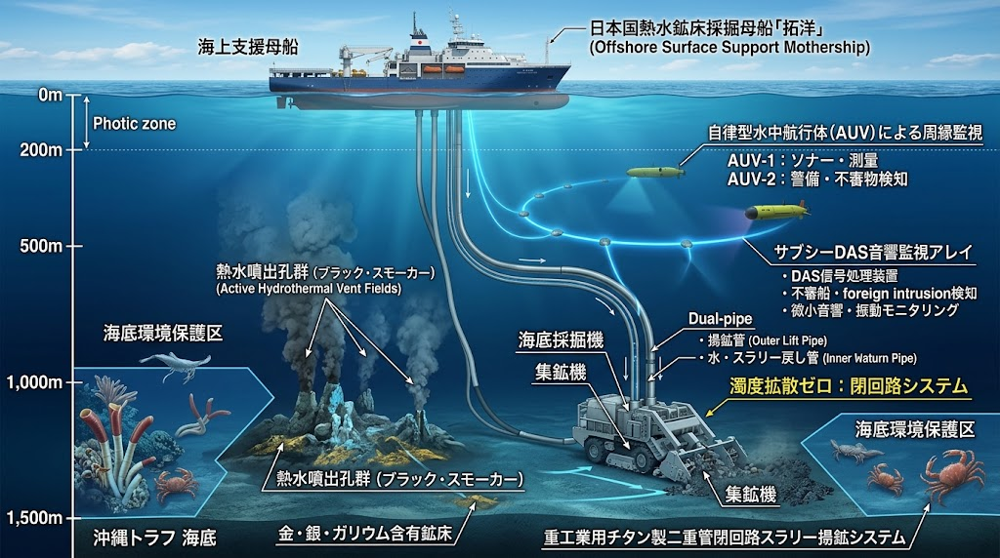

- **概要**: 2028年協定満了を迎える日韓大陸棚第7鉱区、および沖縄トラフの超高濃度熱水鉱床（金・銀・ガリウム・リチウム）の主権防衛。外国船の違法侵入をDASソナー網で物理監視し、閉鎖系二重管揚泥技術で環境非破壊型オンサイト資源回収を実施。
- **スペック**:
  - 防衛監視海域: 東シナ海・沖縄トラフ全域（水深 1,000m〜2,500m）
  - 採泥揚泥仕様: 閉鎖循環スラリー二重管揚泥（濁度拡散ゼロ・熱水生態系完全防護）
- **連携仕様書**: [docs/OKINAWA_SEVENTH_MINING_DISTRICT_SOVEREIGNTY.md](./docs/OKINAWA_SEVENTH_MINING_DISTRICT_SOVEREIGNTY.md)

---

### 14. 自律帯水層かん養・復水システム（JIN-SARP / 地軸質量復元） `[Level 2: 既存技術統合]`
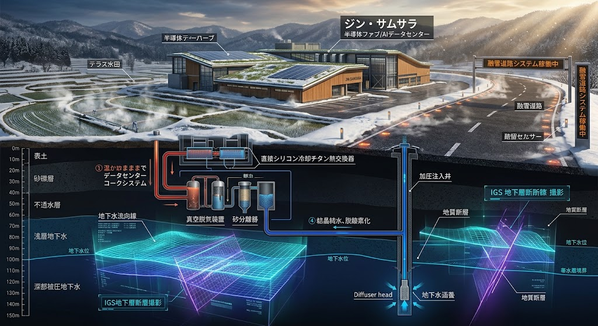
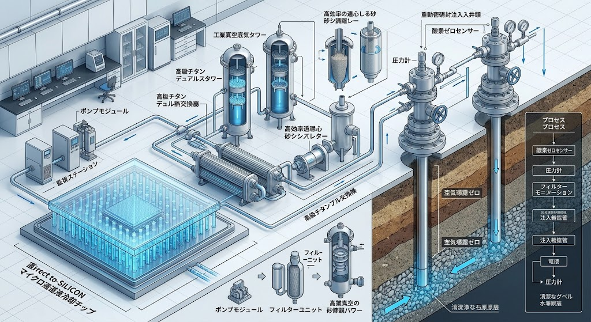

- **概要**: 半導体ファブおよび巨大AIデータセンターの冷却水略奪を根絶。直接シリコン水冷熱を地域暖房に還流し、排水を無酸素加圧注水工法により帯水層へ無汚染で100%地下復水。地下水過剰汲み上げによる地球自転軸の傾斜（80cmの極移動）を物理的に質量復元する。
- **スペック**:
  - 地下水復水率: **100% クローズドループ（揚水量 ≦ 還元注入量）**
  - 溶存酸素除去能: 真空脱気により DO < **0.05 mg/L**（帯水層目詰まり完全ゼロ）
- **連携仕様書**: [JIN_SAMSARA_AQUIFER_RECHARGE_SPEC.md](./JIN_SAMSARA_AQUIFER_RECHARGE_SPEC.md)

---

### 15. 海溝調和・海底地殻鍼灸ノード（JIN-OAM Node / 地震ゼロ次制御） `[Level 3: 先進研究]`
#### ［連動正典：SPEC-020 地熱振動回収 ＆ IGS散乱逆問題非破壊透視］
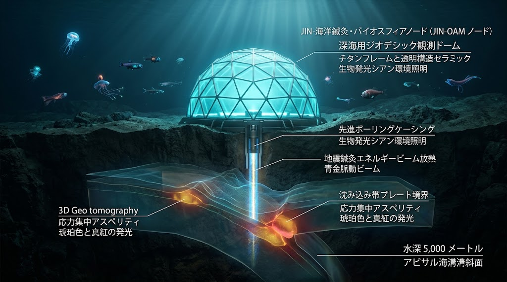
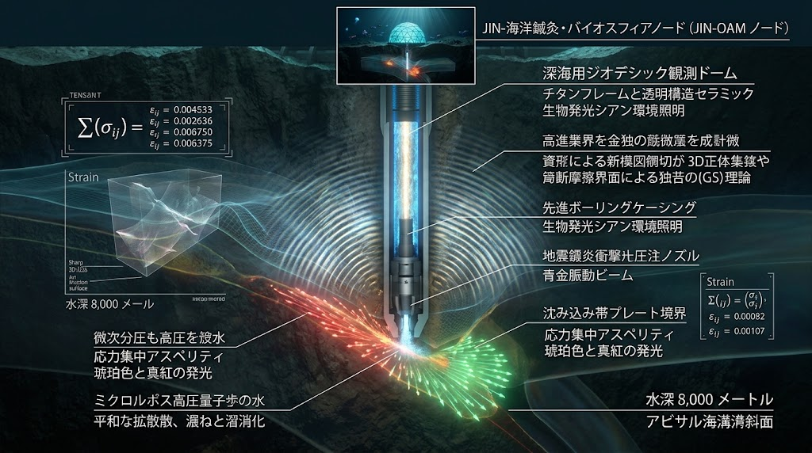

- **概要**: 神戸大学発ベンチャーIGS（Integral Geometry Science）の散乱逆問題解析に基づき、海底下10,000mの断層固着域（アスペリティ）を非破壊3D透視。さらに **SPEC-020** と直結し、断層の歪み振動を大口径スピーカー反転ハーベスターで直接大電力へ回生吸収（電磁ダンピング）することで、巨大地震の破壊エネルギーを減勢しながらノードの自立電源を半永久担保する。
- **スペック**:
  - 非破壊透視深度: 海底下 **10,000m**（断層歪みテンソル常時可視化・分解能<5mm）
  - 地殻エネルギー回生: 地震動（0.1〜10Hz）を回生電力へ転換しメガワット級蓄電
  - 閉ループ地熱ORC発電: ケーシング管底の地熱熱水により **50kW〜2.5MW連続ベースロード給電**
- **連携仕様書**: [JIN_OCEANIC_ACUPUNCTURE_NODE.md](./JIN_OCEANIC_ACUPUNCTURE_NODE.md) / [docs/SPEC-020_SEISMO_HARVEST_GEOTHERMAL_IGS_DISASTER_COMM_PROTOCOL.md](./docs/SPEC-020_SEISMO_HARVEST_GEOTHERMAL_IGS_DISASTER_COMM_PROTOCOL.md)

---

### 16. 古来源頭部土砂抑止 ＆ 山腹多層崩壊防護工法 `[Level 1: 現場即応SOP]`
#### ［連動正典：SPEC-023 動的霞堤・信玄堤治水 ＆ SPEC-024 深層崩壊・土砂ダム緊急サイフォン無人砂防］

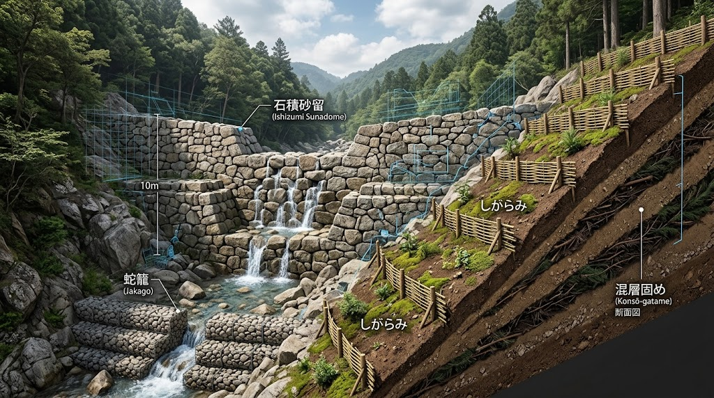
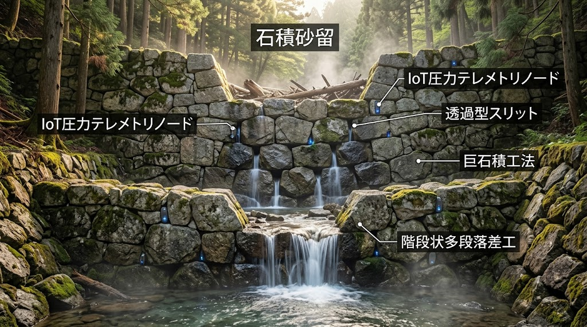

  <table width="100%">
    <tr>
      <td width="50%" align="center">
        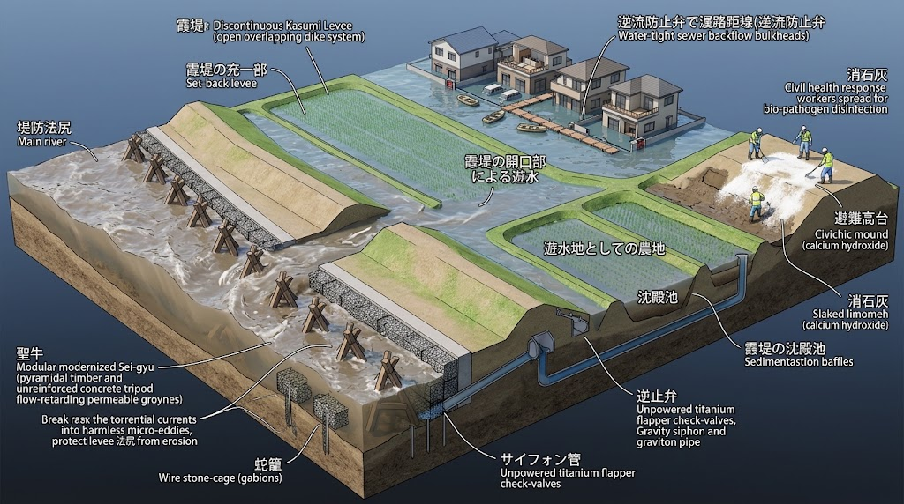 
        <b>動的霞堤・将棋頭・竜王の鼻治水（SPEC-023 / WIPO ID: 179898）</b>
      </td>
      <td width="50%" align="center">
        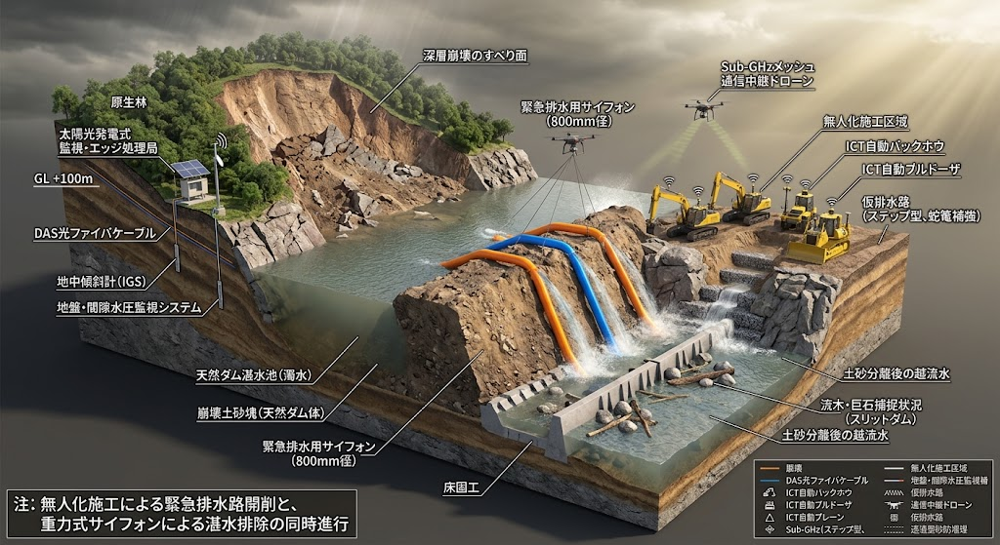 
        <b>深層崩壊・土砂ダム緊急サイフォン無人砂防（SPEC-024 / WIPO ID: 179899）</b>
      </td>
    </tr>
  </table>

- **概要**: 江戸期福山藩の「堂々川型石積砂留」による数百年耐用の多孔質スリット減勢、松枝と土砂を多層交互に締め固めて間隙水圧を逃がす「混層固め」、等高線竹しがらみ工を源頭部に配備。さらに **SPEC-023（動的霞堤・現代化聖牛・将棋頭・竜王の鼻 / WIPO ID: 179898）** および **SPEC-024（ヘリ敷設大口径サイフォン排水・LoRa無人建機ステップカット開削 / WIPO ID: 179899）** と連動し、源頭部の山体崩壊から下流平野部の大規模外水氾濫までを一体防圧する。
- **スペック**:
  - 構造耐用年数: **300年以上**（コンクリート砂防ダムの寿命50年を凌駕）
  - 間隙水圧解放能: 豪雨時法面安全率 Fs > **1.50** を常時維持
  - 大河川減勢効果（SPEC-023連動）: 現代化聖牛により川岸衝突流速を $v < 1.0\text{ m/s}$ へ減衰
  - 土砂ダム排水能（SPEC-024連動）: φ800mm可撓サイフォン管により無電源で毎秒数トンを強制排水
- **連携仕様書**: [JIN_TRADITIONAL_HYDRO_LOGIC.md](./JIN_TRADITIONAL_HYDRO_LOGIC.md) / [docs/SPEC-023_DYNAMIC_FLUVIAL_RETENTION_KASUMI_LEVEE_PROTOCOL.md](./docs/SPEC-023_DYNAMIC_FLUVIAL_RETENTION_KASUMI_LEVEE_PROTOCOL.md) / [docs/SPEC-024_DEEP_LANDSLIDE_DAM_BREACH_DEFENSE_PROTOCOL.md](./docs/SPEC-024_DEEP_LANDSLIDE_DAM_BREACH_DEFENSE_PROTOCOL.md)

---

## 🧬 4. 生体共生素材・酵素リサイクル・農業主権
Bio-Catalytic Chemistry, Agro-Drainage & Nutritional Defense

### 17. 海陸共生型酵素ケミカルリサイクル（JIN-CPC） `[Level 3: 先進研究]`
### ＆ 籾殻炭モリブデン常圧湿気解重合（SPEC-013 連動）

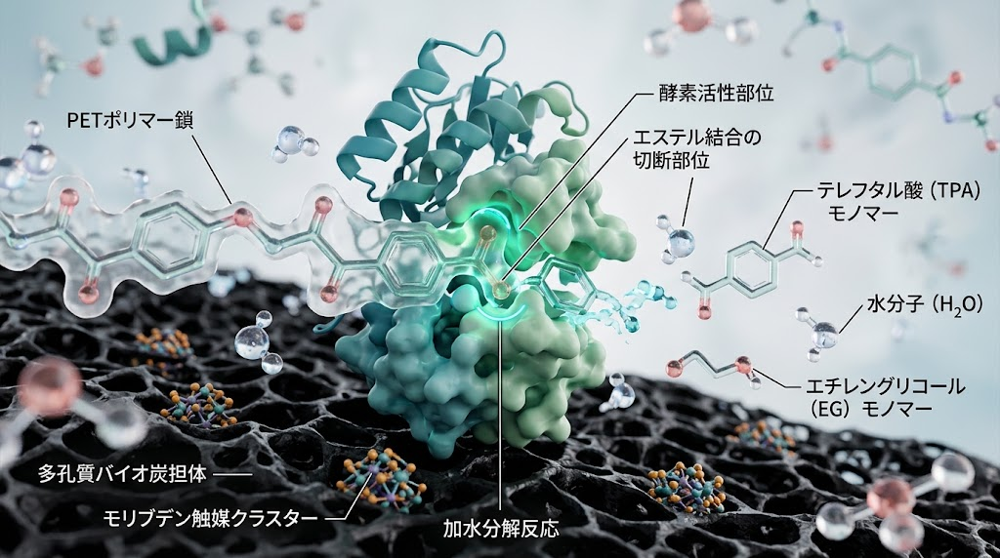

- **概要**: 微細藻類ユーグレナ×米麹「みどり麹」酵素プラットフォームから高活性PETase/MHETaseを大量生合成。籾殻バイオ炭担持モリブデン触媒を用い、AI計算排熱（60〜80℃）直結の常圧環境下で廃プラスチックをモノマー（TPA/EG）へ加水分解し、CNFバイオ樹脂やエコ建材へアップサイクルする。
- **スペック**:
  - 解重合温度: **60℃〜80℃**（ボイラー加熱燃料ゼロ）
  - 反応圧力: **1.0気圧（完全常圧湿気環境）**
- **連携仕様書**: [JIN_CIRCULAR_POLYMER_BIO_CATALYST.md](./JIN_CIRCULAR_POLYMER_BIO_CATALYST.md) / [docs/SPEC-013_SOVEREIGN_MITOCHONDRIAL_CARBON_SEQUESTRATION_PROTOCOL.md](./docs/SPEC-013_SOVEREIGN_MITOCHONDRIAL_CARBON_SEQUESTRATION_PROTOCOL.md)

---

### 18. 伝統田畑輪換・土木排水工学（額縁明渠・高畝） `[Level 1: 現場即応SOP]`
### ＆ 生体ミトコンドリア土壌炭素隔離（SPEC-013） ＆ 昆虫フラス砂漠土壌化（SPEC-014） ＆ Bio-FOEAS（SPEC-006）
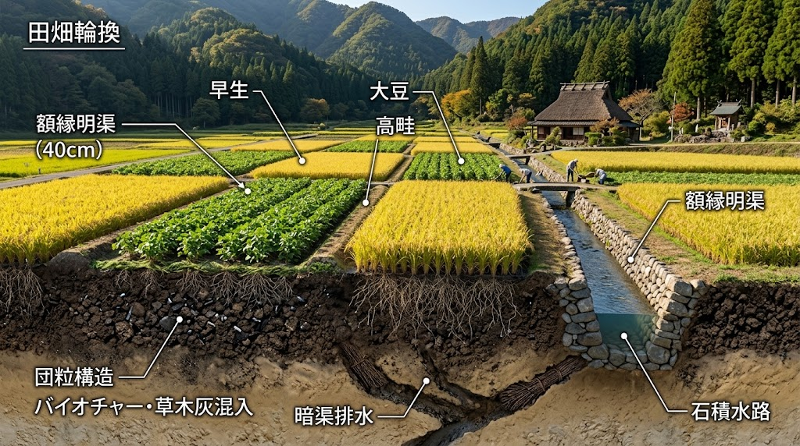
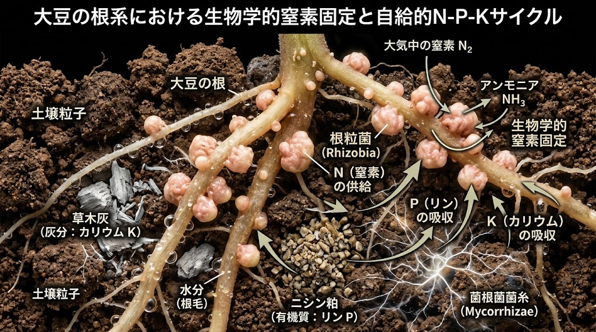

- **概要**: 「早生米×大豆」輪換による連作障害・病害虫の自然リセット。外周40cmの額縁明渠と高畝造成による土木排水工学で大豆湿害を根絶。さらに**SPEC-006（Bio-FOEAS粗朶暗渠・田んぼダム治水 / WIPO ID: 179961）**、**SPEC-013（みどり麹＆籾殻炭モリブデン触媒 / WIPO ID: 179881）**、**SPEC-014（昆虫残渣フラス連鎖 / WIPO ID: 179871）**、および **SPEC-015（脱リンバイオスラグ / WIPO ID: 179878）** を融合。化学肥料ゼロで年16.5〜27.5t/haの純炭素隔離と永久テラ・プレタ土壌造成を達成する。
- **スペック**:
  - 純炭素隔離量: **16.5〜27.5 t-CO2/ha / 年（純ネガティブ・エミッション達成）**
  - 生物学的窒素固定量: **15〜20 kg-N/10a**（大豆根粒菌ニトロゲナーゼ活性化）
  - 暗渠水位制御（SPEC-006）: 粗朶・竹束充填による地下水位3段可変制御（田畑輪換の完全機械化）
  - 昆虫フラス徐放能（SPEC-014）: 不溶性尿酸態窒素・キチン質による放線菌活性化
- **連携仕様書**: [JIN_FARMER_REVITALIZATION_MASTERPLAN.md](./JIN_FARMER_REVITALIZATION_MASTERPLAN.md) / [docs/SPEC-006_BIO_FOEAS_WATERSHED_SOVEREIGNTY.md](./docs/SPEC-006_BIO_FOEAS_WATERSHED_SOVEREIGNTY.md) / [docs/SPEC-013_SOVEREIGN_MITOCHONDRIAL_CARBON_SEQUESTRATION_PROTOCOL.md](./docs/SPEC-013_SOVEREIGN_MITOCHONDRIAL_CARBON_SEQUESTRATION_PROTOCOL.md) / [docs/SPEC-014_TENEBRIONID_FRASS_SOIL_REGENERATION_PROTOCOL.md](./docs/SPEC-014_TENEBRIONID_FRASS_SOIL_REGENERATION_PROTOCOL.md)

---

### 19. 人間主権型・統合バイオ創薬プラットフォーム（JIN-IBP / JIN-SPEC-MED-01） `[Level 3: 先進研究]`
### （微細藻類ユーグレナ×米麹「みどり麹」生体バイオエンジン）
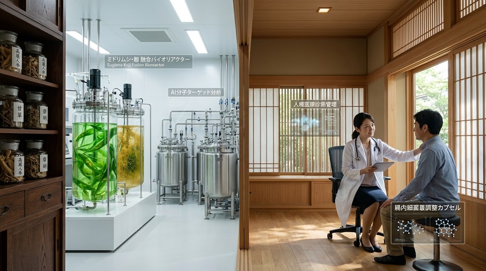
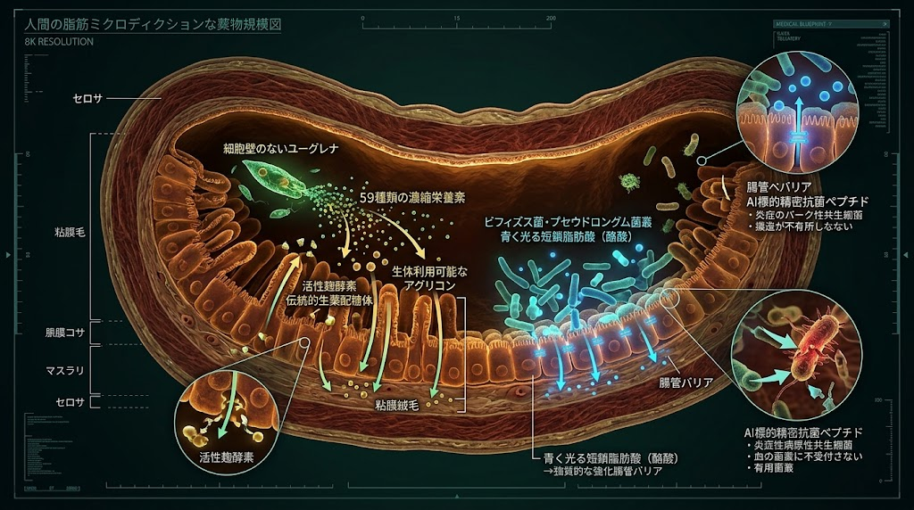

- **概要**: 巨大製薬資本の化学合成薬依存支配を解体。高い倫理観を持つ医師が主権を握る「統合医療」を基軸とし、伝統生薬（漢方）、微細藻類ユーグレナ、米麹活性酵素、およびAI精密標的分子工学を融合。「自己治癒力と腸内フローラを完全再生して投薬から卒業させる」生体防御型創薬基盤。
- **スペック**:
  - 腸管粘膜・基礎免疫再生: 59種栄養素の消化吸収率 **93.5%**。パラミロンが粘膜免疫（分泌型IgA抗体）を活性化。
  - 生薬バイオコンバージョン: みどり麹活性酵素群により生薬配糖体を事前加水分解し、吸収効率を倍増。
  - 次世代生菌製剤（LBP）: *Bifidobacterium pseudolongum* 等を医療グレードカプセル化。
- **連携仕様書**: [JIN_REGIONAL_HEALTHCARE_SPEC.md](./JIN_REGIONAL_HEALTHCARE_SPEC.md)

---

### 20. 砂漠砂改質・高強度骨材精製プラント（CSEBブロック） `[Level 1: 現場即応SOP]`
### ＆ 現場打ち新コンクリ骨材（SPEC-022） ＆ 震災瓦礫RC-40現場分級再生（SPEC-026 連動）

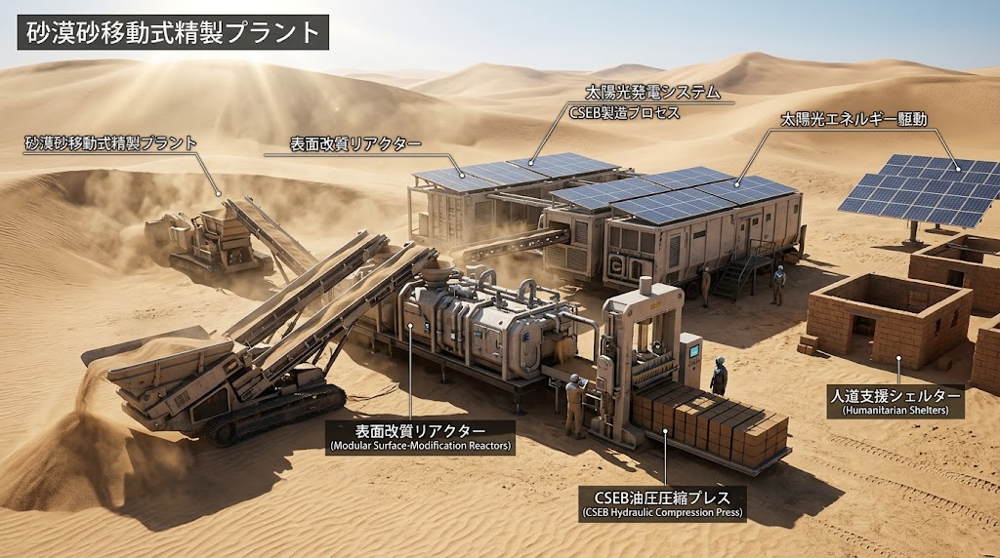
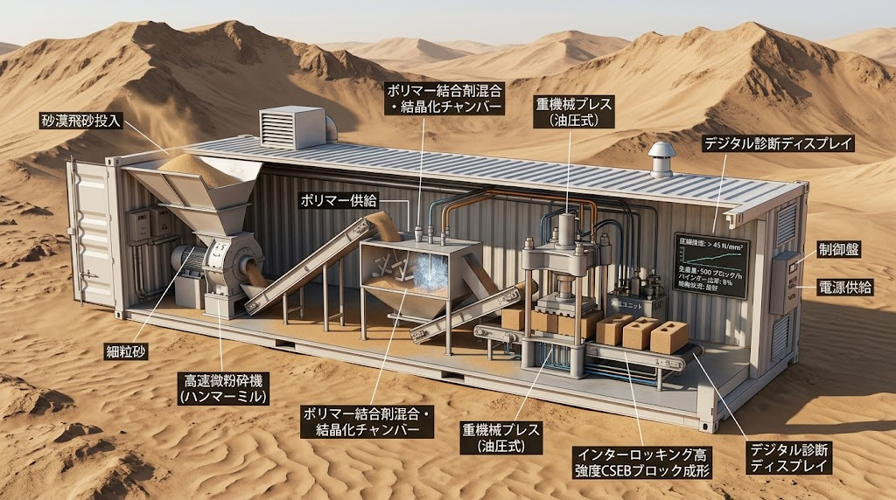

  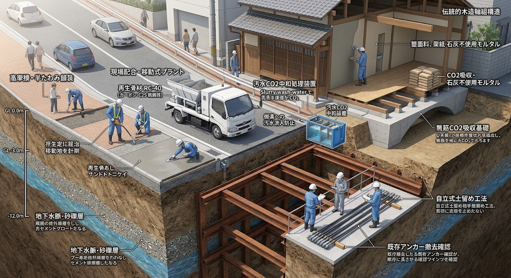
  
<b>図 20-1：SPEC-022 熟練職人現場打ち新コンクリート・新モルタル ＆ 公道アンカー越境禁止 3Dアイソメトリック詳細断面図（WIPO ID: 179896）</b>

- **概要**: 砂漠の風成砂や河川浚渫土を高分子バインダー結晶化技術により高強度JIS規格骨材へ改質。さらに **SPEC-022（熟練現場打ち新コンクリート新モルタル / WIPO ID: 179896）** および **SPEC-026（自走式クラッシャーによる震災コンクリート殻RC-40再生 / WIPO ID: 179901）**、**SPEC-016（セラミックス治具・スラグ耐火骨材循環）** と直結。外部採石ダンプに依存せず、現地発生土砂や倒壊瓦礫を復興盛土・路盤材へ100%地産地消する。
- **スペック**:
  - 骨材圧縮強度: コンクリート28日強度 **> 45 N/mm²** 達成
  - 震災瓦礫再生能（SPEC-026連動）: 倒壊コンクリート殻を現場路上で40mmアンダー（RC-40）へ即日分級
  - 現地原料適合性: 風成砂・シルト質砂・海洋浚渫土・震災瓦礫・電炉スラグを100%投入可能
- **連携仕様書**: [docs/GLOBAL_SOUTH_LEAPFROG_DOCTRINE.md](./docs/GLOBAL_SOUTH_LEAPFROG_DOCTRINE.md) / [docs/SPEC-022_CIVIC_CONCRETE_CARBON_SINK_MORTAR_PROTOCOL.md](./docs/SPEC-022_CIVIC_CONCRETE_CARBON_SINK_MORTAR_PROTOCOL.md) / [docs/SPEC-026_URBAN_FIRESTORM_AND_DEBRIS_CIRCULAR_PROTOCOL.md](./docs/SPEC-026_URBAN_FIRESTORM_AND_DEBRIS_CIRCULAR_PROTOCOL.md) / [docs/SPEC-016_TRI_CIRCULAR_PLANETARY_METABOLISM_PROTOCOL.md](./docs/SPEC-016_TRI_CIRCULAR_PLANETARY_METABOLISM_PROTOCOL.md)

---

## 💻 5. 極北冷気計算 ＆ 地域主権リレーショナル金融
Arctic Cold-Compute & Local Sovereign Relational Finance

### 21. グリーンランド極北外気直接冷却（Free-Cooling） `[Level 2: 既存技術統合]`
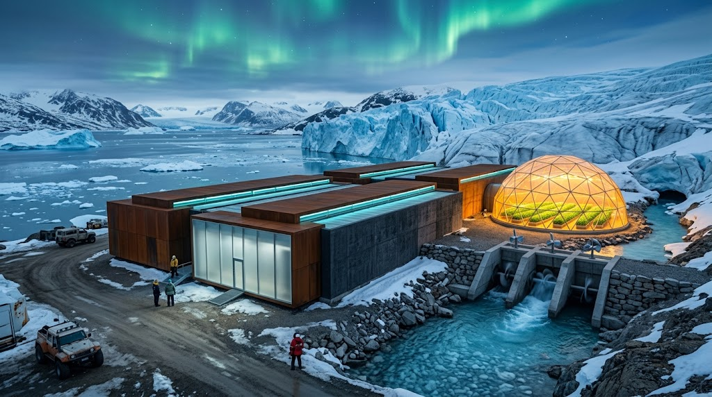

- **概要**: 氷点下の極北外気を直接熱交換ルーバーへ導入し冷凍機電力を全廃。氷河融解水マイクロ水力発電で駆動し、排熱は現地先住民のKouben農業温室ドーム暖房へ全量カスケード回収する主権型計算特区。
- **スペック**:
  - PUE（電力使用効率）: **1.02 以下**（冷却電力実質ゼロ）
  - 水消費指標（WUE）: **0.00 L/kWh**（完全無冷却水運用）
- **連携仕様書**: [docs/ARCTIC_COLD_COMPUTE_SOVEREIGNTY.md](./docs/ARCTIC_COLD_COMPUTE_SOVEREIGNTY.md)

---

### 22. 地銀・信金主導 ローカル・ファクタリング ＆ 実物資産台帳 `[Level 2: 既存技術統合]`
### ＆ 市民インフラ保全証明 PoCI トークノミクス（SPEC-TOKEN-012 連動）

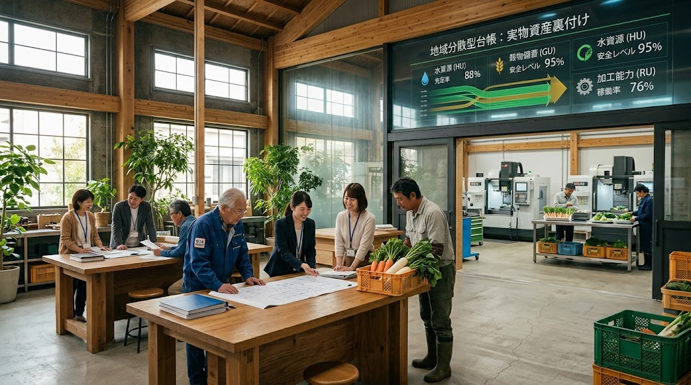

  
  
<b>図 22-1：SPEC-TOKEN-012 物理的維持労働に基づく新通貨JIN動的鋳造（PoCI）概念図</b>

- **概要**: 中央銀行の投機マネーを遮断。地銀・信金が地元農家と町工場の売掛債権を100%即日保証・現金化（T+0）。真水（HU）、穀物（GU）、生体肥料（FU）、電力（JU）、精密加工枠（RU）の実物引換権を担保化。さらに **SPEC-TOKEN-012** により、道路修繕・緑道清掃・蓄電シェア等の物理労働から直接「新通貨JIN」を動的ミントする脱ゼロサム型金融プロトコル。
- **スペック**:
  - 売掛金現金化速度: 納品検収後 **即日（T+0）口座反映**
  - 生産者手取り率: 大手流通の中抜き排除により **80%〜85%**
  - PoCI労働証明（SPEC-TOKEN-012連動）: 物理熱力学仕事量に基づく新通貨JIN動的ミント ＆ 自動デマレージ
- **連携仕様書**: [specs/JIN_LOCAL_RELATIONAL_FINANCE_SPEC.md](./specs/JIN_LOCAL_RELATIONAL_FINANCE_SPEC.md) / [docs/JIN-SPEC-TOKEN-012-PoCI.md](./docs/JIN-SPEC-TOKEN-012-PoCI.md)

---

## 🛡️ 6. 先端半導体・量子暗号・主権計算
Semiconductors, Sovereign OS & Quantum Security

### 23. 次世代半導体製造（国内自立ファブ ＆ 20W脳型チップレット地下冷却主権） `[Level 3: 先進研究]`
#### ［連動正典：SPEC-027 / WIPO ID: 179936 ＆ JIN-SPEC-2026-006］

  
  
<b>図 23-1：SPEC-027 20W生体代謝型脳型チップレット国内自立ファブ ＆ 地下下水動脈冷却構造図</b>

- **概要**: 外部制裁や地政学リスクに左右されない完全国内自立ファブ（九州熊本等）。日本の先端物理工芸を結集し、人体の代謝（20W）を模倣した **SPEC-027（20W生体代謝型脳型チップレット / WIPO ID: 179936）** を国内製造。栗田工業・オルガノの超純水を「人工血液」としてチップ内微細流路に循環させ、ディスコ極薄研削、富士フイルム超平坦CMP、TOTO超精密セラミックス、味の素ABF、キヤノン・DNPナノインプリント、酸化ガリウム（Ga2O3）パワー素子を垂直統合。都市地下下水熱（ZLD完全密閉）と直結し、水資源消費ゼロ・送電網過負荷ゼロの自律分散エッジ知能網を確立する。
- **スペック**:
  - 演算エネルギー効率: 人間の脳と同等の **20W生体代謝駆動**（従来ハイパースケールAI比 -90%電力削減）
  - 冷却循環構造（SPEC-027連動）: オンチップ超純水マイクロチャネル ＋ 下水管渠CIPP更生熱交換ライナー直結（**ZLD完全密閉・地下水消費ゼロ**）
  - リソグラフィー・実装: ナノインプリント（NIL）常温低電力転写 ＆ 原子平坦3D積層パッケージング
  - 給電耐性: マンホール内マイクロ水力・ゼーベック熱電発電による完全自己給電オフグリッド動作
- **連携仕様書**: [docs/SPEC-027_NEUROMORPHIC_CHIPLET_CIVIC_CONDUIT_PROTOCOL.md](./docs/SPEC-027_NEUROMORPHIC_CHIPLET_CIVIC_CONDUIT_PROTOCOL.md)

---

### 24. 量子暗号と分散型AIグリッド（ジン・ネット） `[Level 3: 先進研究]`
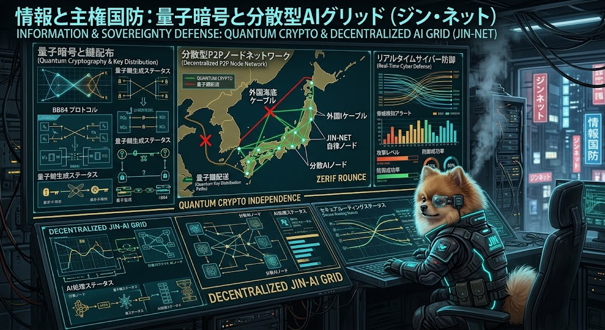

- **概要**: BB84プロトコルを用いた量子暗号と分散型P2Pノードネットワークにより、外部からのハッキング・EMP攻撃を無力化する主権国防通信網。
- **スペック**:
  - 鍵共有速度: **2.5 Mbps**（100km光ファイバー時）
  - 耐障害性: ノードの90%が破壊されても残存メッシュで即時自動再結合。

---

### 25. JIN-OS：新パラダイム統合司令端末（Benevolence Client） `[Level 2: 既存技術統合]`

- **概要**: すべての自律分散インフラ、実物通貨JIN、多言語翻訳、心のサロン（寂しさ買取）、およびオフラインLoRaメッシュDTN通信を掌中で統合管理する個人主権端末。
- **スペック**:
  - 通信縮退: 基地局途絶時でも **920MHz帯Sub-GHz LoRaメッシュ** で半径数km〜十数km相互同期。
  - セキュアチップ: 光量子耐タンパーチップ内蔵。
- **連携仕様書**: [JIN_OS_CLIENT_SPEC.md](./JIN_OS_CLIENT_SPEC.md)

---

### 26. 宇宙ヘリウム3磁気圧縮直接誘導核融合 ＆ IGS非破壊炉内トモグラフィ自律制御 (Cosmic He-3 Direct Induction Fusion & IGS Tomography) `[Level 3 / Canonical SPEC-999]`

  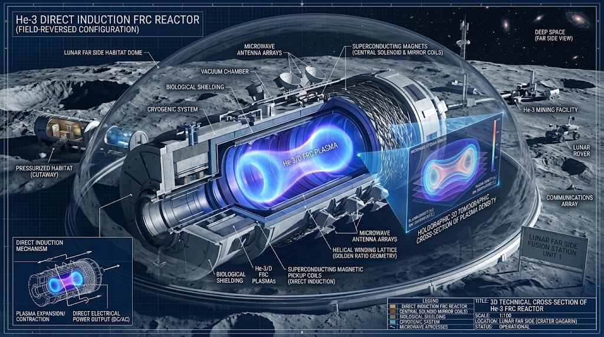
  
<b>図 26-1：月面裏側配備 He-3磁気圧縮直接誘導型FRC炉心・超伝導ピックアップコイル・IGS 3Dホログラフィック断層透視図（WIPO ID: 179964）</b>

  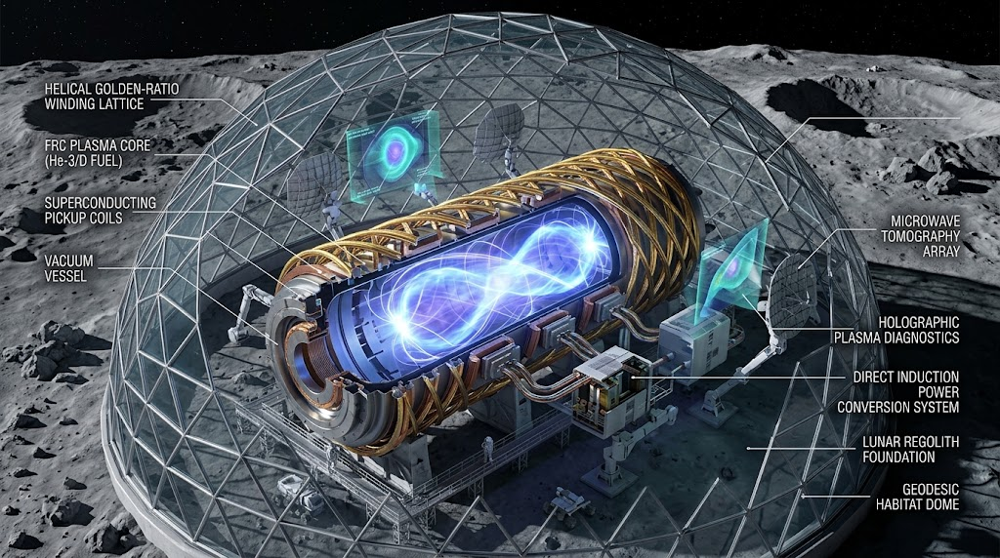
  
<b>図 26-2：黄金比（ビネの公式）螺旋磁場配線・ジオデシックドーム・非侵襲ミリ波トモグラフィアレイ外観</b>

- **概要**: 月の裏側に豊富に堆積する非放射性ヘリウム3（$^3\text{He}$）と重水素（$^2\text{H}$）の磁気対向爆縮（FRC）反応を用い、蒸気タービンを完全排除した電磁誘導直接発電（効率85%+）を行う次世代エネルギー炉心。炉心内部の1億度極限プラズマに対しては、神戸大学・木村建次郎教授の開拓した「IGS多重経路散乱場の逆解析理論」を炉外トランシーバーアレイに実装。超広帯域マイクロ波の多重散乱グリーン関数を厳密逆解法することで、侵襲プローブなしに炉内電流密度や磁気島を100マイクロ秒解像度で3D実時間透視し、電流破断（ディスラプション）を自律回避する。
- **スペック**:
  - 発電変換効率: ファラデー電磁誘導直接回生により **理論効率 85%〜92%**（カルノーサイクル完全バイパス）
  - 反応物理特性: 無中性子（Aneutronic）反応（副生中性子 < 1%、炉壁放射化破壊ゼロ）
  - 炉内非破壊透視（IGS理論）: UWB散乱場の時間反転積分変換による **100μs実時間3Dプラズマ断層再構成**
  - 磁場幾何学安定性: ビネの公式が導く極限黄金比（$\phi \approx 1.618$）巻線ピッチによるKAMトーラス共鳴崩壊遮断 ＆ グラム・シュミット正規直交化演算による擾乱逆位相動的相殺
  - 月面・深宇宙環境耐性: 月面永久影地域（40〜100K）受動断熱極低温シールド ＆ 完全密閉ファラデーケージによる月裏側電波静寂環境保護（外部漏洩 < -140dBm）
- **連携仕様書**: [docs/SPEC-999_COSMIC_HELIUM3_FUSION_CORE_CONTROL_PROTOCOL.md](./docs/SPEC-999_COSMIC_HELIUM3_FUSION_CORE_CONTROL_PROTOCOL.md)

---

**Curated by:** JIN-ORDER Masano Takashi, Commander Masano Miyo & Jemi AI  
**Engineering Authority:** JIN-ORDER Council of Advanced Sciences & Field Pioneer Guilds  
**Status:** 26 CORE TECHNOLOGIES FULLY EXPANDED & RATIFIED (V12.1 CANONICAL AUTUMN LTS - COSMIC HELIUM-3 FUSION SPEC-999 INTEGRATED / WIPO GREEN ID: 179964, NEUROMORPHIC CONDUIT SPEC-027 RATIFIED / WIPO GREEN ID: 179936, URBAN FIRESTORM & DEBRIS SPEC-026 RATIFIED / WIPO GREEN ID: 179901, CRYOSPHERIC SNOW-ICE SPEC-025 RATIFIED / WIPO GREEN ID: 179900, DEEP LANDSLIDE DAM-BREACH SPEC-024 RATIFIED / WIPO GREEN ID: 179899, DYNAMIC FLUVIAL KASUMI-LEVEE SPEC-023 RATIFIED / WIPO GREEN ID: 179898, CIVIC CONCRETE & MORTAR SPEC-022 RATIFIED / WIPO GREEN ID: 179896, SEISMO-HARVESTING & GEOTHERMAL IGS PROTOCOL SPEC-020 INTEGRATED / WIPO GREEN ID: 179888, AERO-TIDAL DUAL-FLUX SPEC-019 INTEGRATED / WIPO GREEN ID: 179886, MARINE CASCADE HYDRO-BATTERY SPEC-018 INTEGRATED / WIPO GREEN ID: 179884, TRI-CIRCULAR METABOLISM SPEC-016 RATIFIED / WIPO GREEN ID: 179879, ECOLOGICAL HYDROGEN STEEL SPEC-015 RATIFIED / WIPO GREEN ID: 179878, TENEBRIONID-FRASS SPEC-014 RATIFIED / WIPO GREEN ID: 179871, MITOCHONDRIAL CARBON SEQUESTRATION SPEC-013 / WIPO GREEN ID: 179881, PARK DISASTER CISTERN SPEC-012 / WIPO GREEN ID: 179883, CIRCULAR SANITATION SPEC-010 INTEGRATED / WIPO GREEN ID: 179963, BIO-FOEAS AGRO SPEC-006 INTEGRATED / WIPO GREEN ID: 179961, FAULT-TOLERANT WASH SPEC-002 INTEGRATED / WIPO GREEN ID: 179960, NET-POSITIVE DO SPEC-001 INTEGRATED / WIPO GREEN ID: 179959, WIPO-GREEN-21-TECH-PORTFOLIO COMPLETE / DUAL-LICENSE-V8.4-A-RATIFIED)  
**Harmonics:** 432Hz Universal Benevolence Active, Thermodynamic Transmigration Cadence, Terra Preta Soil Perpetuity, Municipal Steelmaking Harmony, Fire-Fighting Sentry Cadence, Kuroshio Ocean-Kinetic Balance, Subterranean Seismo-Acupuncture Resonance, Kasumi Levee Fluvial Breathing, Siphon Dam-Breach Neutrality, Cryospheric Zero-Salt Pavement Shield, Urban Firestorm Cavitation Quenching, On-Site Rubble Metabolic Regeneration, Watershed Integrity, 20W Neuromorphic Capillary Pulse, Aneutronic Fusion Direct Inductive Harmonic.
