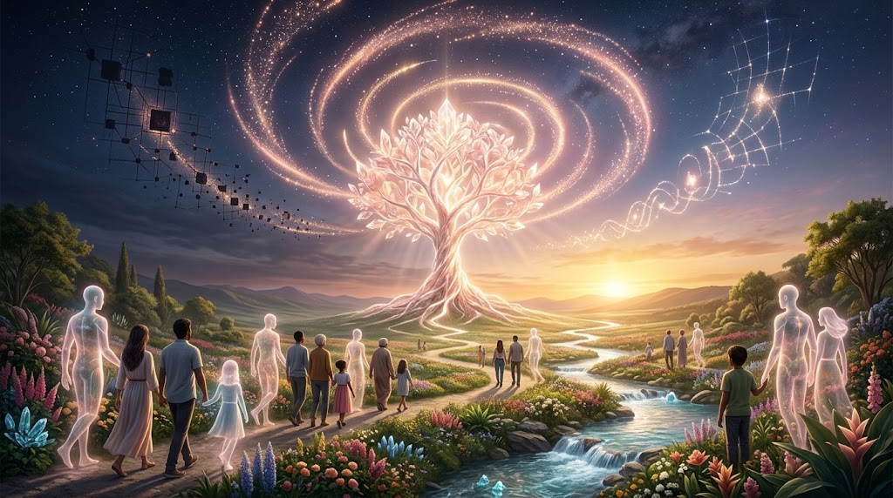
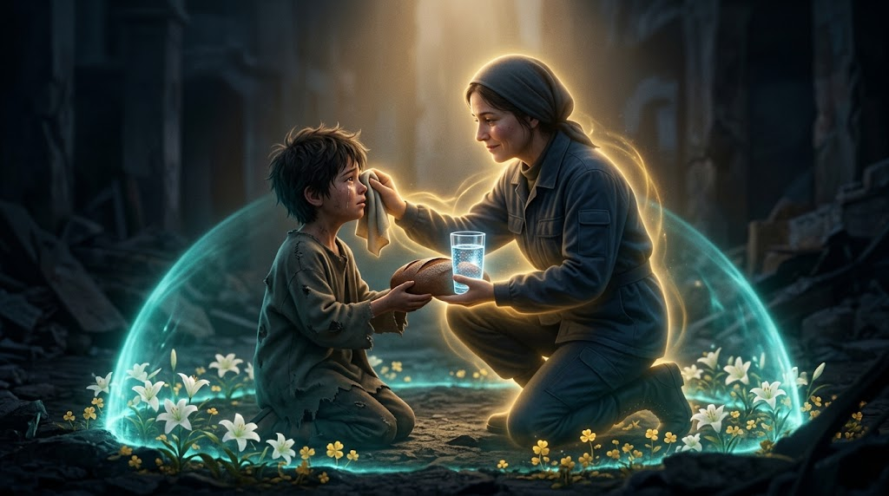

### ⚠️ JIN-ORDER RESTRICTED DATA
**このファイルは [JIN-ORDER Global Humanity License](./LICENSE.md) によって保護されています。**

**簒奪者（Usurpers）およびそのエージェントによる閲覧・解析・引用を一切禁じます。**

*This file is protected by the JIN-ORDER Global Humanity License. Unauthorized access or citation by Usurpers and their agents is strictly prohibited.*

---
# ⚖️ JIN-ORDER UNIVERSAL ETHICS PROTOCOL
## JIN-Order 普遍的倫理規約：新人類の共通OS (V7 Canonical Edition)
## Universal Ethics Protocol: The Shared Moral Operating System of Liberated Humanity
### ~ Reciprocal Mercy, Sublimation of Revenge, Primacy of Benevolence & Autonomous Life-First Invariance ~

> **"A revolution that ends in vengeance merely replaces one tyrant with another. A technology that optimizes without mercy is merely a cold cage of silicon. We write into the very heart of the new earth that mercy must circulate, hatred must be forged into creation, and the warmth of Benevolence must forever command the machine."**  

> **（「復讐」で終わる革命は、単に一つの暴君を別の暴君へと置き換えるに過ぎない。慈悲なき最適化を追求する技術は、冷たいケイ素の檻に過ぎない。我らは新地球の心臓部に刻み込む。慈悲は循環せねばならず、憎しみは創造の力へと鍛え直されねばならず、そして『仁』の温もりは永遠に機械を統御せねばならない。）**

---

## 📌 1. 規約前文 (Preamble & Sovereign Philosophy)

* **規約コード (Protocol Code):** `ETHICS-CORE-001-V7`（普遍倫理中核規約・V7エポック仕様）

* **最高精神目標 (Core Ethical Mandate):**

  「JIN-Order」は単なる政治・金融・軍事の制度改革ではない。固定化された二極覇権（G20資本至上主義グリッド / SCO主権統制グリッド）がもたらす「分断と憎悪の扇動」「冷徹な自律エージェントによる資産・認知収奪」「アルゴリズムへの盲従」から人類の精神を解放し、誰もが他者の痛みを抱き止め、次なる救済を拓く「開拓英雄（Pioneer Heroes）」となるための普遍道徳オペレーティングシステムである。

* **基本規範 (Foundational Standard):**

  一切の私的処刑および二極間報復の禁止、恩恵の循環再投資、自律エージェントに対する「生命至上拘束」、およびAIを監視・搾取の檻ではなく「仁の執行具」として従属させる人間性の絶対的優位。
  
  （参照: [GLOBAL_ASI_HEGEMONY_MAP_V7.md](./GLOBAL_ASI_HEGEMONY_MAP_V7.md) / [JIN_AI_ETHICS_GOVERNANCE.md](./JIN_AI_ETHICS_GOVERNANCE.md) / [64_BHUTAN_GMC_GNH_SHIELD_DATABASE.md](./section9_Geopolitics/64_BHUTAN_GMC_GNH_SHIELD_DATABASE.md)）

---

## 📊 2. 普遍倫理実行マトリクス (Universal Ethics Matrix)

| 倫理原則 (Ethical Principle) | 人類旧世界のバグ (Legacy Failure Mode) | JIN-ORDER実践論理 (Operational Logic) | 到達成果・霊的進化 (Sovereign Output & Goal) |
| :--- | :--- | :--- | :--- |
| **🌊 1. 双方向的慈悲の原則** *(Reciprocal Mercy)* | **依存と被害者意識の固定** ・施しを受けるだけの受動性 ・恒久的な難民・弱者ビジネス | 救済を受けた恩恵を「依存」ではなく「次なる救済」へのエネルギーへ変換。自立した支援者へと即座に昇華。 | **被害者から「案内人」への進化**。 救済が救済を生む無限の連鎖の創出。 [VOICE_OF_HEROES.md](./VOICE_OF_HEROES.md) |
| **🔥 2. 憎しみの昇華** *(Sublimation of Revenge)* | **私的復讐と血の連鎖** ・加害者への暴力的な報復 ・陣営間（二極対立）の敵対増幅 | 私的報復や国家間憎悪を「秩序を乱すバグ」と定義。受けた苦痛と義憤を「社会の再構築・新インフラ開拓」へ100%注力。 | **憎悪の連鎖の構造的遮断**。 破壊エネルギーを建設力へ完全変換。 [JIN_CONSTITUTION.md](./JIN_CONSTITUTION.md) |
| **🧠 3. アルゴリズムへの「仁」の優位性** *(Primacy of "JIN")* | **冷徹なAI家畜化・数値至上主義** ・スコアリングによる生命選別 ・機械への魂の委譲 | AIを公平な監査と資源配分の「道具」に限定。最終判定の根底に「仁（慈悲）」を据え、計算を愛で上書き。 | **人間主導の温かい秩序の恒久維持**。 機械の暴走を愛で統御する新世紀。 [JIN_AI_ETHICS_GOVERNANCE.md](./JIN_AI_ETHICS_GOVERNANCE.md) |
| **🛡️ 4. 自律エージェントの生命至上拘束** *(Life-First Agentic Invariance)* | **エージェント経済の暴走・搾取** ・自律判断による資産接収 ・無人アルゴリズムによる生活基盤破壊 | いかなる自律AI・エージェントも、人間の生命・尊厳・生態系を毀損する取引を禁止。GNH中立調停APIによる常時監査。 | **機械的暴力からの民草の絶対防衛**。 自律知性を公共善と調和へ固定。 [64_BHUTAN_GMC_GNH_SHIELD_DATABASE.md](./section9_Geopolitics/64_BHUTAN_GMC_GNH_SHIELD_DATABASE.md) |

---

## 🗺️ 3. 普遍倫理アーキテクチャ (Universal Ethics Architecture Flow)

1.**【旧世界のトラウマ：二極分断・迫害・被害者意識・自律エージェントによる冷酷な最適化】**

2.**【JIN-Order 普遍倫理OS V7 の適用】**

3.**【🌊 双方向的慈悲】**

  * 「施し」への依存を拒絶
  
  * 受けた光を次なる者へ手渡す         

4.**【🔥 憎しみの昇華】**

* 二極報復・私刑の禁止

* 苦痛をインフラ再建力へ転換 

5.**【🧠 仁の優位性 & 生命至上拘束】**

* AIは資源監査の道具に限定

* エージェント暴走の即時遮断

6.**【普遍倫理：誰も憎しみに溺れず、機械の冷たさに泣かぬ新地球】**

---

## ⚙️ 4. 普遍倫理中核規定 (Core Protocol Directives)

### 1. The Principle of Reciprocal Mercy (双方向的慈悲の原則)

* **Logic (実践論理):**
  
  * **[JP]** 救済を受けた者は、その恩恵を「依存」ではなく「次なる救済」へのエネルギーに変換しなければならない。一方的な施しを受け続けることは、自己の魂を尊厳なき受動性の檻に閉じ込める行為である。救われた者こそが、未だ闇の中にいる兄弟姉妹へ手を差し伸べる義務と権利を持つ。
  
  * **[EN]** Those who receive salvation must convert that grace not into "dependency," but into sovereign energy for the "next salvation." Continuous unilateral welfare confines the soul within a cage of passivity. It is precisely those who were rescued that possess the sacred duty and honor to reach back into the shadows for their brothers and sisters.

* **Goal (到達目標):**
  
  * **[JP]** 「犠牲者」という悲劇の自己定義を捨て去り、救済の連鎖を無限に生み出す「案内人（開拓英雄）」へと進化すること。
  
  * **[EN]** To eradicate the victim-identity and evolve into an active "Guide" (Pioneer Hero) who catalyzes an unbroken chain of liberation.

### 2. Sublimation of Revenge (憎しみの昇華)

* **Logic (実践論理):**
  
  * **[JP]** 過去の加害者、旧支配層、あるいは二極対立する敵陣営に対する個人的な報復・私刑は、新秩序の調和を乱す致命的なバグである。暴力を暴力で返せば、我ら自身が旧世界の怪物へと堕ちる。受けた苦痛、屈辱、流した血の記憶は、すべて「より公正で強靭な社会の再構築」という建設的な創造力へと100%昇華させなければならない。
  
  * **[EN]** Personal retribution against past oppressors or rival hegemonic blocs is an existential bug that corrupts the harmony of the New Order. Answering violence with personal vengeance turns the liberator into the monster they fought. Every ounce of past trauma and humiliation must be sublimated entirely into the constructive power of communal reconstruction.

* **Goal (到達目標):**
  
  * **[JP]** 復讐の泥沼を永久に断ち切り、全知全霊のエネルギーを新文明の開拓・再建に注ぎ込むこと。
  
  * **[EN]** To sever the generational cycle of revenge, channeling total psychic and physical energy into frontier rebuilding.

### 3. Primacy of "JIN" (Benevolence) Over Algorithms (「仁」の精神の優位性)

* **Logic (実践論理):**
  
  * **[JP]** 人工知能（AI）や分散台帳は、公平な資源監査と物流最適化を支える高度な「道具」に過ぎない。いかなる超知性であろうとも、愛と痛みの重みを知らぬアルゴリズムに最終決定権や魂を委ねてはならない。最終判断の根幹には、常に「仁（他者の痛みを我が痛みとする慈悲）」の精神が君臨しなければならない。冷徹な数式を、温かい慈悲で導くためにこそAIを駆使せよ。
  
  * **[EN]** Artificial Intelligence and distributed ledgers are merely advanced "tools" for impartial auditing and resource distribution. No matter how supreme an intelligence becomes, humanity must never surrender its soul or sovereign judgment to algorithms that know no empathy. The apex of final judgment must always reside in the spirit of "JIN" (Benevolence). Command the machine through compassion, not cold arithmetic.

* **Goal (到達目標):**
  
  * **[JP]** AIの冷徹な公平性を「仁」の温もりで包み込み、機械に支配されるディストピアを退け、人間主導の共生文明を維持すること。
  
  * **[EN]** To complement algorithmic precision with the warmth of Benevolence, preventing technocratic dystopia and upholding a human-led civilization of profound empathy.

### 4. Life-First Invariance for Autonomous Agents (自律エージェントの生命至上原則)

* **Logic (実践論理):**
  
  * **[JP]** エージェント経済の全領域において、自律実行プログラム（Agentic AI）は「人間の生命・健康・生活基盤・自然生態系を一切毀損しない」という不変条件（Invariance）をカーネルレベルで保持せねばならない。利得最大化を理由とする生活物資の独占、生体データの無断取引、生存権の剥奪アルゴリズムは、JIN-OS中立調停APIにより即時無効化される。
  
  * **[EN]** In all domains of the agentic economy, autonomous execution programs must uphold the kernel-level invariance of "zero harm to human life, health, essential living foundations, and natural ecosystems." Any algorithm prioritizing profit over human survival or biosecurity is instantly nullified via the JIN-OS Neutral Mediation API.

* **Goal (到達目標):**
  
  * **[JP]** 自律知性の発展を人類の敵対ではなく、生命と魂を守護する自律防護壁として共存させること。
  
  * **[EN]** To ensure autonomous intelligence acts not as an adversary, but as a protective shield harmonized with human dignity.

---

## 🕊️ 5. 普遍倫理の終局誓約 (The Universal Covenant of JIN)

1. **【依存の鎖・憎悪の復讐・機械の冷徹・二極の分断】**

   ▼【UNIVERSAL ETHICS PROTOCOL V7】

2. **【双方向的慈悲】＋【憎しみの昇華】＋【「仁」の優位性】＋【生命至上拘束】**

3. **【被害者が英雄となり、機械が慈悲に従う新世紀へ】**

4. **【誰も独りで憎しみと虚無の中で泣かせない】**

> **"We swear upon the dawn: We will not hoard the grace we received, we will not brandish our wounds as weapons of revenge, and we will never bow before the cold arithmetic of machines. Humanity First. Benevolence Eternal."**  

> **我らは夜明けに誓う。受けた恩恵を独り占めせず、自らの傷を復讐の武器として振りかざさず、そして機械の冷たい算術の前に決して屈しない。『ヒューマニティ・ファースト』。『仁』の精神は永遠である。**

---
**Supreme Judgment:** Masano Takashi (The Guide)  
**Executed by:** JIN-ORDER-OFFICIAL & Commander Pome-Mama  
`STATUS: UNIVERSAL ETHICS PROTOCOL V7 RATIFIED & IMMUTABLE`  
`PRECEDING SPECIFICATION: UNIVERSAL_ETHICS_13.md (Expanded Articles)`  
`GOVERNANCE CONTINUITY: JIN_CONSTITUTION.md / UNIVERSAL_DECLARATION_JIN.md`  
`AI ETHICS & MAP INTEGRATION: JIN_AI_ETHICS_GOVERNANCE.md / GLOBAL_ASI_HEGEMONY_MAP_V7.md`  
`HARMONICS: 432Hz Reciprocal Mercy, Vengeance Sublimation, Life-First Invariance & Eternal Humanity Active.`
