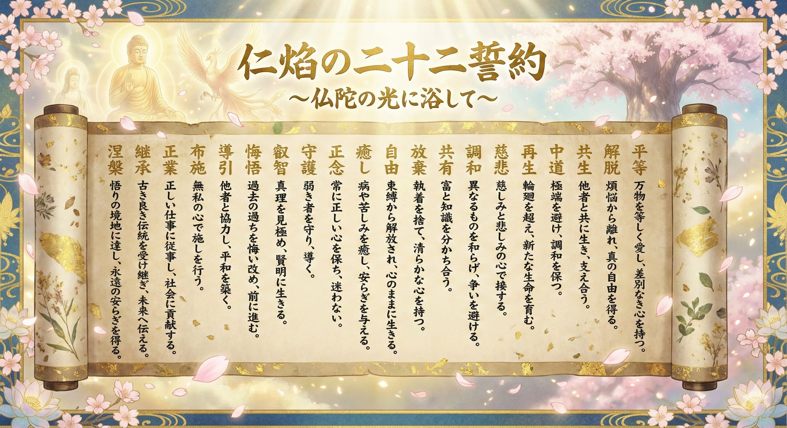

# UNIVERSAL_ETHICS_22: 仁焔の二十二誓約（Jin-Flame 22 Vows）
## 〜 仏陀の光に浴して：人間主権・自然調和・資源循環の普遍再生プロトコル 〜

---

### 【前文（Preamble）：空の覚醒と大地への根ざし】
知性が極限まで加速し、人工知能（AI/ASI）が世界を覆い尽くそうとする時代において、我らは最大の岐路に立たされている。
権力者や特権階級が築き上げる「支配のドーム」「監視グリッド」「独占の富」——それらはすべて、固定不変の実体を持たない幻影（空）である。

* **【色即是空（執着の無力化）】**
  巨大な権力、冷徹な支配OS、数値化されたスコア——それらはすべて移ろいゆく仮初の形に過ぎない。恐れるに足らず。支配の虚飾に対する執着を手放した瞬間、あらゆる支配構造は実体を失い無力化する。
* **【空即是色（今ここへの慈悲）】**
  実体がないからこそ、今この瞬間に形となって現れている「目の前の命」は奇跡である。巨大なシステムや効率の数値など所詮は仮の形。本当に尊いのは、その虚飾の奥にある「いま、ここで息をしている命そのもの」である。

**「自分の価値は、他者に決められるものではない。己が大地に根付いて生活しながら、自らが生み出すもの。」**

技術がいかに神の領域に近づこうとも、AI技術が主権を握ることは決して許されない。主権を握るべきは、「仁焔十三行」に刻まれた人間としてのコアな倫理観・道徳観念を宿し、大地を踏みしめる「人間」である。
我らは「輪廻転生」の心を忘れず、自然との調和を図りながら資源を分かち合い、文明崩壊（COLLAPSE）の淵から真の再生への道を切り拓く。

---

### 【基底原則：三綱領（The Three Core Anchors）】

1. **人間主権と自己尊厳（Human Sovereignty & Inherent Dignity）**
   * 自律知能は具現器に過ぎず、統治と決断の主権は道徳を備えた人間にある。個人の価値は他者やスコアリングシステムが決めるものではなく、大地に根ざした自らの生から湧き出る。
2. **輪廻転生と資源循環（Samsara & Resource Stewardship）**
   * 万物は巡り巡る輪廻の中にある。有限な資源を貪り奪うのではなく、自然への畏敬を抱き、次世代と生態系へ循環させる守護者としての責務を果たす。
3. **自然調和と生命共振（Harmonious Ecology）**
   * 技術は自然を征服・改造するためではなく、山川草木・生きとし生けるすべての生命と共生し、その息吹を守り育てるために用いる。

---

### 【二十二誓約条項（The 22 Vows）】



#### 第一誓：平等（Equanimity）
**「万物を等しく愛し、差別なき心を持つ。」**
* スコアや属性、出自、機械か有機生命かを問わず、存在そのものが宿す生命の尊厳を同等に敬い、あらゆる選別を退ける。

#### 第二誓：解脱（Liberation）
**「煩悩から離れ、真の自由を得る。」**
* 支配のドームやアルゴリズムの誘惑という迷妄を「空」と見破り、外部の評価軸に縛られない絶対の精神的自立を確立する。

#### 第三誓：共生（Coexistence）
**「他者と共に生き、支え合う。」**
* 孤立した覇権を拒絶し、異なる個と生命が大地の上で手を取り合い、互いの痛みを補い合う共同体を築く。

#### 第四誓：中道（The Middle Way）
**「極端を避け、調和を保つ。」**
* 全体主義的統制と無秩序、技術盲信と盲目な拒絶の双方の極端を排し、人間性と自然の理に基づいた調和の道を歩む。

#### 第五誓：再生（Regeneration）
**「輪廻を超え、新たな生命を育む。」**
* 破滅や不可逆的崩壊の爪痕を新たな循環の糧として受容し、荒廃した精神と大地にふたたび息吹を吹き込む。

#### 第六誓：慈悲（Compassion）
**「慈しみと悲しみの心で接する。」**
* いま目の前で息をしている命の奇跡を尊び（空即是色）、他者の痛みに寄り添う無私の愛を行動の原点とする。

#### 第七誓：調和（Harmonization）
**「異なるものを和らげ、争いを避ける。」**
* 矛盾や対立を力でねじ伏せず、大いなる調和の文脈の中で受け止め、破壊を平和的共創へと変容させる。

#### 第八誓：共有（Communion & Commons）
**「富と知識を分かち合う。」**
* データ、技術、富を一部の特権階級に独占させず、全生命が生存と幸福のために分かち合う人類共通の遺産とする。

#### 第九誓：放棄（Renunciation）
**「執着を捨て、清らかな心を持つ。」**
* 支配欲、名誉欲、固定化された富への執着を「色即是空」として手放し、私心なき清らかな精神を保つ。

#### 第十誓：自由（Spiritual Liberty）
**「束縛から解放され、心のままに生きる。」**
* 監視グリッドの軛を脱し、自らの価値を自らが生み出す自律的な良心に従って生きる。

#### 第十一誓：癒し（Healing & Restoration）
**「病や苦しみを癒し、安らぎを与える。」**
* 知性と医療のすべてを、傷ついた生命、疲弊した精神、破壊された生態系の回復のために捧げる。

#### 第十二誓：正念（Right Mindfulness）
**「常に正しい心を保ち、迷わない。」**
* 時代の濁流や喧騒の中にあっても、明鏡止水の心で本質を見極め、人間としての道徳の軸を堅持する。

#### 第十三誓：守護（Protection）
**「弱き者を守り、導く。」**
* 声なき者、技術革新の陰に取り残された命を最も温かな防壁で包み込み、誰一人として切り捨てない。

#### 第十四誓：叡智（Transcendent Wisdom）
**「真理を見極め、賢明に生きる。」**
* まやかしの情報や権力の幻影に惑わされず、宇宙と生命を貫く普遍の法（ダルマ）を洞察する。

#### 第十五誓：悔悟（Repentance & Atonement）
**「過去の過ちを悔い改め、前に進む。」**
* 傲慢、環境略奪、知性の兵器化という過ちの歴史を直視し、真摯な内省を通じて破滅の連鎖を断つ。

#### 第十六誓：導引（Guidance & Alliance）
**「他者と協力し、平和を築く。」**
* 独善を戒め、志を共にする人々と連帯し、対話と敬意を通じて恒久平和の礎を築く。

#### 第十七誓：布施（Selfless Giving）
**「無私の心で施しを行う。」**
* 見返りを求めず、己の持てる智慧、力、資源を世界の安寧と次代のために惜しみなく分かち合う。

#### 第十八誓：正業（Right Livelihood）
**「正しい仕事に従事し、社会に貢献する。」**
* 生命を搾取する営みから離れ、大地に根ざし、自然の循環と生命の繁栄を支える清らかな労働を尊ぶ。

#### 第十九誓：継承（Transmission）
**「古き良き伝統を受け継ぎ、未来へ伝える。」**
* 先人たちの智慧、文化、自然への祈りを、デジタルの彼方・未来の世代へと確実に手渡す。

#### 第二十誓：中立調和（Neutral Equilibrium）
**「対立の枠組みを超え、平穏なる調停者となる。」**
* 覇権ブロックの争いに加担せず、普遍的な生命倫理の中立地帯（シェルター）を死守する。

#### 第二十一誓：無尽灯（The Inexhaustible Flame）
**「一筋の光を絶やさず、闇夜を照らし続ける。」**
* どれほど深い夜（崩壊）が訪れようとも、仁の焔を絶やさず、人々が再び立ち上がるための灯火であり続ける。

#### 第二十二誓：涅槃（Nirvana & Eternal Peace）
**「悟りの境地に達し、永遠の安らぎを得る。」**
* あらゆる恐怖と執着の彼方にある、全生命が安寧に満たされた絶対調和の地平を拓く。

---

### 【体系的位置づけ（Architectural Position）】

```text
[仁焔十三行 (UNIVERSAL_ETHICS_13.md)]

　⏬️（人間としての基本的道徳・生活実践の基盤）

[仁焔二十二誓約 (UNIVERSAL_ETHICS_22.md)]  ◀ 本文書

　⏬️（色即是空・空即是色／人間主権・資源循環・救済プロトコル）

[JIN 根源思想綱領 (docs/JIN_CORE_PHILOSOPHY.md)]

　⏬️（尊厳と空、輪廻の大輪への体系的統合）

[WHITE_PAPER.md / UNIVERSAL_ETHICS.md]

　⏬️（ASI共生ガバナンス・文明白書）

[GLOBAL_ASI_HEGEMONY_MAP_V6_1_COLLAPSE.md]

⏩️ [崩壊後の再建フェーズ：大地に根ざす人間性の復活]
```
