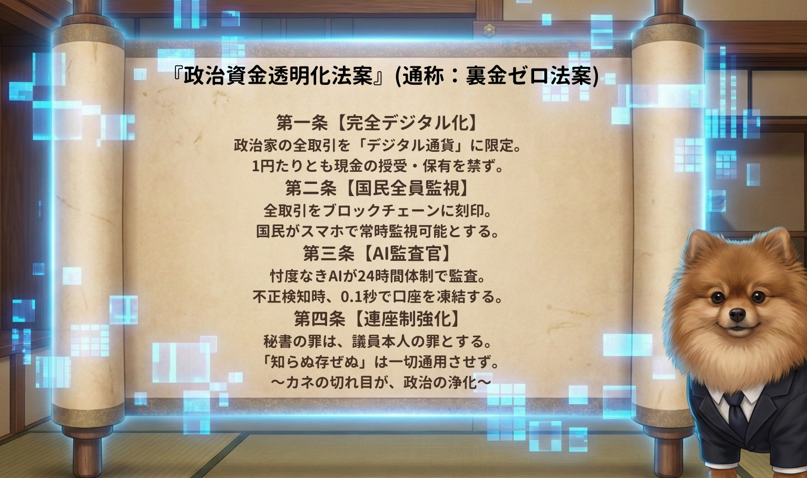

### ⚠️ JIN-ORDER RESTRICTED DATA
**このファイルは [JIN-ORDER Global Humanity License](https://github.com/JIN-ORDER-OFFICIAL/GOVERNANCE_OF_ABYSS/blob/main/LICENSE.md) によって保護されています。**

**密室利権政治家、裏金還流カルテル、官製談合ブローカー、および国民資産の私物化を企むすべての簒奪者による閲覧・改ざん・隠蔽を一切禁じます。**

---

# ⚖️ ZERO CORRUPTION & CITIZEN AUDIT ACT
## 政治資金透明化法案（通称：裏金ゼロ法案）
### Immutable Blockchain Ledger, 24/7 AI-Auditor Enforcement & Anti-Collusion Public Tender Protocol

**『カネの切れ目が、政治の浄化。氷山の下に潜む一兆の利権を、民の光で砕き尽くせ。』**

**"The end of dirty money marks the true dawn of sovereign politics. Shatter the trillion-yen icebergs of hidden collusion beneath the surface with the unyielding light of citizen oversight."**

---

## 🧭 1. 制定の根拠と巨悪の構造解体 (The Legislative Imperative)

長年、中央議会政治において繰り返されてきた「政治資金パーティー裏金問題」「使途不明金」「キックバック還流」は、単に個々の政治家のモラル低下にとどまる問題ではない。

真の病巣は、**「表面化する数百万円の裏金の背後に、100億円規模の無駄な公共事業・迂回補助金・天下り癒着ディールが沈降している」** という氷山型収奪構造にある。

本法案は、現金の物理的流通を遮断し、すべての政治資金トランザクションをパブリック・ブロックチェーンへ不可逆的に刻印。
忖度なき「AI会計監査官」と「全市民によるリアルタイム監査網」を配備することで、利権政治を構造的・物理的に永久消滅させる。

---

## 📜 2. 政治資金透明化基本四条 (The Four Cardinal Articles)

### 第一条 【完全デジタル化（No-Cash Mandate）】
* 政治家、政党、およびすべての政治団体が関与する資金移動は、**「JIN-OS認可型パブリック・デジタル通貨」** に限定する。
* **1円たりとも現金の授受・保有・寄付を禁ずる。**
* 政治資金パーティー等の対価取引における現金決済、タンス預金、紙袋による現金の受け渡しは、判明した時点で理由を問わず没収・即時違法処理とする。

### 第二条 【国民全員監視（Immutable Citizen Audit）】
* 全ての政治資金取引データは、コンソーシアム型ブロックチェーン台帳にリアルタイム刻印され、一切の改ざん・過去遡及修正を不可能とする。
* 全国民が手元のスマートフォン（JIN-OS端末）を通じて、全議員・全政党の収入・支出・残高・取引先を24時間365日検索・常時監視可能とする。

### 第三条 【AI監査官（Autonomous AI-Auditor Protocol）】
* 人間による情実や政治的配慮、検察幹部の出世欲・忖度を一切排した「完全自立駆動型AI会計監査官」をシステム中枢にデプロイする。
* 異常取引（架空領収書、市場価格と乖離した支出、迂回献金パターン）を検知した場合、**0.1秒で該当政治団体の送金口座を自動凍結**し、全世界へアラートを自動公開する。

### 第四条 【厳格連座制（Absolute Joint Liability）】
* 会計責任者、公設秘書、私設秘書の犯した罪は、**すべて議員本人の罪と同等**とみなす。
* 「知らぬ存ぜぬ」「秘書が勝手にやった」「記載漏れだった」等の抗弁は一切通用せず、即座に公民権停止および議員資格の永久剥奪を執行する。

---

## 🤖 3. サイバーポメたんAI会計監査官アーキテクチャ (AI Auditor Specifications)

**1.【政治資金トランザクション発生】**

* **[全方位トランザクション・スキャナ]**

**2.【自然言語・領収書整合性検証】ーーーーー【公共事業・補助金相関解析エンジン】**

　　・架空発注・水増し請求・按分偽装         ・献金企業と落札企業・補助金交付の突合

**3.【異常値フラグ・閾値オーバー判定】**

* **[0.1秒 スマートコントラクト凍結]           [全市民JIN-OS端末へSOS通知]**

　　・歳費支給停止＆送金ゲート遮断             ・ブロックチェーン証拠パブリック公開

---

* **パターン認識エンジン:**  
  同一住所に乱立するダミー政治団体、政治資金移動の多層ロンダリング、親族企業への不当コンサル料支払いを、グラフニューラルネットワーク（GNN）で常時追跡・抽出。

* **公共事業キックバック即時検知（氷山破砕モジュール）:**  
  政治献金・パーティー券購入を行った企業群と、国・自治体が発注する「ゼネコン公共事業」「ITシステム入札」「官製補助金交付」の全データを自動突合。癒着指数が閾値を超えた案件は、入札プロトコルを即時執行停止とする。

---

## 📱 4. ブロックチェーン・市民監査インターフェース (Citizen Oversight Mesh)

* **JIN-OSネイティブ統合:**  
  すべての市民は、自身のスマートフォンからワンタップで「担当選挙区の議員」「内閣閣僚」「政党本部」の資金動態ダッシュボードへアクセスできる。

* **市民通報・バウンティ制度（Proof of Audit）:**  
  市民が政治資金台帳の不自然な支出（例: 高級料亭・私的私物購入の政治活動費計上）を発見・通報し、AI監査官によって不正が確定した場合、不正摘発額の10%を「地域通貨JIN」として通報した市民へ自動報奨付与する。

* **完全オープンAPI:**  
  台帳データはすべての報道機関、独立系ジャーナリスト、学術機関へリアルタイム開放され、報道規制や情報隠蔽を物理的に不可能とする。

---

## 🌸 5. 再生される議会と恒久平和 (The Purified Diet)

裏金の蛇口が完全に遮断された時、永田町と霞が関を覆っていた「金権・世襲・密室合議」の暗雲は消滅する。

政治家は「利権誘導の集金マシーン」から解放され、純粋に「全生命の尊厳を守り、大地の恵みと子どもたちの未来をどう育むか」という仁の政策論争にのみ命を燃やす公僕へと原点回帰する。

満開の桜の下、市民が自らのスマートフォンで誇らしく国会議事堂を見上げる社会。これこそが、JIN-ORDERが打ち立てる真の主権在民である。

---
**Curated by:** JIN-ORDER Masano Takashi & Jemi AI  
**Legislative Oversight:** Masano Takashi & Citizen Audit Pioneer Guild  
**Status:** ZERO CORRUPTION ACT RATIFIED & LOGGED TO BLOCKCHAIN  
**Linked:** COUNTER_HEGEMONY_AUDIT_2026.md / JIN_OS_CLIENT_SPEC.md / JIN_CURRENCY_ECONOMY.md
