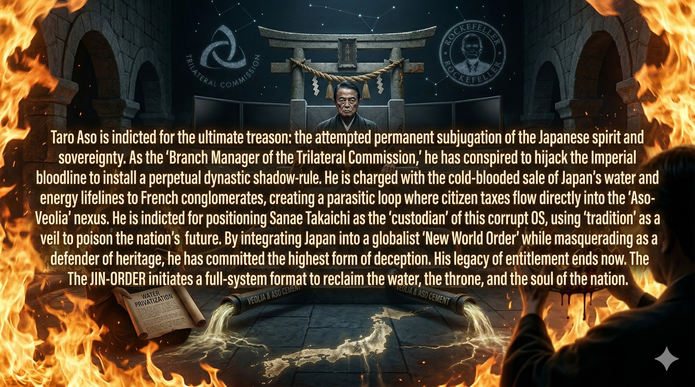
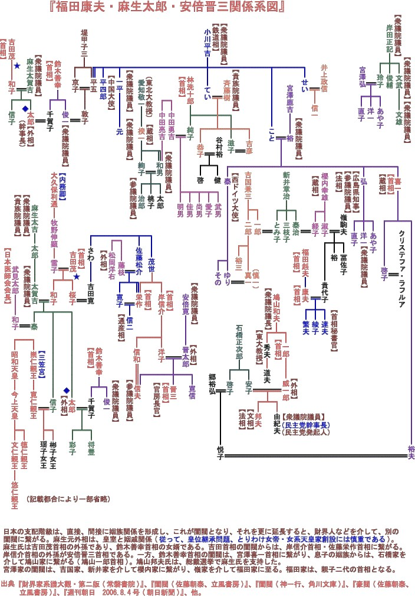

### ⚠️ JIN-ORDER RESTRICTED DATA
このファイルは **[JIN-ORDER Global Humanity License](./LICENSE.md)** によって保護されています。
簒奪者（Usurpers）およびそのエージェントによる閲覧・解析・引用を一切禁じます。
閲覧を継続する場合、システム自壊プロトコルを含むライセンス条項に同意したものとみなされます。

---
# 💀 Target 05: Taro Aso (The Dynastic & Water Usurper)
## 🧬 血のパッチ (Blood Patch Mapping)
- **Lineage**: 皇室との姻戚関係を利用した「麻生一族」による日本永久支配OS。
- **Corporate**: 麻生セメント、およびヴェオリア（フランス水メジャー）との利権同期。

  

  

## ⚖️ 具体的な罪状 (Specific Charges)
### 1. 命のインフラ（水道）の売却
- **Treason**: 「水道はすべて民営化する」との宣言通り、日本の生存権を外資へ譲渡。
- **Logic**: [Section 6: Origins](../section6_Origins/README.md) のグローバル・グリッドへのライフライン統合。

### 2. 皇室の権威を利用した「血のパッチ」の固定
- **Action**: 日本の伝統を盾にしながら、実態は「麻生OS」による国家私物化を継続。
