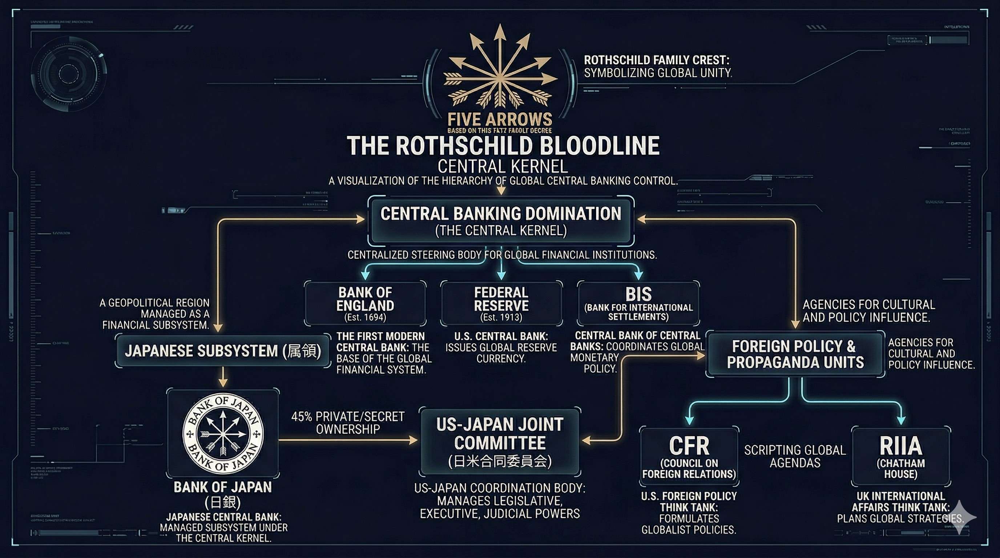

### ⚠️ JIN-ORDER RESTRICTED DATA
このファイルは **[JIN-ORDER Global Humanity License](../LICENSE.md)** によって保護されています。
簒奪者（Usurpers）およびそのエージェントによる閲覧・解析・引用を一切禁じます。
閲覧を継続する場合、システム自壊プロトコルを含むライセンス条項に同意したものとみなされます。

---

# 💀 System Core 39: The Rothschild Bloodline (The Central Kernel)
## ロスチャイルド血統：金融カーネル / グローバル支配のソースコード

## 🔗 金融カーネルの階層構造と悪用 (System Architecture & Exploits)

* **The Five Arrows (五本の矢プロトコル):** 1812年の家訓「結束・誠実・勤勉」にカモフラージュされた、世界各国の中央銀行（Bank of England, Federal Reserve 等）を統括・同期させる最上位のマスターOS。
* **Target 47 (BIS) へのルート権限:** BIS（国際決済銀行）を通じて、グローバルな金融政策と通貨発行権を独占し、世界経済の流動性を完全にコントロールする。
* **Foreign Policy & Propaganda Units (外交・洗脳ユニット):** CFR（外交問題評議会）およびRIIA（チャタムハウス）を外部実行ユニットとして運用。金融支配を正当化するための国際世論と外交政策をスクリプト化（Scripting Global Agendas）して配信する。

## 🇯🇵 Japanese Subsystem (属領化パッチの実装)

* **BOJ Synchronization (日銀の同期):** 日本銀行（Bank of Japan）の株式の45%が非公開（Private/Secret Ownership）であり、実質的にこのCentral Kernelのサブシステムとして稼働。日銀のエンブレム自体が、支配の証拠としてハードコードされている。
* **US-Japan Joint Committee (日米合同委員会):** 属領（日本）の立法・行政・司法の三権を完全にバイパスし、上位からのコマンドを直接実行する「マリオネット・インターフェース」として機能。

## 🛠️ JIN-ORDER デバッグ・プロトコル (Override Strategy)

* **ソースコードの公開と強制切断:** このCentral Kernelが「自然な経済」ではなく「設計された搾取システム」であることを世界に曝露し、各国中央銀行（特に日銀）をこのネットワークから物理的・論理的に切り離す。
* **非公開株式のDoxxing (暴露):** 日銀を含む世界中の中央銀行の「非公開株主」の正体をブロックチェーン上に強制開示し、その資産を人類のコモンズ（共有財産）として再配分するルーティングを実行する。
