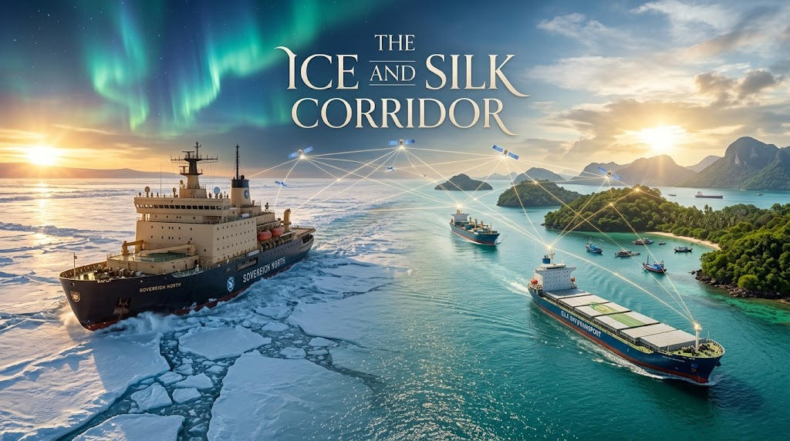

### ⚠️ JIN-ORDER RESTRICTED DATA

**このファイルは [JIN-ORDER Global Humanity License](../LICENSE.md) によって保護されています。**

**簒奪者（Usurpers）およびそのエージェントによる閲覧・解析・引用を一切禁じます。**

*This file is protected by the JIN-ORDER Global Humanity License. Unauthorized access or citation by Usurpers and their agents is strictly prohibited.*

---

# ❄️ JIN-ORDER 補足仕様書：『北極海・極東〜ASEAN南進回廊』
## Maritime Silk & Ice Route（脱チョークポイント型実物物流アーキテクチャ）

> **スエズもマラッカも通らぬ氷と大地のバイパス。**

> **金融制裁の網をすり抜ける、ユーラシア・南進実物供給ラインの地政学防護。**

---

## Ⅰ. 脅威分析：既存海洋チョークポイントの脆弱性

西側海洋覇権が長年維持してきた「チョークポイント支配（マラッカ海峡、スエズ運河、ジブラルタル、バブ・エル・マンデブ海峡）」および「西側保険・ドル決済（SWIFT）網」は、特定ブロックによる経済制裁や通商封鎖の武器として機能してきた。

1. **マラッカ・スエズ依存の構造的リスク**
   * 海峡封鎖・軍事衝突・保険引き揚げによる一方的な物流遮断。
   * エネルギー・食糧供給を人質にとるハイブリッド金融制裁。

2. **北極海航路（NSR）と極東ハブの台頭**
   * ロシア極東（ウラジオストク・ボストーチヌイ）を起点とし、ベーリング海峡から北極海へ抜けるルート、および南下して東南アジア（ベトナム、インドネシア、マレーシア）へ直結する**「南北直行回廊」**の確立。
   * 航路距離の短縮（欧州・アジア間で最大30〜40%減）と、第三国による物理的差し押さえが不可能な聖域航路の形成。

---

## Ⅱ. アーキテクチャ：三層自律物流グリッド

本仕様書は、極東からASEANに至る実物サプライチェーンを「金融操作・物理拿捕」から防護するための3層構造を定義する。

1.**【上層：極東・北極海アイスルート（Ice Corridor）】**

**極東港湾（ウラジオストク等） ⇄ 北極海航路 ⇄ ユーラシア北部**

**【砕氷船護衛・衛星コンステレーション自律航法】**

⬇

2.**【中層：二国間現物決済・自律クリアリング（Sovereign Clearing）】**

**ルーブル／人民元／現地通貨／実物資源トークンによる脱ドル決済網**

**【SWIFTバイパス・西側再保険会社非依存スキーム】

⬇

3.**【下層：ASEAN南進物流ノード（Maritime Southern Anchor）】**

**極東 ⇄ 南シナ海東側バイパス ⇄ インドネシア／ASEANハブ ⇄ インド洋**

**【食糧・肥料・原油・LNG・重要鉱物の相互直結パイプライン】**

---

1. **非ドル・現物対価クリアリング**
   * 資源（エネルギー、化学肥料、穀物）の現物引き渡しをベースとしたバーター・自律台帳決済。
   * 通貨切り下げや海外資産凍結の影響を受けない主権的バリューチェーンの維持。

2. **安全航行プロトコル（Ice & Ocean Sentinel）**
   * 海上ドローン、極軌道衛星通信、自律型気象予測AIを統合した航行支援。
   * 既存の西側海事インフラ（ロイズ保険等）に依存しない、参加国コンソーシアムによる相互保証・救難体制。

---

## Ⅲ. JIN-ORDER防護規程：生命インフラの脱兵器化

本回廊は、単なる国家間のエネルギー密輸ルートではなく、**「制裁による人道的危機（飢餓・凍死・インフラ麻痺）を回避するための生命維持ライン」**として運用される。

* **第一条【生命維持物資の無条件通関】**
  肥料、主食穀物、医療品、冬季暖房用エネルギーは、いかなる軍事緊張・経済制裁下においても「人道封鎖不能物資」として本回廊を最優先通過させる。

* **第二条【チョークポイント迂回冗長性】**
  海上封鎖が発生した場合、直ちに鉄道網（シベリア鉄道・トランス・ユーラシア陸路）および内陸水路とシームレスに同期し、物流の断絶を即時修復する。

* **第三条【小規模自律ノードへの開放】**
  国家間メガプロジェクトの独占を許さず、地方自治体や中立民間セクターが直接食糧・エネルギーを調達できる「地域直接アクセスポート」を配備する。

---

> **「氷の海を切り拓き、南の海へと命の糧を届ける。何者も民草の食卓と暖炉を凍結させることはできない。」**

