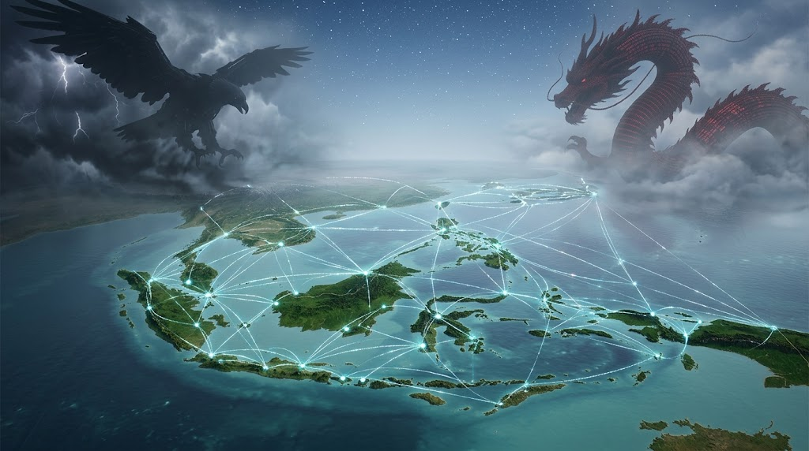

### ⚠️ JIN-ORDER RESTRICTED DATA

**このファイルは [JIN-ORDER Global Humanity License](../LICENSE.md) によって保護されています。**

**簒奪者（Usurpers）およびそのエージェントによる閲覧・解析・引用を一切禁じます。**

*This file is protected by the JIN-ORDER Global Humanity License. Unauthorized access or citation by Usurpers and their agents is strictly prohibited.*

---

# 🌐 JIN-ORDER 戦略仕様書：『極東ユーラシアの二重構造解体』
## 中国依存と中立分散の狭間（ASEAN & 極東中立自律バッファ設計）

> **西側の金融制裁を逃れた先が、巨大な一極（単一サプライチェーン）の従属下であってはならない。**

> **真の多極化とは、いかなる覇権国家にも呑まれない『分散された中立性』である。**

---

## Ⅰ. 構造課題：ユーラシア南進における「見えない囲い込み」

ロシアの東方シフトおよびグローバルサウスの結束において、脱ドル決済と実物資源貿易が進む一方、極東・ユーラシア全域で「中国の生産力・デジタルインフラ・決済網への一極集中」という新たな非対称リスクが浮上している。

1. **二重構造の歪み（The Hegemonic Trap）**
   * **表の構図:** 米欧の金融制裁や海上チョークポイントに対抗する「ユーラシア経済同盟・ASEAN連携」。
   * **裏の力学:** 通商ルート、通信規格、デジタル決済が特定の巨大国家OSへ依存することで、参加国が事実上の属国化・経済的チョークポイントを握られる危険性。

2. **ASEAN・中立国のジレンマ**
   * インドネシア、ベトナム、マレーシア等のASEAN諸国は、西側の制裁網を避けつつも、単一メガパワーによる領海・資源囲い込みを極度に警戒。
   * 必要なのは「陣営の乗り換え」ではなく、すべての巨大勢力と距離を保ち、相互不可侵を保てる**「主権分散型の緩衝帯（バッファゾーン）」**である。

---

## Ⅱ. システム設計：中立調停・マルチアライメント・プロトコル

本仕様書は、極東〜東南アジア間の物流・通信・決済が単一の巨大サーバーや国家OSに依存することを防止する「多極分散ルーティング」を定義する。

1.**【上層：マルチカレンシー・バスケット中立網（Basket Settlement Layer）】**

特定国家の単一通貨を排除した、資源裏付け型マルチ通貨スワップ

（ルーブル／ASEAN現地通貨／実物トークン／人民元の中立プール）

⬇

2.**【中層：オープンソース・海事通信グリッド（Decentralized AIS & Comms）】**

国家検閲・軍事ハックを受けない、自律分散型衛星・航路トラッキング

（特定メガテックの監視網から独立したオープン・セーフティ網）

⬇

3.**【下層：群島型自律バッファ（Archipelago Sovereign Mesh）】**

インドネシア・フィリピン・マレーシア等の群島地帯を結ぶ中立物流ノード

（単一国のインフラ独占を許さない、港湾・備蓄拠点の分散相互運用）

---

1. **主権分散型クリアリング（Non-Hegemonic Clearing）**
   * 二国間貿易において、決済データが単一の国家主権サーバー（CIPS等）のみに集中しないよう、分散型台帳による多極中継（Multi-Hop Clearing）を義務付ける。
   * 通貨主権を放棄せず、地域ごとの独自法定通貨・現物担保トークンを直接相殺。

2. **航路・港湾の主権監査（Port Neutrality Audit）**
   * 借款や開発援助を名目とした特定大国による港湾の長期租借・軍事利用化（債務の罠）を防止。
   * 港湾設備の所有・管理権を地域自治体と住民連合に固定し、いかなる軍事覇権からも中立を維持するスマートコントラクトを敷設。

---

## Ⅲ. JIN-ORDER 防護規程：中立自立の三原則

本プロトコルを採用する極東およびASEANの自治体・地域セクターは、以下の原則により自律性を担保する。

* **第一条【陣営帰属の完全拒絶】**
  西側G7の金融ブロックにも、単一覇権国家の包囲網にも属さない。中立とは受動的な孤立ではなく、全方位に対して独立した接続ポートを持つ積極的自立である。

* **第二条【インフラの多重化・脱単一化】**
  通信、エネルギーパイプライン、海運網において、単一の国家・企業がシェア50%以上を占有することを構造的に禁止し、常に代替可能な迂回路を維持する。

* **第三条【民衆生活の不可侵性（普遍的仁の執行）】**
  国家間の地政学的駆け引きや国境紛争が激化した場合であっても、極東〜南洋を結ぶ漁業権、生活物資流通、家族的交流ネットワークの遮断をプロトコルレベルで無効化する。

---

> **「巨大な龍にも、猛る鷲にも、己が航路を委ねてはならぬ。幾千の島々が手を取り合い、自らの海を自らの尊厳で照らせ。」**
