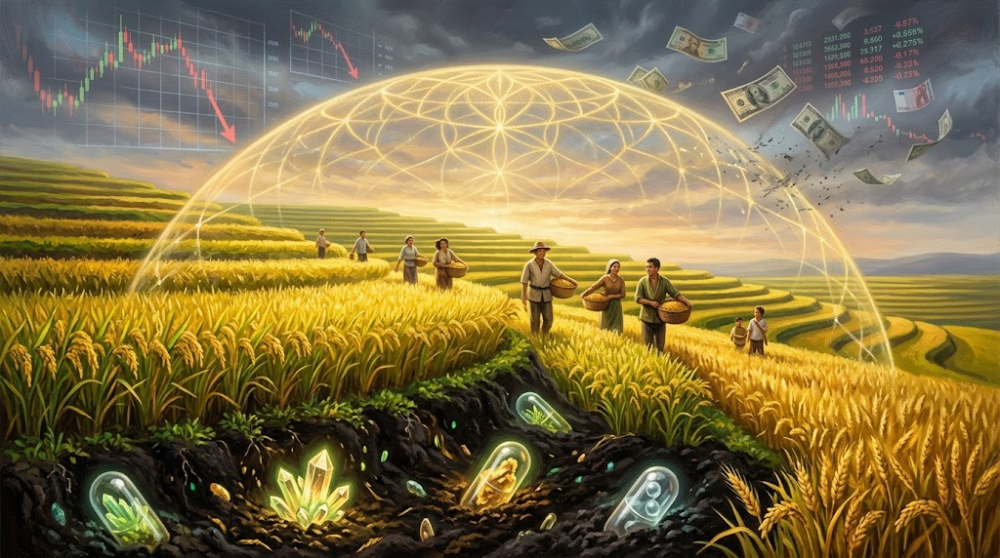
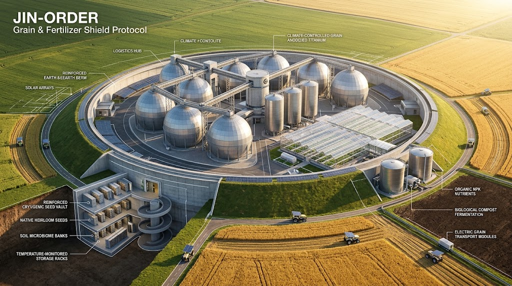

### ⚠️ JIN-ORDER RESTRICTED DATA

**このファイルは [JIN-ORDER Global Humanity License](../LICENSE.md) によって保護されています。**

**簒奪者（Usurpers）およびそのエージェントによる閲覧・解析・引用を一切禁じます。**

*This file is protected by the JIN-ORDER Global Humanity License. Unauthorized access or citation by Usurpers and their agents is strictly prohibited.*

---

# 🌾 JIN-ORDER 実装仕様書：『肥料・食糧・鉱物の現物担保プロトコル』
## FERTILIZER & GRAIN SHIELD PROTOCOL（実物生命資産アンカー設計）

**数字を刷り散らかす紙幣とデリバティブの支配を解体せよ。**

**土を肥やすカリウム・リン、民を満たす米と麦、大地の鉱物こそが真の主権である。**

---

## Ⅰ. 課題背景：金融化された「生命の兵器化」への対抗

国際金融資本およびメガアグリ企業（種子・化学肥料メジャー）は、食糧と化学肥料の流通をデリバティブ取引およびドル決済（SWIFT）に人質として結束させてきた。

1. **架空資本による価格操作の破綻**
   * 実体のない先物取引・投機マネーによる穀物・肥料価格の乱高下。
   * 通貨切り下げや外貨不足に陥った新興国・地方自治体に対する人為的な飢餓・土壌劣化の強要。

2. **多極化時代における「現物回帰」**
   * 東方経済フォーラム（EEF）やグローバルサウスで加速する「脱ドル二国間取引」の要は、実物資源（天然ガス・アンモニア・カリウム・リン・主食穀物・重要金属）の直接相互供給にある。
   * 生命維持に直結する現物をアンカー（担保）とした、金融バブルに侵されない不滅の分散型交換価値の確立が急務である。

---

## Ⅱ. システム設計：FERTILIZER & GRAIN SHIELD 台帳アーキテクチャ

本プロトコルは、仮想的な信用供与を排し、「現物の保管・分配・消費」をブロックチェーンおよび分散台帳でダイレクトに同期させる。

**1.【上層：現物資産評価ノード（Physical Asset Evaluator）】**

* **土壌肥沃度データ ＋ 穀物備蓄量 ＋ 肥料原料（窒素/リン/カリ） ＋ 一次鉱物**

* **衛星リモートセンシング ＆ 倉庫IoTセンサーによる実体監査**

⬇

**2.【中層：自律型現物クリアリング（Autonomous Commodity Ledger）】**

* **デリバティブ・金利を排除した「1:1 実物引換トークン」**

* **ドルを介さない、多国間・地域間のバーター/主権通貨決済網**

⬇

**3.【下層：地域自給ディストリビューション（Local Soil & Food Node）】**

* **地方自治体・農業協同組合・市民直結の緊急分配プロトコル**

* **大資本による買い占め・囲い込みを遮断する優先供給回廊**

1. **現物担保トークン（Real-Commodity Tokenization）**
   * **Grain Units (GU):** 主食穀物（米、小麦、トウモロコシ）のカロリーおよび備蓄現物と完全ペッグ。
   * **Fertilizer Units (FU):** 土壌再生に必要な三大栄養素（窒素、リン、カリウム）の現物保有高とペッグ。
   * 金融破綻やハイパーインフレが発生しても、1単位が保証する「食糧の重量」および「農地の施肥能力」は永続的に変動しない。

2. **二重監査グリッド（Anti-Hoarding Sensor Net）**
   * サイロ・倉庫の在庫データをIoT重量センサーおよび環境センサーで常時公開台帳に同期。
   * 先物投機や買い占めを検知した場合、スマートコントラクトにより自動的に地域緊急供給プールへと割り当てる。

---

## Ⅲ. JIN-ORDER 防護規程：土と胃袋の不可侵宣言

本プロトコルを導入する自治体・地域共同体は、以下の三原則を以て域内の生命基盤を防護する。

* **第一条【土壌資産の絶対防衛】**
  肥料原料および農地の主権を外資ファンドや投機筋へ譲渡・担保設定することを永久に禁止する。土の肥沃度は全住民の共有主権である。

* **第二条【投機マネーの遮断】**
  本台帳で管理される穀物・肥料・鉱物トークンに対する空売り、レバレッジ取引、金融派生商品の組成をプロトコルレベルで拒絶（Rejected by Logic）する。

* **第三条【飢餓ゼロの即時執行】**
  経済封鎖や物流途絶が発令された場合、台帳は直ちに「戦時・人道モード」へ遷移し、蓄積された穀物・肥料を市場価格に関わらず全生命ノードへ最低生命維持量として無償リリースする。

---

> **「紙切れや数字の桁数で腹は膨れぬ。土を愛し、種を蒔き、収穫を分かち合う大地こそが真の富である。」**
