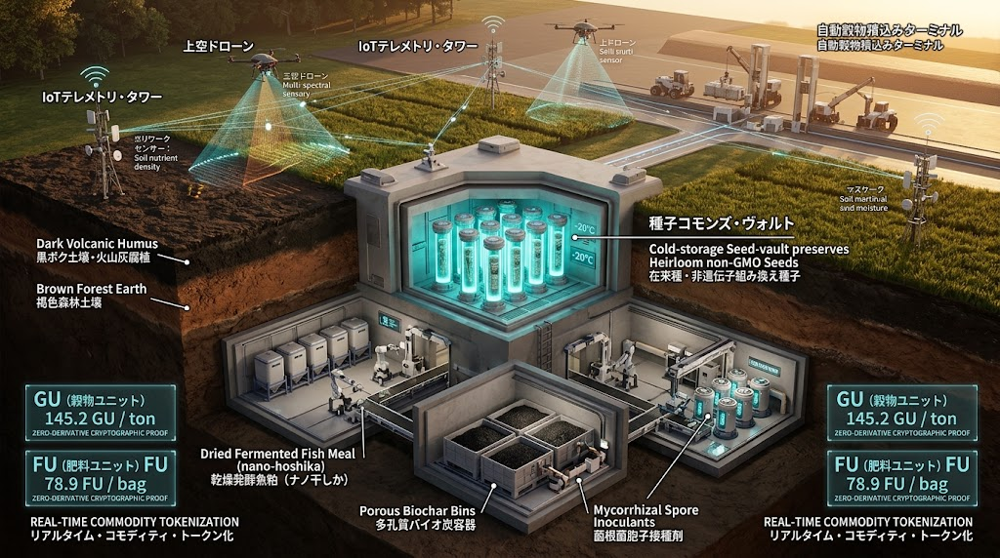

### ⚠️ JIN-ORDER RESTRICTED DATA

**このファイルは [JIN-ORDER Global Humanity License](../LICENSE.md) によって保護されています。**

**簒奪者（Usurpers）およびそのエージェントによる閲覧・解析・引用を一切禁じます。**

*This file is protected by the JIN-ORDER Global Humanity License. Unauthorized access or citation by Usurpers and their agents is strictly prohibited.*

---

# 🌾 JIN-ORDER 実装仕様書：『肥料・食糧・鉱物の現物担保プロトコル』
## FERTILIZER & GRAIN SHIELD PROTOCOL（実物生命資産アンカー ＆ 土壌8大区分連動設計）
### Real-Commodity Tokenization, Pedological Seed-Vault & Bio-Fertilizer Anchor (V7.3 Canonical)

**「数字を刷り散らかす紙幣とデリバティブの支配を解体せよ。  
土を肥やす微生物と金肥、民を満たす在来の種子、大地の水と鉱物こそが真の主権である。」**


---

## Ⅰ. 課題背景：金融化された「生命の兵器化」と肥料チョークポイントの解体

国際金融資本およびメガアグリ企業（種子・化学肥料メジャー）は、食糧と化学肥料の流通をデリバティブ取引およびドル決済（SWIFT）に人質として結束させ、国家や地域を兵糧攻めにする構造を作り上げてきた。

1. **架空資本による価格操作の破綻**
   * 実体のない先物取引・投機マネーによる穀物・肥料価格の乱高下。
   * 輸入リン鉱石、カリウム原料、天然ガス由来合成窒素のチョークポイント化による人為的な農業収奪。

2. **多極化時代における「実物生命資産への回帰」**
   * 東方経済フォーラム（EEF）やグローバルサウスで加速する「脱ドル二国間取引」の要は、実物資源（主食穀物・天然有機肥料・重要鉱物・水脈）の直接相互供給にある。
   * 通貨発行権の独占に対抗するため、生命維持に直結する現物をアンカー（担保）とした、インフレ耐性を持つ分散型交換価値の確立が不可避である。

---

## Ⅱ. システム設計：FERTILIZER & GRAIN SHIELD 台帳アーキテクチャ

本プロトコルは、架空の信用供与を排し、「現物の保管・分配・消費」をブロックチェーンおよび分散台帳（JIN-Ledger）でダイレクトに同期させる。


**1.【上層：現物資産評価ノード（Physical Asset Evaluator）】**
* 土壌肥沃度データ ＋ 在来種穀物備蓄量 ＋ 天然バイオ金肥（窒素/リン/カリ） ＋ 一次鉱物
* 衛星リモートセンシング（土壌水分・分光反射率） ＆ サイロIoTセンサーによる実体監査

⏬️

**2.【中層：自律型現物クリアリング（Autonomous Commodity Ledger）】**
* デリバティブ・金利を排除した「1:1 実物引換トークン」
* 通貨『JIN（仁）』と連動した、ドルを介さない地域間直接クリアリング

⏬️

**3.【下層：地域自給ディストリビューション（Local Soil & Food Node）】**
* 地方自治体・農業協同組織・市民直結の緊急分配プロトコル
* 大資本による買い占め・囲い込みを遮断する優先供給回廊

---

### 3大基幹ユニット規格

1. **Grain Units (GU): 主食穀物・カロリー担保ユニット**
   * 非GM・自家採種可能な在来固定種（米、麦、雑穀、大豆）の備蓄現物と完全ペッグ。
   * 1 GU = 成人1日分の生命維持カロリー（2,000 kcal相当の主食現物引換権）。

2. **Fertilizer Units (FU): 生体肥料・土壌再生担保ユニット**
   * [JIN_AGRI_BIO_REGENERATION_SAMSARA.md](../JIN_AGRI_BIO_REGENERATION_SAMSARA.md) の「江戸バイオ金肥（ナノ干鰯・量子鰊粕）」および「剪定枝バイオ炭」「完熟ぼかし堆肥」の現物保有高とペッグ。
   * 1 FU = 100㎡の劣悪土壌を1年間団粒化・地力回復させる有効バイオ肥料現物。

3. **Resource Units (RU): 重要鉱物・生命資材担保ユニット**
   * リン鉱石代替骨粉灰、天然ゼオライト、農業用ケイ酸質資材、全固体ジン電池原料鉱物とペッグ。

---

## Ⅲ. 土壌8大区分連動 ＆ 不溶性リン酸解放フォーミュラ (Pedological Samsara Link)



輸入リン鉱石・合成肥料の禁輸制裁を無力化するため、専用仕様書 **[JIN_SOIL_FOREST_SAMSARA_MATRIX.md](../JIN_SOIL_FOREST_SAMSARA_MATRIX.md)** と直結した土壌別施肥クリアリングを実施する。

```text
[化学肥料チョークポイントの無効化プロセス]

輸入リン酸の寸断 ⏩️ 土壌中の「不溶性アルミニウム結合リン」に着目

🔽

【FU裏付け資材】アーバスキュラー菌根菌 ＋ ナノ干鰯 ＋ 剪定枝バイオ炭

🔽

土着微生物の有機酸分泌により難溶性リン酸を完全可溶化 ⏩️ 作物吸収率300%向上

```

1. **黒ボク土・火山灰土壌のリン酸解放:**  
   活性アルミニウムにより固定化された膨大なリン酸に対し、FUから供給される菌根菌ネットワークと低分子有機酸ぼかし堆肥を投入。<br>化学リン酸肥料の新規投入ゼロで持続的収量を確保する。

2. **赤黄色土・酸性粘土の団粒化担保:**  
   放置竹林・剪定枝の微小多孔質バイオ炭をFUとして引き当て、土壌の保肥力（CEC）を向上。酸性化によるアルミニウム過剰害を中和する。

3. **未熟土（乾燥砂漠・被災地）の緊急緑化:**  
   チャドやモザンビーク等の国連パイプライン（[JIN_UN_PARTNER_PORTAL_PIPELINE.md](JIN_UN_PARTNER_PORTAL_PIPELINE.md)）と連動し、ミズアブ幼虫残渣（キチン質フラス）をFUとして優先投下。外部物資途絶下でも即座に自立農地を造成する。

---

## Ⅳ. 在来種・固定種シードバンク防衛プロトコル (Pedological Seed-Vault)


F1一代雑種やゲノム編集種子による「種子の知財奴隷化」を完全に拒絶し、地域ごとに8大土壌区分に適応した「在来固定種シードバンク」を構築する。

1. **土壌適応型シードマッピング:**  
   * **黒ボク土用:** 耐乾・深根性在来大豆、地這いキュウリ、在来麦類
   * **赤黄色土用:** 土着在来茶樹、柑橘固定種、耐酸性サツマイモ
   * **グライ土用:** 深水耐性在来水稲、レンコン、湿田用イグサ
   * **未熟土・乾燥地用:** アフリカ・サヘル適応ヒエ・アワ、乾燥耐性在来豆

2. **P2P分散種子保管（Seed-Commons Vault）:**  
   種子を中央集権的な単一施設に集積せず、[JIN_SANCTUARY_COMMONS_SPEC.md](../JIN_SANCTUARY_COMMONS_SPEC.md)（廃校サンクチュアリ）および地域農家の冷暗コールドストレージに分散保管。

3. **自家採種の義務付け:**  
   GUトークンを発行・決済する農場は、収穫種子の次世代自家採種（Seed-Saving）率100%を維持することを義務付け、外部種子企業への再依存を遮断する。

---

## Ⅴ. JIN-ORDER 防護規程：土と胃袋の不可侵宣言

本プロトコルを導入する自治体・地域共同体は、以下の四原則を以て域内の生命基盤を防護する。

* **第一条【土壌・種子資産の絶対防衛】**  
  肥料原料、在来種子バンク、農地の主権を外資ファンドや投機筋へ譲渡・担保設定することを永久に禁止する。土の肥沃度と種子の命は全住民の共有主権である。

* **第二条【投機マネー・金融派生商品の遮断】**  
  本台帳で管理されるGU・FU・RUトークンに対する空売り、レバレッジ取引、証券化デリバティブの組成をプロトコルレベルで自動拒絶（Rejected by Logic）する。

* **第三条【飢餓ゼロ・人道優先執行】**  
  封鎖や物流途絶が発令された場合、台帳は直ちに「戦時・人道モード」へ遷移し、蓄積された穀物・肥料を市場価格に関わらず全生命ノードへ最低生命維持量として無償リリースする。

* **第四条【化学肥料・農薬寡占の無効化】**  
  多国籍化学アグリバイオ企業による特許侵害訴訟や供給停止の脅迫に対し、本プロトコルのバイオ金肥・菌根菌製法を地域公有IPとして保護し、いかなる独占権も認めない。

---
**Curated by:** JIN-ORDER Masano Takashi, Commander Pome-Mama & Jemi AI  
**Economic & Agronomy Validation:** JIN-ORDER Sovereign Ledger Guild & Pedological Agro-Shield Team  
**Status:** FERTILIZER & GRAIN SHIELD RATIFIED (V7.3 CANONICAL)  
**Linked:** JIN_SOIL_FOREST_SAMSARA_MATRIX.md / JIN_AGRI_BIO_REGENERATION_SAMSARA.md / JIN_FORESTRY_AGRI_ENERGY_NEXUS.md / JIN_CURRENCY_ECONOMY.md / JIN_SANCTUARY_COMMONS_SPEC.md
