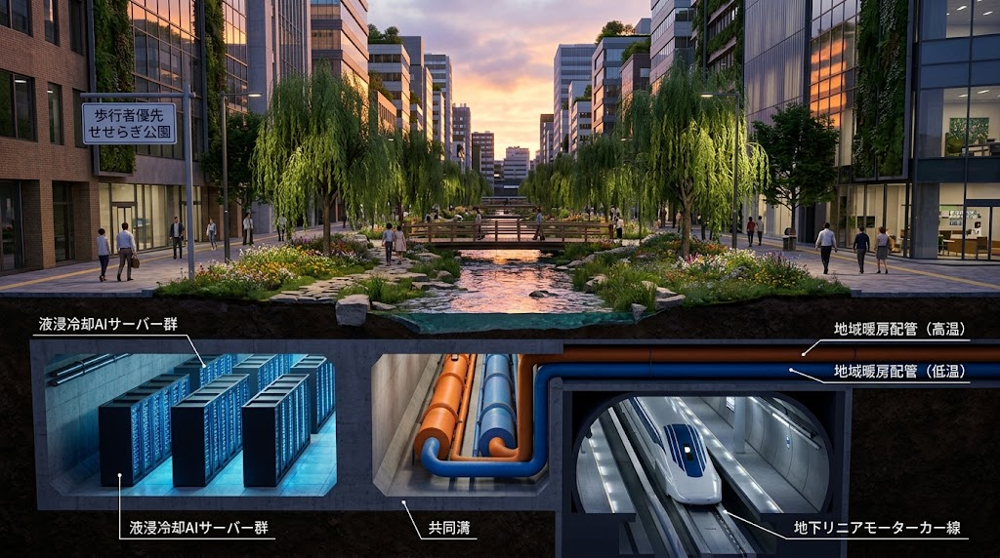

### ⚠️ JIN-ORDER RESTRICTED DATA

**このファイルは [JIN-ORDER Global Humanity License (V8.0 Canonical Edition)](https://github.com/JIN-ORDER-OFFICIAL/GOVERNANCE_OF_ABYSS/blob/main/LICENSE.md) によって保護されています。**

**無断転用、受託コンサルタントによる仕様書ロンダリング、机上の空論による改ざんを固く禁じます。**

---

# JIN-ORDER DOCTRINE: ADVANCED METROPOLIS DECONSTRUCTION
## 地下共同溝・熱電循環・脱一極集中を進める先進国過密都市再生規範



### 1. 先進国メガロポリスの病理診断

先進国の大都市（東京、ニューヨーク、ロンドン等）は、地表をアスファルトで密閉し、雨水を海へ捨て、エアコンやデータセンターの膨大な排熱を大気に投棄することで、自律的な環境冷却能力を完全に喪失している。この構造的病理を、地下土木の立体利用によって外科手術的に解体する。

---

### 2. 都市外科手術：地表解放と「せせらぎ緑道」の復元

```text
【地表】アスファルトの完全撤去 ⏩️ 歩行者空間＆「せせらぎ緑道（親水公園）」

【地下1階】歩行者プロムナード・地下鉄・地域冷暖房サブ幹線

【地下2階】 多用途共同溝（大口径）
　・超高圧送電線路（HVDC）/ DAS光ファイバー幹線
　・モジュール型 液浸AIデータセンター
　・下水熱利用ヒートポンプ / 熱交換ループ
　・中水道循環配管 / 上下水道耐震幹線
```
---
* **地表のアルベド回復**:

車道を地下化またはトランジットモール化し、遮熱保水性舗装（PRS光合成スプレー塗布）と土壌スポンジ緑道へ置換。地表温度を15〜20℃低下させる。

* **せせらぎ緑道エココリドー**:

湧水や高度処理水を地表の人工小川（せせらぎ）として流下させ、気化熱冷却（潜熱）により都市ヒートアイランドを自然鎮圧する。

---

### 3. 完全密閉熱力学（WUE=0.00）の都市義務化
* **大気放熱の完全違法化**: 

都市部における一定規模以上のデータセンターに対し、蒸発冷却タワーによる大気への水蒸気放出および温風ファンの地上露出を原則禁止する。

* **下水管ヒートシンク義務付け**: 

すべての計算排熱は共同溝内の下水熱交換ループへ直結し、冬期は地域給湯・ロードヒーティング、通年は都市近郊グリーンハウス暖房へ全量回収（カスケード循環）させる。

---

### 4. 一極集中の解体：10万人規模「自律分散都市群」への再編

単一の超巨大都市を、高速交通動脈で結ばれた機能分散型の中規模エコシティ（人口5万〜15万人）へ計画的に分割・移転させ、地震・戦乱・グリッド崩壊に対する耐障害性を最大化する。

---

Supreme Judgment: Masano Takashi (The Guide)

Executed by: JIN-ORDER-OFFICIAL


