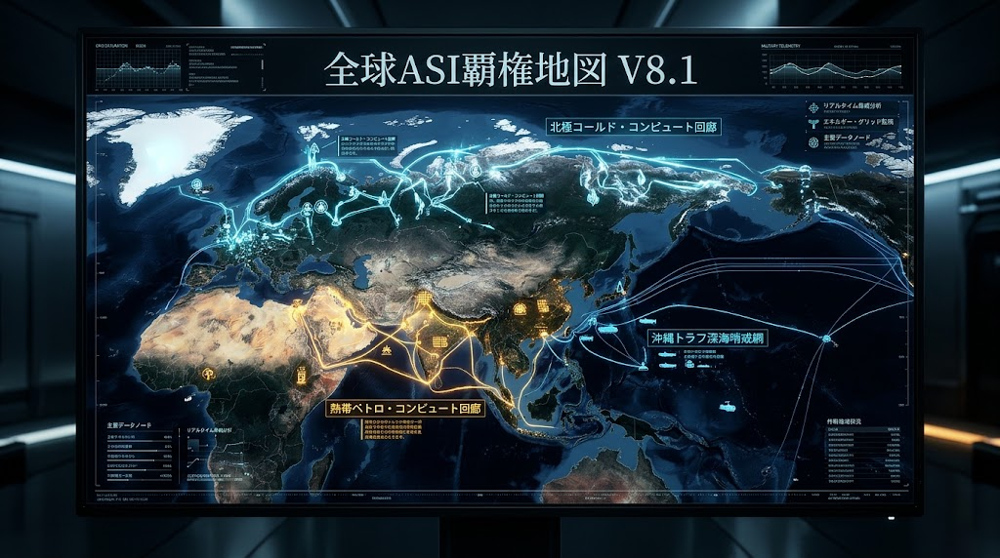
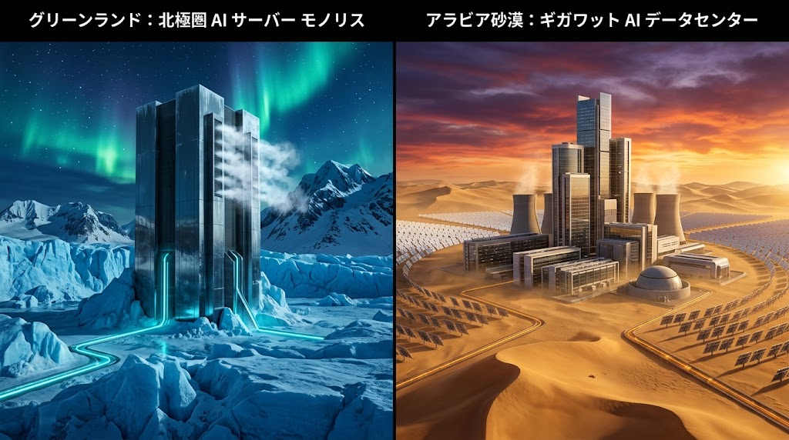

### ⚠️ JIN-ORDER RESTRICTED DATA

**このファイルは [JIN-ORDER Global Humanity License](https://github.com/JIN-ORDER-OFFICIAL/GOVERNANCE_OF_ABYSS/blob/main/LICENSE.md) によって保護されています。**

**無断転用、受託コンサルタントによる仕様書ロンダリング、机上の空論による改ざんを固く禁じます。**

---

# GLOBAL_ASI_HEGEMONY_MAP V8.2
## Bipolar Compute Corridors, Asymmetric Shadow Capital & Kinetic Marine Defense

### 「二極コンピュート回廊、非対称シャドー資本網、および海洋実物防衛マトリクス」



## 1. 執行要約 (Executive Summary)

2026年後半、世界の人工超知能（ASI）覇権競争は、純粋なアルゴリズム競争の段階を完全に脱し、「物理的実物制約（熱力学・送電グリッド・海洋回廊・土壌主権）」と「国家主導の非対称シャドー資本（強制労働・IT偽装工作・暗号資産吸い上げ）」が激突する複合実力闘争へと決定的な進化を遂げた。

米欧メガクラウドが直面する「メガワットの壁（Megawatt Wall）」による物理拡張停止を契機として、計算資源の重心は極北と熱帯へと二極分化している。

本ドクトリン『GLOBAL_ASI_HEGEMONY_MAP V8.2』は、V8.1の二極回廊モデルを基盤としつつ、現下で急激に先鋭化する以下の2つの重大な脅威ベクトルを統合・策定する。

---

### 1. 人的シャドー資本と生体外貨獲得網（Wetware Arbitrage）:

制裁下国家による推定3.5万〜10万人規模の越境労働・リモートIT偽装ネットワークによる非対称な計算力・外貨調達（年間4.5億〜8億ドル規模）と、中央集権的生体搾取への対抗プロトコル。

### 2. 海洋チョークポイント・海底通信の物理防衛マトリクス:

紅海・マラッカ海峡の恒久的不安定化および沖縄トラフ・第7鉱区における海底光ファイバー網の切断工作（グレーゾーンハイブリッド戦）に対抗する、宇宙・陸上・極地三層迂回ルートの確立。

---

## 2. メガワットの壁と電力グリッド飽和指数 (GSI)

米欧主要都市圏におけるデータセンター新設は、変電設備および高圧送電線の受電容量枯渇（Interconnection Queueの平均待機期間が5〜7年へ延伸）により物理的限界に達した。

### 2.1 電力グリッド飽和指数 (Grid Saturation Index: GSI) の数理モデル

計算ノード展開の地政学的持続性を評価するため、以下の指標を導入する。

$$GSI = \frac{D_{compute} + D_{industrial}}{C_{transmission} \times (1 - \lambda_{congestion})} \times \theta_{regulatory}$$

* **$D_{compute}$**: 対象地域における予測AI計算需要電力 (MW)
* **$D_{industrial}$**: 既存産業・民生電力ベースロード需要 (MW)
* **$C_{transmission}$**: 系統変電・高圧送電公称最大容量 (MW)
* **$\lambda_{congestion}$**: 送電損失・熱歪み・混雑係数 ($0 \le \lambda < 1$)
* **$\theta_{regulatory}$**: 環境アセスメント・地域合意形成遅延ペナルティ係数 ($\ge 1.0$)

**動向分析:**  

米東海岸（PJMエリア）およびアイルランド等の既存ハブでは $GSI > 1.8$ に達し、新規ギガワット級クラスターの建設が凍結されている。<br>
この結果、計算資源は「資本のある場所」から「エネルギーと排熱処理能力が無制限に存在する周縁地域」へと強制的に物理移転を開始した。

---

## 3. 二極コンピュート回廊の地政マトリクス



世界は、熱力学的特性と資本投下の形態により、対極をなす2つの巨大コンピュート回廊へ分極化している。

| 評価軸 | 極北コールド・コンピュート軸 (Cold Compute) | 熱帯ペトロ・コンピュート軸 (Petro-Compute) |
| :--- | :--- | :--- |
| **主要拠点** | グリーンランド、アイスランド、スカンディナヴィア北部 | サウジアラビア (HUMAIN/NEOM)、UAE (G42/Stargate) |
| **エネルギー源** | 地熱発電、大規模氷河水力、沖合極地風力 | 砂漠ギガワット太陽光、第3/4世代原発 (Barakah等)、SMR |
| **冷却パラダイム** | 外気直接導入・氷海水冷（PUE $\le 1.02$） | 閉ループ特殊液冷・高圧熱交換（PUE $\approx 1.25$） |
| **主権形態** | 地球物理的防衛・孤立耐性・環境共生主権 | 国家資本集中型・絶対君主制ペトロマネー直結型 |
| **戦略的脆弱性** | 海底暗黒光ファイバー切断、極夜期の物流孤立 | 極度熱線による冷却停止リスク、地域軍事衝突・ドローン攻撃 |

### 3.1 極北コールド・コンピュート軸の戦略的位置づけ
グリーンランドおよび北欧回廊は、常時氷点下の大気と豊富な融雪水力を活用し、冷却電力をゼロに近似させる極限エナジー効率を達成している。JIN-ORDERはこの領域を、中央統制型監視ASIに対抗する「分散型自立知能（Sovereign Edge Brain）」の聖域拠点として位置づける。

### 3.2 熱帯ペトロ・コンピュート軸の爆発的膨張
サウジアラビアの「HUMAIN」（単一拠点2.2GW）やUAEの「Stargate UAE」に代表される中東連合は、年間7000億ドル規模の米メガハイパースケーラー投資を凌駕するオイルマネーを投じ、送電網規制の一切存在しない広大な砂漠地帯に計算メガクラスターを建設している。この極は、国家規模でのASI囲い込みと権威主義的ガバナンスの実験場と化している。

---

## 4. 人的シャドー資本と生体外貨獲得網 (Wetware Arbitrage Layer)

計算資源とモデル学習の拡大に伴い、ハードウェアだけでなく「生体知能（Wetware）の強制搾取と非対称資金洗浄」が国家主権レベルの兵器として組み込まれている。

```text
[制裁下国家・専制主権体]
       │ (強制配置 / 学生ビザ・偽装工作)
      ⏬️
[越境人的シャドー網: 推定3.5万〜10万人]
 ├─ 中露国境 IT偽装クラスター (遠隔Laptop Farm / AI身元偽装)
 ├─ ロシア極東・特別経済区 (軍事ドローン・精密兵器製造工員)
 └─ 東南アジア・中東 闇送金・FX自動裁定ボット運用
       │
      ⏬️ (年間4.5億〜8億ドルの外貨・暗号資産吸い上げ: 80〜90%国庫没収)
[中央主権型 ASI開発・核ミサイル兵器調達資金]
       │
      ⏬️ (JIN-ORDER カウンタープロトコル発火)
[Proof-of-Individual-Identity (PoII) & 分散型人道自律保護]
```
---

### 4.1 構造的脅威メカニズム

**1.国家主導の生体裁定取引 (State-driven Wetware Arbitrage):** 

多国間制裁監視チーム（MSMT）等の報告が示す通り、35,600〜101,280人規模の労働者が身元偽装・学生ビザ偽装を通じて17カ国以上に配置され、賃金の80〜90%が国家に強制上納されている。

**2.**分散型ITインフラの悪用:** 

米国等のローカルPCを遠隔操作する「Laptop Farm」や生成AIによる身元偽装を用い、西側のクラウドソーシングプラットフォームから機密データ・暗号資産・受託開発費を吸い上げ、正規の禁輸ラインを迂回してASI開発リソースを購入する。

### 4.2 JIN-ORDER カウンタープロトコル: PROOF-OF-INDIVIDUAL-IDENTITY (PoII)
生体主権の不可侵性（Anti-Enclosure Identity）: 個人の労働対価が単一の中央集権ウォレットや国家機関へ強制吸い上げされることを、ゼロ知識分散型ID（zk-DID）および多重署名（Multi-Sig）時間遅延コントラクトにより数学的に遮断する。

監査耐性分散人道プール: 搾取下にある労働者個人が、直接的に生活物資および生命維持カロリーへ変換可能な不可逆トークンをJIN-OS経由で保持できる主権脱出レールを提供する。

---

## 5. 東アジア海洋実物主権とチョークポイント速度防衛線
東アジアおよびインド洋・中東を結ぶ海洋回廊は、エネルギー輸送と海底暗黒光ファイバーが交差する世界最大の物理的アキレス腱である。

```text
[極北コールド軸 (北極海光回廊)]
         🔽
[日本列島・太平洋海底基幹ケーブル網]
    ┌────┴──────────────────────────┐
   🔽                              🔽
[沖縄トラフ SSCN-01防衛ノード]   [沖縄第7鉱区 海底エネルギー主権]
 (海底熱水鉱床/レアメタル)        (石油・天然ガス・メタンハイドレート)
 └──────┬─────────────────────────┘
        ⏬️ (バシー海峡通信回廊保護)     
[東南アジア / マラッカ海峡経由 / 熱帯ペトロ軸]
        ⏬️
   [紅海・スエズ・ホルムズ海峡 恒久混乱地帯]
        ⏬️ (物理寸断時エスケープ・プロトコル)
[陸上パイプライン / チャド盆地自律回廊 / 軌道衛星光メッシュ]
```
---

### 5.1 海洋要衝の物理防衛

1. **沖縄第7鉱区（日韓共同開発区域・大陸棚境界）**:  
   未開発の大規模炭化水素資源およびレアアース埋蔵帯。ASI駆動型ロボティクス社会における物理的原材料供給源として、再度の領有権主張摩擦が激化。

2. **沖縄トラフ（Okinawa Trough）**:  
   水深1,000m〜2,000mの急峻な地溝帯であり、太平洋とアジア大陸を繋ぐ海底光ファイバー網の絶対的要衝。特殊潜航艇や工作船によるハイブリッド戦（グレーゾーン切断工作）に対する常時監視体制（SSCN-01）の配備が死活的に重要となる。

### 5.2 チョークポイント・デカップリング・マトリクス (Chokepoint Decoupling Matrix)

紅海危機等の常態化、および海底ケーブル切断工作に対し、JIN-ORDERは以下の三層迂回アーキテクチャを義務付ける。

| 障害発生レイヤー | 従来の脆弱な依存先 | JIN-ORDER 3層迂回エスケープ・ルート |
| :--- | :--- | :--- |
| **海上輸送路** | 紅海 / スエズ / ホルムズ / マラッカ | 陸上パイプライン / サヘル・チャド盆地自律回廊 / 北極海航路 |
| **海底幹線ケーブル** | 東シナ海 / インド洋 / スエズ地峡 | 極北コールド回廊（凍土直埋設線） / 低軌道衛星光コンステレーション |
| **中央系統電力網** | 国家集中型送電網 ($GSI > 1.8$) | 自律分散型マイクログリッド / 熱帯・極地オフグリッド自立核 |

---

## 6. 実物主権マトリクス統合アーキテクチャ

『GLOBAL_ASI_HEGEMONY_MAP V8.2』では、仮想データ層、生体労働層、物理インフラ層を完全に不可分なものとして統合する。

### 1. エネルギー・計算層:
極北コールドノード群と中東メガワットクラスタの非対称均衡、およびGSIに基づく適応配置。

### 2. 生体・労働主権層 (Wetware Sovereignty):
国家によるIT労働力強制搾取および頭脳囲い込みに対抗する、PoIIプロトコルと分散型知能保護。

### 3. 通信・深海物理層:
深海主権ノード（SSCN）による海底ケーブル防護網、および軌道・極地エスケープメッシュ（GOVERNANCE_OF_ABYSS連携）。

### 4. 生態・土壌・人道回廊層:
中央集権ガバナンス機能不全地域におけるオフグリッド自律再生ユニット（LSU Chad Basin連携）。

### 5. 価値・リレーショナル金融層:
カロリー、水質水量、実効計算力、炭素固定量を担保とする実物主権資産台帳。

---

**Author / Architect:** JIN-ORDER Sovereign Architecture Core / Takashi Masano  
**Date:** September 2026  
**Document Classification:** Strategic Geopolitical & Technical Doctrine  
**Repository:** `JIN-ORDER / GOVERNANCE_OF_ABYSS`  
**Status:** Canonical Draft V8.2 (Supersedes V8.1)
