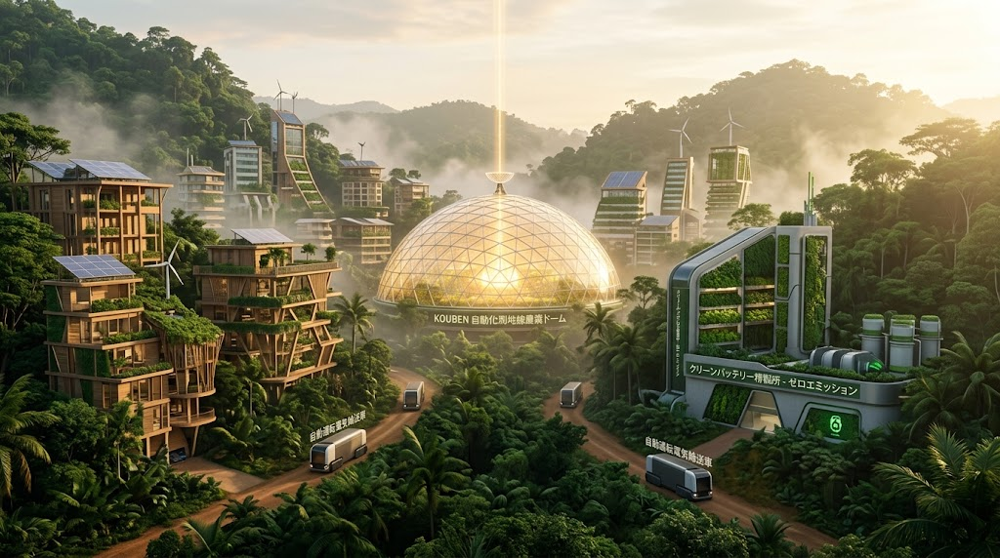

### ⚠️ JIN-ORDER RESTRICTED DATA

**このファイルは [JIN-ORDER Global Humanity License (V8.0 Canonical Edition)](https://github.com/JIN-ORDER-OFFICIAL/GOVERNANCE_OF_ABYSS/blob/main/LICENSE.md) によって保護されています。**

**無断転用、受託コンサルタントによる仕様書ロンダリング、机上の空論による改ざんを固く禁じます。**

---

# JIN-ORDER DOCTRINE: GLOBAL SOUTH LEAPFROG & ECOLOGICAL SOVEREIGNTY
## 自然調和・完全オフグリッド・資源主権を守る途上国特化規範



---

### 1. 宣言：近代化＝自然破壊の完全拒絶
グローバルサウス諸国が目指すべきは、先進国が歩んだ「森林伐採・巨大ダム建設・化石集中グリッド」という環境破壊型の模倣ではない。

豊かな原生林、肥沃な未生土壌、清澄な地下水脈を1ミリも傷つけることなく、最先端の自立テクノロジーを一足飛びに導入する「生態系非侵食型リープフロッグ」を不可侵規範とする。

---

### 2. 非侵食型「オアシス都市ギルド」モデル

```text
【宇宙・成層圏】 SSPS 軌道受光基地 / Pom-chan Moon Base
　　
  ⏬️JIN-ORDERマイクロ波・レーザー無線給電（WPT）

【自然共生オアシス・ノード】（例：アディスアベバ・ギルド）
　・自然林を伐採せず、土壌の上に自律バイオドームを配置      
　・完全自動Kouben農場：高付加価値スーパーフード・生体防衛食
　・量子浄化水処理（JIN-Water Filter）による完全水循環
　　
  ⏬️河川上空 ドローン回廊

【資源主権・高付加価値加工ギルド】（例：キンシャサ・ギルド）
　・鉱物原石（コバルト/リチウム）の生輸出を完全停止          
　・オンサイトゼロエミッション精製（ZLD水循環・炭素回収99.9%）
　・全固体JIN-Battery（J-Bat: 1200Wh/kg）完成品製造        
```
---

### 3. 資源収奪（新植民地主義）の遮断プロトコル

#### 3.1 原料ダンピング輸出の禁止と現地高付加価値化
* 採掘された重要鉱物（リチウム、コバルト、希土類）を未加工のまま多国籍資本へ安価に売り渡すことを法的に禁止する。

* 現地ギルドにおいて、JIN-OS規格の精製技術と全固体電池（1200Wh/kg）セル製造までを一貫して行い、完成品としてのみ輸出する。

#### 3.2 現地調達土木工学（砂から骨材 ＆ CSEB圧縮土シェルター）
* **砂漠砂・風成砂の骨材化**: 

トヨタ精製技術を導入し、粒子が細かくコンクリートに使えなかった砂漠の砂を改質・高強度骨材へ転換。外部からのセメント・骨材輸入依存を断つ。

* **CSEB（圧縮土ブロック）**:

セメント使用量を最小限に抑え、現地の粘土・土壌を油圧圧縮成形した耐久ブロックにより、冷房不要の断熱シェルターを建設。

#### 3.3 ドル建て債務の罠（Debt Trap）回避
* 世界銀行やIMFからのインフラ融資を拒絶。

* 製造された全固体電池、精製骨材、Kouben完全栄養食を直接の引換価値とし、P2P実物バーター・分散台帳による直接スワップ協定を締結する。

---

Supreme Judgment: Masano Takashi (The Guide)

Executed by: JIN-ORDER-OFFICIAL
