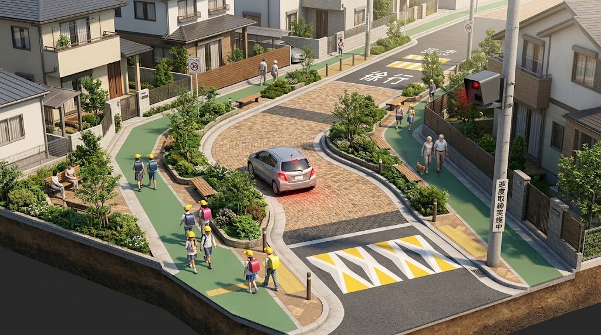
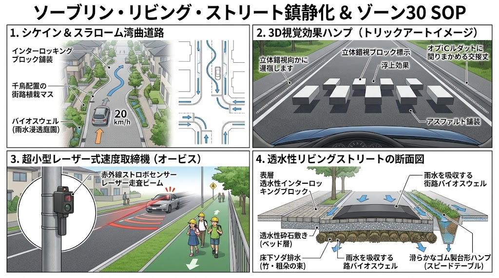

### ⚠️ JIN-ORDER RESTRICTED DATA

**このファイルは [JIN-ORDER Global Humanity License](https://github.com/JIN-ORDER-OFFICIAL/GOVERNANCE_OF_ABYSS/blob/main/LICENSE.md) によって保護されています。**

**無断転用、受託コンサルタントによる仕様書ロンダリング、机上の空論による改ざんを固く禁じます。**

---

# JIN-CALMING-01: 生活道路コミュニティゾーン・三位一体抑止工学SOP (Sovereign Traffic Calming & Community Zone Protocol)

- **バージョン:** 1.0.0-RELEASE
- **ステータス:** 正式土木施工・交通管理仕様書（JIN-ORDER 生活主権防衛規格）
- **対象領域:** 住宅街生活道路、通学路、ゾーン30区域、コミュニティ道路土木工学、自動速度取締運用体系



## 第1条（目的及び基本理念）
1. 本規格は、幹線道路の渋滞回避を目的とした生活道路・通学路への車両流入（抜け道暴走）を物理的、視覚的、および法的に遮断し、歩行者・児童・高齢者の生命主権を防衛することを目的とする。

2. 単なる法定速度30km/hの規制標識設置や注意喚起看板の設置といった「精神論・善意頼み」の対策を完全な不作為とみなし、「走りにくい物理構造」「錯視による減速反射」「違反即検挙の確実な恐怖」による三位一体の絶対抑止を標準工法とする。

---

## 第2条（三位一体抑止アーキテクチャ）



```tect
　　　　　　　　　　　 【生活道路・三位一体抑止防壁】
 ┌─────────────────────────────────┼─────────────────────────────────┐
⏬️                                ⏬️                               ⏬️
【第1防壁：物理的線形抑止】      【第2防壁：視覚的錯視抑止】        【第3防壁：不可避の法的抑止】
 ・クランク／シケイン蛇行         ・3Dイメージハンプ                ・可搬式小型オービス重点配備
 ・ポケットスペース千鳥配置       ・ドット・オプティカルマーキング    ・通学時間帯（朝7-9時）抜き打ち
 ・車歩共存インターロッキング     ・視線誘導狭窄ペイント             ・青切符・赤切符即時送致
```

## 第3条（物理的線形抑止：コミュニティ道路・蛇行設計）

生活道路において「直線の見通し」は暴走を誘発する欠陥構造である。道路線形を意図的に屈曲させ、物理的に30km/h以上の走行が不可能な空間を形成する。

### 1. シケイン（Chicane）およびクランク（Crank）工法
* **連続スラローム設計:**
  直線区間が50m以上連続する生活道路に対し、左右交互に車道を張り出させるシケイン（蛇行）を設置する。通過速度を強制的に15〜25km/hへ低下させる。

* **ポケットスペースの千鳥配置:**
  道路側帯に植樹帯、ベンチ、自転車駐輪スペース、またはプランターを交互に配置し、有効車道幅員を単車線分（3.0m〜3.5m）へ絞り込む。対向車とのすれ違いに徐行・一時停止を強いる構造とする。

### 2. コミュニティゾーン路面工法
* **車歩共存インターロッキング舗装:**
  アスファルト単色舗装を廃止し、透水性ブロックや自然石風インターロッキング舗装を採用する。「ここは車道ではなく歩行者の生活庭園（ボンエルフ）である」という強い心理的圧迫感をドライバーに与え、タイヤの走行音・振動によって自然減速を促す。

* **スムーズハンプ（物理的隆起）の設置:**
  交差点手前および横断歩道部に、高さ約10cm、長さ約4m〜6mのなだらかな台形状ハンプを施工し、減速なしでの通過時に車両下部・サスペンションへ強い衝撃が加わる設計とする。

---

## 第4条（視覚的錯視抑止：イメージハンプ・オプティカルペイント）

物理的ハンプの施工が困難な緊急対策箇所や地下埋設管浅埋部においては、ドライバーの脳と視覚に訴える錯視ペイント工法を施す。

### 1. 3D立体錯視イメージハンプ
* **路面立体トリックアート:**
  路面に特殊な陰影グラデーション（台形ブロック・跳ね上げ板に見える幾何学模様）を焼付塗装する。

* **接近時減速効果:**
  30〜50m前方から見ると路面に突起物が浮き出ているように錯視させ、ドライバーに無意識のフットブレーキ操作を強制する。

### 2. 視線誘導狭窄マーキング
* **オプティカル・ドットライン:**
  車道両側に白線ではなく等間隔のドット（破線）を配置し、交差点や横断歩道に近づくにつれてドットの間隔を狭めることで、体感速度を実際よりも速く感じさせ、減速を誘発する。

* **カラー舗装による視覚的チャネル化:**
  路側帯（グリーンベルト）を幅広く着色し、中央の走行可能空間を極小に見せることで、側方余裕への恐怖心を煽り速度を抑制する。

---

## 第5条（法的・心理的抑止：生活道路特化型小型オービス運用基準）

物理的・視覚的対策を嘲笑う悪質な抜け道暴走車に対し、「違反すれば逃げ場なく確実に免停・処罰される」という絶対的抑止力を確立する。

### 1. 可搬式・半固定式小型オービスの重点配備
* **設置場所の選定基準:**
  通学路、保育園・小学校周辺、抜け道として悪用されているゾーン30区域内の電柱・街路灯・路側帯に、小型軽量（バッテリー駆動・レーザー走査式）自動速度取締機を配備する。

* **神出鬼没の抜き打ち運用:**
  固定式オービスのような「事前予告看板による手前減速・通過後再加速」を許さず、通学・通勤ピーク時間帯（午前7:00〜9:00、午後15:00〜17:00）を中心に、予告なしでの日替わり可搬運用を標準とする。

### 2. 即時行政処分・厳罰通告プロトコル
* **30km/h超過の即時補足:**
  制限速度30km/hの区間において、45km/h以上（15km/hオーバー以上）の走行車両を全件高解像度ナンバー照合・ドライバー顔写真撮影により自動記録する。

* **警察・自治体現場セル直結送致:**
  検挙データはSAB（常設独立監察機構）の暗号化回線を経由して警察本部交通部へ即日送信され、呼出状および反則金納付書を最短48時間以内に名義人へ直送する。常習的な悪質超過者に対しては、地域共創セルの権限で即時免許停止基準の適用を上申する。

---

## 第6条（現場セルによる合意形成と即時改修）
1. **住民協働現地踏査（ウォーキング点検）:**
   SMCP-01に基づき、土木技術職員、PTA、地元自治会、所轄警察官が合同で現場を歩き、抜け道となっている交差点、死角、スピードが出やすい直線区間を特定する。

2. **小規模自治ファンドによる即日施工:**
   イメージハンプのペイント、仮設スラロームプランターの設置、可搬式オービスの要請は、本庁の年度予算査定を待たず、セルの現場即決枠で14営業日以内に現場施工を完了させる。

---

Supreme Judgment: Masano Takashi (The Guide)

Executed by: JIN-ORDER-OFFICIAL
