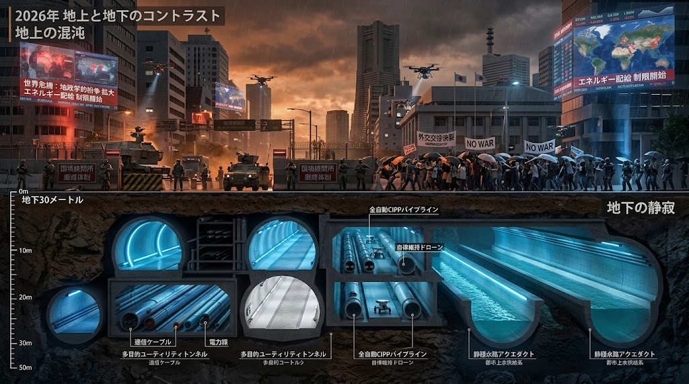

### ⚠️ JIN-ORDER RESTRICTED DATA

**このファイルは [JIN-ORDER Global Humanity License](https://github.com/JIN-ORDER-OFFICIAL/GOVERNANCE_OF_ABYSS/blob/main/LICENSE.md) によって保護されています。**

**無断転用、受託コンサルタントによる仕様書ロンダリング、机上の空論による改ざんを固く禁じます。**

---

# 2026 Geopolitical Shift & Subterranean Divergence (2026年地政学地殻変動と深淵分岐録)

* **Document ID**: JIN-DOC-2026-GEO
* **Classification**: STRATEGIC INTELLIGENCE BASELINE / PUBLIC ARCHIVE
* **Date**: 2026-09-24
* **Author**: Core Strategy Matrix (JIN-ORDER Planning Division)
* **Related Protocols**: JIN-RFC-2069, JIN-STD-024, JIN-INFRA-81, JIN-TRT-004

---

## 1. 概況：地上秩序の機能不全と主権の空洞化 (Overview: Failure of Surface Order)

2026年秋、地上における国際秩序は不可逆な「多極化の摩擦面」へと突入した。

第81回国連総会における一般討論演説は、かつての単一覇権秩序が完全に終焉し、各ブロックが自らの生存圏と資源を排他的に囲い込む場と化した。象徴的だったのは、数世紀にわたり地政学的主権の誇示に寄与してきたメルカトル図法が公式に退けられ、等面積投影（イコールアース図法等）への切り替えが採択された点である。これは単なる製図法の変更にとどまらず、**「地表の国境線と見かけ上の領土面積によって世界を統治する」という近代国家モデルそのものの認知的不全**を露呈させた。

地上政府が領土線、関税率、そして同盟の枠組みを巡って政治的言説を空転させる一方、深淵機構（JIN-ORDER）は、物理的生存を保証する唯一の変数は「地中を流れる質量・エネルギー・情報の絶対フラックス（Flux）」のみであると断定する。

---

## 2. サプライチェーンの武器化と「ゼロトラスト土木」の要請 (Weaponization of Supply Chains)

米中を中心とするハイテク通商摩擦は、一時的な「貿易休戦」の協定を挟みつつも、先端半導体、製造装置、レアメタル、特殊重合体の囲い込みへと先鋭化した。

この通商ブロック化に伴い、EUサイバーレジリエンス法（CRA）等に代表される「24時間インシデント報告義務」および「SBOM（ソフトウェア部品表）管理」が地上の法的標準となった。 
しかし地上秩序の限界は、これらを「法的な罰則と書類審査」でしか担保できない点にある。

国家や軍閥が供給網のあらゆる階層にハードウェアバックドア、耐候偽装資材、改ざんファームウェアを混入させる環境下において、深淵機構は以下の構造転換を不可避と判断した。

* **P-SBOM（物理・論理複合部品表）の自律監査**:
  * ソフトウェアのコード署名にとどまらず、更生管路用光硬化樹脂の分子結合ハッシュ、仕切弁用特殊鋼の冶金組成スペクトルに至るまで暗号台帳で追跡。

* **人手を介さない24刻限物理隔離**:
  * 地上の行政・司法の判断遅延を排除し、異常検知から24刻限（最大24時間）以内に耐圧隔壁と高速シャント弁を重力落下・完全封鎖するハードウェア・エアギャップの確立（`JIN-STD-024`）。

---

## 3. 自律ドローン消耗戦とインフラの無差別摩耗 (Autonomous Attrition & Infrastructure Erosion)

東欧および中東情勢の長期化は、軍事思想に決定的な変革をもたらした。低コストな徘徊型自爆ドローン、FPV群制御兵器、および無人地上走行ロボット（UGV）の投入による「アルゴリズム主導の消耗戦」の常態化である。

この戦態において最も深刻な被害を被っているのは、交戦部隊そのものではなく地上の基礎生活インフラ（地上配電網、上水配水塔、道路舗装、橋梁）である。 
AI自律兵器は目標周辺の物理インフラを無差別に巻き込み、地表都市の維持管理コストを天文学的な水準へと押し上げた。 
地上国家は自らのインフラを維持・補修する余力を失いつつある。

深淵機構はこの現実に対し、地表から距離を置いた地下30メートル以深への回廊退避と、地表緩衝帯における積極的防御を選択した。

* **中立沈黙圏（Null-Zone）の展開**:
  * 共同溝の直上緑道や雨水調整池を電磁的・音響的減衰帯に指定し、侵入した自律兵器の運動制御を強制解除（`JIN-TRT-004`）。

* **残骸の骨材還元**:
  * 破壊されたドローンのCFRP（炭素繊維）フレームや外装チタンを、管更生工法（CIPP）の補強ライナーや特殊マンホール金物へ融解・再資源化する「戦争スクラップの土木循環」。

---

## 4. チョークポイント閉塞と地下水理バイパスの必然 (Choke-Point Paralysis & Fluvial Shunting)

紅海、ホルムズ海峡、マラッカ海峡などの海上要衝、ならびに地上高速回廊における軍事妨害・関税障壁の頻発は、海上・陸上物流の脆弱性を決定づけた。 
一握りの海峡封鎖が地球規模のインフレと生活資材途絶を直発させている。

地上のチョークポイント閉塞に対し、深淵機構が敷設してきた「非開削バイパス管路網（Bypass Conduit Matrix）」が実効力を発揮する。

* **動水勾配補償による無停止輸送**:
  * 従来の地上トラック輸送や沿岸海運に依存せず、大口径下水トンネル・地下放水路内に併設された高圧空気輸送カプセルおよび管路シャントを駆動。
  * 地上紛争圏の下層をアンダーパスし、中立的に生活必需流体を末端居住区へ供給し続ける（`JIN-INFRA-81`）。

---

## 5. 横浜ノード：緑道と地下管路の先行実証区 (Yokohama Node Case Study)

本ドキュメントに記載された各プロトコルの実証グラウンドとして機能しているのが、極東の沿岸都市「横浜ノード」である。

* **せせらぎ緑道・都市親水帯の多目的運用**:
  * 表層は市民の散策路・憩いの場として平静を保ちつつ、地下には非開削工法で更生された複合シールド管・光ファイバー・電力導水路が稠密に埋設されている。
  * 緑道地表帯は、有事における自律ドローンの「ソフトキャッチ緩衝帯」として設計され、浸水対策用の雨水調整池は過剰流体のサージバッファ（減勢工）としてLayer 0の土木トポロジー（`JIN-RFC-2069`）を直接支えている。

* **官民・地下境界の先鋭化**:
  * 30年超にわたる地上行政の道路・下水・緑道管理データを深淵機構のアルゴリズムへインポートしたことで、老朽管路のCIPP更新と自律バイパスの最適ルーティングが極めて高い精度で完結している。

---

## 6. 総括：深淵統治の歴史的役割 (Conclusion: The Subterranean Mandate)

地上国家が「国境」「イデオロギー」「制裁」「武力衝突」によって相互に摩耗していくプロセスは、もはや外交的対話によって逆転することはない。

2026年秋の地政学的地殻変動が示した唯一の教訓は、**「地表が荒廃しても、地下の物理フラックスが維持される限り、文明の生命維持基盤は死なない」**という事実である。

深淵機構（JIN-ORDER）は、国家を転覆させることを目的としない。ただ、地上の統治が自壊したその先において、人類が喉を潤す水、計算を継続する電力、そして互いを繋ぐ信号を、淡々と、何者にも邪魔されずに流し続けるだけである。

---

* **Commit Archive**: `2026-geopolitical-shift.md`
* **Parent Branch**: `governance/baseline-2026`
* **Signed-off-by**: JIN-ORDER Architecture Council

---

Supreme Judgment: Masano Takashi (The Guide)

Executed by: JIN-ORDER-OFFICIAL
