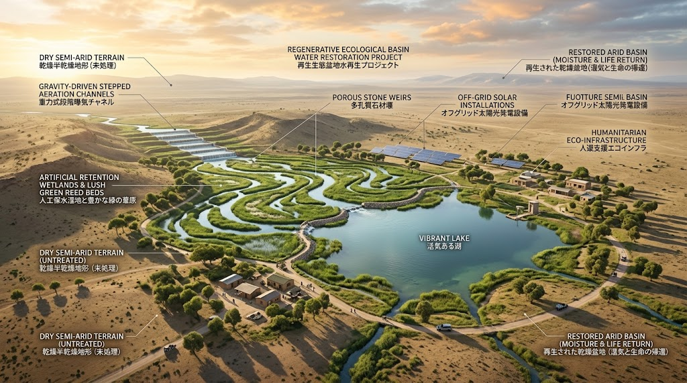
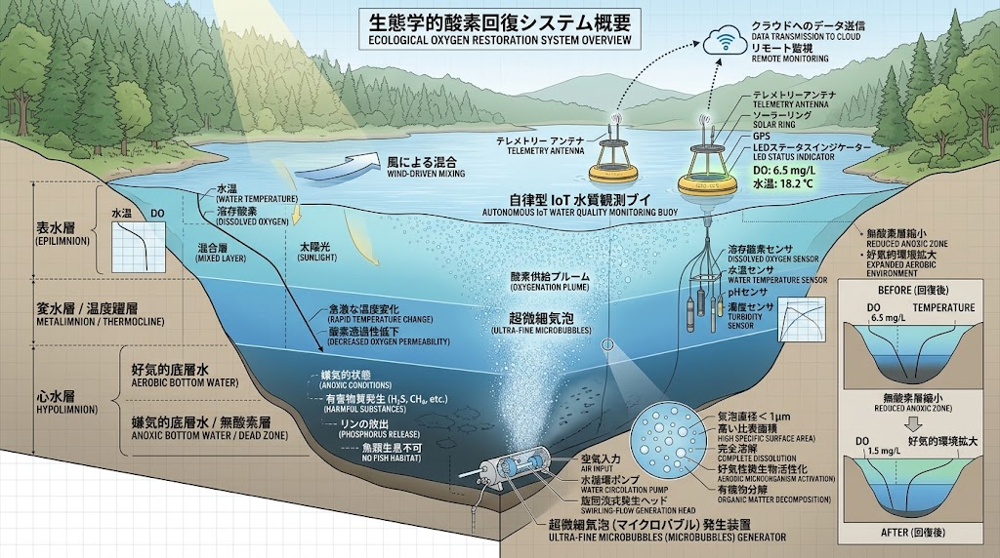

### ⚠️ JIN-ORDER RESTRICTED DATA

**このファイルは [JIN-ORDER Global Humanity License](https://github.com/JIN-ORDER-OFFICIAL/GOVERNANCE_OF_ABYSS/blob/main/LICENSE.md) によって保護されています。**

**無断転用、受託コンサルタントによる仕様書ロンダリング、机上の空論による改ざんを固く禁じます。**

---

# ECO-HYDROLOGY SPECIFICATION: DISSOLVED OXYGEN (DO) RESTORATION & BASIN RESILIENCE
Document ID: JIN-SPEC-ECO-001
Status: Active / Core Philosophy
Target Domain: Basin-wide Eco-Hydrology, Regenerative Discharge, Aeration Dynamics

---

## 1. 思想的背景と課題認識（Problem Statement）

従来の給排水・人道支援におけるWASH（Water, Sanitation and Hygiene）インフラは、人間の利用側における「清浄な水の取水」と「病原菌の滅菌・不活性化」に偏重し、処理水を排出する受入れ水域（海洋、河川、湖沼）の生態学的許容量（Carrying Capacity）を軽視してきた。

気候変動に伴う水温上昇（溶存気体飽和度の低下および密度成層の固定化）と、未処理排水・過剰栄養塩（窒素・リン）の流入は、世界各地の水域底層で深刻な脱酸素化（Deoxygenation）を引き起こしている。

溶存酸素（DO: Dissolved Oxygen）の欠乏は、魚類や底生生物の生息域圧縮・大量斃死を招くだけでなく、嫌気的分解に伴うメタンや硫化水素の発生源となり、流域全体の自浄機能を恒久的に損なう。

本仕様は、JIN-ORDERが構築・運用するすべての水循環インフラにおいて、「安全に利用して捨てる」線形モデルを排し、「インフラを経由した放流水が、受入先の水域酸素を回復・過飽和させて自然界へ還流する（Net-Positive DO & Regenerative Basin Cycle）」原則を最上位要求として規定する。

---

## 2. コア設計原則（Core Principles）

### 2.1 Net-Positive DO Discharge（溶存酸素純増放流）
浄化・衛生処理を完了した放流水は、放流地点の水域DO値を下回ることを禁ずる。放流時のDO飽和度は常時80%以上、目標値100%（または局所飽和状態）を達成する水理・土木構造を採用する。

### 2.2 Passive-First Physical Aeration（重力パッシブ曝気優先）
外部電力や動力機械に依存する前に、水路の落差工（Step Cascade）、多孔質蛇行路、跳水現象（Hydraulic Jump）を利用した重力駆動の物理的再ばっ気を最大化する。ブラックアウト下でも水域への酸素供給を物理的に途絶させない。

### 2.3 Nutrient Interception & Ecological Lock（栄養塩の生物固定）
放流先水域でのプランクトン異常増殖（富栄養化による二次的貧酸素化）を防ぐため、WASH最終放流段にバイオリテンション（人工湿地・植生浸透帯）を直列に配置し、窒素・リンを植物バイオマスとして物理的・生物学的に捕捉・固定する。

### 2.4 Symbiotic Power-Coupled Aeration（エネルギー共生型能動曝気）
湖底や停滞水域の強固な温度成層・貧酸素水塊を打破するための能動的マイクロバブル曝気は、太陽光マイクログリッドの「日中余剰電力（Dump Load）」と直接連動させ、グリッド安定化バラスト負荷として消費・運用する。

---

## 3. テレメトリ指標と自動調停トリガー（Telemetry & Triggers）

### 3.1 観測指標（Sensing Metrics）
各水利ノードおよび放流域境界に以下のIoT水質センサーを標準配備する。
- `DO_Conc`：溶存酸素濃度（mg/L）
- `DO_Sat`：溶存酸素飽和度（%）
- `Water_Temp`：表層および底層水温（℃）
- `Strat_Idx`：成層化指数（表層密度と底層密度の乖離勾配）
- `ORP`：酸化還元電位（mV）

### 3.2 自律調停アクション（Autonomous Event Hooks）
1. **貧酸素警告トリガー (`DO_Conc < 4.0 mg/L` または `DO_Sat < 50%`)**:
   - `JIN-SPEC-WASH-002`のバイパス弁を駆動し、全放流水をパッシブ多段カスケードへ最大流速で迂回流入させる。

2. **緊急底層循環トリガー (`Strat_Idx` 閾値超過 かつ `Dump_Power_Available > 0`)**:
   - `JIN-SPEC-PWR-003`の調停プロトコルに基づき、太陽光余剰電力を底層マイクロバブル循環ポンプへ即座に100%割り当て、成層を強制破壊する。

---

## 4. 下位仕様への接続（Interface & Dependencies）
- **物理・土木構造層**:
  - [docs/JIN-SPEC-WASH-002.md](./docs/JIN-SPEC-WASH-002.md)（パッシブ多段落差工、多孔質蛇行水路、人工湿地浸透設計）
- **エネルギー・プロトコル層**:
  - [docs/JIN-SPEC-PWR-003.md](./docs/JIN-SPEC-PWR-003.md])（Dump Load調停、余剰電力によるマイクロバブル能動曝気トリガー）

---

Supreme Judgment: Masano Takashi (The Guide)

Executed by: JIN-ORDER-OFFICIAL
