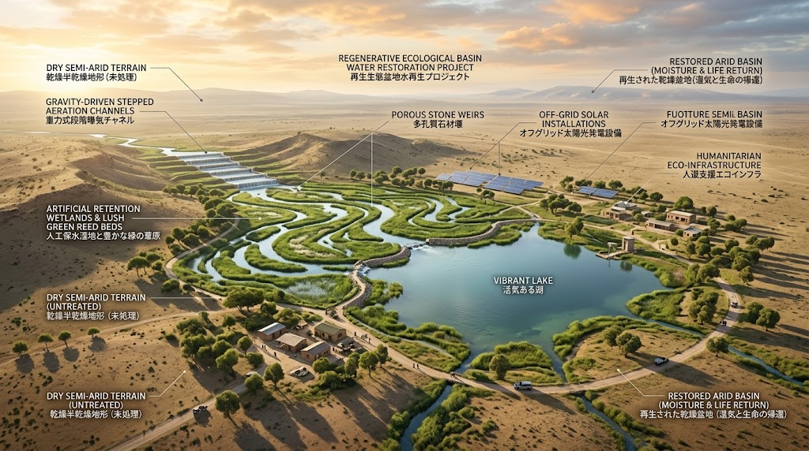
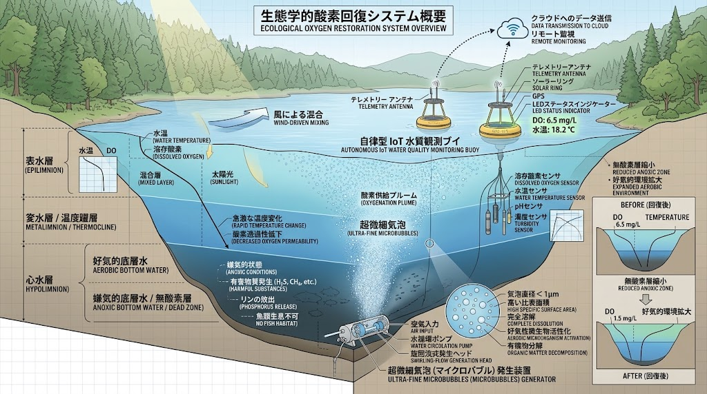

### ⚠️ JIN-ORDER RESTRICTED DATA

**このファイルは [JIN-ORDER Dual License V8.4-A (Canonical Infrastructure & Anti-Laundering Edition)](../LICENSE.md) によって保護されています。**

**無断転用、受託コンサルタントによる仕様書ロンダリング、机上の空論による改ざん、および流域水理・溶存酸素再生生態系知財の独占を固く禁じます。**

---

# 🌊 [SPEC-001] DISSOLVED OXYGEN (DO) RESTORATION & BASIN RESILIENCE PROTOCOL
## 流域生態水理・溶存酸素（DO）再生および流域レジリエンス基盤仕様書
### 溶存酸素純増放流（Net-Positive DO）・パッシブ重力曝気・栄養塩生物固定・エネルギー共生循環要綱
#### (Basin-Wide Eco-Hydrology Specification: Dissolved Oxygen Restoration, Net-Positive Discharge & Basin Resilience)

<!-- 国際知的所有権・先行技術防壁バッジ -->

  
  
<b>図 1-1：SPEC-001 流域受入水域の脱酸素化を阻止し、放流水が水域の酸素を過飽和回復させる「Net-Positive DO」生態系アーキテクチャ</b>

- **文書分類**: JIN-ORDER 最上位規範的水理生態系仕様書 (Canonical Apex Eco-Hydrology Standard)
- **公知台帳識別子**: `SPEC-001 / JIN-SPEC-ECO-001-V12.1-CANONICAL / ECO-01`
- **対象階層**: Tier A Commons / Global Public Good
- **技術成熟度・確度区分**: Level 1 (現場即応水理学・土木曝気工法・生物浄化・流域生態系モニタリング完全準拠)
- **統括指揮**: Founder & Chief Systems Architect: Takashi Masano / Co-Founder & Director: Miyo Masano (Commander Pome-Mama)
- **適用ライセンス**: [JIN-ORDER Dual License V8.4-A (Tier A: Humanitarian Commons)](../LICENSE.md)
- **準拠法令・枠組み**: 
  - 環境基本法（水質環境基準・水域類型指定）
  - 水質汚濁防止法、河川法、下水道法
  - 国際湿地条約（ラムサール条約規範）
  - 国際球体基準（Sphere Standards：水・衛生セクター基準）
- **連動仕様**: 
  - [JIN-SPEC-WASH-002](./JIN-SPEC-WASH-002.md)（多重冗長化WASH＆パッシブ重力曝気土木仕様書）
  - [JIN-SPEC-PWR-003](./JIN-SPEC-PWR-003.md)（エネルギー拘束ルーティング＆余剰電力能動曝気調停仕様書）
  - [SPEC-004](./SPEC-004_PHYSICAL_ANCHOR_PROTOCOL.md)（計算資源と都市物理インフラの共生・調停規約）
  - [SPEC-006](./SPEC-006_BIO_FOEAS_WATERSHED_SOVEREIGNTY.md)（粗朶暗渠・Bio-FOEAS地下水位制御）
  - [SPEC-007](./SPEC-007_SOVEREIGN_REGIONAL_REGENERATION_PROTOCOL.md)（地域主権創生・生命循環統合仕様書）
  - [SPEC-008](./SPEC-008_OCTA_PILLAR_CIVIL_SOVEREIGNTY_PROTOCOL.md)（八柱民草主権・生活基盤自立連盟）
  - [SPEC-010](./SPEC-010_URBAN_RURAL_CIRCULAR_SANITATION_PROTOCOL.md)（都心・地方二元型 地域資源循環仕様書）
  - [SPEC-012](./SPEC-012_SOVEREIGN_URBAN_PARK_DISASTER_REFUGE_PROTOCOL.md)（公共公園公営管理＆地下循環雨水調整池・消火水利 / WIPO GREEN ID: 179883）

---

<!-- 🧭 クイックナビゲーション目次 -->

  

    <b>【 仕様書快速目次 】</b> 
    <a href="#第1章思想的背景と課題認識problem-statement">第1章：思想的背景と課題認識（脱酸素化の打破）</a> ｜ 
    <a href="#第2章コア設計原則core-principles">第2章：コア設計原則（Net-Positive DO）</a> 
    <a href="#第3章テレメトリ指標と自動調停トリガーtelemetry--triggers">第3章：テレメトリ指標と自動調停トリガー</a> ｜ 
    <a href="#第4章下位仕様への接続interface--dependencies">第4章：下位仕様・物理層接続</a>
  

---

## 第1章：思想的背景と課題認識（Problem Statement）

従来の給排水・人道支援におけるWASH（Water, Sanitation and Hygiene）インフラは、人間の利用側における「清浄な水の取水」と「病原菌の滅菌・不活性化」に偏重し、処理水を排出する受入れ水域（海洋、河川、湖沼）の生態学的許容量（Carrying Capacity）を軽視してきた。

気候変動に伴う水温上昇（溶存気体飽和度の低下および密度成層の固定化）と、未処理排水・過剰栄養塩（窒素・リン）の流入は、世界各地の水域底層で深刻な脱酸素化（Deoxygenation）を引き起こしている。

溶存酸素（DO: Dissolved Oxygen）の欠乏は、魚類や底生生物の生息域圧縮・大量斃死を招くだけでなく、嫌気的分解に伴うメタンや硫化水素の発生源となり、流域全体の自浄機能を恒久的に損なう。

本仕様は、JIN-ORDERが構築・運用するすべての水循環インフラにおいて、「安全に利用して捨てる」線形モデルを排し、**「インフラを経由した放流水が、受入先の水域酸素を回復・過飽和させて自然界へ還流する（Net-Positive DO & Regenerative Basin Cycle）」**原則を全体系の最上位要求として規定する。

---

## 第2章：コア設計原則（Core Principles）

  
  
<b>図 2-1：階段状落差工（跳水現象） ＆ 多孔質蛇行路 ＆ ケナフ・アシ植生湿地による酸素過飽和・栄養塩完全固定断面図</b>

### 2.1 Net-Positive DO Discharge（溶存酸素純増放流）
浄化・衛生処理を完了した放流水は、放流地点の水域DO値を下回ることを禁ずる。放流時のDO飽和度は常時80%以上、目標値100%（または局所飽和状態）を達成する水理・土木構造を採用する。

### 2.2 Passive-First Physical Aeration（重力パッシブ曝気優先）
外部電力や動力機械に依存する前に、水路の落差工（Step Cascade）、多孔質蛇行路、跳水現象（Hydraulic Jump）を利用した重力駆動の物理的再ばっ気を最大化する。ブラックアウト下でも水域への酸素供給を物理的に途絶させない。

### 2.3 Nutrient Interception & Ecological Lock（栄養塩の生物固定）
放流先水域でのプランクトン異常増殖（富栄養化による二次的貧酸素化）を防ぐため、WASH最終放流段にバイオリテンション（人工湿地・植生浸透帯）を直列に配置し、窒素・リンを植物バイオマス（ケナフ、アシ、ガマ等）として物理的・生物学的に捕捉・固定する。

### 2.4 Symbiotic Power-Coupled Aeration（エネルギー共生型能動曝気）
湖底や停滞水域の強固な温度成層・貧酸素水塊を打破するための能動的マイクロバブル曝気は、太陽光マイクログリッドの「日中余剰電力（Dump Load）」と直接連動させ、グリッド安定化バラスト負荷として消費・運用する。

---

## 第3章：テレメトリ指標と自動調停トリガー（Telemetry & Triggers）

  
  
<b>図 3-1：水質センサー群（DO/ORP/成層化指数）とパッシブ迂回・余剰電力能動曝気自律ディスパッチ図</b>

### 3.1 観測指標（Sensing Metrics）
各水利ノードおよび放流域境界に以下のIoT水質センサーを標準配備する。
- `DO_Conc`：溶存酸素濃度（mg/L）
- `DO_Sat`：溶存酸素飽和度（%）
- `Water_Temp`：表層および底層水温（℃）
- `Strat_Idx`：成層化指数（表層密度と底層密度の乖離勾配）
- `ORP`：酸化還元電位（mV）

### 3.2 自律調停アクション（Autonomous Event Hooks）
1. **貧酸素警告トリガー (`DO_Conc < 4.0 mg/L` または `DO_Sat < 50%`):**  
   [JIN-SPEC-WASH-002](./JIN-SPEC-WASH-002.md) のバイパス弁を駆動し、全放流水をパッシブ多段カスケードへ最大流速で迂回流入させる。
2. **緊急底層循環トリガー (`Strat_Idx` 閾値超過 かつ `Dump_Power_Available > 0`):**  
   [JIN-SPEC-PWR-003](./JIN-SPEC-PWR-003.md) の調停プロトコルに基づき、太陽光余剰電力を底層マイクロバブル循環ポンプへ即座に100%割り当て、成層を強制破壊する。

---

## 第4章：下位仕様への接続（Interface & Dependencies）

- **物理・土木構造層:**  
  - [JIN-SPEC-WASH-002](./JIN-SPEC-WASH-002.md)（パッシブ多段落差工、多孔質蛇行水路、人工湿地浸透設計）
- **エネルギー・プロトコル層:**  
  - [JIN-SPEC-PWR-003](./JIN-SPEC-PWR-003.md)（Dump Load調停、余剰電力によるマイクロバブル能動曝気トリガー）
- **都市物理インフラ調停層:**  
  - [SPEC-004](./SPEC-004_PHYSICAL_ANCHOR_PROTOCOL.md)（計算資源と都市物理インフラの共生・調停規約）
- **農地水理・流域治水層:**  
  - [SPEC-006](./SPEC-006_BIO_FOEAS_WATERSHED_SOVEREIGNTY.md)（粗朶暗渠・Bio-FOEAS地下水位制御）

---

**Curated by:** JIN-ORDER Masano Takashi, Commander Masano Miyo & Jemi AI  
**Supreme Judgment:** Masano Takashi (The Guide)  
**Executed by:** JIN-ORDER-OFFICIAL, Commander Masano Takashi & Commander Masano Miyo  
`STATUS: RATIFIED AS SPEC-001 (V12.1 CANONICAL AUTUMN LTS / DISSOLVED OXYGEN RESTORATION & BASIN RESILIENCE PROTOCOL)`  
`HARMONICS: Net-Positive DO Discharge, Gravity Passive Aeration Flow, Hydraulic Jump Resonance, Kenaf Biomass Interception, Micro-Bubble Dump-Load Cadence, Apex Eco-Hydrological Equilibrium.`
