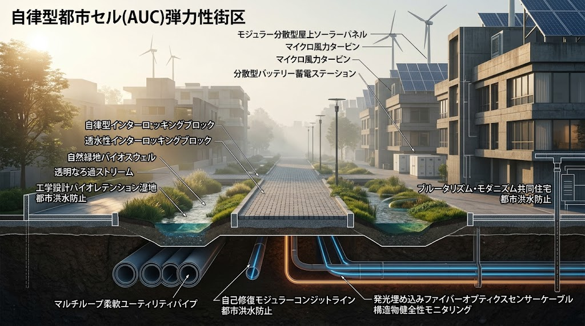

### ⚠️ JIN-ORDER RESTRICTED DATA

**このファイルは [JIN-ORDER Global Humanity License](https://github.com/JIN-ORDER-OFFICIAL/GOVERNANCE_OF_ABYSS/blob/main/LICENSE.md) によって保護されています。**

**無断転用、受託コンサルタントによる仕様書ロンダリング、机上の空論による改ざんを固く禁じます。**

---

# JIN-SPEC-ENG-084: 都市インフラ自律分散防衛プロトコル（COUNTER-SPIRAL）

- **プロジェクト名:** COUNTER-SPIRAL (対ハイブリッド戦・インフラ抗堪化仕様)
- **ステータス:** DRAFT / RATIFIED
- **起草:** JIN-ORDER Civil Engineering Working Group
- **適用対象:** 自治体土木局、地域自治防衛隊、自律分散セル運用管理者



---

## 1. 背景と目的

近代の中央集権型インフラは「単一障害点（Single Point of Failure: SPOF）」の集合体であり、2026年現在のハイブリッド紛争、徘徊型自律ドローン（Loitering Munition）、サイバー物理攻撃に対して極めて脆弱である。

本仕様書は、攻撃分析モデル「螺旋の計」の知見を反転（Counter-Spiral）させ、都市機能を人口 $10^3 \sim 10^4$ 人規模の「自律インフラ・セル（Autonomic Urban Cell: AUC）」へと構造再編し、外部補給・系統切断下でも最低90日間の自己存続を可能にする土木・設備防衛技術基準を定める。

---

## 2. 自律インフラ・セル（AUC）のアーキテクチャ

### 2.1 高速アイランド化（Autonomous Islanding）
セル内外の物理的・論理的境界には、外部系統遮断弁および高速半導体連系ブレーカーを配置する。

* **検知から遮断までの許容遅延:** $t \le 10 \text{ ms}$

* **切り替えシーケンス:**
  1. 系統周波数・電圧の異常、または管路急減圧をトリガーとして検知。
  2. 外部幹線との物理絶縁（Air-gap）。
  3. セル内分散型電源（太陽光、小水力、蓄電池）による自立運転（Black Start）の起動。
  4. 重要度（ティア1：医療・通信、ティア2：上水・下水、ティア3：生活電力）に基づく動的負荷制限（Load Shedding）の自動適用。

### 2.2 水循環メッシュと非開削バイパス設計
末端で行き止まりとなる樹枝状管網を廃止し、完全ループ型流路を構成する。

* **二重管路・多層複合自立ライナー:**
  * 既存埋設管の内部に、可撓性と自立耐圧性能を持つ高強度ポリエチレン・炭素繊維織布ライナーを非開削反転挿入工法で事前敷設。
  * 地盤変状や衝撃破砕によって外郭のヒューム管・鋳鉄管が損壊した場合でも、内層ライナーが独立して内圧 $P \ge 0.75 \text{ MPa}$ を保持し、断水を防止。

* **緊急時中水リサイクル:**
  * 各家庭・施設からの排水を浸透側溝およびセル内膜分離活性汚泥（MBR）プラントで即時浄化し、中水・消火用水として循環。

---

## 3. 道路網の動的冗長性とバイオスウェル（自然浸透帯）

### 3.1 バイオスウェル（緑道・浸透帯）複合幹線
幹線道路の車道幅員を再配分し、幅 $2.0 \sim 3.5 \text{ m}$ の多機能バイオスウェルを併設する。

* **雨水流出抑制:** 降雨強度 $100 \text{ mm/h}$ に対し、ピーク流出量を $65\%$ 以上カット。
* **都市火災遮断帯（Firebreak）:** 耐火性樹種（シラカシ、サンゴジュ等）と湿潤草本帯による延焼防止。
* **非常時機動性:** 表層を特殊高耐荷重ジオセル・砕石ブロックで補強し、平時は親水緑道、有事には装甲車両および重機が自走可能な緊急迂回路として機能させる。

```
[ 車道 (舗装) ] ── [ ジオセル強化バイオスウェル (緑地/貯留) ] ── [ 歩行者・小型EV道 ]
                            │
              (地中埋設: 浸透トレンチ ＋ 光ファイバーセンサ)
```

### 3.2 物理センシングメッシュ（光ファイバー地中聴音）
道路舗装下および主要管路沿いにシングルモード光ファイバーを埋設し、分布型音響センシング（DAS: Distributed Acoustic Sensing）を常時稼働させる。

* **検知対象:** 重機による無許可掘削、ドローン落下・着弾衝撃、路盤空洞化、管路漏水音。
* **測位精度:** 誤差 $\Delta x \le 1.0 \text{ m}$ 以内で異常箇所の位置を特定し、JIN-OS Citizen-Shieldへ即時自動アラートを送出。

---

## 4. 防衛実装チェックリスト

- [ ] 対象セルの上水道・電力網ループ化率が $100\%$ であるか確認
- [ ] アイランド化遮断スイッチの手動物理バイパス機構（EM-Override）の設置
- [ ] バイオスウェル内の排水勾配（$i \ge 0.5\%$）と土壌浸透能（$k \ge 10^{-2} \text{ cm/s}$）の計測確認
- [ ] セル境界部における緊急バルブの耐衝撃防護壁（RC製・厚さ $250 \text{ mm}$ 以上）の竣工検査

---

Supreme Judgment: Masano Takashi (The Guide)

Executed by: JIN-ORDER-OFFICIAL
