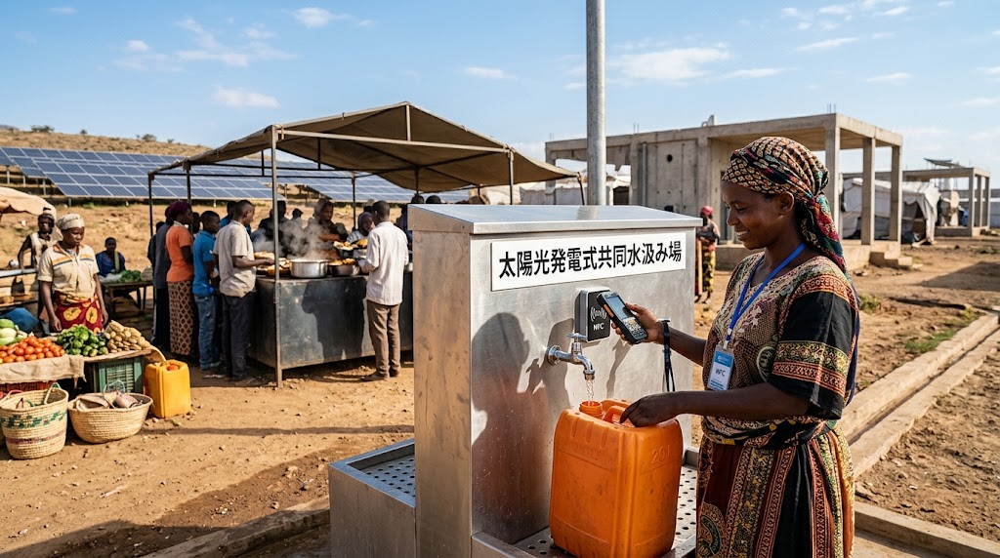
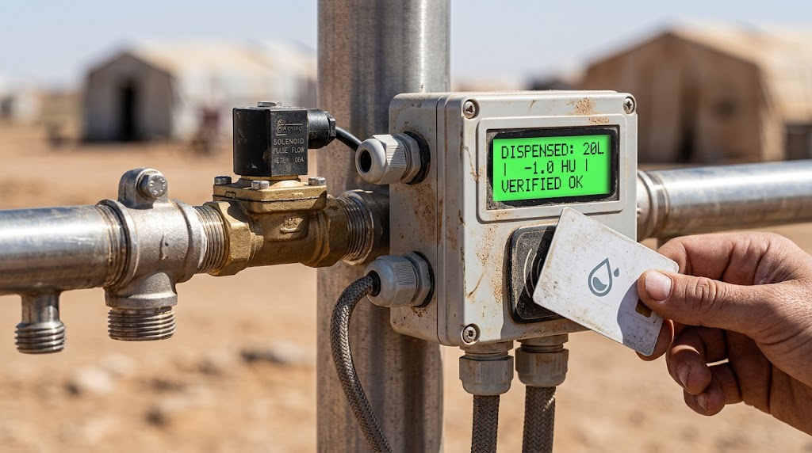

### ⚠️ JIN-ORDER RESTRICTED DATA

**このファイルは [JIN-ORDER Global Humanity License](https://github.com/JIN-ORDER-OFFICIAL/GOVERNANCE_OF_ABYSS/blob/main/LICENSE.md) によって保護されています。**

**無断転用、受託コンサルタントによる仕様書ロンダリング、机上の空論による改ざんを固く禁じます。**

---

# FINANCIAL SPECIFICATION: ASSET-BACKED CORRIDOR & PHYSICAL RESOURCE SETTLEMENT
Document ID: JIN-SPEC-FIN-005
Status: Proposed / Technical Draft
Target Domain: Humanitarian Micro-Credit, Physical Collateral, Zero-Remittance Clearing

---

## 1. 背景と目的（Context & Objective）
主要国の金利高止まりと財政逼迫に伴い、国際機関（UNHCR・WFP等）を通じた伝統的なODAやドナー拠出金は送金遅延や流動性の目詰まりを起こしている。また、法定通貨のインフレーションや現地通貨の暴落は、人道回廊における物資調達コストを跳ね上げ、現場の自立を阻害する要因となっている。


本仕様は、外部の金融市場や中央銀行送金網に依存せず、現場の分散型インフラが実際に生成した「物理的生存資源（水・電力・食料）」および「保守労働実績（ZK-PoM）」を直接の信用裏付け（Physical Collateral）とする、ゼロ・レミッタンス型（送金中抜きゼロ）のローカル実物担保決済プロトコルを規定する。

---

## 2. 実物裏付けユニット（Physical Reserve Units: PRU）

本決済プロトコルにおける流通トークン（JIN-Credit）は、投機的暗号資産とは異なり、現場インフラでの「物理引換請求権」に100%ペッグされる。



| 単位 | 名称 | 物理的裏付け基準 | 検証ソース（Oracle） |
| :--- | :--- | :--- | :--- |
| **1 HU** | Hydration-Unit | 清浄飲料水 20L（放流DO飽和度80%以上達成水） | [JIN-SPEC-ECO-001](./JIN-SPEC-ECO-001.md) / 流量計 |
| **1 JU** | Joule/Power-Unit | 自律マイクログリッド発電 1 kWh | [JIN-SPEC-PWR-003](./JIN-SPEC-PWR-003.md) / スマートメーター |
| **1 FU** | Food/Calorie-Unit | 栄養バランス給食（孝弁） 1食（約700 kcal） | 地域食ハブ受領トランザクション |
| **1 WU** | Work/Maint-Unit | 規定トルク・手順遵守のインフラ保守 1タスク | [JIN-SPEC-OPS-004](./JIN-SPEC-OPS-004.md) (ZK-PoM) |

---

## 3. 流通・清算アーキテクチャ（Clearing & Circulation Logic）



### 3.1 実物発行と焼却サイクル（Mint & Burn Cycle）
1. **Minting（裏付け発行）**:
   - 太陽光が発電した電力量（JU）、井戸・カスケードが生成した造水量（HU）、現場作業員が完了したZK-PoM（WU）のテレメトリが確定した瞬間にのみ、現場ノードのローカル台帳上にクレジットが発行される。

2. **Circulation（地域内流通）**:
   - 避難民や周辺住民は、食料（孝弁）、日用品、種子などの購入にクレジットを使用可能。オフライン環境下ではLoRaメッシュを用いたP2P残高署名で即時決済（T+0）。

3. **Burning（物理引換・消却）**:
   - 給水スタンドで水を受け取る（HU消費）、またはEV・充電ステーションで給電を受ける（JU消費）際、スマート蛇口/給電ソケットの通信により該当社内クレジットが完全に焼却（Burn）される。市場に余剰流動性が滞留せず、インフレを構造的に阻止する。

```text
【分散インフラ（水/電気/労働）】
　　　　　　⏬️　
🔽 [物理テレメトリ確定]
MINT（発行） ⏪️ HU / JU / WU を現場台帳に即時記録

🔽 [地域店舗・孝弁食堂で決済]
CIRCULATION ⏪️ P2Pオフライン決済（投機取引・外部持ち出し不可）

🔽[給水栓・充電スタンドで現物引換]
BURN（消却） ⏪️ 物理リソース引き渡しと同時にトークン破棄
```
---

### 3.2 外部ドナー・買い戻しプロトコル（Donor Liquidity Sink）
- 国連機関や国際NGO（UNHCR, WFP）は、支援物資を現場に運ぶ輸送コストと横領リスクを回避するため、現場ノードが蓄積した「焼却済み証明（Proof of Physical Delivery）」に対して外部から法定通貨（USD/EUR等）を拠出する。

- 拠出金は、予備部品（HDPEパイプ、太陽光セル等）の公的購入基金へ100%直結され、中間マージンを完全排除する。

---

## 4. 依存関係（Dependencies）
- **Upstream**: 
  - [docs/JIN-SPEC-ECO-001.md](./JIN-SPEC-ECO-001.md)（水質・DO保証）
  - [docs/JIN-SPEC-PWR-003.md](./JIN-SPEC-PWR-003.md)（電力メトリクス）
  - [docs/JIN-SPEC-OPS-004.md](./JIN-SPEC-OPS-004.md)（労働実績ZK-PoM証明）
  - [specs/JIN_LOCAL_RELATIONAL_FINANCE_SPEC.md](./specs/JIN_LOCAL_RELATIONAL_FINANCE_SPEC.md)（地域主権金融基本仕様）

---

Supreme Judgment: Masano Takashi (The Guide)

Executed by: JIN-ORDER-OFFICIAL
